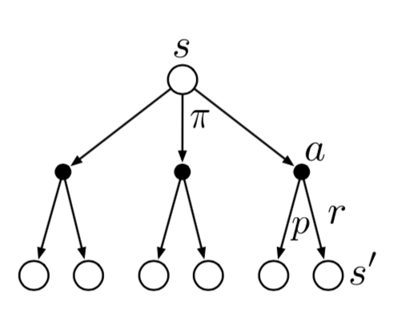

## MAB

Multi-armed Bandit

### 基本

#### 预期的奖励 $q_{*}(a)$

$$
q_{*}(a) \doteq \mathbb{E}[R_t|A_t=a]
$$

虽然不知道 $q_*(a)$ 的真实值，但可以进行估计，在时间步 $t$ 选择的行为 $a$ 的价值估计表示为 $Q_t(a)$，我们希望$Q_t(a)$ 接近 $q_*(a)$ 。

#### 估计的奖励 $Q_t(a)$ 

- 样本平均
  $$
  \begin{aligned}
  Q_{n+1} &= \frac{1}{n}\sum_{i=1}^{n}R_i \\
          &= Q_n + \frac{1}{n}(R_n - Q_n)    
  \end{aligned} \tag {2.3}
  $$

- 固定 $\alpha $

  又称指数新近加权平均（exponential recency-weighted average）。
  $$
  \begin{split}\begin{aligned}
  Q_{n+1} &= Q_n + \alpha(R_n - Q_n) \\
  &= \alpha R_n + (1-\alpha)Q_n \\
  &= \alpha R_n + (1-\alpha)[\alpha R_{n-1} + (1-\alpha)Q_{n-1}] \\
  &= \alpha R_n + (1-\alpha)\alpha R_{n-1} + (1-\alpha)^2 \alpha R_{n-2} + \\
  & \qquad \qquad \qquad\dots + (1-\alpha)^{n-1}\alpha R_1 + (1-\alpha)^nQ_1 \\
  &= (1-\alpha)^nQ_1 + \sum_{i=1}^{n}\alpha(1-\alpha)^{n-i}R_i
  \end{aligned}\end{split}  \tag {2.6}
  $$
  StepSize 参数 $\alpha \in (0, 1]$ 是常数。 $Q_{n+1}$ 是所有过去奖励（包括初始估计 $Q_1$）的加权平均值。
  
- 非固定 $\alpha$
  $$
  \begin{split}\begin{aligned}
  Q_{n+1} &= Q_n + \alpha_{n}(R_n - Q_n) \\
  &= \alpha_{n} R_n + (1-\alpha_{n})Q_n \\
  &= \alpha_{n} R_n + (1-\alpha_{n})[\alpha_{n-1} R_{n-1} + (1-\alpha_{n-1})Q_{n-1}] \\
  &= \alpha_{n} R_n + (1-\alpha_{n})\alpha_{n-1} R_{n-1} + (1-\alpha_{n})(1-\alpha_{n-1})\alpha_{n-2} R_{n-2} + \\
  & \qquad \qquad \qquad \dots + 	\prod\limits_{i=2}^n  (1-\alpha_{i})\alpha_{1} R_1 + 	\prod\limits_{i=1}^n(1-\alpha_{i})Q_1 \\
  &= \left( \prod\limits_{i=1}^n(1-\alpha_{i})\right)Q_1 + \sum_{i=1}^n \left(\alpha_i  \prod\limits_{k=i+1}^n(1-\alpha_{k}) \right)R_i
  \end{aligned}\end{split}
  $$
  其中 $\prod\limits_{k=n+1}^n(1-\alpha_{k}) = 1 $

- 非固定 $\beta$

  样本平均是对行为价值的无偏估计，而固定 StepSize 的方法会产生偏差。然而，样本平均在非平稳问题上表现不佳。那么，是否有可能避免恒定 StepSize 的偏差，同时保留其对非平稳问题的优势呢？方法之一是使用如下 StepSize 参数：
  $$
  \beta_n \doteq \alpha / \overline{o}_n \tag {2.8}
  $$

  $$
  \begin{split}\begin{aligned}
  \overline{o}_n \doteq \overline{o}_{n-1} + \alpha(1-\overline{o}_{n-1}) \  & \ \ \ \ \ \ for\ n \ge 0, \ \ with\ \ \overline{o}_0 \doteq 0   
  \end{aligned}\end{split} \tag {2.9}
  $$

  求解后公式如下：
  $$
  \begin{split}\begin{aligned}
    \beta_n = \frac \alpha {1-  (1-\alpha)^{n}  }
  
    \end{aligned}\end{split}
  $$

### greedy 方法

$$
A_t \doteq  \mathop{argmax} \limits_{a} \ Q_t(a)
$$

###  $\varepsilon \text - greedy$ 方法

$$
A_t \doteq  
\begin{equation}\left\{  
\begin{array}{lcl}  
\mathop{argmax} \limits_{a} \ Q_t(a)        &  &  {with\ probability }\  1 - \varepsilon \\  
 any\ action(a) &  &  {with\ probability }\  \varepsilon   
\end{array}  
\right.\end{equation}
$$

### UCB 方法

UCB方法根据行为成为最佳的潜力来进行探索。公式如下：
$$
A_t \doteq \mathop{argmax} \limits_{a} \left[Q_t(a) + c \sqrt{\frac{\ln{t}}{N_t(a)}}\right]  \tag {2.10}
$$
$N_t(a)$ 表示在时间 $t$ 之前选择行为 $a$ 的次数，$c>0$ 表示控制探索的程度。

### 梯度算法

学习每一个行为的偏好度（preference），其表示为 $H_t(a)$。偏好度越大，选择该行动的概率越大。这个行动概率是根据 soft-max 分布（又称 Gibbs 或 Boltzmann 分布）计算的。公式如下：
$$
Pr\{A_t=a\} \doteq \frac{e^{H_t(a)}}{\sum_{b=1}^{k}e^{H_t(b)}} \doteq \pi_t(a) \tag {2.11}
$$
$\pi_t(a)$ 表示在时间 t 选择行动 a 的概率。

基于随机梯度上升的思想，行为偏好度的更新算法如下。
$$
\begin{split}\begin{aligned}
H_{t+1}(A_t) &\doteq H_t(A_t) + \alpha(R_t-\overline{R}_t)(1-\pi_t(A_t))， &and \\
H_{t+1}(a) &\doteq H_t(a) - \alpha(R_t-\overline{R}_t)\pi_t(a)，&for \ a \ne A_t
\end{aligned}\end{split} \tag {2.12}
$$
其中 $\alpha>0$ 是 Step-Size 参数。 $\overline{R}_t$ 表示到时间步 t 为止奖励的平均值。 $\overline{R}_t$ 作为奖励的基线（baseline）。 如果奖励高于基线，那么将来获取 $A_t$ 的概率增加; 反之，如果奖励低于基线，则概率降低。对于那些非$A_t$ 的行为，其概率的变化方向和 $A_t$ 相反。

## MDP

Markov Decision Process

### 动力学函数

函数 $p $ 定义了MDP的动力学函数（dynamics function），即 $$p: \mathcal{S} \times \mathcal{R} \times \mathcal{S} \times \mathcal{A} \to [0, 1]$$。
$$
p(s^\prime,r|s,a) \doteq Pr\{S_t=s^\prime,R_t=r|S_{t-1}=s,A_{t-1}=a\}  \tag {3.2}
$$
满足如下性质。
$$
\sum_{s^\prime \in \mathcal{S}}\sum_{r \in \mathcal{R}}p(s^\prime,r|s,a)=1，for\ all \ s \in \mathcal{S}，a \in \mathcal{A}(s) \tag {3.3}
$$
状态转移概率（state-transition probabilities）$p : \mathcal{S} \times \mathcal{S} \times \mathcal{A} \to [0, 1]$ 。
$$
p(s^\prime|s,a) \doteq Pr\{S_t=s^\prime|S_{t-1}=s,A_{t-1}=a\}=\sum_{r\in\mathcal{R}}p(s^\prime,r|s,a) \tag {3.4}
$$
状态-行为对（pairs）的预期奖励，$r : \mathcal{S} \times \mathcal{A} \to \mathbb{R}$。
$$
r(s,a)\doteq\mathbb{E}\left[R_t|S_{t-1}=s,A_{t-1}=a\right]=\sum_{r\in\mathcal{R}}r\sum_{s^\prime\in\mathcal{S}}p(s^\prime,r|s,a) \tag {3.5}
$$
状态-行动-下一状态三元组（triples）的预期奖励，$r : \mathcal{S} \times \mathcal{A} \times \mathcal{S} \to \mathbb{R}$。
$$
r(s,a,s^\prime)\doteq\mathbb{E}\left[R_t|S_{t-1}=s,A_{t-1}=a,S_t=s^\prime\right]=\sum_{r\in\mathcal{R}}r\frac{p(s^\prime,r|s,a)}{p(s^\prime|s,a)}   \tag {3.6}
$$

### 情节任务

$$
G_{t} \doteq R_{t+1} +R_{t+2} + R_{t+3} + \dots + R_{T}  \tag {3.7}
$$

### 持续任务

$$
G_{t} \doteq R_{t+1} + \gamma R_{t+2} + \gamma^2 R_{t+3} + \dots = \sum_{k=0}^{\infty}\gamma^k R_{t+k+1}
$$

$$
\begin{split}\begin{aligned}
G_{t} &\doteq R_{t+1} + \gamma R_{t+2} + \gamma^2 R_{t+3} + \gamma^3 R_{t+4} + \dots \\
&= R_{t+1} + \gamma(R_{t+2} + \gamma R_{t+3} + \gamma^2 R_{t+4} + \dots) \\
&= R_{t+1} + \gamma G_{t+1}
\end{aligned}\end{split}
$$

满足 $0 \leq\gamma \leq 1$。

### 情节和持续任务的统一符号

$$
G_t \doteq \sum_{k=t+1}^{T} \gamma^{k-t-1} R_k  \tag {3.11}
$$

其中 $T = \infin$ 或者 $\gamma = 1$ （但不同时满足）。

### 状态价值函数

状态 $s$ 下，策略 $\pi$ 下的 *价值函数（value function）*表示为 $v_\pi(s)$，是从 $s$ 开始，遵循策略 $\pi$ 的预期收益。定义如下：
$$
v_\pi(s) \doteq \mathbb{E}_\pi\left[G_t|S_t=s\right]
= \mathbb{E}_\pi\left[\sum_{k=0}^{\infty} \gamma^k R_{t+k+1}|S_t=s\right]，对所有 s\in \mathbb{S} \tag {3.12}
$$

#### $v_\pi(s)$ 和 $q_\pi(s, a) $

$$
v_\pi(s) \doteq \mathbb{E}_\pi[q_\pi(S_t, A_t)|S_t=s]
$$

$$
v_\pi(s) \doteq \sum_{a}\pi(a|s) q_\pi(s, a)
$$

#### $v_\pi(s)$ 和 $v_\pi(s^\prime) $

$$
\begin{split}\begin{aligned}
v_\pi(s) &\doteq \mathbb{E}_\pi[G_t|S_t=s] \\
&= \mathbb{E}_\pi[R_{t+1} + \gamma G_{t+1}|S_t=s] \ \ \ \ \ \ \ \ \ \ \ \ (by\ (3.9)) \\
&= \sum_a\pi(a|s) \sum_{s^\prime}\sum_r p(s^\prime,r|s,a) \left[r+\gamma\mathbb{E}_\pi[G_{t+1}|S_{t+1}=s^\prime]\right] \\
&= \sum_a\pi(a|s) \sum_{s^\prime,r}p(s^\prime,r|s,a)[r+\gamma v_\pi(s^\prime)], \ \ \ \ \ \ for \ all \ s\in\mathcal{S}
\end{aligned}\end{split} \tag {3.14}
$$
上面公式被称之为 $v_\pi$ 的贝尔曼方程（Bellman equation）。它表达了状态价值与下一个状态价值之间的关系。

### 行为价值函数

在策略 $\pi$ 下，状态 $s$ 下采用行为 $a$ 的 *动作价值函数（action-value function）* 表示为 $q_\pi(s, a)$，是从 $s$ 开始， 遵循策略 $\pi$ 采用行为 $a$,的预期收益。定义如下：
$$
q_\pi(s,a) \doteq \mathbb{E}_\pi\left[G_t|S_t=s,A_t=a\right]
= \mathbb{E}_\pi\left[\sum^{\infty}_{k=0}\gamma^kR_{t+k+1}|S_t=s,A_t=a\right]  \tag {3.13}
$$

####  $q_\pi(s, a) $ 和 $v_\pi(s^\prime)$ 

$$
q_\pi(s, a) \doteq \mathbb{E}_\pi[R_{t+1} + \gamma v_\pi(S_{t+1})| S_t=s,  A_t=a]
$$

$$
q_\pi(s, a) \doteq \sum_{s^\prime,r}p(s^\prime,r|s,a) (r + \gamma v_\pi(s^\prime))
$$

####  $q_\pi(s, a) $ 和 $q_\pi(s^\prime, a^\prime)$ 

$$
\begin{split}\begin{aligned}
q_\pi(s, a) &\doteq \mathbb{E}_\pi[G_t|S_t=s,A_t=a] \\
&= \mathbb{E}_\pi[R_{t+1} + \gamma G_{t+1}|S_t=s,A_t=a] \ \ \ \ \ \ \ \ \ \ \ \ (by\ (3.9)) \\
&= \sum_{s^\prime}\sum_r p(s^\prime,r|s,a)   \left[r+\gamma\mathbb{E}_\pi[G_{t+1}|S_{t+1}=s^\prime, A_{t+1}=a^\prime]\right] \\
&= \sum_{s^\prime,r}p(s^\prime,r|s,a)  [r+\gamma \sum_{a^\prime}\pi(a^\prime|s^\prime)q_\pi(s^\prime, a^\prime)]   
\end{aligned}\end{split}
$$
上面公式被称之为 $q_\pi$ 的贝尔曼方程（Bellman equation）。它表达了行为价值与下一个行为价值之间的关系。

### 最优状态价值函数

$$
v_*(s) \doteq \max_\pi v_\pi(s)，  \ \ \ \ for \ all \ s\in \mathcal{S}  \tag {3.15}
$$

#### $v_*(s)$ 和 $q_*(s, a) $

$$
v_*(s) = \max_{a\in\mathcal{A}(s)} q_{\pi_*}(s,a)
$$

#### $v_*(s)$ 和 $v_*(s^\prime) $

$$
\begin{split}\begin{aligned}
v_*(s) &= \max_{a\in\mathcal{A}(s)} q_{\pi_*}(s,a) \\
&=\max_a \mathbb{E}_{\pi_*}[G_t|S_t=s,A_t=a] \\
&=\max_a \mathbb{E}_{\pi_*}[R_{t+1}+\gamma G_{t+1}|S_t=s,A_t=a]  \ \ \ \ & (by (3.9)) \\
&=\max_a \mathbb{E}[R_{t+1}+\gamma v_*(S_{t+1})|S_t=s,A_t=a] \ \ \ \ &( 3.18) \\
&=\max_{a\in \mathcal{A}(s)}\sum_{s^\prime,r} p(s^\prime,r|s,a)[r+\gamma v_*(s^\prime)] \ \ \ \  &(3.19)
\end{aligned}\end{split}
$$

### 最优行为价值函数

$$
q_*(s,a) \doteq \max_\pi q_\pi(s,a) \ \ \ \ for \ all \ s\in \mathcal{S}  \  and  \ a\in \mathcal{A} \tag {3.16}
$$

####  $q_*(s, a) $ 和 $v_*(s^\prime)$ 

$$
\begin{split}\begin{aligned}
q_*(s,a) &= \mathbb{E}\left[R_{t+1}+\gamma\sum_{a^\prime}q_*(S_{t+1,a^\prime})|S_t=s,A_t=a\right] \\
&=\sum_{s^\prime,r}p(s^\prime,r|s,a)[r+\gamma \max_{a^\prime}q_*(s^\prime,a^\prime)] \\
&=\sum_{s^\prime,r}p(s^\prime,r|s,a)[r+\gamma v_*(s^\prime)] 
\end{aligned}\end{split}
$$

#### $q_*(s, a) $ 和 $q_*(s^\prime, a^\prime)$ 

$$
\begin{split}\begin{aligned}
q_*(s,a) &= \mathbb{E}\left[R_{t+1}+\gamma\sum_{a^\prime}q_*(S_{t+1,a^\prime})|S_t=s,A_t=a\right] \\
&=\sum_{s^\prime,r}p(s^\prime,r|s,a)[r+\gamma \max_{a^\prime}q_*(s^\prime,a^\prime)]
\end{aligned}\end{split} \tag {3.20}
$$
