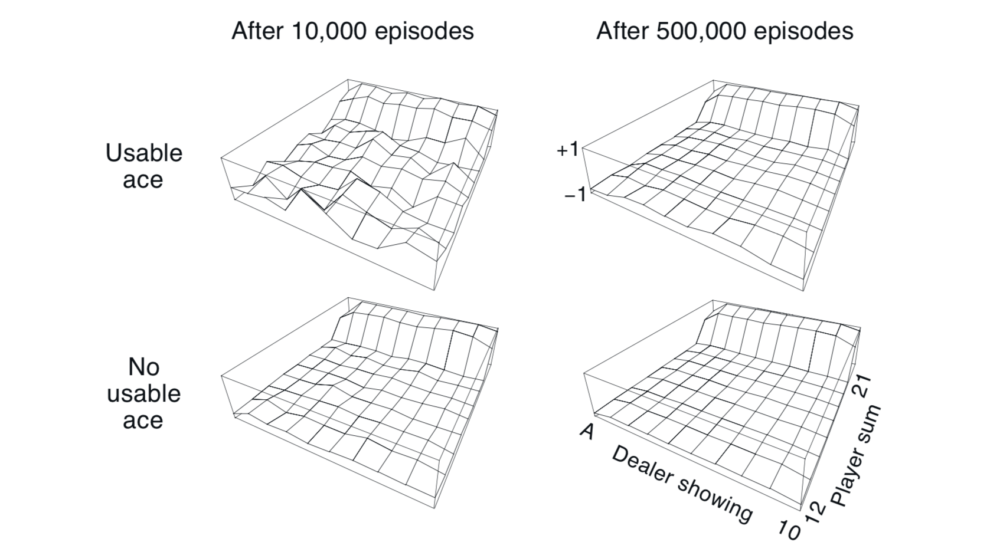
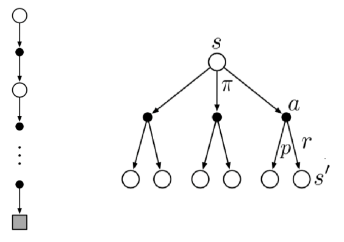
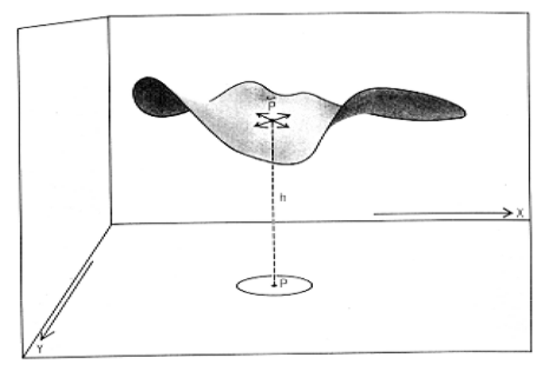
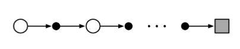
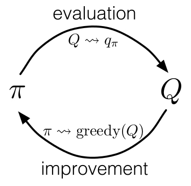
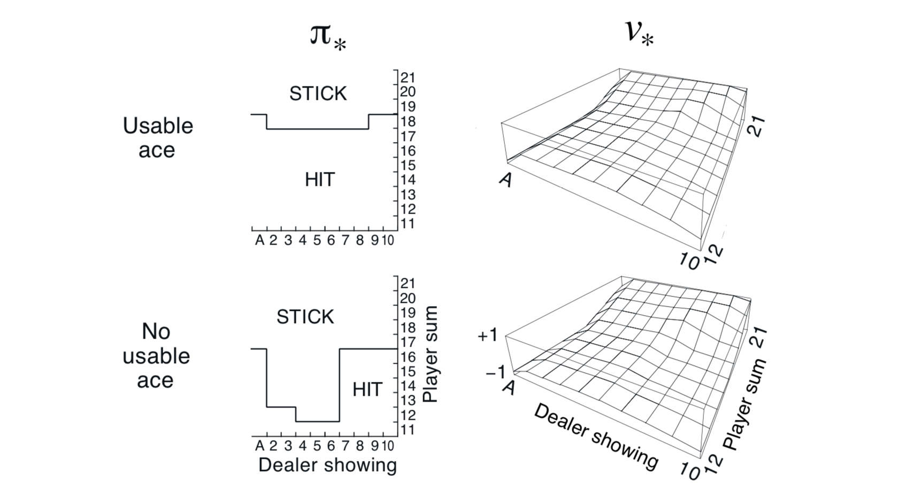
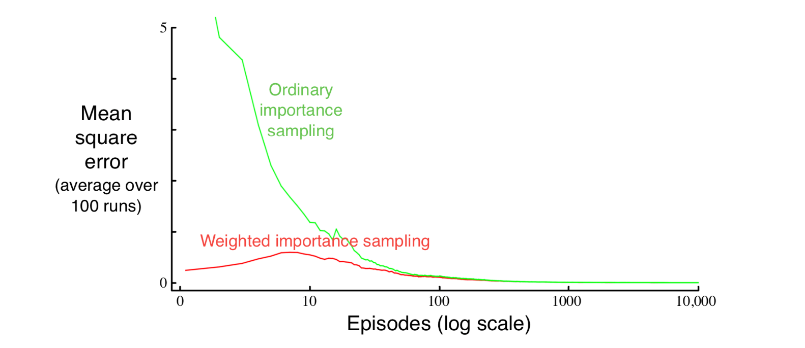

# 第一部分 表格解决方法

## 5 蒙特卡洛方法

Monte Carlo Methods

在本章中，我们首次介绍一种学习方法，它用于估计价值函数和发现最优策略。与上一章不同，这里我们假设对环境没有完全的了解。蒙特卡洛方法需要的仅仅是经验——与环境进行真实或模拟交互所得到的状态，动作，奖励的样本序列。从*真实* 经验中学习是非常吸引人的，因为不需要环境动态的先验知识，它仍然能够选择最佳动作。而从*模拟* 的经验中学习也是很强大的。虽然也需要一个模型，但是模型仅仅用来生成样本转换（ sample transitions），而不是动态规划（DP）所需的所有可能转换的完整概率分布。令人惊讶的是，根据所期望的概率分布生成经验样本很容易，但是要获取分布的具体形式却很难。

蒙特卡洛方法是基于对平均样本回报来解决强化学习的问题的。为了保证能够得到良好定义的回报，这里我们定义蒙特卡洛方法仅适用于 episode 任务。为了确保有明确定义的回报可用，我们只针对 episode 任务定义蒙特卡洛方法。也就是说，我们把经历划分为 episode ，而且无论选择什么动作，最终所有的 episode 都会终止。只有当 episode 结束以后，价值估计和策略才会改变。因此，蒙特卡洛方法可以在 episode-by-episode 之间增量，但不能在逐步（在线）（step-by-step (online) ）的意义上增量。术语 “蒙特卡洛（Monte Carlo）” 被广泛的用于任何的在操作中引入了随机成分的估计方法。我们在这里特指基于平均完整回报的方法（区别于那些从部分回报中学习的方法，我们将在下一章讨论）。

蒙特卡洛方法对每个状态-动作对进行采样和计算平均回报，就像我们在第2章中探索的 bandit 方法对每个动作进行采样和计算平均奖励一样。而区别是，现在有多个状态，每个状态都像一个不同的 bandit 问题（像关联搜索或情境bandit），而且不同的 bandit 问题是相互关联的。也就是说，在一个状态下采取一个动作后得到的回报取决于同一 episode 中后续状态下采取的动作。因为所有的动作选择都在进行学习，所以从早期状态的角度来看，这是一个非平稳的（nonstationary）问题。

为了处理非平稳性，我们采用第4章 DP方法中的广义策略迭代（GPI）思想。在那一章，我们根据MDP的知识计算价值函数，而在本章，我们从MDP的样本回报中学习价值函数。价值函数和相应的策略仍然以基本相同的（GPI）方式进行相互，从而达到最优。与 DP 章节一样，首先我们考虑预测问题（对任意固定的策略 $\pi$ 计算  $v_\pi$ 和 $q_\pi$），然后进行策略提升，最后由 GPI 进行控制并求解。从DP中得到的每一个想法都扩展到了蒙特卡洛方法中，只是它仅仅只有样本经验可用的。

### 5.1 蒙特卡洛预测

Monte Carlo Prediction

我们首先考虑用蒙特卡洛方法来学习给定策略下的状态价值函数。 回顾一下，一个状态的价值是从该状态往后的期望回报——即期望的累积未来折扣奖励。一个显而易见从经验中估计价值的方法是：简单地对访问该状态后观察到的回报求平均。随着观察到的回报越来越多，平均值应该收敛到期望值。这个想法是所有蒙特卡洛方法的基础。

特别地，假设我们想要估计 $v_\pi(s)$，即在策略 $\pi$ 下状态 $s$ 的价值，给定一组通过遵循 $\pi$ 并经过 s 获得的 episode 。 episode 中每次出现状态 $s$ 的情况都称为访问 $s$。当然，同一个 episode 中 $s$ 可能被访问多次。我们称 episode 中第一次访问 s 的时间为*首次访问（first visit）* 。有两种蒙特卡洛方法：

- *首次访问 MC 方法（ first-visit MC method）*将 $v_\pi(s) $ 估计为在第一次访问 $s$ 之后的回报的平均值。
- *每次访问 MC 方法（ every-visit MC method）*则将在所有访问 $s$ 之后的回报的平均值。

这两种方法非常相似，但在理论性质上略有不同。第一种方法是得到最广泛研究的，可以追溯到 20 世纪 40 年代，也是我们在本章重点关注的。第二种方法更自然地扩展到函数逼近（function approximation）和资格迹（eligibility traces），在第 9 章和第 12 章中讨论。首次访问 MC 方法如下框所示。而每次访问 MC 除了不检查 $s_t$ 是否在 episode 中早期出现过之外，其他都相同。

> **首次访问 MC 预测，估计 $V \approx v_\pi$,**
> $$
> \begin{flalign}
> &\text {输入（Input）：用来评估的策略} \pi   \\
> &\text {初始化（Initialize）：}   \\
> & \quad V(s)\in\mathbb{R} \\
> & \quad   Returns(s) \leftarrow \text {一个空的列表（List）}    \\
> &  \text {Loop forever (for each episode): }   \\
> &  \quad  \text {根据 } \pi \text { 生成情节：}  S_0, A_0, R_1, S_1, A_1, R_2, \dots , S_{T-1}, A_{T-1}, R_{T}  \\
> &   \quad G \leftarrow 0    \\
> &   \quad \text {Loop for each step of episode, }  t = T-1, T-2, \dots, 0 :  \\
> &   \quad \quad G \leftarrow \gamma{G} + R_{t+1}  \\
> &   \quad \quad \text {Unless } S_t \text { appears in }S_0, S_1,...,S_{t-1}:   \\
> &  \quad \quad  \quad \text {Append } G \text { to } Returns(S_t)    \\
> &   \quad \quad  \quad V(s) \leftarrow average(Returns(s))   \\
> \end{flalign}
> $$

不论是首次访问 MC 方法还是每次访问 MC 方法，都会随着访问 $s$ 的次数趋于无穷而收敛于 $v_\pi(s)$。对于首次访问MC方法，这是显而易见的。这种情况下，每个回报都是对于 $$v_\pi(s)$$ 的有限方差的独立同分布估计。根据大数定理，这些估计的平均数会收敛于期望价值。每个平均值本身就是一个无偏估计，其误差的标准差降为 $1 / \sqrt{n}$，其中 n 是回报的次数。每次访问 MC 方法没有那么直观，不过也会以二次方的速度收敛于 $v_\pi(s)$ （Singh and Sutton, 1996）。

**例5.1：21点（Blackjack）** *21点* 是一种流行的赌场纸牌游戏，其目标是获得牌的数字值之和尽可能大，但不超过21。 所有的J，Q，K记为10点，A可以算作1或11。我们考虑每个玩家独立地与庄家竞争的版本。具体规则如下：

1. 游戏开始时，庄家和玩家各发两张牌。庄家的其中一张牌是正面朝上的（明牌），另一张是正面朝下的。

2. 如果玩家起手就是 21 点（一张A和一张10点牌），则称为 *natural*。

     - 庄家也是 *natural* ，则称为 *draw*，也就是平局。

     - 庄家不是 *natural* ，则玩家赢，游戏结束。

3. 玩家不是21点，可以有三个动作：

     - hit：可以继续要一张牌。

       - 超过21点（goes bust）：玩家输，游戏结束。
       - 没有超过 21 点，回到第 3 步。
     
     -  stick：停止要牌。进入庄家轮次，即第 4 步。

4. 庄家按照如下固定策略来打牌

   - 当点数大于或等于 17 点，停止要牌（stick）。
     - 比较玩家和庄家点数。
       - 玩家大：玩家赢。
       - 庄家大：庄家赢。
       - 相同：平局（draw）
   - 当点数小于 17 点，要牌（hit）
     - 超过21点（goes bust）：玩家赢，游戏结束。
     - 没有超过 21点，回到第 4 步。

> 上述规则是精简版本的，完整的规则参考[技术帖－21点算法](https://www.douban.com/note/273781969/?_i=4852844S7HuVBz)。

很自然，21 点游戏可看成是一个 episode 有限 MDP 问题。每一局都是一个 episode 。赢得比赛，输掉比赛和平局分别获得+1、-1和0的奖励。游戏过程中的奖励为0，且没有衰减（即 $\gamma=1$）。玩家的动作只有要牌或者停止要牌两种。游戏的状态取决于玩家是什么牌以及庄家手上的明牌。 假设牌是从一个无限的牌堆中发出的（即，有替换），因此跟踪已经发出的牌没有什么用。如果玩家拥有一张 A 且当做11点来算还不超过21点的话，则称该 A 牌为 *可用（usable）*。在这种情况下，它总是被计为11，因为将其计为1会使总和小于或等于11，所以此时，显然玩家的选择是要牌。因此，玩家做出的决定依赖于三个变量：当前的牌的点数和（12-21）、庄家的明牌的点数（A-10）以及玩家是否有可用的 A。 这样的话，总共有200个不同的状态。

考虑这样的策略：一直要牌，直到点数和等于20或21时停止。为了通过蒙特卡洛方法来找到这个策略的状态价值函数，我们可以使用该策略模拟玩许多次游戏，然后计算每个状态后的平均回报。通过这种方法求得的价值函数如图5.1所示。 可以看到： 有可用 A 的状态的估计值不太确定且不太规则，但无论是否有可用 A，在500,000局游戏之后，价值函数都被近似的很好。

$$
\text {图5.1：遵循上文的策略，使用蒙特卡洛策略评估近似计算状态价值函数。}
$$
在这二十一点任务中，虽然我们对环境有完全的了解，但是仍然难以用 DP 方法来计算价值函数。 DP 方法需要下个事件的分布，特别是它需要由四个参数函数p给出的环境动态，而对于二十一点来说，这并不容易确定。例如，假设玩家的点数为14，他选择停止要牌。获得+1的奖励的概率是是庄家所展示的牌的一个函数。在运用 DP 之前，必须计算所有的概率，这样的计算通常是复杂和容易出错的。相比之下，使用蒙特卡洛方法仅仅只需要产生样本就好了，这要简单许多。 这种情况经常令人惊讶，蒙特卡洛方法仅使用样本回合（ episode） 就能工作的能力是一个重要的优势，即使在完全了解环境动态的情况下也是如此。

我们能否将 Backup 图的思想推广到蒙特卡洛算法中？Backup 图（下面右图）的一般思想是在顶部显示要更新的根节点，并在下面显示所有转换和叶节点，它们奖励和估计价值用于更新根节点的价值。对于 $v_\pi$ 的蒙特卡洛估计来说，根节点是一个状态节点，在它下面是沿着特定 episode 的转换轨迹，并以终止状态结束，如下面左图所示。DP 算法和蒙特卡洛方法之间的基本差异是：

- DP 图显示了所有可能的转换，蒙特卡洛图仅显示了在一个episode 中采样的转换。
- DP 图仅包括一步转换，而蒙特卡洛图一直延伸到 episode 的结束。这些图中的差异准确地反映了算法之间的基本差异。

蒙特卡洛方法的一个重要事实是，每个状态的估计值是独立的。一个状态的估计值不建立在任何其他状态的估计值之上，这与DP中的情况不同。换句话说，蒙特卡洛方法不像我们在前一章中定义的那样进行自助法（bootstrapping）。

特别要注意的是，单个状态价值计算的开销与状态数无关。 当我们只需要一个或者一小部分状态价值时，蒙特卡洛方法特别有吸引力。可以从感兴趣的状态开始生成许多样本 episode，仅计算这些状态的平均回报，而忽略所有其他的状态。 这是蒙特卡洛方法相对 DP方法的第三个优势。

**例5.2：肥皂泡（Soap Bubble）** 

$$
\begin{align}
\text {线圈上的肥皂泡, 来自 Hersh 和 Griego（1969）} \\ 
\end{align}
$$
假设将形成一个闭环的金属线框浸泡在肥皂水中，形成一个在其边缘符合线框形状的肥皂表面或泡沫。如果金属线框的几何形状是不规则的但已知的，你如何计算表面的形状呢？该形状具有这样的特性，即由相邻点施加在每个点上的总力为零（否则形状会改变）。这意味着表面在任何点的高度是该点周围小圆中点的高度的平均值。此外，表面必须在其边界处与金属线框相遇。解决这种问题的通常方法是在表面覆盖区域上放置一个网格，并通过迭代计算解决其在网格点的高度。边界处的网格点被强制靠近金属线框，而其他点则朝着它们四个最近邻点的高度的平均值调整。然后，这个过程迭代进行，类似于动态规划的迭代策略评估，并最终收敛到对所需表面的一个紧密近似。

这类问题与蒙特卡洛方法最初设计用来解决的问题相似。与上述迭代计算不同，想象站在表面上并进行一次随机漫步，以相等的概率随机从一个网格点跳到相邻的网格点，直到达到边界为止。结果表明，在边界的高度的期望值是所需表面在起始点的一个紧密近似（事实上，它恰好是上述迭代方法计算的值）。因此，可以通过简单地对从该点开始的许多漫步的边界高度进行平均，从而紧密地逼近该点的表面高度。如果只关心一个点的值，或者任何固定的小点集，那么这种基于蒙特卡洛方法的方法可能比基于局部一致性的迭代方法更加高效。

#### 练习5.1-5.2

- 练习5.1 参见图5.1右侧的图。为什么估计的价值函数在尾部的最后两行会突然变大？ 为什么最左边的整个一行价值会有下降？对于最前面的（frontmost）价值，为什么上面图中的值要大于下面的图？

  答：分别答案如下。

  - 两个原因：
    - 玩家点数20点或者21点时，赢面非常大。
    - 策略是当点数小于20，还会要牌，这样就有超过21点的可能，尤其是点数是18-19时。
  - 因为庄家的明牌是 A 的时候，其有较大概率可以赢，而且超过 21 点概率变小。
  - 当玩家有可用 A 时，减少了超过 21 点概率，赢面较大。

- 练习5.2 假设在 21 点任务中使用每次访问 MC 方法而不是首次访问 MC 方法。结果会有很大差异吗？为什么？

  答：差异不大。分两种情况分析：

  - 没有可用 A

    每一次要牌后，点数总是增加，所以之前的状态无法在后面重现。

  - 有可用 A

    每一次要牌后，

    - 如果还是处于有可用 A的状态，总的点数是增加地，所以之前的状态无法在后面重现。如果
    - 如果处于无可用 A的状态，之前的（有可用 A）状态也无法在后面重现。

### 5.2 动作价值的蒙特卡洛估计

Monte Carlo Estimation of Action Values

如果没有可用的模型，那么估计 *动作 价值*（即状态-动作对的价值）比估计 *状态价值* 更有用。 有了模型，仅使用状态价值就足以确定策略；只需向前看一步，选择能够带来最佳奖励和下一个状态组合的动作，就像我们在动态规划一章中所做的那样。然而，如果没有模型，仅仅使用状态值是不够的。 我们必须清楚地估计每个动作的价值，以使它们在建议策略时有用。 因此，蒙特卡洛方法主要用来估计 $q_*$。

为了实现这一点，首先考虑动作价值的策略评估问题，即估计 $q_\pi{(s,a)}$。即在状态s开始，执行动作a，然后遵循策略$\pi$时的期望回报。对于这个问题，蒙特卡洛方法基本上与刚刚介绍的状态价值问题相同，只是现在我们讨论对状态-动作对的访问，而不是对状态的访问。 

- 每次访问MC方法中，每次访问状态-动作对都会计算，最后求平均； 
- 首次访问 MC 方法每个 episode 只计算最多一次。

当访问次数趋近于无穷时，这两种方法（指每次访问 MC 和首次访问 MC）都会以二次方收敛到期望值。

唯一的问题是，可能会有许多状态-动作对从未被访问到。如果 $\pi$ 是一个确定性的策略， 那么遵循策略 $\pi$，每个状态将会仅仅观察到一个动作的回报。 对于未被访问的动作，没有回报，所以它们的蒙特卡洛的估计就不能随着经验的增加而提高。 这是一个严重的问题，因为我们学习动作价值，就是为了在每个状态选择合适的动作。 为了比较所有的可能，我们需要估计每个状态 *所有* 动作的价值，而不仅仅是当前动作。

这是一个很普遍的问题，即 *保持探索（maintaining exploration）*，我们在第二章 k-armed bandit 问题中提到过。 要使策略评估能够工作，我们必须保证持续的探索。其中一种方法是规定回合始于一个状态-动作对，并且每一对都有非零的概率被选为起始点。这保证在无限回合的极限情况下，所有的状态-动作对都会被访问无限次。我们称这种假设为 *探索开端（exploring starts）*。

这个 exploring starts 的假设有时是很有用的，但是它不具普遍意义，特别是当我们直接从与真实环境的交互中学习时，这种方法就不太适用了。 在这种情况下，起始状态不是很有用。 为了让所有状态-动作对都能访问到的，最常用的替代方法是采用随机策略，即每个状态下，选择任意动作的概率都不为零。 我们将会在后面的小节里讨论这种方法的两个变种。现在，我们保留 *exploring starts* 的假设，完整地介绍蒙特卡罗控制方法。

#### 练习5.3

- 练习 5.3 画出蒙特卡洛估计 $q_\pi$  的 backup 图？
  答：如下图所示。

  

### 5.3 蒙特卡洛控制

Monte Carlo Control

现在，我们开始考虑蒙特卡洛估计来解决控制问题，即求解近似最优的策略。 整个的过程和上一章动态规划的模式相同，我们依照广义策略迭代（GPI）的思想。 广义策略迭代（GPI）中，我们同时维持一个近似的策略和一个近似的价值函数。价值函数会被反复修改，以更接近当前策略的价值函数，而策略也会根据当前价值函数不断改进，如下的图所示。这两种变化在一定程度上相互作用，每种变化都为另一种变化指明了移动的方向，但是总的来说，它们共同使得策略和价值函数都趋向于最优。

首先，我们考虑经典的策略迭代的蒙特卡洛（MC）版本。我们交替执行策略迭代和策略提升的完整步骤。 从一个随机的策略 $\pi_0$ 开始，以最优策略和最优的动作-价值函数结束：
$$
\pi_0 \overset{E}{\rightarrow} q_{\pi_0} \overset{I}{\rightarrow} \pi_1 \overset{E}{\rightarrow} q_{\pi_1} \overset{I}{\rightarrow} \pi_2 \overset{E}{\rightarrow} \cdots \overset{I}{\rightarrow} \pi_{*} \overset{E}{\rightarrow} q_{*}
$$
其中，$\overset{E}{\rightarrow}$ 表示一个完整的策略评估，$\overset{I}{\rightarrow}$ 表示一个完整的策略提升。随着经历越来越多的 episode，近似的动作-价值函数逐渐趋近于真实的函数。 此时，我们假设观察到了无限个episode，而且这些 episode 都是以 exploring starts 的方式生成的。 在上述假设下，对应于任意 $\pi_k$，蒙特卡洛方法会精确地计算每个 $q_{\pi_k}$。

策略提升的方法是，对于当前的价值函数，使用 Greedy 方式来选择动作。而对于蒙特卡洛方法，因为我们有动作-价值函数，所以不需要模型来构建 Greedy 策略。 对于任何的动作-价值函数 $q$，它对应的贪婪策略是：对每个 $s \in\mathcal{S}$， 选择动作-价值函数最大的那个动作：
$$
\pi(s) \dot{=} arg \space \underset{a}{max} \space q(s,a)  \tag {5.1}
$$
基于此做策略提升，使用基于 $q_{\pi_k}$ 的贪婪策略构建每个 $\pi_{k+1}$  。 策略提升理论（见4.2节）可以应用到 $\pi_k$ 和 $ \pi_{k+1}$ 上， 因为对于所有 $s \in\mathcal{S}$，
$$
\begin{split}\begin{aligned}
q_{\pi_{k}}\left(s, \pi_{k+1}(s)\right) &=q_{\pi_{k}}(s, \arg \max _{a} q_{\pi_{k}}(s, a)) \\
&=\max _{a} q_{\pi_{k}}(s, a) \\
& \geq q_{\pi_{k}}\left(s, \pi_{k}(s)\right) \\
& \geq v_{\pi_{k}}(s)
\end{aligned}\end{split}
$$
通过这种方法，可以在不知道环境动态的情况下，仅靠样本 episode，使用蒙特卡洛（MC）方法）来找到最优策略。

为了保证蒙特卡洛方法的收敛性，我们有两个不太可能的假设：

- episode 采用 exploring starts 方式。
- 策略评估需要无限次 episode 

为了得到一个实际可用的算法，我们将不得不去掉这两个假设。 我们将在这一章的稍后部分讨论怎么去掉第一个假设。

现在，我们先考虑第二个假设，即策略评估需要无限次 episode 。这个假设相对容易去掉。事实上，相同的问题曾在上一章的经典 DP 方法中出现过。例如迭代策略评估只会渐进地收敛到真实价值函数。 无论是DP还是MC，有两种方法解决这个问题。

- 让每次策略评估都尽让接近 $q_{\pi_k}$。我们会使用一些方法和一些假设来获得误差的边界和概率，然后经过足够多的步骤后， 策略评估能够保证这些边界足够的小。这种方法可能可以在某种程度上保证正确的收敛，但是在实践中除了最小的问题之外，它也可能需要太多的 episode。
- 在进入到策略提升前，放弃完成策略评估。 在每次评估步骤中，价值函数向 $q_{\pi_k}$ 移动，经过很多步的移动，就能移动到期望的值。在第4.6节中首次介绍 GPI 的想法时，我们介绍了这个想法。它的一个极端形式是价值迭代，在策略提升之间执行一次迭代策略评估。价值迭代的 in-place 版本甚至更加极端；在那里，对单个状态，策略提升和策略评估是交替进行的。

对于蒙特卡洛策略评估而言，按照每个 episode 交替进行评估和提升是很自然的。在每个 episode 之后，观察到的回报用于策略评估，然后对每个经历的状态做策略提升。完整的简化算法如下所示，我们称它为 *探索开端的蒙特卡洛算法* （Monte Carlo ES，即 Monte Carlo with Exploring Starts）。

> **Monte Carlo ES (Exploring Starts)**， 用于估算 $\pi \approx \pi_*$
> $$
> \begin{flalign}
> & \text {Initialize}:
> \\ &  \quad  \pi(s) \in  \mathcal A(s) \text { (arbitrarily), } \text {for all } s \in \mathcal S
> \\ &  \quad Q(s, a) \in  \mathcal  R  \text { (arbitrarily), for all } s \in  \mathcal S, a \in  \mathcal A(s)
> \\ &  \quad Returns(s, a) \leftarrow \text {empty list, for all } s \in  \mathcal S, a \in  \mathcal A(s)
> \\ &   \text {Loop forever (for each episode): }
> \\ &  \quad \text {Choose } S_0 \in  \mathcal S, A_0 \in  \mathcal A(S_0)  \text  { randomly such that all pairs have probability > 0}
> \\ &  \quad \text {Generate an episode from } S_0, A_0, \text {following } \pi: S_0, A_0, R_1,...,S_{T-1}, A_{T-1}, R_T
> \\ &  \quad G \leftarrow 0
> \\ &   \quad\text {Loop for each step of episode, } t = T -1, T -2, \cdots, 0:
> \\ &  \quad \quad  G \leftarrow \gamma G + R_{t+1}
> \\ &  \quad \quad \text {Unless the pair } S_t, A_t \text { appears in }S_0, A_0, S_1, A_1 ...,S_{t-1}, A_{t-1}:
> \\ &  \quad \quad \quad \text {Append } G \text { to }Returns(S_t, A_t)
> \\ &  \quad \quad \quad Q(S_t, A_t) \leftarrow  average(Returns(S_t, A_t))
> \\ &  \quad \quad \quad \pi(S_t) \leftarrow \arg\max_a Q(S_t, a)
> \end{flalign}
> $$

在Monte Carlo ES（Exploring Starts）中，每个状态-动作对的所有回报都被累积并平均，无论观察时使用的是什么策略。很容易看出，Monte Carlo ES无法收敛到任何次优策略。如果这样做，那么价值函数最终将收敛到该策略的价值函数，这反过来会导致策略发生变化。只有当策略和价值函数都是最优的时，才能实现稳定性。随着动作-价值函数的变化随着时间的推移而减少，收敛到这个最优固定点似乎是不可避免的，但尚未得到正式证明。在我们看来，这是强化学习中最基本的开放性理论问题之一（有关部分解决方案，请参见Tsitsiklis，2002）。

**例 5.3：解决 21 点（Blackjack）问题** 将Monte Carlo ES应用于 21 点游戏非常简单。由于所有 episode 都是模拟的游戏，因此很容易获取探索开端（ exploring starts ）的所有可能性。在这种情况下，等概率的随机选取庄家的牌，玩家的牌面和，以及玩家是否有可用的 A。初始策略使用我们之前讨论时使用的，在20或21时停止要牌，其余情况均要牌。初始的各个状态的动作-价值函数均为零。图5.2展示了使用探索开端（ exploring starts）的蒙特卡洛算法得到的最优策略。 这个策略和 Thorp在 1966 提出的”基本”策略是一样的。唯一的例外是可用 A 策略中最左边的凹口，它在Thorp的策略中不存在。我们不确定这种差异的原因，但确信这里显示的确实是我们所说 21 点游戏版本的最优策略。

$$
\text {图5.2 使用探索开端的蒙特卡洛算法下21点的最优策略和状态-价值函数。}
$$
上图中的状态-价值函数是从动作-价值函数计算而来的。

#### 练习5.4

- 练习5.4 Monte Carlo ES的伪代码效率低下，这是因为对于每个状态-动作对，它维护了所有回报的列表并重复计算它们的平均值。更有效的方式是：使用类似于第2.4节中的方法，仅仅维护平均值和计数（对于每个状态-动作对）并且逐步更新。请描述如何更改伪代码以实现此目的。

  答：
  $$
  \begin{flalign}
  & \text {Initialize}:
  \\ &  \quad  \pi(s) \in  \mathcal A(s) \text { (arbitrarily), } \text {for all } s \in \mathcal S
  \\ &  \quad Q(s, a) \leftarrow 0,  \text { (arbitrarily), for all } s \in  \mathcal S, a \in  \mathcal A(s)
  \\ &  \quad N(s, a) \leftarrow \text {0, for all } s \in  \mathcal S, a \in  \mathcal A(s)
  \\ &   \text {Loop forever (for each episode): }
  \\ &  \quad \text {Choose } S_0 \in  \mathcal S, A_0 \in  \mathcal A(S_0)  \text  { randomly such that all pairs have probability > 0}
  \\ &  \quad \text {Generate an episode from } S_0, A_0, \text {following } \pi: S_0, A_0, R_1,...,S_{T-1}, A_{T-1}, R_T
  \\ &  \quad G \leftarrow 0
  \\ &   \quad\text {Loop for each step of episode, } t = T -1, T -2, \cdots, 0:
  \\ &  \quad \quad  G \leftarrow \gamma G + R_{t+1}
  \\ &  \quad \quad \text {Unless the pair } S_t, A_t \text { appears in }S_0, A_0, S_1, A_1 ...,S_{t-1}, A_{t-1}:
  \\ &  \quad \quad \quad N(s, a) \leftarrow N(s, a) +1
  \\ &  \quad \quad \quad Q(S_t, A_t) \leftarrow  Q(S_t, A_t) + \frac 1 {N(s, a)} (G - Q(S_t, A_t))
  \\ &  \quad \quad \quad \pi(S_t) \leftarrow \arg\max_a Q(S_t, a)
  \end{flalign}
  $$

### 5.4 非探索开端的蒙特卡洛控制

Monte Carlo Control without Exploring Starts

如何避免探索开始（exploring starts）这个不太可能的假设呢？确保所有动作都被无限选择的唯一通用方法是让个体继续选择它们。有两种方法可以确保这一点，我们称之为 on-policy 方法和 off-policy 方法。

- on-policy 方法：评估或改进用于做出决策的策略。
- off-policy 方法：评估或改进一个策略，这个策略不同于生成数据所使用的那个策略。

上一节所谈到的蒙特卡洛 ES 方法是一种 on-policy 方法。 在本节里，我们将学习如何设计另一个 on-policy 蒙特卡洛控制方法，它不使用探索开端（exploring starts）这个不太切换实际的假设。 而 off-policy 方法将在下一节讨论。 

在 on-policy 控制方法中，策略通常是*soft*，这意味着对于所有 $s \in \mathcal S$ 和 $a \in \mathcal A(s)$，满足 $\pi(a | s)> 0$，随着时间的推移，策略逐渐向确定性最优策略靠近。第二章中我们讨论的许多方法便是采用这一机制。本节中，我们使用 $\varepsilon \text - greedy$ 方法，即大多数时间选择动作价值最大的那个动作，仅有 $\varepsilon$ 的概率选择随机的动作。也就是说，选择所有 nongreedy 的动作的概率是 $\frac{\varepsilon}{|\mathcal{A}(s)|}$，而选择 greedy 的动作的概率是 $1-\varepsilon+\frac{\varepsilon}{|\mathcal{A}(s)|}$。 $\varepsilon \text - greedy$ 策略是 $\varepsilon \text - soft$ 策略的一个例子，对所有的状态和动作，$\pi(a|s)\geq\frac{\varepsilon}{|A(s)|}$。在所有 $\varepsilon \text - soft$ 策略中， $\varepsilon \text - greedy$ 策略在某种意义上是最接近 greedy 的。

on-policy 蒙特卡洛控制的思想仍然是一种广义策略迭代（GPI）。和蒙特卡洛 ES 方法一样，我们使用first-visit 蒙特卡洛方法来估计当前策略的动作-价值函数。 由于没有探索开端（exploring starts）这个假设，不能简单地对当前价值函数使用 greedy 方法来提升当前策略， 因为这样会阻止对 nongreedy 动作的进一步探索。 幸运的是，广义策略迭代（GPI）并不需要我们的策略一直保持 greedy，只是要求不断向 greedy 策略 *靠近*。 我们的在策略方法会不断的趋向于 $\varepsilon \text - greedy$ 策略。 对任意的 $\varepsilon \text - soft$  策略 $\pi$ 来说， $q_{\pi}$ 对应的任意的  $\varepsilon \text - greedy$ 策略都好于或等于策略 $\pi$。 完整的算法如下。

> **Monte Carlo ES (Exploring Starts)**， 用于估算 $\pi \approx \pi_*$
> $$
> \begin{flalign}
> & \text {Initialize}:
> \\ &  \quad  \pi(s)  \leftarrow \text { an arbitrary } \varepsilon\text -soft \text { policy}
> \\ &  \quad Q(s, a) \in  \mathcal  R  \text { (arbitrarily), for all } s \in  \mathcal S, a \in  \mathcal A(s)
> \\ &  \quad Returns(s, a) \leftarrow \text {empty list, for all } s \in  \mathcal S, a \in  \mathcal A(s)
> \\ &   \text {Loop forever (for each episode): }
> \\ &  \quad \text {Choose } S_0 \in  \mathcal S, A_0 \in  \mathcal A(S_0)  \text  { randomly such that all pairs have probability > 0}
> \\ &  \quad \text {Generate an episode from } S_0, A_0, \text {following } \pi: S_0, A_0, R_1,...,S_{T-1}, A_{T-1}, R_T
> \\ &  \quad G \leftarrow 0
> \\ &   \quad\text {Loop for each step of episode, } t = T -1, T -2, \cdots, 0:
> \\ &  \quad \quad  G \leftarrow \gamma G + R_{t+1}
> \\ &  \quad \quad \text {Unless the pair } S_t, A_t \text { appears in }S_0, A_0, S_1, A_1 ...,S_{t-1}, A_{t-1}:
> \\ &  \quad \quad \quad \text {Append } G \text { to }Returns(S_t, A_t)
> \\ &  \quad \quad \quad Q(S_t, A_t) \leftarrow  average(Returns(S_t, A_t))
> \\ &  \quad \quad \quad A^* \leftarrow \mathop{argmax} \limits_{a} Q(S_t, a)  \quad \quad \quad \quad \text {(with ties broken arbitrarily)}
> \\ &  \quad \quad \quad \text {For all } a \in \mathcal A(S_t):
> \\ &  \quad \quad \quad \quad \begin{split}\pi\left(a|S_{t}\right) \leftarrow\left\{\begin{array}{ll}
> 1-\varepsilon+\varepsilon /\left|\mathcal{A}\left(S_{t}\right)\right| & \text { if } a=A^{*} \\
> \varepsilon /\left|\mathcal{A}\left(S_{t}\right)\right| & \text { if } a \neq A^{*}
> \end{array}\right.\end{split}
> \end{flalign}
> $$

设 $\pi'$ 为 $\varepsilon \text - greedy$ 策略，应用策略提升理论可得如下推导：
$$
\begin{split}\begin{aligned}
q_{\pi}\left(s, \pi^{\prime}(s)\right) &=\sum_{a} \pi^{\prime}(a | s) q_{\pi}(s, a) \\
&=\frac{\varepsilon}{|\mathcal{A}(s)|} \sum_{a} q_{\pi}(s, a)+(1-\varepsilon) \max _{a} q_{\pi}(s, a) \\
& \geq \frac{\varepsilon}{|\mathcal{A}(s)|} \sum_{a} q_{\pi}(s, a)+(1-\varepsilon) \sum_{a} \frac{\pi(a | s)-\frac{\varepsilon}{|\mathcal{A}(s)|}}{1-\varepsilon} q_{\pi}(s, a) \\

\end{aligned}\end{split} \tag {5.2}
$$
注意，由于 $\sum_{a} \frac{\pi(a | s)-\frac{\varepsilon}{|\mathcal{A}(s)|}}{1-\varepsilon} q_{\pi}(s, a)$是一个加权平均值，所以 $\max _{a} q_{\pi}(s, a)  \geq \sum_{a} \frac{\pi(a | s)-\frac{\varepsilon}{|\mathcal{A}(s)|}}{1-\varepsilon} q_{\pi}(s, a)$。继续推导可得。
$$
\begin{split}\begin{aligned}
\quad\quad\quad\quad\quad\quad\quad    &=\frac{\varepsilon}{|\mathcal{A}(s)|} \sum_{a} q_{\pi}(s, a)-\frac{\varepsilon}{|\mathcal{A}(s)|} \sum_{a} q_{\pi}(s, a)+\sum_{a} \pi(a | s) q_{\pi}(s, a) \\
&=v_{\pi}(s)
\end{aligned}\end{split}
$$
由此，根据应用策略提升理论，可得 $\pi^{'} \geq \pi$ （即对所有 $s \in \mathcal S，v_{\pi^{'}}(s) \geq v_\pi(s)$）。

考虑一个新环境，除了采用 $\varepsilon \text - soft$ 策略，它与原始环境完全相同。新环境与原始环境具有相同的动作集和状态集。如果在状态 s 中采取行动 a ，则新环境的动作有 $1-\varepsilon$ 的概率与原始环境完全相同，有 $\varepsilon $ 的概率随机选择一个动作。 假设 $\tilde{v}_*$ 和 $\tilde{q}_*$ 表示新环境的最优的价值函数。 则当且仅当 $v_\pi = \tilde{v}_*$，策略 $\pi$ 是 $\varepsilon \text - soft $ 策略中最优的哪一个。 $\tilde{v}_*$ 是贝尔曼方程（3.19）的唯一解。
$$
\begin{split}\begin{aligned}
\widetilde{v}_{*}(s)=&(1-\varepsilon) \max _{a} \widetilde{q}_{*}(s, a)+\frac{\varepsilon}{|\mathcal{A}(s)|} \sum_{a} \widetilde{q}_{*}(s, a) \\
=&(1-\varepsilon) \max _{a} \sum_{s^{\prime}, r} p\left(s^{\prime}, r | s, a\right)\left[r+\gamma \widetilde{v}_{*}\left(s^{\prime}\right)\right] \\
&+\frac{\varepsilon}{|\mathcal{A}(s)|} \sum_{a} \sum_{s^{\prime}, r} p\left(s^{\prime}, r | s, a\right)\left[r+\gamma \widetilde{v}_{*}\left(s^{\prime}\right)\right]
\end{aligned}\end{split}
$$
当 $\varepsilon \text - soft $ 的策略 $\pi$ 不在提升的时候，根据公式（5.2）可得：
$$
\begin{split}\begin{aligned}
v_{\pi}(s)=&(1-\varepsilon) \max _{a} q_{\pi}(s, a)+\frac{\varepsilon}{|\mathcal{A}(s)|} \sum_{a} q_{\pi}(s, a) \\
=&(1-\varepsilon) \max _{a} \sum_{s^{\prime}, r} p\left(s^{\prime}, r | s, a\right)\left[r+\gamma v_{\pi}\left(s^{\prime}\right)\right] \\
+\quad & \frac{\varepsilon}{|\mathcal{A}(s)|} \sum_{a} \sum_{s^{\prime}, r} p\left(s^{\prime}, r | s, a\right)\left[r+\gamma v_{\pi}\left(s^{\prime}\right)\right]
\end{aligned}\end{split}
$$
这个方程与上面的方程相比，除了把 $$\tilde{v}_*$$ 换成了 $v_\pi$ ，其他的都相同。 由于 $$\tilde{v}_*$$ 是唯一的解，所以必定有 $$v_\pi = \tilde{v}_*$$。

本质上，上面几页已经说明了策略迭代适用于 $\varepsilon \text - soft $ 策略，对 $\varepsilon \text - soft $ 策略使用 greedy 策略，能够保证每一步都有提升， 直到找到最优的策略为止。

### 5.5 通过重要性采样的离策略预测

 Off-policy Prediction via Importance Sampling

所有的学习控制方法都面临着一个困境：它们试图学习在后续的最优动作条件下的行动价值，但是为了探索所有的行动（以找到最优行动），它们需要执行非最优的动作。如何在按照探索性策略行动的同时学习最优策略呢？在前一节中，在策略（on-policy）的方法实际上是一种妥协——它学习的不是最优策略，而是一个仍然进行探索的近似最优策略。更直接的方法是使用两个策略：

- 进行学习，生成最优策略。称之为*目标策略（target policy）*
- 进行更多的探索，用于生成动作。称之为*行动策略（behavior policy）*

在这种情况下，我们说学习是从“偏离”目标策略的数据中进行的，整个过程称为 *off-policy学习*。

我们将在本书后续内容同时探讨 on-policy 和  off-policy 两种方法。由于一般来说 on-policy 方法更简单一些，所以我们先讨论了它。off-policy 方法需要额外的概念和符号，且由于数据是由不同的策略产生的，off-policy 方法通常具有更大的方差并且收敛速度较慢。而另一方面，off-policy 方法更加强大且适用更广。对于off-policy 方法来说，on-policy 方法可看做其特殊情况，此时其目标策略和行动策略相同。off-policy 方法在应用程序中也有各种其他用途。例如，它们通常可以用于从传统的非学习控制器生成的数据中学习，或者从人类专家那里学习。有些人也认为离策略（off-policy）学习是学习世界动态的多步预测模型的关键。[1](https://www.sciencedirect.com/science/article/pii/S0306261919314424)。（参见17.2章节; Sutton, 2009; Sutton et al., 2011）。

本节我们开始学习 off-policy 方法。从考虑 *预测* 问题开始，其目标策略和行动策略都是固定的。也就是说，假设我们想要估计 $v_\pi$ 或者 $q_\pi$， 但我们所有的 episode 都遵循另一个策略 b ，且 $b \neq \pi$。 这种情况下，$\pi$ 是目标策略，$b$ 是动作策略，这两种策略都认为是已知且固定的。

为了使用从策略b的情节来估计$\pi$的值，我们要求在$\pi$下采取的每一个动作在b下也至少偶尔被采取。也就是说，我们要求$\pi(a|s) > 0$ 意味着 $b(a|s) > 0$。这被称为覆盖假设（the assumption of coverage.）。由覆盖性可知，在不与$\pi$相同的状态下，b必须是随机的。另一方面，目标策略$\pi$可能是确定性的，实际上，这在控制应用中是一个特别感兴趣的情况。在控制中，目标策略通常是相对于当前动作-价值函数估计的贪婪策略，这是一个确定性的策略。这种策略成为一个确定性的最优策略，而动作策略仍然是随机的，更具探索性，例如，$\varepsilon$-贪婪策略。然而，在本节，我们考虑预测问题，其中$\pi$是不变的并且给定的。

几乎所有的离策略方法都使用重要性采样（importance sampling,，这是一种使用另外一个样本分布来估计原分布下的期望值的通用技术。我们通过根据目标策略和行为策略下轨迹发生的相对概率（称为重要性采样比率（importance-sampling ratio））对回报进行加权，将重要性采样应用于离策略学习。给定一个开始状态$S_t$，后续状态-动作轨迹，$A_t, S_{t+1},A_{t+1},\cdots ,S_{T}$，在策略$\pi$下发生的概率是：
$$
\begin{split}\begin{aligned}
&Pr\{A_t, S_{t+1},A_{t+1},\dots,S_T | S_t,A_{t:T-1} \sim \pi\} \\
&=\pi(A_t|S_t)p(S_{t+1}|S_t,A_t)\pi(A_{t+1}|S_{t+1})\cdots p(S_{T}|S_{T-1},A_{T-1}) \\
&=\prod_{k=t}^{T-1} \pi(A_k|S_k)p(S_{k+1}|S_k,A_k),
\end{aligned}\end{split}
$$
其中， $p$是状态转移概率函数，它的定义参见公式3.4。 因此，在目标策略和行动策略下的该轨迹的发生的相对概率为（即重要性采样率）。
$$
\rho_{t:T-1} \doteq \frac{\prod_{k=t}^{T-1} \pi(A_k|S_k)p(S_{k+1}|S_k,A_k)}
{\prod_{k=t}^{T-1} b(A_k|S_k)p(S_{k+1}|S_k,A_k)}
= \prod_{k=t}^{T-1} \frac{\pi(A_k|S_k)}{b(A_k|S_k)} \tag {5.3}
$$
注意到上式中的轨迹的概率依赖于MDP的转移概率（常常是未知的），但是它们在分子和分母中都是相同的，能够被消掉。 即是说，重要性采样率最终仅仅依赖于两个策略和序列，而与MDP无关。

回想一下，我们希望估计目标策略下的期望回报（价值），但我们所有的回报$G_t$都是由于行动策略产生的。这些回报有错误的期望$\mathbb{E}[G_t|S_t=s]=v_b(s)$，因此不能平均得到$v_{\pi}$。比率$\rho_{t:T-1}$将回报转化为具有正确期望值的形式（这也就是重要性采样的作用）：
$$
\tag{5.4} \mathbb{E}[\rho_{t:T-1}G_t|S_t=s]=v_{\pi}(s)
$$

现在我们准备给出一个蒙特卡洛算法：在策略b下，使用一批观察到的情节平均回报以估计 $v_\pi(s)$。 为了方便，我们将时间步设置为穿过回合的递增形式，即下一个回合开始时的时间步不清零，而是接着上个回合的末尾加一。 比如，这一批的回合中，第一情节在时间 $100$ 的时候结束，那么下一个情节开始于时间 $t=101$ 。 这使我们能够使用时间步编号来引用特定情节中的特定步骤。 特别是，我们可以定义在状态 $s$ 被访问的所有时间步的集合，记为 $\cal{T}(s)$。 这是对于每次访问而言的。对于首次访问，$\cal{T}(s)$ 只包含第一次访问 $s$ 的时间步。 此外，$T(t)$ 表示时间 $t$ 之后的第一次终止时间，$G_t$ 表示 $t$ 之后到 $T(t)$ 的回报。 然后集合 $\{G_t\}_{t \in \cal{T}(s)}$ 表示状态 $s$ 的所有回报， $\{\rho_{t:T(t)-1} \}_{t \in \cal{T}(s)}$ 表示其对应的重要性采样率。 为了估计 $v_\pi(s)$ ，我们用重要性采样率来缩放回报，然后求平均：

$$
V(s) \doteq \frac{\sum_{t \in \cal{T}(s)} \rho_{t:T(t)-1} G_t}{|\cal{T}(s)|} \tag {5.5}
$$

当重要性采样只是以上面的简单的方式求平均时，我们称为 *普通重要性采样（ordinary importance sampling）* 。

另一个选择是 *加权重要性采样（weighted importance sampling）* ，它使用了加权平均，定义为：
$$
V(s) \doteq \frac{\sum_{t \in \cal{T}(s)} \rho_{t:T(t)-1} G_t}{\sum_{t \in \cal{T}(s)} \rho_{t:T(t)-1}} \tag {5.6}
$$
若分母为零，加权重要性采样也为零。 

为了理解这两种重要性采样的变种，考虑在观察到从状态s的单一回报后，它们首次访问方法的估计值。在加权平均估计中，分子分母中的 $\rho_{t:T(t)-1}$ 可以消掉， 因此估计值等于观察到的回报，与比率无关（假设比率不为零）。鉴于这是唯一观察到的回报，这是一个合理的估计，但其期望是 $v_b(s)$ 而不是 $v_\pi(s)$。从统计意义上看，这是有偏估计。 与之相对，普通重要性采样（5.5）的首次访问版本的期望值始终是 $v_\pi(s)$ （这是无偏的），但它可能是极端的。假设比率是十，这表明在目标策略下观察到的轨迹是在行为策略下的十倍。在这种情况下，普通重要性采样的估计将是观察到的回报的十倍。它可能与观察到的回报相差太大了，即使当前的轨迹可以很好的表示目标策略。

正式来说，两种重要性采样的首次访问方法之间的差异表现在它们的偏差和方差上。普通的重要性采样是无偏的，而加权的重要性采样是有偏的（尽管偏差会渐近收敛到零）。另一方面，普通重要性采样的方差通常是无界的，因为比率的方差可能是无界的，而在加权估计器中，任何单一回报的最大权重都是1。事实上，假设回报有界，即使比率本身的方差是无穷的，加权重要性采样估计器的方差也会收敛到零（Precup, Sutton, and Dasgupta 2001）。在实践中，加权估计器通常具有极低的方差，因此受到强烈推崇。然而，我们不会完全放弃普通的重要性采样，因为它更容易扩展到近似的方法（我们将在本书的第二部分进行探讨）。

确实，普通和加权重要性采样的每次访问方法都是有偏的，不过，同样地，随着样本数量的增加，偏差会渐近地趋向于零。在实践中，每次访问方法通常更受青睐，因为它们消除了跟踪已访问状态的需要，并且它们更容易扩展到近似方法。下一节（第110页）给出了使用加权重要性采样的完整每次访问蒙特卡洛算法，用于非策略策略评估。

> 重要性采样（Importance Sampling）的两个实际例子。
>
> 1. **在质量控制中**：假设你有一个生产线，生产出的产品不合格率非常低，比如说0.1%。如果你想要检查不合格产品，那么你可能需要检查大约1000个产品才能找到一个不合格的。这将花费大量的时间和精力。这时，你可以使用重要性采样。你可能已经知道某些情况下产品更有可能是不合格的，比如在生产线的某个部分，或者在某个特定的时间段（比如在机器长时间运行后）。你可以更频繁地从这些“重要”的地方取样，这样你就能以更小的样本量找到不合格产品。
> 2. **在计算机图形学中**：当你使用光线追踪算法渲染一个场景时，你需要模拟光线从光源出发，反射和折射，最后到达相机的路径。然而，大多数路径对最终的图像贡献非常小，只有少数路径（比如直接从光源到达相机的路径）对图像贡献很大。如果你随机模拟所有可能的路径，那么你将浪费大量的时间在那些贡献小的路径上。但是，如果你使用重要性采样，你可以优先模拟那些对最终图像贡献大的路径。在同样的计算时间内，你可以得到更好的渲染效果。

#### 练习 5.5 

考虑一个MDP（马尔可夫决策过程），它有一个非终止状态和一个动作。该动作以概率 $p$ 返回带非终结状态，并以概率 $1-p$ 转移到终端状态。假设所有转换上的奖励都是 $+1$，并且折扣因子 $\gamma=1$。 假设您观察到一个持续10步的片段，回报为10。非终结状态值的和每次访问估算是什多少？

答：首次访问$V(s)=10$，每次访问$V(s)=\frac {10+9+8+\cdots +1} {10}=5.5 $

**例5.4：二十一点状态值的 off-policy 估计** 我们应用普通和加权重要性抽样两种方法，从 off-policy 数据中估计单个二十一点状态（例5.1）的值。回想一下，蒙特卡洛方法的一个优点是可以用于评估单个状态，而无需对其他任何状态进行估计。在这个例子中，我们评估了这样的状态：庄家明牌是2点，玩家牌的总和为13点，玩家有一个可用的A（即玩家持有A和2，或者等效地持有三个A）。数据是通过从该状态开始，然后选择以相等的概率选择要牌或停止（行为策略）生成的。目标策略是仅在总和为20或21时停止（如例5.1所示）。该状态在目标策略下的值约为-0.27726（这是通过分别使用目标策略生成一亿个片段并平均其收益来确定的）。在 off-policy 随机策略下进行了1000个片段后，两种同策略方法都接近了这个值。为了确保它们的可靠性，我们进行了100次独立运行，每次都从估计值为零开始学习，共学习10,000个片段。图5.3显示了所得的学习曲线，即每种方法的估计值的平方误差与片段数量的函数关系，这是100次运行的平均值。两种算法的误差都趋近于零，但加权重要性抽样方法在开始时的误差要低得多，这在实践中是典型的。

