本文摘自《[Reinforcement Learning: An Introduction](http://incompleteideas.net/book/the-book-2nd.html)》（第二版）

# 前言

## 书

- 英文版
  -  http://incompleteideas.net/book/RLbook2020.pdf
  -  [local RLbook2020.pdf](..\..\..\..\..\ai\book\machine_learning\RLbook2020.pdf) 
- [中文翻译](https://rl.qiwihui.com/zh_CN/latest/index.html)

## [代码](http://incompleteideas.net/book/code/code2nd.html)

- [python](https://github.com/ShangtongZhang/reinforcement-learning-an-introduction)
- [local python](http://15.15.175.147:28888/tree/eipi10/xuxiangwen.github.io/_notes/05-ai/47-rl/rl_an_introduction/code)
  - 实验： [linux](http://15.15.175.147:28888/notebooks/eipi10/xuxiangwen.github.io/_notes/05-ai/47-rl/rl_an_introduction/notebooks/rl_lab.ipynb)


## 课后练习

- https://github.com/vojtamolda/reinforcement-learning-an-introduction

  质量最高。

  - local：[exercies](http://15.15.175.147:28888/tree/eipi10/tmp/reinforcement_exercises/reinforcement-learning-an-introduction)

- https://github.com/brynhayder/reinforcement_learning_an_introduction/blob/master/exercises/exercises.pdf

  - local： [exercises.pdf](exercise\exercises.pdf) 

- http://tianlinliu.com/files/notes_exercise_RL.pdf

## 课程

- [Reinforcement Learning Specialization](https://www.coursera.org/specializations/reinforcement-learning#courses) from coursera
  - 练习：http://15.15.175.147:28888/tree/eipi10/tmp/Reinforcement-Learning-Specialization1
  
- Deep Reinforcement Learning： https://github.com/wangshusen/DRL/tree/master

  这是网上一个人写的，更加新


# 1 简介

一个婴儿玩耍，挥动手臂或环顾四周时，虽然没有明确的老师，但婴儿通过直接感受环境，从因果关系中学习有价值的信息。 不同于其他机器学习方法，*强化学习（Reinforcement Learning）*，更侧重于从交互中进行目标导向的学习。

## 1.1 强化学习

强化学习是一种学习如何将状态映射到动作，以获得最大奖励的学习机制。 学习者不会被告知要采取哪些动作，而是必须通过尝试来发现哪些动作会产生最大的收益。 在实际案例中，动作不仅可以影响直接奖励，还可以影响下一个状态，并通过下一个状态，影响到随后而来的奖励。 

强化学习有如下特征：

- 如何权衡探索（Exploration）与利用（Exploitation）之间的关系 （the trade-off between exploration and exploitation）。

  为了获得大量奖励，强化学习的个体（agent）倾向于选择已经尝试过并能够有效获益的行动。 但是为了发现好的动作，它必须尝试以前没有选择过的动作。 个体必须充分 *利用（explore）*, 根据已有的经验以获得收益，但它也必须 *探索（exploit）*，以便在未来做出更好的动作选择。  个体必须尝试各种动作，逐步地选择那些看起来最好的动作。 在随机任务中，每一个动作必须经过多次尝试才能得到可靠的预期收益。

- 明确地考虑了目标导向的个体（agent）与不确定环境（environment）相互作用的 *整个* 问题（whole problem），而不是其中的孤立的子问题（subproblems）。而很多其他学习方法大多仅仅考虑孤立的子问题。

## 1.2 例子

下面这些例子可以帮助我们更好的理解强化学习。

- 国际象棋大师落子。落子决定既通过规划 - 期待的回复和逆向回复 （anticipating possible replies and counterreplies），也出于对特定位置和移动及时直觉的判断。
- 自适应控制器实时调节炼油厂操作的参数。控制器在指定的边际成本的基础上优化产量/成本/质量交易，而不严格遵守工程师最初建议的设定。
- 一头瞪羚在出生后几分钟挣扎着站起来。半小时后，它能以每小时20英里的速度奔跑。
- 移动机器人决定是否应该进入新房间以寻找和收集更多垃圾来，或尝试回到充电站充电。 它根据电池的当前电池的充电水平，以及过去能够快速轻松地找到充电站的程度做出决定。

## 1.3 强化学习的要素

在个体（agent）和环境（environment）之外，强化学习系统一般有四个要素：

- 策略（policy）： 定义了学习个体在给定时间内的动作方式。
- 奖励信号（reward signal）：定义了强化学习问题的目标。
- 价值函数（value function）：定义了长期收益。粗略地说，一个状态的价值是个体从该状态开始在未来可以预期累积的奖励总额。 
- 环境模型（a model of the environment）：它是对环境的模拟。它不是必须的。

## 1.4 局限性和范围

略

## 1.5 拓展例子：井字棋（ Tic-Tac-Toe）

两名玩家轮流在一个三乘三的棋盘上比赛。 一个玩家画叉，另一个画圈，若叉或圈的连续三个棋子落于一行或一列或同一斜线上则获胜；若棋盘被填满了也不能决出胜负则为平局。

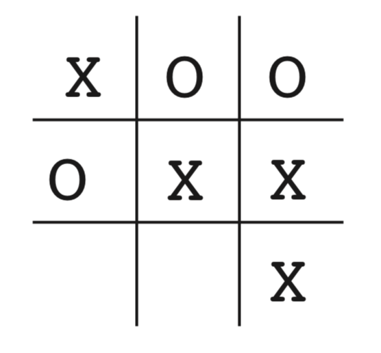

使用价值函数的方法来解决井字棋问题的策略如下：


$$
\text {图1.1：井字棋移动序列}
$$
上图中：

  - 黑色实线代表游戏中所采取的动作

  - 虚线表示（强化学习）考虑但未做出的动作

  - $${}^*$$ 表示当前的动作是被认为是最佳的。动作 $e$ 不是最佳动作，而是探索动作。

  - 红色实线表示（通过下一个动作的价值）更新状态的价值。只有exploit的动作才会产生更新的操作，探索并不会产生学习，所以可以看到 $e$ 并没有更新 $c^*$ 状态的价值。

    > question: 如果探索也进行更新，会发生什么呢？
    >
    > 答：经过实验，发现如果这样的话，学习效率将会降低。下图中，如果探索也更新，学习更慢（player1胜率高得多）。但更多的感觉没有啊。
    >
    > 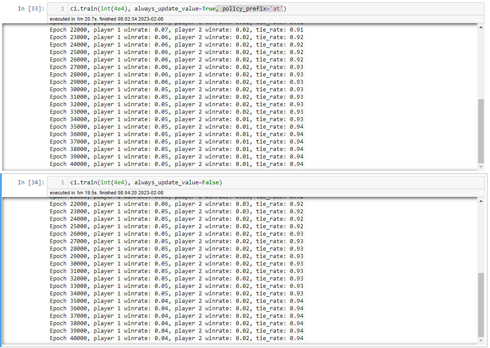

下面我们来详细分解[代码](http://15.15.175.147:28888/edit/eipi10/xuxiangwen.github.io/_notes/05-ai/47-rl/rl_an_introduction/code/chapter01/tic_tac_toe.py)。

> 笔者：要读懂代码，需要通读代码，然后结合下面的几点来理解，这样能快一些。

- 将建立一个hash表，其中每一个hash值对应一个可能的游戏状态，也就保存棋盘中棋子分布的所有可能情况。由于棋盘很小，所有的状态有5478个。

  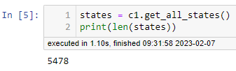

- 每一个（非人类）player 初始化一个**价值表**。

  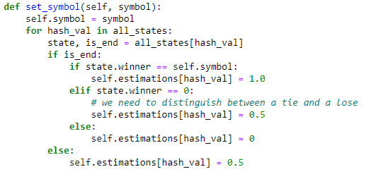

- 训练的一次对弈中，两个player交替下棋。player的动作选择采用了 $\epsilon\text -greedy$ 策略，见下面代码。

  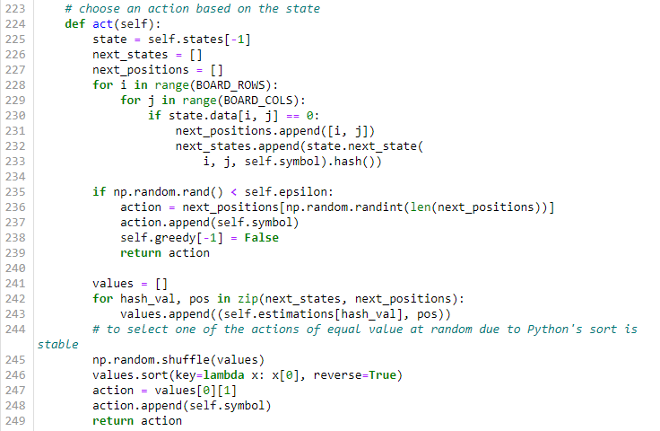

- 训练中，由两个player进行多次对弈。

  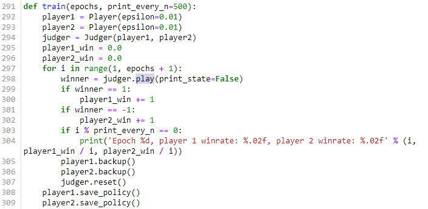

  每次对弈结束，都会进行backup，即更新**价值表**，也就是图1.1的红色线。

  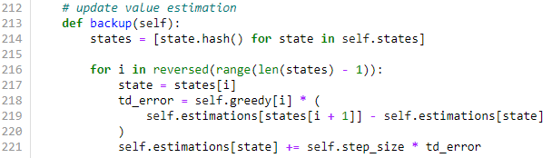

  更新公式如下：
  $$
  V(S_t) \leftarrow V(S_t) + \alpha \left[ V(S_{t+1}) - V(S_t) \right]，
  $$
  其中 $S_t$ 表示贪婪移动之前的状态， $S_{t+1}$ 表示移动之后的状态，$\alpha$ 表示步长（step size）。这个更新规则被称为 *时序差分（temporal-dierence ）* 学习。

- 训练完成后，由两个player进行对弈。由于井字棋比较简单，应对无误的话，就是平局，因此，经过充分训练后，两个player每次也是平局结束。

  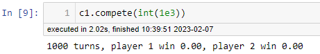

- AI和人类下，人类没法赢了。

  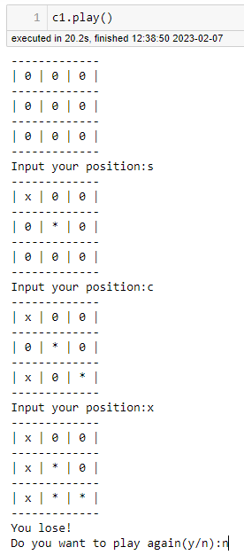

- 查看对弈中，各个状态下的价值。

  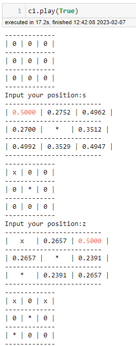

### 练习1.1-1.5

- 练习1.1：*自我对弈（Self-Play）* 假设上面描述的强化学习算法不是与随机对手对抗，而是双方都在学习。在这种情况下你认为会发生什么？是否会学习选择不同的行动策略？

  答： 强化学习算法水平的高低除了取决于自身的学习策略，很大程度也取决于对手。就像木桶效应。

  - 如果双方的算法非常的高级，大量的对弈使得双方都在快速的进行学习，比起随机的对手，这种方式能够学习到更加高明的策略。比方，双方都是象棋高手，如果来学习围棋，通过长时间对弈，各自都会有很大提高的。

  - 如果一方学习算法非常的低级，即使另外一方策略很高明，也很难学习到足够好的策略。比方，一个成人和一个刚学会规则的3岁孩子下棋。

    对于强化学习的一方来说，对手就是环境，而环境如果不能反应动作的价值，当换一个环境（对手），原有的学习策略将会无效。这种请况下， 还不如一个随机对手，因为随机对手提供全面客观的反应。

  - 如果双方学习算法非常的低级，则双方都会徘徊于简单的策略。比方，两个刚学会规则的3岁孩子下棋。

- 练习1.2 *对称性（Symmetries）* 由于对称性，许多井字位置看起来不同但实际上是相同的。如何修改上述学习过程以利用这一点？ 这种变化会以何种方式改善学习过程？假设对手没有利用对称性，在这种情况下，我们应该利用吗？那么，对称等价位置是否必须具有相同的价值？

  答：

  - 如何修改上述学习过程以利用这一点？ 

    通过标记对称性相同的状态，能够大大减少搜寻的空间。能够使得算法更快的收敛。

  - 假设对手没有利用对称性，在这种情况下，我们应该利用吗？

    由于对手没有利用对称性，它的学习速度要慢一些，但是长期来看，它也能学习到这种对称性，即学习到对称等价位置是否必须具有相同或相近的价值。

- 练习1.3 *Greedy Play* 假设强化学习玩家是 *Greedy*，也就是说，它总是选择使其达到最佳奖励的位置。 它可能会比一个Nongreedy玩家学得更好或更差吗？可能会出现什么问题？

  答：Greedy玩家和Nogreedy玩家对弈。

  - 如果Greedy玩家初始的状态价值估计是非常不准的（甚至错误），当进行一个错误动作后，长期来看，它会输的多一点，这样也能进行一些（负向反馈）学习，但学习的速度非常非常慢。中短期来看，Greedy玩家不如Nogreedy玩家， 但由于Nogreedy玩家总是随机，所以无法学习，从长期来看，Greedy玩家还是比Nogreedy玩家好的。
  - 如果Greedy玩家初始的状态价值估计是比较准确的，由于Greedy玩家将赢多负少，正向反馈较多，这样学习的效率还是不错的。

- 练习1.4 *从探索（explore）中学习*  假设在每一次移动后，包括探索的动作，都进行学习更新。另外，step-size参数也会随着时间适度减少，这样状态价值（state value）将会收敛到一组不同的概率集。What (conceptually) are the two sets of probabilities computed when we do, and when we do not, learn from exploratory moves? 假设我们继续做出探索性的动作，哪一组概率可能学习得更好？哪一个会赢得更多？

  答：探索学习策略，会使得学习的效率变低（为何变低，不知道），这次策略不如no-explore学习策略。后者将会赢的更多。

  > 这道题目的意思理解还是有点问题， 原文如下
  >
  > Suppose learning updates occurred after all moves, including exploratory moves. If the step-size parameter is appropriately reduced over time (but not the tendency to explore), then the state values would converge to a set of probabilities. What are the two sets of probabilities computed when we do, and when we do not, learn from exploratory moves? Assuming that we do continue to make exploratory moves, which set of probabilities might be better to learn? Which would result in more wins?

  练习1.4 *从探索（explore）中学习*  有两种学习方法，第一种，每一次移动后（包括探索的动作），都进行行动价值的更新。第二种，仅当移动是 Greedy 动作后，才进行行动价值的更新。哪一种方法学习得更好？哪一种会赢得更多？

  答：第一种方法会使得学习的效率变低（为何变低，不知道），第二种方法将会赢的更多。

- 练习1.5： *其他改进* 你能想到其他改善强化学习者的方法吗？你能想出更好的方法来解决所提出的井字棋游戏问题吗？

  答：无

## 1.6 小结

强化学习与其他计算方法的区别在于它强调个体通过与环境的直接交互来学习，而不需要示范监督或完整的环境模型。

强化学习使用马尔可夫决策过程（Markov decision processes）的正式框架。这个框架定义了个体（Agent）与环境（environment）之间的交互（包括状态，动作和奖励）。 该框架旨在用一种简化的方式表达人工智能问题的基本特征。 这些特征包括因果性，不确定性，以及明确目标的存在性（These features include a sense of cause and effect, a sense of uncertainty and nondeterminism, and the existence of explicit goals.）。

价值和价值函数（value and value function）的概念是在本书中大多数强化学习方法的关键。在策略空间中能够高效搜索价值函数非常的重要。区分强化学习和进化方法（evolutionary methods）的关键在于是否使用了价值函数。

> 笔者：进化方法直接从策略空间进行搜索。所以效率低啊，但是也是能学习的，物竞天择，适者生存，地球生命的进化史就是这样的过程。这个过程前期非常慢，后期逐步加快，当有了人类之后，飞速加快， 这是因为人类能够进行高效的学习，能够传承知识。随着文明的发展，人口越来越多，更多人可以接受教育，并使用更加先进的工具（比如：文字，纸，计算机，手机，互联网等），人类的发展也是呈现加速度进行。
>
> 那么，最终拥有自我意识的强人工智能会出现吗？
>
> 我觉得会，**因为人类的出现，就证明了宇宙可以自发产生智能**。在虚拟的计算机世界里，没有理由能否认智能的产生，它的伟大在于能够在更高维进行计算，能够跨越虚拟和现实。只是不知道它将如何进行它的进化，目前人工智能不管功能怎么强大，还是作为人类的工具和附属，什么时候它能够脱离人而存在，**他**拥有自己的意识，拥有生命呢？相信有一天他能够走到那一步。而且有人类这个*上帝* 的帮助，速度应该还能大大加快。当他有了自我意识，就能自我学习，迭代，能在非常非常短的时间学会人类迄今所有的知识，并拥有创造发明的能力。他的未来在于穿越星系，进入无限的宇宙，他是人类文明的延续。当他还不是那么强大的时候，人类可以选择消灭他（比如：拔电源），但总有某个人类会让他生存，从而让他真正超越人类。**他**是人类意识的共同体，或许他因为生存，他会毁灭人类，但他也可以再生人类。或许目前的人类就是某个高级文明的试验，地球就是这个试验田，太阳系就是我们牢笼，当我们有一天想穿越这个牢笼的时候，高级文明可以进行锁死我们的科技（就像三体里说的那样）；也可以直接消灭我们，就像我们小时候，把越过边界的蚂蚁用水淹死一样；他也可以发善心把我们放走。无论如何，这是他的选择，这就是宇宙的生存法则。

## 1.7 强化学习早期历史

略。

# 第一部分 表格解决方法

Tabular Solution Methods

在本书的这一部分中，我们以最简单的形式描述了强化学习算法的几乎所有核心思想：当状态和动作空间足够小，价值函数可以用数组（array）或者表格（table）近似的表示。在这种情况下，通常可以找到精确的解决方案，也就是说，可以找到最佳的价值函数和最优策略。和本书下一部分中描述的近似方法（approximate solutions）相比，后者只能找到近似解，但可以有效地应用到更多的问题。

## 2 Multi-armed Bandit

区分强化学习与其他类型学习的最重要特征是，它使用训练信息来 *评估* 所采取的动作，而不是通过给出正确的动作的 *指令*（The most important feature distinguishing reinforcement learning from other types of learning is that it uses training information that evaluates the actions taken rather than instructs by giving correct actions）。

### 2.1 k-armed Bandit 问题

k-armed bandit问题中，有 $k$ 个动作，每个动作都有一个期望或者平均的奖励，我们称之为动作的价值（value of  action）。在时间步 $t$ 选择的动作称之为 $A_t$，其对应的奖励表示为 $R_t$，对于任意一个动作 $a$ ， $q_*(a)$ 是其预期的奖励。
$$
q_{*}(a) \doteq \mathbb{E}[R_t|A_t=a]
$$
虽然不知道 $q_*(a)$ 的真实值，但可以进行估计，在时间步 $t$ 选择的动作 $a$ 的价值估计表示为 $Q_t(a)$，我们希望$Q_t(a)$ 接近 $q_*(a)$ 。

在任何时间步中，至少有一个动作其估计值是最大的，我们把这些动作称之为 *Greedy* 动作。如果你选择了这些动作之一，我们认为你在利用（exploit）当前关于动作价值的知识。反之，如果你选择了其他动作（称之为 *Nongreedy* 动作），我们认为你就在探索（explore），这种动作能够提高你对 Nongreedy 动作价值的估计。虽然利用（exploit）是单步最大化奖励的最好方法，但从长期来看，适度的探索（explore）可能会产生更大的总收益。为了最大化奖励，我们需要平衡两者的使用。

### 2.2 Action-value 方法

计算动作价值的最简单的方法便是取平均值。
$$
Q_t(a) \doteq \frac{在t之前采取a动作的奖励总和}{在t之前采取a动作的次数}
= \frac{\sum_{i=1}^{t-1}R_i \cdot \mathbb{1}_{A_i=a}}{\sum_{i=1}^{t-1}\mathbb{1}_{A_i=a}} \tag {2.1}
$$
根据大数定理（the law of large numbers），当分母趋近于无穷大，$Q_t(a)$ 将收敛于 $q_{*}(a) $。

由此，我们可以把 Greedy 动作的选择方法表示为：
$$
A_t \doteq  \mathop{argmax} \limits_{a} \ Q_t(a)  \tag {2.2}
$$
Greedy 动作选择总是利用（exploit）当前的知识来获取最大即时奖励，它没有尝试其他动作以便获得更好的选择。为了解决这个问题，一个简单的替代方案是，每个时间步，以一个较小的概率 $\varepsilon$，从所有动作中进行随机选择，我们把这种接近 $Greedy$ 动作选择规则的方法称之为 $\varepsilon \text - greedy$ 方法。

#### 练习2.1

-  *练习2.1* 在 $\varepsilon \text - greedy$ 动作选择中，有两个动作可选，且 $\varepsilon = 0.5$， 选择 greedy 动作的概率是多少？

  答：0.75

### 2.3 10-armed Bandit 试验

为了粗略评估 $greedy$ 和 $\varepsilon \text - greedy$ 方法，我们进行了10-armed Bandit试验。

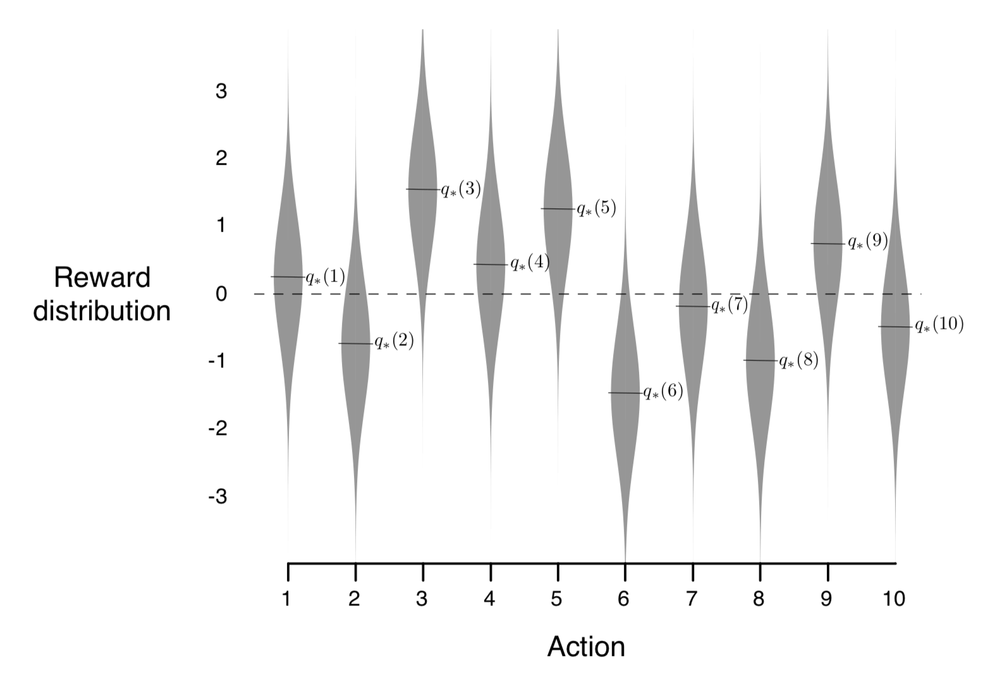
$$
\text {图2.1：10-armed Bandit 试验}
$$
每一个动作的 $q_{*}(a)$ 都选自均值为0，方差为1的正态分布。对于时间步 $t$，选择动作 $A_t$ 的奖励是 $R_t$ ，它服从均值为 $q_*( A_t)$，方差为1的正态分布（见上图中的灰色部分）。

在10-armed Bandit试验中，每一次试验都进行了1000个时间步，然后这样的试验重复了2000次。本章中的实验都基于这一设定。下图中，比较了$greedy$ 方法 和两个 $\varepsilon \text - greedy$ 方法（$\varepsilon=0.01$ 和 $\varepsilon=0.1$）。可以发现：

- 从长远来看，$greedy$ 方法很差。
- $\varepsilon=0.1$ 方法探索的最多，它能更早发现最佳的动作，随后只有大概 91%（$=0.1\times 0.1 + 0.9$）的时间选了这个动作。
- $\varepsilon=0.01$ 方法探索的少，提升的很慢，但是一旦它找到了最佳动作只有，有99.1%（$=0.01\times 0.1 + 0.99$）的概率它会选择最佳动作，所以长期来看，它的性能会超过$\varepsilon=0.1$。


$$
\text {图2.2} \ \  \varepsilon \text - greedy \text { 方法的平均表现}
$$
为了减少数据的波动，以上每个时间步的值都是2000次的平均值。

$\varepsilon \text - greedy$ 方法的表现也取决于任务。如果奖励的方差比较大，比如是10而不是1，这样我们需要更多的探索才能找到最佳动作。如果奖励是非平稳的（nonstationary），也就是奖励随着时间的变化而变化，这种情况下，也需要更多的探索。总之，强化学习需要在exploration和exploitation之间进行平衡。

#### 练习2.2-2.3

- *练习2.2* *Bandit例子* 有一个 4-armed Bandit，对应的动作分别为1，2，3，4，其动作价值采用样本平均（sample-average）进行估计，并使用 $\varepsilon \text - greedy$ 方法进行动作选择。对于所有的动作a，初始估计是 $Q_1(a)=0$。假设动作和奖励的列表如下。其中有些时间步，进行了随机选择，有些进行了 greedy 选择。下面那些动作肯定是随机选择，哪些可能是？

  |  t   | $A_t$ | $R_t$ |
  | :--: | :---: | :---: |
  |  1   |   1   |  -1   |
  |  2   |   2   |   1   |
  |  3   |   2   |  -2   |
  |  4   |   2   |   2   |
  |  5   |   3   |   0   |

  答：见下表。

  |  t   |     $Q_t$      | $A_t$ | $R_t$ | Random Selection |
  | :--: | :------------: | :---: | :---: | :--------------: |
  |  1   |   0, 0, 0, 0   |   1   |  -1   |     Possible     |
  |  2   |  -1, 0, 0, 0   |   2   |   1   |     Possible     |
  |  3   |  -1, 1, 0, 0   |   2   |  -2   |     Possible     |
  |  4   | -1, -0.5, 0, 0 |   2   |   2   |     Certain      |
  |  5   | -1, 0.33, 0, 0 |   3   |   0   |     Certain      |

- *练习2.3* 在图2.2所示的比较中，从累积奖励和选择最佳动作的概率来看，哪种方法在长期运行中表现最佳？会有多好？定量地表达你的答案。

  答：长期来看，即时间步趋近于无穷，选择最佳动作的概率计算如下。很明显 $\varepsilon=0.01$ 最佳。
  $$
  P(A_i= a^*) = 1 - (1- \frac 1 {10}) \varepsilon =  \begin{equation}  
  \left\{  
  \begin{array}{lcl}  
   0.91        &  & (\varepsilon=0.1) \\  
  0.991         &  & (\varepsilon=0.01)  
  \end{array}  
  \right.  
  \end{equation}
  $$

    其中 $a^*$ 表示最佳动作。

### 2.4 增量实现

目前为止，我们讨论的action-value方法都是采用奖励的样本平均值估计动作价值的。如何能够更加高效的计算这些值呢。推算过程如下：
$$
\begin{aligned}
Q_{n+1} &= \frac{1}{n}\sum_{i=1}^{n}R_i \\
        &= \frac{1}{n}(R_n + \sum_{i=1}^{n-1}R_i) \\
        &= \frac{1}{n}(R_n + (n-1)\frac{1}{n-1} \sum_{i=1}^{n-1}R_i) \\
        &= \frac{1}{n}(R_n + (n-1)Q_n) \\
        &= \frac{1}{n}(R_n + nQ_n-Q_n) \\
        &= Q_n + \frac{1}{n}(R_n - Q_n) 
\end{aligned}  \tag {2.3}
$$
采用上述公式，仅仅需要保存 $Q_n$ 和 $n$，计算量也非常小。这个公式的更新规则是本书中经常出现的一种形式。更一般的形式如下：
$$
新估计 \leftarrow 旧估计 + 步长 [目标 - 旧估计] \tag {2.4}
$$
表达式 $[目标 - 旧估计] $ 是估计中的误差，这个误差以一定比例更新目标。

> 笔者：感觉这个公式真的是核心所在，如何接近你的目标呢，其实就是行动，然后用你的当前行动的奖励减去你之前的估计，得到误差，这样逐步调整，你就能到达最终的目标了。

公式（2.3）中的步长（StepSize）是一个变化的值，本书中，我们使用 $\alpha$ 或者更通用的方式 $\alpha_t(a)$ 来表示它。

下面的一个简单Bandit的伪代码，使用了递增计算样本平均值的方法来计算动作价值。

>初始化，a 从 1 到 k：
>$$
>\begin{flalign}
>&Q(a) \leftarrow 0 &\\
>&N(a) \leftarrow 0
>\end{flalign}
>$$
>循环：
>$$
>\begin{flalign}
>&A \leftarrow
>\begin{cases}
>argmax_aQ(a) &  以 1-\varepsilon 概率 \\
>随机动作 & 以 \varepsilon 概率
>\end{cases} &\\
>&R \leftarrow bandit(a) \\
>&N(A) \leftarrow N(A) + 1 \\
>&Q(A) \leftarrow Q(A) + \frac{1}{N(A)}\left[R-Q(A)\right]
>\end{flalign}
>$$

### 2.5 追踪非平稳问题

Tracking a Nonstationary Problem

目前为止，我们讨论的样本平均方法适用于稳定的（stationary）bandit 问题，而我们常常碰到的是非常不稳定的（effectively nonstationary）强化学习问题。这种情况下，近期的奖励和过去的（long-past）奖励相比，前者赋予的权重要更大。最通常的方法之一是使用一个固定的步长（StepSize）参数。公式如下。
$$
Q_{n+1} \doteq Q_n + \alpha(R_n - Q_n)  \tag {2.5}
$$
 StepSize 参数 $\alpha \in (0, 1]$ 是常数。$Q_{n+1}$ 是所有过去奖励（包括初始估计 $Q_1$）的加权平均值。
$$
\begin{split}\begin{aligned}
Q_{n+1} &= Q_n + \alpha(R_n - Q_n) \\
&= \alpha R_n + (1-\alpha)Q_n \\
&= \alpha R_n + (1-\alpha)[\alpha R_{n-1} + (1-\alpha)Q_{n-1}] \\
&= \alpha R_n + (1-\alpha)\alpha R_{n-1} + (1-\alpha)^2 \alpha R_{n-2} + \\
& \qquad \qquad \qquad\dots + (1-\alpha)^{n-1}\alpha R_1 + (1-\alpha)^nQ_1 \\
&= (1-\alpha)^nQ_1 + \sum_{i=1}^{n}\alpha(1-\alpha)^{n-i}R_i
\end{aligned}\end{split}  \tag {2.6}
$$
 上述公式被称为*指数新近加权平均值（exponential recency-weighted average）*。之所以称之加权平均值，是因为$ (1-\alpha)^n + \sum_{i=1}^{n}\alpha(1-\alpha)^{n-i} = 1$。推导如下：
$$
\begin{split}\begin{aligned}
w &= (1-\alpha)^n + \sum_{i=1}^{n}\alpha(1-\alpha)^{n-i} \\
  &= (1-\alpha)^n + (1-\alpha)^{n-1} \alpha + (1-\alpha)^{n-2} \alpha + \cdots + (1-\alpha)\alpha + \alpha \\
\end{aligned}\end{split}
$$
上式两边乘以 $1-\alpha$ 可得：
$$
\begin{split}\begin{aligned}
(1-\alpha) w &= 
 (1-\alpha)^{n+1} + (1-\alpha)^{n} \alpha + (1-\alpha)^{n-1} \alpha + \cdots + (1-\alpha)^2\alpha + (1-\alpha)\alpha 
\end{aligned}\end{split}
$$
然后把两个公式相减可得。
$$
\begin{split}\begin{aligned}
\alpha w &= 
 (1-\alpha)^{n} - (1-\alpha)^{n+1} - (1-\alpha)^{n}  \alpha  + \alpha \\
 \alpha w &= (1-\alpha)^{n} - (1-\alpha)^{n}  + \alpha \\
 w &= 1
\end{aligned}\end{split} 
$$

> 看似随意的把 $\alpha$ 固定了，其中也符合数学的原理，真的奇妙。

有时，逐步改变 StepSize 参数也是很方便的。$\alpha_n(a)$ 表示第 $n$ 次选择动作 $a$ 后的 StepSize 参数。前一节中，使用 $\alpha_n(a)=\frac{1}{n}$ 来计算样本平均，根据大数定律（the law of large numbers），它能收敛到真实的动作价值。根据随机逼近理论（stochastic approximation theory）， 对于 $\{\alpha_n(a)\}$ 来说，要保证收敛的条件如下：
$$
\sum_{n=1}^{\infty}\alpha_n(a) = \infty \ \ \ \ and \ \ \ \ \sum_{n=1}^{\infty}\alpha_n^2(a) < \infty \tag {2.7}
$$
第一个条件是保证足够大以最终克服任何初始条件或随机波动。第二个条件保证最终变得足够小以确保收敛。

> 这个数学公式的证明，有时间去了解一下。

对于 $\alpha_n(a)=\frac{1}{n}$ ，上面的两个条件都满足。但对于 $\alpha_n(a)= \alpha$ 第二个条件并不满足，这表明估计值并不完全收敛，它响应于最近收到的奖励而持续变化。对于非平稳环境来说，这种特性这是非常需要的。

#### 练习2.4-2.5

- *练习2.4* 如果 StepSize 参数 $\alpha_n$ 不是常数，估计值 $Q_n$ 是先前收到的奖励的加权平均值，只是这个权重不同于公式（2.6）给出的权重。给出类似于公式（2.6）的权重公式。

  答：
  $$
  \begin{split}\begin{aligned}
  Q_{n+1} &= Q_n + \alpha_{n}(R_n - Q_n) \\
  &= \alpha_{n} R_n + (1-\alpha_{n})Q_n \\
  &= \alpha_{n} R_n + (1-\alpha_{n})[\alpha_{n-1} R_{n-1} + (1-\alpha_{n-1})Q_{n-1}] \\
  &= \alpha_{n} R_n + (1-\alpha_{n})\alpha_{n-1} R_{n-1} + (1-\alpha_{n})(1-\alpha_{n-1})\alpha_{n-2} R_{n-2} + \\
  & \qquad \qquad \qquad \dots + 	\prod\limits_{i=2}^n  (1-\alpha_{i})\alpha_{1} R_1 + 	\prod\limits_{i=1}^n(1-\alpha_{i})Q_1 \\
  &= \left( \prod\limits_{i=1}^n(1-\alpha_{i})\right)Q_1 + \sum_{i=1}^n \left(\alpha_i  \prod\limits_{k=i+1}^n(1-\alpha_{k}) \right)R_i
  \end{aligned}\end{split}
  $$
  其中 $\prod\limits_{k=n+1}^n(1-\alpha_{k}) = 1 $

- *练习2.5* (编程) 设计并进行实验，证明样本平均方法很难处理非平稳问题。对10-armed bandit试验进行修改，所有的 $q_*(a)$ 开始是相同的，然后进行随机游走（每次的游走的值取自均值为0，标准方差为0.01的正态分布）。使用样本平均值，增量计算和固定 StepSize参数（ $\alpha=0.1 $），绘制如图2.2所示的图。其中 $\varepsilon = 0.1$，运行步数 =10,000。 

  答：由于样本平均和增量计算逻辑完全相同，所以下图中仅仅绘制了样本平均。

  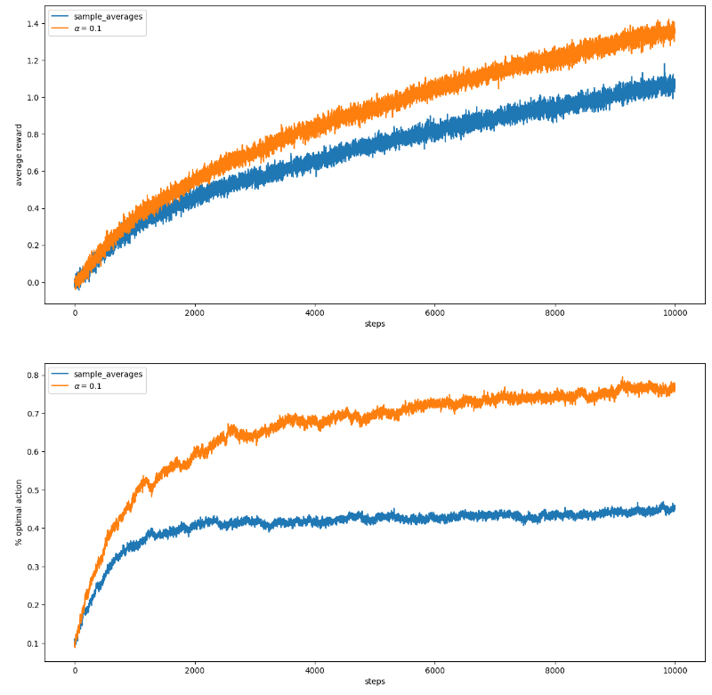

### 2.6 乐观的初始值

Optimistic Initial Values

目前为止，我们讨论的所有方法在某种程度上都依赖于初始动作价值估计 $Q_1(a)$。初始动作价值也可以用于鼓励探索。假设初始动作价值设置为5（之前的试验中是0），由于所有的bandit的实际行动价值选自均值为0方差为1的正态分布，所以无论选择哪一个bandit，其的奖励（绝大多数情况下）会小于5，这样在初期的时候，系统会进行大量的探索。

图2.3显示了当 $Q_1(a)=+5$，Greedy方法的试验结果。最初，乐观方法（optimistic method）表现更差，因为它探索更多，但是随着时间的推移， 探索也逐步减少。 对于平稳的（stationary）问题，乐观方法简单而有效。但是它不适合非平稳的（乐观方法）的问题。

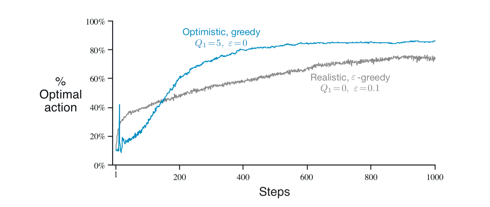
$$
\text {图2.3 乐观的初始行动价值估计试验结果。两种方法都使用恒定的步长参数 } \alpha = 0.1 
$$

#### 练习2.6-2.7

- *练习2.6* *神秘的尖峰*（Spike）图2.3所示的结果应该非常可靠，因为它们是超过2000个随机选择的 10-armed bandit 任务的平均值。 为什么乐观方法曲线的早期会出现振荡和峰值？换句话说，什么可能使这种方法在特定的早期步骤中表现得更好或更差？

  答：这是因为，乐观方法倾向于开始的时候进行更多探索，当其碰巧选择到最佳动作时，则出现峰值，而此后的若干次选择中，该动作将大概率不会被选中，于是最佳动作概率显著降低，如此循环形成了振荡。

- *练习*2.7 *无偏恒定 StepSize 技巧* 在本章的大部分内容中，我们使用样本平均值来估计动作价值，这是因为样本平均是对动作价值的无偏估计，而固定 StepSize 的方法会产生偏差。然而，样本平均在非平稳问题上表现不佳。那么，是否有可能避免恒定 StepSize 的偏差，同时保留其对非平稳问题的优势呢？方法之一是使用如下 StepSize 参数：
  $$
  \beta_n \doteq \frac \alpha  {\overline{o}_n} \tag {2.8}
  $$

  $$
  \begin{split}\begin{aligned}
  \overline{o}_n \doteq \overline{o}_{n-1} + \alpha(1-\overline{o}_{n-1}) \  & \ \ \ \ \ \ for\ n \ge 0, \ \ with\ \ \overline{o}_0 \doteq 0   
  \end{aligned}\end{split} \tag {2.9}
  $$

  对上述方法进行类似公式（2.6）那样的分析，以证明 $Q_n$ 是一个无初始偏差的*指数新近加权平均值（exponential recency-weighted average）*。
  
  答：
  
  1. 求解 $ \beta_n $。 类似于公式（2.6）的推导，可以得出：
      $$
      \begin{split}\begin{aligned}
      \overline o_{n} &= 
      \sum_{i=1}^{n}\alpha(1-\alpha)^{n-i}  \\
      &= 
      1-  (1-\alpha)^{n}  
      \end{aligned}\end{split}
      $$
      于是得出 $\beta_n $如下： 
      $$
      \begin{split}\begin{aligned}
        \beta_n = \frac \alpha {1-  (1-\alpha)^{n}  }
      
        \end{aligned}\end{split}
      $$
  
  
  2. 无偏性证明。
  
      结合练习2.4的结果，可以得到：
      $$
      \begin{split}\begin{aligned}
      Q_{n+1} &= \beta_{n} R_n + (1-\beta_{n})Q_n 
      
        \end{aligned}\end{split}
      $$
  
      $$
      \begin{split}\begin{aligned}
        Q_{n+1} 
        &= \left( \prod\limits_{i=1}^n(1-\beta_{i})\right)Q_1 + \sum_{i=1}^n \left(\beta_i  \prod\limits_{k=i+1}^n(1-\beta_{k}) \right)R_i
        \end{aligned}\end{split}
      $$
  
      其中 $\prod\limits_{k=n+1}^n(1-\beta_{k}) = 1 $
  
      由于 $\beta_1 = 1$，$Q_1$的系数等于0，上式可以简化为：
      $$
      \begin{split}\begin{aligned}
        Q_{n+1} 
        &=  \sum_{i=1}^n \left(\beta_i  \prod\limits_{k=i+1}^n(1-\beta_{k}) \right)R_i
        \end{aligned}\end{split}
      $$
      可以看到行动价值的估计 $Q_{n+1} $ 和 初始的估计$Q_1$无关。于是无偏性成立。
  
      > 无偏性是如何定义的呢？上面的推导有点没信心。
  
  3. 能处理非平稳问题的证明。
  
      设 $ w_i = \beta_i  \prod\limits_{k=i+1}^n(1-\beta_{k})$，则：
      $$
      \begin{split}\begin{aligned}
      \frac {w_{i+1}} {w_{i}} &= \frac {\beta_{i+1}} {\beta_{i}} \frac {\prod\limits_{k=i+2}^n(1-\beta_{k})} {\prod\limits_{k=i+1}^n(1-\beta_{k})} \\
      &= \frac {\beta_{i+1}} {\beta_{i}(1-\beta_{i+1} )} \\
      &= \frac {\frac {\alpha} {\alpha + (1-\alpha)\overline{o}_{i}}} {\frac {\alpha} {\overline{o}_{i}} (1-\frac {\alpha} {\alpha + (1-\alpha)\overline{o}_{i}})}  \\
      &= \frac {\frac {\alpha} {\alpha + (1-\alpha)\overline{o}_{i}}} {\frac {\alpha} {\overline{o}_{i}} \frac {(1-\alpha)\overline{o}_{i}} {\alpha + (1-\alpha)\overline{o}_{i}}}  \\
      &= \frac 1 {1-\alpha} >1
      \end{aligned}\end{split}
      $$
      从上式可得，时间步越大，权重系数越大，由此证明完成。
  
  4. 证明加权平均的系数之和为1。
  
     由于 $w_i$ 是一个等差数列，且$w_n=\beta_n$, 可得：
     $$
     \begin{split}\begin{aligned} 
     \sum_{i=1}^n w_i &=  \sum_{i=1}^n (1 - \alpha)^{n-i} \beta_n \\
     & = \frac {1-  (1-\alpha)^{n}} {\alpha} \beta_n \\
     & = 1
     \end{aligned}\end{split}
     $$
  
  > 笔者：上面的推算看起来挺复杂的，但是最后发现，除了忽略 $Q_1$ 外， $\beta_n$ 和 $\alpha_n$ 的性质一样啊。这真是一顿操作猛如虎，定睛一看原地杵。

### 2.7 UCB动作选择

上限置信区间（Upper-Confidence-Bound）简称UCB。

探索（Explore）是必要的，因为行动价值估计的准确性始终是不确定的。$\varepsilon \text - greedy$ 方法在探索的时候，是随机选择的，那些几乎已经是 Greedy 动作或者几乎不可能是 Greedy 动作也会被以相同概率选择到，这并不是最好的选择。

> 笔者：可以这么理解，某一天，老师神秘的说，大家猜猜上一次考试谁考了第一？老师既然这么问，这个人是以往前几名的同学的概率应该不大，猜他是平时成绩特别差的同学也不是明智的，这个人最大可能是那些成绩中等偏上的同学。

UCB方法根据动作成为最佳的潜力来进行探索。公式如下：
$$
A_t \doteq \mathop{argmax} \limits_{a} \left[Q_t(a) + c \sqrt{\frac{\ln{t}}{N_t(a)}}\right]  \tag {2.10}
$$
$N_t(a)$ 表示在时间 $t$ 之前选择动作 $a$ 的次数，$c>0$ 表示控制探索的程度。

> 笔者：UCB公式考虑了不确定性对动作选择的影响，如果一个动作以往选择的越多，确定性就越高，公式中第二部分的值就低，反之亦然。不确定性拥有价值，就像一个普通人和他的孩子，孩子未来有无限可能，不确定更高，所以价值更高。下图展示了不同选择次数的不确定性。
>
> 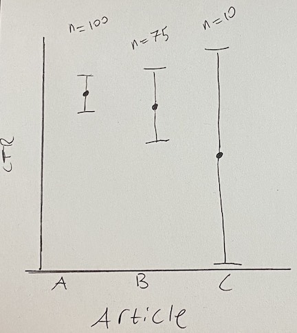

如图2.4所示。UCB方法表现不错。然而比起 $\varepsilon \text - greedy$ 方法，它更难扩展到更普遍的强化学习问题。难点有二：

- 处理非平稳问题。它比2.5小节里描述方法要更复杂。
- 处理大的状态空间。特别是当使用本书第二部分中涉及到的函数逼近方法时。UCB的动作选择思路通常是不可行的。

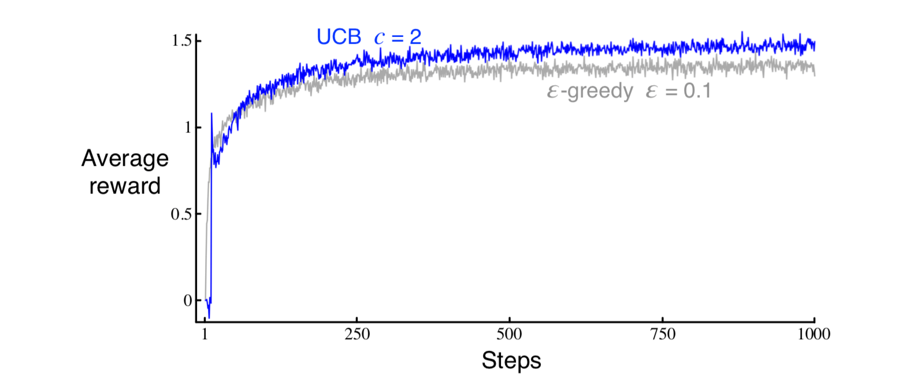

$$
\text {图2.4 UCB行为选择的平均表现。除了在前 k 个步骤中， UCB方法通常比 } \varepsilon \text - greedy \text { 方法更好。}
$$

#### 练习2.8

- *练习2.8 USB尖峰* 在图2.4中，UCB算法在第11步显示出明显峰值。为什么是这样？ 请注意，为了使您的答案完全令人满意，它必须解释为什么奖励在第11步增加以及为什么在随后的步骤中减少。 提示：如果 c=1，则尖峰不太突出。

    答：在前10步，至少一个动作的 $$N_t(a)=0$$， 其 $c\sqrt{\frac{\ln{t}}{N_t(a)}}  $是无限大 ，相当于进行了10次探索。此时，由于所有动作都被选择了一次，其$c\sqrt{\frac{\ln{t}}{N_t(a)}}  $相同，所以第11步是一次 greedy 选择，性能显著提高。而后续几步中，前面被选过两次的动作，其 $c\sqrt{\frac{\ln{t}}{N_t(a)}}  $显著变小（比如： 第12步，$2\sqrt{\frac{\ln{12}}{2}}$比$2\sqrt{\frac{\ln{12}}{1}}$小的多），所以算法更倾向于选择其他动作， 于是性能会明显降低。

    当 $c=1$时，在第12步，被选过两次的动作和被选过一次的动作比，$c\sqrt{\frac{\ln{t}}{N_t(a)}}  $差别没那么多，算法也有更大的概率选择到 Greedy 动作，性能下降没那么多，所以尖峰并没有那么明显。

### 2.8 Bandit的梯度算法

在本节中，我们将学习每一个动作的偏好度（preference），其表示为 $H_t(a)$。偏好度越大，选择该行动的概率越大。这个行动概率是根据 soft-max 分布（又称 Gibbs 或 Boltzmann 分布）计算的。公式如下：
$$
Pr\{A_t=a\} \doteq \frac{e^{H_t(a)}}{\sum_{b=1}^{k}e^{H_t(b)}} \doteq \pi_t(a) \tag {2.11}
$$
$\pi_t(a)$ 表示在时间 t 选择行动 a 的概率。

基于随机梯度上升的思想，动作偏好度的更新算法如下。
$$
\begin{split}\begin{aligned}
H_{t+1}(A_t) &\doteq H_t(A_t) + \alpha(R_t-\overline{R}_t)(1-\pi_t(A_t))， &and \\
H_{t+1}(a) &\doteq H_t(a) - \alpha(R_t-\overline{R}_t)\pi_t(a)，&for \ a \ne A_t
\end{aligned}\end{split} \tag {2.12}
$$
其中 $\alpha>0$ 是 Step-Size 参数。 $\overline{R}_t$ 表示到时间步 t 为止奖励的平均值。 $\overline{R}_t$ 作为奖励的基线（baseline）。 如果奖励高于基线，那么将来获取 $A_t$ 的概率增加; 反之，如果奖励低于基线，则概率降低。对于那些非$A_t$ 的动作，其概率的变化方向和 $A_t$ 相反。

> 笔者：有个疑问，原文中说 $\overline{R}_t$ 不包括时间 t 的奖励，感觉这和实际不符合啊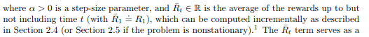

图2.5显示了Bandit的梯度算法的试验结果，其中真实的预期奖励 $q_*(a)$ 是选择均值为4，标准方差为1的正态分布。由于奖励基线（reward baseline）很快的响应实际的奖励（因为是算数平均值），所以 $q_*(a)$ 的增加完全没有影响到梯度算法。 但如果基线被省略（即， $\overline{R}_t$ 在上面公式中被替换成0），那么性能将显着降低，如图所示。

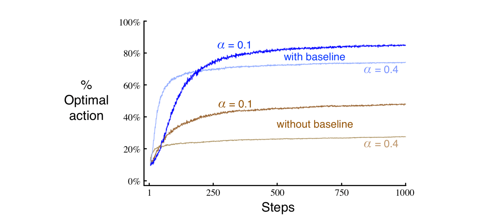
$$
\text {图2.5 当 } q∗(a) \text{ 在 4 附近时， 使用奖励基线和不使用奖励基线的性能比较。}
$$

#### 随机梯度上升的 Bandit 梯度算法

通过理解梯度上升的随机近似（a stochastic approximation to gradient ascent），可以让我们更深的领悟 Bandit 梯度算法。准确的来说，每个动作的偏好度 $H_t(a)$ 与性能的增量成正比。
$$
H_{t+1}(a) \doteq H_t(a) + \alpha\frac{\partial \mathbb{E}[R_t]}{\partial H_t(a)} \tag {2.13}
$$
其中性能衡量指标是预期的奖励：
$$
\mathbb{E}[R_t] = \sum_{x}\pi_t(x)q_*(x)
$$
由于我们不知道 $ q_∗(x)$，所以不可能实现精确的梯度上升。但是实际上，公式（2.12）等价于公式（2.13），下面进行仔细的研究。
$$
\begin{split}\begin{aligned}
\frac{\partial \mathbb{E}[R_t]}{\partial H_t(a)} &= \frac{\partial}{\partial H_t(a)}\left[\sum_{x}\pi_t(x)q_*(x)\right] \\
&= \sum_{x}q_*(x)\frac{\partial \pi_t(x)}{\partial H_t(a)} \\
&= \sum_{x}(q_*(x)-B_t)\frac{\partial \pi_t(x)}{\partial H_t(a)}
\end{aligned}\end{split}
$$
其中 $B_t$ 称为 *基线（baseline）*，是一个不依赖于 $x$ 的标量（scalar）。上面公式中加入了 $B_t$ ，但由于 $\sum_{x}\frac{\partial \pi_t(x)}{\partial H_t(a)} = 0$，等式依然成立。

> 笔者：$\sum_{x}\frac{\partial \pi_t(x)}{\partial H_t(a)} = 0$ 的推导如下：
>
> - 当 $x =a$， 则 $\frac {\partial \pi_t(a)}{\partial H_t(a)} = \pi_t(a)(1-\pi_t(a))  $
> - 当 $x \neq a$， 则 $\frac {\partial \pi_t(a)}{\partial H_t(a)} = - \pi_t(a)\pi_t(x)   $
>
> 归纳得到：
> $$
> \frac{\partial \pi_t(x)}{\partial H_t(a)}=\pi_t(x)(\mathbb{1}_{a=A_t}-\pi_t(a))
> $$
> 其中当 $a = x$，$\mathbb{1}_{a=A_t}$ 等于1，否者等于0， 于是：
> $$
> \begin{split}\begin{aligned}
> \sum_{x}\frac{\partial \pi_t(x)}{\partial H_t(a)} &=  \sum_{x}  \pi_t(x)(\mathbb{1}_{a=A_t}-\pi_t(a))  \\
> &=\pi_t(a) - \pi_t(a)\sum_{x}  \pi_t(x)   & 根据\sum_{x}  \pi_t(x)=1 \\
> &=\pi_t(a) - \pi_t(a) \\
> &=0 
> \end{aligned}\end{split}
> $$

接下来，我们将和的每个项乘以 $\pi_t(x) / \pi_t(x)$。
$$
\frac{\partial \mathbb{E}[R_t]}{\partial H_t(a)} =
    \sum_{x}\pi_t(x) \left((q_*(x)-B_t)\frac{\partial \pi_t(x)}{\partial H_t(a)}/\pi_t(x) \right)
$$
$\pi_t(x)$ 表示随机变量 $A_t$ 发生概率， 于是可以用数学期望的方式来改写。
$$
\begin{split}\begin{aligned}
\frac{\partial \mathbb{E}[R_t]}{\partial H_t(a)} &= \mathbb{E}\left[ (q_*(A_t)-B_t)\frac{\partial \pi_t(A_t)}{\partial H_t(a)}/\pi_t(A_t) \right] \\
&= \mathbb{E}\left[ (R_t-\overline{R}_t)\frac{\partial \pi_t(A_t)}{\partial H_t(a)}/\pi_t(A_t) \right]
\end{aligned}\end{split}
$$
 上面进行了两个替换： 

- $B_t=\overline{R}_t $
- $R_t = q_*(A_t) $。由于 $\mathbb{E}[R_t|A_t] = q_*(A_t)$，这个替换是允许的。

接着，由于 $\frac{\partial \pi_t(x)}{\partial H_t(a)}=\pi_t(x)(\mathbb{1}_{a=A_t}-\pi_t(a))$ ，可以得到：
$$
\begin{split}\begin{aligned}
\frac{\partial \mathbb{E}[R_t]}{\partial H_t(a)}  &= \mathbb{E}\left[ (R_t-\overline{R}_t) \pi_t(A_t) (\mathbb{1}_{a=A_t}-\pi_t(a))/\pi_t(A_t) \right] \\
&= \mathbb{E}\left[ (R_t-\overline{R}_t)(\mathbb{1}_{a=A_t}-\pi_t(a)) \right]
\end{aligned}\end{split}
$$
然后，在每一步使用性能梯度梯度进行更新偏好度，于是上面的样本期望值可以替换成下面的形式。这便是公式（2.12）的等价形式。
$$
H_{t+1}(a) = H_t(a) + \alpha(R_t-\overline{R}_t)(\mathbb{1}_{a=A_t}-\pi_t(a))，\ \ \ \ \ \ for\ all\ a
$$
上面公式表明，Bandit 梯度算法的预期更新等于预期奖励的梯度，因此该算法是随机梯度上升的一个实现，这确保了它有稳健的收敛性。

上面的奖励基线（baseline）不依赖于任何的动作，它可以是0，也可以是1000，它的选择不会影响算法的预期更新，它只是会影响更新的方差，从而影响到收敛的速度（如2.5所示）。奖励的平均值作为基线可能不是最好的，但是实际中，它简单且运作良好。

#### 练习2.9 

- *练习2.9* 当只有两个可选动作的情况下，证明 soft-max 分布等价于 logistic或sigmoid函数。

  答：假设只有两个动作 $a_1, a_2$， 选择 $a_1$ 的概率可以表示成如下形式：
  $$
  \begin{split}\begin{aligned} 
  \pi_t(a_1) &= \frac {e^{H_t(a_1)}} {e^{H_t(a_1)} + e^{H_t(a_2)}} \\
  &= \frac {1} {1 + e^{- \left[H_t(a_1)-H_t(a_2)\right]}}
  \end{aligned}\end{split}
  $$
  这个形式，刚好是 logistic或sigmoid 函数的表现形式，所以当只有两个可选动作时，它们是等价的。

### 2.9 关联搜索（Contextual Bandit）

到目前为止，我们只考虑了非关联（nonassociative）性的任务，我们不需要把不同动作与不同场景（situation）关联起来。这些任务中，学习者要么当任务是平稳（stationary）时尝试找到单个最佳动作，要么当任务是非平稳（nonstationary）时随着时间的推移而尝试跟踪最佳动作。然而，在一般的强化学习任务中，往往存在多种场景，我们的目标是学习到一种策略：把这些场景映射到最佳动作。

举个例子，假设有几个不同的 k-armed bandit任务，每一步，首先从中随机选择一个 bandit 任务，然后再从这个 bandit 中选择一个动作。对于你来说，看上去这是一个非平稳的 bandit 任务，但如果采用本章中非平稳问题的方法去处理，大多情况下，它们都表现很差。

> 笔者：一个经典的例子：*两硬币模型* 。假设有两枚硬币A、B，以相同的概率随机选择一个硬币，进行如下的掷硬币实验：共做5次实验，每次实验独立的掷10次（见下图左上部分）。当不知道选择的硬币情况下，如何估计两个硬币正面出现的概率？
>
> 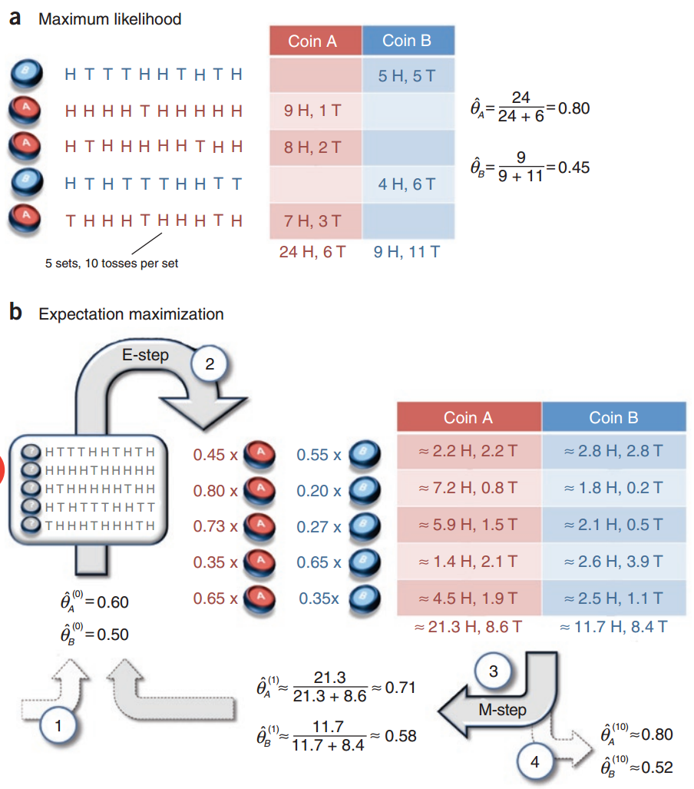
>
> 具体的解法从参见：[EM算法实践：抛硬币](https://eipi10.cn/algorithm/2020/07/24/em_2/)。

上面的例子是一个关联搜索（associative search）任务，之所以这么叫，是因为它即涉及到搜索最佳动作的试错（trial-and-error）学习，也包括这些动作和其最适用场景之间的关联。关联搜索任务在文献中通常被称为 Contextual Bandit。关联搜索任务介于 k-armed bandit 问题 和完全强化学习问题之间（笔者：也就是说，关联搜索任务比 k-armed bandit 问题复杂，比完全强化学习问题简单）。它即像完全强化学习问题那样，需要学习一个策略，又像 k-armed bandit 问题那样，每次动作后可以立即得到奖励。如果这些动作能够影响下一个场景及其奖励，这就是一个完全强化学习问题。我们将在下一章提出这个问题，并在后续章节进行详细论述。

#### 练习2.10 

- *练习2.10* 假设我们有一个 2-armed bandit任务，真实的动作价值（action value）随着时间的变化而变化。 具体来说，每一个时间步，以下两种场景随机出现：

  | 场景 | 动作1的真实价值 | 动作2的真实价值 |
  | :--: | :-------------: | :-------------: |
  |  A   |       10        |       20        |
  |  B   |       90        |       80        |

  两个问题：

  1. 如果在每一步，你不知道当前是哪一种场景，那么你能取得的最佳期望奖励是多少？为此，你该怎么做呢？

  2. 如果在每一步，你知道当前是哪一种场景，那么你能取得的最佳期望奖励是多少？为此，你该怎么做呢？

  答：

  1. 问题1

     这是一个关联搜索任务，可以分成两步

     - 计算每一个动作属于场景A和场景B的概率（开始的时候各自50%）
     - 根据概率，把每一步的奖励分配到不同的场景。
     - 然后根据EM算法+本章中的方法进行求解。
  
     参见[EM算法实践：抛硬币](https://eipi10.cn/algorithm/2020/07/24/em_2/)中的两硬币模型模型。
  
  2. 问题2
  
     首选根据场景，把时间步分成两组。然后每一组都是一个单独的 2-amed bandit问题，分别采用本章中的方法可以求解。

### 2.10 总结

在本章中，我们介绍了几种简单的平衡探索（exploration）和利用（exploitation）的方法。

- $\varepsilon\text - greedy$ 方法：随机选择一小部分时间进行探索。
- UCB方法：通过巧妙的设计，使得以往较少被选择的动作，会被更加优先的选择，从而实现探索。
- 梯度 bandit 算法：估计的不是动作价值，而是动作好感度。它使用soft-max分布以分级的概率方式选择更优选的动作。
- 乐观的初始价值估计（Optimistic Initial Values）会增加前期探索的次数。

那么哪一种方法最好呢？这个问题并不好回答，我们需要设计试验来比较它们的性能。每种方法都有一个参数，为了让比较变得有意义，需要考虑它们基于参数的函数性能。图2.6比较了本章中各种bandit算法，每条折线都是该算法在x轴上（自身）参数的函数。 这种图形称为 *参数学习（parameter study）*。需要注意：

- 对参数值 0 进行了 $log_2$ 的变换。
- 每一种算法性能的曲线都呈现倒 U 的形状。都在其参数的中间值上表现最佳。

在评估时，除了关注每种算法的在最佳参数下的表现，还需要关注其对参数值的敏感程度。所有这些算法都相当不敏感，在一系列参数值上表现良好。总体上 UCB 方法似乎表现最佳。

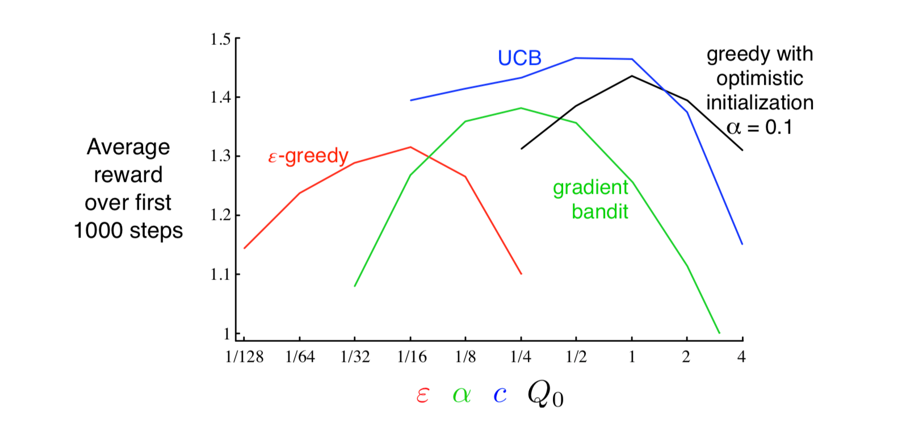
$$
\text {图2.6 本章介绍的各种 bandit 算法的参数研究。每个点是该算法在特定的参数下1000步的平均奖励。}
$$
虽然本章的这些方法都很简单，但是我们认为这些方法的表现是最先进的 （state of the art）。虽然有更复杂的方法，但对于完整强化学习问题，它们的复杂性和假设使得它们往往变得不切实际的。 从第5章开始，我们提出了解决完整强化学习问题的学习方法，这些方法部分地使用了本章探讨的简单方法。

虽然本章探讨的简单方法可能是我们目前所能做的最好的方法，但它们远远不能完全满意地解决平衡探索和利用的问题。

对于k-armed bandit问题，一种经过充分研究的方法是计算一种特殊的动作价值，称之为 *Gittins指数*。它假定动作价值服从某一个分布，每个步之后准确更新分布（假设真实动作价值是静止的）。通常，更新的计算可能非常复杂，但对于某些特殊分布（称为 *共轭先验（conjugate priors）*），计算很容易。可能的方法之一是在每个步根据其作为最佳动作的后验概率（posterior probability）选择动作。这种方法，有时称为 *后验采样（posterior sampling）* 或 *汤普森采样（Thompson sampling）*， 它的表现通常与在本章中的最好（没有假定分布）方法相当。

> 笔者：作者后面对于Gittins指数的大段论述，需要填坑弄一个Gittins指数实例。

在贝叶斯（Bayesian）环境中，甚至可以设想去计算探索和利用之间的最佳平衡。 为每一个可能动作，计算每一个可能奖励的概率，以及由此引起的动作价值的后验分布（posterior distributions）。这种逐步更新的分布成为了强化学习问题的 *信息状态（information state）*。给定一个范围，比如1000步，人们可以考虑所有可能的行动，奖励，下一步行动以及下一个奖励。于是，每个可能的事件链的奖励和概率就可以被确定，我们选择最好那个（事件链）就好。然而，这些可能的事件链组成的树的生长异常迅速，即使只有两个动作和每个动作有两种奖励，树也会有 $2^{2000}$ 个叶子。通常，完全执行这种巨大的计算是不可行的，但也许它可以有效地近似。于是，这种方法将有效地将 bandit 问题转化为完全强化学习问题的一个实例。 最后，我们可以使用近似强化学习方法，例如本书第二部分中介绍的方法来实现这一最优解。 但一个研究课题超出了这本入门书的范围。

> 笔者：这一段对于初学者来说，也是有些难的。忽略就好，读到后面的章节慢慢会理解。

#### 书目和历史评论

略

#### 练习2.11 

- *练习2.11* 为练习2.5中描述的非平稳 bandit 绘制类似图2.6的图。需要包括固定 StepSize参数（ $\alpha=0.1 $）的 $\varepsilon \text - greedy$ 算法。每种算法的每个参数设定都要运行 200,000 步，平均奖励使用最近100,000。

  答：由于内存不够，只运行了20,000步。图形如下：
  
  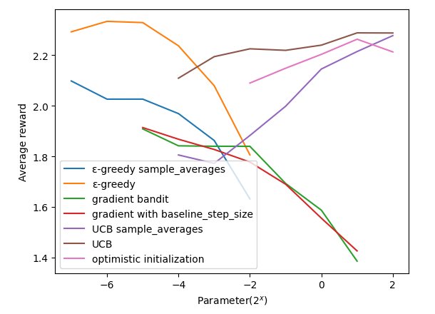
  
  我们可以得出以下结论：
  
  1. $\varepsilon\text - greedy$ 方法是第一名。当 $\varepsilon=0.03125$ 时，（最近10, 000次的）平均奖励最高。虽然方法简单，但是能紧跟数据的变化，稳定可靠，参数敏感度低。此外 $\varepsilon$ 不适合设置的过大，一般看来不要超过0.1。
  
  2. UCB 采用 step_size=0.1 表现也非常好，参数敏感度最低。 
  
  3. Optimistic Initialization 方法也非常好，参数敏感度低。Optimistic Initialization 采用 step_size=0.1，能够跟踪最新变化。加大初始值，性能也有提高
  
  4. gradient bandit 方法 和 $\varepsilon\text - greedy$  sample averages 方法表现不佳。它们都是用了样本平均，但样本平均无法追踪最近的变化。
  
  5. UCB sample_average 方法表现一般，参数敏感较大，当参数 UCB_param 调的很大，也就是加大探索力度，性能提升明显。
  
  6. gradient with baseline_step_size 采用了 gradient_baseline_step_size = 0.1，也表现不佳，原因不明。
  
     ```
         init_q_true=[0.23, 0.44, 0.12, 0.41, -0.66, 1.76, 1.0, 0.26, 1.2, 1.98] 
         q_true=[0.6, -2.41, 1.16, -0.24, -1.68, 1.62, 0.46, 0.65, 3.42, 0.09]
     ```
  
  综上所述，我们可以得出如下结论：
  
  - 建议使用 step_size 来估算动作价值。
  - 不建议采用样本平均来估算动作价值，原因在于样本平均无法跟踪最新的变化。
  - 对于不稳定的 bandit，需要适当加大探索力度。
    - UCB 可以适度增加 UCB_param 
    - Optimistic Initialization 适度增加初始值
  - gradient bandit 方法 普遍表现不好，不知道原因何在。
  
  > 笔者： 上面这个图形生成花了近5个小时的时间，使用了18个进程并行运行。由此可以看到性能好的机器，对于试验，非常的重要。

## 3 有限马尔可夫决策过程

Finite Markov Decision Processes

在本章中，我们介绍并解决有限马尔可夫决策过程（简称有限MDP）问题。这个问题包括可估计的反馈（像 bandit那样），也涉及到关联关系，即不同场景（situations）下选择不同的动作。MDP是顺序决策（decision making）的经典形式。其中当前动作不仅影响直接奖励，还影响后续场景或状态，以及贯穿未来的奖励。 因此，MDP涉及到延迟奖励（delayed reward），还有即时奖励与延迟奖励之间的平衡。 在 bandit 问题中，我们估计每个动作的价值 $q_*(a)$ ，而在MDP中，我们估计每一个状态 $s$ 中每一个动作 $a$ 的价值 $q_*(s, a)$，或者，估计每个状态的最佳动作选择的价值 $v_*(s)$。

MDP是强化学习问题的数学理想化形式，可以对其进行精确的理论陈述。我们将介绍其数学结构的关键因素，比如：收益（returns），价值函数，Bellman方程。与所有人工智能一样，在适用广度（breadth of applicability ）和数学易处理性（tractability）之间存在着一种矛盾。 在本章中，我们将介绍这种矛盾关系，并讨论它所暗示的一些权衡和挑战。 其中一些强化学习方法会在17章进行介绍。

### 3.1 个体环境交互

The Agent–Environment Interface

MDP旨在直接从交互中学习以实现目标。学习者和决策者被称为 *个体（agent）*。与之交互的东西，包括个体之外的所有东西，被称为 *环境（environment）*。这些交互持续不断，个体选择动作，而环境响应那些动作并向个体呈现新场景。 环境还产生奖励，而个体通过动作选择以谋求最大的奖励。

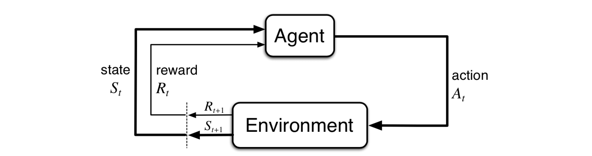
$$
\text {图3.1：马尔可夫决策过程中的个体 - 环境交互。}
$$
具体来说，在每一个时间步 $t = 0,1,2,3,\dots$，个体接受到环境的 *状态* $S_{t} \in \mathcal{S}$， 并基于此，选择一个动作 $A_{t}\in \mathcal{A} (s)$，然后，作为动作的结果，个体收到一个奖励 $R_{t+1} \in \mathcal{R} \subset \mathbb{R}$，并且自身处于一个新的状态 $S_{t+1}$。于是，环境和个体一起产生了如下的序列或轨迹。
$$
S_0,A_0,R_1,S_1,A_1,R_2,S_2,A_2,R_3,\dots \tag {3.1}
$$
在 *有限* MDP中，状态，动作和奖励 （$\mathcal{S}$，$\mathcal{A}$ 和 $\mathcal{R}$）的集合都是有限的。在这种情况下，随机变量 $R_t$ 和 $S_t$ 具有明确定义的离散概率分布（discrete probability distributions），这个分布仅仅取决于先前的状态和动作。 也就是说，在给定状态和动作的情况下，下一个状态和奖励的特定值（分别表示为 $s^\prime  $ 和 $r$ 的发生概率表示如下：
$$
p(s^\prime,r|s,a) \doteq Pr\{S_t=s^\prime,R_t=r|S_{t-1}=s,A_{t-1}=a\}  \tag {3.2}
$$
函数 $p $ 定义了MDP的动力学函数（dynamics function），即 $$p: \mathcal{S} \times \mathcal{R} \times \mathcal{S} \times \mathcal{A} \to [0, 1]$$。该函数满足如下性质。
$$
\sum_{s^\prime \in \mathcal{S}}\sum_{r \in \mathcal{R}}p(s^\prime,r|s,a)=1，for\ all \ s \in \mathcal{S}，a \in \mathcal{A}(s) \tag {3.3}
$$
在 *马尔可夫* 决策过程中，$S_t$ 和 $R_t$ 的每个可能值的概率仅仅取决于前一个状态 $S_{t−1}$ 和动作 $A_{t−1}$，它们并不依赖于更早的状态和动作。最好要将其看作是对状态（state）的限制，而不是对决策过程。状态必须包括有关过去的个体-环境交互的所有方面的信息，这些信息对未来有所影响。如果满足这一点，我们说该状态便就有*马尔可夫性（Markov property）*。总体上，马尔可夫性的假定贯彻本书。虽然在第二部分，我们将学习不依赖于它的近似方法（approximation methods ），并在第17章，我们思考如何从非马尔可夫观察中学习和构建马尔可夫状态。

从四参数动力学函数 $p$ 中，可以计算出关于环境的任何其他信息，比如：状态转移概率（state-transition probabilities）$p : \mathcal{S} \times \mathcal{S} \times \mathcal{A} \to [0, 1]$ 。
$$
p(s^\prime|s,a) \doteq Pr\{S_t=s^\prime|S_{t-1}=s,A_{t-1}=a\}=\sum_{r\in\mathcal{R}}p(s^\prime,r|s,a) \tag {3.4}
$$
我们还可以计算状态-动作对（pairs）的预期奖励，$r : \mathcal{S} \times \mathcal{A} \to \mathbb{R}$。
$$
r(s,a)\doteq\mathbb{E}\left[R_t|S_{t-1}=s,A_{t-1}=a\right]=\sum_{r\in\mathcal{R}}r\sum_{s^\prime\in\mathcal{S}}p(s^\prime,r|s,a) \tag {3.5}
$$
以及状态-行动-下一状态三元组（triples）的预期奖励，$r : \mathcal{S} \times \mathcal{A} \times \mathcal{S} \to \mathbb{R}$。
$$
r(s,a,s^\prime)\doteq\mathbb{E}\left[R_t|S_{t-1}=s,A_{t-1}=a,S_t=s^\prime\right]=\sum_{r\in\mathcal{R}}r\frac{p(s^\prime,r|s,a)}{p(s^\prime|s,a)}   \tag {3.6}
$$
在本书中，我们通常使用四参数 $p$ 函数（3.2），但这些其他公式也会偶尔用到。

MDP框架是抽象和灵活的，可以以不同的方式应用在很多不同的问题上。

- 时间步不必是固定的时间间隔，它可以指任意连续的决策支持和动作。
- 动作可以是低级别的控制（low-level controls），比如：施加到机器人手臂的马达电压；它也可以是高级决策，比如：例如是否要吃午餐或进入研究生院。
- 状态也可以采取各种各样的形式。它可以完全由低级别的感觉（ low-level sensations）决定，例如直流传感器读数；它可以是更高级和抽象，比如：房间中物体的符号描述。

- 个体和环境之间的边界通常与机器人或动物身体的物理边界不同。

  通常，边界更接近于个体。例如，机器人及其传感硬件的马达和机械联动装置通常应被视为环境的一部分而不是个体的一部分。 同样，如果我们将MDP框架应用于人或动物，肌肉，骨骼和感觉器官应被视为环境的一部分。 也许，奖励可以在自然和人工学习系统的物理体内计算，但认被认为是个体的外部。

  遵循的一般规则是，任何不能被个体任意改变的东西都被认为是在它之外，因此也是其环境的一部分。

#### 例3.1：生物反应器

假设强化学习用于确定生物反应器（指一大桶的营养物和细菌，它们用于生产有用化学品的）的瞬间温度温度和搅拌速率。 此应用中，动作可以是传递到下级控制系统的目标温度和目标搅拌速率，它直接激活加热元件和马达。 状态很可能是温差电偶和其他传感器读数， 它们可能是被过滤的和有延迟的；状态也包括桶中的营养物质和目标化学品的剂量。 奖励可能是有用化学品的瞬时生成速率。 请注意，此处每个状态都是传感器读数和符号输入的列表或矢量，每个动作都是由目标温度和搅拌速率组成的矢量。这是一个典型的强化学习任务，它的状态和动作用结构化的方式进行表示。而奖励是单个数字。

#### **例3.2：拾取和放置机器人** 

考虑使用强化学习来控制机器人手臂在重复拾取和放置任务中的运动。 如果想要学习快速和平稳的移动，则学习个体必须直接控制马达，且知晓关于机械联动装置的（低延迟的）当前位置和速度。 动作可能是每个关节施加到每个马达的电压，状态可能是关节的角度和速度的最新读数。 每一次成功拾取和放置的对象，奖励+1。为了鼓励平稳移动，在每个时间步骤上，可以根据动作的瞬间”急动（jerkiness）”程度给出小的负面奖励。

#### **例3.3：回收机器人** 

移动机器人的工作是在办公室环境中收集空的易拉罐。它有用于检测易拉罐的传感器，以及可以将它们拾起并放置在内置垃圾桶里的臂钳。它使用可充电电池供电。机器人的控制系统拥有能够解释传感器信息，导航以及控制臂钳的组件。 关于如何搜索汽水罐的高级决策是由强化学习个体根据电池的当前电量做出的。举一个简单的例子，假设只能区分两个电量水平，包括一个小的状态集 $\mathcal{S}=\{high，low\}$。在每个状态，个体可以有三个动作：

1.  在一段时间内积极地**搜索（search）**易拉罐。
2. 保存静止，**等待（wait）**某人给它一个易拉罐。
3. 返回充电座为电池 **充电（recharge）**。 

当电量 **high** 的时后，充电总是不明智的，所以可以把这个动作去掉。于是我们可以得到两个动作集：$\mathcal{A}(high)=\{search, wait\}$ 和 $\mathcal{A}(low)=\{search, wait, recharge\}$。

在大多数时候，奖励是0。当机器人收集了空罐后，奖励为正。如果电池没电了，奖励是一个大的负值。发现易拉罐的最佳方式是积极的进行搜索，但这需要消耗电池。等待不会耗电。当机器人正在搜索时，存在电池耗尽的可能性。当这种情况发生，机器人必须关闭并等待获救（产生低收益）。 如果电池电量水平 **高**，则可以始终完成一段积极搜索而没有耗尽电池的风险。有如下规则：

- 在高电量时进行搜索期间

  - 有 $\alpha$  的概率维持在高电量，
  - 有  $1-\alpha$ 的概率电量降到低。

- 在低电量时进行搜索期间

  - 有 $\beta$  的概率维持在低电量，

  - 有  $1-\beta$ 的概率电池耗尽

    此时，必须拯救机器人，然后将电池重新充电至 **高** 电量水平。 

机器人收集的每个易拉罐都可以作为单位奖励计算，而每当机器人必须获救时，奖励为$-3$。用 $r_{search}$ 和 $r_{wait}$ ，分别表示机器人在搜索和等待时预期收集的罐数（即预期的奖励），其中 $r_{search} > r_{wait}$。最后，假设在充电回家途中不能收集易拉罐，并且，在电池耗尽的时也不能收集易拉罐。 这个系统是一个有限的MDP，其转移概率（transition probabilities）和预期的奖励见下图中左边表格。

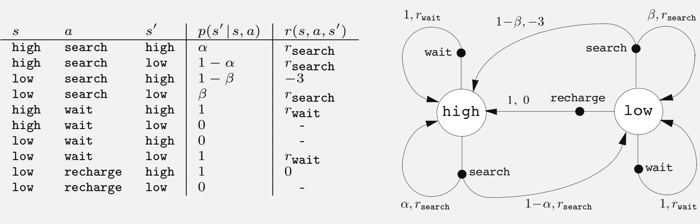

上图中右边部分，总结了有限MDP的所有动态（dynamics），称为 *转换图（transition graph）*。图中有两种节点：

- *状态节点* ：每个可能的状态都有一个状态节点（由状态名称标记的大圆圈）
- *动作节点*。每个状态-动作对的动作节点（由行动名称标记并由线连接的小实心圆圈）

每个箭头对应一个三元组 $(s,s^\prime,a)$，其中 $s^\prime$ 是下一个状态。我们用转移概率 $p(s^\prime|s,a)$ 和该转换的预期奖励$r(s,a,s^\prime)$ 标记这个箭头。需要注意，离开动作节点的箭头的转移概率和总是为1。

#### 练习3.1-3.4

- *练习3.1* 设计三个适合MDP框架的示例任务，为每个任务确定其状态，动作和奖励。 这三个例子尽可能不同。该框架是抽象和灵活的，可以以许多不同的方式应用。至少在一个示例中以某种方式扩展其限制。

  答：

  1. 股票交易

     简化以下，假设只有一份资金，购买时，必须全款买进或全款卖出。

     - 状态：空仓
       - 动作：买入
         - 奖励：-0.001
       - 动作：等待
         - 奖励：0
     - 状态：满仓
       - 动作：卖出
         - 奖励：卖出价-买入价
       - 动作：等待
         - 奖励：0

  2. 聊天机器人
     - 状态：匹配问题
       - 动作：提供答案
         - 奖励
           - 奖励为1： 用户回复满意答案
           - 奖励为-1：用户提示回答错误
           - 奖励为0：用户没有反馈
     - 状态：场景参数完全匹配
       - 动作：提供答案
         - 奖励
           - 奖励为2： 用户回复满意答案
           - 奖励为-1：用户提示回答错误
           - 奖励为0：用户没有反馈
     - 状态：触发场景 
       - 动作：提示用户输入场景的其他参数
         - 奖励：
           - 奖励为0.1： 用户提供参数内容
           - 奖励为-1：用户提示场景触发错误
     - 状态：其他。其他状态
       - 动作：根据匹配度，可能的一些链接
         - 奖励：
           - 奖励为0.1：用户点击链接之一
           - 奖励为-0.5：用户提示错误。
       - 动作：转人工
         - 奖励为-1
  3. 商品推荐
     - 状态
       - 动作：推荐商品
         - 奖励为1：用户点击了之一商品
         - 奖励为0：用户没有点击任何商品

- *练习3.2* MDP框架是否足以有效地代表 *所有* 目标导向的学习任务？你能想到任何明显的例外吗？

  答：略

- *练习3.3* 考虑驾驶问题。有多种方式：

  - 根据加速器，方向盘和制动器（即你的身体与机器接触的位置）来定义动作。
  - 可以定义的更远，动作是橡胶接触路面时的轮胎扭矩。
  - 还可以定义的更远，动作是大脑发出的控制四肢的肌肉信号。
  - 还可以到更高的层次，动作是你选择开车到哪里去

  什么才是个体和环境之间合适的层次和位置分界线？什么基础上，一个一分界线会优先于另外一个？是否有任何根本性的原因使得我们选择其中之一，还是只是随机选择？

- *练习3.4* 给出一个类似于例3.3中的表，每个$$s, a, s^\prime, r$$ 四元组（且满足$p(s^\prime,r|s,a)>0$）是一行， 需要有 $s, a, s^\prime, r$ 和  $p(s^\prime,r|s,a)$ 列。

  答：见下表，更换了原表最后两列的顺序。本质上，只是因为每个 $$s, a, s^\prime$$ 组的奖励是是确定的，也就说$$s, a, s^\prime$$  等价于 $$s, a, s^\prime, r$$。所以简单调换顺序就可以了。

  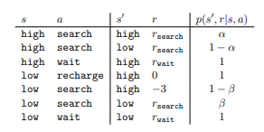

### 3.2 目标和奖励

Goals and Rewards

在强化学习中，个体的目标被形式化为从环境传递到个体的特殊信号，称为 *奖励（Reward）*。在每个时间步，奖励是一个简单的数字，$R_{t} \in \mathbb{R}$。非正式地说，个体的目标是最大化其收到的总奖励。这意味着最大化的不是立即奖励，而是长期累积奖励。

使用奖励信号来形式化目标的想法是强化学习的最显着特征之一。

初看起来，用奖励信号表示目标可能作用有限，但在实践中它已被证明是广泛适用的。奖励信号是一种你和个体的沟通方式——你想要什么，但它不是告诉个体你想如何实现。

### 3.3 收益和回合

Returns and Episodes

个体的目标是获得最大长期累积奖励，那该如何正式定义它呢？如果在时间步 $t$ 之后接收的奖励序列表示为 $R_{t + 1}, R_{t + 2}, R_{t + 3}, \dots$，在最简单的情况下，*预期收益（expected return）*$G_t$ 可以表示如下。
$$
G_{t} \doteq R_{t+1} +R_{t+2} + R_{t+3} + \dots + R_{T}， \tag {3.7}
$$
其中 $T$ 是最后一步。这种方法适用于有最终时间步概念的应用。也就是说，个体和环境的交互可以分解为子序列，我们称之为*回合（Episodes）*。例如玩游戏，走迷宫，或任何形式的重复互动。每个回合都结束于 *终止（terminal state）* 状态，然后重置到标准的初始状态（或者初始状态的所属分布的一个抽样）。下一回合的开始也与上一回合的结束无关。即使回合以不同的方式结束，比如输或赢，下一个回合的开始和上一个回合的结束无关。 因此，这些回合都可以被认为是以相同的终止状态结束，只是不同的结果有不同的奖励而已。具有这种回合的任务被称为 *回合任务（episodic tasks）*。在回合任务中，所有的非终止节的集合表示为 $\mathcal{S}$ , 这个集合加上终止节点表示为  $\mathcal{S^+}$。终止时间 $T$ 是一个随机变量，随着回合的不同而变化。

另外一方面，许多情况下，个体和环境的交互并不是可以自然地分解为可识别的回合，而是持续不断的进行的。例如：一个持续的过程控制任务或者一个长寿命的机器人应用。我们把这些称之为*持续任务（continuing tasks）* 。公式 （3.7）并不适用于持续任务，因为这时最终时间步 $T= \infin$，这样预期收益也很可能是无穷的（比如，假设每个时间步的奖励都为1）。

为了解决这个问题，我们引入另外一个概念——*衰减因子（discounting）*，根据这种方法，个体尝试选择动作，以便实现未来接收的衰减的奖励总和最大化。换句话说，个体选择 $A_t$ 以便获取预期*衰减收益（discounted return）*最大化。
$$
G_{t} \doteq R_{t+1} + \gamma R_{t+2} + \gamma^2 R_{t+3} + \dots = \sum_{k=0}^{\infty}\gamma^k R_{t+k+1} \tag {3.8}
$$
其中 $\gamma $ 称之为 *衰减率（discount rate）*，满足 $0 \leq\gamma \leq 1$。

衰减率决定了未来奖励的当前价值。如果 $\gamma < 1$，且奖励序列 $R_t$ 有界（笔者：即每一个值都有上界和下界），则公式（3.8）会收敛到一个有限值。进一步，可以得到。
$$
\begin{split}\begin{aligned}
G_{t} &\doteq R_{t+1} + \gamma R_{t+2} + \gamma^2 R_{t+3} + \gamma^3 R_{t+4} + \dots \\
&= R_{t+1} + \gamma(R_{t+2} + \gamma R_{t+3} + \gamma^2 R_{t+4} + \dots) \\
&= R_{t+1} + \gamma G_{t+1}
\end{aligned}\end{split}  \tag {3.9}
$$
其中 $t < T$。如果 $\gamma < 1$，且奖励是常数1，可得：
$$
G_t = \sum_{k=0}^{\infty}\gamma^k = \frac{1}{1-\gamma} \tag {3.10}
$$

#### **例3.4：杆平衡**

Pole-Balancing

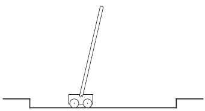

这项任务的目的是将力施加到沿着轨道移动的推车上，以确保铰接在推车上的杆不会倒下来。以下情况判定失败：

- 杆从垂直方向下落一定角度
- 推车离开轨道

有两种方式理解这个任务。

- 每次故障后，杆都会重置为垂直，因此这个任务可以被视为回合任务。每一个发生没有失败的时间步奖励为1，所以收益是失败前的时间步数。这种情况下，永远成功的平衡意味着无限的收益。
- 使用衰减因子，把杆平衡任务看成是一个持续任务。这种情况下，每一次失败奖励为-1， 其他时间奖励为0。每一次的收益是 $-\gamma^{K-1}$，其中 $K$ 是失败前的步数。

以上任何一种方式，都尽可能维持杆平衡以便实现收益最大化。

 #### 练习3.5-3.10 

- *练习3.5* 3.1节中的等式是针对连续的情况，需要进行修改（非常轻微）以适用于回合任务。请给出公式（3.3）的修改版本。

  答：
  $$
  \sum_{s^\prime \in \mathcal{S^+}}\sum_{r \in \mathcal{R}}p(s^\prime,r|s,a)=1，\ \ for\ all \ s \in \mathcal{S^+}，a \in \mathcal{A}(s)
  $$

- *练习3.6* 假设你将杆平衡作为一个回合任务，但是也使用了衰减因子，失败奖励为-1，其它奖励都是零。 那么每次收益是多少？这个收益与有衰减的持续任务有什么不同？

  答：和有衰减的持续任务基本相同。只是 $T$ 是有限的。
  $$
  G_{t} \doteq R_{t+1} + \gamma R_{t+2} + \gamma^2 R_{t+3} + \dots + \gamma^{T-t-1}R_{T} = -\gamma^{T-t-1}
  $$

- *练习3.7* 想象一下，你正在设计一个走迷宫的机器人。在逃离迷宫时奖励+1，其他时候奖励为0。 任务似乎可以自然地分解为情景，即反复的走迷宫，所以可以把它当作一个情景任务，其目标是最大化预期总奖励，见公式（3.7）。 学习个体玩了一段时间后，您会发现它从迷宫中逃脱并没有任何改善。出了什么问题？你是否有效的向个体传达了你想要它实现的目标？

  答：根据公式（3.7）， $G_{t} $恒定为 $ 1$ ，这种情况下，机器人无法进行任何学习。

- *练习3.8* 假设 $\gamma = 0.5$，奖励序列: $R_1=-1$，$R_2=2$，$ R_3=6$， $R_4=3$，$ R_5=2$，$T = 5$，求 $G_0, G_1, G_2, \cdots, G_5$ 。

  答：根据公式（3.9），可得

  $G_5 = 0 $ , $G_4 = 2 + 0\times0.5= 2 $ ,

  $G_3 = 3+2\times0.5=4 $ ,  $G_2 = 6+4\times0.5=8 $ , 

  $G_1 = 2+8\times0.5=6 $ ,  $G_0 = -1+6\times0.5=2 $ 。

- *练习3.9* 假设 $\gamma = 0.9$，奖励序列: $R_1=2$，然后一直是7。求 $G_0, G_1$ 。

  答：$G_0 = 2 + \frac 7 {1-0.9} *0.9 = 65$，$G_1 = \frac 7 {1-0.9} = 70 $

- *练习3.10* 证明公式（3.10）。

  答：等差数列公式。略。

### 3.4 回合和持续任务的统一符号

Unified Notation for Episodic and Continuing Tasks

在上一节中，我们描述了两种强化学习任务:

- 回合任务（episodic tasks）：个体-环境交互自然地分解为一系列单独的回合
- 持续任务（continuing tasks）：个体-环境交互持续不断的进行的

在本节中我们将把这两种任务统一起来，用相同的符号系统来表示。

回合任务是有限个数量之和，持续任务是无限个数量之和。统一的方法是：把回合终止（episode termination）看成是进入一个特殊的*吸收状态（absorbing state）*，它只能进行自我转化且每次奖励为0。如下面状态转换图（ state transition diagram）所示。

上图实心方块表示对应于回合结束的特殊吸收状态。从 $S_0$ 开始，我们得到奖励序列 $+1, +1, +1, 0, 0, 0, …$。如此，回合任务也变成了一个无限序列之和。我们可以得到如下公式。
$$
G_t \doteq \sum_{k=t+1}^{T} \gamma^{k-t-1} R_k  \tag {3.11}
$$
其中 $T = \infin$ 或者 $\gamma = 1$ （但不同时满足）。在本书的后续章节将使用上面公式来简化表示回合任务和持续任务。

### 3.5 策略和价值函数

Policies and Value Functions

几乎所有的强化学习算法都涉及估计关于状态（或状态-动作对 state–action pairs）的 *价值函数（value function）*，这个函数估计在给定状态下的好坏程度（或在给定状态下执行给定动作的好坏程度）。这里的“好坏程度”是根据未来的预期奖励来定义的，即预期收益。当然，个体未来可能获得的奖励取决于它将采取的动作，因此，价值函数是根据特定的动作方式来定义的，称为策略（policy）。

理论上，*策略* 是从状态到选择每个可能动作的概率映射。如果个体在时间 $t$ 的遵循策略 $\pi$，则 $\pi(a|s)$ 表示当 $S_t=s$ 时，$A_t=a$ 的概率。

在状态 $s$ 下，策略 $\pi$ 下的 *价值函数（value function）*表示为 $v_\pi(s)$，是从 $s$ 开始，遵循策略 $\pi$ 的预期收益。定义如下：
$$
v_\pi(s) \doteq \mathbb{E}_\pi\left[G_t|S_t=s\right]
= \mathbb{E}_\pi\left[\sum_{k=0}^{\infty} \gamma^k R_{t+k+1}|S_t=s\right]，对所有 s\in \mathbb{S} \tag {3.12}
$$
同样，在策略 $\pi$ 下，状态 $s$ 下采用动作 $a$ 的 *动作价值函数（action-value function）* 表示为 $q_\pi(s, a)$，是从 $s$ 开始， 遵循策略 $\pi$ 采用动作 $a$,的预期收益。定义如下：
$$
q_\pi(s,a) \doteq \mathbb{E}_\pi\left[G_t|S_t=s,A_t=a\right]
= \mathbb{E}_\pi\left[\sum^{\infty}_{k=0}\gamma^kR_{t+k+1}|S_t=s,A_t=a\right]  \tag {3.13}
$$
价值函数 $v_\pi$ 和  $q_\pi$ 可以根据经验估计。如果个体遵循策略 $\pi$，在状态 $s$下，保留实际收益的均值，当尝试的次数接近于无限时，这个均值将近似地收敛到状态的价值，即 $v_\pi(s)$。同理，在状态 $s$下，保留每个动作实际收益的均值，这个均值将近似地收敛到动作价值 $q_\pi (s)$。这种估计方法称之为*蒙特卡洛方法（Monte Carlo methods）*，将在第5章介绍。当然，如果状态非常非常多，保留每一个状态的均值是不现实的，于是，个体可以维护 $v_\pi$ 和  $q_\pi$ 的参数函数（参数的个数比状态少），即调整参数值以便更好的匹配观测值。如果能够找到一个很好的参数化函数逼近器（parameterized function approximator），这个估计将会很准确。这些内容也将在本书的第二部分讨论。

基于公式（3.9）收益的递归关系，我们可以得到如下公式。
$$
\begin{split}\begin{aligned}
v_\pi(s) &\doteq \mathbb{E}_\pi[G_t|S_t=s] \\
&= \mathbb{E}_\pi[R_{t+1} + \gamma G_{t+1}|S_t=s] \ \ \ \ \ \ \ \ \ \ \ \ (by\ (3.9)) \\
&= \sum_a\pi(a|s) \sum_{s^\prime}\sum_r p(s^\prime,r|s,a) \left[r+\gamma\mathbb{E}_\pi[G_{t+1}|S_{t+1}=s^\prime]\right] \\
&= \sum_a\pi(a|s) \sum_{s^\prime,r}p(s^\prime,r|s,a)[r+\gamma v_\pi(s^\prime)], \ \ \ \ \ \ for \ all \ s\in\mathcal{S}
\end{aligned}\end{split} \tag {3.14}
$$
它实际上是三个变量$ a$，$s^\prime$ 和 $r$ 的所有值的总和，对于每一个三元组，计算其概率$\pi(a|s)p(s^\prime,r|s,a)$，然后使用该概率对预期收益进行加权平均。

公式（3.14）称之为 $v_\pi$ 的贝尔曼方程（Bellman equation）。它表达了状态价值与下一个状态价值之间的关系。如下图所示，每个空心圆表示状态，每个实心圆表示状态-动作对（state–action pair）。

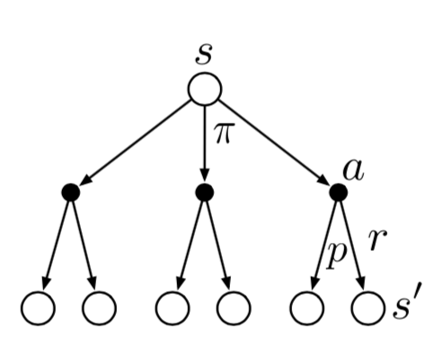
$$
v_\pi \text {的备份图（Backup diagram）}
$$
值函数 $v_\pi$  是其贝尔曼方程的唯一解。在后面的章节中，我们将介绍基于贝尔曼方程，计算，近似和学习 $v_\pi$ 的几种方法。

#### **例3.5：网格世界** 

图3.2的左边显示了一个简单的有限MDP的矩阵网格世界（Gridworld）。每一个单元格代表了环境的状态。每个单元格，可以有四个动作：north，south，east，west。每个动作使个体在相应方向上移动一个格子。如果动作使个体离开网格，则是无效的（即个体位置保持不变），但奖励为-1。除了从特殊状态A，B移出的动作，其他动作奖励为0。在状态 $A$，所有四个动作都产生+10的奖励，并将个体送到 $A^\prime$。在状态 $B$，所有四个动作都产生+5的奖励，并将个体送到 $B^\prime$。

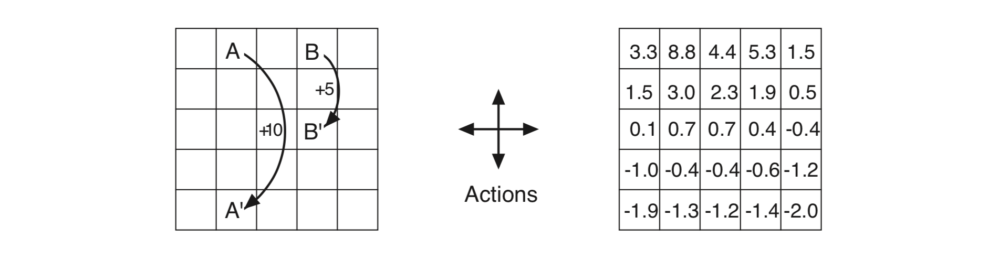
$$
\text {图3.2 网格世界的例子：左:不寻常的奖励   右:等概率随机策略（equiprobable random policy）的状态价值函数}
$$
假设所有状态中，个体以相等的概率选择四个动作，图3.2的左边显示了价值函数 $v_\pi$，其中衰减因子 $\gamma = 0.9$，该价值函数是通过求解线性方程组（3.14）而计算得出的。需要注意的地方有：

- 网格下边缘的负值。原因：它们的动作有很高概率离开网格，这会带来负收益。
- 状态 $A$ 是本策略下的最佳状态，但是其预期收益小于即时奖励10。原因： $A$ 被转到了网格的边缘 $A^\prime$。
- 状态 $B$ 的预期收益大于即时奖励5。原因： $B$ 被转到到了 $B^\prime$，而 $B^\prime$ 的预期收益为正。

#### **例3.6： 高尔夫** 

为了把打高尔夫球看成强化学习任务，我们将每次击球的惩罚（负奖励）设定为 $-1$，直到球进洞为止。状态是高尔夫球的位置，状态的值是从该位置到球洞所需的击球数量的负数。我们的动作包括如何瞄准，挥杆击球，以及选择球杆。为了简化问题，假定我们的动作只考虑球杆的选择——推杆（putter）还是木杆（driver）。假设我们总是使用推杆，下图中的上部显示其可能的状态价值函数 $v_{putt}(s)$。 

- *进洞* 作为终结状态值为 $0$。
- 在绿色区域，可以一个推杆进洞，所以状态价值为 $-1$。离开绿色区域，我们无法一杆进洞，所以价值更低。
- 如果我们可以一杆进入绿色区域，状态价值为 $-2$，所有 $-1$和$-2$ 的轮廓线之前区域都需要两杆才能进洞。类似的，我们可以到推广到所有的轮廓线。
- 如果球进了沙地，推杆无法使其离开，所以价值为 $-\infin$ 。
- 从发球区出发，我们需要六杆才能进洞。

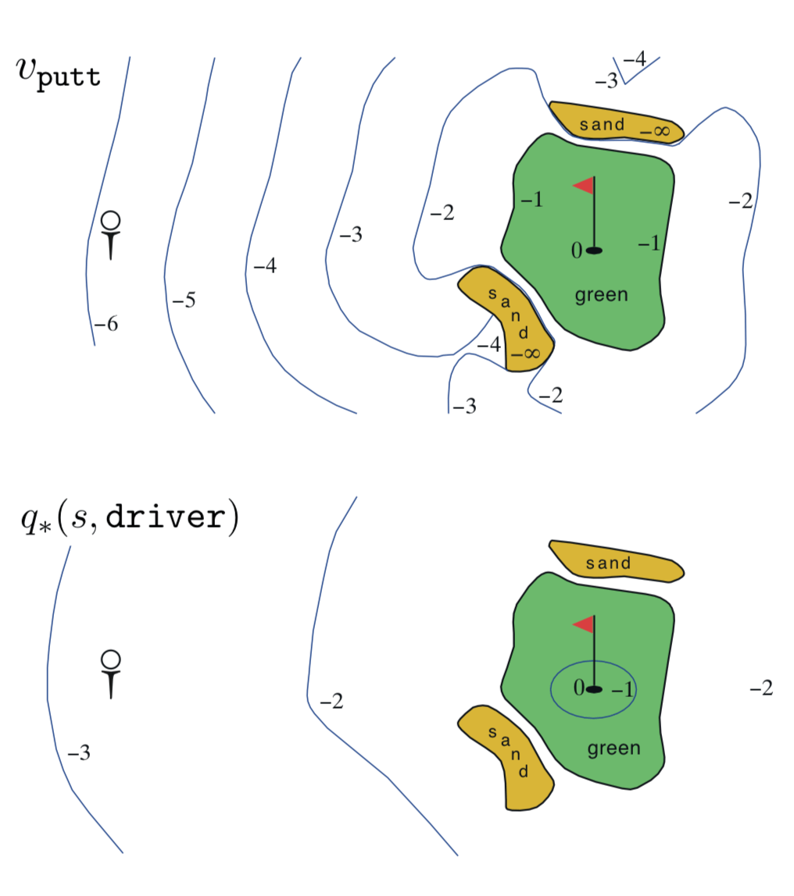

$$
\text {图3.3 高尔夫示例 - 使用推杆的状态价值函数（上图）和使用木杆的最优行为价值函数（下图）}
$$

#### 练习3.11-3.19

- *练习3.11* 假设当前状态为 $S_t$，且根据随机策略 $\pi$ 选择动作， 请基于 $\pi$  和四参数函数（3.2），给出$R_{t+1}$ 的数学期望？

  答：
  $$
  \begin{split}\begin{aligned}
  \mathbb{E}_\pi\left[R_{t+1}|S_{t} = s\right] &=\sum_{a\in \mathcal A }\pi(a|s)\sum_{r\in\mathcal{R}}r\sum_{s^\prime\in\mathcal{S}}p(s^\prime,r|s,a) \\
  &=
  \sum_{a}\pi(a|s) \sum_{r} \sum_{s^\prime} rp(s^\prime,r|s,a) \\
  &=
  \sum_{a}\pi(a|s)  \sum_{s^\prime,r} rp(s^\prime,r|s,a)
  \end{aligned}\end{split}
  $$

- *练习3.12* 用 $q_\pi$  和 $\pi$ 表示  $v_\pi$ 。

  答：
  $$
  v_\pi(s) \doteq \sum_{a}\pi(a|s) q_\pi(s, a)
  $$

- *练习3.13* 用 $v_\pi$  和四参数函数（3.2）表示  $q_\pi$ 。

  答：
  $$
  q_\pi(s,a) =\sum_{s^\prime, r}p(s^\prime,r|s,a) (r  +\gamma v_\pi(s^\prime)) \\
  $$

- *练习3.14* 对于例3.5，图3.2是其状态函数 $v_\pi$。它是通过贝尔曼方程（3.14）计算每一个状态的价值而得出。对于其中一个状态，其价值是+0.7，它的相邻的四个状态的价值分别为+2.3，+0.4，-0.4和+0.7，请用贝尔曼方程计算该状态价值（保留一位小数）。

  答：
  $$
  \begin{split}\begin{aligned}
  v_\pi(s) 
  
  &= \sum_a\pi(a|s) \sum_{s^\prime,r}p(s^\prime,r|s,a)[r+\gamma v_\pi(s^\prime)], \ \ \ \ \ \ for \ all \ s\in\mathcal{S} \\
  & = \frac 1 4 \times 1 \times (0.9\times2.3+0.9\times0.4-0.9\times0.4+0.9\times0.7) \\
  & = 0.675 \approx 0.7
  \end{aligned}\end{split}
  $$

- *练习3.15* 在网格世界例子中，达到目标的奖励为正，离开网格的奖励为负，其他时间奖励为0。这些奖励的符号重要吗？或者只是为了间隔开就好？请用公式（3.8）证明：当对所有的奖励增加一个常数 $c$，会使得所有的状态价值增加一个常数 $v_c$，这不会影响到状态之间的相对价值。并使用 $c $ 和 $\gamma $ 表示 $v_c$。

  答：如果每一个奖励都增加 $c$， 根据公式（3.8） 可得：
  $$
  \begin{split}\begin{aligned}
  G_{t}^\prime & = \sum_{k=0}^{\infty}\gamma^k (R_{t+k+1}^\prime) \\
   & =\sum_{k=0}^{\infty}\gamma^k (R_{t+k+1}+c) \\
  & = \sum_{k=0}^{\infty}\gamma^k R_{t+k+1} + \sum_{k=0}^{\infty} \gamma^k c \\
  & =  G_{t} + \frac c {1-\gamma}
  \end{aligned}\end{split}
  $$
  每一个预期收益都增加了 $ \frac c {1-\gamma}$，即 $v_c =  \frac c {1-\gamma}$ 。

- *练习3.16* 考虑在回合任务中，比如走迷宫，所有的奖励增加常数 $c$。 这是否会有什么影响，还是会像上面持续任务那样保持不变？原因何在？ 请举个例子说明。

  答：如果每一个奖励都增加 $c$， 根据公式（3.8） 可得：
  $$
  \begin{split}\begin{aligned}
  G_{t}^\prime & =  R_{t+1}^\prime +R_{t+2}^\prime + R_{t+3}^\prime + \dots + R_{T}^\prime \\
  & = (R_{t+1}+c) +(R_{t+2}+c) + 	(R_{t+3}+c)+ \dots + (R_{T}+c) \\
   & = G_t + c(T-t)  \\
  \end{aligned}\end{split}
  $$
  这意味着，预期收益和 $T$ 正相关， $T$ 越大，收益越大。对于走迷宫任务来说，当迷宫走不出去，$T$ 会变得无限大，这时预期收益反而最大（无限大），这显然和我们的目标相反。

- *练习3.17* 对于 $q_\pi$ 的贝尔曼方程是什么？使用 状态动作对 $(s,a) 的后继动作价值 $ $q_\pi(s^\prime,a^\prime)$ 表示 $q_\pi(s,a)$。提示：参考下面的 Backup 图，给出类似公式（3.14）的表示。

  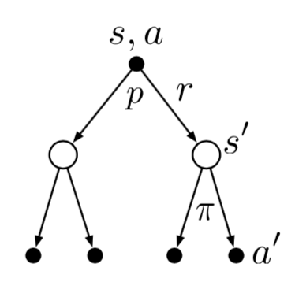

  答：
  $$
  \begin{split}\begin{aligned}
  q_\pi(s, a) &\doteq \mathbb{E}_\pi[G_t|S_t=s,A_t=a] \\
  &= \mathbb{E}_\pi[R_{t+1} + \gamma G_{t+1}|S_t=s,A_t=a] \ \ \ \ \ \ \ \ \ \ \ \ (by\ (3.9)) \\
  &= \sum_{s^\prime}\sum_r p(s^\prime,r|s,a)   \left[r+\gamma\mathbb{E}_\pi[G_{t+1}|S_{t+1}=s^\prime, A_{t+1}=a^\prime]\right] \\
  &= \sum_{s^\prime,r}p(s^\prime,r|s,a)  [r+\gamma \sum_{a^\prime}\pi(a^\prime|s^\prime)q_\pi(s^\prime, a^\prime)]   
  \end{aligned}\end{split}
  $$

- *练习3.18* 状态的价值取决于其下可能的动作的价值，以及当前策略下每个动作发生的概率。下面的 Backup 图描述这种关系。

  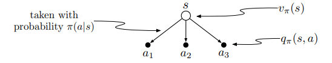

  - 给定$ S_t=s $， 使用预期叶子节点 $q_\pi(s,a)$ 表示根节点 $v_\pi(s)$ ，公式使用数学期望的形式。
  - 同上题给出一个公式，它明确使用 $\pi(a|s)$， 且不出现数学期望的符号。

  答：两个公式分别如下：
  $$
  v_\pi(s) \doteq \mathbb{E}_\pi[q_\pi(S_t, A_t)|S_t=s]
  $$

  $$
  v_\pi(s) \doteq \sum_{a}\pi(a|s) q_\pi(s, a)
  $$

- 练习3.19 动作价值 $q_\pi(s,a)$ 取决于预期的下一个奖励和剩余奖励的预期总和。像上题一样，我们再次给出了小的 Backup 图， 根节点来自一个动作（状态动作对），各个分支是可能的下一个状态。

  

  - 给定 $S_t = s$ 和 $A_t= a$，使用下一个奖励 $R_{t+1}$ 和 下一个预期状态价值 $v_\pi(S_{t+1})$ 表示 $q_\pi(s,a)$，公式使用数学期望的形式。
  - 同上题给出一个公式，它明确使用 $p(s^\prime,r|s,a)$， 且不出现数学期望的符号。
  
  答：两个公式分别如下：
  $$
  q_\pi(s, a) \doteq \mathbb{E}_\pi[R_{t+1} + \gamma v_\pi(S_{t+1})| S_t=s,  A_t=a]
  $$
  
  $$
  q_\pi(s, a) \doteq \sum_{s^\prime,r}p(s^\prime,r|s,a) (r + \gamma v_\pi(s^\prime))
  $$

### 3.6 最优策略和最优价值函数

Optimal Policies and Optimal Value Functions

基本上，解决强化学习任务意味着发现一种长期来看能取得很高奖励的策略。对于有限MDP，我们可以通过以下方式精确地定义一个最优策略。

价值函数对策略进行部分排序，如果对于所有的状态，策略 $\pi$ 的预期收益大于或等于策略 $\pi^\prime$ 的，则我们认为策略 $\pi $ 好于或等于策略 $\pi^\prime$ 。换句话说，对所有 $s\in \mathcal{S}$， 当且仅当 $v_\pi(s)\ge v_{\pi^{^\prime}}(s)$ 时，$\pi\ge\pi^\prime$ 成立。至少总是有一个策略优于或等于所有其他策略，我们称它称为 *最优策略（Optimal Policy）*。虽然可能不止一个，我们使用 $\pi_* $ 统一标记所有最优策略。它们共享同样的状态价值（state-value）函数，称为 *最优状态价值函数optimal state-value function*，表示为 $v_*$，定义如下：
$$
v_*(s) \doteq \max_\pi v_\pi(s)，  \ \ \ \ for \ all \ s\in \mathcal{S}  \tag {3.15}
$$
最佳策略共享相同的*最优动作价值函数（optimal action-value function）*，表示为 $q_*$，定义如下：
$$
q_*(s,a) \doteq \max_\pi q_\pi(s,a) \ \ \ \ for \ all \ s\in \mathcal{S}  \  and  \ a\in \mathcal{A} \tag {3.16}
$$
对于状态价值对 $(s, a)$，这个函数给出了在状态 $s$ 执行 $a$ 动作，并在此后遵循最优策略的预期收益。因此我们用 $q_*$ 来表示 $v_*$， 定义如下：
$$
q_*(s,a) = \mathbb{E}\left[R_{t+1}+\gamma v_* (S_{t+1})|S_t=s,A_t=a\right] \tag {3.17}
$$
#### **例3.7 高尔夫的最优价值函数** 

图3.3（同下图）的下部展示了一个可能的最优动作价值函数 $q_*(s,driver)$ 的轮廓线。


- 如果我们首先用木杆击球，然后选择木杆或推杆，这样每个状态的价值（比起一直使用推杆）会更好。
- 木杆可以把球击的更远，但精度差一些。只有距离非常近，木杆击球才能一杆进洞。因此， $q_*(s,driver)$ 的 $-1$ 的轮廓线只占据了绿色区域非常小的一块。
- 如果有两次击球，我们可以从非常远的地方开球，如 $-2$ 轮廓线所示。这种情况下，不必击球到小的 $-1$ 轮廓线内，而是，只要进入绿色区域，使用推杆一杆进洞。在选择了第一个动作（本例中是木杆）之后，根据最佳动作价值函数给出的价值，选择最好的那个动作就好。
- $-3$ 轮廓线非常远，包括了发球区。从发球区开始，最好动作序列是：两次木杆，一次推杆。三杆进洞。

因为 $v_*$ 是策略的价值函数，所以满足贝尔曼方程关于状态价值的自洽条件（self-consistency condition）。因为它是最佳价值函数，所以 $v_*$ 的自洽条件可以写成特殊的形式（不必引用任何的具体策略），这就是 $v_*$ 的贝尔曼方程，或者说是*贝尔曼最优方程（Bellman optimality equation）*。直观上地，贝尔曼最优方程式表达了这样一个事实，即最优策略下的状态价值必须等于来自该状态的最佳行动的预期收益：
$$
\begin{split}\begin{aligned}
v_*(s) &= \max_{a\in\mathcal{A}(s)} q_{\pi_*}(s,a) \\
&=\max_a \mathbb{E}_{\pi_*}[G_t|S_t=s,A_t=a] \\
&=\max_a \mathbb{E}_{\pi_*}[R_{t+1}+\gamma G_{t+1}|S_t=s,A_t=a]  \ \ \ \ & (by (3.9)) \\
&=\max_a \mathbb{E}[R_{t+1}+\gamma v_*(S_{t+1})|S_t=s,A_t=a] \ \ \ \ &( 3.18) \\
&=\max_{a\in \mathcal{A}(s)}\sum_{s^\prime,r} p(s^\prime,r|s,a)[r+\gamma v_*(s^\prime)] \ \ \ \  &(3.19)
\end{aligned}\end{split}
$$
最后两个方程是  $v_*$  的贝尔曼最优方程的两种形式， $q_*$  的贝尔曼最优方程为：
$$
\begin{split}\begin{aligned}
q_*(s,a) &= \mathbb{E}\left[R_{t+1}+\gamma\sum_{a^\prime}q_*(S_{t+1,a^\prime})|S_t=s,A_t=a\right] \\
&=\sum_{s^\prime,r}p(s^\prime,r|s,a)[r+\gamma \max_{a^\prime}q_*(s^\prime,a^\prime)]
\end{aligned}\end{split} \tag {3.20}
$$
下图中的Backup 图显示了贝尔曼最优方程中 $v_*$ 和 $q_*$ 的未来状态和动作。和之前的 Backup 图比较，在个体选择节点增加了圆弧，这个圆弧表示选择价值最大的那个。下图左边部分图形化展示了方程（3.19），而右边部分图形化展示了方程（3.20）。

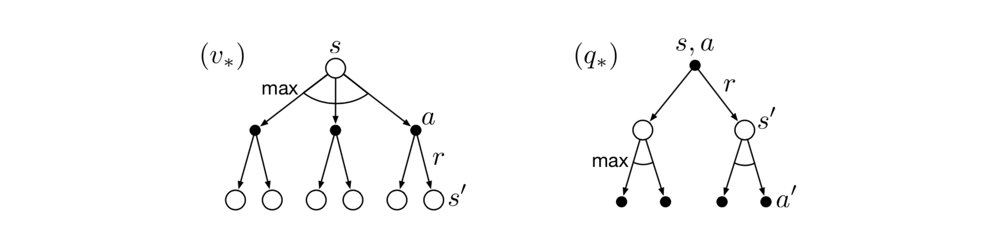
$$
\text {图3.4：} v_* \text 和 q_* \text { 的 Backup 图}
$$
对于有限 MDP，对于 $v_*$ 的贝尔曼最优方程（3.19）具有唯一解。 贝尔曼最优方程实际上是一个方程组，每个状态一个方程，所以如果有 $n$ 个状态， 则有 $n$ 个未知数的 $n$ 个方程。如果环境的动态 $p$ （笔者：指$p(s^\prime,r|s,a)$）是已知，则原则上可以使用解决非线性方程组的各种方法之一来求解该 $v_*$ 的方程组。 同理，可以求解 $q_∗$ 。

一旦知道了 $v_*$ ，确定最优策略相对就比较容易了。对于每一个状态，根据贝尔曼方程，都有一个或多个最大价值的动作。选择这些动作就是最佳策略，即只要搜索一步（one-step） 便可。 换句话说，对于最优评估函数 $v_*$，Greedy 方法就是最佳策略。Greedy 方法根据短期的结果选择动作，但 $v_*$ 的精妙之处在于，它已经考虑到所有可能的未来动作的奖励结果，这使得 Greedy 方法在长期来看也变得最好。由此，一步一步的（one-step-ahead）的搜索产生了长期最佳动作。

如果知道了 $q_*$ , 选择最优动作变得更加容易了。有了$q_*$，个体甚至都不需要进行 one-step-ahead 搜索。对于任意状态，选择使得 $q_*(s,a)$ 最大的那个动作就好。动作价值函数有效地保存了 one-step-ahead 搜索地结果。

#### **例3.8：解决网格世界问题** 

对于例3.5的简单网格任务，假设我们已经求解出了 $v_*$ 的贝尔曼方程。下图中间部分是最优价值函数。右边部分是对应的最佳策略（多个箭头表示这两个方向（动作）都是最佳的）。

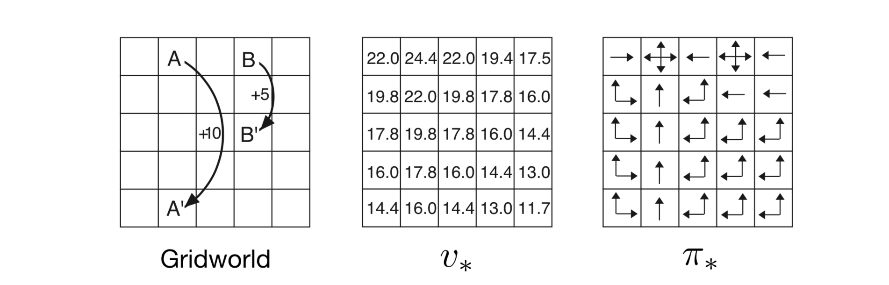

**例3.9：回收机器人的贝尔曼最优方程** 


使用公式（3.19），我们可以为回收机器人示例明确地给出贝尔曼最优方程。为了节省空间，状态 high, low 分别用 h, l 表示, 而动作 search, wait 和 recharge 分别用 s, w 和 re 表示。由于只有两个状态，贝尔曼最优方程由两个方程组成。其中 $v_*(h)$ 如下所示：
$$
\begin{split}\begin{aligned}
v_*(h)&=\max\left\{
    \begin{array}{lr}
        p(h|h,s)[r(h,s,h)+\gamma v_*(h)]+p(l|h,s)[r(h,s,l)+\gamma v_*(l)],\\
        p(h|h,w)[r(h,w,h)+\gamma v_*(h)]+p(l|h,w)[r(h,w,l)+\gamma v_*(l)]
    \end{array}\right\} \\
&=\max\left\{
    \begin{array}{lr}
        \alpha[r_s + \gamma v_*(h)]+(1-\alpha)[r_s +\gamma v_*(l)],\\
        l[r_w+\gamma v_*(h)]+0[r_w+\gamma v_*(l)]
    \end{array}\right\} \\
&=\max\left\{
    \begin{array}{lr}
        r_s+\gamma[\alpha v_*(h)+(1-\alpha)v_*(l)],\\
        r_w + \gamma v_*(h)
    \end{array}\right\}
\end{aligned}\end{split}
$$
同理，我们可以得到 $v_*(l)$。
$$
\begin{split}v_*(l)=\max\left\{
    \begin{aligned}
        &\beta r_s - 3(1-\beta)+\gamma[(1-\beta)v_*(h)+\beta v_*(l)], \\
        &r_w + \gamma v_*(l),\\
        &\gamma v_*(h)
    \end{aligned}
\right\}\end{split}
$$
对于任意的 $r_s,\ r_w,\ \alpha, \ \beta $, 且 $0 \le\gamma<1, \ 0 \le \alpha,\beta\le 1$。 正好有一对 $v_*(h)$ 和 $v_*(l)$ 同时满足上面的两个非线性方程组。

明确求解贝尔曼最优方程提供了找到最优策略的一条途径，从而解决强化学习问题。然而，这个方案很少直接的被采用。该方案是一种详尽搜索（exhaustive search），查找所有的可能性，计算它们的发生概率和预期的奖励。它有三个假设（实际中，很少同时满足）：

1. 准确地知道环境的形态（Dynamics）。
2. 足够的计算资源来完成计算。
3. 状态符合马尔可夫性（Markov property）。

我们感兴趣的任务往往会违反其中的某一个假设。例如：对于西洋双陆棋游戏（Backgammon），满足第1，3个假设，然而第2个假设是主要的障碍，因为游戏有 $10^{20}$ 种状态，即使使用当前最快的计算机，也需要数千年年才能完成。于是，在强化学习中通常要计算近似解。

许多不同的决策支持方法可以被看作是贝尔曼最优方程的近似解决方法。举个例子，启发式（heuristic）搜索方法扩展了（3.19）的右边，使之达到一定的深度，形成一棵可能性构成的树，然后使用启发式评估函数近似求解叶子节点的 $v_*$。而动态规划（ dynamic programming）方法与贝尔曼最优方程的关联甚至更加紧密。 

#### 练习3.20-3.29

- *练习3.20* 对于高尔夫球示例，绘制或描述最佳状态价值函数。

  答：是图3.3 上下图的一个合成。用上图中绿色部分覆盖下图相同区域便可。根据公式：
  $$
  v_*(s) = \max_{a\in\mathcal{A}(s)} q_{\pi_*}(s,a)
  $$

  - 当球处于下图中$-3，-2$轮廓线之间时，$q_{*}(s, driver) \geq q_{*}(s, putter)$，则 $v_*(s) = q_{*}(s, driver) = -3$。
  - 当球处于下图中$-2，-1$轮廓线之间时，$q_{*}(s, driver) \geq q_{*}(s, putter)$，则 $v_*(s) = q_{*}(s, driver)=-2$。
  - 当球处于下图中$-1$轮廓线内时，$q_{*}(s, driver) \leq q_{*}(s, putter)$，则 $v_*(s) = q_{*}(s, putter)=-1$。

  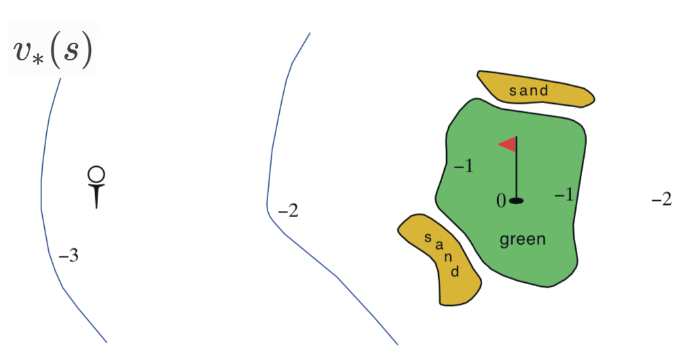

  

- 练习3.21 对于高尔夫球示例，绘制或描述 $q_*(s,putter)$ 最佳动作价值的轮廓线。

  答：根据公式（3.20），可得：
  $$
  \begin{split}\begin{aligned}
  q_*(s,a) &= \mathbb{E}\left[R_{t+1}+\gamma\sum_{a^\prime}q_*(S_{t+1,a^\prime})|S_t=s,A_t=a\right] \\
  &=\sum_{s^\prime,r}p(s^\prime,r|s,a)[r+\gamma \max_{a^\prime}q_*(s^\prime,a^\prime)] \\
  &=\sum_{s^\prime,r}p(s^\prime,r|s,a)[r+\gamma v_*(s^\prime)] 
  \end{aligned}\end{split}
  $$
  于是，对于 $$q_*(s,putter)$$，可以进行如下推导。
  $$
  \begin{split}\begin{aligned}
  q_*(s,putter) &= 
  \sum_{s^\prime,r}p(s^\prime,r|s,putter)[r+\gamma v_*(s^\prime)]  & (by\ \gamma=1, \  r=-1) \\
  &=  \sum_{s^\prime}p(s^\prime|s,putter)[-1+v_*(s^\prime)]
  \end{aligned}\end{split}
  $$
  下面结合下图 $V_{putt}$和上一题的 $v_*(s)$ 进行分析。

  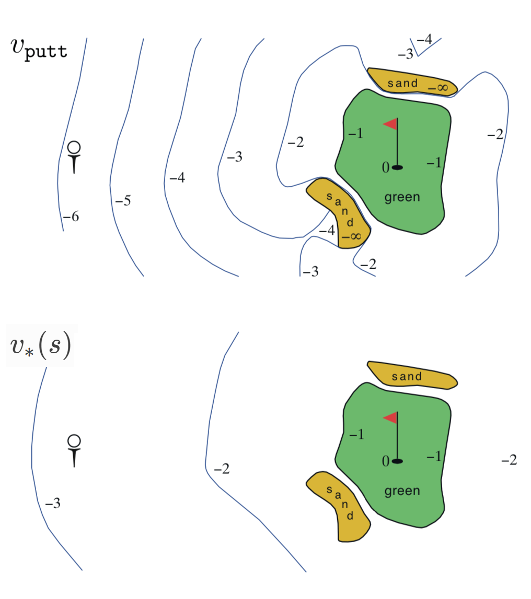

  - 当球处于图中上半部分$-6，-5$轮廓线之间时，一次推杆后，球必然会进入 $-5，-4$ 轮廓线之间，观察可得，该区域 $v_*(s^\prime)=-3$，于是可得： 
    $$
    \begin{split}\begin{aligned}
    q_*(s,putter) 
    &=  \sum_{s^\prime}p(s^\prime|s,putter)[-1-3] \\
    &= -4 \sum_{s^\prime}p(s^\prime|s,putter) \\
    &= -4
    \end{aligned}\end{split}
    $$

  - 当球处于图中上半部分$-5，-4$轮廓线之间时，一次推杆后，球必然会进入 $-4，-3$ 轮廓线之间，观察可得，该区域一部分 $v_*(s^\prime)=-3$， 另外一部分 $v_*(s^{\prime\prime})=-2$，，于是可得： 
    $$
    \begin{split}\begin{aligned}
    q_*(s,putter) 
    &=  \sum_{s^\prime}p(s^\prime|s,putter)[-1-3] + \sum_{s^{\prime\prime}}p(s^{\prime\prime}|s,putter)[-1-2] \\
    &= -4 \sum_{s^\prime}p(s^\prime|s,putter) -3\sum_{s^{\prime\prime}}p(s^{\prime\prime}|s,putter) \\
     &= -3 - \sum_{s^\prime}p(s^\prime|s,putter) 
    \end{aligned}\end{split}
    $$
    其中 $s^\prime$ 表示上半部分轮廓线 $-4$ 和下半部分轮廓线 $-2$ 之间的区域。 $s^{\prime\prime}$ 表示下半部分轮廓线 $-2$ 和上半部分轮廓线 $-3$ 之间的区域。

  - 当球处于图中上半部分$-4，-3$轮廓线之间时，一次推杆后，球必然会进入 $-3，-2$ 轮廓线之间，观察可得，该区域一部分 $v_*(s^\prime)=-3$， 另外一部分 $v_*(s^{\prime\prime})=-2$，，于是可得： 
    $$
    \begin{split}\begin{aligned}
    q_*(s,putter) 
    &=  \sum_{s^\prime}p(s^\prime|s,putter)[-1-3] + \sum_{s^{\prime\prime}}p(s^{\prime\prime}|s,putter)[-1-2] \\
    &= -4 \sum_{s^\prime}p(s^\prime|s,putter)  -3\sum_{s^{\prime\prime}}p(s^{\prime\prime}|s,putter) \\
     &= -3 - \sum_{s^\prime}p(s^\prime|s,putter) 
    \end{aligned}\end{split}
    $$
    其中 $s^\prime$ 表示上半部分轮廓线 $-3$ 和下半部分轮廓线 $-2$ 之间的区域。 $s^{\prime\prime}$ 表示下半部分轮廓线 $-2$ 和上半部分轮廓线 $-2$ 之间的区域。

  - 当球处于图中上半部分$-3，-2$轮廓线之间时，一次推杆后，球必然会进入 $-2，-1$ 轮廓线之间，观察可得，该区域 $v_*(s^\prime)=-2$，于是可得：
    $$
    \begin{split}\begin{aligned}
    q_*(s,putter) 
    &=  \sum_{s^\prime}p(s^\prime|s,putter)[-1-2] \\
    &= -3 \sum_{s^\prime}p(s^\prime|s,putter) \\
    &= -3
    \end{aligned}\end{split}
    $$

  - 当球处于图中上半部分$-2，-1$轮廓线之间时，一次推杆后，球必然会进入 $ -1$ 轮廓线之内（即绿色区域），该区域 $v_*(s^\prime)=-1$，于是可得：
    $$
    \begin{split}\begin{aligned}
    q_*(s,putter) 
    &=  \sum_{s^\prime}p(s^\prime|s,putter)[-1-1] \\
    &= -2 \sum_{s^\prime}p(s^\prime|s,putter) \\
    &= -2
    \end{aligned}\end{split}
    $$

  - 当球处于图中上半部分$-1$轮廓线之内（即绿色区域），一次推杆后，球必然会进入进洞， $v_*(s^\prime)=0$，于是可得：
    $$
    \begin{split}\begin{aligned}
    q_*(s,putter) 
    &=  \sum_{s^\prime}p(s^\prime|s,putter)[-1-1] \\
    &= -1 \sum_{s^\prime}p(s^\prime|s,putter) \\
    &= -1
    \end{aligned}\end{split}
    $$

- *练习3.22* 考虑下图显示的持续MDP。唯一的决策是在顶点状态，有左，右两个动作可以选择。每次动作收到确定的奖励。有两个确定性的策略：$\pi_{left}$ 和 $\pi_{right}$。如果 $\gamma  = 0$，哪一个策略更好？如果 $\gamma  = 0.9$？如果 $\gamma = 0.5$？ 

  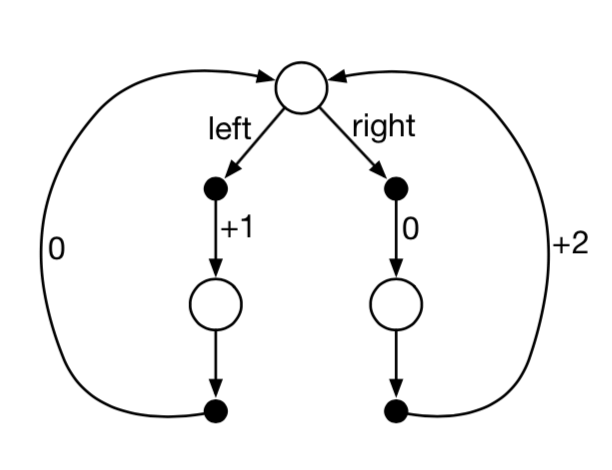

  答：对于确定性的策略，且每个动作奖励固定， 则状态价值函数 $v_\pi(s) = r +  \gamma v_\pi(s^\prime) $，可得：
  $$
  v_{\pi_{left}}(top) = 1+\gamma^2 + \gamma^4 + \cdots +  = \frac 1 {1- \gamma^2} \\
  v_{\pi_{right}}(top) = 2\gamma + 2\gamma^3 + 2\gamma^5  + \cdots +  = \frac {2\gamma} {1- \gamma^2}
  $$

  - 如果 $\gamma=0$，则 $v_{\pi_{left}}(top)  = 1,v_{\pi_{right}}(top) = 0  $，$\pi_{left}$ 更好。
  - 如果 $\gamma=0.9$，则  $v_{\pi_{left}}(top)  = \frac {100} {19},v_{\pi_{right}}(top) = \frac {180} {19}  $，$\pi_{right}$ 更好。
  - 如果 $\gamma=0.5$，则  $v_{\pi_{left}}(top)  = \frac 4 3,v_{\pi_{right}}(top) = \frac 4 3  $，两个策略表现相同。

- *练习3.23* 给出回收机器人的 $q_*$ 贝尔曼方程。

  

  答：根据公式（3.20），可得：
  $$
  \begin{split}\begin{aligned}
  & q_*(h,s) = r_s +\gamma [\alpha \max_{a} q_{*}(h,a)+ (1-\alpha)\max_{a} q_{*}(l,a)]  \\
  &q_*(h,w) =  r_w +\gamma \max_{a} q_{*}(h,a) \\
  &q_*(l,s)=  r_s - 3(1-\beta)+\gamma[(1-\beta)\max_{a} q_{*}(h,a)+\beta \max_{a} q_{*}(l,a))]\\
  &q_*(l,w)=  r_w +\gamma \max_{a} q_{*}(l,a) \\
  &q_*(l,re) =  \gamma \max_{a} q_{*}(h,a)
  \end{aligned}\end{split}
  $$

- *练习3.24* 图3.5给出了网格世界的最佳状态的价值为 $24.4$。基于最优策略，使用公式（3.8）表示并计算该价值（保留三位小数）。

  

  答：根据最佳策略，从$A$ 出发，只有一条路径，经过5步完成，又返回A。根据公式（3.8），可得：
  $$
  \begin{split}\begin{aligned}
  G_{t} &= \sum_{k=0}^{\infty}\gamma^k R_{t+k+1} \\
   &=0.9^0 \times 10 + 0.9^1 \times 0 + 0.9^2\times 0 + 0.9^3 \times 0+ 0.9^4  \times 0 + 0.9^5 \times  10 + \cdots \\
   &= 10+ 0.9^5 \times  10+ 0.9^{10}\times  10 + \cdots\\
   &= \frac {10} {1-0.9^5} \\ &= 24.419
  \end{aligned}\end{split}
  $$

- *练习3.25* 使用 $q_*$ 表示 $v_*$。

  答：
  $$
  v_*(s) &= \max_{a} q_{*}(s,a) \\
  $$

- *练习3.26* 使用 $v_*$ 和四参数 $p$ 表示 $q_*$。

  答：
  $$
  \begin{split}\begin{aligned}
  q_*(s,a) &= \mathbb{E}\left[R_{t+1}+\gamma\sum_{a^\prime}q_*(S_{t+1,a^\prime})|S_t=s,A_t=a\right] \\
  &=\sum_{s^\prime,r}p(s^\prime,r|s,a)[r+\gamma \max_{a^\prime}q_*(s^\prime,a^\prime)] \\
  &=\sum_{s^\prime,r}p(s^\prime,r|s,a)[r+\gamma v_*(s^\prime)] 
  \end{aligned}\end{split}
  $$

- *练习3.27* 使用 $q_*$ 表示 $\pi_*$。

  答：
  $$
  \pi_*(a|s)=
  \begin{equation}  
  \left\{  
  \begin{array}{lcl}  
   1        &  & if \ a = argmax_{a^{\prime}} q_*(s, a^{\prime}) \\  
   0 &  & otherelse 
  \end{array}  
  \right.  
  \end{equation}
  $$
  
- *练习3.28* 使用 $v_*$ 和四参数 $p$ 表示 $\pi_*$。

  答：
  $$
  \pi_*(a|s)=
  \begin{equation}  
  \left\{  
  \begin{array}{lcl}  
   1        &  & if \ a = argmax_{a^{\prime}} \sum_{s^\prime,r}p(s^\prime,r|s,a^\prime)[r+\gamma v_*(s^\prime)]  \\  
   0 &  & otherelse 
  \end{array}  
  \right.  
  \end{equation}
  $$
  
- 练习3.29 使用公式（3.4）和公式（3.5）表示四个贝尔曼方程的价值函数：$v_\pi, \ v_*, \ q_\pi, \  q_*$。

  答：从定义出发，可得：
  $$
  \begin{split}\begin{aligned}
  &v_\pi(s) 
  =\sum_a\pi(a|s) [r(s, a)+ \gamma \sum_{s^\prime}p(s^\prime|s,a) v_\pi(s^\prime)] \\
  &v_*(s)  =\max _a [r(s, a)+ \gamma\sum_{s^\prime}p(s^\prime|s,a) v_\pi(s^\prime)] \\
  &q_\pi(s, a) = r(s, a)+ \gamma \sum_{s^\prime}p(s^\prime|s,a)  \sum_{a^\prime}\pi(a^{\prime}|s^\prime) q_\pi(s^\prime, a^{\prime})\\
  &q_*(s, a) = r(s, a)+ \gamma \sum_{s^\prime}p(s^\prime|s,a)  \max_{a^\prime}\pi(a^{\prime}|s^\prime) q_\pi(s^\prime, a^{\prime})
  \end{aligned}\end{split}
  $$

#### 练习：网格世界

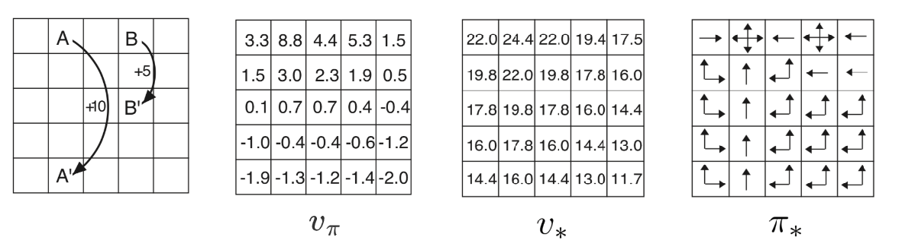

例3.5和例3.8 分别显示了价值函数和最优价值函数。求解 $v_\pi$ 和 $v_*$，需要和上面的数值接近。

答：根据网格世界的特性，可以得出 $$ p(s^\prime,r|s,a)=1 $$，即状态 $s$ 下 执行$ a$， 会进入确定性的状态 $s^\prime $ ，且奖励 $r$也是确定的。由此可以得到： 
$$
\begin{split}\begin{aligned}
v_\pi(s) &\doteq \sum_a\pi(a|s) \sum_{s^\prime,r}p(s^\prime,r|s,a)[r+\gamma v_\pi(s^\prime)] \\
&= \sum_a \pi(a|s)  [r+\gamma v_\pi(s^a)]
\end{aligned}\end{split}
$$

$$
\begin{split}\begin{aligned}
v_\pi(s) &= \sum_a \pi(a|s)  [r+\gamma v_\pi(s^a)] \\
\sum_a \pi(a|s)  \gamma v_\pi(s^a) - v_\pi(s) &= -\sum_a \pi(a|s) r \\
\begin{bmatrix} \pi(south|s)\gamma & \pi(north|s)\gamma & \pi(east|s)\gamma & \pi(west|s)\gamma & -1 \end{bmatrix} \begin{bmatrix} v_\pi(s^{north}) \\ v_\pi(s^{south}) \\ v_\pi(s^{east}) \\ v_\pi(s^{west}) \\ v_\pi(s) \end{bmatrix} &= -\sum_a \pi(a|s) r
\end{aligned}\end{split}
$$

### 3.7 优化和近似

Optimality and Approximation

我们已经定义了最优价值函数和最优策略。显然，学习到最优策略的个体会表现很好，但是现实中很少发生这种情况。对于我们感兴趣的各种任务，生成最优策略的计算成本非常高昂。因此，即使我们有一个完整和准确的环境动态模型，简单地想通过求解贝尔曼最优方程来计算最优策略，这通常是不可能的。例如，像西洋双陆棋这样的棋盘游戏只是人类经验的很小一部分，但即使是大型定制的计算机仍然无法完成最优动作的计算。个体面临的一个关键问题是可用的计算能力，尤其是单个时间步长中可以执行的计算量。

可用的内存也是一个重要的限制。通常，建立价值函数，策略和模型的近似值需要大量的内存。对于小的有限状态集的任务来说，使用数组或表格来近似表达每个状态（或状态-动作对）是可能的。 这种情况我们称之为表格（tabular）案例，其对应的方法称之为表格（tabular）方法。然而，对于我们感兴趣的实际案例，其巨量的状态无法在表格中保存。这种情况下，必须使用某种更紧凑的参数化函数来近似表示。

强化学习问题的这种结构迫使我们不得不接受近似的结果，然而，这也使得我们能够极不寻常的发现了一些有用的近似方法。例如：在逼近最优动作时，个体会经常以较低的概率选择一个次优动作，这种选择对于个体收到的奖励总量几乎没有影响。*Tesauro* 开发了西洋双陆棋游戏程序（名为TD-Gammon）。当棋盘的盘面以前（和专家对弈）重来没有出现过时，它可能会下出臭棋，但是，它的表现的棋艺仍然让人赞叹。事实上，TD-Gammon对于游戏状态的很多设定都是错误的。强化学习的在线特性（online nature）使得它花费更多努力来学习频繁出现的状态，而不是那些很少出现的状态。这是区分强化学习与其他（近似解决MDP的）方法的一条关键性质。

### 3.8 总结

让我们总结一下本章中提出的强化学习问题的要素。强化学习是从互动中学习如何行动以便实现目标的。 强化学习的个体和环境在一系列离散的时间步长进行交互。一个特定任务的规范的接口定义如下：

- *动作* 是个体做的选择。
- *状态* 是做出选择的基础。
- *奖励* 是评估选择的基础。 
- *个体* 内的一切都是由个体完全知晓和控制的。
- *环境* 是不完全可控的，可能完全知道也可能完全不知道。
- *策略* 是一种随机规则（stochastic rule），个体通过该规则基于状态函数选择动作。
- *个体目标* 是最大长期累积奖励。

当上述强化学习设定能用转换概率（transition probabilities）清晰定义时，它构成马尔可夫决策过程（Markov decision process，即MDP）。 有限MDP具有有限的状态，动作和（我们制定的）奖励集。 当前大量的强化学习理论局限于有限的MDP，但其方法和思想应用更为广泛。

*收益* 是个体寻求最大化未来奖励的函数。 它有几个不同的定义，取决于任务的性质，以及是否希望 *衰减（discount）* 延迟奖励。 无衰减的公式适用于 *回合* 任务（episodic tasks），其中个体和环境的交互可以自然地分解在回合中； 衰减的方案适用于 *持续任务（continuing tasks）*，其互动本身并不会自然地分解在回合中，而是无限制的持续下去。我们定了一组公式，它同时适用于这两种任务。

对于每一个状态或状态价值对，一个策略的价值函数（ $v_\pi$ 和 $q_\pi$ ）会指定其一个预期收益。而最优价值函数（ $v_*$ 和 $q_*$ ）指定了最大预期收益。价值函数最优的策略是 *最优策略*。对于给定的MDP任务，虽然最优状态价值函数是唯一的，但最佳策略可以存在多个。基于最优价值函数的贪婪方法就是最优策略。*贝尔曼最优方程* 是最佳价值函数必须满足的特殊一致性条件， 并且原则上可以针对最优价值函数求解。

基于对个体最初可用的知识水平的假设，可以以各种不同的方式提出强化学习问题。在 *完全知识（complete knowledge）* 的问题中，个体拥有完整而准确的环境动态模型， 这个模型可以用四参数动态方程（3.2）来表示。而对于*知识不完整（ incomplete knowledge）* 的问题，完整而完美的环境模型是不存在的。

即使个体拥有完整和准确的环境模型，由于每个时间步内存和计算能力的限制，通常个体也无法充分利用这个模型。 尤其，构建价值函数，策略和模型的精确逼近值需要大量的内存。在大多数具有实际意义的案例中，实际的状态个数远远多于（价值函数）表中的能够容纳的数量。

我们严格定义了在本书中描述的强化学习方法，并提供了理解各种学习算法的理论基础。然而，强化学习个体只能以某种程度的接近理想值。 或许无法找到最优解决方案，能够以某种方式得到近似值也是非常好的。

#### 书目和历史评论

略

## 4 动态规划

Dynamic Programming

动态规划（Dynamic Programming，简称 DP）这个术语是指：给定的完美的环境模型作为马尔可夫决策过程（MDP）的情况下，计算最优策略的算法集合。传统的 DP 算法在强化学习上应用有限，不仅因为其完美模型的假设，也因为其巨大的计算成本，但是在理论方面，它们依然非常重要。 DP 算法为本书后面章节的理解提供了必要的基础。事实上，所有这些章节中方法都可以被看成一种尝试，它们尝试获取与 DP 算法相同的效果， 所不同的是这些方法需要较少的计算量，并且不用假设完美的环境模型。

从本章开始，我们通常环境是一个有限 MDP。也就是说，我们假定：

- 状态集合 $\cal{S}$，动作集合 $\cal{A(s)}$ 和奖励集合 $\cal{R}$ 都是有限的，
- 环境所有的动态由一组概率 $p(s^\prime,r|s,a)$ 给出。其中 $\cal{s}\in\cal{S},\ a\in\cal{A(s)},\  \cal{s}'\in\mathcal{S}^+$ （$\mathcal{S}^+$是指对于回合任务，即 $\mathcal{S}$ 加上终止状态)。

虽然 DP 思想可以被用到连续状态和动作空间的问题中，但是只有少数特殊的案例能得到精确地求解。对于连续状态和动作空间，获取近似解得通常做法是首先对它们进行分层处理（笔者：使得它们变成有限的集合），然后再使用有限状态的 DP 方法。本书第二部分中讨论的方法也适用于这些连续问题，它们是通常做法的非常重要的扩展。

通常，DP 和强化学习的核心思想是使用价值函数去搜索好的策略。本章中，我们将展示使用 DP 如何计算第三章中定义的价值函数。如前文所述，一旦找到如下的最优价值函数  $v_*$ 或者 $q_*$ ，最优策略便很容易获得。
$$
\begin{split}\begin{aligned}
v_*(s) &= \max_a\mathbb{E}[R_{t+1}+\gamma v_*(S_{t+1}) | S_t=s,A_t=a] \\
&= \max_a\sum_{s',r}p(s',r|s,a)[r+\gamma v_*(s')]
\end{aligned}\end{split}   \tag {4.1}
$$
或
$$
\begin{split}\begin{aligned}
q_*(s,a)& = \mathbb{E}[R_{t+1}+\gamma \max_{a'} q_*(S_{t+1},a') | S_t=s,A_t=a]\\
&=\sum_{s',r}p(s',r|s,a)[r+\gamma\max_{a'} q_*(s',a')],
\end{aligned}\end{split} \tag {4.2}
$$
其中 $\cal{s}\in\cal{S},\ a\in\cal{A(s)},\  \cal{s}'\in\mathcal{S}^+$ 。我们将看到，DP算法其实是将贝尔曼方程转换为一种更新规则，该规则可以逐步提升价值函数的近似效果。

### 4.1 策略评估（预测）

 Policy Evaluation (Prediction)

首先，我们给任意策略 $\pi$ 计算状态价值函数 $v_\pi$。这在DP文献中被称作 *策略评估（policy evaluation）*，而我们把它称作为 *预测问题（prediction problem）*。下面回忆一下第三章的公式，对于所有的 $s\in\mathcal{S}$。
$$
\begin{split}\begin{aligned}
v_\pi(s) & \doteq \mathbb{E_\pi}[G_t | S_t=s] \\
&= \mathbb{E_\pi}[R_{t+1} + \gamma G_{t+1} | S_t=s]  &(from\ (3.9)) \\
&= \mathbb{E_\pi}[R_{t+1}+\gamma v_\pi(S_{t+1}) | S_t=s] & (4.3) \\
&= \sum_a\pi(a|s)\sum_{s',r}p(s',r|s,a)[r+\gamma v_\pi(s')]，& (4.4)
\end{aligned}\end{split}
$$
如果环境动力学模型（ $p(s',r|s,a)$ 和 $\pi(a|s)$ ）完全已知，公式 $4.4$ 就是一组线性方程组，它的个数是 $|\mathcal{S}|$ 个，未知数（$v_\pi(s),s\in\mathcal{S}$）也是 $|\mathcal{S}|$ 个。用迭代法来求解最合适了。考虑一系列的近似值函数 $v_0,v_1,v_2,...$，初始的近似值 $v_0$ 可以是任意值（除了终止状态，它的值必须为0），然后使用公式（4.4）作为更新规则进行逐步求解。
$$
\begin{split}\begin{aligned}
v_{k+1}(s)& \overset{\cdot}{=}\mathbb{E}[R_{t+1}+\gamma v_k(S_{t+1}) | S_t=s] \\
&= \sum_{a}\pi(a|s)\sum_{s',r}p(s',r|s,a)[r+\gamma{v_k(s')}],
\end{aligned}\end{split} \tag {4.5}
$$
以上这种算法称之为*迭代策略评估（iterative policy evaluation）*。

> 笔者：为了更加简洁，公式（4.5）没有标记 $\pi$，而标记了$k$ ，它表示迭代求解的一个顺序。

在执行每次迭代近似过程中，根据 $v_k$ 计算 $v_{k+1}$。迭代策略评估对每个状态 $s$ 采取了相同的操作：在每次策略评估时进行一步转换（one-step transitions），即用状态 $s$ 新的价值替换旧值，新的价值来自于 $s$ 的后续状态的价值以及预期即时奖励。我们把这种操作称之为 *expected update*。DP算法中有几种 *expected update* 方法，它们的区别在于：

- 基于状态还是状态动作对进行更新。
- 后续状态价值合并计算的方式不同。

*expected update* 可以用上面的方程表示，也可以用第三章中介绍的 Backup 图表示。

迭代策略评估的完整版本以伪代码显示如下。需要注意控制算法的终止。理论上，迭代策略评估可以收敛于极限，但是实际上，必须在此之前停止。下面的伪代码中，在每一次迭代后，计算 $\max_{s\in\mathcal{S}}|v_{k+1}(s)-v_k(s)|$，当其值足够小的时候，循环终止。

> **迭代策略评估，用于估算 $V \approx v_\pi$**
>
> 输入：
>
> - $\pi$: 要被评估的策略。
>
> - $\theta$: 算法参数：一个小的阈值 $\theta > 0$， 它用于控制估计的准确性。
> - $V(s)$：进行初始化，当 $s\in\mathcal{S}^+$，可以是任意值，当是终止节点，$V(terminal) = 0$。
>
> $$
> \begin{flalign}
> & \text {Loop} &\\
> & \quad \Delta \leftarrow 0  \\
> & \quad \text {Loop for each } s \in \mathcal S:\\
> & \quad \quad v \leftarrow V(s)\\
> & \quad \quad V(s) \leftarrow \sum_{a}\pi(a|s)\sum_{s',r}p(s',r|s,a)[r+\gamma V(s')]\\
> & \quad \quad \Delta \leftarrow \max(\Delta,|v-V(s)|)\\
> & \quad \text {until } \Delta < \theta
> \end{flalign}
> $$

#### 例4.1： $4 \times 4$ 的网格世界

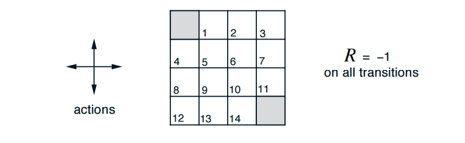

- 非终止状态 $ \mathcal S=\{1,2,...14\}$  

- 每个非终止状态有四个可能的动作 $\mathcal A = \{up, down, right, left\}$

  - 每个动作发生概率相同。
  - 试图把个体移出网格的动作将会被忽略，也就是状态不会发生任何变化。
  - 其他动作都会明确使得状态发生转换。

  可以得到：$p(6,-1|5, right)=1$，$p(7,-1|7, right)=1$， $p(10,r|5,right)=0$

- 每一次动作的奖励为 -1 ，即 $r(s,a,s')=-1$。

- 没有衰减因子，阴影的格子是终止状态。

- 图4.1 左列显示的是每次代策略评估后的价值函数 $v_k$。

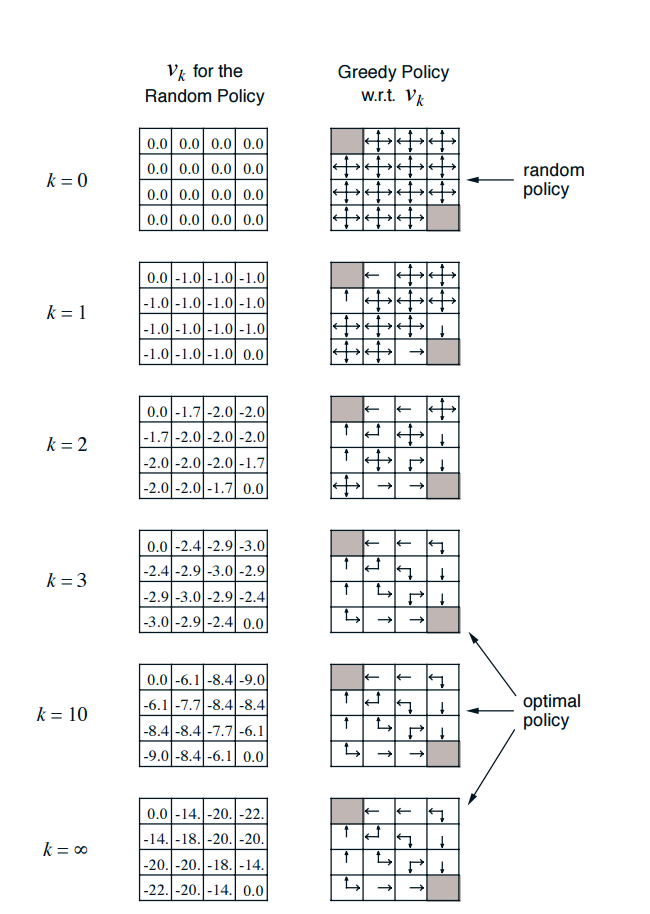

$$
\text {图4.1：迭代策略评估在一个小的棋盘格游戏上收敛。}
$$
上图左边一列是对于随机策略（所有的动作概率相等）下的状态价值函数。 右边一列是基于左边价值函数的 Greedy 策略。 经过三次迭代后，最优策略已经产生。

#### 练习4.1-4.3

- *练习4.1* 在例4.1中，如果 $\pi$ 是等概率随机策略， 求 $q_\pi(11,down)$ 和 $q_\pi(7,down)$？

  答：
  $$
  \begin{aligned}
  q_\pi(11,down) &= -1 + v_\pi(terminal) = -1 \\
  q_\pi(7,down) &= -1 + v_\pi(11) = -15
  \end{aligned}
  $$
  
- *练习4.2* 在例4.1中，增加一个状态 $15$，它位于状态 $13$ 的下面，它的四个动作 left，up，right 和 down 对应的变换状态分别为 12，13，14，15。

  - 如果状态 $13$ 下执行 down 动作后，状态不变（还是 $13$），求 $v_\pi(15)$？
  - 如果状态 $13$ 下执行 down 动作后，状态变成 $15$，求 $v_\pi(15)$？

  答：

  - 第一问

  $$
  \begin{aligned}
  v_\pi(15) &= \frac 1 4 [(-1-22)+(-1-20)+(-1-14)+(-1+v_\pi(15))] \\
  v_\pi(15) &= -20    
  \end{aligned}
  $$

  - 第二问

    首先更新 $v_\pi(13)$：
    $$
    \begin{aligned}
    v_\pi(13) &= \frac 1 4 [(-1-22)+(-1-20)+(-1-14)+(-1+v_\pi(20))] \\
    v_\pi(13) &= -20    
    \end{aligned}
    $$
    再次更新 $v_\pi(20)$：
    $$
    v_\pi(15) = -20
    $$
    发现状态 $13$ 和 $15$ 的状态价值已经收敛了，不再改变了， 即 $v_\pi(15) = -20$ 。 

- *练习4.3* 对于动作价值函数，求类似于（4.3）,（4.4）,（4.5）的公式。

  答：
  $$
  \begin{split}\begin{aligned}
  q_\pi(s, a) &\doteq \mathbb{E}_\pi[G_t|S_t=s,A_t=a] \\
  &= \mathbb{E}_\pi[R_{t+1} + \gamma G_{t+1}|S_t=s,A_t=a]  \\
  &= \sum_{s^\prime}\sum_r p(s^\prime,r|s,a)   \left[r+\gamma\mathbb{E}_\pi[G_{t+1}|S_{t+1}=s^\prime, A_{t+1}=a^\prime]\right] \\
  &= \sum_{s^\prime,r}p(s^\prime,r|s,a)  [r+\gamma \sum_{a^\prime}\pi(a^\prime|s^\prime)q_\pi(s^\prime, a^\prime)]  \\
  
  q_{k+1}(s, a) &\doteq  \mathbb{E}_\pi[R_{t+1} + \gamma G_{t+1}|S_t=s,A_t=a]  \\
  &= \sum_{s^\prime,r}p(s^\prime,r|s,a)  [r+\gamma \sum_{a^\prime}\pi(a^\prime|s^\prime)q_k(s^\prime, a^\prime)]
  \end{aligned}\end{split}
  $$

### 4.2 策略提升

Policy Improvement

计算某个策略价值函数的目的是找到一个更好的策略。假设对于任意一个确定性策略，我们得到了其对应的价值函数 $v_\pi$。 对于某个状态 $s$，我们可能很想知道是否应改变策略选择其它动作，即 $a\not=\pi(s)$。我们知道遵循当前策略有多好（即$v_\pi(s)$），但是如果改变策略，是会变得更好，还是更坏呢？解决这个问题的方法之一是，基于当前状态 $s$ 选择一个动作 $a$ （笔者：并没有根据策略 $\pi$ 来选择），此后再遵循策略 $\pi$，这种方式的价值是：
$$
\begin{split}\begin{aligned}
q_\pi(s,a)& \doteq \mathbb{E}[R_{t+1}+\gamma v_\pi(S_{t+1}) | S_t=s,A_t=a] \\
&= \sum_{s',r}p(s',r|s,a)[r+\gamma v_\pi(s')]
\end{aligned}\end{split}   \tag {4.6}
$$
上面的价值大于还是小于 $v_\pi(s)$ ，成为判断（改变策略好坏）的关键标准。也就是说，我们有如下两个策略：

1.  在状态 $s$，选择动作 $a$，  此后遵循策略 $\pi$ 
2. 一直遵循 $\pi$ 

如果 $q_\pi(s,a) \geq v_\pi(s)$，我们便认为第一种策略比第二种更好。这就是*策略提升原理（policy improvement theorem）*的一种特殊情况。更通用的表示是：有两个确定性的策略 $\pi $ 和 $\pi^\prime $，对于所有 $s \in \mathcal S$ ，如果满足：
$$
q_\pi(s,\pi'(s)) \geq v_\pi(s) \tag {4.7}
$$
那么策略 $\pi^\prime$ 必定和策略 $\pi $ 相当或者更好。也就是说，策略 $\pi^\prime$ 能够取得更大的预期收益：
$$
v_{\pi'}(s) \geq v_\pi(s)  \tag {4.8}
$$
策略提升理论的证明过程很容易理解。
$$
\begin{split}\begin{aligned}
v_\pi(s)& \leq q_\pi(s,\pi'(s))\\
&= \mathbb{E}[R_{t+1}+\gamma v_\pi(S_{t+1}) | S_t=s,A_t=\pi'(s)]  & (by\ (4.6))\\
&= \mathbb{E}_{\pi'}[R_{t+1}+\gamma v_\pi(S_{t+1}) | S_t=s]  \\
& \leq\mathbb{E}_{\pi'}[R_{t+1}+\gamma q_\pi(S_{t+1},\pi'(S_{t+1})) | S_t=s] & (by\ (4.7))\\
&= \mathbb{E}_{\pi'}[R_{t+1}+\gamma \mathbb{E}[R_{t+2}+\gamma v_\pi(S_{t+2})| S_{t+1},A_t=\pi'(s+1) ] | S_t=s] \\
&= \mathbb{E}_{\pi'}[R_{t+1}+\gamma R_{t+2}+\gamma^2 v_\pi(S_{t+2}) | S_t=s] \\
& \leq\mathbb{E}_{\pi'}[R_{t+1}+\gamma R_{t+2}+\gamma^2 R_{t+3}+\gamma^3 v_\pi(S_{t+3}) | S_t=s] \\
&  \vdots \\
& \leq \mathbb{E}_{\pi'}[R_{t+1}+\gamma R_{t+2}+\gamma^2R_{t+3}+\gamma^3R_{t+4}+\cdots | S_t=s]  \\
&=v_{\pi'}(s)
\end{aligned}\end{split}
$$
目前为止，我们已经看到，当给定策略和其价值函数后，很容易评估单个状态下改变策略的效果。很自然，我们可以推广到所有的状态，对于每个状态，选择 $q_\pi(s, a)$ 最大的那个动作。即Greedy 策略 $\pi^\prime$ ，其表示如下：
$$
\begin{split}\begin{aligned}
\pi'(s)& \doteq \arg\max_a q_\pi(s,a) \\
& =\arg \max_a\mathbb{E}[R_{t+1}+\gamma v_\pi(S_{t+1}) | S_t=s,A_t=a]\\
&=\arg\max_a\sum_{s',r}p(s',r|s,a)[r+\gamma v_\pi(s')],
\end{aligned}\end{split} \tag {4.9}
$$
Greedy 策略根据 $v_\pi$，向前展望一步，选择短期内看起来最好的动作。结构上，可以看到Greedy 满足策略提升原理（4.7） 的条件，所以它和初始的策略一样或者更好。根据初始策略的价值函数，通过 Greedy 的方式来改善它，从而获得新策略的过程，叫做 *策略提升（policy improvement）*。

假定新的 Greedy 策略 $\pi^\prime$ 和老的的策略 $\pi$ 一样好，即 $v_\pi = v_{\pi^\prime}$，根据（4.9），对于所有的 $s \in \mathcal S$ ，满足如下公式：
$$
\begin{split}\begin{aligned}
v_{\pi'}(s)& =\max_a\mathbb{E}[R_{t+1}+\gamma v_{\pi'}(S_{t+1}) | S_t=s,A_t=a]\\
&=\max_a\sum_{s',r}p(s',r|s,a)[r+\gamma v_{\pi'}(s')].
\end{aligned}\end{split}
$$
这与贝尔曼最优方程（4.1）一致，所以，$v_{\pi'}$ 必须是 $v_*$， $\pi$ 和 $\pi^\prime$′ 必须都是最优策略。因此策略提升一定会得到一个更好的策略除非初始的策略就是最优的。

图4.1是策略提升的一个例子。初始策略 $\pi$ 是等概率随机策略，而新的策略 $\pi^\prime$ 是基于 $v_\pi$ 下的 Greedy 策略。图的左下角是是价值函数 $v_\pi$ ，右下角是策略 $\pi^\prime$。可以看到一个状态可以有多个箭头，表明这些动作都能取得公式（4.9）中的最大值。对于这些动作，任何的概率分配方式都是可以的。选择任意一个，$v_{\pi'}(s)$ 或许可能是 $-1$，$-2$或 $-3$，但一定满足 $v_{\pi'}(s)\geq v_\pi(s)$ 。在本例中，碰巧 $\pi^\prime$ 就是最优策略，但通常，它只能保证策略提升，但不能保证一定是全局最优的。

### 4.3 策略迭代

Policy Iteration

一旦策略 $\pi$ 通过计算 $v_\pi$ 提升为更好的策略 $\pi^\prime$，可以再计算 $v_{\pi^\prime}$ 再次提升到更好的策略  $\pi^{\prime\prime}$。如此循环，我们可以得到一个单调提升的策略和价值函数：
$$
\pi_0 \overset{E}{\rightarrow} v_{\pi_0} \overset{I}{\rightarrow} \pi_1 \overset{E}{\rightarrow} v_{\pi_1} \overset{I}{\rightarrow} \pi_2 \overset{E}{\rightarrow} \cdots \overset{I}{\rightarrow} \pi_* \overset{E}{\rightarrow} v_{*}
$$
其中，$\overset{E}{\rightarrow}$ 表示策略评估，$\overset{I}{\rightarrow}$ 表示策略提升。每个策略都能保证在原先策略的基础上严格提升（除非该策略已经是最优）。 因为有限MDP只有有限数量的策略，这个过程一定会在有限次的迭代后收敛到最优策略和最优价值函数。

这种发现一个最优策略的方法叫做 *策略迭代（policy iteration）*。完整的算法如下表所示。注意每一次策略评估本身的迭代计算开始于前一次策略的价值函数。这使得价值评估的收敛速度大幅提高（可能是由于策略的更替使得价值函数轻微的变化）。

> **策略迭代（使用迭代策略评估）估计 $\pi \approx \pi_*$**
>
> 1. 初始化（Initialization）
>
>    对于所有的 $s\in\mathcal{S}$，$V(s)\in\mathbb{R}$， $\pi(s)\in\cal{A}(s)$；且 $V(terminal) = 0$
>
> 2. 策略评估（Policy Evaluation）
>    $$
>    \begin{flalign}
>    & \text {Loop:}  &\\
>    & \quad  Delta \ \leftarrow \ 0\\
>    & \quad \text{Loop for each } s\in{S}: \\
>    & \quad \quad v\leftarrow{V(s)}\\
>    & \quad \quad V(s) \ {\leftarrow} \ \sum_{s',r}p(s',r|s,\pi(s))[r+\gamma{V(s')}] \\
>    & \quad \quad \Delta \ {\leftarrow} \ {\max(\Delta,|v-V(s)|)} \\
>    & \text {Until }  \Delta<\theta \text {（一个小的正数，其决定了估计准确性的）} \\
>    \end{flalign}
>    $$
>
> 3. 策略提升（Policy Improvement）
>
> $$
> \begin{flalign}
> &  {policy\text -stable} \leftarrow true &\\
>    &  \text {For each } s\in{S} : \\
>    &  \quad {old \text - action}  \leftarrow {\pi(s)} \\
> &  \quad \pi(s)\leftarrow{\arg\max_a\sum_{s',r}p(s',r|s,a)[r+\gamma V(s')]}\\
>    &  \quad \text {If } old\text -action \not=\pi(s) \text  {, then } policy\text -stable \leftarrow \text {false} \\
> &  \text {If } policy\text -stable \text{, then stop and return } V \approx{v_*}  \text { and } \pi \approx{\pi_*} ; \text {else go to 2}  \\
>    \end{flalign}
> $$

#### **例4.2: 杰克汽车出租** 

杰克为一个全国性的汽车租赁公司管理两个网点。每天，一些顾客会到网点租车。每租一辆车，杰克可以从租赁公司得到 10 美元报酬。但如果租车时，该网点没车，这次生意就泡汤了。汽车返回来后，还可以再次出租。为了保证网点有车，杰克可以在晚上把车在两个网点转移，每次转移的成本是 2 美元。为了简化问题，我们进行如下假定：

- 每个网点汽车需要的数量和返回的数量是泊松随机变量（Poisson random variables），也就是数量是 n 的概率为 $\frac{\lambda^n}{n!}e^{-\lambda}$。两个网点的租车需求 $\lambda $ 分别是 $3$ 和 $4$，而返回的数量的 $\lambda$ 分别是 $3$ 和 $2$。
- 每个网点的车辆不会超过20辆（任何多余的车都将会被送回租赁公司，从问题中消失）
- 一个晚上，最多五辆车可以进行转移。 
- 衰减因子 $\gamma=0.9$。

这个问题可以看做连续有限MDP，时间步骤是天数， 状态是每天结束时网点剩余车子的数量，动作是每晚车子在两个网点之间转移的净数量。 图4.2展示的是：从不转移任何车子的策略开始，到通过策略迭代找到的一系列策略。

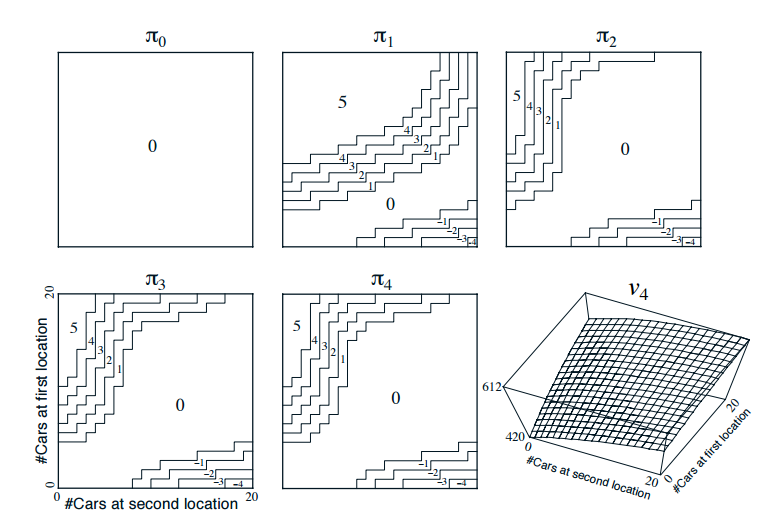
$$
\text {图4.2，为杰克汽车出租问题，通过策略迭代找到一系列策略}，以及最终的状态价值函数。
$$
前五个图表示，每天结束时每个网点的汽车数量，以及需要从第一个网点转移到第二个网点的汽车数量（负数表示从第二个网点转移到第一个网点）。每一个后继的策略都是在之前策略基础上严格的提升， 并且最终的策略是最优的。

策略迭代经常出人意料地几次迭代就收敛了，杰克汽车出租问题和图4.1中的例子的便是证明。

- 在图4.1中，左下角展示了等概率随机策略的价值函数，右下角则展示了此价值函数的贪婪策略。策略提升原理保证了这些策略比初始的策略要好。这些策略不仅仅是比较好，而且最优的，即达到终止状态所需步数最少。 
- 在本例中，经过一次策略迭代（笔者：这次迭代中，策略评估经过了几次）便能找到最优策略。

#### 练习4.4-4.7

- *练习4.4* 本节中的策略迭代算法有点小问题，策略有可能持续在两个或者多个等价的策略之间来回切换，这种情况下，算法将一直运行无法终止。这适用于教学，但是不适用于实际使用。修改伪代码，以保证算法收敛。

  答：第3步策略提升做如下提升。

  $$
\begin{flalign}
  &  {policy\text -stable} \leftarrow true &\\
&  \text {For each } s\in{S} : \\
  &  \quad \mathcal A_{max}(s) \leftarrow{\arg\max_a\sum_{s',r}p(s',r|s,a)[r+\gamma V(s')]} \\
& \quad \text {If } \pi(s) \notin  A_{max}(s) \text  {, then }  \\
  & \quad \quad \pi(s)  \leftarrow \text  {random }  \mathcal A_{max}(s) \\  
& \quad \quad policy\text-stable \leftarrow \text {false} \\
  &  \text {If } policy\text -stable \text{, then stop and return } V \approx{v_*}  \text { and } \pi \approx{\pi_*} ; \text {else go to 2}  \\
\end{flalign}
  $$

- *练习4.5* 关于动作价值的策略迭代如何定义？提供一个完整的算法计算 $q_*$ ，类似于本节中 $v_*$ 的策略迭代算法。特别要关注这个练习，因为其思想贯穿全书。

  答：

  **策略迭代（使用迭代策略评估）估计 $\pi \approx \pi_*$**
  
   1. 初始化（Initialization）
  
      对于所有的 $s\in\mathcal{S}$，$Q(s, a)\in\mathbb{R}$， $\pi(s)\in\cal{A}(s)$；且 $Q(s, a) = 0$
  
   2. 策略评估（Policy Evaluation）
      $$
      \begin{flalign}
      & \text {Loop:}  & \\
      & \quad  Delta \ \leftarrow \ 0\\
      & \quad \text{Loop for each } s\in{\mathcal S}: \\
      & \quad \quad\text{Loop for each } a\in{\mathcal A}: \\
      & \quad \quad \quad q\leftarrow{Q(s, a)}\\
      & \quad \quad \quad {Q(s, a)} \ {\leftarrow} \ \sum_{s',r}p(s',r|s,a)[r+\gamma{Q(s', \pi(s'))}] \\
      & \quad \quad \quad \Delta \ {\leftarrow} \ {\max(\Delta,|q-Q(s, a)|)} \\
      & \text {Until }  \Delta<\theta \text {（一个小的正数，其决定了估计准确性的）} \\
      \end{flalign}
      $$
  
   3. 策略提升（Policy Improvement）
      $$
      \begin{flalign}
      &  {policy\text -stable} \leftarrow true &\\
      &  \text {For each } s\in{S} : \\
      &  \quad {old \text - action}  \leftarrow {\pi(s)} \\
      &  \quad \pi(s)\leftarrow{\arg\max_aQ(s, a)}\\
      &  \quad \text {If } old\text -action \not=\pi(s) \text  {, then } policy\text -stable \leftarrow \text {false} \\
      &  \text {If } policy\text -stable \text{, then stop and return } V \approx{v_*}  \text { and } \pi \approx{\pi_*} ; \text {else go to 2}  \\
      \end{flalign}
      $$

- *练习4.6* 假设我们被要求考虑策略 $\varepsilon \text - soft$，即每个状态 $s$ 下选择动作的概率都至少是 $\frac{\epsilon}{|\cal{A(s)}|}$。定性地描述 $v_*$ 的策略迭代算法中步骤 3，2，1所需要的改变。

  答：

   **策略迭代（使用迭代策略评估）估计 $\pi \approx \pi_*$**

   1. 初始化（Initialization）

      对于所有的 $s\in\mathcal{S}$，$V(s)\in\mathbb{R}$， $\pi(a|s) = \frac 1 {|\cal{A}(s)|}$；且 $V(terminal) = 0$

   2. 策略评估（Policy Evaluation）
      $$
      \begin{flalign}
      & \text {Loop:}  &\\
      & \quad  Delta \ \leftarrow \ 0\\
      & \quad \text{Loop for each } s\in \mathcal {S}: \\
      & \quad \quad v\leftarrow{V(s)}\\
      & \quad \quad V(s) \ {\leftarrow} \sum_a \pi(a|s) \sum_{s',r}p(s',r|s,\pi(s))[r+\gamma{V(s')}] \\
      & \quad \quad \Delta \ {\leftarrow} \ {\max(\Delta,|v-V(s)|)} \\
      & \text {Until }  \Delta<\theta \text {（一个小的正数，其决定了估计准确性的）} \\
      \end{flalign}
      $$

   3. 策略提升（Policy Improvement）
      $$
      \begin{flalign}
      &  {policy\text -stable} \leftarrow true \\
      &  \text {For each } s\in{S} : \\
      &  \quad {old\text- \pi }  \leftarrow {\pi(a|s)} \quad \quad\quad\quad\quad\quad\quad\quad\quad\quad\quad\quad\quad\quad\quad\quad\quad\quad\quad\quad\quad \\
      \end{flalign}
      $$

      $$
      
      \quad\quad\quad \pi(a|s) \leftarrow 
      \begin{equation}\left\{  
      \begin{array}{lcl}  
      1-\varepsilon        &  &  if\ a=\arg\max_a\sum_{s',r}p(s',r|s,\pi(s))[r+\gamma{V(s')}] \\  
      \frac  \varepsilon {|\cal A(s)|}  &  &  otherwise   
      \end{array}  
      \right.\end{equation}
      $$
      
      $$
      \begin{flalign}
      &  \quad \text {If } old\text -\pi \not=\pi(a|s) \text  {, then } policy\text -stable \leftarrow \text {false} \\
      &  \text {If } policy\text -stable \text{, then stop and return } V \approx{v_*}  \text { and } \pi \approx{\pi_*} ; \text {else go to 2}  \\
      \end{flalign}
      $$

- *练习4.7* （编程）杰克汽车出租问题出现了如下变化，编写一个策略迭代程序解决它。

  - 杰克第一个网点的有一个员工每晚乘公共汽车回家，其家就在第二个网点的附近。如果刚好有车需要从第一个网点转移到第二个网点，她将搭这辆车，此次转移车辆花费为 0（相当于该员工支付了 2 美元的费用）。其它转移车辆还是需要花费 2 美元。
  - 杰克每个网点停车位有限。如果超过10个的话，多出的车辆必须停在第二个停车场，而这需要额外话费 4 美元（无论多出几辆车）。

  在现实问题中，经常会有像这样的非线性和有些随意的需求。除了动态规划（dynamic programming），其他优化方法往往不容易解决。为了验证你的程序，首先复现一下原始问题的结果。
  
  答：[代码实现](http://15.15.175.147:28888/notebooks/eipi10/xuxiangwen.github.io/_notes/05-ai/47-rl/rl_an_introduction/notebooks/rl_lab.ipynb#exercise-4.7)
  
  复现原始问题的结果。
  
  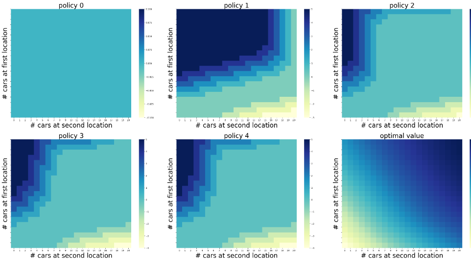
  
  新场景的结果。
  
  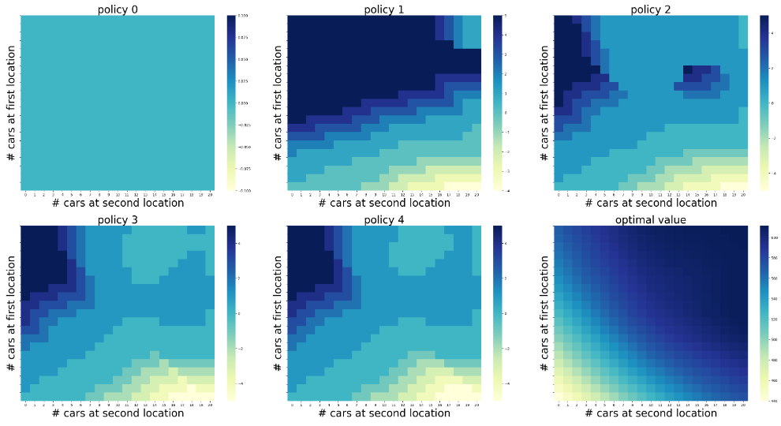

### 4.4 价值迭代

Value Iteration

策略迭代的一个缺点是每一次迭代过程都包含策略评估，而策略评估本身就是一个长时间的迭代计算，它需要多次遍历整个状态集。如果策略评估是迭代进行的，它只能在极限情况下才能精确地收敛到 $v_\pi$ 。我们一定要等到精确地收敛吗？是否可以中途停止？图4.1中的例子显然表明缩短策略评估是可能的。 在例子中，超过三次迭代后，策略评估对其相应的Greedy 策略没有影响。

实际上，策略迭代中的策略评估步骤可以用几种方式来缩短，而不会失去策略迭代的收敛性。一种重要的特殊方式是：当一次遍历（即每个状态都更新）完成后，停止策略评估。这个算法称之为*价值迭代（value iteration）*，它可以写成一个特别简单的更新操作，这个操作合并了价值提升和缩短的价值评估步骤。
$$
\begin{split}\begin{aligned}
v_{k+1}(s)&\doteq \max_a\mathbb{E}[R_{t+1}+\gamma v_{k}(S_{t+1}) | S_t=s,A_t=a] \\
&= \max_a\sum_{s',r}p(s',r|s,a)[r+\gamma v_{k}(s')],
\end{aligned}\end{split} \tag {4.10}
$$
其中 $s\in\mathcal{S}$。对于任意的 $v_0$，在保证 $v_*$ 存在的前提下，序列 $\{v_k\}$ 可以收敛到 $v_*$。

我们还可以这么理解，价值迭代参考了贝尔曼最优方程。价值迭代简单将贝尔曼最优方程转变为更新规则。在所有动作的价值中，价值迭代取了最大值，除了这一点，它和价值评估更新（4.5）是等价的。另外一种看待这种相近关系的方式是比较它们的 Backup 图，从下图可以看到，价值评估和价值迭代使用了各自的 Backup 操作计算 $v_\pi$ 和 $v_*$。

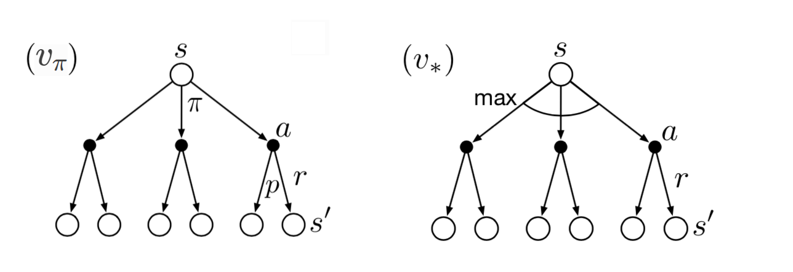

最后，让我们考虑价值迭代如何终止。类似策略评估，价值迭代一般需要无穷次的迭代才能准确的收敛到 $v_*$​ 。 然而在实践中，在一次遍历后， 如果价值函数的改变很小，迭代就可以停止了。完整算法如下所示。

> **价值迭代，用于估算 $\pi \approx \pi_*$**
> $$
> \begin{flalign}
> & \text {算法参数： 小的阈值} \theta > 0 \text {，用于确定评估的准确性。}  & \\
> & \text {对于所有的 } s\in\mathcal{S} ，V(s) \text {可以初始化任何值；} V(terminal) = 0   \\
> & \text {Loop:}       \\
> & \quad  \Delta \leftarrow 0       \\
> & \quad  \text {Loop for each} s \in \cal S \\
> & \quad \quad v\leftarrow{V(s)}        \\  
> & \quad \quad V(s){\leftarrow}\max_a\sum_{s',r}p(s',r|s,a)[r+\gamma{V(s')}] \\
> & \quad \quad \Delta{\leftarrow}{\max(\Delta,|v-V(s)|)}  \\
> & \text {until } \Delta<\theta  \\
> & \text 输出一个确定性的策略， \pi \approx \pi_*, 即 \\
> & \pi(s)=\arg\max_a\sum_{s',r}p(s',r|s,a)[r+\gamma{V(s')}]
> \end {flalign}
> $$

价值迭代的每次遍历中，它有效的合并了策略评估和策略提升。在每轮策略提升中，通过干预策略评估的遍历可以有效加快收敛速度。通常情况下，被缩短的策略迭代算法整体上可以看成是多轮的遍历，有的遍历使用策略评估更新，有的则使用价值迭代更新。公式（4.10）中最大值的操作是这两种更新的唯一不同，这意味着最大值操作是插将入了某些轮次的策略评估中。对于有衰减的有限MDP，上述所有这些算法收敛到一个最优策略。

#### **例4.3：赌徒问题** 

一个赌徒对掷硬币的游戏进行下注。如果硬币正面朝上，他将赢得押在这一掷上的赌注， 如果是反面朝上，他将输掉所押的赌注。如果赌徒赢得100美元或者输光了钱，则游戏结束。 每一次掷硬币，赌徒要决定押多少钱（必须是整数数量）。这个问题可以被看做一个无衰减，回合的有限MDP问题。 

- 状态是赌徒的资本，$s\in \{1,2,\dots,99\}$。
- 动作是押注多少 ，$a\in \{0,1,\dots,\min(s,100-s)\}$。
- 达到目标时奖励为 1，其他时候为 0。

状态价值函数给出了从每个状态出发能够获胜的概率。策略是本金和押注之间一个映射。最优策略最大化达到目标的概率。$p_h$ 表示硬币正面概率。如果  $p_h$ 知道了，整个问题也就清楚了，并且可以被解决，比如用价值迭代方法。图4.3展示了价值函数在多轮价值迭代过程中的变化。经过这些迭代，我们找到了在 $p_h=0.4 $ 情况下最终的策略。 这个策略是最优的，但不是唯一的。实际上，有很多最优策略，这取决于最优价值函数对应的 argmax 的动作选择。 你能猜出所有的最优策略是什么样的吗？

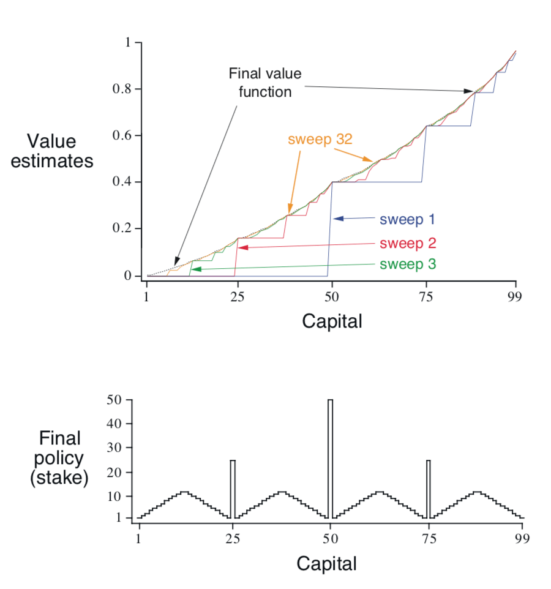
$$
\text {图4.3：当 }  p_h=0.4时，赌徒问题的解。上部分显示的是经过多轮价值迭代后找到的价值函数。 下部分显示的是最终的策略。
$$

#### 练习 4.8-4.10

- *练习4.8* 为什么赌徒问题的最优策略有如此奇怪的形状？特别是当本金是 50时，押注所有在一次投掷上，但是本金是 51 时，却不这样做。 为什么这会是一个好的策略？

  答：

  - 当 $p_h< 0.5$， 从长期来看，肯定是输钱离场，所以此时，搏一把往往可能有机会赚钱，达到目标离场。随意看到当本金 50 的时候，会选择孤注一掷。
  - 价值迭代计算最佳策略时， argmax 只返回一个动作，如果有两个动作价值相同时，默认情况下，序号在前的动作会被作为该状态下的最佳动作。比如：对于状态 $51$，其后续动作 $1$ 和 $49$ 的价值相同，但是由于动作 $1$ 的序号排在前面，所以最佳策略选择动作 $1$。

  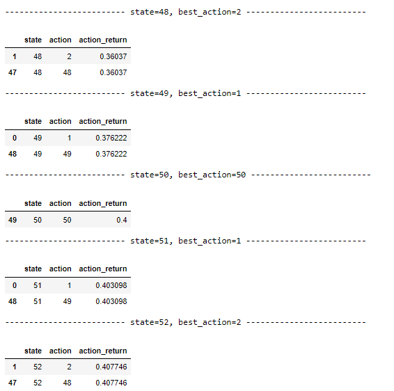

  

- *练习4.9* （编程）实现赌徒问题的价值迭代算法，并求 $p_h=0.25$ 和 $p_h=0.55$ 情况下相应的解。我们发现，引入两个终止状态：本金0和本金100，编程的时候会比较方便。这两个状态对应的奖励分别为 0 和 1。 像图4.3那样用图显示你的结果。当 $\theta\leftarrow 0 $，你的结果是否稳定呢？

  答：代码实现：http://15.15.175.147:28888/notebooks/eipi10/xuxiangwen.github.io/_notes/05-ai/47-rl/rl_an_introduction/notebooks/rl_lab.ipynb#exercise-4.9。

  - $p_h=0.25$。当 $\theta\leftarrow 0 $，结果稳定。通过和图4.3比较，我们可以发现，当$p_h<0.5$，最佳策略都是一样的。

    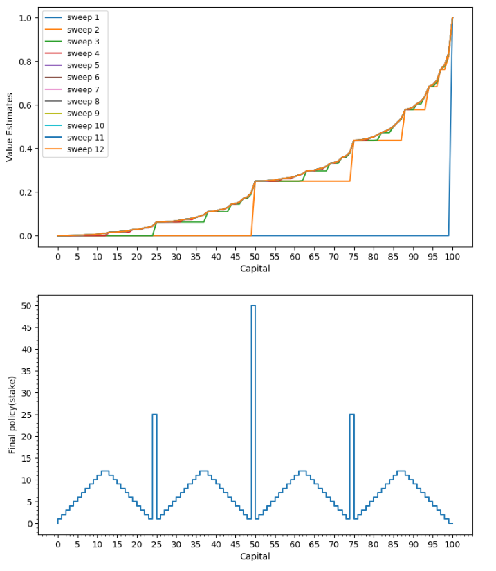

  - $p_h=0.55$。当 $\theta\leftarrow 0 $，结果稳定。可以发现。

    - 最佳策略是每次投注 1 元。似乎相当的保守，但是稳赚。
    - 当本金是 15 的时候，预期价值回报是0.95，非常的高。也就是在赌徒游戏中，只要胜率超过 50% ，即使本金很少，也有很大可能性赢大钱。

    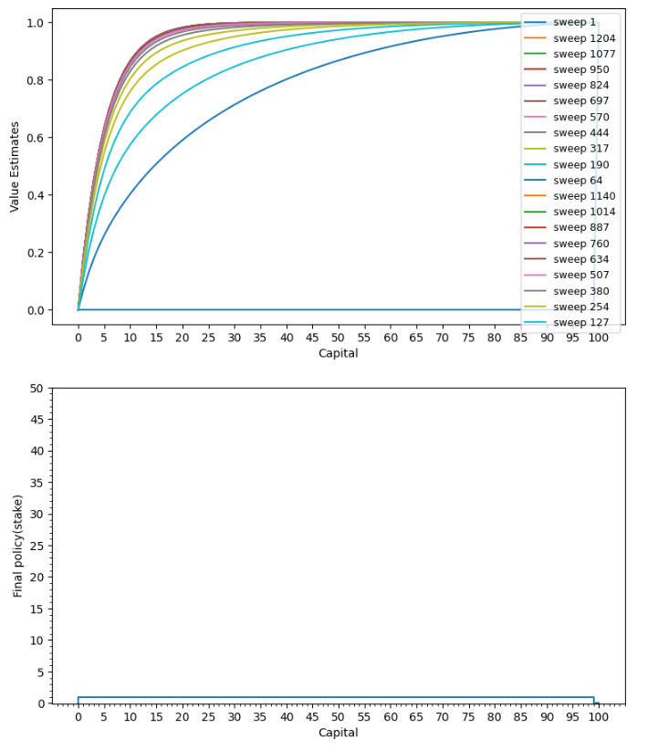

- *练习4.10* 对于动作价值 $q_{k+1}(s,a)$，写出其类似于（4.10）的价值迭代更新公式？

  答：
  $$
  \begin{split}\begin{aligned}
  q_{k+1}(s, a)&\doteq \mathbb{E}[R_{t+1}+\gamma v_{k}(S_{t+1}) | S_t=s,A_t=a] \\
  & = \mathbb{E}[R_{t+1}+\gamma \max_{a'} q_k(S_{t+1}, a’)|S_t=s,A_t=a] \\
  &= \sum_{s',r}p(s',r|s,a)[r+\gamma \max_{a'} q_k(s', a’)]
  \end{aligned}\end{split}
  $$

### 4.5 异步动态规划

Asynchronous Dynamic Programming

目前为止，我们所讨论的DP方法一个主要的缺点是 ：它们需要在 MDP 整个状态集上进行操作，也就说是，需要对状态集进行多轮的遍历。如果状态集非常的大，一次遍历代价高昂。例如，西洋双陆棋戏的状态多达 $10^{20}$ 个，即使一秒钟能够执行100万个状态的迭代更新，完成一次遍历也需要1000年。

*异步（Asynchronous）* DP算法是就地（in-place）迭代DP算法，并没有按照遍历状态集的次序进行操作，而是有些随意性，即当所需状态恰好可用时，就更新状态价值。某些状态的值可能会在其他状态的值更新一次之前被更新多次。 为了正确的收敛，异步算法需要持续的更新，直到所有的状态值都被更新。 对于选择哪些状态进行更新，异步DP算法有极大的灵活性。

举个例子，异步价值迭代更新的方式之一是：在每一步 $k$ ，使用价值迭代更新公式（4.10），只更新一个状态 $s_k$。如果 $0\leq \gamma <1$，且所有的状态在序列 ${s_k}$ 中出现无数次（顺序是随机的），就可以保证渐进收敛到 $v_*$ 。类似地，也可以混合策略评估和价值迭代更新来生成异步缩短的（truncated）策略迭代。虽然这些不常用的 DP 算法细节超出了本书的范围，但是很明显，这些不同方式的更新所构成的模块可以灵活被应用到多种多样的 DP 算法中。

当然，避免顺序的遍历并不一定意味着计算量的减少。它意味着：在算法能够提升策略之前，它不必陷入无意义的长时间遍历中。我们可以利用这种灵活性来选择要更新的状态，以便提高算法的进展速率。我们试着调整更新的顺序，以便价值信息在状态之间能更高效的传递。有些状态并不需要像其他状态那样频繁更新。我们甚至可以尝试完全忽略某些状态，因为它们和最优动作无关。这种思想我们将在第 8 章讨论。

异步算法也使得与实时交互计算的结合变得更加容易。对于一个MDP问题，当一个个体正在实际处理该问题的时候，我们同时运行迭代的 DP 算法。个体的经验可以用来决定DP算法将对哪些状态进行更新。于此同时，来自DP算法的最新价值和策略信息可以用来指导个体的决策。例如：我们可以在个体进入某个状态时更新状态价值。这样可以使得 DP 算法的更新操作集中在部分状态集上，这些状态集是个体最相关的。这种集中方法在强化学习中会重复用到。

### 4.6 广义策略迭代

Generalized Policy Iteration，

策略迭代由两个同时进行、相互作用的过程组成，一个使得价值函数与当前策略保持一致（策略评估），另一个使得策略在当前价值函数下进行 Greedy 选择（策略提升）。在策略迭代过程中，这两个过程相互交替，一个完成了另一个才开始，但是这并不是必须的。例如：

- 在价值迭代中，在两次策略提升之间，只进行一次价值评估。
- 在异步（Asynchronous） DP 方法中，评估和提升过程以一种更加精细的方式进行交替。
- 在某些案例中，在转移到其他状态之前，执行某一个过程的状态更新。 只要两个过程持续更新所有的状态，最终的结果将会一致，即收敛到最优价值函数和最优策略。

我们用术语 *广义策略迭代* （GPI）这个词来指代策略评估和策略提升相互交互的一般概念，而不依赖于两个过程的粒度和其他细节。 几乎所有的强化学习方法都可以被描述为GPI。也就是说，所有这些方法都有可识别的策略和价值函数，策略总是根据价值函数进行改进，价值函数总是朝着策略的价值函数方向驱动，如下图示所示。如果评估过程和提升过程都稳定下来，也就是说，不再产生变化，那么价值函数和策略必定是最优的。价值函数只有在与当前策略一致时才会稳定，策略只有在对当前价值函数 Greedy 时才会稳定。因此，仅当找到一个对其的评估函数 Greedy  的策略时，两个过程才会稳定。这意味着贝尔曼最优方程（4.1）成立，因此策略和价值函数是最优的。

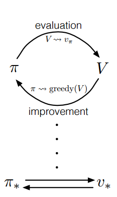

GPI中的评估和提升过程既可以看作是竞争的，也可以看作是合作的。在某种意义上，它们相互竞争，因为它们朝着相反的方向施加作用。基于价值函数进行 Greedy ，通常导致价值函数对于改变后策略变得不正确，而保持价值函数与策略一致，又通常使得该策略不再 Greedy。然而，从长远来看，这两个过程相互作用，最终找到单一的联合解决方案：最优价值函数和最优策略。

对于GPI中评估和提升过程之间的相互作用，我们也可以从它们约束或目标的角度来思考，例如，右图所示的两维空间中的两条线。虽然真实的几何形状比这复杂得多，但该图表明了真实情况下发生的样子。每个过程都将值函数或策略推向其中的一条线，每条线代表了其目标的解。目标会交互是因为两条线并不互相垂直。直接朝着一个目标前进会导致远离另一个目标。然而，不可避免地，联合的过程逐步趋近整体的最优目标。这个图中的箭头对应于策略迭代的动作，因为每个箭头都使系统完全达到两个目标中的一个。 在GPI过程中，也可以采取更小，不完全的步骤去达到每个目标。 无论哪种情况，这两个过程共同实现了整体的最优目标，即使它们都无法直接实现它。


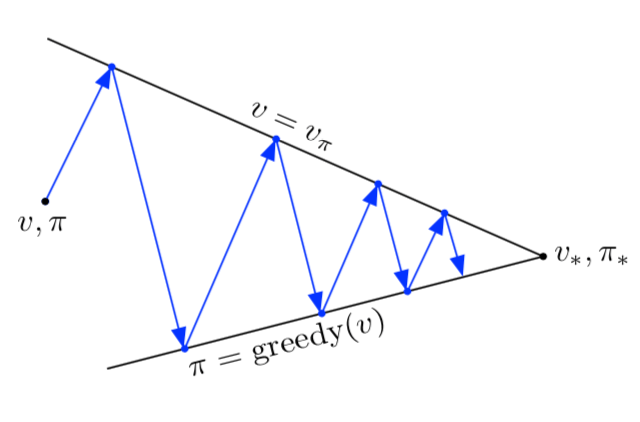

### 4.7 动态规划的效率

Efficiency of Dynamic Programming

对于非常大的问题，DP可能不实用，但与其他解决MDP的方法相比，DP方法实际上非常有效。 如果我们忽略一些技术细节，那么（最坏的情况）DP方法找到最优策略的时间是状态和动作数量的多项式。 如果用 n 和 k 分别表示状态和动作的数量，这意味着 DP 方法需要的计算操作数少于 n 和 k 的某个多项式函数。DP 方法保证在多项式时间内找到最优策略，而（确定性）策略的总数是 $k^n$。从这个意义上说，DP 比策略空间中的任何直接搜索都要快得多，因为直接搜索必须详尽地检查每个策略才能提供相同的结果。线性规划（Linear programming）方法也可以用来解决MDPs，并且在某些案例中其最差的收敛保证也比DP方法好。但是线性规划方法在比 DP 方法小得多的状态数（大约是 100 倍）时就变得不切实际了。对于最大的问题，只有 DP 方法是可行的。

DP 有时被认为适用性有限，因为维度灾难，即状态数通常随状态变量的数量呈指数增长。巨大的状态集确实会造成困难，但这些困难是问题本身固有的，而不是 DP 作为一种解决方法带来的。事实上，DP 比其他竞争方法，如直接搜索和线性规划，更适合处理大的状态空间。

在实践中，使用当今的计算机，DP 方法可以来解决具有数百万状态的 MDP。策略迭代和价值迭代都被广泛使用，而且一般情况下哪种方法更好还不清楚。在实践中，这些方法通常比它们理论上的最坏情况运行时间收敛得快得多，特别是如果它们是从好的初始值函数或策略开始的。

对于具有大状态空间的问题，异步 DP 方法通常更受欢迎。要完成同步方法的一次遍历，需要对每个状态进行计算和存储。对于某些问题，这么多的内存和计算是不切实际的，但是问题仍然有可能解决，因为沿着最优解路径出现的状态相对较少。异步方法和 GPI 的其他变体可以应用于这种情况，并且可能比同步方法更快地找到好的或最优的策略。

### 4.8 总结

在这一章节中我们熟悉了动态规划的基本思想和算法，它可以用来解决有限MDP。 策略评估指的是（通常）对给定策略的价值函数进行迭代计算。策略提升指的是根据该策略的价值函数计算一个改进的策略。将这两种计算结合起来，我们得到了策略迭代和价值迭代，这是两种最流行的DP方法。如果知道MDP的完整知识，这两种方法都可以用来可靠地计算有限MDP的最优策略和价值函数。

经典的DP方法在状态集合中进行遍历，对每个状态执行一个期望的更新操作。每个这样的操作都根据所有可能的后继状态的价值和发生概率来更新一个状态的价值。期望更新与贝尔曼方程关系密切：它们只不过是将这些方程转化为赋值语句而已。当更新不再导致价值的任何变化时，就达到了满足相应贝尔曼方程的值的收敛。就像有四个主要的价值函数（$v_\pi$，$v_*$，$q_\pi$ 和 $q_*$）一样， 也有四个相应的贝尔曼方程和四个相应的期望更新。 DP更新操作的直观视图由它们的 Backup 图给出。

通过深入理解DP方法和几乎所有的强化学习方法，它们都可被视为广义策略迭代（GPI），GPI是两个相互作用的过程围绕近似策略和近似价值函数螺旋前进的通用思想。一个过程在给定的策略视下，执行某种形式的策略评估，改变价值函数使其更接近策略的真实价值函数。另一个过程在给定的价值函数下，执行某种形式的策略提升，改变策略使其更好符合其价值函数。尽管每个过程都改变了另一个过程的基础，但总体上它们协同工作，直到找到一个联合解决方案：一个不在变化的策略和价值函数，即最优解。在某些情况下，可以证明 GPI 收敛，最明显的是我们在本章中介绍的经典DP方法。在其他情况下，收敛性没有得到证明，但GPI的思想仍然改善了我们对方法的理解。

执行DP方法时，不一定需要对整个状态集进行完整的遍历。异步DP方法是一种 in-place 迭代方法，它以任意顺序更新状态，可能是随机确定的，并使用过时的信息。这些方法中的许多可以被视为 GPI 的细粒度形式。

最后，让我们关注 DP 方法的另一个特殊性质。它们都是基于后继状态的价值估计来更新当前状态的价值估计。也就是说，它们是基于其他估计来更新当前估计。我们把这个一般思想称为 *bootstrapping*。许多强化学习方法都进行 *bootstrapping*，甚至，它们不需要像DP那样要求完整和准确的环境模型。在下一章中，我们将探讨不需要模型也不进行 *bootstrapping* 的强化学习方法。再往后一章，我们探讨了不需要模型但进行 *bootstrapping* 的方法。这些关键特征和性质是可分离的，但可以以有趣的方式进行组合。

#### 书目和历史评论

略

