# 第一部分 表格解决方法

Part I: Tabular Solution Method

## 5 蒙特卡洛方法

Monte Carlo Methods

在本章中，我们首次介绍一种学习方法，它用于估计价值函数和发现最优策略。与上一章不同，这里我们假设对环境没有完全的了解。蒙特卡洛方法需要的仅仅是经验——与环境进行真实或模拟交互所得到的状态，动作，奖励的样本序列。从*真实* 经验中学习是非常吸引人的，因为不需要环境动态的先验知识，它仍然能够选择最佳动作。而从*模拟* 的经验中学习也是很强大的。虽然也需要一个模型，但是模型仅仅用来生成样本转换（ sample transitions），而不是动态规划（DP）所需的所有可能转换的完整概率分布。令人惊讶的是，根据所期望的概率分布生成经验样本很容易，但是要获取分布的具体形式却很难。

蒙特卡洛方法是基于对平均样本回报来解决强化学习的问题的。为了保证能够得到良好定义的回报，这里我们定义蒙特卡洛方法仅适用于回合任务。为了确保有明确定义的回报可用，我们只针对回合任务定义蒙特卡洛方法。也就是说，我们把经历划分为回合，而且无论选择什么动作，最终所有的回合都会终止。只有当回合结束以后，价值估计和策略才会改变。因此，蒙特卡洛方法可以在 episode-by-episode 之间增量，但不能在逐步（在线）（step-by-step (online) ）的意义上增量。术语 “蒙特卡洛（Monte Carlo）” 被广泛的用于任何的在操作中引入了随机成分的估计方法。我们在这里特指基于平均完整回报的方法（区别于那些从部分回报中学习的方法，我们将在下一章讨论）。

蒙特卡洛方法对每个状态-动作对进行采样和计算平均回报，就像我们在第2章中探索的 bandit 方法对每个动作进行采样和计算平均奖励一样。而区别是，现在有多个状态，每个状态都像一个不同的 bandit 问题（像关联搜索或情境bandit），而且不同的 bandit 问题是相互关联的。也就是说，在一个状态下采取一个动作后得到的回报取决于同一回合中后续状态下采取的动作。因为所有的动作选择都在进行学习，所以从早期状态的角度来看，这是一个非平稳的（nonstationary）问题。

为了处理非平稳性，我们采用第4章 DP方法中的广义策略迭代（GPI）思想。在那一章，我们根据MDP的知识计算价值函数，而在本章，我们从MDP的样本回报中学习价值函数。价值函数和相应的策略仍然以基本相同的（GPI）方式进行相互，从而达到最优。与 DP 章节一样，首先我们考虑预测问题（对任意固定的策略 $\pi$ 计算  $v_\pi$ 和 $q_\pi$），然后进行策略提升，最后由 GPI 进行控制并求解。从DP中得到的每一个想法都扩展到了蒙特卡洛方法中，只是它仅仅只有样本经验可用的。

### 5.1 蒙特卡洛预测

Monte Carlo Prediction

我们首先考虑用蒙特卡洛方法来学习给定策略下的状态价值函数。 回顾一下，一个状态的价值是从该状态往后的期望回报——即期望的累积未来折扣奖励。一个显而易见从经验中估计价值的方法是：简单地对访问该状态后观察到的回报求平均。随着观察到的回报越来越多，平均值应该收敛到期望值。这个想法是所有蒙特卡洛方法的基础。

特别地，假设我们想要估计 $v_\pi(s)$，即在策略 $\pi$ 下状态 $s$ 的价值，给定一组通过遵循 $\pi$ 并经过 s 获得的回合。回合中每次出现状态 $s$ 的情况都称为访问 $s$。当然，同一个回合中 $s$ 可能被访问多次。我们称回合中第一次访问 s 的时间为*首次访问（first visit）* 。有两种蒙特卡洛方法：

- *首次访问 MC 方法（ first-visit MC method）*将 $v_\pi(s) $ 估计为在第一次访问 $s$ 之后的回报的平均值。
- *每次访问 MC 方法（ every-visit MC method）*则将在所有访问 $s$ 之后的回报的平均值。

这两种方法非常相似，但在理论性质上略有不同。第一种方法是得到最广泛研究的，可以追溯到 20 世纪 40 年代，也是我们在本章重点关注的。第二种方法更自然地扩展到函数逼近（function approximation）和资格迹（eligibility traces），在第 9 章和第 12 章中讨论。首次访问 MC 方法如下框所示。而每次访问 MC 除了不检查 $s_t$ 是否在回合中早期出现过之外，其他都相同。

> **首次访问 MC 预测，估计 $V \approx v_\pi$,**
> $$
> \begin{flalign}
> &\text {输入（Input）：用来评估的策略} \pi   &\\
> &\text {初始化（Initialize）：}   \\
> & \quad V(s)\in\mathbb{R}, \quad \text {for all } s \in \mathcal S\\
> & \quad   Returns(s) \leftarrow \text {一个空的列表（List）},  \quad \text {for all } s \in \mathcal S   \\
> &  \text {Loop forever (for each episode): }   \\
> &  \quad  \text {根据 } \pi \text { 生成情节：}  S_0, A_0, R_1, S_1, A_1, R_2, \dots , S_{T-1}, A_{T-1}, R_{T}  \\
> &   \quad G \leftarrow 0    \\
> &   \quad \text {Loop for each step of episode, }  t = T-1, T-2, \dots, 0 :  \\
> &   \quad \quad G \leftarrow \gamma{G} + R_{t+1}  \\
> &   \quad \quad \text {Unless } S_t \text { appears in }S_0, S_1,...,S_{t-1}:   \\
> &  \quad \quad  \quad \text {Append } G \text { to } Returns(S_t)    \\
> &   \quad \quad  \quad V(s) \leftarrow average(Returns(s))   \\
> \end{flalign}
> $$

不论是首次访问 MC 方法还是每次访问 MC 方法，都会随着访问 $s$ 的次数趋于无穷而收敛于 $v_\pi(s)$。对于首次访问MC方法，这是显而易见的。这种情况下，每个回报都是对于 $$v_\pi(s)$$ 的有限方差的独立同分布估计。根据大数定理，这些估计的平均数会收敛于期望价值。每个平均值本身就是一个无偏估计，其误差的标准差降为 $1 / \sqrt{n}$，其中 n 是回报的次数。每次访问 MC 方法没有那么直观，不过也会以二次方的速度收敛于 $v_\pi(s)$ （Singh and Sutton, 1996）。

#### **例5.1：21点（Blackjack）** 

*21点* 是一种流行的赌场纸牌游戏，其目标是获得牌的数字值之和尽可能大，但不超过21。 所有的J，Q，K记为10点，A可以算作1或11。我们考虑每个玩家独立地与庄家竞争的版本。具体规则如下：

1. 游戏开始时，庄家和玩家各发两张牌。庄家的其中一张牌是正面朝上的（明牌），另一张是正面朝下的。

2. 如果玩家起手就是 21 点（一张A和一张10点牌），则称为 *natural*。

     - 庄家也是 *natural* ，则称为 *draw*，也就是平局。

     - 庄家不是 *natural* ，则玩家赢，游戏结束。

3. 玩家不是21点，可以有三个动作：

     - hit：可以继续要一张牌。

       - 超过21点（goes bust）：玩家输，游戏结束。
       - 没有超过 21 点，回到第 3 步。
     
     -  stick：停止要牌。进入庄家轮次，即第 4 步。

4. 庄家按照如下固定策略来打牌

   - 当点数大于或等于 17 点，停止要牌（stick）。
     - 比较玩家和庄家点数。
       - 玩家大：玩家赢。
       - 庄家大：庄家赢。
       - 相同：平局（draw）
   - 当点数小于 17 点，要牌（hit）
     - 超过21点（goes bust）：玩家赢，游戏结束。
     - 没有超过 21点，回到第 4 步。

> 上述规则是精简版本的，完整的规则参考[技术帖－21点算法](https://www.douban.com/note/273781969/?_i=4852844S7HuVBz)。

很自然，21 点游戏可看成是一个回合有限 MDP 问题。每一局都是一个回合。赢得比赛，输掉比赛和平局分别获得+1、-1和0的奖励。游戏过程中的奖励为0，且没有衰减（即 $\gamma=1$）。玩家的动作只有要牌或者停止要牌两种。游戏的状态取决于玩家是什么牌以及庄家手上的明牌。 假设牌是从一个无限的牌堆中发出的（即有替换），因此跟踪已经发出的牌没有什么用。如果玩家拥有一张 A 且当做11点来算还不超过21点的话，则称该 A 牌为 *可用（usable）*。在这种情况下，它总是被计为11，因为将其计为1会使总和小于或等于11，所以此时，显然玩家的选择是要牌。因此，玩家做出的决定依赖于三个变量：当前的牌的点数和（12-21）、庄家的明牌的点数（A-10）以及玩家是否有可用的 A。 这样的话，总共有200个不同的状态。

考虑这样的策略：一直要牌，直到点数和等于20或21时停止。为了通过蒙特卡洛方法来找到这个策略的状态价值函数，我们可以使用该策略模拟玩许多次游戏，然后计算每个状态后的平均回报。通过这种方法求得的价值函数如图5.1所示。 可以看到： 在10,000 回合s后，有可用 A 的状态的估计值不太确定且不太规则，但无论是否有可用 A，在500,000局游戏之后，价值函数都被近似的很好。

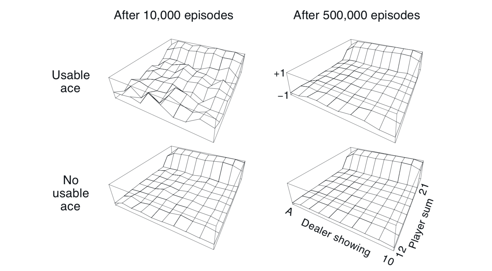
$$
\text {图5.1：遵循上文的策略，使用蒙特卡洛策略评估近似计算状态价值函数。}
$$
在这二十一点任务中，虽然我们对环境有完全的了解，但是仍然难以用 DP 方法来计算价值函数。 DP 方法需要下个事件的分布，特别是它需要由四个参数函数p给出的环境动态，而对于二十一点来说，这并不容易确定。例如，假设玩家的点数为14，他选择停止要牌。获得+1的奖励的概率是是庄家所展示的牌的一个函数。在运用 DP 之前，必须计算所有的概率，这样的计算通常是复杂和容易出错的。相比之下，使用蒙特卡洛方法仅仅只需要产生样本就好了，这要简单许多。 这种情况经常令人惊讶，蒙特卡洛方法仅使用样本回合就能工作的能力是一个重要的优势，即使在完全了解环境动态的情况下也是如此。

我们能否将 Backup 图的思想推广到蒙特卡洛算法中？Backup 图（下面右图）的一般思想是在顶部显示要更新的根节点，并在下面显示所有转换和叶节点，它们奖励和估计价值用于更新根节点的价值。对于 $v_\pi$ 的蒙特卡洛估计来说，根节点是一个状态节点，在它下面是沿着特定回合的转换轨迹，并以终止状态结束，如下面左图所示。DP 算法和蒙特卡洛方法之间的基本差异是：

- DP 图显示了所有可能的转换，蒙特卡洛图仅显示了在一个回合 中采样的转换。
- DP 图仅包括一步转换，而蒙特卡洛图一直延伸到回合的结束。这些图中的差异准确地反映了算法之间的基本差异。

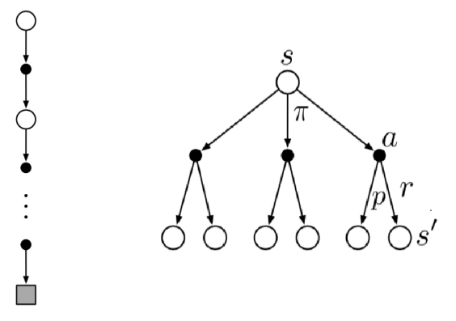

蒙特卡洛方法的一个重要事实是，每个状态的估计值是独立的。一个状态的估计值不建立在任何其他状态的估计值之上，这与DP中的情况不同。换句话说，蒙特卡洛方法不像我们在前一章中定义的那样进行自助法（bootstrapping）。

> 参见[统计中的 Bootstrap 方法是指什么？与 Monte Carlo 方法有什么联系与区别？]([统计中的 Bootstrap 方法是指什么？与 Monte Carlo 方法有什么联系与区别？ - 知乎 (zhihu.com)](https://www.zhihu.com/question/22929263)) 
>
> Bootstrapping 这个词的来源可以追溯到19世纪的美国俚语。当时，"bootstrapping" 指的是一个人用自己的靴子拉自己向上，通常用于比喻一个人靠自己的努力克服困难。
>
> 在计算机科学领域，Bootstrapping 指的是计算机程序从一个简单的状态开始，逐步加载和执行更复杂的功能，最终达到可以运行应用程序的状态。这个过程就像是程序自己拉自己向上，因此得名 Bootstrapping。
>
> 在统计学领域，Bootstrapping 指的是一种从已有数据中生成新的数据的统计方法。这种方法就像是统计学家从数据中 "拉出" 新的信息，因此也称为 Bootstrapping。
>
> Bootstrapping 这个词的来源可以总结如下：
>
> - 19世纪美国俚语：用靴子拉自己向上
> - 计算机科学：程序从简单到复杂的过程
> - 统计学：从数据中生成新数据的方法
>
> Bootstrapping 已经成为一个通用术语，在不同的领域都有不同的含义，但其核心思想都是从有限的资源中开始，逐步发展到更复杂的状态。

特别要注意的是，单个状态价值计算的开销与状态数无关。 当我们只需要一个或者一小部分状态价值时，蒙特卡洛方法特别有吸引力。可以从感兴趣的状态开始生成许多样本 回合，仅计算这些状态的平均回报，而忽略所有其他的状态。 这是蒙特卡洛方法相对 DP方法的第三个优势。

#### **例5.2：肥皂泡（Soap Bubble）** 

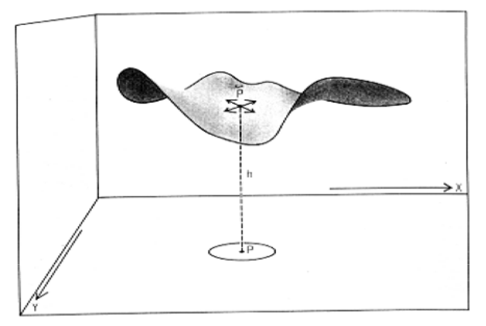
$$
\begin{align}
\text {线圈上的肥皂泡, 来自 Hersh 和 Griego（1969）} \\ 
\end{align}
$$
假设将形成一个闭环的金属线框浸泡在肥皂水中，形成一个在其边缘符合线框形状的肥皂表面或泡沫。如果金属线框的几何形状是不规则的但已知的，你如何计算表面的形状呢？该形状具有这样的特性，即由相邻点施加在每个点上的总力为零（否则形状会改变）。这意味着表面在任何点的高度是该点周围小圆中点的高度的平均值。此外，表面必须在其边界处与金属线框相遇。解决这种问题的通常方法是在表面覆盖区域上放置一个网格，并通过迭代计算解决其在网格点的高度。边界处的网格点被强制靠近金属线框，而其他点则朝着它们四个最近邻点的高度的平均值调整。然后，这个过程迭代进行，类似于动态规划的迭代策略评估，并最终收敛到对所需表面的一个紧密近似。

这类问题与蒙特卡洛方法最初设计用来解决的问题相似。与上述迭代计算不同，想象站在表面上并进行一次随机漫步，以相等的概率随机从一个网格点跳到相邻的网格点，直到达到边界为止。结果表明，在边界的高度的期望值是所需表面在起始点的一个紧密近似（事实上，它恰好是上述迭代方法计算的值）。因此，可以通过简单地对从该点开始的许多漫步的边界高度进行平均，从而紧密地逼近该点的表面高度。如果只关心一个点的值，或者任何固定的小点集，那么这种基于蒙特卡洛方法的方法可能比基于局部一致性的迭代方法更加高效。

#### 练习5.1-5.2

- *练习5.1* 参见图5.1右侧的图。为什么估计的价值函数在尾部的最后两行会突然变大？ 为什么最左边的整个一行价值会有下降？对于最前面的（frontmost）价值，为什么上面图中的值要大于下面的图？

  答：分别答案如下。

  - 两个原因：
    - 玩家点数20点或者21点时，赢面非常大。
    - 策略是当点数小于20，还会要牌，这样就有超过21点的可能，尤其是点数是18-19时。
  - 因为庄家的明牌是 A 的时候，其有较大概率可以赢，而且超过 21 点概率变小。
  - 当玩家有可用 A 时，减少了超过 21 点概率，赢面较大。

- *练习5.2* 假设在 21 点任务中使用每次访问 MC 方法而不是首次访问 MC 方法。结果会有很大差异吗？为什么？

  答：差异不大。分两种情况分析：

  - 没有可用 A

    每一次要牌后，点数总是增加，所以之前的状态无法在后面重现。

  - 有可用 A

    每一次要牌后，

    - 如果还是处于有可用 A的状态，总的点数是增加地，所以之前的状态无法在后面重现。如果
    - 如果处于无可用 A的状态，之前的（有可用 A）状态也无法在后面重现。

### 5.2 动作价值的蒙特卡洛估计

Monte Carlo Estimation of Action Values

如果没有可用的模型，那么估计 *动作价值*（即状态-动作对的价值）比估计 *状态价值* 更有用。 有了模型，仅使用状态价值就足以确定策略；只需向前看一步，选择能够带来最佳奖励和下一个状态组合的动作，就像我们在动态规划一章中所做的那样。然而，如果没有模型，仅仅使用状态值是不够的。 我们必须清楚地估计每个动作的价值，以使它们在建议策略时有用。 因此，蒙特卡洛方法主要用来估计 $q_*$。

为了实现这一点，首先考虑动作价值的策略评估问题，即估计 $q_\pi{(s,a)}$。即在状态s开始，执行动作a，然后遵循策略$\pi$时的期望回报。对于这个问题，蒙特卡洛方法基本上与刚刚介绍的状态价值问题相同，只是现在我们讨论对状态-动作对的访问，而不是对状态的访问。 

- 每次访问MC方法中，每次访问状态-动作对都会计算，最后求平均； 
- 首次访问 MC 方法每个回合只计算最多一次。

当访问次数趋近于无穷时，这两种方法（指每次访问 MC 和首次访问 MC）都会以二次方收敛到期望值。

唯一的问题是，可能会有许多状态-动作对从未被访问到。如果 $\pi$ 是一个确定性的策略， 那么遵循策略 $\pi$，每个状态将会仅仅观察到一个动作的回报。 对于未被访问的动作，没有回报，所以它们的蒙特卡洛的估计就不能随着经验的增加而提高。 这是一个严重的问题，因为我们学习动作价值，就是为了在每个状态选择合适的动作。 为了比较所有的可能，我们需要估计每个状态 *所有* 动作的价值，而不仅仅是当前动作。

这是一个很普遍的问题，即 *保持探索（maintaining exploration）*，我们在第二章 k-armed bandit 问题中提到过。 要使策略评估能够工作，我们必须保证持续的探索。其中一种方法是规定回合始于一个状态-动作对，并且每一对都有非零的概率被选为起始点。这保证在无限回合的极限情况下，所有的状态-动作对都会被访问无限次。我们称这种假设为 *探索开端（exploring starts）*。

这个 exploring starts 的假设有时是很有用的，但是它不具普遍意义，特别是当我们直接从与真实环境的交互中学习时，这种方法就不太适用了。 在这种情况下，起始状态不是很有用。 为了让所有状态-动作对都能访问到的，最常用的替代方法是采用随机策略，即每个状态下，选择任意动作的概率都不为零。 我们将会在后面的小节里讨论这种方法的两个变种。现在，我们保留 *exploring starts* 的假设，完整地介绍蒙特卡洛控制方法。

#### 练习5.3

- *练习 5.3* 画出蒙特卡洛估计 $q_\pi$  的 backup 图？
  答：如下图所示。

  

### 5.3 蒙特卡洛控制

Monte Carlo Control

现在，我们开始考虑蒙特卡洛估计来解决控制问题，即求解近似最优的策略。 整个的过程和上一章动态规划的模式相同，我们依照广义策略迭代（GPI）的思想。 广义策略迭代（GPI）中，我们同时维持一个近似的策略和一个近似的价值函数。价值函数会被反复修改，以更接近当前策略的价值函数，而策略也会根据当前价值函数不断改进，如下的图所示。这两种变化在一定程度上相互作用，每种变化都为另一种变化指明了移动的方向，但是总的来说，它们共同使得策略和价值函数都趋向于最优。

首先，我们考虑经典的策略迭代的蒙特卡洛（MC）版本。我们交替执行策略迭代和策略提升的完整步骤。 从一个随机的策略 $\pi_0$ 开始，以最优策略和最优的动作-价值函数结束：
$$
\pi_0 \overset{E}{\rightarrow} q_{\pi_0} \overset{I}{\rightarrow} \pi_1 \overset{E}{\rightarrow} q_{\pi_1} \overset{I}{\rightarrow} \pi_2 \overset{E}{\rightarrow} \cdots \overset{I}{\rightarrow} \pi_{*} \overset{E}{\rightarrow} q_{*}
$$
其中，$\overset{E}{\rightarrow}$ 表示一个完整的策略评估，$\overset{I}{\rightarrow}$ 表示一个完整的策略提升。随着经历越来越多的 回合，近似的动作-价值函数逐渐趋近于真实的函数。 此时，我们假设观察到了无限个回合，而且这些回合都是以 exploring starts 的方式生成的。 在上述假设下，对应于任意 $\pi_k$，蒙特卡洛方法会精确地计算每个 $q_{\pi_k}$。

策略提升的方法是，对于当前的价值函数，使用 Greedy 方式来选择动作。而对于蒙特卡洛方法，因为我们有动作-价值函数，所以不需要模型来构建 Greedy 策略。 对于任何的动作-价值函数 $q$，它对应的贪婪策略是：对每个 $s \in\mathcal{S}$， 选择动作-价值函数最大的那个动作：
$$
\pi(s) \dot{=} arg \space \underset{a}{max} \space q(s,a)  \tag {5.1}
$$
基于此做策略提升，使用基于 $q_{\pi_k}$ 的贪婪策略构建每个 $\pi_{k+1}$  。 策略提升理论（见4.2节）可以应用到 $\pi_k$ 和 $ \pi_{k+1}$ 上， 因为对于所有 $s \in\mathcal{S}$，
$$
\begin{split}\begin{aligned}
q_{\pi_{k}}\left(s, \pi_{k+1}(s)\right) &=q_{\pi_{k}}(s, \arg \max _{a} q_{\pi_{k}}(s, a)) \\
&=\max _{a} q_{\pi_{k}}(s, a) \\
& \geq q_{\pi_{k}}\left(s, \pi_{k}(s)\right) \\
& \geq v_{\pi_{k}}(s)
\end{aligned}\end{split}
$$
通过这种方法，可以在不知道环境动态的情况下，仅靠样本 回合，使用蒙特卡洛（MC）方法）来找到最优策略。

为了保证蒙特卡洛方法的收敛性，我们有两个不太可能的假设：

- 回合 采用 exploring starts 方式。
- 策略评估需要无限次回合

为了得到一个实际可用的算法，我们将不得不去掉这两个假设。 我们将在这一章的稍后部分讨论怎么去掉第一个假设。

现在，我们先考虑第二个假设，即策略评估需要无限次回合。这个假设相对容易去掉。事实上，相同的问题曾在上一章的经典 DP 方法中出现过。例如迭代策略评估只会渐进地收敛到真实价值函数。 无论是DP还是MC，有两种方法解决这个问题。

- 让每次策略评估都尽让接近 $q_{\pi_k}$。我们会使用一些方法和一些假设来获得误差的边界和概率，然后经过足够多的步骤后， 策略评估能够保证这些边界足够的小。这种方法可能可以在某种程度上保证正确的收敛，但是在实践中除了最小的问题之外，它也可能需要太多的 回合。
- 在进入到策略提升前，放弃完成策略评估。 在每次评估步骤中，价值函数向 $q_{\pi_k}$ 移动，经过很多步的移动，就能移动到期望的值。在第4.6节中首次介绍 GPI 的想法时，我们介绍了这个想法。它的一个极端形式是价值迭代，在策略提升之间执行一次迭代策略评估。价值迭代的 in-place 版本甚至更加极端；在那里，对单个状态，策略提升和策略评估是交替进行的。

对于蒙特卡洛策略评估而言，按照每个回合交替进行评估和提升是很自然的。在每个回合之后，观察到的回报用于策略评估，然后对每个经历的状态做策略提升。完整的简化算法如下所示，我们称它为 *探索开端的蒙特卡洛算法* （Monte Carlo ES，即 Monte Carlo with Exploring Starts）。

> **Monte Carlo ES (Exploring Starts)**， 用于估算 $\pi \approx \pi_*$
> $$
> \begin{flalign}
> & \text {Initialize}:
> &\\ &  \quad  \pi(s) \in  \mathcal A(s) \text { (arbitrarily), } \text {for all } s \in \mathcal S
> \\ &  \quad Q(s, a) \in  \mathcal  R  \text { (arbitrarily), for all } s \in  \mathcal S, a \in  \mathcal A(s)
> \\ &  \quad Returns(s, a) \leftarrow \text {empty list, for all } s \in  \mathcal S, a \in  \mathcal A(s)
> \\ &   \text {Loop forever (for each episode): }
> \\ &  \quad \text {Choose } S_0 \in  \mathcal S, A_0 \in  \mathcal A(S_0)  \text  { randomly such that all pairs have probability > 0}
> \\ &  \quad \text {Generate an episode from } S_0, A_0, \text {following } \pi: S_0, A_0, R_1,...,S_{T-1}, A_{T-1}, R_T
> \\ &  \quad G \leftarrow 0
> \\ &   \quad\text {Loop for each step of episode, } t = T -1, T -2, \cdots, 0:
> \\ &  \quad \quad  G \leftarrow \gamma G + R_{t+1}
> \\ &  \quad \quad \text {Unless the pair } S_t, A_t \text { appears in }S_0, A_0, S_1, A_1 ...,S_{t-1}, A_{t-1}:
> \\ &  \quad \quad \quad \text {Append } G \text { to }Returns(S_t, A_t)
> \\ &  \quad \quad \quad Q(S_t, A_t) \leftarrow  average(Returns(S_t, A_t))
> \\ &  \quad \quad \quad \pi(S_t) \leftarrow \arg\max_a Q(S_t, a)
> \end{flalign}
> $$

在Monte Carlo ES（Exploring Starts）中，每个状态-动作对的所有回报都被累积并平均，无论观察时使用的是什么策略。很容易看出，Monte Carlo ES无法收敛到任何次优策略。如果这样做，那么价值函数最终将收敛到该策略的价值函数，这反过来会导致策略发生变化。只有当策略和价值函数都是最优的时，才能实现稳定性。随着动作-价值函数的变化随着时间的推移而减少，收敛到这个最优固定点似乎是不可避免的，但尚未得到正式证明。在我们看来，这是强化学习中最基本的开放性理论问题之一（有关部分解决方案，请参见Tsitsiklis，2002）。

#### **例 5.3：解决 21 点**

**问题** 将Monte Carlo ES应用于 21 点（Blackjack）游戏非常简单。由于所有回合都是模拟的游戏，因此很容易获取探索开端（ exploring starts ）的所有可能性。在这种情况下，等概率的随机选取庄家的牌，玩家的牌面和，以及玩家是否有可用的 A。初始策略使用我们之前讨论时使用的，在20或21时停止要牌，其余情况均要牌。初始的各个状态的动作-价值函数均为零。图5.2展示了使用探索开端（ exploring starts）的蒙特卡洛算法得到的最优策略。 这个策略和 Thorp在 1966 提出的”基本”策略是一样的。唯一的例外是可用 A 策略中最左边的凹口，它在Thorp的策略中不存在。我们不确定这种差异的原因，但确信这里显示的确实是我们所说 21 点游戏版本的最优策略。

$$
\text {图5.2 使用探索开端的蒙特卡洛算法下21点的最优策略和状态-价值函数。}
$$
上图中的状态-价值函数是从动作-价值函数计算而来的。

#### 练习5.4

- *练习5.4* Monte Carlo ES的伪代码效率低下，这是因为对于每个状态-动作对，它维护了所有回报的列表并重复计算它们的平均值。更有效的方式是：使用类似于第2.4节中的方法，仅仅维护平均值和计数（对于每个状态-动作对）并且逐步更新。请描述如何更改伪代码以实现此目的。

  答：
  
  > $$
  > \begin{flalign}
  > & \text {Initialize}:
  > \\ &  \quad  \pi(s) \in  \mathcal A(s) \text { (arbitrarily), } \text {for all } s \in \mathcal S
  > &\\ &  \quad Q(s, a) \leftarrow 0,  \text { (arbitrarily), for all } s \in  \mathcal S, a \in  \mathcal A(s)
  > \\ &  \quad N(s, a) \leftarrow \text {0, for all } s \in  \mathcal S, a \in  \mathcal A(s)
  > \\ &   \text {Loop forever (for each episode): }
  > \\ &  \quad \text {Choose } S_0 \in  \mathcal S, A_0 \in  \mathcal A(S_0)  \text  { randomly such that all pairs have probability > 0}
  > \\ &  \quad \text {Generate an episode from } S_0, A_0, \text {following } \pi: S_0, A_0, R_1,...,S_{T-1}, A_{T-1}, R_T
  > \\ &  \quad G \leftarrow 0
  > \\ &   \quad\text {Loop for each step of episode, } t = T -1, T -2, \cdots, 0:
  > \\ &  \quad \quad  G \leftarrow \gamma G + R_{t+1}
  > \\ &  \quad \quad \text {Unless the pair } S_t, A_t \text { appears in }S_0, A_0, S_1, A_1 ...,S_{t-1}, A_{t-1}:
  > \\ &  \quad \quad \quad N(s, a) \leftarrow N(s, a) +1
  > \\ &  \quad \quad \quad Q(S_t, A_t) \leftarrow  Q(S_t, A_t) + \frac 1 {N(s, a)} (G - Q(S_t, A_t))
  > \\ &  \quad \quad \quad \pi(S_t) \leftarrow \arg\max_a Q(S_t, a)
  > \end{flalign}
  > $$

### 5.4 非探索开端的蒙特卡洛控制

Monte Carlo Control without Exploring Starts

如何避免探索开始（exploring starts）这个不太可能的假设呢？确保所有动作都被无限选择的唯一通用方法是让个体继续选择它们。有两种方法可以确保这一点，我们称之为 on-policy 方法和 off-policy 方法。

- on-policy 方法：评估或改进用于做出决策的策略。
- off-policy 方法：评估或改进一个策略，这个策略不同于生成数据所使用的那个策略。

上一节所谈到的蒙特卡洛 ES 方法是一种 on-policy 方法。 在本节里，我们将学习如何设计另一个 on-policy 蒙特卡洛控制方法，它不使用探索开端（exploring starts）这个不太切换实际的假设。 而 off-policy 方法将在下一节讨论。 

在 on-policy 控制方法中，策略通常是*soft*，这意味着对于所有 $s \in \mathcal S$ 和 $a \in \mathcal A(s)$，满足 $\pi(a | s)> 0$，随着时间的推移，策略逐渐向确定性最优策略靠近。第二章中我们讨论的许多方法便是采用这一机制。本节中，我们使用 $\varepsilon \text - greedy$ 方法，即大多数时间选择动作价值最大的那个动作，仅有 $\varepsilon$ 的概率选择随机的动作。也就是说，选择所有 nongreedy 的动作的概率是 $\frac{\varepsilon}{|\mathcal{A}(s)|}$，而选择 greedy 的动作的概率是 $1-\varepsilon+\frac{\varepsilon}{|\mathcal{A}(s)|}$。 $\varepsilon \text - greedy$ 策略是 $\varepsilon \text - soft$ 策略的一个例子，对所有的状态和动作，$\pi(a|s)\geq\frac{\varepsilon}{|A(s)|}$。在所有 $\varepsilon \text - soft$ 策略中， $\varepsilon \text - greedy$ 策略在某种意义上是最接近 greedy 的。

on-policy 蒙特卡洛控制的思想仍然是一种广义策略迭代（GPI）。和蒙特卡洛 ES 方法一样，我们使用first-visit 蒙特卡洛方法来估计当前策略的动作-价值函数。 由于没有探索开端（exploring starts）这个假设，不能简单地对当前价值函数使用 greedy 方法来提升当前策略， 因为这样会阻止对 nongreedy 动作的进一步探索。 幸运的是，广义策略迭代（GPI）并不需要我们的策略一直保持 greedy，只是要求不断向 greedy 策略 *靠近*。 我们的在策略方法会不断的趋向于 $\varepsilon \text - greedy$ 策略。 对任意的 $\varepsilon \text - soft$  策略 $\pi$ 来说， $q_{\pi}$ 对应的任意的  $\varepsilon \text - greedy$ 策略都好于或等于策略 $\pi$。 完整的算法如下。

> **On-policy first-visit MC control （对于** **$\epsilon-soft$** **策略），用于估算** **$V \approx v_\pi$**
> $$
> \begin{flalign}
> &  \text {Algorithm parameter:：small } \epsilon > 0
> &\\ & \text {Initialize}:
> \\ &  \quad  \pi(s)  \leftarrow \text { an arbitrary } \varepsilon\text -soft \text { policy}
> \\ &  \quad Q(s, a) \in  \mathcal  R  \text { (arbitrarily), for all } s \in  \mathcal S, a \in  \mathcal A(s)
> \\ &  \quad Returns(s, a) \leftarrow \text {empty list, for all } s \in  \mathcal S, a \in  \mathcal A(s)
> \\ &   \text {Loop forever (for each episode): }
> \\ &  \quad \text {Choose } S_0 \in  \mathcal S, A_0 \in  \mathcal A(S_0)  \text  { randomly such that all pairs have probability > 0}
> \\ &  \quad \text {Generate an episode from } S_0, A_0, \text {following } \pi: S_0, A_0, R_1,...,S_{T-1}, A_{T-1}, R_T
> \\ &  \quad G \leftarrow 0
> \\ &   \quad\text {Loop for each step of episode, } t = T -1, T -2, \cdots, 0:
> \\ &  \quad \quad  G \leftarrow \gamma G + R_{t+1}
> \\ &  \quad \quad \text {Unless the pair } S_t, A_t \text { appears in }S_0, A_0, S_1, A_1 ...,S_{t-1}, A_{t-1}:
> \\ &  \quad \quad \quad \text {Append } G \text { to }Returns(S_t, A_t)
> \\ &  \quad \quad \quad Q(S_t, A_t) \leftarrow  average(Returns(S_t, A_t))
> \\ &  \quad \quad \quad A^* \leftarrow \mathop{argmax} \limits_{a} Q(S_t, a)  \quad \quad \quad \quad \text {(with ties broken arbitrarily)}
> \\ &  \quad \quad \quad \text {For all } a \in \mathcal A(S_t):
> \\ &  \quad \quad \quad \quad \begin{split}\pi\left(a|S_{t}\right) \leftarrow\left\{\begin{array}{ll}
> 1-\varepsilon+\varepsilon /\left|\mathcal{A}\left(S_{t}\right)\right| & \text { if } a=A^{*} \\
> \varepsilon /\left|\mathcal{A}\left(S_{t}\right)\right| & \text { if } a \neq A^{*}
> \end{array}\right.\end{split}
> \end{flalign}
> $$

设 $\pi'$ 为 $\varepsilon \text - greedy$ 策略，应用策略提升理论可得如下推导：
$$
\begin{split}\begin{aligned}
q_{\pi}\left(s, \pi^{\prime}(s)\right) &=\sum_{a} \pi^{\prime}(a | s) q_{\pi}(s, a) \\
&=\frac{\varepsilon}{|\mathcal{A}(s)|} \sum_{a} q_{\pi}(s, a)+(1-\varepsilon) \max _{a} q_{\pi}(s, a) \\
& \geq \frac{\varepsilon}{|\mathcal{A}(s)|} \sum_{a} q_{\pi}(s, a)+(1-\varepsilon) \sum_{a} \frac{\pi(a | s)-\frac{\varepsilon}{|\mathcal{A}(s)|}}{1-\varepsilon} q_{\pi}(s, a) \\

\end{aligned}\end{split} \tag {5.2}
$$
注意，由于 $\sum_{a} \frac{\pi(a | s)-\frac{\varepsilon}{|\mathcal{A}(s)|}}{1-\varepsilon} q_{\pi}(s, a)$是一个加权平均值，所以 $\max _{a} q_{\pi}(s, a)  \geq \sum_{a} \frac{\pi(a | s)-\frac{\varepsilon}{|\mathcal{A}(s)|}}{1-\varepsilon} q_{\pi}(s, a)$。继续推导可得。
$$
\begin{split}\begin{aligned}
\quad\quad\quad\quad\quad\quad\quad    &=\frac{\varepsilon}{|\mathcal{A}(s)|} \sum_{a} q_{\pi}(s, a)-\frac{\varepsilon}{|\mathcal{A}(s)|} \sum_{a} q_{\pi}(s, a)+\sum_{a} \pi(a | s) q_{\pi}(s, a) \\
&=v_{\pi}(s)
\end{aligned}\end{split}
$$
由此，根据应用策略提升理论，可得 $\pi^{'} \geq \pi$ （即对所有 $s \in \mathcal S，v_{\pi^{'}}(s) \geq v_\pi(s)$）。

考虑一个新环境，除了采用 $\varepsilon \text - soft$ 策略，它与原始环境完全相同。新环境与原始环境具有相同的动作集和状态集。如果在状态 s 中采取行动 a ，则新环境的动作有 $1-\varepsilon$ 的概率与原始环境完全相同，有 $\varepsilon $ 的概率随机选择一个动作。 假设 $\tilde{v}_*$ 和 $\tilde{q}_*$ 表示新环境的最优的价值函数。 则当且仅当 $v_\pi = \tilde{v}_*$，策略 $\pi$ 是 $\varepsilon \text - soft $ 策略中最优的哪一个。 $\tilde{v}_*$ 是贝尔曼方程（3.19）的唯一解。
$$
\begin{split}\begin{aligned}
\widetilde{v}_{*}(s)=&(1-\varepsilon) \max _{a} \widetilde{q}_{*}(s, a)+\frac{\varepsilon}{|\mathcal{A}(s)|} \sum_{a} \widetilde{q}_{*}(s, a) \\
=&(1-\varepsilon) \max _{a} \sum_{s^{\prime}, r} p\left(s^{\prime}, r | s, a\right)\left[r+\gamma \widetilde{v}_{*}\left(s^{\prime}\right)\right] \\
&+\frac{\varepsilon}{|\mathcal{A}(s)|} \sum_{a} \sum_{s^{\prime}, r} p\left(s^{\prime}, r | s, a\right)\left[r+\gamma \widetilde{v}_{*}\left(s^{\prime}\right)\right]
\end{aligned}\end{split}
$$
当 $\varepsilon \text - soft $ 的策略 $\pi$ 不在提升的时候，根据公式（5.2）可得：
$$
\begin{split}\begin{aligned}
v_{\pi}(s)=&(1-\varepsilon) \max _{a} q_{\pi}(s, a)+\frac{\varepsilon}{|\mathcal{A}(s)|} \sum_{a} q_{\pi}(s, a) \\
=&(1-\varepsilon) \max _{a} \sum_{s^{\prime}, r} p\left(s^{\prime}, r | s, a\right)\left[r+\gamma v_{\pi}\left(s^{\prime}\right)\right] \\
+\quad & \frac{\varepsilon}{|\mathcal{A}(s)|} \sum_{a} \sum_{s^{\prime}, r} p\left(s^{\prime}, r | s, a\right)\left[r+\gamma v_{\pi}\left(s^{\prime}\right)\right]
\end{aligned}\end{split}
$$
这个方程与上面的方程相比，除了把 $$\tilde{v}_*$$ 换成了 $v_\pi$ ，其他的都相同。 由于 $$\tilde{v}_*$$ 是唯一的解，所以必定有 $$v_\pi = \tilde{v}_*$$。

本质上，上面几页已经说明了策略迭代适用于 $\varepsilon \text - soft $ 策略，对 $\varepsilon \text - soft $ 策略使用 greedy 策略，能够保证每一步都有提升， 直到找到最优的策略为止。

### 5.5 重要性采样的off-policy预测

 Off-policy Prediction via Importance Sampling

所有的学习控制方法都面临着一个困境：它们试图学习在后续的最优动作条件下的行动价值，但是为了探索所有的行动（以找到最优行动），它们需要执行非最优的动作。如何在按照探索性策略行动的同时学习最优策略呢？在前一节中，在策略（on-policy）的方法实际上是一种妥协——它学习的不是最优策略，而是一个仍然进行探索的近似最优策略。更直接的方法是使用两个策略：

- 进行学习，生成最优策略。称之为*目标策略（target policy）*
- 进行更多的探索，用于生成动作。称之为*行为策略（behavior policy）*

在这种情况下，我们说学习是从“偏离”目标策略的数据中进行的，整个过程称为 *off-policy学习*。

我们将在本书后续内容同时探讨 on-policy 和  off-policy 两种方法。由于一般来说 on-policy 方法更简单一些，所以我们先讨论了它。off-policy 方法需要额外的概念和符号，且由于数据是由不同的策略产生的，off-policy 方法通常具有更大的方差并且收敛速度较慢。而另一方面，off-policy 方法更加强大且适用更广。对于off-policy 方法来说，on-policy 方法可看做其特殊情况，此时其目标策略和行为策略相同。off-policy 方法在应用程序中也有各种其他用途。例如，它们通常可以用于从传统的非学习控制器生成的数据中学习，或者从人类专家那里学习。有些人也认为离策略（off-policy）学习是学习世界动态的多步预测模型的关键。[1](https://www.sciencedirect.com/science/article/pii/S0306261919314424)。（参见17.2章节; Sutton, 2009; Sutton et al., 2011）。

本节我们开始学习 off-policy 方法。从考虑 *预测* 问题开始，其目标策略和行为策略都是固定的。也就是说，假设我们想要估计 $v_\pi$ 或者 $q_\pi$， 但我们所有的回合都遵循另一个策略 b ，且 $b \neq \pi$。 这种情况下，$\pi$ 是目标策略，$b$ 是动作策略，这两种策略都认为是已知且固定的。

为了使用从策略b的情节来估计$\pi$的值，我们要求在$\pi$下采取的每一个动作在b下也至少偶尔被采取。也就是说，我们要求$\pi(a|s) > 0$ 意味着 $b(a|s) > 0$。这被称为覆盖假设（the assumption of coverage.）。由覆盖性可知，在不与$\pi$相同的状态下，b必须是随机的。另一方面，目标策略$\pi$可能是确定性的，实际上，这在控制应用中是一个特别感兴趣的情况。在控制中，目标策略通常是相对于当前动作-价值函数估计的贪婪策略，这是一个确定性的策略。这种策略成为一个确定性的最优策略，而动作策略仍然是随机的，更具探索性，例如，$\varepsilon$-贪婪策略。然而，在本节，我们考虑预测问题，其中$\pi$是不变的并且给定的。

几乎所有的off-policy方法都使用重要性采样（importance sampling,，这是一种使用另外一个样本分布来估计原分布下的期望值的通用技术。我们通过根据目标策略和行为策略下轨迹发生的相对概率（称为重要性采样比率（importance-sampling ratio））对回报进行加权，将重要性采样应用于off-policy学习。给定一个开始状态$S_t$，后续状态-动作轨迹，$A_t, S_{t+1},A_{t+1},\cdots ,S_{T}$，在策略$\pi$下发生的概率是：
$$
\begin{split}\begin{aligned}
&Pr\{A_t, S_{t+1},A_{t+1},\dots,S_T | S_t,A_{t:T-1} \sim \pi\} \\
&=\pi(A_t|S_t)p(S_{t+1}|S_t,A_t)\pi(A_{t+1}|S_{t+1})\cdots p(S_{T}|S_{T-1},A_{T-1}) \\
&=\prod_{k=t}^{T-1} \pi(A_k|S_k)p(S_{k+1}|S_k,A_k),
\end{aligned}\end{split}
$$
其中， $p$是状态转移概率函数，它的定义参见公式3.4。 因此，在目标策略和行为策略下的该轨迹的发生的相对概率为（即重要性采样率）。
$$
\rho_{t:T-1} \doteq \frac{\prod_{k=t}^{T-1} \pi(A_k|S_k)p(S_{k+1}|S_k,A_k)}
{\prod_{k=t}^{T-1} b(A_k|S_k)p(S_{k+1}|S_k,A_k)}
= \prod_{k=t}^{T-1} \frac{\pi(A_k|S_k)}{b(A_k|S_k)} \tag {5.3}
$$
注意到上式中的轨迹的概率依赖于MDP的转移概率（常常是未知的），但是它们在分子和分母中都是相同的，能够被消掉。 即是说，重要性采样率最终仅仅依赖于两个策略和序列，而与MDP无关。

回想一下，我们希望估计目标策略下的期望回报（价值），但我们所有的回报$G_t$都是由于行为策略产生的。这些回报有错误的期望$\mathbb{E}[G_t|S_t=s]=v_b(s)$，因此不能平均得到$v_{\pi}$。比率$\rho_{t:T-1}$将回报转化为具有正确期望值的形式（这也就是重要性采样的作用）：
$$
\tag{5.4} \mathbb{E}[\rho_{t:T-1}G_t|S_t=s]=v_{\pi}(s)
$$

现在我们准备给出一个蒙特卡洛算法：在策略b下，使用一批观察到的情节平均回报以估计 $v_\pi(s)$。 为了方便，我们将时间步设置为穿过回合的递增形式，即下一个回合开始时的时间步不清零，而是接着上个回合的末尾加一。 比如，这一批的回合中，第一情节在时间 $100$ 的时候结束，那么下一个情节开始于时间 $t=101$ 。 这使我们能够使用时间步编号来引用特定情节中的特定步骤。 特别是，我们可以定义在状态 $s$ 被访问的所有时间步的集合，记为 $\cal{T}(s)$。 这是对于每次访问而言的。对于首次访问，$\cal{T}(s)$ 只包含第一次访问 $s$ 的时间步。 此外，$T(t)$ 表示时间 $t$ 之后的第一次终止时间，$G_t$ 表示 $t$ 之后到 $T(t)$ 的回报。 然后集合 $\{G_t\}_{t \in \cal{T}(s)}$ 表示状态 $s$ 的所有回报， $\{\rho_{t:T(t)-1} \}_{t \in \cal{T}(s)}$ 表示其对应的重要性采样率。 为了估计 $v_\pi(s)$ ，我们用重要性采样率来缩放回报，然后求平均：

$$
V(s) \doteq \frac{\sum_{t \in \cal{T}(s)} \rho_{t:T(t)-1} G_t}{|\cal{T}(s)|} \tag {5.5}
$$

当重要性采样只是以上面的简单的方式求平均时，我们称为 *普通重要性采样（ordinary importance sampling）* 。

另一个选择是 *加权重要性采样（weighted importance sampling）* ，它使用了加权平均，定义为：
$$
V(s) \doteq \frac{\sum_{t \in \cal{T}(s)} \rho_{t:T(t)-1} G_t}{\sum_{t \in \cal{T}(s)} \rho_{t:T(t)-1}} \tag {5.6}
$$
若分母为零，加权重要性采样也为零。 

为了理解这两种重要性采样的变种，考虑在观察到从状态s的单一回报后，它们首次访问方法的估计值。在加权平均估计中，分子分母中的 $\rho_{t:T(t)-1}$ 可以消掉， 因此估计值等于观察到的回报，与比率无关（假设比率不为零）。鉴于这是唯一观察到的回报，这是一个合理的估计，但其期望是 $v_b(s)$ 而不是 $v_\pi(s)$。从统计意义上看，这是有偏估计。 与之相对，普通重要性采样（5.5）的首次访问版本的期望值始终是 $v_\pi(s)$ （这是无偏的），但它可能是极端的。假设比率是十，这表明在目标策略下观察到的轨迹是在行为策略下的十倍。在这种情况下，普通重要性采样的估计将是观察到的回报的十倍。它可能与观察到的回报相差太大了，即使当前的轨迹可以很好的表示目标策略。

正式来说，两种重要性采样的首次访问方法之间的差异表现在它们的偏差和方差上。普通的重要性采样是无偏的，而加权的重要性采样是有偏的（尽管偏差会渐近收敛到零）。另一方面，普通重要性采样的方差通常是无界的，因为比率的方差可能是无界的，而在加权估计器中，任何单一回报的最大权重都是1。事实上，假设回报有界，即使比率本身的方差是无穷的，加权重要性采样估计器的方差也会收敛到零（Precup, Sutton, and Dasgupta 2001）。在实践中，加权估计器通常具有极低的方差，因此受到强烈推崇。然而，我们不会完全放弃普通的重要性采样，因为它更容易扩展到近似的方法（我们将在本书的第二部分进行探讨）。

确实，普通和加权重要性采样的每次访问方法都是有偏的，不过，同样地，随着样本数量的增加，偏差会渐近地趋向于零。在实践中，每次访问方法通常更受青睐，因为它们消除了跟踪已访问状态的需要，并且它们更容易扩展到近似方法。下一节（第110页）给出了使用加权重要性采样的完整每次访问蒙特卡洛算法，用于非策略策略评估。

> 重要性采样（Importance Sampling）的两个实际例子。
>
> 1. **在质量控制中**：假设你有一个生产线，生产出的产品不合格率非常低，比如说0.1%。如果你想要检查不合格产品，那么你可能需要检查大约1000个产品才能找到一个不合格的。这将花费大量的时间和精力。这时，你可以使用重要性采样。你可能已经知道某些情况下产品更有可能是不合格的，比如在生产线的某个部分，或者在某个特定的时间段（比如在机器长时间运行后）。你可以更频繁地从这些“重要”的地方取样，这样你就能以更小的样本量找到不合格产品。
> 2. **在计算机图形学中**：当你使用光线追踪算法渲染一个场景时，你需要模拟光线从光源出发，反射和折射，最后到达相机的路径。然而，大多数路径对最终的图像贡献非常小，只有少数路径（比如直接从光源到达相机的路径）对图像贡献很大。如果你随机模拟所有可能的路径，那么你将浪费大量的时间在那些贡献小的路径上。但是，如果你使用重要性采样，你可以优先模拟那些对最终图像贡献大的路径。在同样的计算时间内，你可以得到更好的渲染效果。

#### 练习 5.5 

- *练习5.5* 考虑一个MDP（马尔可夫决策过程），它有一个非终止状态和一个动作。该动作以概率 $p$ 返回带非终结状态，并以概率 $1-p$ 转移到终端状态。假设所有转换上的奖励都是 $+1$，并且折扣因子 $\gamma=1$。 假设您观察到一个持续10步的片段，回报为10。非终结状态值的和每次访问估算是什多少？

答：首次访问$V(s)=10$，每次访问$V(s)=\frac {10+9+8+\cdots +1} {10}=5.5 $

#### **例5.4：二十一点状态价值的 off-policy 估计** 

我们应用普通和加权重要性采样两种方法，从 off-policy 数据中估计单个二十一点状态（例5.1）的值。回想一下，蒙特卡洛方法的一个优点是可以用于评估单个状态，而无需对其他任何状态进行估计。在这个例子中，我们评估了这样的状态：庄家明牌是2点，玩家的牌总和为13点，且有一个可用的A（即玩家持有A和2，或者等效地持有三个A）。从该状态开始，以相等的概率选择要牌或停止（行为策略）生成数据。目标策略是仅在总和为20或21时停止（如例5.1所示）。该状态在目标策略下的价值约为-0.27726（这是通过使用目标策略独立生成100*1,000,000 回合，并平均其收益来确定的）。在 off-policy 随机策略下进行了1000个片段后，两种off-policy方法（普通重要性采样和加权重要性采样）都接近了这个值。为了确保它们的可靠性，我们进行了100次独立运行，每次都从估计值为零开始学习，共学习10,000个片段。图5.3显示了所得的学习曲线——每种方法的估计误差的平方与回合数量的函数关系，这些曲线是在100次运行中平均得到的。两种算法的误差都趋近于零，但加权重要性采样方法在开始时的误差要低得多，这在实践中是典型的。

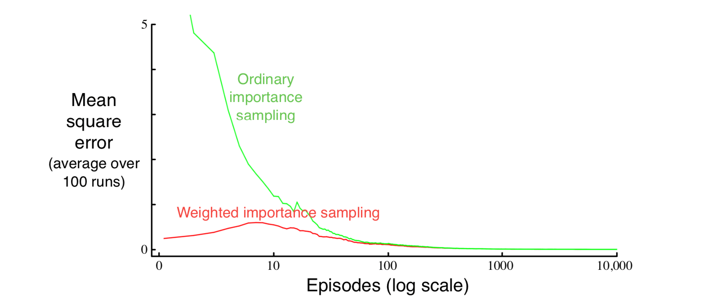
$$
\text {图5.3：遵从离策略回合数据估计21点的单个状态的价值，加权重要性采样有更低的估计误差}
$$

#### 例5.5：无限方差（infinite Variance）

普通重要性采样的估计通常有无穷方差，在缩放后的回报依然如此，这是一个令人不满意的收敛特性——在off-policy学习中，当轨迹包含循环时，这种情况很容易发生。图5.4中显示了一个简单的示例。只有一个非终止状态 s 和两个动作：right和left。right动作会导致确定性转换到终止状态，而left动作则以概率 0.9 返回到 s，或以概率 0.1 转移到终止状态，且奖励为+1，其他情况奖励为0。

- 目标策略：始终选择left动作的。则状态 s 的价值为1（$\gamma=1$）。
- 行为策略：以相等概率选择right和left动作，然后从off-policy数据中估计价值。

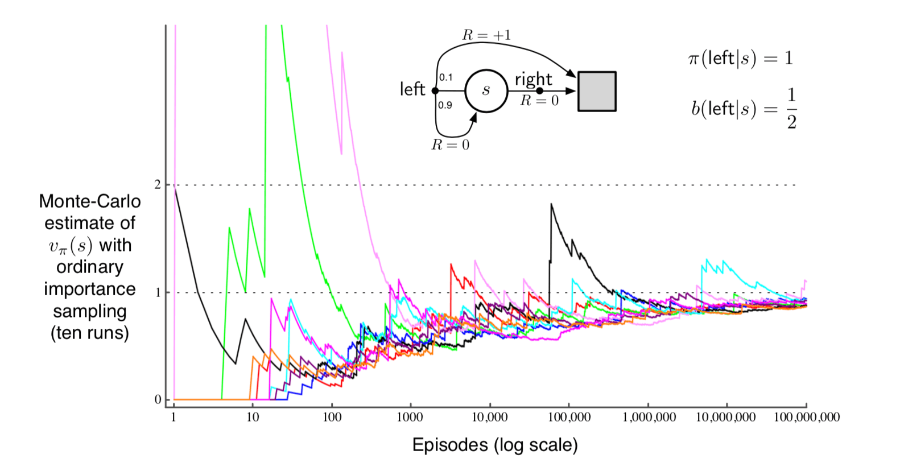
$$
\text {图5.4：普通重要性采样在例5.5中显示的单状态MDP上产生了令人惊讶的不稳定估计。}
$$
这些结果是针对off-policy首次访问蒙特卡洛算法的。正确的估计价值是1*（**$\gamma=1$**）*，尽管这是一个（经过重要性采样后）样本回报的期望值，但样本的方差是无限的，且估计值不会收敛到正确值。

图5.4的下部显示了使用普通重要性采样，十次独立的首次访问MC方法得到的结果。 即使是经历了数百万次的回合后，估计值也不能收敛到正确值 $1$。 相反，对加权重要性采样算法来讲，它会在第一个以 **返回** 动作结束的回合后，就给出刚好为 $1$ 的估计值。 所有返回不为 $1$ 的话（以 **结束** 动作结束），就会造成与目标策略不一致。 这时 $\rho_{t:T(t)}$ 为零，影响5.6式的分子或者分母。 这样，加权重要性采样算法产生的加权平均值，仅考虑了与目标策略相同的回报，因此这个值恰好为 $1$ 。

图5.4下部显示了使用普通重要性采样进行十次独立运行的首次访问MC算法。即使经过数百万轮的训练，估计值仍未收敛到正确的值1。相比之下，加权重要性采样算法在第一轮以left动作结束后将永远给出准确的估计值1。所有不等于1的回报（即以right动作结束的情况）都与目标策略不一致，因此其权重 $\rho_{t:T(t)-1}$​ 为零，既不对(5.6)的分子也不对分母做出贡献。加权重要性采样算法只产生与目标策略一致的回报的加权平均值，所有这些回报都将恰好是1。

我们可以通过简单的计算来验证在这个例子中重要性采样调整后的回报的方差是无穷大的。任何随机变量X的方差是其与均值X¯的偏差的期望值，可以写成
$$
Var[X] \doteq \mathbb{E}[(X - \overline{X})^2] = \mathbb{E}[X^2 - 2X\overline{X}^2+\overline{X}^2] = \mathbb{E}[X^2] - \overline{X}^2.
$$
因此，如果均值是有限的，当且仅当随机变量的平方的期望值是无穷大时，方差是无穷大的，。因此，我们只需证明重要性采样调整后的回报的平方的期望是无穷大：
$$
\mathbb{E}_b\left[ \left( \prod_{t=0}^{T-1} \frac{\pi(A_t|S_t)}{b(A_t|S_t)}G_0 \right)^2 \right].
$$
为了计算这个期望值，我们根据回合长度和终止情况将其分解为不同的情况。

- 任何以right动作结束的回合，其重要性采样比为零，因为目标策略永远不会采取此动作，可以忽略。
- 如果left动作（若干次）转换到非终止状态，最后转换到终止状态。这些回合的回报都为1，因此可以忽略$G_0$因子。

为了得到期望的平方，我们只需要考虑每个回合的长度，将回合发生的概率乘以其重要性采样比的平方，然后将这些相加起来。
$$
\begin{split}\begin{aligned} &= \frac{1}{2}\cdot 0.1\left(\frac{1}{0.5} \right)^2 \quad \quad \quad \quad  \quad \quad \quad  \quad  \quad \quad \quad  \quad  \quad \quad \ \ (长度为1的episode)\\ &+ \frac{1}{2} \cdot 0.9 \cdot \frac{1}{2} \cdot 0.1\left(\frac{1}{0.5} \frac{1}{0.5} \right)^2 \quad \quad \quad  \quad \quad\quad \quad \quad \quad \ (长度为2的episode)\\ &+ \frac{1}{2} \cdot 0.9 \cdot \frac{1}{2} \cdot 0.9 \cdot \frac{1}{2} \cdot 0.1\left(\frac{1}{0.5} \frac{1}{0.5} \frac{1}{0.5} \right)^2 \quad \quad \quad \quad (长度为3的episode)\\ &+ \cdots \\ &= 0.1 \sum_{k=0}^{\infty}0.9^k \cdot 2^k \cdot 2 = 0.2 \sum_{k=0}^{\infty}1.8^k = \infty \end{aligned}\end{split}
$$

#### 练习 5.6-5.8 

- *练习5.6* 给定策略 $b$ 的回报， 式5.6中状态价值 $V(s)$ 换成 *动作* 价值 $Q(s,a)$​ 的表达式是什么？

  答：
  $$
  \rho_{t:T-1} \doteq \frac{p(S_{t+1}|S_t,A_t)\prod_{k=t+1}^{T-1} \pi(A_k|S_k)p(S_{k+1}|S_k,A_k)}
  {p(S_{t+1}|S_t,A_t)\prod_{k=t+1}^{T-1} b(A_k|S_k)p(S_{k+1}|S_k,A_k)}
  = \prod_{k=t+1}^{T-1} \frac{\pi(A_k|S_k)}{b(A_k|S_k)} 
  $$

  $$
  Q(s, a) \doteq \frac{\sum_{t \in \cal{T}(s)} \rho_{t:T(t)-1} G_t}{\sum_{t \in \cal{T}(s)} \rho_{t:T(t)-1}}
  $$

  

- *练习5.7* 在学习曲线中，如图5.3所示，通常随着训练，错误会减少，就像普通重要性采样方法所发生的那样。但是对于加权重要性采样方法，错误首先增加，然后减少。您认为这是为什么？

  答：

- *练习5.8* 例5.5和图5.4中显示的结果采用了首次访问MC方法（ first-visit MC method）。假设相同问题上使用的是每次访问MC方法（ every-visit MC method）。 估计量的方差仍然会是无穷大吗？为什么？

  答：依然是无穷大。因为$G_0^{ev} = average([1,1,1,\cdots, 1]) = 1 = G_0^{fv}$。

### 5.6 增量实现

蒙特卡洛预测方法可以以增量方式逐个回合地实现，使用的技术是对第2章（第2.4节）中描述的技术的扩展。 在第2章中我们对奖励进行了平均，而在蒙特卡洛方法中我们对回报进行了平均。 在其他方面，与第2章中使用的方法完全相同，都可以用于on-policy蒙特卡洛方法。而对于off-policy蒙特卡洛方法，我们需要分别考虑 *普通重要性采样* 和 *加权重要性采样*  两种情况。

对于普通重要性采样，回报值会被重要性采样率 $\rho_{t:T(t)-1}$​​ （见式5.3）所缩放，然后再简单求平均（见式5.5），因此可以直接使用第2章中的增量方法。 而对于加权重要性采样，需要一个略有不同的增量算法。

假设有一系列的回报值 $G_1,G_2,\dots,G_{n-1}$，都是从相同的状态开始的， 且每个回报值对应一个随机的权值 $W_i$ （比如 $W_i = \rho_{t_i:T(t_i)-1}$）。我们希望表示估计值：
$$
V_{n} \doteq \frac {\sum_{k=1}^{n-1}{W_k}G_k} {\sum_{k=1}^{n-1}{W_k}} \quad n \geq 2, \tag {5.7}
$$
增量更新$V_n$ 的更新规则如下。
$$
V_{n+1} \doteq V_n +\frac{W_n}{C_n}\left[G_n - V_n \right], \quad n \geq 1,  \tag {5.8}
$$
且
$$
C_{n+1} \doteq C_n + W_{n+1},
$$
其中 $C_0 \doteq 0$ （且 $V_1$​ 是任意的，因此不需要指定）。

该算法也适用于on-policy的情况，这种情况下，目标策略和行为策略相同（即$\pi = b$），$W$​ 始终是1。

>**Off-policy MC 预测（策略评估），估计 $Q \approx q_\pi$,**
>$$
>\begin{flalign}
>&\text {Input: an arbitrary target policy} \pi   &\\
>&\text {Initialize, for all } s \in \mathcal S,a\in \mathcal A(\mathcal s)   \\
>& \quad Q(s, a)\in\mathbb{R} \text { (arbitrarily)}\\
>& \quad   C(s,a) \leftarrow 0   \\
>&  \text {Loop forever (for each episode): }   \\
>&   \quad b  \leftarrow \text {any policy with coverage of } \pi \\
>&   \quad \text {Generate an episode following } b:  S_0, A_0, R_1, S_1, A_1, R_2, \dots , S_{T-1}, A_{T-1}, R_{T}  \\
>&   \quad G \leftarrow 0    \\
>&   \quad W \leftarrow 1    \\
>&   \quad \text {Loop for each step of episode, }  t = T-1, T-2, \dots, 0, \text { while } W \neq 0  \\
>&   \quad \quad G \leftarrow \gamma{G} + R_{t+1}  \\
>&   \quad \quad C(S_t,A_t) \leftarrow C(S_t,A_t) +W  \\
>&   \quad \quad Q(S_t,A_t) \leftarrow Q(S_t,A_t) + \frac{W}{C(S_t,A_t)}[G - Q(S_t,A_t)]\\
>&   \quad \quad W \leftarrow W \frac{\pi(A_t|S_t)}{b(A_t|S_t)} \\
>\end{flalign}
>$$

#### 练习 5.9-5.10

- *练习5.9* 修改5.1节中首次访问MC策略评估算法，对样本求平均时使用2.4节提到的增量式的实现。

  答：
  $$
  \begin{flalign}
  &\text {输入（Input）：用来评估的策略} \pi   &\\
  &\text {初始化（Initialize）：}   \\
  & \quad V(s)\leftarrow 0   ,  \quad \text {for all } s \in \mathcal S \\
  & \quad   N(s) \leftarrow 0   ,  \quad \text {for all } s \in \mathcal S  \\
  &  \text {Loop forever (for each episode): }   \\
  &  \quad  \text {根据 } \pi \text { 生成情节：}  S_0, A_0, R_1, S_1, A_1, R_2, \dots , S_{T-1}, A_{T-1}, R_{T}  \\
  &   \quad G \leftarrow 0    \\
  &   \quad \text {Loop for each step of episode, }  t = T-1, T-2, \dots, 0 :  \\
  &   \quad \quad G \leftarrow \gamma{G} + R_{t+1}  \\
  &   \quad \quad \text {Unless } S_t \text { appears in }S_0, S_1,...,S_{t-1}:   \\
  &  \quad \quad  \quad \text N(s) = N(s) + 1    \\
  &   \quad \quad  \quad V(s) \leftarrow  V(s) + \frac 1 {N(s)}(G-V(s))   \\
  \end{flalign}
  $$
  
- *练习5.10* 遵循2.4节的非加权的规则，从5.7式推导出5.8式的加权平均更新规则。

  答：非常简单，略。

### 5.7 Off-policy蒙特卡洛控制

现在我们开始展示一个例子，关于本书的第二类学习控制方法：off-policy 方法。 前面讲到，on-policy 策略的显著特点是，使用策略进行控制时并估计其价值。。而 off-policy 方法中，这两个功能是分开的。 用于产生行为的策略，即称作 *行为* 策略（behavior policy），而实际用于评估和提升的策略，即 *目标* 策略（target policy）。 这样分开的好处是，目标策略可以是确定性的（即greedy），同时可以继续对所有可能的动作进行采样。

off-policy 蒙特卡洛控制方法使用上两节讲过的一种技术。它们遵循行为策略的同事，学习和改进目标策略。这些技术要求行为策略对可能由目标策略选择的所有动作都有非零的选择概率（覆盖率）。为了探索所有可能性，我们要求行为策略是软性的（即，在所有状态下，策略选择所有动作的概率是非零的）。

下边的框里展示了一个off-policy 蒙特卡洛方法来估计 $\pi_{*}$ 和 $q_*$， 它是基于广义策略迭代（GPI）和加权重要性采样的。 目标策略 $\pi \approx \pi_*$ 是对于 $Q$ 的贪心策略， $Q$ 是 $q_\pi$ 的估计。 虽然行为策略 $b$ 可以是任何的策略，但是为了保证 $\pi$ 能收敛到最优策略， 对每对状态动作对，都需要收集无限次的回报。 这一点可以通过选择 $b$ 是 $\epsilon-soft$ 来保证。 即使动作是由不同的软策略 $b$ 选择的，且策略 $b$ 可能在回合之间甚至回合中改变， 策略 $\pi$ 也能在所有遇到的状态下收敛到最优。

>**Off-policy MC control，for estimating $\pi \approx \pi_*$**
>$$
>\begin{flalign}
>&\text {Initialize, for all } s \in \mathcal S,a\in \mathcal A(\mathcal s)   &\\
>& \quad Q(s, a)\in\mathbb{R} \text { (arbitrarily)}\\
>& \quad   C(s,a) \leftarrow 0   \\
>& \quad   \pi(s) \leftarrow argmax_a Q(s,a)  \quad \text { (with ties broken consistently)} \\
>&  \text {Loop forever (for each episode): }   \\
>&   \quad b  \leftarrow \text {any soft policy}  \\
>&   \quad \text {Generate an episode following } b:  S_0, A_0, R_1, S_1, A_1, R_2, \dots , S_{T-1}, A_{T-1}, R_{T}  \\
>&   \quad G \leftarrow 0    \\
>&   \quad W \leftarrow 1    \\
>&   \quad \text {Loop for each step of episode, }  t = T-1, T-2, \dots, 0, \text { while } W \neq 0  \\
>&   \quad \quad G \leftarrow \gamma{G} + R_{t+1}  \\
>&   \quad \quad C(S_t,A_t) \leftarrow C(S_t,A_t) +W  \\
>&   \quad \quad Q(S_t,A_t) \leftarrow Q(S_t,A_t) + \frac{W}{C(S_t,A_t)}[G - Q(S_t,A_t)]\\
>&   \quad \quad \pi(S_t) \leftarrow argmax_a Q(S_t,a)  \quad \text { (with ties broken consistently)} \\
>&   \quad \quad\text {if } A_t \ne \pi(S_t) \text { then exit inner Loop (proceed to next episode)}\\
>&   \quad \quad W  \leftarrow W \frac{1}{b(A_t|S_t)} \\
>\end{flalign}
>$$

一个潜在的问题是，当所有剩下的动作是贪心的时候，这个方法只能从回合的尾部学习。 如果非贪心的动作出现很多的话，学习过程会很慢，特别是对于长回合 开始出现的状态而言，潜在地，这可能会大大减慢学习速度。 当然，还没有足够的经验表明这在off-policy蒙特卡洛方法中是个严重的问题。 如果这个问题很严重，那么阐述它最重要的方式是结合时序差分学习（temporal-difference）来讲，这个算法将在下一章见到。 或者，如果 $\gamma$ 小于 $1$ ，下一节的方法也会管用。

#### 练习 5.11-5.12

- *练习 5.11* 在上面 off policy MC控制的算法中， 您可能一直期望 $W$ 更新采用重要性采样率 $\frac{\pi(A_t|S_t)}{b(A_t|S_t)}$， 但是这里却是 $\frac{1}{b(A_t|S_t)}$​。为什么这仍然是正确的？

  答：这是因为 $\pi$ 是 greedy 的， 所以 $\pi(a|s) = \mathbf{1} \{a = \text{argmax}_{a'} Q(s, a')\}.$

- *练习5.12* 赛车赛道（Racetrack）（编程）考虑驾驶赛车在像图5.5那样的赛道上拐弯。你想要尽可能的快，但是又不能冲出赛道。

  

  $$
  \text {图5.5：赛车轨迹问题}
  $$
  在简化的赛车赛道中，规则如下。
  
  - 状态
  
    - 汽车位置：可以是图中任意一个网格。初始位置是起跑线之一。
  
    - 汽车速度：每个时间步长在水平方向和竖直方向移动的格子数。

      - 水平速度：大于等于 $0$，小于等于 $5$。
      - 垂直速度：大于等于 $0$，小于等于 $5$。
  
      除了在起跑线，水平速度和垂直速度不能同时为 $0$。
  
  - 动作：动作是速度分量的增量。

    - 水平：$+1,-1,0$
    - 垂直：$+1,-1,0$
  
    两个速度分量叠加后，共有（$3 \times 3$）动作。
  
  - 奖励:
    - 直到汽车穿过终点线为止，每步的奖励都是-1。
  - 转换
    - 每个回合开始，在起跑线随机选择一个位置，且速度分量都为0。
    - 如果汽车撞到赛道边界，它将被移回到起跑线上的随机位置，两个速度分量都重置为0。
    - 为了让任务更有挑战性，每个时间步，速度有 $0.1$ 的可能性保持原样。

将蒙特卡洛控制方法应用于此任务，以从每个起始状态计算最优策略。展示几条遵循最优策略的轨迹（但关闭这些轨迹的噪声）。

答：见rl_lab.ipynb。

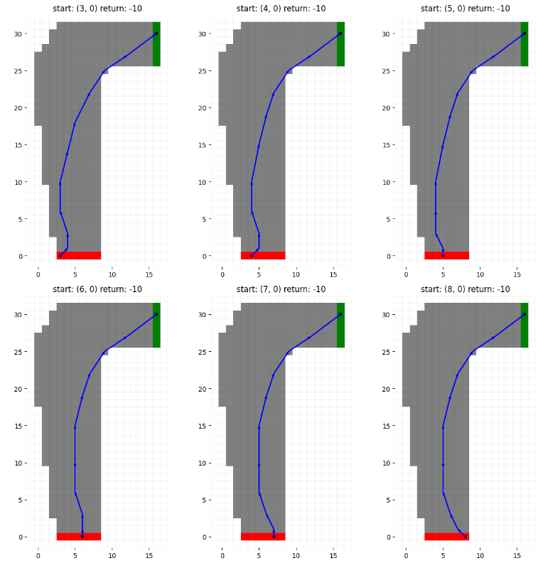

### 5.8 *折扣感知的重要性采样

*Discounting-aware Importance Sampling

目前为止，我们所讨论的off-policy方法是基于重要性采样，将回报看成一个整体，对回报进行加权， 而没有考虑到回报的内部结构，即折现奖励的总和。现在我们简要地考虑利用这种结构的前沿研究思路，以显著降低off-policy估计的方差。

例如，考虑这种情况，回合很长，$\gamma$ 远小于 $1$。 具体而言，假设回合有100个时间步长，$\gamma = 0$。 那么时刻0的回报恰好是 $G_0 = R_1$ ，但是它的重要的采样率将会是一百个参数的乘积， $\frac{\pi(A_0|S_0)}{b(A_0|S_0)} \frac{\pi(A_1|S_1)}{b(A_1|S_1)} \cdots \frac{\pi(A_{99}|S_{99})}{b(A_{99}|S_{99})}$。 对于普通重要性采样而言，回报会被上述的乘积所缩放，但是，真正起作用的是第一项， 即 $\frac{\pi(A_0|S_0)}{b(A_0|S_0)}$， 而与其他 $99$ 项 $\frac{\pi(A_1|S_1)}{b(A_1|S_1)} \cdots \frac{\pi(A_{99}|S_{99})}{b(A_{99}|S_{99})}$ 的乘积无关。 因为，第一个奖励后，回报就已经决定了。之后的乘积项与回报值独立且期望为 $1$​​； 它们并不改变期望值，但是增加了许多方差。一些情况下甚至产生无限大的方差。 现在我们考虑如何避免这个外部的方差。

这个想法的本质是将折扣（discounting ）视为确定终止的概率，或者等价地，部分终止的度*（degree）*。对所有的 $\gamma \in [0,1)$ 

-  $G_0$ 是有 $1 - \gamma$ 的度， 在第一步后部分结束，产生只有一个奖励 $R_1$ 的回报；
-  有 $(1 - \gamma)\gamma$ 的度，在第二步后结束，产生 $R_1+R_2$ 的回报，以此类推。

 以二步为例，$(1 - \gamma)\gamma$ 对应二步结束的度， 其中$\gamma$ 表示第一步不结束的度，$1-\gamma$ 表示第二步结束的度。 又比如，第三步后结束的度为 $(1-\gamma)\gamma^2$，其中 $\gamma^2$​ 表示第一步第二步都没有结束的度。 这个部分的回报我们称为 *flat partial returns*：

> 大概意思懂了，只是很晦涩。原文如下。
>
> The essence of the idea is to think of discounting as determining a probability of termination or, equivalently, a degree of partial termination. For any $\gamma$, we can think of the return G_0 as partly terminating in one step, to the degree 1-\gamma, , producing a return of just the first reward, $R_1$, and as partly terminating after two steps, to the degree  $(1-\gamma)\gamma$,  producing a return of $R_1 + R_2$, and so on. The latter degree corresponds to terminating on the second step, $1-\gamma$, and not having already terminated on the first step, $\gamma$. The degree of termination on the third step is thus $(1-\gamma)\gamma^2,$ with the $\gamma^2 $ reflecting that termination did not occur on either of the first two steps. The partial returns here are called flat partial returns.

$$
\overline{G}_{t : h} \doteq R_{t+1}+R_{t+2}+\cdots+R_{h}, \quad 0 \leq t
$$

其中，“flat”表示缺少折扣，“partial ”表示这些回报只算到第 $h$ 步，不用一直算到结束， $h$ 称为 *水平线（horizon）* （ $T$ 是回合结束的时间）。 传统的 $G_t$​ 可以看成是这些部分平坦回报的和：
$$
\begin{split}\begin{aligned} G_{t} \doteq & R_{t+1}+\gamma R_{t+2}+\gamma^{2} R_{t+3}+\cdots+\gamma^{T-t-1} R_{T} \\ =&(1-\gamma) R_{t+1} \\ &+(1-\gamma) \gamma\left(R_{t+1}+R_{t+2}\right) \\ &+(1-\gamma) \gamma^{2}\left(R_{t+1}+R_{t+2}+R_{t+3}\right) \\ & \vdots \\ &+(1-\gamma) \gamma^{T-t-2}\left(R_{t+1}+R_{t+2}+\cdots+R_{T-1}\right) \\ &+\gamma^{T-t-1}\left(R_{t+1}+R_{t+2}+\cdots+R_{T}\right) \\ &=(1-\gamma) \sum_{h=t+1}^{T-1} \gamma^{h-t-1} \overline{G}_{t : h} \space + \space \gamma^{T-t-1} \overline{G}_{t:T} \end{aligned}\end{split}
$$
现在我们需要使用重要性采样率来缩放平坦部分回报，这与截断相似。 由于 $G_{t:h}$ 只包含了到水平线 $h$ 的奖励，我们只需要到 $h$ 的概率的比率。 现在像式5.5那样，我们定义一个普通重要性采样估计器，如下:
$$
V(s) \doteq \frac{ \sum_{t \in \mathcal{T}(s)}\left((1-\gamma) \sum_{h=t+1}^{T(t)-1} \gamma^{h-t-1} \rho_{t : h-1} \overline{G}_{t : h}+\gamma^{T(t)-t-1} \rho_{t : T(t)-1} \overline{G}_{t : T(t)}\right) }{ |\mathcal{T}(s)| } \tag {5.9}
$$
像式5.6那样，定义一个加权重要性采样估计器，如下：
$$
V(s) \doteq \frac{ \sum_{t \in \mathcal{T}(s)}\left((1-\gamma) \sum_{h=t+1}^{T(t)-1} \gamma^{h-t-1} \rho_{t : h-1} \overline{G}_{t : h}+\gamma^{T(t)-t-1} \rho_{t : T(t)-1} \overline{G}_{t : T(t)}\right) }{ \sum_{t \in \mathcal{T}(s)}\left((1-\gamma) \sum_{h=t+1}^{T(t)-1} \gamma^{h-t-1} \rho_{t : h-1}+\gamma^{T(t)-t-1} \rho_{t : T(t)-1}\right) } \tag {5.10}
$$
我们称上述两种估计器为 *折扣感知（discounting-aware）* 重要性采样估计器。 它们考虑了折扣率，但如果 $\gamma = 1$​ 则没有影响（与5.5节off-policy估计器一样）。

### 5.9 *Per-decision重要性抽样

*Per-decision Importance Sampling

还有一种方法，在off-policy重要性采样里将回报结构作为奖励总和考虑在内， 这样的方法即使在没有折扣的情况下（即 $\gamma = 1$ ）也可以减少方差。 在off-policy策略估计器5.5和5.6中，分子中的每一项都是一个求和：
$$
\begin{split}\begin{aligned} \rho_{t : T-1} G_{t} &=\rho_{t : T-1}\left(R_{t+1}+\gamma R_{t+2}+\cdots+\gamma^{T-t-1} R_{T}\right) \\ &=\rho_{t : T-1} R_{t+1}+\gamma \rho_{t : T-1} R_{t+2}+\cdots+\gamma^{T-t-1} \rho_{t : T-1} R_{T} \end{aligned}\end{split} \tag {5.11}
$$
离策略估计器依赖于这些值的期望；我们尝试用更简单的方式表达出来。 注意到，5.11中的每个元素是一个随机奖励和一个随机重要性采样率的乘积。 比如，第一个元素，我们用5.3式展开，
$$
\rho_{t : T-1} R_{t+1} = \frac{\pi(A_t|S_t)}{b(A_t|S_t)} \frac{\pi(A_{t+1}|S_{t+1})}{b(A_{t+1}|S_{t+1})} \frac{\pi(A_{t+2}|S_{t+2})}{b(A_{t+2}|S_{t+2})} \cdots \frac{\pi(A_{T-1}|S_{T-1})}{b(A_{T-1}|S_{T-1})}R_{t+1}.     \tag {5.12}
$$
在所有这些项中，我们可以猜想，上式中只有第一项和最后一项（奖励）是相关的；所有其他都是与奖励后发生的事件有关，他们的期望值是：
$$
\begin{align}\begin{aligned}\\\mathbb{E}\left[\frac{\pi(A_k|S_k)}{b(A_k|S_k)}\right] = \sum_a b(a|S_k)\frac{\pi(a|S_k)}{b(a|S_k)} = \sum_a \pi(a|S_k) = 1.\end{aligned}\end{align}  \tag {5.13}
$$
通过更多几个步骤可以证明，如所猜想的那样，所有这些其他项对期望没有影响，换句话说，
$$
\mathbb E[\rho_{t:T-1} R_{t+1}] = \mathbb E[\rho_{t:t} R_{t+1}].  \tag {5.14}
$$
如果对5.11中第k项重复上述的分析，我们得到：
$$
\mathbb E[\rho_{t:T-1} R_{t+k}] = \mathbb E[\rho_{t:t+k-1}R_{t+k}].
$$
将上述结果代入式5.11，可以得到：
$$
\mathbb E[\rho_{t:T-1} G_t] = \mathbb E[\tilde{G}_t],
$$
其中
$$
\tilde{G}_{t}=\rho_{t : t} R_{t+1}+\gamma \rho_{t : t+1} R_{t+2}+\gamma^{2} \rho_{t : t+2} R_{t+3}+\cdots+\gamma^{T-t-1} \rho_{t : T-1} R_{T}
$$
上述思想我们称作 *per-decision* 重要性采样。紧随其后的是一个交替重要性采样估计器， 同样是无偏差的，就像5.5的普通重要性采样估计器一样：
$$
V(s) \doteq \frac{\sum_{t \in \mathcal T(s)} \tilde{G}_t}{|\mathcal T(s)|},   \tag {5.15}
$$
我们期望采用该估计器可能有时会降低方差。

是否存在一个per-decision版本的 *加权* 重要性采样呢？这个我们不太清楚。 目前为止，我们所知的这样的估计器都是非一致的（即是说，无限数据也不能让他们收敛到正确的值）。

#### 练习 5.13-5.14

- *练习5.13* 写出从（5.12）导出（5.14）的步骤。 

  答：
  $$
  \begin{array}{l} E[\rho_{t:T-1}R_t] = E_b[\frac{\pi(A_t|S_t)}{b(A_t|S_t)}\frac{\pi(A_{t+1}|S_{t+1})}{b(A_{t+1}|S_{t+1})}\cdots\frac{\pi(A_{T-1}|S_{T-1})}{b(A_{T-1}|S_{T-1})}R_{t+1}] \\ \\ = E_b[\frac{\pi(A_t|S_t)}{b(A_t|S_t)}R_{t+1}]E_b[\frac{\pi(A_{t+1}|S_{t+1})}{b(A_{t+1}|S_{t+1})}]\cdots E_b[\frac{\pi(A_{T-1}|S_{T-1})}{b(A_{T-1}|S_{T-1})}] \\ \\ = E_b[\frac{\pi(A_t|S_t)}{b(A_t|S_t)}R_{t+1}] \\ \\ = E[\rho_{t:t}R_{t+1}] \end{array} 
  $$
  
- *练习5.14* 使用截断加权平均估计量( truncated weighted-average estimator)（5.10）的思想修改off-policy蒙特卡洛控制算法（5.7节）。 请注意，首先需要将此等式转换为动作价值。

  答：看了一些网上答案，很少有答出来的。不知道我的答案是否正确。

  >**Off-policy MC control，for estimating $\pi \approx \pi_*$**
  >$$
  >\begin{flalign}
  >&\text {Initialize, for all } s \in \mathcal S,a\in \mathcal A(\mathcal s)   &\\
  >& \quad Q(s, a)\in\mathbb{R} \text { (arbitrarily)}\\
  >& \quad   C(s,a) \leftarrow 0   \\
  >& \quad   \pi(s) \leftarrow argmax_a Q(s,a)  \quad \text { (with ties broken consistently)} \\
  >&  \text {Loop forever (for each episode): }   \\
  >&   \quad b  \leftarrow \text {any soft policy}  \\
  >&   \quad \text {Generate an episode following } b:  S_0, A_0, R_1, S_1, A_1, R_2, \dots , S_{T-1}, A_{T-1}, R_{T}  \\
  >&   \quad G \leftarrow 0    \\
  >&   \quad W \leftarrow 1    \\
  >&   \quad \rho \leftarrow 1    \\
  >&   \quad \text {Loop for each step of episode, }  t = T-1, T-2, \dots, 0, \text { while } U \neq 0  \\
  >&   \quad \quad G \leftarrow \gamma \rho{G} + WR_{t+1}  \\
  >&   \quad \quad C(S_t,A_t) \leftarrow C(S_t,A_t) +W  \\
  >&   \quad \quad Q(S_t,A_t) \leftarrow Q(S_t,A_t) + \frac{1}{C(S_t,A_t)}[G - Q(S_t,A_t)W]\\
  >&   \quad \quad\text {if } A_t \ne \pi(S_t) \text { then exit inner Loop (proceed to next episode)}\\
  >&   \quad \quad \rho \leftarrow  \frac{1}{b(A_t|S_t)} \\
  >&   \quad \quad W  \leftarrow  \rho(1-\gamma) + \gamma \rho W \\
  >\end{flalign}
  >$$

### 5.10 总结

本章的蒙特卡洛方法以 *样本回合（sample episodes）* 的方式，从经验中学习价值函数和最优策略。 相比于动态规划（DP）的方法，这至少有三种优势。 

- 首先，它们能够直接从与环境的交互中学习到最优的行为，并不需要知道环境的动态。 
- 其次，它们能够被用于模拟或 *样本模型（ sample models）*。对于相当多的应用来讲，虽然我们很难建立具体的转移概率的模型 （这个转移概率模型是DP方法所需要的），但是，我们可以很容易去估计样本回合。 
- 第三，使用蒙特卡洛方法，我们可以很容易且很有效率地 *聚焦* 到的小的状态集。 对于我们特别感兴趣的区域，可以准确地评估，而不需要费大力气去准确地评估剩余的状态集（我们将在第八章继续深入讲解）。

蒙特卡洛方法的第四个优点，也是我们在本书后续将谈论的，是它们对于违反马尔可夫过程的行为会受到更少的伤害。 这是因为，它们对于价值估计的更新并非基于对下一个状态的估计，或者说，它们不进行bootstrap。

在设计蒙特卡洛控制方法时，我们遵循了第4章介绍的广义策略迭代（GPI）的总体架构。GPI涉及策略评估和策略改进的交互过程。蒙特卡洛方法提供了一种替代的策略评估过程。它们不是使用模型来计算每个状态的值，而是简单地平均了从该状态开始的许多回报。因为一个状态的值是期望回报，所以这个平均值可以成为值的一个良好近似。在控制方法中，我们特别关注近似动作价值函数，因为这些可以用来改进策略，而不需要环境转换动态的模型。蒙特卡洛方法将策略评估和策略改进步骤在 episode-by-episode中混合进行，并且可以逐步地在 episode-by-episode中实现。

在蒙特卡洛控制方法中，保持足够的探索是一个问题。仅仅选择当前估计为最佳的动作是不够的，因为这样就不会为替代动作获得回报，而且可能永远不会学到实际上更好的。解决这个问题的一种方法是，假设回合开始时随机地选择状态-动作对，以覆盖所有的可能。在应用中，这样的*探索开端（exploring starts）*能够被安排在模拟的回合中，但是不大可能应用在真实的经验中。在on-policy方法中，个体会一直进行探索，且找到的最优策略仍然会探索。在off-policy方法中，个体也进行探索，但学习一个可能与所遵循的策略无关的确定性最优策略。

*离策略预测* 指从一个不同的 *行为策略* 产生的数据中学习一个 *目标策略* ，学习这个目标策略的价值函数。 这样的学习方法是基于 *重要性采样* 的，即用两种策略下执行观察到的动作的可能性的比值，来加权回报。 *原始重要性采样* 使用加权回报的简单平均，而 *加权重要性采样* 是使用加权的平均。 原始重要性采样是无偏估计，但是有很大的，可能无限的方差。 而加权重要性采样的方差是有限的，在实际中也更受喜爱。 除了概念上的简化，离策略蒙特卡洛方法如何用于预测和控制的问题至今未解决，且仍然是一个正在进行的研究课题。

*off-policy预测* 指从一个不同的 *行为策略* 产生的数据中学习一个 *目标策略* ，学习这个目标策略的价值函数。这样的学习方法是基于 *重要性采样* 的，即用两种策略下执行观察到的动作的可能性的比值，来加权回报。*普通重要性采样* 使用加权回报的简单平均，而 *加权重要性采样* 是使用加权的平均。 普通重要性采样是无偏估计，但是有很大的，可能无限的方差。 而加权重要性采样的方差是有限的，在实际中也更受喜爱。 除了概念上的简化，off-policy蒙特卡洛方法如何用于预测和控制的问题至今未解决，且仍然是一个正在进行的研究课题。

这一章的蒙特卡洛方法与上一章的动态规划方法有两个主要的不同点。 首先，它们对样本经验进行操作，因此可以不用模型，直接进行学习。 其次，他们没有bootstrap。就是说，他们不依赖其他的价值估计来更新自己的价值估计。 这两点不同并非紧密联系，可以分开谈论。 下一章，我们将会考虑一种方法，它可以像蒙特卡洛那样从经验中学习，也可以像动态规划那样使用 bootstrap。

#### 书目和历史评论

略

## 6 时序差分学习

Temporal-Difference Learning

如果必须将一个想法确定为强化学习的核心和新颖，那么毫无疑问它将是 *时序差分* （TD）学习。 TD学习是蒙特卡洛思想和动态规划（DP）思想的结合。与蒙特卡洛方法一样，TD方法可以直接从原始经验中学习，而无需环境动态模型。 与DP一样，TD方法部分基于其他学习估计更新估计，而无需等待最终结果（它们是自举）。 TD，DP和蒙特卡洛方法之间的关系是强化学习理论中反复出现的主题；本章是我们开始探索这个关系。在我们完成之前，我们将看到这些想法和方法相互融合，并且可以以多种方式组合。 特别是，在第7章中，我们介绍了n步算法，它提供了从TD到蒙特卡洛方法的桥梁， 在第12章中我们介绍了 TD（$\lambda$​）算法，它无缝地统一了它们。

和往常一样，我们首先专注于策略评估或预测问题。

- 对于预测问题，估计给定策略 $\pi$ 的价值函数$v_\pi$ 
- 对于控制问题（寻找最优策略），动态规划（DP）、时序差分（TD）和蒙特卡洛方法都使用广义策略迭代（GPI）的某种变体。这些方法的差异主要在于它们对预测问题的处理方法。

### 6.1 TD预测

TD Prediction

TD和蒙特卡洛方法都使用经验来解决预测问题。对于基于策略 $\pi$ 的一些经验， 两种方法都更新了他们对该经验中发生的非终结状态 $S_t$ 的 $v_\pi$ 的估计 $V$。 粗略地说，蒙特卡洛方法一直等到访问后的回报被知晓，然后使用该回报作为 $V(S_t)$ 的目标。 适用于非平稳环境的简单的每次访问蒙特卡洛方法是：
$$
V(S_{t}) \leftarrow V(S_{t})+\alpha\left[ G_{t}-V(S_{t})\right] \tag {6.1}
$$
其中 $G_t$ 是时间 $t$ 后的实际回报，$\alpha$ 是一个恒定的步长参数（参见方程2.4）。 我们将此方法称为 $constant\text -\alpha$ MC。 蒙特卡洛方法必须等到回合结束才能确定 $V(S_t)$ 的增量（这时只有 $G_t$ 已知）， 而TD方法只需要等到下一个时间步。 在时间 $t+1$，它们立即形成目标，并使用观察到的奖励 $R_{t+1}$ 和 $V(S_{t+1})$进行有用的更新。其中，最简单的TD方法在转换到状态 $ S_{t+1}$ 并收到到奖励 $R_{t+1}$ 时立即更新。
$$
V(S_{t}) \leftarrow V(S_{t})+\alpha\left[R_{t+1}+\gamma V(S_{t+1})-V(S_{t})\right] \tag {6.2}
$$
实际上，蒙特卡洛更新的目标是 $G_t$，而TD更新的目标是 $R_{t+1} + \gamma V(S_{t+1})$。这个TD方法称为TD(0)，或One-stepTD，它是第12章和第7章中开发的 TD($\lambda$​) 和 n步TD方法的特例。下面的方框完整地给出了TD(0)的过程形式。

> **Tabular TD(0) 估计** **$v_\pi$**
> $$
> \begin{flalign}
> &\text {Input: the policy } \pi \text { to be evaluated}   & \\
> &\text {Algorithm parameter: step size } \alpha \in {(0,1]} \\
> &\text {Initialize V (s), for all } s \in \mathbb{S}^{+} \text {, arbitrarily except that } V(terminal)=0 \\
> &\text {Loop for each episode:} \\
> &  \quad \text {Initialize } S \\
> &  \quad \text {Loop for each step of episode: } \\
> &  \quad \quad \text {A action given by } \pi \text  { for }  S \\
> &  \quad \quad \text {Take action } A \text {, observe } R, S^{\prime} \\
> &  \quad \quad V(S) \leftarrow V(S)+\alpha\left[R+\gamma V(S^{\prime})-V(S)\right] \\
> &  \quad \quad S \leftarrow S^{\prime} \\ 
> &  \quad \text {until }S \text { is terminal} \\
> \end{flalign}
> $$

由于 TD(0) 的更新部分基于现有的估计，我们说它是一种类似于 DP 的自举（*bootstrapping*）方法。我们从第3章知道：
$$
\begin{split}\begin{aligned} v_{\pi}(s) & \doteq \mathbb{E}_{\pi}\left[G_{t} | S_{t}=s\right] &\quad \quad\quad\quad\quad\quad\quad(6.3)\\ 
&=\mathbb{E}_{\pi}\left[R_{t+1}+\gamma G_{t+1} | S_{t}=s\right] & (from\ (3.9))\\ 
&=\mathbb{E}_{\pi}\left[R_{t+1}+\gamma v_{\pi}\left(S_{t+1}\right) | S_{t}=s\right] &\quad \quad\quad\quad\quad\quad\quad(6.4) 
\end{aligned}\end{split}
$$
粗略地说，蒙特卡洛方法使用（6.3）的估计作为目标，而DP方法使用（6.4）的估计作为目标。蒙特卡洛目标是一个估计，因为（6.3）中的期望值是未知的；使用样本回报来代替实际预期回报。DP目标也是一个估计，不是因为完全由环境模型提供的预期值，而是因为 $v_{\pi}(S_{t+1})$ 未知， 且使用当前估计值 $V(S_{t+1})$ 来代替。TD目标是估计的原因有两个：

- 在（6.4）中对预期值进行采样
-  使用当前估计值 $V$ 而不是真实 $v_\pi$

因此，TD方法将蒙特卡洛的采样与DP的自举相结合。 正如我们将要看到的那样，通过谨慎和想象力（with care and imagination），这可以让我们在很大程度上获得蒙特卡洛和DP方法的优势。

线图显示了表格形式的 TD(0) 的备份图。备份图顶部的状态节点的价值估计是基于从它到紧随其后的状态的一个样本转换而更新的。我们将TD和蒙特卡洛的更新称为样本更新，因为它们涉及向前看一个样本后继状态（或状态-动作对），利用后继状态和途中的奖励来计算一个备份值，然后相应地更新原始状态（或状态-动作对）的值。样本更新与DP方法的期望更新有所不同，因为它们基于单个样本后继而不是所有可能后继的完整分布。

.png)

最后，请注意在TD(0)更新中，括号中的数量是一种误差， 衡量 $S_t$ 的估计值与更好的估计 $R_{t+1} + \gamma V(S_{t+1})$ 之间的差异。 这个数量称为 *TD误差* ，在强化学习中以各种形式出现：
$$
\delta_{t} \doteq R_{t+1}+\gamma V\left(S_{t+1}\right)-V\left(S_{t}\right) \tag {6.5}
$$
请注意，每个时刻的TD误差是当时估算的误差。由于TD误差取决于下一个状态和下一个奖励，所以直到一个步骤之后才可用。也就是说，$\delta_{t}$ 是 $V(S_{t+1})$ 中的误差，在时间 $t+1$ 可用。 还要注意，如果 $V$​ 在回合期间没有改变（在蒙特卡洛方法中确实如此），那么蒙特卡洛误差可以写成TD误差的和：
$$
\begin{split}\begin{aligned} G_{t}-V\left(S_{t}\right) &=R_{t+1}+\gamma G_{t+1}-V\left(S_{t}\right)+\gamma V\left(S_{t+1}\right)-\gamma V\left(S_{t+1}\right) & (from\ (3.9)) \\ &=\delta_{t}+\gamma\left(G_{t+1}-V\left(S_{t+1}\right)\right) \\ &=\delta_{t}+\gamma \delta_{t+1}+\gamma^{2}\left(G_{t+2}-V\left(S_{t+2}\right)\right) \\ &=\delta_{t}+\gamma \delta_{t+1}+\gamma^{2} \delta_{t+2}+\cdots+\gamma^{T-t-1} \delta_{T-1}+\gamma^{T-t}\left(G_{T}-V\left(S_{T}\right)\right) \\ &=\delta_{t}+\gamma \delta_{t+1}+\gamma^{2} \delta_{t+2}+\cdots+\gamma^{T-t-1} \delta_{T-1}+\gamma^{T-t}(0-0) \\ &=\sum_{k=t}^{T-1} \gamma^{k-t} \delta_{k}  \end{aligned}\end{split} \tag {6.6}
$$
如果在回合期间更新 $V$ （因为它在TD(0)中），则此恒等式不准确，但如果步长（step-size）很小，那么它可能仍然保持近似。 这种恒等式的一般化在时序差分学习的理论和算法中起着重要作用。

#### 练习 6.1  

- *练习6.1* 如果 $V$ 在回合中发生变化，那么（6.6）只能近视成立；等式两边的差异是什么？ 设 $V_t$ 表示在TD误差（6.5）和TD更新（6.2）中在时间 $t$ 使用的状态值列表。 重新进行上述推导，以确定必须添加到TD误差之和中的额外量，以使其等于蒙特卡洛误差。

    答：参考[Reinforcement Learning: An Introduction – Exercise 6.1 | Alister Reis’s blog (amreis.github.io)](https://amreis.github.io/ml/reinf-learn/2019/10/14/reinforcement-learning-an-introduction-exercise-6-1.html) 
    $$
    \begin{split}\begin{aligned}
    G_t - V_t(S_t) 
    &= R_{t+1} + \gamma G_{t+1} - V_t(S_t) + (\gamma V_{t+1}(S_{t+1}) - \gamma V_{t+1}(S_{t+1}))\\
    &= R_{t+1} - V_t(S_t) + \gamma V_{t+1}(S_{t+1})  + \gamma (G_{t+1} - V_{t+1}(S_{t+1})) \\
    &= R_{t+1} + \gamma V_{t}(S_{t+1}) - V_t(S_t) + \gamma V_{t+1}(S_{t+1}) -\gamma V_{t}(S_{t+1})   + \gamma (G_{t+1} - V_{t+1}(S_{t+1})) \\
    &= R_{t+1} + \gamma V_{t}(S_{t+1}) - V_t(S_t) + \gamma (V_{t+1}(S_{t+1}) -\gamma V_{t}(S_{t+1}))   + \gamma (G_{t+1} - V_{t+1})
    \end{aligned}\end{split}
    $$
    由于 $\delta_t = R_{t+1} + \gamma V_t(S_{t+1}) - V_t(S_t)$，可得：
    $$
    \begin{split}\begin{aligned}
    G_t - V_t(S_t) 
    &= \delta_t + \gamma (V_{t+1}(S_{t+1}) - V_t(S_{t+1})) + \gamma(G_{t+1} - V_{t+1}(S_{t+1})) \\
    \end{aligned}\end{split}
    $$
    根据定义在时间步 t，我们只更新 $S_{t}$ 的状态价值， 也就是说当时其他的状态价值都不变，即 $V_{t+1}(s') \dot{=} V_t(s')\ \forall s' \neq S_t$，合并起来可得：
    $$
    \begin{split}\begin{aligned}
    V_{t+1}(S_{t+1}) - V_t(S_{t+1}) = \mathbf{1}( S_{t+1} = S_t ) (\alpha \delta_t)
    \end{aligned}\end{split}
    $$
    代入上式可得：
    $$
    \begin{split}\begin{aligned}
    G_t - V_t(S_t) 
    &=  \delta_t + \gamma (\mathbf{1}( S_{t+1} = S_t ) (\alpha \delta_t)) + \gamma(G_{t+1} - V_{t+1}(S_{t+1}))\\
    &= (1 + \alpha\gamma \mathbf{1}( S_{t+1} = S_t )) \delta_t + \gamma (G_{t+1} - V_{t+1}(S_{t+1}))\\
    &= (1 + \alpha\gamma \mathbf{1}( S_{t+1} = S_t )) \delta_t
    + \gamma (1 + \alpha\gamma \mathbf{1}(S_{t+2} = S_{t+1}))\delta_{t+1} + \gamma^2 (G_{t+2} - V_{t+2}(S_{t+2}))\\
    &= (1 + \alpha \gamma\mathbf{1}( S_{t+2} = S_t )) \delta_t +
    \gamma (1+ \alpha \gamma\mathbf{1}( S_{t+2} = S_{t+1}))\delta_{t+1} + \cdots +
    \gamma^{T-t-1}(1 + \alpha \gamma \mathbf{1}( S_T = S_{T-1} ))\delta_{T-1}\\
    &= \sum_{k=t}^{T-1} \gamma^{k-t} (1 + \alpha \gamma \mathbf{1}( S_{k+1} = S_k))\delta_k
    \end{aligned}\end{split}
    $$

#### 例6.1：开车回家

每天下班回家的路上，你都会预测回家要花多长时间。当你离开办公室的时候，你会记下时间，星期几，天气以及其他可能相关的内容。这个星期五你正好在6点钟离开，你估计回家需要30分钟。当你到达车边时，是6:05，你注意到开始下雨了。雨天交通通常会慢一些，所以你重新估计从那时开始需要35分钟，总共40分钟。十五分钟后，你已经顺利完成了高速公路段的旅程。当你驶入次要道路时，你把总行程时间缩短到35分钟。不幸的是，在这个时候，你被一辆慢车挡住了，路又太窄无法超车。你最终不得不跟着那辆卡车，直到你在6:40转入你家所在的小街道。三分钟后，你到家了。因此，状态、时间和预测的顺序如下：

| 状态                 | 经过时间（分钟） | 预测到的时间 | 预计总时间 |
| -------------------- | ---------------- | ------------ | ---------- |
| 周五6点离开办公室    | 0                | 30           | 30         |
| 到达车，下雨         | 5                | 35           | 40         |
| 驶出高速公路         | 20               | 15           | 35         |
| 第二条路，在卡车后面 | 30               | 10           | 40         |
| 进入家的街道         | 40               | 3            | 43         |
| 到家                 | 43               | 0            | 43         |

在这个例子中，奖励是旅程每一段的经过时间。我们不打折（$\gamma=1$​），因此每个状态的回报是从该状态开始的实际所需时间。每个状态的价值是到达目的地的预期时间。第二列数字给出了遇到的每个状态的当前估计值。

> 如果这是一个控制问题，目标是最小化旅行时间，那么我们当然会把奖励设为经过时间的负数。但因为我们在这里只关心预测（策略评估），我们可以通过使用正数来保持简单。

查看蒙特卡洛方法操作的一种简单方式是绘制序列上预测的总时间（最后一列）。如图6.1所示。 当 $\alpha=1$。红色箭头表示常量 $constant\text -\alpha$ MC方法（6.1）推荐的预测变化，即每个状态中估计值（预计时间）与实际回报（实际时间）之间的误差。 例如，当你离开高速公路时，你认为回家仅需15分钟，但实际上需要23分钟。 在这一点上，公式（6.1）适用，它确定了驶出高速公路后时间估计的增量。 在这个时候，误差 $G_t - V(S_t)$为8分钟。假设步长参数 $\alpha$ 为 $1/2$​，驶出高速公路后的预计时间将上调4分钟。在这种情况下，这可能是一个过大的变化；这辆卡车可能只是个不幸的打断。无论如何，这种变化只能在离线时进行，也就是说，在你到达家之后。只有在这时你才知道任何实际的回报。

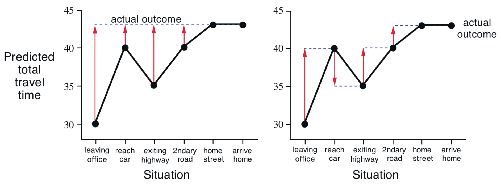
$$
\text {图6.1：驾车回家示例中，蒙特卡洛方法（左）和TD方法（右）推荐的变化。}
$$
在学习开始之前是否必要等到最终结果知晓？假设另一天你再次离开办公室时估计回家需要30分钟，但随后你陷入了一场严重的交通堵塞。离开办公室25分钟后，你仍然在高速公路上等待。你现在估计回家还需要另外25分钟，总共50分钟。当你在车流中等待时，你已经知道你最初的估计30分钟过于乐观了。你必须等到回家才能增加初始状态的估计值吗？根据蒙特卡洛方法，你必须等，因为你还不知道真实的回报。

另一方面，根据TD方法，你可以立即学习，将初始估计值从30分钟转移到50分。 事实上，每个估计值都会转移到紧随其后的估计值。 回到驾驶的第一天，图6.1（右）显示了TD规则（6.2）推荐的预测变化 （如果 $\alpha=1$​，这些是规则所做的更改）。 每个误差与预测随时间的变化成比例，即与预测的 *时序差分* 成比例。

除了在交通中等待时给你一些事情做之外，根据当前的预测进行学习而不是等到终止时才知道实际回报，有几个计算上的优势原因。我们在下一节中简要讨论其中一些。

#### 练习 6.2 

- *练习6.2* 这是一个练习，旨在帮助你直观地理解为什么TD方法通常比蒙特卡洛方法更有效。考虑一下回家的例子以及TD和蒙特卡洛方法如何处理它。你能想象一种情况，在这种情况下，TD更新平均而言会比蒙特卡洛更新更好吗？给出一个例子场景 - 过去经验的描述和当前状态 - 在这种场景下，你会期望TD更新更好。提示：假设你有大量从下班开车回家的经验。然后你搬到了一个新的建筑和一个新的停车场（但你仍然在同一个地方进入高速公路）。现在你开始为新建筑学习预测。你能理解为什么在这种情况下，至少在最初阶段，TD更新很可能更好吗？在原始情景中可能会发生同样的事情吗？

  答：TD可以利用当前状态价值来进行估算，不需要等到回合结束才进行更新，当到了新的环境，也可以利用之前的状态价值来进行学习。总之，效率更高，适应性更强。

### 6.2 TD预测方法的优势

 Advantages of TD Prediction Methods

TD方法在一定程度上基于其他估计更新其估计值。它们从一个猜测中学习另一个猜测 - 它们进行自举（bootstrap）。这样做是好事吗？TD方法相比蒙特卡洛和DP方法有哪些优势？发展并回答这些问题将需要本书的其余部分甚至更多内容。在本节中，我们简要预测了其中一些答案。

显然，TD方法比DP方法有优势，因为它们不需要环境模型，也不需要环境的奖励和下一个状态的概率分布。

TD方法相对于蒙特卡洛方法的下一个最明显的优势是，它们自然地以在线、完全增量的方式实现。使用蒙特卡洛方法，必须等到一个回合结束，因为只有在那时回报才会知道，而使用TD方法，只需要等待一个时间步骤。令人惊讶的是，这往往是一个关键的考虑因素。一些应用程序具有非常长的回合，如果将所有学习延迟到回合结束就太慢了。而且，其他的一些应用程序是持续任务（continuing tasks ），并且根本没有回合。最后，正如我们在上一章中指出的，一些蒙特卡洛方法必须忽略或折扣采用实验动作的回合，这可能会大大减缓学习速度。TD方法对这些问题的敏感性要小得多，因为它们从每个转换中学习，而不管随后采取什么行动。

但是，TD方法是可靠的吗？毫无疑问，从下一个猜测中学习一个猜测，而不需要等待实际结果，这是很方便的，但我们仍然能保证收敛到正确答案吗？幸运的是，答案是肯定的。对于任何固定策略$\pi$，如果满足下面条件，TD(0)算法已经被证明在均值上会收敛到 $v_{\pi}$。

- 步长参数足够小，
- 步长参数按照通常的随机逼近条件(2.7)递减。

大多数收敛证明仅适用于上述算法（6.2）的基于表格的情况，但也有一些适用于一般线性函数逼近的情况。这些结果在第9.4节中以更一般的情况进行了讨论。

如果TD方法和蒙特卡洛方法都在渐近意义下收敛到正确的预测值，那么一个自然的下一个问题是：“哪个方法先到达？”换句话说，哪种方法学习更快？哪种方法更有效地利用有限的数据？目前这是一个悬而未决的问题，因为没有人能够在数学上证明一种方法比另一种方法收敛更快。事实上，甚至不清楚什么是最适合形式化提出这个问题的方式！然而，在实践中，TD方法通常比使用 $constant\text -\alpha$ 的蒙特卡洛方法在随机任务上收敛得更快，如例6.2所示。

#### 例6.2：随机游走（Random Walk）

在这个例子中，我们在应用于以下马尔可夫奖励过程时，凭经验比较TD(0)和 $constant\text -\alpha$​ MC的预测能力：

马尔可夫奖励过程（Markov Reward Process, 即MRP）是一个没有动作的马尔可夫决策过程。当我们专注于预测问题时，我们经常使用MRP，在这种情况下，无需区分环境（environment）动态和个体（agent）动态。在这个MRP中，所有的情节都从中心状态C开始，然后每一步都以等概率向左或向右移动一个状态。回合要么终止在最左端，要么终止在最右端。当回合在右端终止时，奖励为+1；所有其他奖励均为零。例如，一个典型的回合可能包含以下状态和奖励序列：C, 0, B, 0, C, 0, D, 0, E, 1。因为这个任务是不打折的（即$\gamma=1$），所以每个状态的真实价值是从该状态开始终止在右边的概率。因此，中心状态的真实值是$v_\pi(C)=0.5$。所有状态A到E的真实价值分别为 $\frac{1}{6}$，$\frac{2}{6}$，$\frac{3}{6}$， $\frac{4}{6}$ 和 $\frac{5}{6}$。

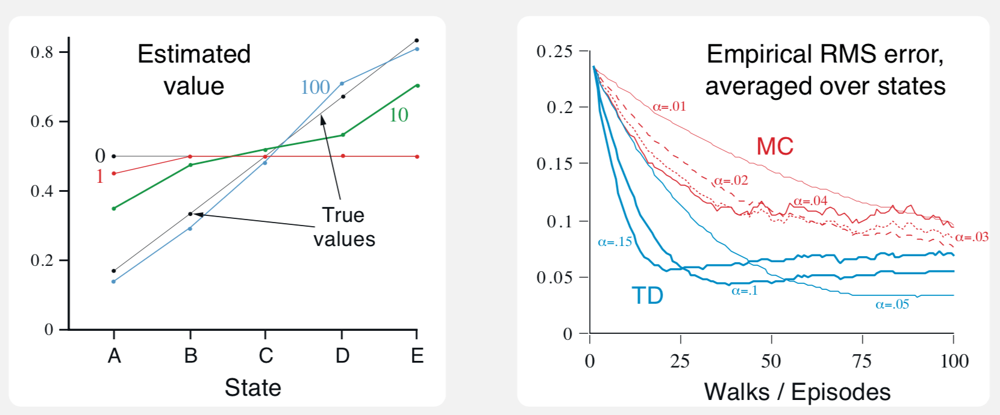

- 左图显示了在TD(0)单次运行中，随着各种回合数量的增加而学习得到的价值。在100个回合后的估计值几乎接近于真实值 —— 在这个例子中，使用恒定步长参数（$\alpha=0.1$），价值会无限地随着最近一个回合的结果而波动。
- 右图显示了两种方法在不同$\alpha$值下的学习曲线。所显示的性能指标是学习的价值函数与真实价值函数之间的均方根（ Root Mean Square，即RMS）误差。对五个状态进行平均，然后运行超过100次后球平均。在所有情况下，所有 $s$ 的价值函数都初始化为 $V(s)=0.5$。在这个任务中，TD方法始终优于MC方法。

#### 练习 6.3-6.6

- *练习6.3* 从随机游走示例中左图所示的结果来看，第一回合仅仅 $V(A)$​ 发生变化。 第一回合究竟发生了什么呢？为什么只有这一状态的估计价值发生了变化？它究竟被改变了多少呢？

  答：根据公式6.2 $V(S_{t}) \leftarrow V(S_{t})+\alpha\left[R_{t+1}+\gamma V(S_{t+1})-V(S_{t})\right]$，由于奖励始终为0，且$\gamma=1, \alpha=0.1$，可以简化为：
  $$
  V(S_{t}) \leftarrow 0.9V(S_{t})+0.1 V(S_{t+1})
  $$
  由于A, B, C, D, E的初始值都是$\frac 1 2 $，在第一个回合中，只要没有游走到最左端或者最右端，$V(s)$ 始终不变。当且仅当游走到最左端的时候，$V(A) = 0.9*\frac 1 2 + 0 = 0.45$，比原来少了$0.05$。

- *练习6.4* 右图显示的具体结果取决于随机游走示例中步长参数 $\alpha$ 的值。您认为如果使用更广范围的 $\alpha$ 值，哪个算法更好的结论是否会受到影响吗？对于任一算法，是否存在某一个 $\alpha$​ 值，使得性能会明显优于右图所示的性能？为什么？

  答：从下面两个图可以看出，对于两种算法，当$\alpha$ 值越小，其RMS下降的速度就越慢，但其最终的RMS会更小。而$\alpha$越大，RMS收敛的速度就越大，但是噪声造成的波动就大。所以 $\alpha$ 的选择要兼顾收敛速度和性能，没有绝对的好。

  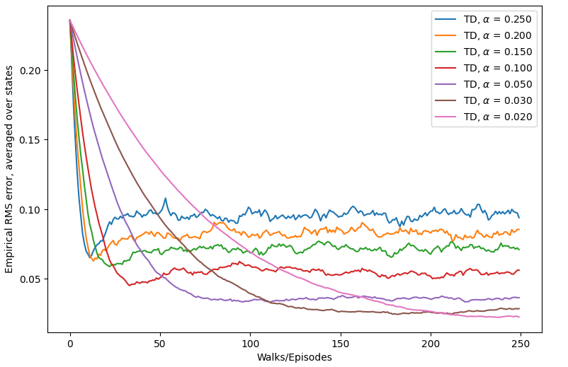

  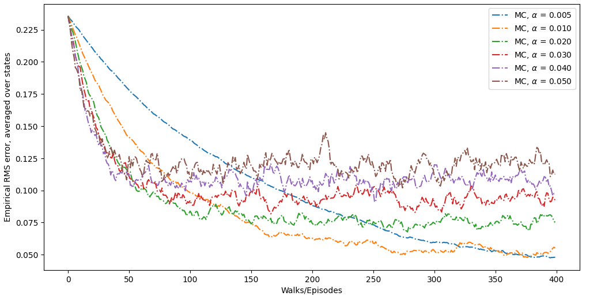

- *练习6.5* 在随机游走示例的右图中，TD 方法的均方根误差似乎先下降，然后再上升，特别是在较高的 $\alpha$ 值时。这可能是什么原因造成的？您认为这种情况总是发生，还是由于近似价值函数的初始化方式所致？

  答：如下面公式，开始的时候，随着Episode的增加，价值越来越接近真实价值，所以RMS逐步变小，在达到某一个RMS低点的后，$V(S_{t+1})$ 的不确定性会影响到 $V(S_{t})$ ， $\alpha$ 值越大，这种波动就会更大。
  $$
  V(S_{t}) \leftarrow (1-\alpha)V(S_{t})+\alpha V(S_{t+1})
  $$

- *练习6.6* 在例6.2中，我们说状态 $A$ 到 $E$ 的真实价值分别为状态  $\frac{1}{6}$，$\frac{2}{6}$，$\frac{3}{6}$， $\frac{4}{6}$ 和 $\frac{5}{6}$​。描述至少两种计算的方法。你猜我们实际使用了哪一种？为什么？

  答：

  - 第一次方法：求解价值函数的线性方程组。
    $$
    \begin{split}\begin{aligned}
    V(A) &= \frac 1 2 V(B) \\
    V(B) &= \frac 1 2 V(A) + \frac 1 2 V(C) \\
    V(C) &= \frac 1 2 V(B) + \frac 1 2 V(D) \\
    V(D) &= \frac 1 2 V(C) + \frac 1 2 V(E) \\
    V(E) &= \frac 1 2 V(D) + \frac 1 2  \\
    \end{aligned}\end{split}
    $$
  
- 第二种方法：
  
  略。

### 6.3 TD(0)的最优性

Optimality of TD(0)

假设只有有限的经验可用，比如说只有10个回合或100个时间步长。在这种情况下，使用增量学习方法的一种常见方法是重复呈现经验，直到方法收敛于一个答案。给定一个近似价值函数 $V$，根据式（6.1）或（6.2），对每个访问非终止状态的时间步 $t$，计算增量，但只有一次更改价值函数，即将所有增量的和。然后再次处理所有可用的经验，使用新的价值函数产生一个新的整体增量，依此类推，直到价值函数收敛。我们将这称为批量更新（batch updating），因为仅在处理每个完整的训练数据批次之后才进行更新。

在批量更新下，TD(0)在步长参数  $\alpha$ 被选择足够小的情况下，确定性地收敛到一个单一的答案，与步长参数无关。在相同条件下，$constant \text - \alpha$​ MC方法也以确定性方式收敛，但收敛到不同的答案。理解这两个答案将有助于我们理解这两种方法之间的区别。在常规更新中，这些方法不会完全移动到它们各自的批次的答案，但在某种意义上它们朝这些方向迈出了步伐。在理解两个答案之前，我们先看几个示例。

#### 例6.3：批量更新下的随机游走

批量更新版本的TD(0)和 $constant \text - \alpha$ MC方法被应用于随机游走预测示例（例6.2）如下。在每个新的回合之后，到目前为止所见的所有回合都被视为一个批次。它们被重复呈现给算法，无论是TD(0)还是 $constant \text - \alpha$ MC方法，都是使 $\alpha$ 足够小以使价值函数收敛。然后将得到的值函数与 $v_\pi$  进行比较，并绘制五个状态的平均均方根误差（以及整个实验的100次独立重复的平均值），得到图6.2所示的学习曲线。请注意，批量TD方法始终优于批量蒙特卡罗方法。

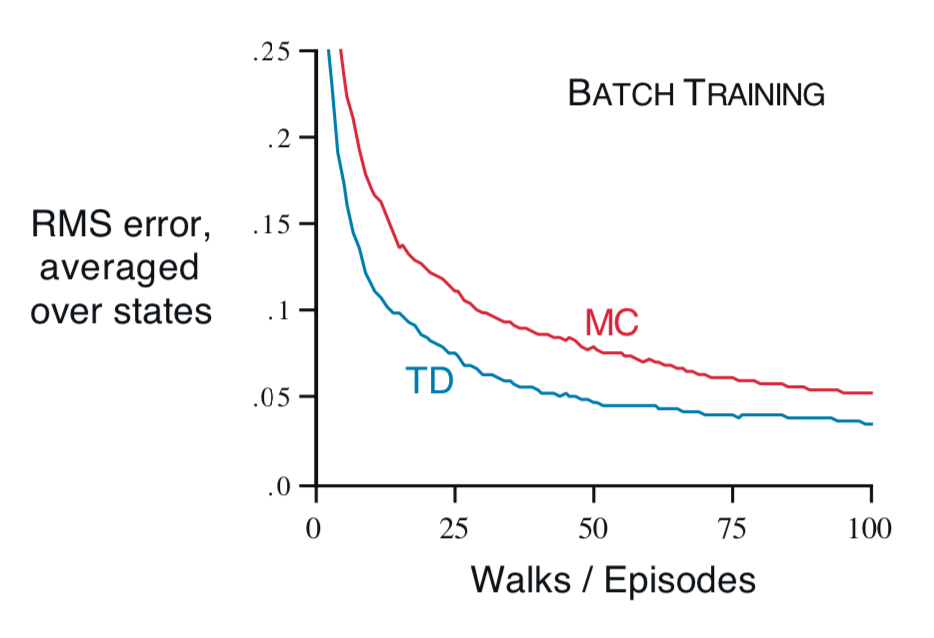
$$
\text {图6.2 在随机游走任务的批量训练下 TD(0) 和 } constant \text - \alpha \text { MC的性能}
$$
在批量训练下，常数步长的蒙特卡罗方法收敛到价值函数 $V(s)$，这些价值函数是在访问每个状态 $s$ 后经历的实际回报的样本平均值。从这个意义上说，这些价值函数是最优的估计，因为它们最小化了训练集中实际回报与预测值之间的均方误差。因此，令人惊讶的是，在上图中显示的均方根误差度量中，批量TD方法能够表现得比这种最优方法更好。为什么批量TD能够比这种最优方法表现更好呢？答案是，蒙特卡罗方法只在有限的情况下是最优的，而TD是以更相关于预测回报的方式最优的。

#### 例6.4：你是预测者

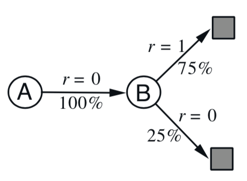

现在将自己置于未知马尔可夫奖励过程的预测者角色中。假设您观察到以下八个回合：

| A,0,B,0 | B,1  |
| ------- | ---- |
| B,1     | B,1  |
| B,1     | B,1  |
| B,1     | B,0  |

这意味着第一个回合从状态A开始，转移到B并且奖励为0，然后从B终止并且奖励为0。其他七个回合更短，从B开始并立即终止。在这批数据的基础上，您会认为什么是最优的预测，对于估计值 $V(A)$ 和 $V(B)$ 的最佳值是什么？大家可能都会同意，V(B) 的最优值是  $\frac{3}{4}$​，因为在状态B中，有六次立即终止，回报为1，而另外两次立即终止，回报为0。

但是，在这些数据的基础上，对于估计值 $V(A)$的最佳值是多少？在这里，有两个合理的答案。 一个答案是观察到，状态A时100%的时间都立即转移到了B（奖励为0）；因为我们已经决定B的值是3/4，所以A的值也必须是3/4。 从某种角度来看，这个答案是基于首先对马尔可夫过程进行建模，如上图所示，然后根据模型计算正确的估计值，实际上在这种情况下给出了  $V(A)=\frac{3}{4}$。这也是批量TD(0)给出的答案。

另一个合理的答案是简单地观察到我们只见过A一次，而随后的回报为0；因此，我们将估计 $V(A)$​​ 为0。这是批量蒙特卡罗方法给出的答案。请注意，这也是给出训练数据最小平方误差的答案。实际上，它在数据上的误差为零。但我们仍然期望第一个答案更好。如果过程是马尔可夫的，我们期望第一个答案在未来数据上产生更低的误差，尽管蒙特卡罗答案在现有数据上更好。

例6.4说明了批量TD(0)和批量蒙特卡罗方法找到的估计之间的一个普遍差异。批量蒙特卡罗方法总是找到最小化训练集上均方误差的估计，而批量TD(0)总是找到对马尔可夫过程的最大似然模型完全正确的估计。一般来说，参数的最大似然估计是使得生成数据概率最大的参数值。在这种情况下，最大似然估计是从观察到的回合中明显形成的马尔可夫过程模型：从 $i$ 到 $j$ 的估计转移概率是从 $i$ 到 $j$​ 的观察到转移的比例，相关联的预期回报是在这些转移中观察到的回报的平均值。在给定这个模型的情况下，我们可以计算出如果模型完全正确，则价值函数的估计将是完全正确的估计。这被称为等价确定性估计（certainty-equivalence estimate），因为它等价于假设对基础过程的估计是确定的，而不是近似的。一般来说，批量TD(0)收敛到等价确定性估计。

这有助于解释为什么TD方法比蒙特卡罗方法收敛得更快。在批量形式下，TD(0)比蒙特卡罗方法更快，因为它计算出了真正的等价确定性估计。这解释了在随机游走任务的批量结果中显示的TD(0)的优势（图6.2）。与等价确定性估计的关系也部分解释了非批量TD(0)的速度优势（例如，例6.2，第125页，右图）。虽然非批量方法不能达到等价确定性或最小平方误差估计，但可以理解为它们大致朝这些方向移动。非批量TD(0)可能比 $constant \text - \alpha$​ MC方法更快，因为它正在朝着更好的估计值前进，尽管它没有完全达到那里。目前还不能对在线TD和蒙特卡罗方法的相对效率作出更明确的说法。

最后，值得注意的是，虽然等价确定性估计在某种意义上是一个最优解，但直接计算它几乎是不可行的。如果 $n=|\mathcal{S}|$ 是状态的数量，那么仅仅形成过程的最大似然估计可能需要大约 $n^2$ 的内存，如果按传统方式进行，计算相应的值函数则需要大约 $n^3$ 的计算步骤。在这些术语中，的确令人震惊的是，TD方法可以使用不超过 $n$​ 的内存和对训练集的重复计算来近似相同的解。在具有大量状态空间的任务中，TD方法可能是近似等价确定性解决方案的唯一可行方法。

#### 练习 6.7 

- *练习6.7* 设计TD(0) 更新的 off-policy 版本，可以用于任意目标策略 $\pi$，并覆盖行为策略 $b$，而且在每一步 $t$ 中使用重要性采样率 $\rho_{t:t} $（5.3）。

    答：

    $$
    \begin{align*}
    v_\pi(s) &= \mathbb{E}\left[\rho_{t:T-1}G_t | S_t = s\right] \\
    &= \mathbb{E}\left[\rho_{t:T-1}R_{t+1} + \gamma\rho_{t:T-1}G_{t+1} | S_t = s\right] \\
    &= \rho_{t:t}\mathbb{E}\left[R_{t+1} | S_t = s\right] + \gamma\rho_{t:t}\mathbb{E}\left[\rho_{t+1:T-1}G_{t+1} | S_t = s\right] \\
    &= \rho_{t:t} \left(\mathbb{E}\left[R_{t+1} | S_t = s\right] + \mathbb{E}\left[\rho_{t+1:T-1}G_t | S_t = s\right]\right) \\
    &= \rho_{t:t} \left(r(s, A_t) + v_\pi(S_{t+1})\right)
    \end{align*}
    $$
    由此可得：
    $$
    V(S_t) \leftarrow V(S_t) + \alpha \left[ \rho_{t:t} R_{t+1} + \rho_{t:t}\gamma V(S_{t+1}) - V(S_t) \right]
    $$

### 6.4 Sarsa：On-policy TD控制

Sarsa: On-policy TD Control

> Sarsa是一种用于在马尔可夫决策过程（MDP）中学习策略的强化学习算法。它代表着“State-Action-Reward-State-Action”。

我们现在转向使用TD预测方法来解决控制问题。像往常一样，我们遵循广义策略迭代（GPI）的模式，只是这次使用TD方法来进行评估或预测。与蒙特卡洛方法一样，我们面临着探索（explore）和利用（exploit）之间的权衡需求，而且方法又可以分为两大类：on-policy（在策略）和off-policy（离策略）。在本节中，我们介绍一种on-policy的TD控制方法。

第一步是学习一个动作价值函数而不是状态价值函数。特别地，对于一个on-policy方法，我们必须估计当前行为策略 $\pi $ 下的 $q_\pi(s, a)$。这可以使用之前学习 $v_\pi$​​ 的基本相同的TD方法来完成。回想一下，一个回合由状态和状态-动作对的交替序列组成：

在前一节中，我们考虑了从状态到状态的转换，并学习了状态的价值。现在我们考虑从状态-动作对到状态-动作对的转换，并学习状态-动作对的价值。从形式上看，这些情况是相同的：它们都是具有奖励过程的马尔可夫链。确保在TD(0)下状态价值收敛的定理也适用于相应的动作价值算法：
$$
Q\left(S_{t}, A_{t}\right) \leftarrow Q\left(S_{t}, A_{t}\right)+\alpha\left[R_{t+1}+\gamma Q\left(S_{t+1}, A_{t+1}\right)-Q\left(S_{t}, A_{t}\right)\right].  \tag {6.7}
$$
在每次从一个非终止状态 $S_t$ 进行转换后进行此更新。如果 $S_{t+1}$ 是终止状态，则 $Q(S_{t+1}, A_{t+1})$ 被定义为零。这个规则使用了构成从一个状态-动作对到下一个状态-动作对的五元事件组的每个元素，即 ( $S_t$, $A_t$, $R_{t+1}$, $S_{t+1}$, $A_{t+1}$​ )。这个五元组引出了算法的名字 Sarsa。Sarsa的备份图如下所示。

在每次从一个非终止状态 $S_t$ 进行转换后进行此更新。如果 $S_{t+1}$ 是终止状态，则 $Q(S_{t+1}, A_{t+1})$ 被定义为零。这个规则使用了构成从一个状态-动作对到下一个状态-动作对的五元事件组的每个元素，即 ( $S_t$, $A_t$, $R_{t+1}$, $S_{t+1}$, $A_{t+1}$​ )。这个五元组引出了算法的名字 Sarsa。Sarsa的备份图如下所示。

Sarsa算法的收敛性质取决于策略对 $Q$ 的依赖性质。例如，可以使用 $\varepsilon\text - greedy$ 或 $\varepsilon \text - soft$ 策略。在通常的步长条件下（式2.7），只要所有的状态-动作对被无限次访问，并且策略在极限下收敛到 greedy 策略（例如，设置 $\varepsilon\text - greedy$ 的 $\varepsilon=1/t$），Sarsa就会以概率1收敛到最优策略和动作价值函数。

> Sarsa (on-policy TD control) for estimating  $Q \approx q_{*}$
> $$
> \begin{flalign}
> &\text {Algorithm parameters: step size } \alpha \in (0,1] \text {, small }  \varepsilon > 0 &\\
> &\text {Initialize } Q(s, a) \text{, for all } s \in \mathbb{S}^{+},a \in \mathcal(A)(s) \text {, arbitrarily except that } Q(terminal, \cdot)=0 \\
> &\text {Loop for each episode:} \\
> &  \quad \text {Initialize } S \\
> &  \quad \text {Choose } A \text { from } S \text { using policy derived from }  Q  \text{ (e.g., } \varepsilon\text -greedy \text {)} \\
> &  \quad \text {Loop for each step of episode: } \\
> &  \quad \quad \text {Take action } A \text {, observe } R, S^{\prime} \\
> &  \quad \quad \text {Choose } A^{\prime} \text { from } S^{\prime} \text { using policy derived from } Q \text  { (e.g., } \varepsilon\text -greedy \text {)}  \\
> &  \quad \quad Q(S, A) \leftarrow Q(S, A)+\alpha\left[R+\gamma Q\left(S^{\prime}, A^{\prime}\right)-Q(S, A)\right] \\
> &  \quad \quad S \leftarrow S^{\prime}；A \leftarrow A^{\prime} \\ 
> &  \quad \text {until }S \text { is terminal} \\
> \end{flalign}
> $$

#### 练习6.8 

- *练习6.8* 展示（6.6）的动作价值的版本，适用于TD误差的动作价值形式 $\delta_{t}=R_{t+1}+\gamma Q\left(S_{t+1}, A_{t+1}\right)-Q\left(S_{t}, A_{t}\right)$​， 再次假设动作价值在步骤之间不会不变。

  答：
  $$
  \begin{split}\begin{aligned} G_{t}-Q\left(S_{t}, A_t \right) &=R_{t+1}+\gamma G_{t+1}-Q\left(S_{t}, A_t \right)+\gamma Q\left(S_{t+1}, A_{t+1} \right)-\gamma Q\left(S_{t+1}, A_{t+1} \right) & (from\ (3.9)) \\ &=\delta_{t}+\gamma\left(G_{t+1}-Q\left(S_{t+1}, A_{t+1} \right)\right) \\ &=\delta_{t}+\gamma \delta_{t+1}+\gamma^{2}\left(G_{t+2}-Q\left(S_{t+2}\right)\right) \\ &=\delta_{t}+\gamma \delta_{t+1}+\gamma^{2} \delta_{t+2}+\cdots+\gamma^{T-t-1} \delta_{T-1}+\gamma^{T-t}\left(G_{T}-Q\left(S_{t}, A_t \right)\right) \\ &=\delta_{t}+\gamma \delta_{t+1}+\gamma^{2} \delta_{t+2}+\cdots+\gamma^{T-t-1} \delta_{T-1}+\gamma^{T-t}(0-0) \\ &=\sum_{k=t}^{T-1} \gamma^{k-t} \delta_{k}  \end{aligned}\end{split}
  $$

#### 例6.5：有风网格世界

Windy Gridworld

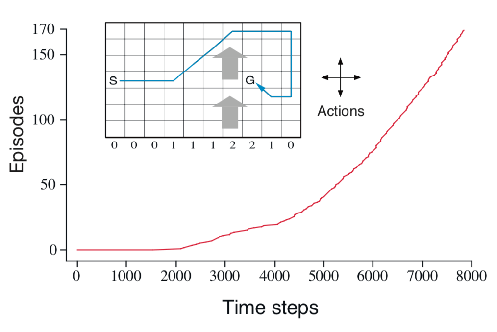

上面的插图是一个标准的网格世界示意图，有起始状态和目标状态，但有一个不同之处：在网格中间有一股向上运行的侧风。行动包括标准的四个方向：上、下、右和左，但在中间区域，由于“风”的作用，下一个状态向上移动，其强度在每一列都不同。在每一列下面都标注了风的强度，以向上移动的单元格数表示。例如，如果你位于目标（G）右侧一个单元格，那么向左的动作将把你带到目标（G）的正上方的单元格。这是一个没有折扣的回合任务，在达到目标状态之前回报恒定为 $-1$。

上面的图表显示了将$\varepsilon \text - greedy$  Sarsa应用于该任务的结果，其中 $\varepsilon=0.1$，$\alpha=0.5$，并且初始值 $Q(s, a)=0$ 。图表的上升斜率显示随着时间的推移，目标被更快地达到。在8000个时间步之后，贪婪策略早已达到最优状态（插图中显示了从中选取的一条轨迹）；持续的$\varepsilon \text - greedy$ 探索使得平均每个episode的长度保持在大约17个步骤，比最小值15多了两个步骤。请注意，蒙特卡洛方法在这里不能轻易使用，因为并非所有的策略都能保证终止。如果找到了一种策略使得智能体停留在同一个状态，那么下一次episode将永远不会结束。在线学习方法如Sarsa没有这个问题，因为它们在episode期间很快学习到这些策略是不好的，并切换到其他策略。

#### 练习 6.9-6.10

- *练习6.9* 有 King’s Moves（指国际象棋中的国王的走法）的有风网格世界（编程）。重新解决有风网格世界任务，假设有八种可能的动作，包括对角移动，而不是四种。有了额外的动作，你可以做得更好多少？通过包括第九个动作，即除了由风引起的移动外没有任何移动，你能做得更好吗？

  答：

  - 八个动作：

    最佳的轨迹只需要7步。

    

  - 九个动作：

    和八个动作相比，区别不大，额外的动作并没有加成。

    

- *练习6.10* 随机风（编程）。重新解决有风网格世界任务，采用 King’s moves 方式，假设风的效果（如果有的话）是随机的，相对于每列给出的平均值变化1个单位。也就是说，有三分之一的时间你会根据这些值精确移动，就像前面的练习中一样，但还有三分之一的时间你会向上移动一格，另外三分之一的时间你会向下移动一格。例如，如果你是目标右侧的一个单元格并向 **左** 移动，那么三分之一的时间将移动到目标上方一个单元格， 三分之一的时间将移动到目标上方两个单元格，最后三分之一的时间你移动到目标。

  答：随机风使得算法的性能大大降低（下面右图中红色箭头表示风力）。从最佳策略上看，差别不大，但是平均的step数从7增加到接近12。

  

### 6.5 Q-learning: Off-policy TD 控制

Q-learning: Off-policy TD Control

强化学习早期的一个重要突破是开发了一个被称为Q-learning（Watkins, 1989）的 off-policy TD控制算法。
$$
Q\left(S_{t}, A_{t}\right) \leftarrow Q\left(S_{t}, A_{t}\right)+\alpha\left[R_{t+1}+\gamma \max _{a} Q\left(S_{t+1}, a\right)-Q\left(S_{t}, A_{t}\right)\right].  \tag {6.8}
$$
在这种情况下，学习的动作价值函数 $Q$ 直接逼近了 $q_*$，即最优动作价值函数，而与所遵循的策略无关。这极大地简化了算法的分析，并实现了早期的收敛证明。策略仍然会产生影响，因为它决定了哪些状态-动作对会被访问和更新。但是，正确收敛所需的只是所有动作-价值对继续更新。正如我们在第5章中观察到的，这是一个最低要求，因为任何在一般情况下保证找到最优行为的方法都必须要求它。在这种假设下和对步长参数序列的通常随机逼近条件的变体下，已经证明 $Q$ 会以概率1收敛到 $q_*$。Q-learning算法以过程形式如下所示：

> Sarsa (on-policy TD control) for estimating  $Q \approx q_{*}$
> $$
> \begin{flalign}
> &\text {Algorithm parameters: step size } \alpha \in (0,1] \text {, small }  \varepsilon > 0 &\\
> &\text {Initialize } Q(s, a) \text{, for all } s \in \mathbb{S}^{+},a \in \mathcal(A)(s) \text {, arbitrarily except that } Q(terminal, \cdot)=0 \\
> &\text {Loop for each episode:} \\
> &  \quad \text {Initialize } S \\
> &  \quad \text {Loop for each step of episode: } \\
> &  \quad \quad \text {Choose } A \text { from } S \text { using policy derived from }  Q  \text{ (e.g., } \varepsilon\text -greedy \text {)} \\
> &  \quad \quad \text {Take action } A \text {, observe } R, S^{\prime} \\
> &  \quad \quad Q(S, A) \leftarrow Q(S, A)+\alpha\left[R+\gamma \max_a Q\left(S^{\prime}, a\right)-Q(S, A)\right] \\
> &  \quad \quad S \leftarrow S^{\prime} \\ 
> &  \quad \text {until }S \text { is terminal} \\
> \end{flalign}
> $$

Q-learning的备份图（backup diagram）是什么？根据规则（6.8）更新状态-动作对，顶点（更新的根）必须是一个小的，填充的动作节点。更新也来自动作节点，通过最大化下一个状态中所有可能的动作。因此，备份图的底部节点应该是所有这些动作节点。最后，请记住我们用一条弧线跨越它们来指示取这些“下一个动作”节点的最大值（见图3.4-右侧）。现在你能猜到这个图是什么样子吗？如果可以的话，请在查看页面134上图6.4的答案之前先猜一下。

$$
\text {图3.4：} v_* \text 和 q_* \text { 的 Backup 图}
$$

#### 例6.6：悬崖行走

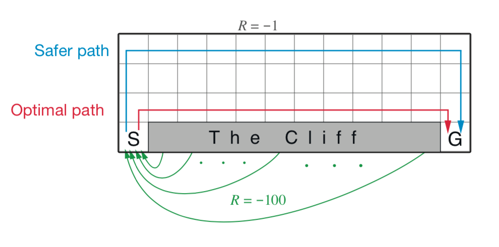

这个网格世界示例比较了Sarsa和Q-learning，突出了on-policy（Sarsa）和 off-policy（Q-learning）方法之间的差异。上图显示的网格世界是一个标准的无折扣回合任务，具有起始状态和目标状态，以及向上、向下、向右和向左移动的常见操作。除了那些进入标有“悬崖”的区域之外，所有转换的奖励都是$-1$。而踏入“悬崖”区域会产生$-100$​的奖励，并立即被送回起点。

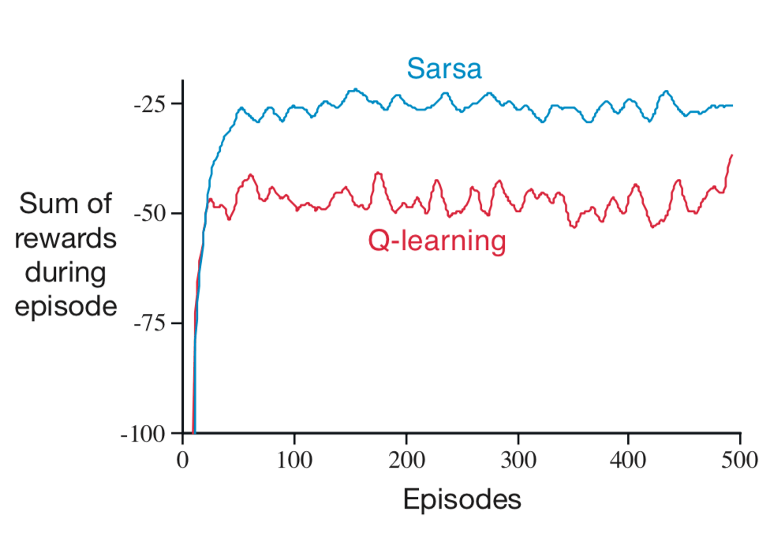

上图显示了使用 $\varepsilon \text - greedy$ 动作选择的Sarsa和Q-learning方法的性能，其中 $\varepsilon=0.1$。在初始短暂之后，Q-learning学习到了最优策略的值，即沿着悬崖边缘向右移动的策略。不幸的是，由于 $\varepsilon \text - greedy$ 动作选择，这导致它偶尔会从悬崖边缘掉下来。另一方面，Sarsa考虑了动作选择，并学习了穿过网格上部的更长但更安全的路径。尽管Q-learning实际上学习了最优策略的值，但其在线性能比Sarsa差，后者学习了迂回的策略。当然，如果 $\varepsilon$​ 逐渐减小，那么两种方法都将渐近地收敛到最优策略。

#### 练习6.11-6.12

- *练习6.11* 为什么Q-learning被认为是一种 *off-policy* 控制方法？

  答：因为目标策略是 $\varepsilon \text - greedy$，而行为策略是 $\varepsilon \text - greedy$ 加上 $greedy$。

- *练习6.12* 假设动作选择是贪婪的。Q-learning与Sarsa的算法完全相同吗？他们会做出完全相同的动作选择和权重更新吗？

  答：是的，会做出相同的动作选择和权重更新。对吗？

### 6.6 预期的Sarsa

Expected Sarsa

考虑学习一个与 Q-learning 类似的算法，区别在于它考虑了当前策略下每个动作的可能性，它使用期望值而不是使用未来状态-动作对的最大值。也就是说，考虑具有以下更新规则的算法:
$$
\begin{split}\begin{aligned} Q\left(S_{t}, A_{t}\right) & \leftarrow Q\left(S_{t}, A_{t}\right)+\alpha\left[R_{t+1}+\gamma \mathbb{E}_{\pi}\left[Q\left(S_{t+1}, A_{t+1}\right) | S_{t+1}\right]-Q\left(S_{t}, A_{t}\right)\right] \\ & \leftarrow Q\left(S_{t}, A_{t}\right)+\alpha\left[R_{t+1}+\gamma \sum_{a} \pi\left(a | S_{t+1}\right) Q\left(S_{t+1}, a\right)-Q\left(S_{t}, A_{t}\right)\right] \end{aligned}\end{split}   \tag {6.9}
$$
除此之外，它遵循了 Q-learning 学习的模式。给定下一个状态 $S_{t+1}$​，这个算法以与 Sarsa 在期望中移动相同的确定性方向，因此被称为 Expected Sarsa。其备份图如下文图 6.4 中右侧所示。

Expected Sarsa 在计算上比 Sarsa 更复杂，但是它消除了由于随机选择  $A_{t+1}$ 的而引起的方差。在相同的经验量下，我们可能期望它的表现略优于 Sarsa，事实上，通常确实如此。图 6.3 显示了 Expected Sarsa 与 Sarsa 和 Q-learning 在悬崖行走任务的总结。Expected Sarsa 在这个问题上保留了 Sarsa 相对于 Q-learning 的显著优势。此外，Expected Sarsa 在一系列步长参数 $\alpha$ 的值上相对于 Sarsa 显示出显著的改进。在悬崖行走中，状态转换都是确定性的，所有的随机性都来自于策略。在这种情况下，Expected Sarsa 可以安全地将 $\alpha$ 设为 1，而不会导致渐近性能的下降，而 Sarsa 只能在较小的 $\alpha$ 值下长期表现良好，而短期性能较差。在这个和其他示例中，Expected Sarsa 相对于 Sarsa 有一致的经验优势。

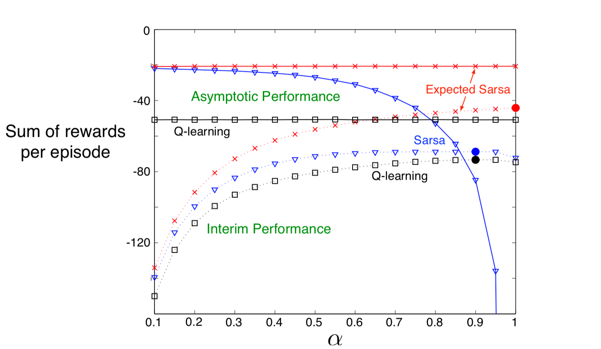
$$
\text {图6.3 关于} \alpha \text {, TD 控制方法在悬崖行走任务中的临时(Interim)和渐近(asymptotic)性能表现 }
$$
上图所有算法都使用 *$\varepsilon \text - greedy $* *策略，其中* $\varepsilon=0.1$。 

- 渐近(asymptotic)性能是超过100,000回合的平均
- 临时(Interim)性能是前100回合的平均值。 

这些数据分别是临时和渐近情况的超过50,000回合和10次运行的平均。 实心圆圈标志着每种方法的最佳临时性能。改编自van Seijen et al.(2009)。

$$
\text {图6.4 Q-learning和Expected Sarsa的备份图 }
$$
在这些悬崖行走的结果中，Expected Sarsa 作为 on-policy 使用的，但一般情况下，它可能使用与目标策略 $\pi$ 不同的策略来产生行为，这样它就成为了一个 off-policy 算法。例如，假设  $\pi$​​  是贪婪策略，而行为更具探索性，那么 Expected Sarsa 就恰好是 Q-learning。从这个意义上说，Expected Sarsa 包含并泛化了 Q-learning，同时可靠地改进了 Sarsa。除了较小的额外计算成本外，Expected Sarsa 可能完全领先于其他那些更为人所知的 TD 控制算法。

### 6.7 最大化偏差（Bias ）和双重学习

Maximization Bias and Double Learning

到目前为止，我们讨论过的所有控制算法在构建目标策略时都涉及最大化。例如，在 Q-learning 中，目标策略是根据当前动作价值给出的贪婪策略，这是用 max 定义的，在 Sarsa 中，目标策略通常是 $\varepsilon \text - greedy $，也涉及最大化操作。在这些算法中，最大估计价值被隐含地用作最大值的估计，这可能导致显著的正偏差。要了解其中的原因，考虑一个单一状态 $s$，其中有许多动作 $a$，它们的真实价值 $q(s, a)$ 都为零，但其估计价值 $Q(s, a)$ 是不确定的，分布在零的上方和下方。真实价值的最大值是零，但估计价值的最大值是正值，这是一种正偏差。我们称这种现象为最大化偏差（maximization bias）。         

#### 例6.7：最大化偏差示例            

图 6.5 中显示的小型 MDP 提供了一个简单的示例，说明最大化偏差如何影响 TD 控制算法的性能。该 MDP 有两个非终止状态 A 和 B。每个情节总是从 A 开始，选择**左**和**右**两个动作之间。**右**动作立即转换到终止状态，奖励和汇报都为零。**左**动作转移到 B，同时奖励为零，状态 B 有许多可能的动作，所有这些动作都导致立即终止，奖励来自均值为 $-0.1$，方差为 $1.0$ 的正态分布。因此，从**左**开始的任何轨迹的期望回报为 $-0.1$，因此状态 A 向**左**移动总是错误的。然而，我们的控制方法可能有利于**左**动作，因为最大化偏差使 B 看起来具有正值。 图6.5显示，使用 $\varepsilon \text - greedy$ 动作选择的 Q-learning 最初学会强烈偏爱**左**侧动作。 即使在渐近情况下，Q-learning也比最优值（其中参数设置 $\varepsilon=0.1$，$\alpha=0.1$ 和 $\gamma=0.1$）多约 5% 的情况选择左侧动作。            

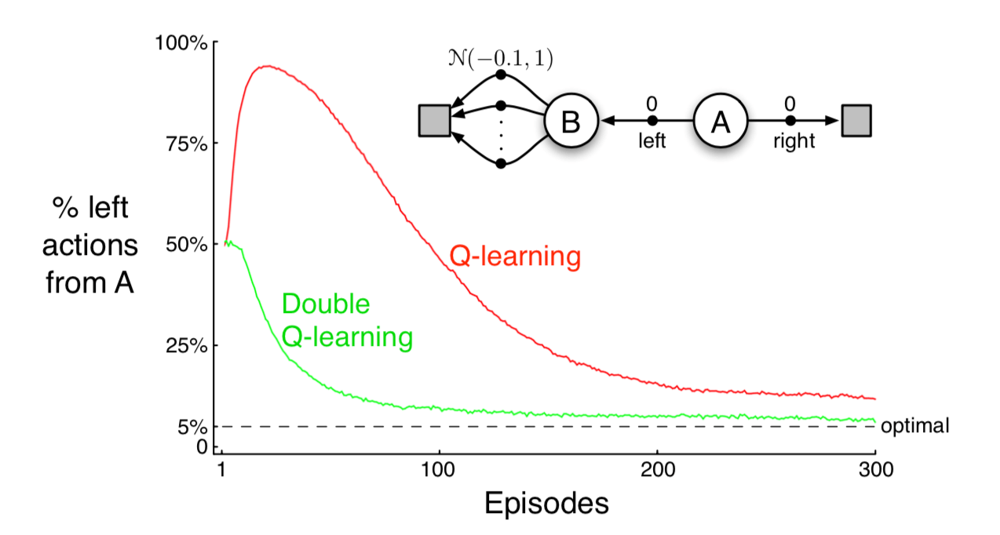
$$
\text {图6.5 在简单的回合的MDP（见插图）进行 Q-learning 和 Double Q-learning 的比较。}
$$
上图中，Q-learning 最初学习更频繁地选择**左**动作，而不是**右**动作，并且始终比 $\varepsilon \text - greedy$ 动作选择（其中*$\varepsilon=0.1$*， 其选择**左**动作的最小概率是5% ）更频繁地选择**左**动作。相比之下，Double Q-learning 基本上不受最大化偏差的影响。这些数据是在 10,000 次运行中平均得到的。初始动作价值估计为零。在 $\varepsilon \text - greedy$​ 动作选择中的任何平衡都是随机打破的。（笔者：这句话啥意思？）                                    

是否存在避免最大化偏差的算法？首先，考虑一个赌博机例子，我们对许多动作的价值进行噪音估计，这些估计是通过对每个动作的所有玩法的奖励的样本平均值得到的。如上所述，如果我们使用估计值的最大值作为真实值的最大值的估计，那么就会出现正的最大化偏差。看待这个问题的一种方式是，它是由于使用相同的样本（玩法）既确定最大化的动作，又估计其价值。假设我们将玩法分为两组，并使用它们来学习两个独立的估计值，称之为 $Q_1(a)$ 和 $Q_2(a)$， 每个都是所有 $a\in\mathcal{A}$ 的真实值 $q(a)$ 的估计。 然后我们可以使用一个估计值，比如 $Q_1$，来确定最大化的动作  $A^{*}=\arg \max _{a} Q_{1}(a)$， 另一个 $Q_2$ 提供其价值的估计 $Q_{2}(A^{*})=Q_2(\arg \max _{a} Q_{1}(a))$。 该估计将是无偏的，即 $ \mathbf{E}[Q_2(A^{*})]=q(A^{*})$ 。 我们还可以反转两个估计值的角色，重复这个过程，得到第二个无偏的估计  $Q_{1}(\arg \max _{a} Q_{2}(a))$​。 这是双重学习（ double learning）的思想。请注意，虽然我们学习了两个估计值，但每次玩都只更新一个估计值；双重学习使内存需求加倍，但不增加每步的计算量。

双重学习的想法自然地扩展到完整 MDP 的算法。例如，类似于 Q-learning 的双重学习算法称为 Double Q-learning，将时间步骤分为两部分，可能通过在每个步骤上抛硬币来实现。如果硬币正面朝上，更新则为：
$$
Q_{1}(S_{t}, A_{t}) \leftarrow Q_{1}(S_{t}, A_{t})+\alpha\left[R_{t+1}+\gamma Q_{2}\left(S_{t+1}, \underset{a}{\arg \max } Q_{1}(S_{t+1}, a\right))-Q_{1}(S_{t}, A_{t})\right]   \tag {6.10}
$$
如果硬币反面朝上，则对  $Q_1$ 和  $Q_2$ 进行互换，然后更新，这样 $Q_2$ 就会被更新。两个近似价值函数完全对称地处理。行为策略可以使用两个动作价值估计。例如，Double Q-learning 的 $\varepsilon \text - greedy$​ 策略可以基于两个动作价值估计的平均值（或总和）。下面是 Double Q-learning 的完整算法，这是用于生成图 6.5 结果的算法。在该例中，双重学习似乎消除了最大化偏差造成的危害。当然，Sarsa 和 Expected Sarsa 也有双重版本。

> Double Q-learning, for estimatingg  $Q_1 \approx Q_2 \approx q_*$
> $$
> \begin{flalign}
> &\text {Algorithm parameters: step size } \alpha \in (0,1] \text {, small }  \varepsilon > 0 &\\
> &\text {Initialize } Q_1(s, a) \text { and } Q_1(s, a) \text{, for all } s \in \mathbb{S}^{+},a \in \mathcal(A)(s) \text {, arbitrarily except that } Q(terminal, \cdot)=0 \\
> &\text {Loop for each episode:} \\
> &  \quad \text {Initialize } S \\
> &  \quad \text {Loop for each step of episode: } \\
> &  \quad \quad \text {Choose } A \text { from } S \text { using policy } \varepsilon\text -greedy \text { in }  Q_1 + Q_2  \\
> &  \quad \quad \text {Take action } A \text {, observe } R, S^{\prime} \\
> &  \quad \quad \text {With } 0.5 \text { probability:} \\
> &  \quad \quad \quad Q_{1}(S, A) \leftarrow Q_{1}(S, A)+\alpha\left(R+\gamma Q_{2}\left(S^{\prime}, \arg \max _{a} Q_{1}\left(S^{\prime}, a\right)\right)-Q_{1}(S, A)\right) \\
> &  \quad \quad \text {else:}  \\
> &  \quad \quad \quad Q_{2}(S, A) \leftarrow Q_{2}(S, A)+\alpha\left(R+\gamma Q_{1}\left(S^{\prime}, \arg \max _{a} Q_{2}\left(S^{\prime}, a\right)\right)-Q_{2}(S, A)\right) \\
> &  \quad \quad S \leftarrow S^{\prime} \\ 
> &  \quad \text {until }S \text { is terminal} \\
> \end{flalign}
> $$

#### 练习6.13

- *练习6.13* 使用 $\varepsilon \text - greedy$​​ 策略的 Double Expected Sarsa 的更新方程是什么？

  答：
  $$
  Q_{1}(S, A) \leftarrow Q_{1}(S, A)+\alpha \left( R + \gamma \left( \frac \varepsilon {\lvert A(a) \rvert} \sum_{a}Q_{2}(S^{\prime}, a) + (1 - \varepsilon) Q_{2}\left(S^{\prime}, \arg \max _{a} Q_{1}\left(S^{\prime}, a\right)\right) \right) - Q_{1}(S_{t}, A_{t}) \right)  \\
  
  Q_{2}(S, A) \leftarrow Q_{2}(S, A)+\alpha \left( R + \gamma \left( \frac \varepsilon {\lvert A(a) \rvert} \sum_{a}Q_{1}(S^{\prime}, a) + (1 - \varepsilon) Q_{1}\left(S^{\prime}, \arg \max _{a} Q_{2}\left(S^{\prime}, a\right)\right) \right) - Q_{2}(S_{t}, A_{t}) \right)
  $$
  

### 6.8 游戏、后状态和其他特殊情况

Games, Afterstates, and Other Special Cases

在本书中，我们试图提出一种统一的方法来处理广泛类别的任务，但当然总是有一些特殊的任务可以通过专门的方式得到更好的处理。例如，我们的一般方法涉及学习动作价值函数，但在第1章中，我们提出了一种学习玩井字游戏（tic-tac-toe）的 TD 方法，它学到的更像是一个状态价值函数。如果我们仔细观察那个例子，就会发现在那里学到的函数既不是动作价值函数，也不是在通常意义上的状态价值函数。传统的状态价值函数评估某个状态下个体（agent）有的动作选项，但在井字游戏中，使用的状态价值函数评估的是个体已经做出移动后的棋盘位置。让我们称之为后状态（afterstate），并将这些状态的价值函数称为后状态（afterstate）价值函数。当我们了解环境动态的初始部分，但不一定了解完整动态时，afterstates 非常有用。例如，在游戏中，我们通常知道我们移动的即时效果。对于每个可能的棋步，我们知道结果位置将是什么，但不知道对手会如何回应。afterstates 价值函数是利用这种知识产生更有效的学习方法的一种自然方式。

从井字棋示例中可以明显看出，根据afterstates设计算法更为有效。传统的动作价值函数会将位置和动作映射到价值的估计。但许多位置-动作对会产生相同的结果位置，就像下面的例子中一样：在这种情况下，位置-动作对是不同的，但产生了相同的“后位置（afterposition）”，因此它们必须具有相同的价值。传统的动作价值函数必须单独评估这两个对，而 afterstates 价值函数会立即平等地评估这两个对。对左侧的位置-动作对的任何学习都会立即转移到右侧的对中。

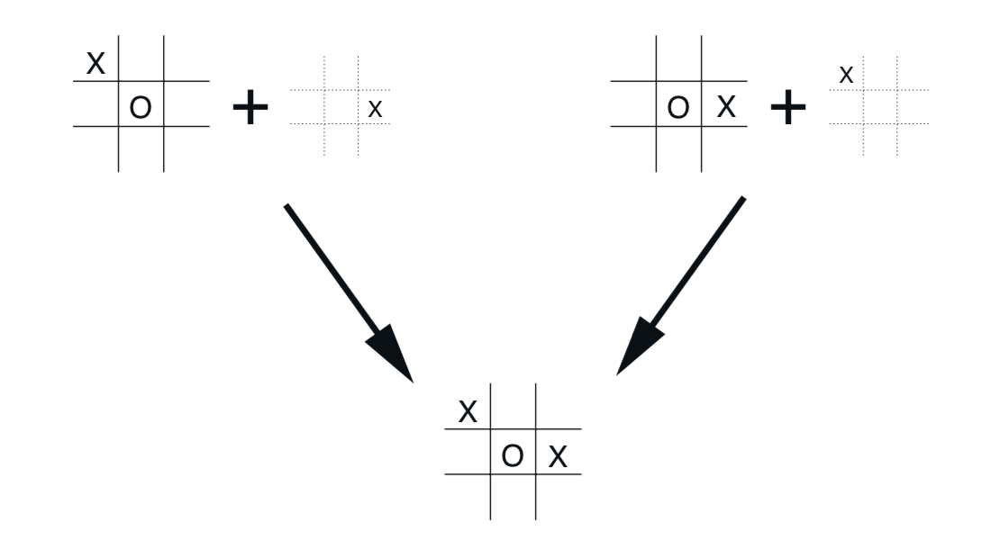

afterstates 不仅出现在游戏中，在许多任务中都有。例如，在排队任务中，有一些动作，如将客户分配给服务器、拒绝客户或丢弃信息。在这种情况下，这些动作实际上是根据它们的即时效果来定义的，这些效果是完全已知的。

> 笔者：这块还是不是很懂。

描述所有可能种类的专业问题和相应的专业学习算法是不可能的。然而，本书中发展的原则应该具有广泛的适用性。例如，afterstates 方法仍然可以用广义策略迭代来描述，策略和（afterstates ）价值函数的交互方式基本相同。在许多情况下，对于持续探索的需求，人们仍然会面临选择：使用 on-policy 还是使用 off-policy 方法。

#### 练习 6.14

- *练习6.14* 描述一下如何将杰克汽车租赁（例4.2）的任务用后状态（afterstates）重新表述。为什么在这个具体任务中，这样的重新表述可能会加速收敛。

  答：不是很懂afterstates，以下是两个其他人的答案

  - 在这种情况下，后状态对应于在两个地点之间每晚转移汽车后每个地点的汽车数量。收敛加速来自于我们估计了一个更简单的映射。原始问题估计了从预转移车辆数量和转移数量到每个位置的预期收入和汽车数量的映射。后状态制定允许从这个映射中移除一个自由度 - 车辆转移计数。车辆转移是确定性的，它对汽车数量的影响仅在后续的随机租赁和归还请求中存在随机性。更简单的两个参数后状态映射仅接收每个地点在一天开始时的汽车数量，并返回一天结束时的预期收入和每个地点的汽车数量。每晚的汽车转移被排除在外，因此估计这个映射需要更少的样本，并且收敛更快。

    The after-states in this case correspond to the number of cars at each location after the nightly  transfer of cars between the two locations. The convergence speed-up would come from the fact we'd  estimate a simpler mapping. Original problem estimates the expected revenue and car counts at each location from of pre-transfer  car counts and the transfer number. After-state formulation allows for removing of one degree of  freedom from this mapping - the car transfer count. The car transfer is deterministic and it's effect  on the car counts is shrouded in stochasticity only by later random rental and return requests. The simpler, two argument after-state mapping only takes in the number of cars at each location at the  beginning of day and returns the expected revenue and the number of cars at each location at the end of  the day. The nightly car transfer is taken out of the picture and estimating this mapping therefore  requires much fewer samples and converges faster.

  - 初始情况下，可能已经编码了每晚每个车库中汽车数量作为状态。然后，代理程序采取一些行动（移动一些汽车），我们以随机方式过渡到某个状态。 另一种方法是将早晨的汽车数量（在代理程序移动汽车之后）引入为后状态。这是因为代理程序能够确定性地改变从晚上到第二天早晨的环境（在租车或归还之前）。 在这种情况下，我们通过减少需要计算的动作值数量来加速收敛。例如，现在我们可以评估（10, 0）移动一辆车和（9, 1）不移动车辆作为相同的后状态（9, 1）。

    One might have coded this up initially with the states as the number of cars in each garage each evening. The agent then takes some action (moves some cars) and we transition stochastically to some state. An alternative would be to introduce the number of cars in the morning (after the agent has moved cars) as an afterstate. This is because the agent is able to deterministically change the environment from evening to next morning (before rentals or returns). In this case we would speed convergence by reducing the number of action-values to be calculated. For instance, we can now evaluate (10, 0) moving one car and (9, 1) moving no cars as the same afterstate (9, 1).

### 6.9 总结

在本章中，我们介绍了一种新型的学习方法，即时时序差分（TD）学习，并展示了它如何应用于强化学习问题。像往常一样，我们将整体问题分为预测问题和控制问题两部分。TD方法是解决预测问题的蒙特卡罗方法的替代方法。在这两种情况下，控制问题的扩展都是通过我们从动态规划中抽象出来的广义策略迭代（GPI）的概念。 这个想法是，近似策略和价值函数应该以这样一种方式相互作用——使它们都朝着它们的最优价值移动。

GPI中的两个过程：

- 预测问题：驱动价值函数准确地预测当前策略的回报；当该过程基于经验（experience）时，出现了关于保持足够的探索的问题。

- 控制问题：驱动策略对当前价值函数在局部（例如， $\varepsilon \text - greedy $​）进行改进。对于TD控制方法，可以根据是使用 on-policy 还是 off-policy 方法来进行分类。

  - on-policy: Sarsa
  - off-policy: Q-learning, Expected Sarsa

  还有第三种TD方法——actor-critic方法。本章中没有涉及，将在第13章中完整介绍。

本章介绍的方法如今是最广泛使用的强化学习方法。这可能是因为它们非常简单：它们可以在线应用，在与环境交互生成的经验中，计算量很少；它们几乎可以完全用单个方程来表达，这些方程可以用小型计算机程序实现。在接下来的几章中，我们将扩展这些算法，使它们变得稍微复杂一些，但更加强大。所有新的算法将保留这里介绍的要点：它们能够在线处理经验，计算量相对较少，并且受到TD误差的驱动。在本章介绍的TD方法的特殊情况应该被正确地称为：一步（ one-step）、表格（tabular）、无模型（model-free）的TD方法。在接下来的两章中，我们将把它们扩展为 $n\text -step$ 形式（与蒙特卡罗方法的联系）和包含环境模型的形式（与规划和动态规划的联系）。然后，在书的第二部分中，我们将把它们扩展为各种形式的函数逼近而不是表格（与深度学习和人工神经网络的联系）。

最后，在本章中，我们完全在强化学习问题的背景下讨论了TD方法，但实际上，TD方法比这更加通用。它们是学习对动态系统进行长期预测的通用方法。例如，TD方法可能与预测金融数据、寿命、选举结果、天气模式、动物行为、发电站需求或客户购买等方面相关。只有当将TD方法作为纯预测方法进行分析时，独立于它们在强化学习中的使用，它们的理论特性才首次得到了很好的理解。即便如此，这些TD学习方法的其他潜在应用还没有得到广泛探索。

#### 书目和历史评论

略

## 7 n-step 自举

n-step Bootstrapping

在本章中，我们统一了前两章介绍的蒙特卡罗（MC）方法和 one-step 时序差分（TD）方法。无论是MC方法还是 one-step TD方法，都不是最好的。在本章中，我们介绍了n-step TD方法，它们将这两种方法进行了泛化，以便根据需要平滑地从一种方法转换到另一种方法，以满足特定任务的需求。n-step 方法横跨了一个谱系，一端是MC方法，另一端是一步TD方法。通常最好的方法介于这两种极端方法之间。

另一种看待n-step方法好处的方式是它们使您摆脱了时间步长（ time step）的束缚。使用one-step TD方法时，相同的时间步长决定了动作改变的频率以及进行自举（bootstrapping）的时间间隔。在许多应用中，我们希望能够非常快速地更新动作，以便能够考虑到已发生的任何变化，但自举最好在状态变化显著的时间段内进行。使用one-step TD方法，这些时间间隔是相同的，因此必须做出妥协。n-step 方法使自举可以在多个步骤中进行，使我们摆脱了单一时间步长的束缚。

n-step方法的概念通常用于介绍 *资格迹 (eligibility traces)*（第12章）算法，这种算法使得在多个时间间隔上同时进行自举成为可能。在这里，这里我们只单独考虑 n 步引导法，暂缓讨论*资格追踪(eligibility-trace)*机制。这样可以更好地分离问题，尽可能多地在更简单的 n 步设置中处理这些问题。

像往常一样，我们首先考虑预测问题，然后再考虑控制问题。也就是说，我们首先考虑n-step方法如何在给定固定策略下帮助预测状态的回报（即估计 $v_\pi$）。然后，我们将这些想法扩展到动作价值和控制方法。

### 7.1 n-step TD 预测

n-step TD Prediction

介于蒙特卡罗方法和TD方法之间的空间是什么？考虑使用 $\pi$ 生成的样本轨迹来估计 $v_\pi$。蒙特卡罗方法基于从该状态到回合结束所观察到的所有奖励序列，对每个状态进行更新。另一方面，one-step TD方法的更新仅基于下一个奖励，且把下一个状态的价值作为剩余奖励的的代替。因此，一种中间方法基于中间数量的奖励进行更新。例如，two-step 基于前两个奖励和两步后状态的估计价值。类似地，我们可以有三步更新、四步更新等。图7.1显示了针对$v_\pi$的n步更新谱系的备份图，其中一步TD更新位于左侧，而直到终止的蒙特卡罗更新位于右侧。

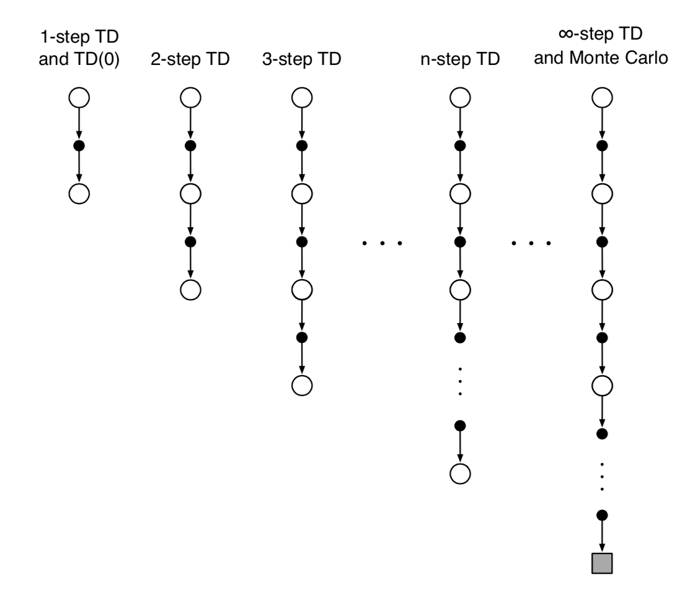
$$
\text {图7.1：n-step备份图。这些方法形成了一个谱系，从one-step TD方法一直到蒙特卡罗方法。}
$$
使用 n-step 更新的方法仍然是TD方法，因为它们仍然基于早期估计值与后期估计价值的差异进行更新。现在，后期估计价值不再是一步之后，而是n步之后。时序差分跨越n步的方法被称为 n--step TD方法。在上一章介绍的TD方法只使用了一步更新，这就是为什么我们称之为 one-step TD方法的原因。

更正式地，状态 $S_t$ 的估计价值的更新是基于状态-奖励序列——$S_{t}, R_{t+1}, S_{t+1}, R_{t+2}, \ldots, R_{T}, S_{T}$（省略了动作）。在蒙特卡罗更新中，$v_\pi(S_t)$的估计价值是朝着完整的回报方向进行更新的。
$$
G_{t} \doteq R_{t+1}+\gamma R_{t+2}+\gamma^{2} R_{t+3}+\cdots+\gamma^{T-t-1} R_{T}
$$
在这里，T是回合的最后一个时间步，我们称这个量为更新的目标。在蒙特卡罗更新中，目标是回报，而在 one-step 更新中，目标是第一个奖励加上下一个状态的折扣估计价值，我们称之为 one-step 回报：
$$
G_{t : t+1} \doteq R_{t+1}+\gamma V_{t}\left(S_{t+1}\right)
$$
其中这里的 $V_{t} : \mathcal{S} \rightarrow \mathbb{R}$ 是 $v_\pi$ 在时刻  $t$ 的估计价值。 $G_{t:t+1}$ 的下标表示它是一个截断回报，从时间 $t$ 开始，直到时间 $t+1$ 的奖励， 折扣估计 $\gamma V_{t}\left(S_{t+1}\right)$ 代替其他项 $\gamma R_{t+2}+\gamma^{2} R_{t+3}+\cdots+\gamma^{T-t-1} R_{T}$ 的回报（ 正如前一章所讨论的）。而我们现在的观点是，这个想法在两步之后同样有意义。two-step 更新的目标是两步的回报：
$$
G_{t : t+2} \doteq R_{t+1}+\gamma R_{t+2}+\gamma^{2} V_{t+1}\left(S_{t+2}\right)
$$
其中现在 $\gamma^{2} V_{t+1}\left(S_{t+2}\right)$ 代替了 $\gamma^{2} R_{t+3}+\gamma^{3} R_{t+4}+\cdots+\gamma^{T-t-1} R_{T}$​ 。 同样，任意 n-step 更新的目标是 $n$ 步的回报：
$$
G_{t : t+n} \doteq R_{t+1}+\gamma R_{t+2}+\cdots+\gamma^{n-1} R_{t+n}+\gamma^{n} V_{t+n-1}\left(S_{t+n}\right)  \tag {7.1}
$$
对于所有的 $n$ 和 $t$，满足 $n\ge1$和 $ 0 \le t < T-n$。所有的 $n$ 步回报都可以被视为对完整回报的近似，截断到n步，然后通过 $V_{t+n-1}\left(S_{t+n}\right)$ 来代替剩余的缺失项。如果 $t+n \ge T$（即 $n$ 步回报延伸到或超过终止点），那么所有缺失项都被视为零， $n$ 步回报等价于普通完整回报（$G_{t : t+n} = G_t$）。

注意，对于 $n > 1$ 的 $n$ 步回报涉及到未来的奖励和状态，在从 $t$ 到 $t + 1$ 的转换时这些未来的信息是不可用的。直到获得$R_{t+n}$并计算$V_{t+n}$之后，才能使用 $n$ 步回报。
$$
V_{t+n}(S_t) \doteq V_{t+n-1}(S_t) + \alpha \left[ G_{t:t+n} - V_{t+n-1}(S_t) \right], \quad 0 \leq t < T \tag {7.2}
$$
当所有其他状态价值保持不变：对于所有 $s \neq S_{t}$，$V_{t+n}(s)=V_{t+n-1}(s)$。 我们将此算法称为 *n-step TD*。 请注意，在每个回合的前 $n-1$​个步骤中，根本不会进行任何更新。 为了弥补这一点，在回合结束后，会进行相同数量的额外更新。 完整的伪代码在下面的框中给出。

>n-step TD for estimating $V \approx v_\pi$
>$$
>\begin{flalign}
>&\text {Input: a policy } \pi    & \\
>&\text {Algorithm parameter: step size } \alpha \in {(0,1]} \text {, a positive integer } n\\
>&\text {Initialize } V(s) \text { arbitrarily, for all } s \in \mathbb{S}^{+} \\
>&\text {All store and access operations (for }S_t \text { and } R_t \text{) can take their index mod } n + 1 \\
>&\text {Loop for each episode:} \\
>&  \quad \text {Initialize amd store } S_0 \neq \text {terminal} \\
>&  \quad T \leftarrow \infty \\
>&  \quad \text {Loop for } t = 0,1,2,\cdots \text {:} \\
>&  \quad \quad \text {If } t<T \text  { then:}  \\
>&  \quad \quad \quad \text {Take a action according to } \pi(\cdot|S_t) \\
>&  \quad \quad \quad \text {Observe and store the next reward as } R_{t+1} \text { and the next state as } S_{t+1}  \\
>&  \quad \quad \quad \text {If } S_{t+1}  \text  { is terminal, then }  T \leftarrow t+1 \\
>&  \quad \quad \tau \leftarrow t - n + 1  \quad \text {(} \tau \text { is the time whose state’s estimate is being updated)} \\
>&  \quad \quad \text {If } \tau \ge 0 \text  { :}  \\
>&  \quad \quad \quad G \leftarrow \sum_{i=\tau+1}^{\min (\tau+n, T)} \gamma^{i-\tau-1} R_{i} \\
>&  \quad \quad \quad \text {If } \tau + n < T \text {, then: } G \leftarrow G+\gamma^{n} 
>V\left(S_{\tau+n}\right)   \quad\quad\quad\quad\quad\quad\quad\quad\quad \left(G_{\tau : \tau+n}\right)\\
>&  \quad \quad \quad V\left(S_{\tau}\right) \leftarrow V\left(S_{\tau}\right)+\alpha\left[G-V\left(S_{\tau}\right)\right] \\
>&  \quad \text {Until }\tau = T - 1
>\end{flalign}
>$$

 $n$ 步回报利用值函数 $V_{t+n-1}$来代替  $R_{t+n}$  之后的缺失奖励。 $n$ 步回报的一个重要特性是，从最坏状态的角度来看，它们的期望值保证比$V_{t+n-1}$ 更好地估计 $v_\pi$ 。也就是说，期望的 $n$ 步回报的最坏误差保证小于或等于$V_{t+n-1}$ 下最大误差的 $\gamma^{n}$ 倍：
$$
\max _{s}\left|\mathbb{E}_{\pi}\left[G_{t : t+n} | S_{t}=s\right]-v_{\pi}(s)\right| \leq \gamma^{n} \max _{s}\left|V_{t+n-1}(s)-v_{\pi}(s)\right|   \tag {7.3}
$$
这被称为 $n$ 步回报的误差减少特性（error reduction property）。由于这种误差减少特性，可以正式地证明在适当的技术条件下，所有 n-stepTD 方法都会收敛到正确的预测值。因此，n-stepTD 方法形成了一系列可靠的方法，其中 one-step TD方法和蒙特卡洛方法是两个极端。

#### 练习 7.1-7.2

- *练习7.1*  在第6章中，我们注意到如果价值估计在步骤之间不变，则蒙特卡洛误差可以写成TD误差（6.6）的总和。推广先前的结果，证明（7.2）中使用的 $n$​ 步误差也可以写成TD误差的总和（再次假设价值估计不变）。

  答：n步TD误差可以表示为：
  $$
  \begin{split}\begin{aligned}
  
  \delta^n_{t} &\doteq  G_{t : t+n} - V(S_t) \\
  &\doteq R_{t+1}+\gamma R_{t+2}+\cdots+\gamma^{n-1} R_{t+n}+\gamma^{n} V\left(S_{t+n}\right) -V\left(S_{t}\right)  \\
  \end{aligned}\end{split}
  $$
  由于$\delta_{t} \doteq R_{t+1}+\gamma V\left(S_{t+1}\right)-V\left(S_{t}\right)$，可得 $  R_{t+1} -V\left(S_{t}\right)\doteq \delta_{t} -\gamma V\left(S_{t+1}\right)$：
  $$
  \begin{split}\begin{aligned}
  \delta^n_{t} 
  &\doteq R_{t+1}-V\left(S_{t}\right) +\gamma R_{t+2}+\cdots+\gamma^{n-1} R_{t+n}+\gamma^{n} V\left(S_{t+n}\right)  \\
  &\doteq \delta_{t} -\gamma V\left(S_{t+1}\right) +\gamma R_{t+2}+\cdots+\gamma^{n-1} R_{t+n}+\gamma^{n} V\left(S_{t+n}\right)  \\
  &\doteq \delta_{t} + \gamma ( R_{t+2}-V\left(S_{t+1}\right) )+\cdots+\gamma^{n-1} R_{t+n}+\gamma^{n} V\left(S_{t+n}\right)  \\
  &\doteq \delta_{t} + \gamma (\delta_{t+1} -\gamma V\left(S_{t+2}\right)  )+\cdots+\gamma^{n-1} R_{t+n}+\gamma^{n} V\left(S_{t+n}\right)  \\
  &\doteq \sum_{k=t}^{t+n-1} \gamma^{k-t} \delta_{k}  \\
  \end{aligned}\end{split}
  $$
  *练习7.2*（编程）在 n-step 方法中，价值的估计会在步骤中发生变化，因此在（7.2）中使用TD误差的总和（参见前面的练习）来代替误差的算法实际上会略有不同。这个算法会更好还是更差？请设计并编写一个小实验来根据经验回答这个问题。

  答：略

#### **例7.1：随机游走的 n-step TD方法** 

考虑在例6.2描述的 5-state 随机游走任务中使用 n-step TD方法。假设第一个回合直接从中间状态C向右进行，穿过D和E，然后在右边终止，回报为1。由于所有状态的估计价值都从一个中间值开始（即 $V(s)=0.5$），one-step 方法只会改变最后一个状态 $V(E)$ 值，该值将会增加。另一方面，一个 two-step 方法会增加终止前的两个状态的值：$V(D)$和$V(E)$。three-step方法或任何 $n \ge 2$ 的 n-step 方法，会使所有三个访问的状态的值递增，且递增的幅度相同。

哪个n的值更好？图7.2展示了一个更大的随机游走过程的简单经验测试结果，这个过程有19个状态，而不是5个（从左侧离开的回报为为 $-1$，所有价值初始化为 $0$）。图中显示了一系列 $n$ 和 $ \alpha$ 值的 n-step TD方法的结果。在回合结束时，计算所有状态的预测值与其真实值之间的平均平方误差（average squared error）的平方根，然后在整个实验的前10回合和100次重复中取平均值（显示在纵坐标上）。值得注意的是，$n$ 取中间值的表现最好。这说明了将 TD 方法和蒙特卡罗方法推广到 n-step 方法，有可能比这两种极端方法中的任何一种都表现得更好。

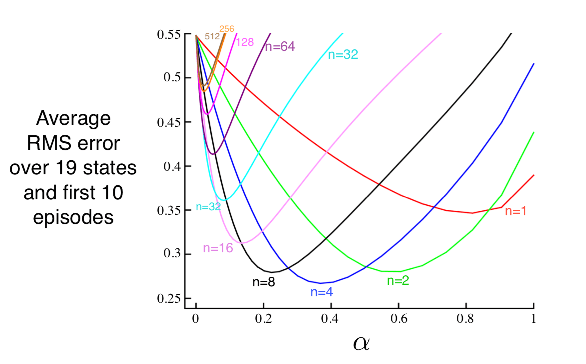
$$
\text {图7.2  在19个状态的随机游走任务（例7.1）中，n-step TD方法的性能。分析了 } \alpha \text{ 对于不同 n 值的影响}
$$
上图可以得到以下几个结论：

- $n$ 值大，$\alpha$​ 值适合取小一点，性能更好，

#### 练习7.3

- *练习7.3* 本章中的例子为什么会使用更大的随机游走任务（19 个状态而不是 5 个状态）？一个更小的漫步任务是否会使最佳 n 值发生变化呢？？对于更大的漫步任务，任务左侧的回报值从 0 变为 -1 会有什么影响？您认为这会改变 n 的最佳值吗？

### 7.2 n-step Sarsa

n-step 方法不仅可以用于预测，还可以用于控制。在这一节中，我们将展示如何将 n-step 方法与Sarsa直接结合，以产生一个基于策略的TD控制方法。Sarsa的n步版本称之为 n-step Sarsa，而上一章介绍的原始版本我们将称之为 one-step Sarsa，或Sarsa(0)。

主要思想是简单地将切换状态-动作对，然后使用一个 $\varepsilon \text - greedy$​  策略。n-step 的备份图如图7.3所示，与 n-step TD的备份图（图7.1）一样，都是交替的状态和动作，不同之处在于Sarsa的备份图都以一个动作而不是一个状态开始和结束。我们根据估计的动作价值重新定义n步回报（更新目标）：
$$
G_{t : t+n} \doteq R_{t+1}+\gamma R_{t+2}+\cdots+\gamma^{n-1} R_{t+n}+\gamma^{n} Q_{t+n-1}\left(S_{t+n}, A_{t+n}\right), \quad n \geq 1,0 \leq t < T-n  \tag {7.4]}
$$
满足当 $t+n \geq T$，则 $G_{t : t+n} \doteq G_{t}$。更新算法如下：
$$
Q_{t+n}\left(S_{t}, A_{t}\right) \doteq Q_{t+n-1}\left(S_{t}, A_{t}\right)+\alpha\left[G_{t : t+n}-Q_{t+n-1}\left(S_{t}, A_{t}\right)\right], \quad 0 \leq t < T, \tag {7.5}
$$
在所有其他状态的值保持不变的情况下：对于所有 $s, a$ 使得 $s \ne S_t$ 或 $a \ne A_t$。这就是我们称之为 n-step Sarsa的算法。

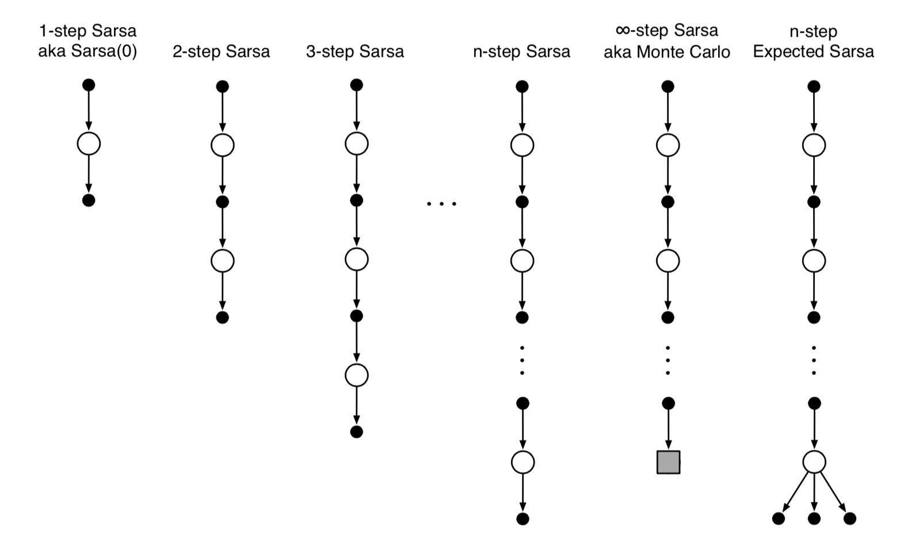
$$
\text {图7.3} 备份图显示了一系列 n-step 方法的状态-动作值更新。
$$
上图展示了从Sarsa(0)的一步更新到蒙特卡洛方法的（一直到终止为止的）更新。两者之间是n步更新，基于实际奖励的n个步骤和第n个下一个状态-动作对的估计值，都被适当地折扣（乘以 $\gamma$）。 最右边是 n-step Expected Sarsa的备份图。

算法的伪代码如下所示。在图7.4中给出了一个示例，说明相对于 one-step 方法，为何 n-step 可以加速学习。

>n-step Sarsa for estimating **$Q \approx q_*$** **或者** **$q_\pi$**
>$$
>\begin{flalign}
>&\text {Initialize } Q(s,a) \text { arbitrarily, for all } s\in\mathcal(S), a\in\mathcal(A)  & \\
>&\text {Initialize } \pi  \text { to be } \varepsilon \text - greedy \text { with respect to } Q \text {, or to a fixed given policy} \\
>&\text {Algorithm parameter: step size } \alpha \in {(0,1]} \text {, small } \varepsilon>0 \text {, a positive integer } n\\
>&\text {Initialize } V(s) \text { arbitrarily, for all } s \in \mathbb{S}^{+} \\
>&\text {All store and access operations (for }S_t, A_t \text { and } R_t \text{) can take their index mod } n + 1 \\
>&\text {Loop for each episode:} \\
>&  \quad \text {Initialize amd store } S_0 \neq \text {terminal} \\
>&  \quad \text {Select and store an action } A_{0} \sim \pi\left(\cdot | S_{0}\right) \\
>&  \quad T \leftarrow \infty \\
>&  \quad \text {Loop for } t = 0,1,2,\cdots \text {:} \\
>&  \quad \quad \text {If } t<T \text  { then:}  \\
>&  \quad \quad \quad \text {Take action  }A_t \\
>&  \quad \quad \quad \text {Observe and store the next reward as } R_{t+1} \text { and the next state as } S_{t+1}  \\
>&  \quad \quad \quad \text {If } S_{t+1}  \text  { is terminal, then }   \\
>&  \quad \quad \quad \quad T \leftarrow t+1 \\
>&  \quad \quad \quad else: \\
>&  \quad \quad \quad \quad \text {Select and store an action } A_{t+1} \sim \pi\left(\cdot | S_{t+1}\right) \\
>&  \quad \quad \tau \leftarrow t - n + 1  \quad \text {(} \tau \text { is the time whose state’s estimate is being updated)} \\
>&  \quad \quad \text {If } \tau \ge 0 \text  { :}  \\
>&  \quad \quad \quad G \leftarrow \sum_{i=\tau+1}^{\min (\tau+n, T)} \gamma^{i-\tau-1} R_{i} \\
>&  \quad \quad \quad \text {If } \tau + n < T \text {, then: } G \leftarrow G+\gamma^{n} 
>Q\left(S_{\tau+n}, A_{\tau+n}\right)   \quad\quad\quad\quad\quad\quad\quad\quad\quad \left(G_{\tau : \tau+n}\right)\\
>&  \quad \quad \quad Q\left(S_{\tau}, A_{\tau}\right) \leftarrow Q\left(S_{\tau}, A_{\tau}\right)+\alpha\left[G-Q\left(S_{\tau}, A_{\tau}\right)\right] \\
>& \quad \quad \quad \text {If } \pi \text { is being learned, then ensure that } \pi\left(\cdot | S_{\tau}\right) \text { is } \varepsilon \text - greedy \text { wrt }Q  \\
>&  \quad \text {Until }\tau = T - 1
>\end{flalign}
>$$

>  解释： $\pi \text { is being learned, then ensure that } \pi\left(\cdot | S_{\tau}\right) \text { is } \varepsilon \text - greedy \text { wrt }Q $ 
>
>  "wrt" 是"with respect to" 的缩写，意思是“关于”，“相对于”。因此，句子可以翻译为：“如果正在学习策略 $\pi$，则确保 $\pi\left(\cdot | S_{\tau}\right)$ 是关于 $Q$ 的 $ \varepsilon \text - greedy $ 策略”

$$
\text {图7.4 网格世界（Gridworld）示例展示了使用 n-step 方法加速学习策略的情况。}
$$
本例中，所有价值最初都为0，除了在G处有正奖励之外，所有奖励都为零。

- 第一个图显示了 Agent 在单个回合中行进的路径，最终结束于G。
- 后面两张图中的箭头显示了由于这条路径，one-step Sarsa 方法和 n-step Sarsa 方法分别强化了哪些动作价值。one-step 方法只强化导致高奖励的动作序列中的最后一个动作，而 n-step 方法强化了序列中的最后 n 个动作，因此它从单个回合中学习到的东西要多得多。

关于Expected Sarsa呢？在图7.3的最右边显示了 Expected Sarsa 的n步版本的备份图。它由一系列的样本动作和状态组成，就像 n步Sarsa一样，只是它的最后一个元素是一个分支，覆盖了所有动作可能性，并根据它们在策略下的概率加权，这个算法可以用与 n步Sarsa相同的方程来描述（如上所示），除了将n步回报重新定义为：
$$
G_{t : t+n} \doteq R_{t+1}+\cdots+\gamma^{n-1} R_{t+n}+\gamma^{n} \overline{V}_{t+n-1}\left(S_{t+n}\right), \quad \quad \quad t+n < T  \tag {7.7}
$$
当 $t+n \geq T$，$G_{t : t+n} \doteq G_{t}$。 其中 $\overline{V}_{t}(s)$ 是状态 s 的 *预期近似值（expected approximate value）*，在目标策略下，使用 $t$ 时刻的估计动作价值：
$$
\overline{V}_{t}(s) \doteq \sum_{a} \pi(a | s) Q_{t}(s, a), \quad \text { 对所有 } s \in \mathcal{S} \tag {7.8}
$$
在本书的其余部分中，许多动作价值方法都使用了预期近似价值。如果 s 是终止状态，则其预期近似价值被定义为 0。

#### 练习 7.4 

- *练习7.4* 证明 Sarsa 的n步回报（7.4）可以完全按照新的TD误差写成如下形式：
  $$
  G_{t : t+n}=Q_{t-1}\left(S_{t}, A_{t}\right)+\sum_{k=t}^{\min (t+n, T)-1} \gamma^{k-t}\left[R_{k+1}+\gamma Q_{k}\left(S_{k+1}, A_{k+1}\right)-Q_{k-1}\left(S_{k}, A_{k}\right)\right]  \tag {7.6}
  $$

### 7.3 n-step Off-policy 学习

