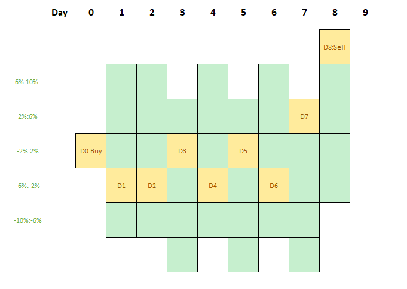

## 思路

- 001： 2023-02-28

  

  可以把股票的买卖，想想成一种格子游戏。如下设定：

  - 每个黄色区域是当天的收盘价
  - 根据当天的收盘价（黄色格子位置），第二天可以有5个状态，这些状态在当天可以上下移动，由于有涨跌停制度，不能突破这五个格子。
  - 到了第二天，根据收盘价，又可以确定第三天的五个格子。其实D1不一定刚好途中的区域，可能会上下滑动，然后基于此确定第三天价格。
  - 对于个体，可以在在某一天（Day 0）收盘时买入股票。然后在以后的某一天卖出。买入有两个动作：
    - 卖出
    - 持有
  - 变量
    - 能量：这个能量决定价格是往上走，还是往下走。
      - 根据当前的买盘和卖盘
      - 交易量
      - 波动率
      - 政治和政策
      - 相关性因素
      - 行业动向
      - 网络搜索量
      - 正负面新闻
      - 持有成本
        - 试图建立一个持有成本的概率分布。
      - 猜测这个市场背后，是怎样的一群人。有庄家吗。机构持有的变化。
      - 。。。
    - 格子分布：基于能量，计算下一天格子分布的概率
    - 机会成本：当前天-初始天，持有时间越长，机会成本越高
    - 买卖指标：
      - 机会成本越高，卖出概率越大
      - 格子分布概率，
        - 进入“低于初始价格6%的格子概率越大，卖出概率越大。
        - 进入“高于初始价格6%的格子概率越大，买入概率越大。
  - 风险控制
    - D0时的价格比，超过10%，卖出
    - D0时的价格比，少于6%，卖出

## 资源

-  [Yves Hilpisch - Python for Algorithmic Trading_ From Idea to Cloud Deployment (2020, O'Reilly Media) - libgen.li.pdf](..\..\..\..\..\ai\book\trading\Yves Hilpisch - Python for Algorithmic Trading_ From Idea to Cloud Deployment (2020, O'Reilly Media) - libgen.li.pdf) 

  据说非常容易上手。

-  [Algorithmic_Trading_and_Reinforcement_Learning.pdf](..\..\..\..\..\ai\book\trading\Algorithmic_Trading_and_Reinforcement_Learning.pdf) 

  对强化学习和量化交易进行了详细的论述。

## [A Data Scientist’s Approach for Algorithmic Trading using Deep Reinforcement Learning: An End-to-end Tutorial for Paper Trading](https://medium.datadriveninvestor.com/a-data-scientists-approach-for-algorithmic-trading-using-deep-reinforcement-learning-an-be8da40b2230)

### 什么是Paper Trading

Paper trading is simulated trading that allows people to 

- practice trading securities; 
- test and fine-tune new investment strategies before apply it in live account; 
- teach beginners how to place orders and learn the trading basics.

### Part 1: 安装Alpaca Paper Trading API

**The free rate limit is 200 requests every minute per API key.**

[FinRL: Financial Reinforcement Learning](https://github.com/AI4Finance-Foundation/FinRL)