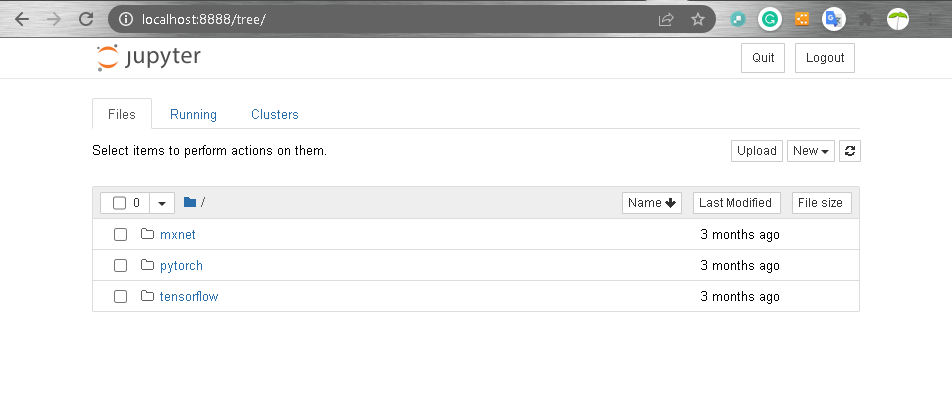
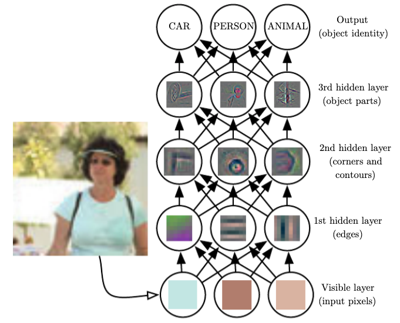

下面是书的内容摘要。书的链接是  https://zh.d2l.ai/chapter_preface/index.html。

# 序言

## 关于本书

这本书代表了我们的尝试——让深度学习可平易近人，教会你*概念*、*背景*和*代码*。

- 一种结合了代码、数学和HTML的媒介
- 在实践中学习

- 内容和结构

全书大致可分为三个部分，在 [图1](https://zh-v2.d2l.ai/chapter_preface/index.html#fig-book-org) 中用不同的颜色呈现。


<center>图1 全书结构</center>

# 安装

~~~mermaid
flowchart LR
    subgraph Environment
    subgraph D2L Book
    BL-->BN[Notebooks]
    end
    subgraph Environment
    Git[Git - Git Bash]-->Python[Python - Miniconda]
    Python-->DLF[Deep Learning Framework]
    Python-->BL[D2L Book Library]
    end
~~~

### Install Git

open https://git-scm.com/download/win, choose **[64-bit Git for Windows Setup](https://github.com/git-for-windows/git/releases/download/v2.35.1.windows.2/Git-2.35.1.2-64-bit.exe).**


make sure "Git Bash Here" is checked, then install as default.


### Install  Miniconda

Open https://conda.io/en/latest/miniconda.html, Let's choose the version of Python 3.8.

#### Windows

1. choose [Miniconda3 Windows 64-bit](https://repo.anaconda.com/miniconda/Miniconda3-py38_4.11.0-Windows-x86_64.exe) and download.


2. install with the default options.

3. open "Git Bash" in Windows Start.

   

4. run the following script in "Git Bash".

   ~~~shell
   echo ". ~/Miniconda3/etc/profile.d/conda.sh" >> ~/.bashrc
   ~~~

5. close and reopen "Git Bash". 

6. create the python virtual environment.

   ~~~shell
   #remove python virtual environment if it exists
   conda env remove -n d2l       
   #create python virtual environment 
   conda create -y -n d2l python=3.8
   # check environment list
   conda env list          
   ~~~

7. active the environment.

   ~~~shell
   # active the virtual environment
   conda activate d2l
   ~~~

#### Linux

choose [Miniconda3 Linux 64-bit](https://repo.anaconda.com/miniconda/Miniconda3-py38_4.11.0-Linux-x86_64.sh).


### Install Deep Learning Framework

#### PyTorch

~~~
pip install torch torchvision torchaudio
~~~

#### Tensorflow

~~~
pip install tensorflow tensorflow-probability
~~~

### Install d2l package

~~~
pip install d2l
~~~

还可以安装代码的slide版本。

~~~
git clone https://github.com/d2l-ai/d2l-zh-pytorch-slides.git
pip install rise
~~~

### Download notebooks

- 中文版

    ~~~
    cd /c/xujian/eipi10/
    mkdir d2l-zh && cd d2l-zh
    curl https://zh-v2.d2l.ai/d2l-zh-2.0.0.zip -o d2l-zh.zip
    unzip d2l-zh.zip && rm d2l-zh.zip
    ll
    ~~~


- 英文版

    ~~~
    cd /c/xujian/eipi10/
    mkdir d2l-en && cd d2l-en
    curl https://d2l.ai/d2l-en.zip -o d2l-en.zip
    unzip d2l-en.zip && rm d2l-en.zip
    ll
    ~~~

	

然后可以启动jupyter notebook. 

~~~
jupyter notebook
~~~



以后每次运行，需要运行，如下代码：

~~~
conda activate d2l
cd /c/xujian/eipi10/d2l-zh
jupyter notebook
~~~


# 符号

各种符号，都可以用LaTex格式表示。

# 1. 前言

## 1.1. 日常生活中的机器学习

机器学习中的训练过程通常包含如下步骤：

1. 从一个随机初始化参数的模型开始，这个模型基本毫不“智能”。
2. 获取一些数据样本（例如，音频片段以及对应的{是,否}{是,否}标签）。
3. 调整参数，使模型在这些样本中表现得更好。
4. 重复第2步和第3步，直到模型在任务中的表现令你满意。


<center>图1.1.2 一个典型的训练过程</center>

## 1.2. 关键组件

1. 我们可以学习的*数据*（data）。
2. 如何转换数据的*模型*（model）。
3. 一个*目标函数*（objective function），用来量化模型的有效性。
3. 调整模型参数以优化目标函数的*算法*（algorithm）。

### 1.2.1. 数据

- 更多的数据

  一般来说，我们拥有的数据越多，我们的工作就越容易。 当我们有了更多的数据，我们通常可以训练出更强大的模型，从而减少对预先设想假设的依赖。 数据集的由小变大为现代深度学习的成功奠定基础。 在没有大数据集的情况下，许多令人兴奋的深度学习模型黯然失色。 就算一些深度学习模型在小数据集上能够工作，但其效能并不比传统方法高。

- 正确的数据 

  如果数据中充满了错误，或者如果数据的特征不能预测任务目标，那么模型很可能无效。 当数据不具有充分代表性，甚至包含了一些偏见时，模型就很有可能有偏见。

### 1.2.2. 模型

深度学习与经典方法的区别主要在于：前者关注的功能强大的模型，这些模型由神经网络错综复杂的交织在一起，包含层层数据转换，因此被称为*深度学习*（deep learning）。 

### 1.2.3. 目标函数

我们通常定义一个目标函数，并希望优化它到最低点。 因为越低越好，所以这些函数有时被称为*损失函数*（loss function，或cost function）。

 当一个模型在训练集上表现良好，但不能推广到测试集时，我们说这个模型是“过拟合”（overfitting）的。 就像在现实生活中，尽管模拟考试考得很好，真正的考试不一定百发百中。

### 1.2.4. 优化算法

需要一种算法，它能够搜索出最佳参数，以最小化损失函数。 深度学习中，大多流行的优化算法通常基于一种基本方法–*梯度下降*（gradient descent）。

## 1.3. 各种机器学习问题

### 1.3.1. 监督学习

*监督学习*（supervised learning）擅长在“给定输入特征”的情况下预测标签。


可以参见视频：https://www.coursera.org/learn/ai-for-everyone/lecture/5TPFo/machine-learning

#### 1.3.1.1. 回归

*回归*（regression）是最简单的监督学习任务之一，用于预测数值。

即使你以前从未使用过机器学习，可能在不经意间，你已经解决了一些回归问题。 例如，你让人修理了排水管，你的承包商花了3个小时清除污水管道中的污物，然后他寄给你一张350美元的账单。 而你的朋友雇了同一个承包商两个小时，他收到了250美元的账单。 如果有人请你估算清理污物的费用，你可以假设承包商有一些基本费用，然后按小时收费。 如果这些假设成立，那么给出这两个数据样本，你就已经可以确定承包商的定价结构：每小时100美元，外加50美元上门服务费。 你看，在不经意间，你就已经理解并应用了线性回归的本质。

#### 1.3.1.2. 分类

在*分类*问题中，我们希望模型能够预测样本属于哪个*类别*（category，正式称为*类*（class））。

有一些分类任务的变体可以用于寻找层次结构，层次结构假定在许多类之间存在某种关系。 因此，并不是所有的错误都是均等的。 我们宁愿错误地分入一个相关的类别，也不愿错误地分入一个遥远的类别，这通常被称为*层次分类*(hierarchical classification)。在动物分类的应用中，把一只狮子狗误认为雪纳瑞可能不会太糟糕。 但如果我们的模型将狮子狗与恐龙混淆，就滑稽至极了。

#### 1.3.1.3. 标记问题

学习预测不相互排斥的类别的问题称为*多标签分类*（multi-label classification）。 举个例子，人们在技术博客上贴的标签，比如“机器学习”、“技术”、“小工具”、“编程语言”、“Linux”、“云计算”、“AWS”。 一篇典型的文章可能会用5-10个标签，因为这些概念是相互关联的。 关于“云计算”的帖子可能会提到“AWS”，而关于“机器学习”的帖子也可能涉及“编程语言”。


<center>图1.3.3 一头驴，一只狗，一只猫和一只公鸡</center>

#### 1.3.1.4. 搜索

在信息检索领域，我们希望对一组项目进行排序。 以网络搜索为例，我们的目标不是简单的“查询（query）-网页（page）”分类，而是在海量搜索结果中找到用户最需要的那部分。 搜索结果的排序也十分重要，我们的学习算法需要输出有序的元素子集。 换句话说，如果要求我们输出字母表中的前5个字母，返回“A、B、C、D、E”和“C、A、B、E、D”是不同的。 即使结果集是相同的，集内的顺序有时却很重要。

#### 1.3.1.5. 推荐系统

与搜索和排名相关的问题是*推荐系统*（recommender system），它的目标是向特定用户进行“个性化”推荐。 例如，对于电影推荐，科幻迷和喜剧爱好者的推荐结果页面可能会有很大不同。 

#### 1.3.1.6. 序列学习

如果输入是连续的，我们的模型可能就需要拥有“记忆”功能。 比如，我们该如何处理视频片段呢？ 在这种情况下，每个视频片段可能由不同数量的帧组成。 通过前一帧的图像，我们可能对后一帧中发生的事情更有把握。 语言也是如此，机器翻译的输入和输出都为文字序列。

- **标记和解析**

  这涉及到用属性注释文本序列。
  
  - 词性标注（POS tagging）
  
    *My friend will fly to New York fast and she is staying there for 3 days.*
  
    
  
  - 命名实体识别（NER）
  
    
  
  - 依赖解析（dependency parsing）
  
    

- **自动语音识别**

  在语音识别中，输入序列是说话人的录音（如 [图1.3.5](https://zh-v2.d2l.ai/chapter_introduction/index.html#fig-speech) 所示），输出序列是说话人所说内容的文本记录。 它的挑战在于，与文本相比，音频帧多得多（声音通常以8kHz或16kHz采样）。 也就是说，音频和文本之间没有1:1的对应关系，因为数千个样本可能对应于一个单独的单词。 这也是“序列到序列”的学习问题，其中输出比输入短得多。

  

  <center>图1.3.5 `-D-e-e-p- L-ea-r-ni-ng-` 在录音中。</center>

- **文本到语音**

  这与自动语音识别相反。 换句话说，输入是文本，输出是音频文件。 在这种情况下，输出比输入长得多。 虽然人类很容易识判断发音别扭的音频文件，但这对计算机来说并不是那么简单。

- **机器翻译**

  在语音识别中，输入和输出的出现顺序基本相同。 而在机器翻译中，颠倒输入和输出的顺序非常重要。 换句话说，虽然我们仍将一个序列转换成另一个序列，但是输入和输出的数量以及相应序列的顺序大都不会相同。 比如下面这个例子，“错误的对齐”反应了德国人喜欢把动词放在句尾的特殊倾向。

  ```
  德语:           Haben Sie sich schon dieses grossartige Lehrwerk angeschaut?
  英语:          Did you already check out this excellent tutorial?
  错误的对齐:  Did you yourself already this excellent tutorial looked-at?
  ```
  

### 1.3.2. 无监督学习

我们称这类数据中不含有“目标”的机器学习问题为*无监督学习*（unsupervised learning）

- *聚类*（clustering）

  问题：没有标签的情况下，我们是否能给数据分类呢？比如，给定一组照片，我们能把它们分成风景照片、狗、婴儿、猫和山峰的照片吗？

- *主成分分析*（principal component analysis）

  我们能否找到少量的参数来准确地捕捉数据的线性相关属性？比如，一个球的运动轨迹可以用球的速度、直径和质量来描述。

- *因果关系*（causality）和*概率图模型*（probabilistic graphical models）

  我们能否描述观察到的许多数据的根本原因？例如，如果我们有关于房价、污染、犯罪、地理位置、教育和工资的人口统计数据，我们能否简单地根据经验数据发现它们之间的关系？

### 1.3.3. 与环境互动

不管是监督学习还是无监督学习，我们都会预先获取大量数据，然后启动模型，不再与环境交互。 这里所有学习都是在算法与环境断开后进行的，被称为*离线学习*（offline learning）。


<center>图1.3.6 从环境中为监督学习收集数据。</center>

这种简单的离线学习有它的魅力。 好的一面是，我们可以孤立地进行模式识别，而不必分心于其他问题。 但缺点是，解决的问题相当有限。 

如果你更有雄心壮志，那么你可能会期望人工智能不仅能够做出预测，而且能够与真实环境互动。 与预测不同，“与真实环境互动”实际上会影响环境。 这里的人工智能是“智能代理”，而不仅是“预测模型”。 因此，我们必须考虑到它的行为可能会影响未来的观察结果。

考虑“与真实环境互动”将打开一整套新的建模问题。以下只是几个例子：

- 环境还记得我们以前做过什么吗？
- 环境是否有助于我们建模？例如，用户将文本读入语音识别器。
- 环境是否想要打败模型？例如，一个对抗性的设置，如垃圾邮件过滤或玩游戏？
- 环境是否重要？
- 环境是否变化？例如，未来的数据是否总是与过去相似，还是随着时间的推移会发生变化？是自然变化还是响应我们的自动化工具而发生变化？

当训练和测试数据不同时，最后一个问题提出了*分布偏移*（distribution shift）的问题。 接下来，我们将简要描述强化学习问题，这是一类明确考虑与环境交互的问题。

### 1.3.4. 强化学习

如果你对使用机器学习开发与环境交互并采取行动感兴趣，那么你最终可能会专注于*强化学习*（reinforcement learning）。

突破性的深度*Q网络*（Q-network）在雅达利游戏中仅使用视觉输入就击败了人类， 以及 AlphaGo 程序在棋盘游戏围棋中击败了世界冠军，是两个突出强化学习的例子。

在强化学习问题中，agent在一系列的时间步骤上与环境交互。 在每个特定时间点，agent从环境接收一些*观察*（observation），并且必须选择一个*动作*（action），然后通过某种机制（有时称为执行器）将其传输回环境，最后agent从环境中获得*奖励*（reward）。 此后新一轮循环开始，agent接收后续观察，并选择后续操作，依此类推。 强化学习的过程在 [图1.3.7](https://zh-v2.d2l.ai/chapter_introduction/index.html#fig-rl-environment) 中进行了说明。 请注意，强化学习的目标是产生一个好的*策略*（policy）。 强化学习agent选择的“动作”受策略控制，即一个从环境观察映射到行动的功能。


<center>图1.3.7 强化学习和环境之间的相互作用</center>

强化学习框架的通用性十分强大。 例如，我们可以将任何监督学习问题转化为强化学习问题。 假设我们有一个分类问题，我们可以创建一个强化学习agent，每个分类对应一个“动作”。 然后，我们可以创建一个环境，该环境给予agent的奖励。 这个奖励与原始监督学习问题的损失函数是一致的。

当然，强化学习还可以解决许多监督学习无法解决的问题。 例如，在监督学习中，我们总是希望输入与正确的标签相关联。 但在强化学习中，我们并不假设环境告诉agent每个观测的最优动作。 一般来说，agent只是得到一些奖励。 此外，环境甚至可能不会告诉我们是哪些行为导致了奖励。

以强化学习在国际象棋的应用为例。 唯一真正的奖励信号出现在游戏结束时：当agent获胜时，agent可以得到奖励1；当agent失败时，agent将得到奖励-1。 因此，强化学习者必须处理*学分分配*（credit assignment）问题：决定哪些行为是值得奖励的，哪些行为是需要惩罚的。 就像一个员工升职一样，这次升职很可能反映了前一年的大量的行动。 要想在未来获得更多的晋升，就需要弄清楚这一过程中哪些行为导致了晋升。

强化学习可能还必须处理部分可观测性问题。 也就是说，当前的观察结果可能无法阐述有关当前状态的所有信息。 比方说，一个清洁机器人发现自己被困在一个许多相同的壁橱的房子里。 推断机器人的精确位置（从而推断其状态），需要在进入壁橱之前考虑它之前的观察结果。

最后，在任何时间点上，强化学习agent可能知道一个好的策略，但可能有许多更好的策略从未尝试过的。 强化学习agent必须不断地做出选择：是应该利用当前最好的策略，还是探索新的策略空间（放弃一些短期回报来换取知识）。

一般的强化学习问题是一个非常普遍的问题。 agent的动作会影响后续的观察，而奖励只与所选的动作相对应。 环境可以是完整观察到的，也可以是部分观察到的,解释所有这些复杂性可能会对研究人员要求太高。 此外，并不是每个实际问题都表现出所有这些复杂性。 因此，学者们研究了一些特殊情况下的强化学习问题。

当环境可被完全观察到时，我们将强化学习问题称为*马尔可夫决策过程*（markov decision process）。 当状态不依赖于之前的操作时，我们称该问题为*上下文赌博机*（contextual bandit problem）。 当没有状态，只有一组最初未知回报的可用动作时，这个问题就是经典的*多臂赌博机*（multi-armed bandit problem）。

## 1.4. 起源

*神经网络*（neural networks）的得名源于生物灵感。 一个多世纪以来，研究人员一直试图组装类似于相互作用的神经元网络的计算电路。 随着时间的推移，对生物学的解释变得不再肤浅，但这个名字仍然存在。 其核心是当今大多数网络中都可以找到的几个关键原则：

- 线性和非线性处理单元的交替，通常称为*层*（layers）。
- 使用链式规则（也称为*反向传播*（backpropagation））一次性调整网络中的全部参数。

在最初的快速发展之后，神经网络的研究从1995年左右一直开始停滞不前，直到到2005年才稍有起色。 这主要是因为两个原因。 

- 训练网络（在计算上）非常昂贵。 在上个世纪末，随机存取存储器（RAM）非常强大，而计算能力却很弱。 
- 数据集相对较小。

## 1.5. 深度学习之路

大约2010年开始，那些在计算上看起来不可行的神经网络算法变得热门起来，实际上是以下两点导致的：

- 大规模数据集：随着互联网的公司的出现，为数亿在线用户提供服务，大规模数据集变得触手可及。 
- 大规模算力：廉价又高质量的传感器、廉价的数据存储（克莱德定律）以及廉价计算（摩尔定律）的普及，特别是GPU的普及，使大规模算力唾手可得。

<center>表1.5.1 数据集vs计算机内存和计算能力</center>

| 年代 |              数据规模 |   内存 |        每秒浮点运算 |
| ---: | --------------------: | -----: | ------------------: |
| 1970 |      100 （鸢尾花卉） |   1 KB | 100 KF (Intel 8080) |
| 1980 |    1 K （波士顿房价） | 100 KB |  1 MF (Intel 80186) |
| 1990 | 10 K （光学字符识别） |  10 MB | 10 MF (Intel 80486) |
| 2000 |         10 M （网页） | 100 MB |   1 GF (Intel Core) |
| 2010 |         10 G （广告） |   1 GB | 1 TF (Nvidia C2050) |
| 2020 |      1 T （社交网络） | 100 GB | 1 PF (Nvidia DGX-2) |

很明显，**随机存取存储器没有跟上数据增长的步伐。 与此同时，算力的增长速度已经超过了现有数据的增长速度**。 这意味着统计模型需要提高内存效率（这通常是通过添加非线性来实现的），同时由于计算预算的增加，能够花费更多时间来优化这些参数。 因此，机器学习和统计的关注点从（广义的）线性模型和核方法转移到了深度神经网络。 这也造就了许多深度学习的中流砥柱，如多层感知机 [[McCulloch & Pitts, 1943\]](https://zh-v2.d2l.ai/chapter_references/zreferences.html#mcculloch-pitts-1943) 、卷积神经网络 [[LeCun et al., 1998\]](https://zh-v2.d2l.ai/chapter_references/zreferences.html#lecun-bottou-bengio-ea-1998) 、长短期记忆网络 [[Graves & Schmidhuber, 2005\]](https://zh-v2.d2l.ai/chapter_references/zreferences.html#graves-schmidhuber-2005) 和Q学习 [[Watkins & Dayan, 1992\]](https://zh-v2.d2l.ai/chapter_references/zreferences.html#watkins-dayan-1992) ，在相对休眠了相当长一段时间之后，在过去十年中被“重新发现”。

最近十年，在统计模型、应用和算法方面的进展就像寒武纪大爆发——历史上物种飞速进化的时期。 事实上，最先进的技术不仅仅是将可用资源应用于几十年前的算法的结果。 下面列举了帮助研究人员在过去十年中取得巨大进步的想法（虽然只触及了皮毛）：

- 新的容量控制方法，如*dropout* [[Srivastava et al., 2014\]](https://zh-v2.d2l.ai/chapter_references/zreferences.html#srivastava-hinton-krizhevsky-ea-2014)，有助于减轻过拟合的危险。这是通过在整个神经网络中应用噪声注入 [[Bishop, 1995\]](https://zh-v2.d2l.ai/chapter_references/zreferences.html#bishop-1995) 来实现的，出于训练目的，用随机变量来代替权重。
- 注意力机制解决了困扰统计学一个多世纪的问题：如何在不增加可学习参数的情况下增加系统的记忆和复杂性。研究人员通过使用只能被视为可学习的指针结构 [[Bahdanau et al., 2014\]](https://zh-v2.d2l.ai/chapter_references/zreferences.html#bahdanau-cho-bengio-2014) 找到了一个优雅的解决方案。不需要记住整个文本序列（例如用于固定维度表示中的机器翻译），所有需要存储的都是指向翻译过程的中间状态的指针。这大大提高了长序列的准确性，因为模型在开始生成新序列之前不再需要记住整个序列。
- 多阶段设计。例如，存储器网络 [[Sukhbaatar et al., 2015\]](https://zh-v2.d2l.ai/chapter_references/zreferences.html#sukhbaatar-weston-fergus-ea-2015) 和神经编程器-解释器 [[Reed & DeFreitas, 2015\]](https://zh-v2.d2l.ai/chapter_references/zreferences.html#reed-de-freitas-2015)。它们允许统计建模者描述用于推理的迭代方法。这些工具允许重复修改深度神经网络的内部状态，从而执行推理链中的后续步骤，类似于处理器如何修改用于计算的存储器。
- 另一个关键的发展是生成对抗网络 [[Goodfellow et al., 2014\]](https://zh-v2.d2l.ai/chapter_references/zreferences.html#goodfellow-pouget-abadie-mirza-ea-2014) 的发明。传统模型中，密度估计和生成模型的统计方法侧重于找到合适的概率分布（通常是近似的）和抽样算法。因此，这些算法在很大程度上受到统计模型固有灵活性的限制。生成式对抗性网络的关键创新是用具有可微参数的任意算法代替采样器。然后对这些数据进行调整，使得鉴别器（实际上是一个双样本测试）不能区分假数据和真实数据。通过使用任意算法生成数据的能力，它为各种技术打开了密度估计的大门。驰骋的斑马 [[Zhu et al., 2017\]](https://zh-v2.d2l.ai/chapter_references/zreferences.html#zhu-park-isola-ea-2017) 和假名人脸 [[Karras et al., 2017\]](https://zh-v2.d2l.ai/chapter_references/zreferences.html#karras-aila-laine-ea-2017) 的例子都证明了这一进展。即使是业余的涂鸦者也可以根据描述场景布局的草图生成照片级真实图像（ [[Park et al., 2019\]](https://zh-v2.d2l.ai/chapter_references/zreferences.html#park-liu-wang-ea-2019) ）。
- 在许多情况下，单个GPU不足以处理可用于训练的大量数据。在过去的十年中，构建并行和分布式训练算法的能力有了显著提高。设计可伸缩算法的关键挑战之一是深度学习优化的主力——随机梯度下降，它依赖于相对较小的小批量数据来处理。同时，小批量限制了GPU的效率。因此，在1024个GPU上进行训练，例如每批32个图像的小批量大小相当于总计约32000个图像的小批量。最近的工作，首先是由 [[Li, 2017\]](https://zh-v2.d2l.ai/chapter_references/zreferences.html#li-2017) 完成的，随后是 [[You et al., 2017\]](https://zh-v2.d2l.ai/chapter_references/zreferences.html#you-gitman-ginsburg-2017) 和 [[Jia et al., 2018\]](https://zh-v2.d2l.ai/chapter_references/zreferences.html#jia-song-he-ea-2018) ，将观察大小提高到64000个，将ResNet-50模型在ImageNet数据集上的训练时间减少到不到7分钟。作为比较——最初的训练时间是按天为单位的。
- 并行计算的能力也对强化学习的进步做出了相当关键的贡献。这导致了计算机在围棋、雅达里游戏、星际争霸和物理模拟（例如，使用MuJoCo）中实现超人性能的重大进步。有关如何在AlphaGo中实现这一点的说明，请参见如 [[Silver et al., 2016\]](https://zh-v2.d2l.ai/chapter_references/zreferences.html#silver-huang-maddison-ea-2016) 。简而言之，如果有大量的（状态、动作、奖励）三元组可用，即只要有可能尝试很多东西来了解它们之间的关系，强化学习就会发挥最好的作用。仿真提供了这样一条途径。
- 深度学习框架在传播思想方面发挥了至关重要的作用。允许轻松建模的第一代框架包括[Caffe](https://github.com/BVLC/caffe)、[Torch](https://github.com/torch)和[Theano](https://github.com/Theano/Theano)。许多开创性的论文都是用这些工具写的。到目前为止，它们已经被[TensorFlow](https://github.com/tensorflow/tensorflow)（通常通过其高级API [Keras](https://github.com/keras-team/keras)使用）、[CNTK](https://github.com/Microsoft/CNTK)、[Caffe 2](https://github.com/caffe2/caffe2)和[Apache MXNet](https://github.com/apache/incubator-mxnet)所取代。第三代工具，即用于深度学习的命令式工具，可以说是由[Chainer](https://github.com/chainer/chainer)率先推出的，它使用类似于Python NumPy的语法来描述模型。这个想法被[PyTorch](https://github.com/pytorch/pytorch)、MXNet的[Gluon API](https://github.com/apache/incubator-mxnet)和[Jax](https://github.com/google/jax)都采纳了。

“系统研究人员构建更好的工具”和“统计建模人员构建更好的神经网络”之间的分工大大简化了工作。 例如，在2014年，对于卡内基梅隆大学机器学习博士生来说，训练线性回归模型曾经是一个不容易的作业问题。 而现在，这项任务只需不到10行代码就能完成，这让每个程序员轻易掌握了它。

## 1.6. 成功案例

直到最近，人工智能才成为人们关注的焦点，主要是因为解决了以前被认为难以解决的问题，这些问题与消费者直接相关。许多这样的进步都归功于深度学习。

- 智能助理，如苹果的Siri、亚马逊的Alexa和谷歌助手，都能够相当准确地回答口头问题。这包括一些琐碎的工作，比如打开电灯开关（对残疾人来说是个福音）甚至预约理发师和提供电话支持对话。这可能是人工智能正在影响我们生活的最明显的迹象。
- 数字助理的一个关键要素是准确识别语音的能力。逐渐地，在某些应用中，此类系统的准确性已经提高到与人类同等水平的程度 [[Xiong et al., 2018\]](https://zh-v2.d2l.ai/chapter_references/zreferences.html#xiong-wu-alleva-ea-2018)。
- 物体识别同样也取得了长足的进步。估计图片中的物体在2010年是一项相当具有挑战性的任务。在ImageNet基准上，来自NEC实验室和伊利诺伊大学香槟分校的研究人员获得了28%的Top-5错误率 [[Lin et al., 2010\]](https://zh-v2.d2l.ai/chapter_references/zreferences.html#lin-lv-zhu-ea-2010) 。到2017年，这一错误率降低到2.25% [[Hu et al., 2018\]](https://zh-v2.d2l.ai/chapter_references/zreferences.html#hu-shen-sun-2018) 。同样，在鉴别鸟类或诊断皮肤癌方面也取得了惊人的成果。
- 游戏曾经是人类智慧的堡垒。从TD-Gammon开始，一个使用时差强化学习的五子棋游戏程序，算法和计算的进步导致了算法被广泛应用。与五子棋不同的是，国际象棋有一个复杂得多的状态空间和一组动作。深蓝公司利用大规模并行性、专用硬件和高效搜索游戏树 [[Campbell et al., 2002\]](https://zh-v2.d2l.ai/chapter_references/zreferences.html#campbell-hoane-jr-hsu-2002) 击败了加里·卡斯帕罗夫(Garry Kasparov)。围棋由于其巨大的状态空间，难度更大。AlphaGo在2015年达到了相当于人类的棋力，使用和蒙特卡洛树抽样 [[Silver et al., 2016\]](https://zh-v2.d2l.ai/chapter_references/zreferences.html#silver-huang-maddison-ea-2016) 相结合的深度学习。扑克中的挑战是状态空间很大，而且没有完全观察到（我们不知道对手的牌）。在扑克游戏中，库图斯使用有效的结构化策略超过了人类的表现 [[Brown & Sandholm, 2017\]](https://zh-v2.d2l.ai/chapter_references/zreferences.html#brown-sandholm-2017) 。这说明了游戏取得了令人瞩目的进步以及先进的算法在其中发挥了关键作用的事实。
- 人工智能进步的另一个迹象是自动驾驶汽车和卡车的出现。虽然完全自主还没有完全触手可及，但在这个方向上已经取得了很好的进展，特斯拉（Tesla）、英伟达（NVIDIA）和Waymo等公司的产品至少实现了部分自主。让完全自主如此具有挑战性的是，正确的驾驶需要感知、推理和将规则纳入系统的能力。目前，深度学习主要应用于这些问题的计算机视觉方面。其余部分则由工程师进行大量调整。

关于人工智能的非技术性文章中，经常提到人工智能奇点的问题：机器学习系统会变得有知觉，并独立于主人来决定那些直接影响人类生计的事情。 在某种程度上，人工智能已经直接影响到人类的生计：信誉度的自动评估，车辆的自动驾驶，保释决定的自动准予等等。 甚至，我们可以让Alexa打开咖啡机。

幸运的是，我们离一个能够控制人类创造者的有知觉的人工智能系统还很远。 首先，人工智能系统是以一种特定的、面向目标的方式设计、训练和部署的。 虽然他们的行为可能会给人一种通用智能的错觉，但设计的基础是规则、启发式和统计模型的结合。 其次，目前还不存在能够自我改进、自我推理、能够在试图解决一般任务的同时，修改、扩展和改进自己的架构的“人工通用智能”工具。

## 1.7. 特点

- 多级表示学习。 

  深度学习是“深度”的，模型学习了许多“层”的转换，每一层提供一个层次的表示。 例如，靠近输入的层可以表示数据的低级细节，而接近分类输出的层可以表示用于区分的更抽象的概念。 由于*表示学习*（representation learning）目的是寻找表示本身，因此深度学习可以称为“多级表示学习”。
  


- 取代了劳动密集型的特征工程过程。

  通过取代大部分特定领域的预处理，深度学习消除了以前分隔计算机视觉、语音识别、自然语言处理、医学信息学和其他应用领域的许多界限，为解决各种问题提供了一套统一的工具。

# 2. 预备知识

## 2.1  数据操作

## 2.2 数据预处理

## 2.3 线性代数

## 2.4 微积分

## 2.5 自动微分

## 2.6 概率

## 2.7 查阅文档


<div style="display:flex;">
<div style="width:30%">深度学习是“深度”的，模型学习了许多“层”的转换，每一层提供一个层次的表示。 例如，靠近输入的层可以表示数据的低级细节，而接近分类输出的层可以表示用于区分的更抽象的概念。 由于*表示学习*（representation learning）目的是寻找表示本身，因此深度学习可以称为“多级表示学习”。</div>
<div style="width:70%"></div>
</div>
