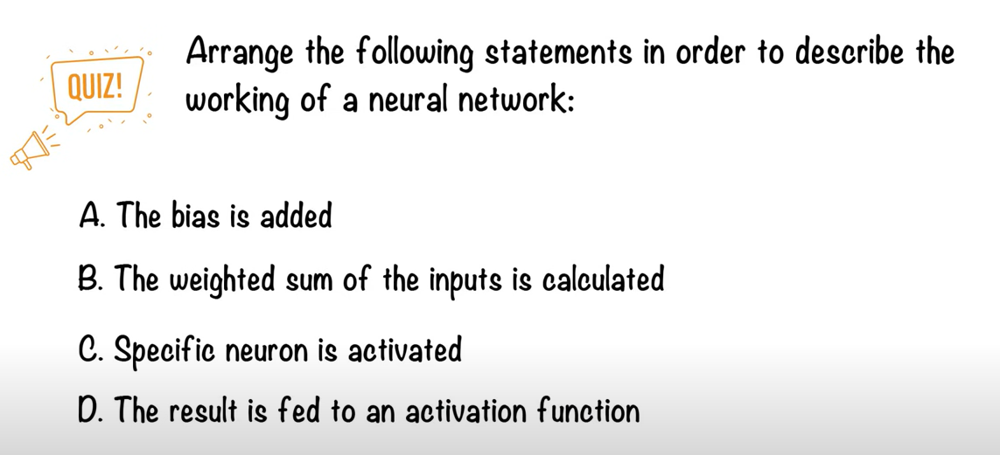
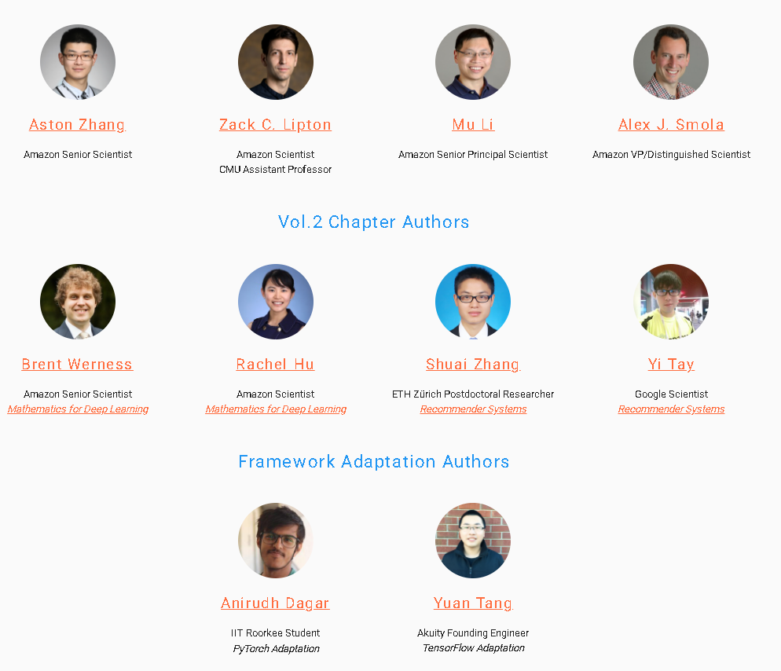
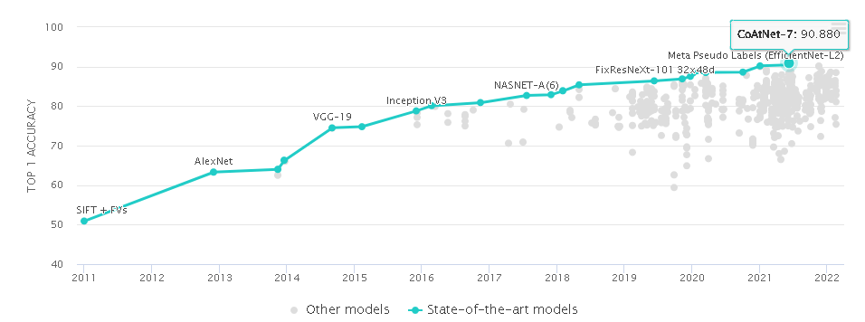
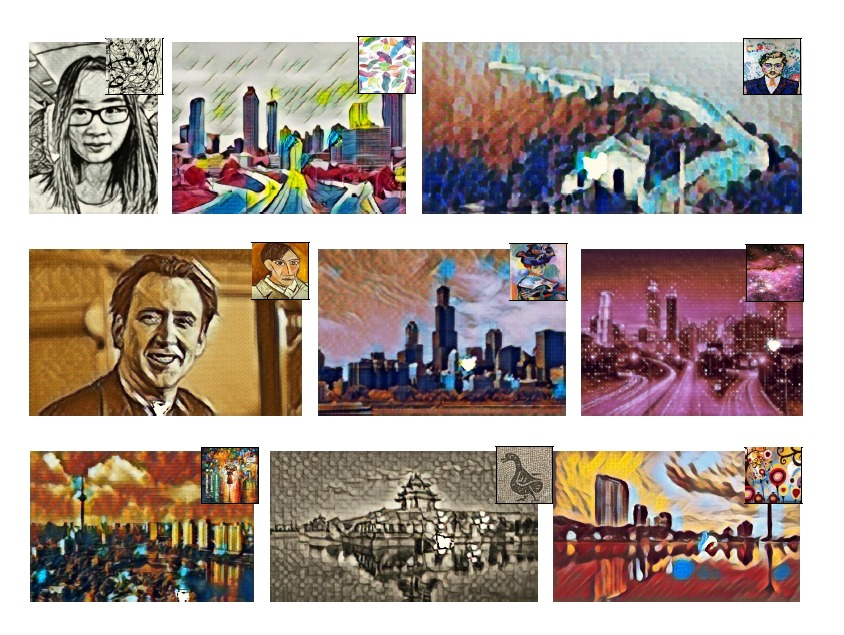
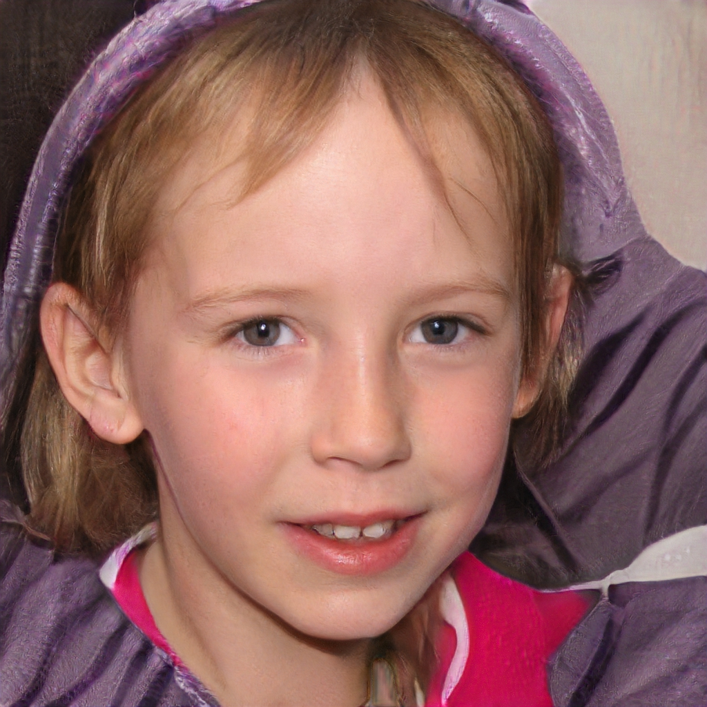
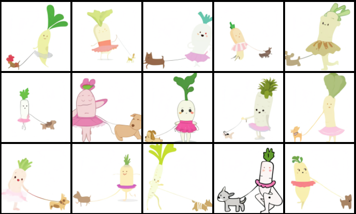
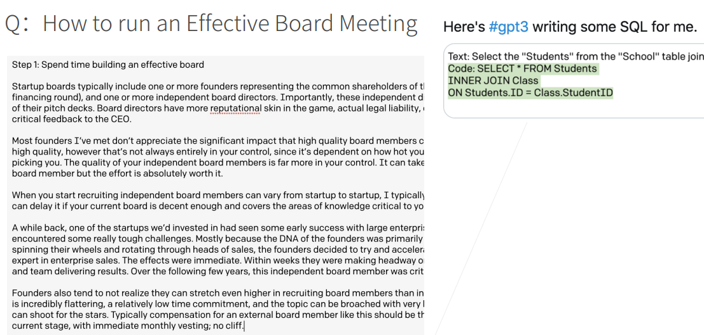
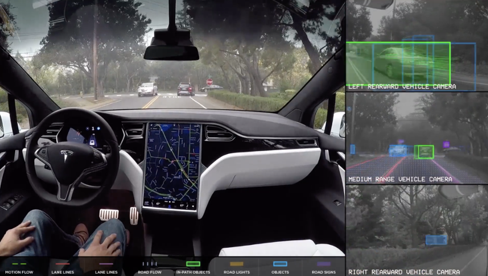
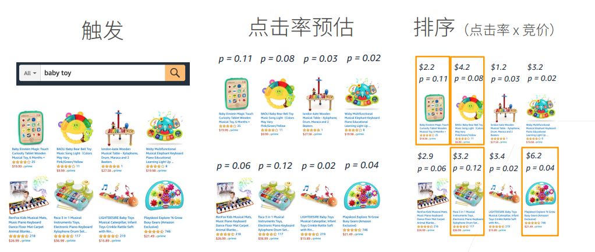
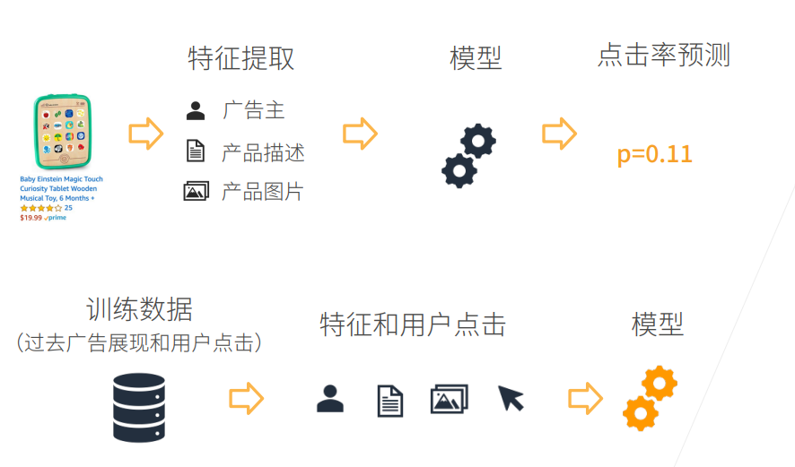

# Week 1

We will dive into deep learning.  

## What's Deep Learning?

Deep learning is a subset of machine learning (ML), which is itself a subset of artificial intelligence (AI). 

- AI:  A technique which enables machines to mimic human behavior.
- ML: Use statistical methods to enable machines to improve with experience.
- DL: Make the computation of multi-layer neural network feasible. 

see [Deep Learning In 5 Minutes](https://www.youtube.com/watch?v=6M5VXKLf4D4).

### Quiz 

Answer: BADC

After the course, you will know how to build some deep learning models to solve the practical tasks.  

## Source

The course was derived from the online course http://d2l.ai/.  The curriculum related book is http://d2l.ai/chapter_preface/index.html. 

- **Interactive** deep learning book with code, math, and discussions
- Implemented with **NumPy/MXNet**, **PyTorch**, and **TensorFlow**
- Adopted at 300 universities from 55 countries

### Authors

## What Deep Learning can Do?

### Image Classification: ImageNet

**ImageNet** is an image database organized according to the [WordNet](http://wordnet.princeton.edu/) hierarchy (currently only the nouns), in which each node of the hierarchy is depicted by hundreds and thousands of images. 

- Before ImageNet,  most of AI experts thought a better algorithm would make better decisions, regardless of the data. 

  The purpose of ImageNet is to  build a better dataset. More data, better quality. 

- After ImageNet, they accepted that the best algorithm wouldn’t work well if the data didn’t reflect the real world.

https://qz.com/1034972/the-data-that-changed-the-direction-of-ai-research-and-possibly-the-world/

#### ImageNet  - Benchmark

https://paperswithcode.com/sota/image-classification-on-imagenet

### 物体监测和分割

https://github.com/matterport/Mask_RCNN

### 样式迁移

https://github.com/StacyYang/MXNet-Gluon-Style-Transfer

### 人脸合成

Do you know which face is real?

https://www.whichfaceisreal.com/results.php?r=0&p=1&i1=15824.jpeg&i2=image-2019-02-18_223335.jpeg

### 文字生成图片

a baby daikon radish in a tutu walking a dog

https://openai.com/blog/dall-e/

### 文字生成

### 无人驾驶

### 案例研究 - 广告点击

### 预测与训练

## Installation

