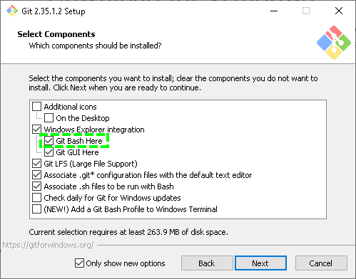
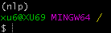

# Week 1: Python Fundamental

## Python - Most Popular Language

###  [TIOBE Index](https://www.tiobe.com/tiobe-index/)

In June last year, I said that Python would be the **most popular language** in the future. Now, it is.

---

### [Stack Overflow Trends](https://insights.stackoverflow.com/trends?tags=python%2Cjavascript%2Cjava%2Cc%23%2Cphp%2Cc%2B%2B&utm_source=so-owned&utm_medium=blog&utm_campaign=gen-blog&utm_content=blog-link&utm_term=incredible-growth-python&_ga=2.29031547.671743710.1623737614-727023010.1623737614)

## Installation

### Install Git

1. open https://git-scm.com/download/win, choose **[64-bit Git for Windows Setup](https://github.com/git-for-windows/git/releases/download/v2.35.1.windows.2/Git-2.35.1.2-64-bit.exe)** to download. 

2. execute the install file. make sure "Git Bash Here" is checked, then install as default.

3. type `Git Bash` in Windows start menu.

   

4. open Git Bash.  It will open a command window as below.

   

    check the current folder via `pwd`.
   
   

### Install Miniconda

1. Open https://conda.io/en/latest/miniconda.html, Let's choose the version of Python 3.8.

2. choose [Miniconda3 Windows 64-bit](https://repo.anaconda.com/miniconda/Miniconda3-py38_4.11.0-Windows-x86_64.exe) to download.

3. install with the default options.

4. open "Git Bash" in Windows Start.

2. run the following script in "Git Bash".

   ~~~shell
   echo ". ~/Miniconda3/etc/profile.d/conda.sh" >> ~/.bashrc
   ~~~

3. close and reopen "Git Bash". 

4. type `conda` and you will see the command usage description as below.

   

    type `python version` to check python version.
   
   

### Install Python Virtual Environment

1. create the python virtual environment.

   ~~~shell
   #remove python virtual environment if it exists
   conda env remove -n nlp       
   #create python virtual environment 
   conda create -y -n nlp python=3.8
   # check environment list
   conda env list          
   ~~~

2. active the environment.

   ~~~shell
   # active the virtual environment
   conda activate nlp
   ~~~

   

    If  "(nlp)" is found before the command line, it means that the virtual environment is active.  If you install any packages, they only are installed in "nlp", not the default python environment. So **make sure it is active before you run codes each time **. 

## Install 

# Week 2: Data Manipulation

Data manipulation is really the foundation of what you'll do as a data scientist.