## 0.1 概率论

### 均值和方差

离散分布的均值和方差计算公式如下：
$$
\mu=\sum[xP(x)] \\
\sigma^2=\sum[(x-\mu)^2P(x)]
$$
一般认为$x$是等概率发生的，所以$P(x)=\frac 1 n$。

### 二项分布

- 概率密度函数

$$
P(X=r) = {n \choose r} p^r (1-p)^{n-r}
$$

- 均值： $\mu = np$
- 方差：$\sigma^2 = np(1-p)$
- 概率密度图：

    ~~~R
    library(dplyr)
    library(ggplot2)
    bnd <- function(n, p=0.5) {
        x <- seq(0, n)
        prob <- dbinom(x, n, p)
        df <- data.frame(x=x, prob=prob, n=n)
        return(df)
    }

    df <- plyr::mdply(data.frame(n=seq(10,30, 5)), bnd)
    df %>% ggplot(aes(x, prob, group=n, color=factor(n))) +
      geom_point(shape=1) + geom_line()
    ~~~

    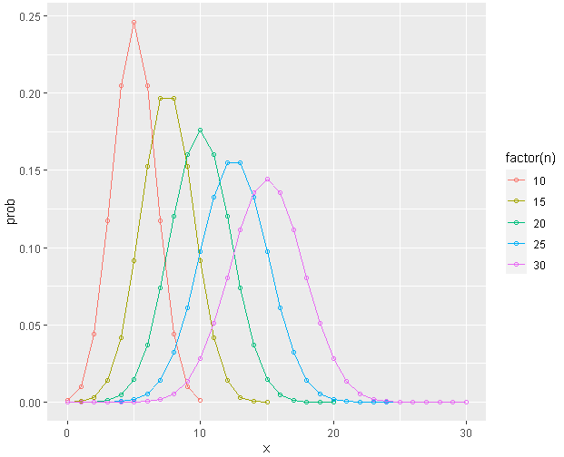

### 泊松分布

用于描述单位时间或空间里随机事件发生的次数，参数 $\lambda$ 表示单位时间或空间里某事件平均发生的次数。

泊松分布是二项分布n很大而p很小时的一种极限形式，详细的推导见[泊松分布的现实意义是什么，为什么现实生活多数服从于泊松分布？](https://www.zhihu.com/question/26441147)或[Poisson分布是二项式分布的极限形式](http://episte.math.ntu.edu.tw/articles/sm/sm_16_07_1/),。泊松分布基本原理是，把一个单位时间切分成$n$份，设$\frac 1 n$时间段内，发生事情的概率是$p$，然后就可以用二项分布去计算事情发生的概率，经过简化后就是泊松分布。

- 概率密度函数。

$$
P(X=k) = \frac{e^{-\lambda}\lambda^k}{k!}
$$
- 均值： $\mu = \lambda$

- 方差：$\sigma^2 = \lambda$

- 概率密度图：Poisson分布是右偏分布，均值越大时，其对称性越好：

  ~~~R
  library(dplyr)
  library(ggplot2)
  pd <- function(x=100, lambda) {
      x <- seq(0, x)
      prob <- dpois(x, lambda)
      df <- data.frame(x=x, prob=prob, lambda=lambda)
      return(df)
  }
  p.df <- plyr::mdply(data.frame(lambda=seq(10,60, 10)), pd)
p.df %>% ggplot(aes(x, prob, group=lambda, color=factor(lambda)))+geom_point(shape=1)+geom_line()+facet_wrap(~lambda)+theme(legend.position="none")
  ~~~
  
  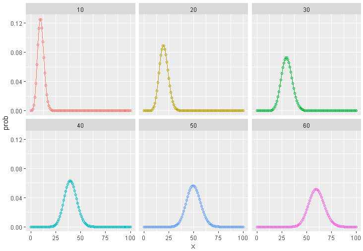

- 泊松分布的条件
  - 事件发生是小概率事件。
  - 事件发生的是相互独立的。
  - 事件发生的概率是稳定的。

### 正态分布

一元正态分布：
$$
f(x) = \frac{1}{\sqrt{2\pi\sigma^2}} e^{-\frac 1 {2\sigma^2} (x-\mu)^2}
$$
多元正态分布: 概率密度函数
$$
\left( {2 \pi} \right)^{-\frac p 2} 
|{\bf \Sigma}|^{-\frac 1 2}
\mbox{e}^{-\frac{1}{2} ({\bf x} - {\bf \mu})^{\bf T} {\bf \Sigma}^{-1} ({\bf x} - {\bf \mu}) }
$$

####  

- 概率密度图

  ~~~R
  library(dplyr)
  library(ggplot2)
  nd <- function(n=100, sd) {
      x <- seq(-9, 9, length.out = n+1)
      prob <- dnorm(x, mean=0， sd=sd)
      df <- data.frame(x=x, prob=prob, sd=sd)
      return(df)
  }
  n.df <- plyr::mdply(data.frame(sd=c(1, 1.5, 2, 2.5, 3)), nd)
  n.df  %>% ggplot(aes(x, prob, group=sd, color=factor(sd))) +
    geom_line() + scale_x_continuous(breaks=seq(-9, 9, 2))
  ~~~

  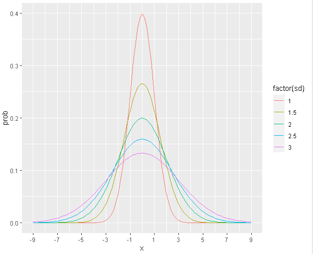

二项分布和正态分布关系

### t分布

William S. Gosset发现了t分布，它在参数估计和统计检验上，比正态分布要好，在大样本上做的和正态分布一样好，而在小样本上，比正态分布好很多。

- 概率密度图

  ~~~R
  library(dplyr)
  library(ggplot2)
  
  x <- seq(-3, 3, length=100)
  pn <- dnorm(x)
  pn.df <- data.frame(x=x, prob=pn)
  
  get.pt <- function(x, df) {
    prob <- dt(x, df=df)
    dd <- data.frame(x=x, prob=prob, df=df)
    return(dd)
  }
  para <- data.frame(x=rep(x, 4), df= rep(c(3, 5, 15, 30), each=length(x)))
  pt.df <- plyr::mdply(para, get.pt)
  pt.df %>% ggplot(aes(x, prob)) + 
    geom_line(aes(group=df, color=factor(df))) + 
    geom_line(data=pn.df)
  
  ~~~

  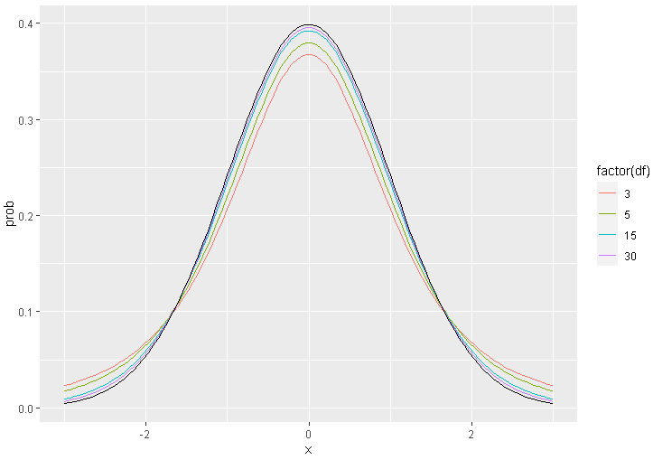

  上图中，自由度越大，t分布越接近正态分布，当n>=30，可以认为基本和正态分布(黑色曲线)相同。在大数据时代，数据量越来越大，所以在大多数情况下，使用正态分布就可以了。

### 卡方分布

k个独立的标准正态分布变量的平方和服从自由度为$k$的 $\chi^2$ 分布，卡方分布常用于假设检验和置信区间的计算。

- 概率密度图

  ~~~R
  library(dplyr)
  library(ggplot2)
  
  pc <- function(x=50, df) {
    x <- seq(0, x)
    prob <- dchisq(x, df)
    pc.df <- data.frame(x=x, prob=prob, df=df)
    return(pc.df)
  }
  pc.df <- plyr::mdply(data.frame(df=c(3,6,9,18)), pc)
  pc.df %>% ggplot(aes(x, prob, group=df, color=factor(df)))+
    geom_point(shape=1)+
    geom_line()+
    ggtitle("Chi-Square Distribution")
  
  ~~~

  

  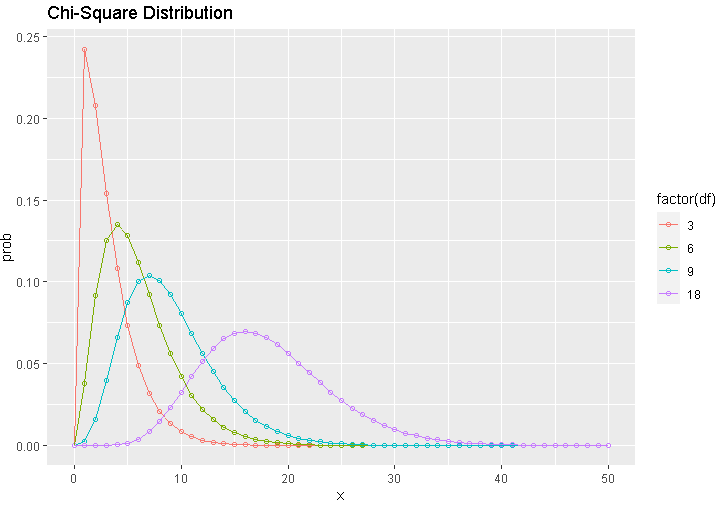

  

### F分布

- 概率密度图

  ~~~R
  library(dplyr)
  library(ggplot2)
  
  pff <- function(x=seq(0,6,0.1), df1, df2) {
    y <- df(x, df1, df2)
    pf.df <- data.frame(x=x, prob=y, df1=df1, df2=df2)
    return(pf.df)
  }
  
  pf.df <- plyr::mdply(data.frame(df1=c(3,4,10), df2=c(10, 15, 29)), pff)
  pf.df %>% 
    ggplot(aes(x, prob, group=interaction(df1,df2), color=interaction(df1, df2)))+
    geom_line()+
    geom_vline(xintercept=1, linetype="dashed") + 
    theme(legend.position=c(.8, .8))
  ~~~

  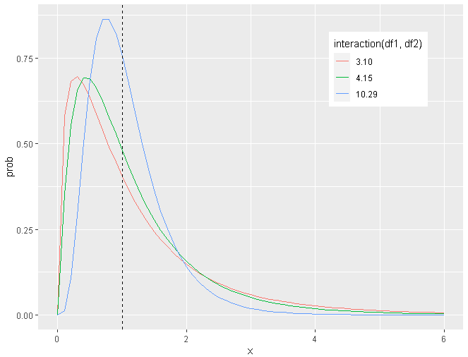

  F分布也是基于自由度，所以也是一个分布家族，它的自由度有两个，分别对应于分子项和分母项，因为F值是方差的比值，所以只有正值，函数峰在1左右（1代表两个方差是相等的），非对称分布，呈现右偏。

### 协方差矩阵

### Beta分布

### gamma分布

### 贝叶斯公式（Bayesian ）

$$
P(\theta|X) = \frac {P(X|\theta)P(\theta)} {P(X)} \\

p(\theta|X) \propto P(X|\theta)P(\theta) \\
$$

- $P(\theta)$：先验概率（prior probability），指根据以往经验和分析得到的概率。 

- $P(\theta|X)$：后验概率（posterior probability）

- $P(X|\theta)P(\theta)$：似然函数（likelihood function）

$$
  posterior \propto likelihood \times prior
$$

### KS检验

全称Kolmogorov-Smirnov检验，也称D检验。检验单一样本是否来自某一特定分布。比如检验一组数据是否为正态分布。它的检验方法是以样本数据的累积频数分布与特定理论分布比较，若两者间的差距很小，则推论该样本取自某特定分布族。

~~~R
set.seed(2020)
n <- 100
# 实际分布
y1 <- rchisq(n, df=10)
y2 <- rnorm(n, mean=10, sd=5)

ks.test(y1，"pnorm", mean=mean(y1), sd=sd(y1))
ks.test(y2，"pnorm", mean=mean(y2), sd=sd(y2))
~~~

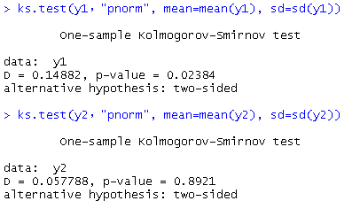

很明显y1的p_value<0.05,  拒绝原假设（也就是不认为y1是正态分布）

#### 原理

目前还是不清楚

### Shapiro-Wilk检验

也称W检验。

~~~
set.seed(2020)
n <- 100
# 实际分布
y1 <- rchisq(n, df=10)
y2 <- rnorm(n, mean=10, sd=5)

shapiro.test(y1)
shapiro.test(y2)
~~~

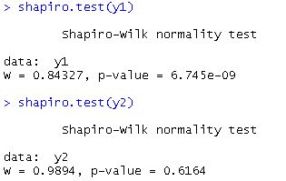

很明显y1的p_value<0.05,  拒绝原假设（也就是不认为y1是正态分布）

### D检验 vs . W检验

两个检验是常用的正态分布检验方法，下面是一般的选择规则。

- SAS
  - 样本含量n ≤2000 时，Shapiro - Wilk 检验为准
  - 样本含量n >2000 时，Kolmogorov-Smirnov 检验为准
- SPSS
  - 样本含量3≤n ≤5000 时，Shapiro - Wilk 检验为准
  - 样本含量n >5000 时，Kolmogorov-Smirnov 检验为准

> R语言中，Shapiro - Wilk 检验的样本数量是3≤n ≤5000，超过会报错

### QQ图

统计分布的检验有很多种，例如KS检验、卡方检验等，从图形的角度来说，可以用QQ图（Quantile-Quantile Plots）来检查数据是否服从某种分布。QQ图的原理：如果一批数据$x_1, x_2, . . . , x_n $服从某种理论分布，那么将排序后的数据$x_1^{'}, x_2^{'}, . . . , x_n^{'}$和理论分布的分位数$\frac {0.5} {n}, \frac {1.5} {n}, . . . , \frac {n-0.5} {n} $对应值来画散点图，得到的$n$个点应该大致排列在对角线上，因为这两批数字应该大致相等。

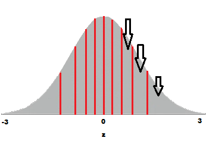

#### 例子：符合正态分布

~~~R
set.seed(2020)
y <- rnorm(100, mean=10, sd=5)
qqnorm(y)
qqline(y, col=2, lwd=2)
~~~

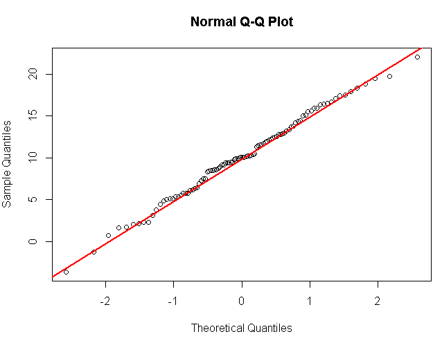

上图中红色线是qqline，是25，75分位点的连线。

> 对于正态分布来说，y轴截距是对应的是均值，而直线的斜率是方差。QQ图的最大优势是直观，而其它的检验方法大多给出的是抽象的数字。

#### 例子： 不符合正态分布
下面这个例子中，分布不是正态分布。

~~~R
set.seed(2020)
n <- 100
y <- rchisq(n, df=10)
qqnorm(y)
qqline(y, col=2, lwd=2)

# 理论分布
x <- qnorm((1:n-0.5)/(n))

probs <- c（0.25，0.75)
qy <- quantile(y, probs=probs)	# 实际25，75分位点
qx <- qnorm(probs)				# 理论25，75分位点

slope <- diff(qy)/diff(qx)  # 斜率（表示方差）
int <- qy[1]-slope*qx[1]  	# y轴截距（表示均值）
abline(int, slope, col="blue", lwd=2， lty=2)   ## draw the line
points(x, sort(y), type="p", pch=2, col="blue")	
~~~

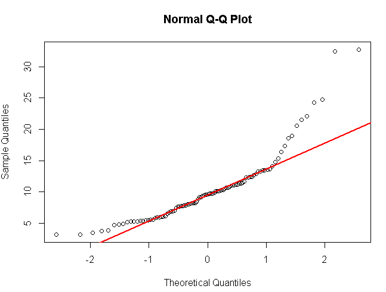

上图中，很明显散点图不在一条直线上。

#### 重现QQ图

下面手工方法重画QQ图。

~~~R
set.seed(2020)
n <- 100
# 实际分布
y <- sort(rchisq(n, df=10))
qqnorm(y)
qqline(y, col=2, lwd=2)

# 理论分布
x <- qnorm((1:n-0.5)/(n))

probs <- c（0.25，0.75)R
qy <- quantile(y, probs=probs)
qx <- qnorm(probs)

slope <- diff(qy)/diff(qx)  # 斜率（表示方差）
int <- qy[1]-slope*qx[1]  	# y轴截距（表示均值）
# 重画qqline
abline(int, slope, col="blue", lwd=2， lty=2)   ## draw the line
# 重画qqnorm
points(x, y, type="p", pch=2, col="blue")	
~~~

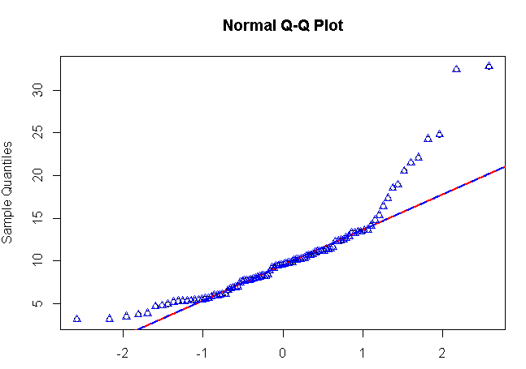

上图中，可以清晰看到，调用qqnorm，qqline生成的图和手工生成的图完美重合。

### Box-Cox变换

Box-Cox变换是Box和Cox在1964年提出的一种广义幂变换方法，是统计建模中常用的一种数据变换，用于连续的响应变量不满足正态分布的情况。Box-Cox变换之后，可以一定程度上减小不可观测的误差和预测变量的相关性。原来的描述，参见[数据变换的万能钥匙：Box-Cox变换](https://www.sohu.com/a/137884507_278472)， [数据骚操作（二）：偏度和Box Cox转换](https://zhuanlan.zhihu.com/p/53288624)。公式如下
$$
y(\lambda)=
\left\{
\begin{aligned}
 & \frac { y^{\lambda}-1} \lambda ,  & \lambda \neq 0 \\
& ln(y) ,    &  \lambda = 0 \\
\end{aligned}
\right.
$$

Box-Cox基本的原理是，遍历不同的$\lambda$值，获得新的分布，假设新的分布符合正态分布（计算均值和方差获取方程），计算每个数据点的概率，然后计算所有样本的概率（即似然函数值），其中最大似然值所在的$\lambda $就是返回的值。

~~~R
library(MASS)

set.seed(2020)
n <- 100
y <- sort(rchisq(n, df=10))

# 如下的验证结果表明y并不符合正态分布
shapiro.test(y)
qqnorm(y)
qqline(y, col=2, lwd=2)

~~~

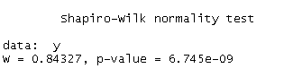

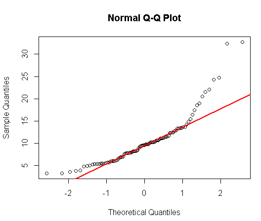

上面的结果表明，y并不是正态分布。

~~~R
# box-cox变换
result = boxcox(y~1, lambda = seq(-2, 2, 1/10))
lambda = result$x[which.max(result$y)]
lambda
y1 = (y^lambda-1)/lambda

shapiro.test(y1)
qqnorm(y1)
qqline(y1, col=2, lwd=2)
~~~

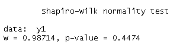

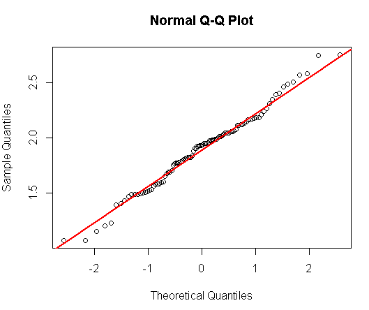

经过Box-Cox变换，可以认为数据基本符合正态分布了。

## 习题

参见 [question](https://github.com/xuxiangwen/ai/blob/master/question.md) 1, 2

## 参考

- [统计检验基础](https://guangchuangyu.github.io/statistics_notes/section-4.html)
- [R语言做正态分布检验](https://www.douban.com/note/627827796/?type=rec)

