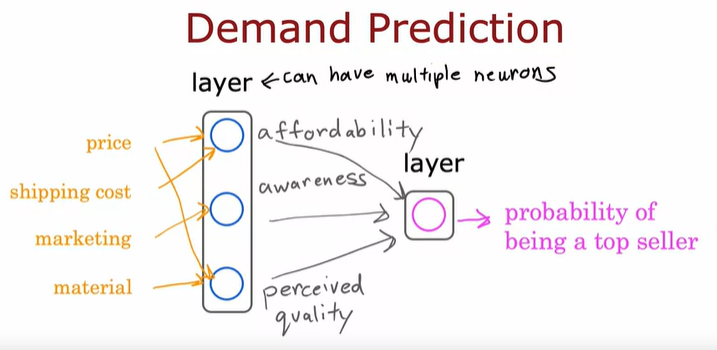

# [Advanced Learning Algorithms](https://www.coursera.org/learn/advanced-learning-algorithms?specialization=machine-learning-introduction)

课程论坛：https://community.deeplearning.ai/c/mls/mls-course-2/269

## Week1: Neural Networks

### Neurons networks intuition

起源于: Algorithms that try to mimic the brain. 

目前为止，我们仍然没有发现大脑实际上是如何工作的，客观的说，计算机科学家们仅仅从生物学神经元的工作方式获得了灵感而已。

在大数据的时代，机器学习也快速步入深度学习的时代。深度学习是大型的神经网络系统，数据越大，它的性能越好。

可以把神经网络中各个神经元，看成是最终目标某个方面的特征，如下图所示，每个神经元对于原始数据进行加工处理，返回某一个方面的特征。

- affordability（支付能力）
- awareness（认知）
- perceived（感知到的） quality

而深度学习往往拥有多个层次，每个层次都是对其前一层次的总结和抽象的表达。

以Face Recognition为例。

再看一个Car classification，可以看到第一个hidden layer也是线的组合，和Face Recognition非常类似，这告诉我们Face recognition的某些层次，可以用于Car classification，这也就是Transfer Learning的理论基础。

### Neural network model

