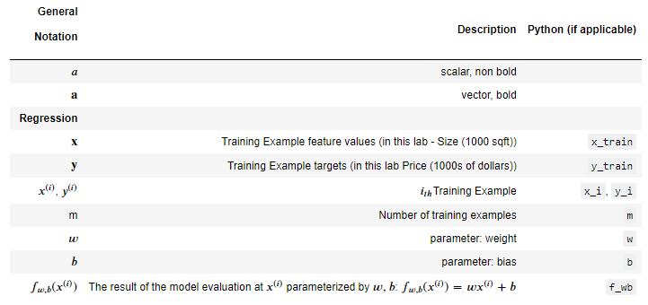
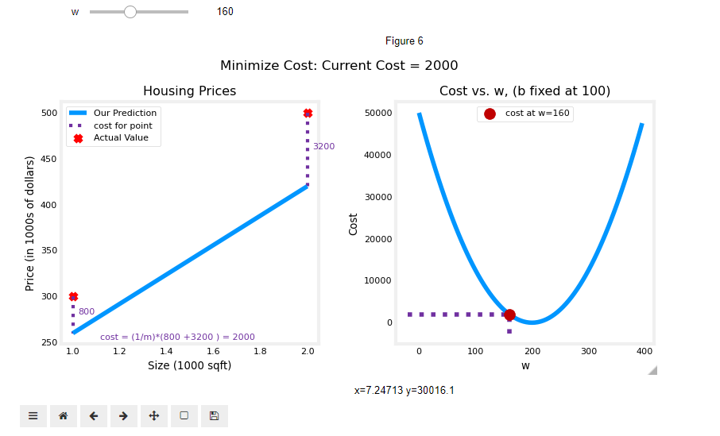
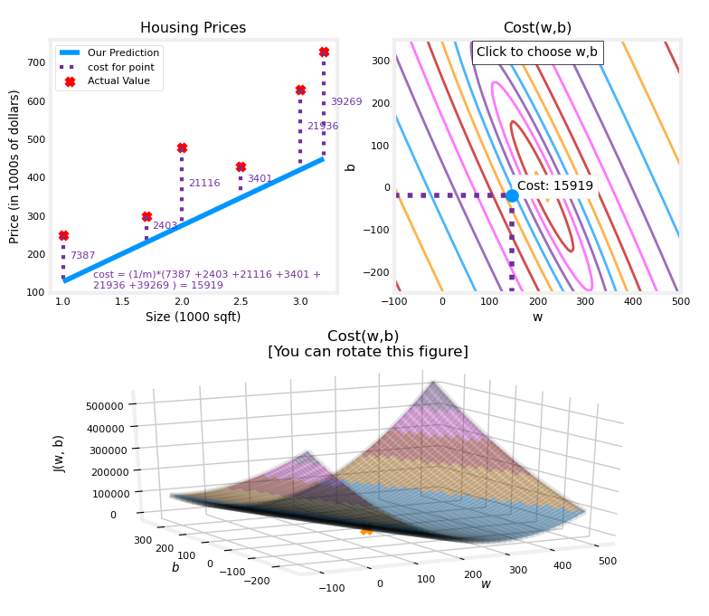
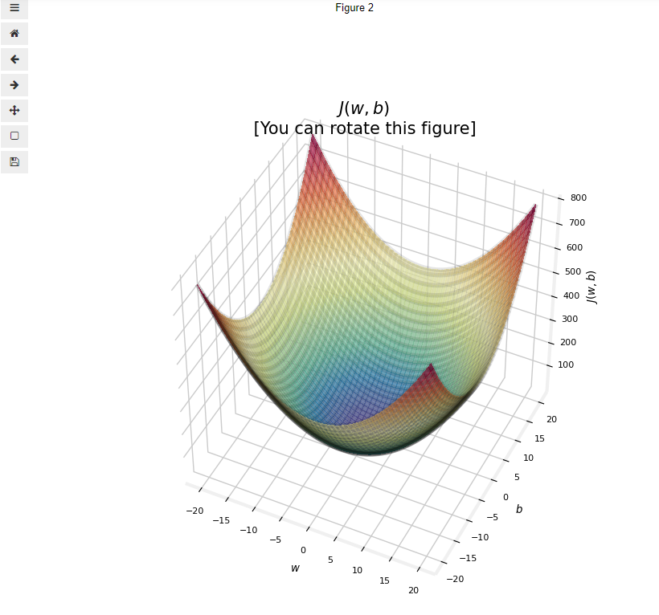

# [Supervised Machine Learning: Regression and Classification](https://www.coursera.org/learn/machine-learning?specialization=machine-learning-introduction)

- 课程论坛： https://community.deeplearning.ai/c/mls/mls-course-1/274

## Week 1: Introduction to Machine Learning

###  What's Machine Learning

[Arthur Samuel](https://en.wikipedia.org/wiki/Arthur_Samuel) (1959): The field of study that gives computers the ability to learn without being explicitly programmed.

[Tom M. Mitchell](https://en.wikipedia.org/wiki/Tom_M._Mitchell) (1998) : A computer program is said to learn from experience *E* with respect to some class of tasks *T* and performance measure *P* if its performance at tasks in *T*, as measured by *P*,  improves with experience *E*.  

Tom M. Mitchell的定义，更加的正式，被大多数人接受。

**例子**

垃圾邮件分类器

E = 查看已经大量已标记为垃圾和非垃圾邮件

T = 判定一封邮件是否垃圾邮件

P = 预测的准确率

#### **Machine Learning 类型**

所有的机器学习问题，可以分成：

- 监督学习（Supervised learning）：训练数据的样本包含输⼊向量以及对应的⽬标向量的应⽤。

  Learns from being given "right answers".

  

  - 回归（regression）
    - Predict a number, infinitely many possible outputs
    
    
    
  - 分类（classification）
    - Predict categories, small number of possible outputs
    
    

    
    
    发现决策边界（Boundary）。
    
    

- 无监督学习（Unsupervised learning）：训练数据由⼀组输⼊向量x组成，没有任何对应的⽬标值。

  Data comes only with inputs x but not output labels y, and the algorithm has to find some structure or some pattern or something interesting in the data.

  

  

  

  比如：
  - Organize computing clusters

  - Social network analysis

  - Market segmentation

    

  

  在实际项目中，由于数据标记的工作量和难度较大，很多的时候还是需要采用无监督的方法来进行学习。

- Recommender systems

- 强化学习（reinforcement learning）：关注的问题是在给定的条件下，找到合适的动作，使得奖励达到最⼤值。

### Jupyter Notebooks

 [C1_W1_Lab01_Python_Jupyter_Soln.ipynb](notebooks\week_1\C1_W1_Lab01_Python_Jupyter_Soln.ipynb) 

### Regression Model

 [C1_W1_Lab02_Model_Representation_Soln.ipynb](notebooks\week_1\C1_W1_Lab02_Model_Representation_Soln.ipynb) 

创建简单的线性回归模型。

 [C1_W1_Lab03_Cost_function_Soln.ipynb](notebooks\week_1\C1_W1_Lab03_Cost_function_Soln.ipynb) 

计算损失函数，可视化损失函数。

#### 动态显示Cost函数（单变量）

~~~python
plt_intuition(x_train,y_train)
~~~

上图可以上动态调节参数，非常不错。

~~~python
def plt_intuition(x_train, y_train):

    w_range = np.array([200-200,200+200])
    tmp_b = 100

    w_array = np.arange(*w_range, 5)
    cost = np.zeros_like(w_array)
    for i in range(len(w_array)):
        tmp_w = w_array[i]
        cost[i] = compute_cost(x_train, y_train, tmp_w, tmp_b)

    @interact(w=(*w_range,10),continuous_update=False)
    def func( w=150):
        f_wb = np.dot(x_train, w) + tmp_b

        fig, ax = plt.subplots(1, 2, constrained_layout=True, figsize=(8,4))
        fig.canvas.toolbar_position = 'bottom'

        mk_cost_lines(x_train, y_train, w, tmp_b, ax[0])
        plt_house_x(x_train, y_train, f_wb=f_wb, ax=ax[0])

        ax[1].plot(w_array, cost)
        cur_cost = compute_cost(x_train, y_train, w, tmp_b)
        ax[1].scatter(w,cur_cost, s=100, color=dldarkred, zorder= 10, label= f"cost at w={w}")
        ax[1].hlines(cur_cost, ax[1].get_xlim()[0],w, lw=4, color=dlpurple, ls='dotted')
        ax[1].vlines(w, ax[1].get_ylim()[0],cur_cost, lw=4, color=dlpurple, ls='dotted')
        ax[1].set_title("Cost vs. w, (b fixed at 100)")
        ax[1].set_ylabel('Cost')
        ax[1].set_xlabel('w')
        ax[1].legend(loc='upper center')
        fig.suptitle(f"Minimize Cost: Current Cost = {cur_cost:0.0f}", fontsize=12)
        plt.show()
~~~

interact的用法参见[Jupyterlab + Ipywidgets，打造交互式分析平台](https://zhuanlan.zhihu.com/p/263411257)。

#### 动态显示Cost函数（双变量）

~~~python
plt.close('all') 
fig, ax, dyn_items = plt_stationary(x_train, y_train)
updater = plt_update_onclick(fig, ax, x_train, y_train, dyn_items)
~~~

#### 显示Cost函数3D图

~~~python
soup_bowl()
~~~

### Gradient Descent

Andrew Ng讲的太好了，他能够边讲边画边讲，太厉害了 

[C1_W1_Lab04_Gradient_Descent_Soln.ipynb](notebooks\week_1\C1_W1_Lab04_Gradient_Descent_Soln.ipynb) 
