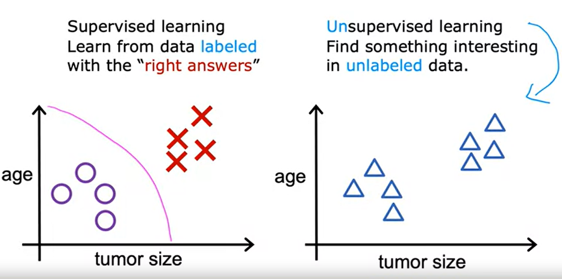

# [Supervised Machine Learning: Regression and Classification](https://www.coursera.org/learn/machine-learning?specialization=machine-learning-introduction)

- 课程论坛： https://community.deeplearning.ai/c/mls/mls-course-1/274

## Week 1: Introduction to Machine Learning

###  What's Machine Learning

[Arthur Samuel](https://en.wikipedia.org/wiki/Arthur_Samuel) (1959): The field of study that gives computers the ability to learn without being explicitly programmed.

[Tom M. Mitchell](https://en.wikipedia.org/wiki/Tom_M._Mitchell) (1998) : A computer program is said to learn from experience *E* with respect to some class of tasks *T* and performance measure *P* if its performance at tasks in *T*, as measured by *P*,  improves with experience *E*.  

Tom M. Mitchell的定义，更加的正式，被大多数人接受。

**例子**

垃圾邮件分类器

E = 查看已经大量已标记为垃圾和非垃圾邮件

T = 判定一封邮件是否垃圾邮件

P = 预测的准确率

#### **Machine Learning 类型**

所有的机器学习问题，可以分成：

- 监督学习（Supervised learning）：训练数据的样本包含输⼊向量以及对应的⽬标向量的应⽤。

  Learns from being given "right answers".

  

  - 回归（regression）
    - Predict a number, infinitely many possible outputs
    
    
    
  - 分类（classification）
    - Predict categories, small number of possible outputs
    
    

    
    
    发现决策边界（Boundary）。
    
    

- 无监督学习（Unsupervised learning）：训练数据由⼀组输⼊向量x组成，没有任何对应的⽬标值。

  Data comes only with inputs x but not output labels y, and the algorithm has to find some structure or some pattern or something interesting in the data.

  

  

  

  比如：
  - Organize computing clusters

  - Social network analysis

  - Market segmentation

    

  

  在实际项目中，由于数据标记的工作量和难度较大，很多的时候还是需要采用无监督的方法来进行学习。

- Recommender systems

- 强化学习（reinforcement learning）：关注的问题是在给定的条件下，找到合适的动作，使得奖励达到最⼤值。

### Jupyter Notebooks

