# 0.2 线性代数

国内教科书中的线性代数（linear algebra），非常严谨，但过于抽象。为了更好的理解，将从两个方面来解释线性代数的各种内容。

- 从几何角度出发，更加形象的解释，重点是机器学习中用到的那些。
- python代码的展现。

在初等数学中，关注的是数，需要求解的是一个或几个变量，而线性代数其运算单元从数变成了向量，求解的变量是向量，或者多个向量（矩阵）。

## 向量

 向量（vector）是线性代数中的基本概念，也是机器学习的基础数据表示形式。 v

$$
\mathbf{a} = \begin{bmatrix}a_1 \\ a_2 \\ \vdots \\ a_n\end{bmatrix}
$$

向量可以看成是$n$维空间中一个点的坐标，比如，下图中，向量$\begin{bmatrix}2 \\ 1\end{bmatrix}$可以表示为a的坐标。

 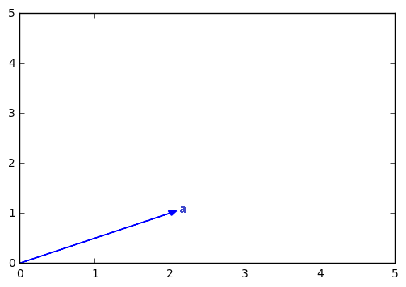 

图中，很容易看出，向量既有大小（长度）也有方向。

附[代码](https://nbviewer.jupyter.org/github/xuxiangwen/xuxiangwen.github.io/blob/master/_notes/05-ai/50-my-course/machine_learning/c0002.ipynb#创建向量)。

### 向量加法

把向量看成一个点的坐标，很容易得到向量的加法规则。

$$
\mathbf{a} + \mathbf{b} = \mathbf{c}
$$

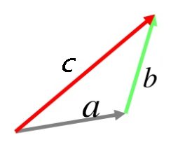

附[代码](https://nbviewer.jupyter.org/github/xuxiangwen/xuxiangwen.github.io/blob/master/_notes/05-ai/50-my-course/machine_learning/c0002.ipynb#向量加法)。

### 向量大小

 向量的大小也叫向量的模，公式如下。

$$
\| \mathbf{a} \| = 
\sqrt{a_{1}^{2} + a_{2}^{2} + \ldots + a_{n}^{2}}
$$

附[代码](https://nbviewer.jupyter.org/github/xuxiangwen/xuxiangwen.github.io/blob/master/_notes/05-ai/50-my-course/machine_learning/c0002.ipynb#向量大小)。

### 向量转置

向量的默认形式是以一列排列的，称之为**列向量**，如果对列向量进行转置，就变成了**行向量**。

$$
\mathbf{a^T} = \begin{bmatrix}a_1 & a_2 & \ldots  & a_n\end{bmatrix}
$$

$\mathbf {a^T}$表示$\mathbf a$的转置，是一个行向量。

附[代码](https://nbviewer.jupyter.org/github/xuxiangwen/xuxiangwen.github.io/blob/master/_notes/05-ai/50-my-course/machine_learning/c0002.ipynb#向量转置)。

## 矩阵

在数学中，矩阵（[Matrix](https://baike.baidu.com/item/Matrix/3543921)）是一个按照长方阵列排列的复数或实数集合。

矩阵的表示如下：

$$
\mathbf A = 
\begin{bmatrix} 
a_{11} & a_{12} & \cdots & a_{1n} \\
a_{21} & a_{22} & \cdots & a_{2n}  \\ 
\vdots & \vdots  & \ddots & \vdots \\
a_{m1} & a_{m2} & \cdots & a_{mn} 
\end{bmatrix}
$$

上面的$\mathbf A$为$ m  \times  n$阶矩阵，如果$m=n$，则称之为**方阵**。

矩阵可以看成行向量或者列向量的组合。比如：

$$
\mathbf A = 
\begin{bmatrix} 
a_{11} & a_{12} & \cdots & a_{1n} \\
a_{21} & a_{22} & \cdots & a_{2n}  \\ 
\vdots & \vdots  & \ddots & \vdots \\
a_{m1} & a_{m2} & \cdots & a_{mn} 
\end{bmatrix} =
\begin{bmatrix} 
\mathbf {a_1^T} \\ 
\mathbf {a_2^T} \\ \vdots \\ \mathbf {a_m^T} \end{bmatrix} =
\begin{bmatrix} \mathbf {a_1^{'}} & \mathbf a_2^{'} & \cdots & \mathbf a_p^{'} 
\end{bmatrix}
$$

其中$\mathbf {a_i^T} = \begin{bmatrix} 
a_{i1} & a_{i2} & \cdots & a_{in} \end{bmatrix}，\mathbf {a_j^{'}} = \begin{bmatrix} 
a_{1j} \\  a_{2j} \\ \cdots \\  a_{mj} \end{bmatrix}$

这样的表示方法更加的简洁，而且在做矩阵相关计算和推导时会非常的方便。

### 矩阵加法

假设$\mathbf A$ 是$m\times n$阶矩阵，$\mathbf B$也是$m \times n $阶矩阵，则

$$
\mathbf A + \mathbf B = \begin{bmatrix}c_{11} & c_{12} & \cdots & c_{1n} \\c_{21} & c_{22} & \cdots & c_{2n} \\\vdots & \vdots & \ddots  & \vdots \\ c_{m1} & c_{m2} & \cdots & c_{mn} \\\end{bmatrix}
$$

其中$c_{ij} = a_{ij} + b_{ij} $，也就是两个矩阵中相同位置的数分别相加，其结果也是$m \times n $阶矩阵。

附[代码](https://nbviewer.jupyter.org/github/xuxiangwen/xuxiangwen.github.io/blob/master/_notes/05-ai/50-my-course/machine_learning/c0002.ipynb#矩阵加法)。

### 矩阵乘法

英文称Matmul Product。当$\mathbf A$ 是$m\times n$矩阵，$\mathbf B$是$n\times p$阶矩阵，它们的乘积$\mathbf A \cdot \mathbf B$是一个$m\times p$阶矩阵 。矩阵的乘法仅当第一个矩阵$\mathbf A $的列数和另一个矩阵$\mathbf B$的行数相等时才能进行。矩阵乘法计算规则是：乘积矩阵中的每个元素等于$\mathbf A$的每一行，乘以$\mathbf B$的每一列，然后相加汇总。

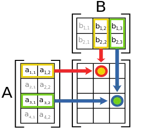

公式如下：

$$
\mathbf A \cdot \mathbf B = \begin{bmatrix}
c_{11} & c_{12} & \cdots & c_{1p} \\
c_{21} & c_{22} & \cdots & c_{2p} \\
\vdots & \vdots & \ddots  & \vdots \\ 
c_{m1} & c_{m2} & \cdots & c_{mp} \\
\end{bmatrix}
$$

其中 $ c_{ij}=  \sum_{k=0}^{n} a_{ik}b_{kj} $

示例如下：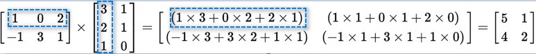 

> 由于矩阵乘法的普遍性，一般用 $\mathbf A  \mathbf B$表示  $\mathbf A \cdot \mathbf B$

 附[代码](https://nbviewer.jupyter.org/github/xuxiangwen/xuxiangwen.github.io/blob/master/_notes/05-ai/50-my-course/machine_learning/c0002.ipynb#矩阵乘法)。

**哈达玛积**

还有一种非常普遍，而且简单的矩阵相乘，称之为哈达玛积（Hadamard product）。

假设$\mathbf A$ 是$m\times n$阶矩阵，$\mathbf B$也是$m \times n $阶矩阵，则

$$
\mathbf A \circ  \mathbf B = \begin{bmatrix}
c_{11} & c_{12} & \cdots & c_{1n} \\
c_{21} & c_{22} & \cdots & c_{2n} \\
\vdots & \vdots & \ddots  & \vdots \\ 
c_{m1} & c_{m2} & \cdots & c_{mn} \\
\end{bmatrix}
$$

其中$c_{ij} = a_{ij} b_{ij}$，也就是两个矩阵中相同位置的数分别相乘，其结果也是$m \times n $阶矩阵。

> 在大多数程序框架（numpy， pytorch等）中，都乘法符号`*`来表示哈达玛积，而矩阵乘法反而用其它符号或函数（比如，matmul， dot等）来表示。而这些框架之所以这样定义，或许因为哈达玛积和矩阵加法的机制完全相同（除了一个是乘，一个是加），更加符合大多数人的直觉。

 附[代码](https://nbviewer.jupyter.org/github/xuxiangwen/xuxiangwen.github.io/blob/master/_notes/05-ai/50-my-course/machine_learning/c0002.ipynb#哈达玛积)。

### Broadcasting

矩阵加法和哈达玛积都要求矩阵的行和列的阶数完全相同，但如果不同，能否进行计算呢？答案是可以，但是需要满足一些条件，这种方式叫做Broadcasting。以加法为例。

 如果$\mathbf A$ 是$m\times n$阶矩阵，$\mathbf B$也是$1 \times  n$阶矩阵，可以得到，

$$
\mathbf A + \mathbf B = \begin{bmatrix}
a_{11} + b_{11} & c_{12}+ b_{12}& \cdots & c_{1n} + b_{1n} \\
a_{21} + b_{11} & c_{22}+ b_{12}& \cdots & c_{2n} + b_{1n} \\
\vdots & \vdots & \ddots  & \vdots \\ 
a_{m1} + b_{11} & c_{m2}+ b_{12}& \cdots & c_{mn} + b_{1n} \\
\end{bmatrix}
$$

即下图所示：

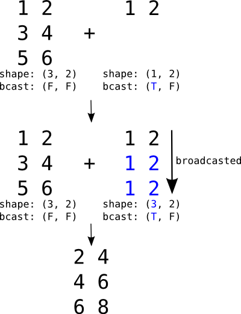

同理，假设$\mathbf A$ 是$m\times n$阶矩阵，$\mathbf B$也是$m \times 1 $阶矩阵，则：

$$
\mathbf A + \mathbf B = \begin{bmatrix}
a_{11} + b_{11} & c_{12}+ b_{11}& \cdots & c_{1n} + b_{11} \\
a_{21} + b_{21} & c_{22}+ b_{11}& \cdots & c_{2n} + b_{21} \\
\vdots & \vdots & \ddots  & \vdots \\ 
a_{m1} + b_{m1} & c_{m2}+ b_{m1}& \cdots & c_{mn} + b_{m1} \\
\end{bmatrix}
$$

哈达玛积也可以按照上面所说逻辑，进行Broadcasting。

附[代码](https://nbviewer.jupyter.org/github/xuxiangwen/xuxiangwen.github.io/blob/master/_notes/05-ai/50-my-course/machine_learning/c0002.ipynb#Broadcasting)。

### 矩阵转置

沿着对角线对矩阵进行反转，称之为矩阵转置，转置后的矩阵，记为$\mathbf {A^T}$。假设$\mathbf A$为$ m  \times  n$阶矩阵，$\mathbf {A^T}$是$n \times m$阶矩阵。示例如下。

$$
{
\begin{bmatrix}
1 & 2 & 4 \\
0 & -3 & 5 
\end{bmatrix}
}^{\mathbf T} = 
\begin{bmatrix}
1 & 0  \\
2 & -3  \\
4 & 5
\end{bmatrix}
$$

如果矩阵是个方阵，当$\mathbf {A^T} = \mathbf  {A} $，称之为**对称矩阵**。比如：

$$
{
\begin{bmatrix}
1 & 2 & 4 \\
2 & -3 & 5 \\
4 & 5 & 2 
\end{bmatrix}
}^{\mathbf T} = 
\begin{bmatrix}
1 & 2 & 4 \\
2 & -3 & 5 \\
4 & 5 & 2 
\end{bmatrix}
$$

附[代码](https://nbviewer.jupyter.org/github/xuxiangwen/xuxiangwen.github.io/blob/master/_notes/05-ai/50-my-course/machine_learning/c0002.ipynb#矩阵转置)。

### 矩阵意义

如果说向量代表坐标系中的一个点的坐标，那么矩阵则可以代表什么呢？如果一个矩阵乘以一个列向量（可以看成$n \times 1 $阶矩阵），会发生什么呢？

假设：

$$
\mathbf A = \begin{bmatrix} a_{11} & a_{12} & \cdots & a_{1n} \\a_{21} & a_{22} & \cdots & a_{2n}  \\ \vdots & \vdots  & \vdots & \vdots \\a_{m1} & a_{m2} & \cdots & a_{mn}  \\\end{bmatrix} = 
\begin{bmatrix} \mathbf {a_1^{'}} & \mathbf a_2^{'} & \cdots & \mathbf {a_p^{'} }
\end{bmatrix}，
\mathbf b = \begin{bmatrix} b_{1}  \\b_{2}  \\ \vdots \\b_{n}
\end{bmatrix} 
\\
$$

根据矩阵乘法可得：

$$
\mathbf A \cdot \mathbf b =
\begin{bmatrix} 
a_{11}b_1 + a_{12}b_2 + \cdots + a_{1n}b_n \\
a_{21}b_1 + a_{22}b_2 + \cdots + a_{2n}b_n \\
\vdots \\
a_{m1}b_1 + a_{m2}b_2 + \cdots + a_{mn}b_n \\
\end{bmatrix}
$$

公式右边，一列一列的看，可以找到规律：

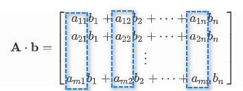

推导出：

$$
\begin{align}
\mathbf A \cdot \mathbf b &= 
\begin{bmatrix} 
a_{11} \\  a_{21} \\ \cdots \\  a_{m1} \end{bmatrix} b_1 + 
\begin{bmatrix} 
a_{12} \\  a_{22} \\ \cdots \\  a_{m2} \end{bmatrix} b_2 + 
\cdots + 
\begin{bmatrix} 
a_{1n} \\  a_{2n} \\ \cdots \\  a_{mn} \end{bmatrix} b_n  
\\
\mathbf A \cdot \mathbf b &= 
\mathbf {a_1^{'}} \cdot  {b_1} + 
\mathbf {a_2^{'}} \cdot {b_2} + 
\cdots + 
\mathbf {a_n^{'}} \cdot  {b_n}

\end{align}
$$

公式右边，可以想象一个以$\mathbf {a_1^{'}},  \mathbf a_2^{'},  \cdots,  \mathbf {a_p^{'}}$为坐标轴的坐标系，则$ b_1, b_2, \cdots,  b_n$可以看成是这个坐标系中的一点的坐标，即基于这个坐标系的向量。

由此，矩阵意义在于可以表达一个坐标系，和标准的坐标系不同，它的坐标轴是矩阵中的列向量。在线性代数中，把这样的坐标系，称之为**向量空间**，也叫线性空间。而坐标轴矩阵中的列向量称之为**基**。向量空间中其他任何向量，都可以由基中的向量线性组合得到。

矩阵和向量乘法的意义在于，把矩阵坐标系（向量空间）中的一个向量，转化成标准坐标系（向量空间）的一个向量。

> 在二维平面，默认选择$\begin{bmatrix} 1 \\ 0\end{bmatrix}$和$\begin{bmatrix} 0 \\ 1\end{bmatrix}$为单位向量，这样二维平面上坐标和向量就是直接对应，非常方便。实际上任意两个线性无关（二维空间可以看成不在一条直线上）的向量都可以成为一组基，而且除以向量的模都可以使模变为1。 严谨的描述，参考维基百科[向量空间](https://zh.wikipedia.org/wiki/%E5%90%91%E9%87%8F%E7%A9%BA%E9%97%B4)，[基](https://zh.wikipedia.org/wiki/%E5%9F%BA_(%E7%B7%9A%E6%80%A7%E4%BB%A3%E6%95%B8))。

### 单位矩阵

单位矩阵是指是$n \times n$阶矩阵， 其主对角线元素为$1$，其余元素为$0$ ，记为$\mathbf {I_n}$。

$$
\mathbf {I_n} = 
\begin{bmatrix}
1 & 0 &  \cdots & 0 \\
0 & 1 &  \cdots & 0 \\

\vdots & \vdots & \ddots & \vdots \\
0 & 0 &  \cdots & 1 \\
\end{bmatrix}
$$

如果说矩阵是一个以列向量为轴的坐标系，则单位矩阵是标准坐标系。单位矩阵就像初等数学里的$1$一样，和任何向量相乘，都不改变原向量的大小和方向。

## 向量内积

向量内积也称向量点积（Dot Product） ，是两个向量各个分量分别相乘，然后全部相加而得。

$$
\mathbf{a}\cdot \mathbf{b} = 
\begin{bmatrix} a_1 \\ a_2 \\ \ldots \\ a_n
\end{bmatrix} \cdot 
\begin{bmatrix} b_1 \\ b_2 \\ \ldots \\ b_n 
\end{bmatrix} = 
a_{1}b_{1} + a_{2}b_{2} + \ldots + a_{n}b_{n} = \sum a_ib_i
$$

附[代码](https://nbviewer.jupyter.org/github/xuxiangwen/xuxiangwen.github.io/blob/master/_notes/05-ai/50-my-course/machine_learning/c0002.ipynb#向量内积)。

向量内积的等价表达形式是：

$$
\mathbf{a}\cdot \mathbf{b} = \mathbf a^{\mathbf T} \cdot \mathbf b
$$

一个列向量，可以看成$1 \times n$阶矩阵，一个行向量可以看成$n \times 1$阶矩阵。上面公式右边的表达形式，能够使得向量内积和矩阵乘法用统一的表达方式表达。

### 夹角余弦

进一步推导，还可以得到以下公式

$$
\mathbf{a}\cdot \mathbf{b} = \|\mathbf a \| \|\mathbf b\| \cos \theta
$$

其中$\theta$表示两个向量之间的夹角。

下面来推导上面公式。首先，把向量$\mathbf a, \mathbf b$看成是两条边,  则第三边为 $\mathbf c=\mathbf a- \mathbf b $，根据[余弦定理](https://baike.baidu.com/item/%E4%BD%99%E5%BC%A6%E5%AE%9A%E7%90%86)，有：

$$
\begin{aligned}
\| \mathbf c\|^2 &= \| \mathbf a\|^2 + \| \mathbf b\|^2 - 2\| \mathbf a\|\|\mathbf  b\|cos\theta \\
\| \mathbf a\|\| \mathbf b\|cos\theta &= \frac {\| \mathbf a\|^2 + \| \mathbf b\|^2 - \| \mathbf c\|^2  } 2 \\
\| \mathbf a\|\| \mathbf b\|cos\theta &= \frac{\sum a_i^2 + \sum b_i^2 - \sum (a_i-b_i)^2}{2} \\
\| \mathbf a\|\| \mathbf b\|cos\theta &= \sum a_ib_i = \mathbf a \cdot \mathbf  b \\
\mathbf{a}\cdot \mathbf{b} &= \|\mathbf a \| \|\mathbf b\| \cos \theta
\end{aligned}
$$

如果两个向量是垂直的，即夹角是$90^\circ $，则其内积为$0$。

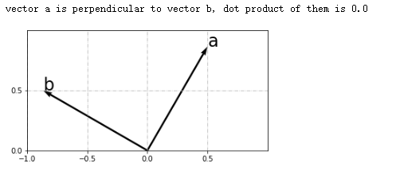

附[代码](https://nbviewer.jupyter.org/github/xuxiangwen/xuxiangwen.github.io/blob/master/_notes/05-ai/50-my-course/machine_learning/c0002.ipynb#两个垂直向量的内积)。

### 单位向量

 指大小等于1的向量。可以用$\frac {\mathbf b} {\|\mathbf b\|}$表示单位向量。

这样公式可以变成：

$$
\mathbf{a}\cdot \frac {\mathbf b} {\|\mathbf b\|} = \|\mathbf a \| \cos \theta
$$

### 几何意义

如下图所示，$\|\mathbf a \| \cos \theta$是向量$\mathbf a$在向量$\mathbf b$上投影的长度。

 ![Image result for 单位向量 投影](data:image/png;base64,iVBORw0KGgoAAAANSUhEUgAAAScAAACrCAMAAAATgapkAAAA/1BMVEX////7+/sAAADu7u78/Pzv7+/x8fH29vby8vL09PT19fX6+vro6Ojr6+vm5uacw+VCQkLd3d3a2to+PDp1k61QZnijzPCVv+PHx8dWVlY+Pj5NlNKMjIzs8/rExMS1tbV8fHyx0Otup9pwcHBiYmKjo6MlJSVQUFA4RlLU5fQ0NDQUFBTR0dGkyOdqamqtra1tiKCbm5uDg4MeHh7j7fdhn9dTl9PJ2umsy+YuLi4mMDgqN0JKXm+DpMBCU2EUGR1YboFkfpSMtd7E2/Bve4Y5YocsS2caLkBKgrV6qdZmotjY4euzx9tCPDZKZH1cZm9Te58QDAZ7mrUnMTocJCrRfMaCAAAWDklEQVR4nO1diVvjOLK3LVmHZTkEuidALsLRdOgAAw2Bnpm+YHffNP12385u//9/y9PhQ75iJyQhaRDfVy5FLrnyQ1apdFQsC1kyAUURkxQblBm85eubTAGDZ66k0FOUGjwpEdafK6mqukPFbEmpwXu1FFMZGyueJrxNawiHxYXqvOCU8C84TYmTqS3R2NgJNiYfiqQEDN5W1UOlQoiTwZcKI2tiseZDnKDCRqnEYG3FGEmUsb3aiqX+gZYbuACAiPri4vo8R31V3DRvzVEuLy5XVSgeKB5ofrJwVd2BoUyQVa9K2M8qllKylmJgJdsTyt369O1pFfunm3uRul5esZd+3CjuPozbIo0HLzhNxGnYvrvvDhvjcXelcJpb/8Tm1D/BK/XRfnuQ3Jrvn/CS+yfiE4QQCRT1ubgQDhTN8og2qbrJFDB4IC/EVWKun6EVwmYxoYHneeyufUvjWwOQKONn+SrFuFIMKMWAnygJ6ihGVDFawfYk+PvB7e3+eKXa0+r1T9ZpW/XjGqeV6Z9WDqdB+3pwZVl37RecJuEEv2mAVg2nlRuP77fvpVRF//Ts/TvUau/f+Pf74/EpevHvJrQn9iC78etG+3aV2tPK9U8i3Q8G97B7epVT7KUfTxVrSvOKveC0jvOZ2Oyf8jhNMR43MEsJl+JUaz6zDKfJipnYwDxOVf0TBNC2bcgVBVRQm2JJiZfwVPEw0DeZAglvY3VhRPIMwYS6sERYVcrt6rohSJSBSFAo+nFGISS4hmJUZbD6bhglSmq+QlgX29G4IDSOvrSBPlfWNMdXWND8WKB8XAAyfPW8b6wM4ohS1OscfPgbddUnVYr5oTKmkqBEsScZF1hzXkfQL1zvfO/EEWlvwMK377mOCwr6cdUzbfbOz947YTrotoYv9i7mdbG/Obo4PHnnJOkYD1uDp8KJTIuTab5CnPL27lE4IRRsdw53nUza8q1BowXr/QPr27tynKALZeKKup6kHpOUYsXjhLcCS91kChg8BpJKKyQoyvKlwkqquNjj/c7hSRYilTjrNhqtYT3FXEMZUlsxzUNfFVuYY8/zsK8od8UFA+RF1HM170oeB/omUyDhPaQuFEhKeMJTfVOpsFdWt31WCJFMmza6aTUaA61khWKuuhClDOIJTyoUw0ndXqW9W8g4s9SspIubZTCNxNNuGyKhF3sn+U4xTD1R2pUwtW5gHcV+entH3xXBdC5Lhy0J1K1dLjxnnFIeV33/rsDelb13ZKJwwXuXFJ8XwNRRpYOGSt3aik1h70y+0L9zqbhI6yYowQlPvWpPSNo7QYVBkRQZfJl/5+bcqGzd0HqTg+kSM1HQ1TC1hjUU87Ri6rthlPBsGv+O+lSmQFEfSApcSXmOp019kylg8K66IK6on+UrhEuKYS8L06HFhUreTUsDdVujbmAo43JDMV5fsZW2d8JTOc7AtBPO+4avXfjiPWt7R60gN4A6xnqezg6bk3jxaij2c9u7ID8qOOGWxmkY4dQYLAunFbV39nm+C38XyFLp+8avnX7xlmHv8v4dNXy60L9Tn4uuf0r/jiR8hXC62LK2447pIGlWI1UqDDGOm5O0eFV1e4ZiOOd41lNM+ncy+YoK/04kl0gKkOJRwgtXR91kChg8Uhfh00nKs3yFsFnMwOZhBM1GzyLRZME2peoexG4SnBq3rFIxlSFKGWIoRqZQbBXtHTuIUPqrLz8Jxwb9ZJ3TeO0aDTaNYj+RvTuK37OL8NYdmTmK16VsbMIkLd6zs3fY6sXzTXsgulXOG0hvJcQJDlsmULc/i72bonlv78QDyk2c1H3gXCo1wvfu/lSlRkNf4NL9u/mt37l6Fc+eYv0OWnwvHij1bSu5FQY70iGz9Wodwt0u7QIybA0w71LaZVOt3ylKEr6mf+f5nnBfvEDR0L9DyqdzE/8OqM+9pr7JFEh44d95GdeJaOqXCdOYimLmJgOAI8Q881bMtUohFR95IU7Iq1YMqAwCWc9O00iYFgvr4tXx72g/HldeBrniwn2sw+7z29czilE6DFK7VlZmH8Yq4NSMHd7j7cK6C3HqwueEE7JAJ5re/XBuF9ddgBPstu6fal+PVsHc0lexv4AafNn+AqusGwg3gp1/iNzcjn5+0f4Cc2+93ndoyfXgafYXqLqh2T95hjAtEba4vvhNX6aQBpIGJdTfNG/N0aBpCIQfGXyhMOe9jbhj2ia8rG5TsZD3b1q3fEbFgkrFYhoWp4Gs1Z5SAtO2p4xwMhO3O5pUd0F7gnIfRqo9lQlP3Z5MPmpPT9g/MRKPK9/36cS6n7O9Yxfx/NsFq9rXMxknfavZeg2nZ81x6sV7UPb8yrqLcGKDqwinsrQoe7esc2XIGsUzccebNeouGo8rezcZpzmOx5/gnCJhm3HH9OHcxzXqLjiniIS9kwuOEjNKYRYi/BOcU4w7Jjn5hqxscc32dBW2J/dg76ijxvG5tNb+XT9GqcOy6kzVjw+x7J+w0xfZwLELcFrfftwexd33mRoxPfo8gu+oepxmDqU1xikwHV49zJsdp66t7J2oIBj1I5xGJl4rae+qz5W5nb9MhzeyfTXqLjpXdiX8YKkYPDrbO9+McNreNHCaY/+08HOKIY8C9yieYzoIPPTYODRA2DskDDTbPZZfJdue6LqeU0zGlWcBM4RnbU9WOH66cNSnhe/d+tm7ZryQcjyquQ+jqn/qnsrzCHDn2NI4afd9Yf3T4nGixkLK+14i8EicJBX9eMeRTM/hR8F642Txo+hQyvsLbgjMByeys7Pd3zs/OVCjsTWwd2XjcWOF1y+YNpx5PC79YGXvmqNNYIERtWDQDPq9oNmMvL618e8oNhzebUbrxKGp6d+5iX8XJbitU89bL/9OXOKO6c15ifDM7Wm58wWL7J9sY4W3QOBx/ZMaZy5x/mlxOPXjM4Udb4p9PbX78Ss7wknPXrIcXX2csLWdLKQExcLzsXc1FFste2eOx63NeE/ccQ9PFJ7Zv5PtaXn7Cxbg37k02dIsRkxkQXFGv7cGaL3j0JynOqYFxa21DHu3hvtVLGs7nhY4Ux3TguKGwCc8Rz0HnJITKTujMH7BYnAy16XWDic/2TnYm2r/0zrauxnj0Ngeu4g6pncXUpPHn5cq7J/KcJrsKDwyDo0d7iZVuzXL9rESamzpTAkkvMX68UzcQRNDYx/rZGG7um7IlTLRPlatWPd2CBGuFrapykzex1oqnIlD89hxAcLJuPJ4hN3Fxx8P533XbFwA4nHlm17yrs05Dk3BuGCtzuV7LB5XvjtiiQoL7cdNP3hN7N1RtHPQ6SCzDS3Y3j3dPtaZ4tCM4hGTdHjnHYcmj1OpvauD0zLi0BSc6EPGCu9JX9Q2/TlFUHBOMccDrQYLzylqftgtVyx1TnFiHJqqc4p+fE4xG4fGRToaTYbPR2zBMLiMO6ZzHdxl+jg0RriXsmLsazWI+lzzVPjBrESxNG/EocFPE4cmCVfRsYvWORczzszP+9afkF66vRO19OLu+0CKLzl+5pr4wTRZ4d3paXWWi9Oy/WCzo6/v3yUO71Y/XJRbRByaDE51/Lu88CLOKerYM5InXsJn4tBYLF7hdS6oFcWhCc8pGhFGyeQ4o5VxaBJeh8NhtoozGgXIgTpYTq04NMK/U9RQbKo4o1PEoQmP7HHWNzboQK9eHJpQuCzcS0Wx7xrnFEP+qnGDNV8hbMahKTunOCEOzaznFEfGGV7bEF5EHJr52Lun8O/8eFz5Ybti/e4Z2zuaLKQc5dRZMk5Pcv6ulr0L+onD28wJL8Hepf27rB+8WHtXNw5NyuHdtLRbJr9kJg6N4dPNHIemnn9nRfwKxaFhsBlv0NntWSwUAMFFh7M5x6EpKPa1GioODSBaSXpzVTNAztLi0DALio7p739XMB0ZAv096/wNRpPfuwXZu6vV8++YjA3zj+vr8f84F+bRtv6xYJxmiNOzt3fhzsF//DlufzcFmu9HMkjMJnkOOFWs30FjS/POt3HLFDg8YGqn7ZLfu5CH992VWb+DLJmJ+9APrsbtYRQ+Bloj0ZKgdblLozg0arVOL42l4tA8ev3OLlq/E+6djbwawuH6nbFmN8P6XVkcGk+6TowkOwcvkB2wVvsORwLw4BgEgDkdW0dsQTrcC08o0dSfGCsmikMzKZSMZ/h3nvbyAPKIVnLKODRmsJwaQWxqxaHpxQ7vHlBN8Kp9zWIB5/By7/LM2Xwi/06dy396/45Zo3iFd6cZiTy072koMHKQuKmz+8z9uyQ2zMY2i8N837Zb0e8fH72XOsso188YJxrHhnlzZG6DHI73o6MXl3vi1r5jPRVO3cZTx6GxbMPhBZY5r8LG4+9hXWdiYB7IyZWCfaxTxKFBVklxqn8qiBsi9z4/ZRwa7veTPXE9wFNxaMB++3+5uhVcdig42HMfFYcmG+5lijg0gc/5rAFy5hKHhpszcTC7X6XVPg0F3N3zS9PXmyUOTbY95Yvz9i5uT2Kc+XRxaHA8rnwvz7vn5jMH7btYwE+HMVnbfvyoz1LfpLIfx/Qo/uWGjqolh5PoyMvUWVucjp13Z300BU7GzkFuF8+PX40fusU1Lhunq7nhpBzYN2c9nuoKSu1dMhO3MyrdT9e9vu4mX69smudxv2+erhsO7rvAsHfzjwsZOfofDnSrKhqPR4fyDIf3zTnBpOScIuEP4++09jnFwjg0U55TdE9brdubK0TT5xQBoUTzVYccq84p2saPMLzb63OP09JzisiI0hzaquL2ZO2Ph0tuT6cyKnTrdtjVWsTtCdbcsF27PUW+bL+gPWk9+3H3vYdTfVJ+nXO/rXBaXv8Eb8MA2q3TG/nKR/NP81uXyuAku+eeHfZVJk6Jw3sQfVqY1PO+aZy0gnr4ovnoohLM8SgnkBKeUHybxBpvnN53vbBaae+sSuGsYmaKFMvj5Dh/nfXN90AG2DhMSnePN7a2tnY3NnbFZWNjQ9Nd9dHG1onI/PPP63/9U2ROovLUzXFmV8nsqgoU3d2Nbtgyq97aOtEPODGedrIVPU0+Z+NjKix74/TV/8nqtr788lGpJUUm0uhSwu9uFP6KlbKAIBlnskPn0+vXvznOf1+//iRKP73+44fj/Pb69ds487vKvBOZz47z5/W/ZeYPlRElvzvO52xGSL6NMp/izI8481ucEY/WTwszv2UeLTMpnBRWH7/+Vzyu9aX4+80xfTjohXFt0OaHt7/88stHx/koLm+dTzpzpzKvBf2P4zTE5Tfni6C/On89jO9+ccLMj5a4fHa+CvrV+SFua/1wfhWZL85nQVvvnFfi8tr5IWjDcf6jSuTTWvppn6Kn6UcX6SEe0GhlcWqIJ338tHCQdHp/Ic88iPa04fz66pVoAn+8evXrZ+ezyHxSma+fnR8iI/63X0RGtDed+de/Zeb3V69e/a5KvmQyb0VG/Le/Rplf48wnkfnhfP6qniYz79QD9NNE5nOsx9eUHrn2JFD68mM5KL05igK6UV78C5irk9I4tVoSzKWkDRmy5enjsdYcF9inZi8+GCI1uzrP83dF9s457nCj7qjG0nXzhcTPnH6cGYHEjHFmbcWmHGeKtHMRhLMuE9Y5l4tTyt0sam4ap9bpYNhN+3eLwum4EyTCWf9uiXFGU8IsNRY0h4eJfyda0u2NL3dmpvy7iJ+nf+fsXow84JGViDOaEi5NSXsaDH3dehbdnk4umlnh2fYd5gQMfsZ+vDTFt8LC+ae59+PSuk2Yf1p9nKxF43QsO25QLLxaOOFRbzuw0ml5OF1e+KkAPzX39SwszmihsEy9w/5m7/DISqXJ+wvYHPunScIRTguPM1px3lx+0UD9EnfTkQM7oJqVpFVxaGL66PPm7irFGZ3QnvwT6ZT7jqSB8s/9zVVrT6vRP1mwd7SXwWl5/dMk4ZXCKTg8PgqCF5wqcGqqX0tccZwq9rHmcZpiPF5nP51IBx+sApwq9rEuPw4NY8zmigIqLnKLqKDEU7yiRH4uf7ZQ3WQKGLwnL3LvqqDYTXjmThKWX31jR+PUDEyczFu5VkMphnCiJPJqKEaBUomc3l1BrNUjiqJqYWarYibHBTKF1JdUGNtCiprIuDVHubpwP+GB4kEwQViNCzpyRMA6TtAxcUrdWqJSLcX8ULGH9g3KK1kh7OrilRgXwMs3nb2D7cOTi/rjghn8YLnyuO7jgjgtsB+XOK21vTPTgnHS7Wk1fz+YTBTOJK78Ft5M31orDk2VYhKn7ver7gR7lxeOcKp3TrHOcUBsHAesf06xCCudKs8pwrrnFHUcGiJwGly329enbMlxaNI8UqFpVOwZrGLPmHypcDlQRXFocBKHhtRWTMWhwQTsj/fb+61v4/YpVootLw7NnMaZxanC3k0/Ib0/Hg8sZt2Or6/W394laQH9+ED2SfC6fa/E1svela63LGxc8G3cmgGnp7Z3Fet3KZwm+3dlwqa9k9jcje/sHE6V9i4dhyY+pwiNOKOQGscBSyO2FMShQXXi0NjVdUNgKEO0SgmvhMWfW6IY1XFohL27kefyBU4trM8pyoA24ZOFjZs6Do0R7qUgDk1ZxBa3LNzLnOPQAJDwxjlF19PnK4NcRToODXGFf4eFSuyhferG6nmuPqfICUVCWHwqqtJiSmr2ODRztncps1JWbL53iKjXQL01oWLCjSaQufITO8grpncK0IfrllTv6vpB74iFFMrNqHq7BWdMBSmQHViAsJwgEIQTvCr9+NT77DEh4uv5FDGMxOdU9OuAibuJRxGWOGFxwR4S8ADFU18IEkKvh63T79+H4/t7ItsHEZIAeiywPPE1ARP3E9GGiGULZwAwiiwxyrKs6PeF1g4nyi2GoS8e54tniicRSwypiYUwF88SOMkLBlIfALmFsUuFW0EhGd/fPpy2x+37QJSLduMBG1kINm0EicSJuULEJvIcEEHy/aA2s2CE01Pbu4L3rtTeKcUQEm+SwAnJvQcAyvbkW9TGDFM5uRfIZ7vUk0C76uUkPoPUtry7G9y9+XY3EK2ECveBAi68H2wFlElIBfGsECf5K0Os6UmOhfszU1bCpVFIsww1466lBAweSzMBlb2DytJFvFstXFV3FHdNUgRE9YwLa0Usz2fiRg9BYLkSJ8ZZk8kL8Sybi05HtBpKkO17DHpU3EAF7hjZorfGkHDmCQcRCbiA8JKweJG51FboYkEbif+CaCWkqe1dOgALysahQSjhq8K9LCkODfeZ+IaBCwgHTY4BD3DTlcFwOAeBsH1MbuTh4s9nm8K+BRQEPhBOXsARYOJmn3KPc+zygMssCwLGAQsQUVnqMxpw7hPe5L6o3J8mDs1K2btkndMtV0zcKloPMhSz13ydc9ZzZbZ8SLnfQuWc9s+0fjc7TtazWr+b/r37Kdbv8JTrd+EyWUXd+fU7Mv36naHe9Ot3mTg04uJFcWg0ryiojtjiuX4Se2aKODRmuJcJcWi8KAJNSA0lq4SjODTZMDnTxaHRLTekqmHrqVg9dW3S0p+Z0xSGF91MDcpqCFcUm4rZ5mNmVMzkayn2/4FhNd6/xTeNAAAAAElFTkSuQmCC) 

把上节公式左右调换：

$$
\|\mathbf a \| \cos \theta = \mathbf{a}\cdot \frac {\mathbf b} {\|\mathbf b\|}
$$

可以得出：**向量的投影等于该向量和（被投影）单位向量的内积。**

如果把$ \|\mathbf a \|$移动到等号右边，可以得出，**夹角余弦等于单位向量的内积**。

$$
\cos \theta = \frac {\mathbf{a}}  {\|\mathbf a \|}  \cdot \frac {\mathbf b} {\|\mathbf b\|}
$$

### 其他意义

- 物理上，向量内积可以理解为做[功](https://zh.wikipedia.org/wiki/%E5%8A%9F)。 功就是力与位移的内积。
$$
  \mathbf W = \mathbf F \cdot \mathbf d = \|\mathbf F \| \|\mathbf d\| \cos \theta
$$

  其中$\mathbf W$ ：功，$\mathbf F$：力， $\mathbf d$：位移。

- 几何上，向量内积，可以表示向量的夹角

  - $\mathbf a \cdot \mathbf b = 0$，表示$a$和$b$是垂直的
  - $\mathbf a \cdot \mathbf b >0 $，表示$a$和$b$的夹角小于90度
  - $\mathbf a \cdot \mathbf b < 0 $，表示$a$和$b$的夹角大于90度

- 几何上，把$\mathbf x$看成是坐标，则$\mathbf w \cdot \mathbf x= 0$，表示一个过原点，且垂直于$w$的平面方程。而对于空间上的任何一个点$ \mathbf  u$：

  - $\mathbf w \cdot \mathbf u = 0 $，则点u属于平面
  - $\mathbf w \cdot \mathbf u > 0 $，则点u在平面上方（$\mathbf w$和$\mathbf u$的夹角小于90度）
  - $\mathbf w \cdot \mathbf u < 0 $，则点u在平面下方（$\mathbf w$和$\mathbf u$的夹角大于90度）
> 平面上方和下方是以w的方向作为参照的，如果和w同向，就是上方，反之就是下方。

### 再看矩阵乘法

基于向量内积，可以简化矩阵乘法的表达形式。

**内积**

把矩阵$\mathbf A$表示成多个行向量的组合，矩阵$\mathbf B $表示成多个列向量的组合。

$$
\mathbf A = \begin{bmatrix} a_{11} & a_{12} & \cdots & a_{1n} \\a_{21} & a_{22} & \cdots & a_{2n}  \\\vdots & \vdots  & \vdots & \vdots \\a_{m1} & a_{m2} & \cdots & a_{mn}  \\\end{bmatrix} = \begin{bmatrix} \mathbf {a_1^T} \\ \mathbf {a_2^T} \\ \vdots \\ \mathbf {a_m^T} \end{bmatrix}，
\mathbf B = \begin{bmatrix} b_{11} & b_{12} & \cdots & b_{1p} \\b_{21} & b_{22} & \cdots & b_{2p}  \\p\vdots & \vdots  & \vdots & \vdots \\b_{n1} & b_{n2} & \cdots & a_{np}  \\\end{bmatrix} = \begin{bmatrix} \mathbf {b_1} & \mathbf {b_2} & \cdots & \mathbf {b_p} \end{bmatrix}
$$

矩阵乘法可以看成是行向量和列向量的内积，所以矩阵乘法也可以看成是**矩阵的内积**。

$$
\mathbf A \cdot \mathbf B = 
\begin{bmatrix} \mathbf {a_1^T} \\ \mathbf {a_2^T} \\ \vdots \\ \mathbf {a_m^T} \end{bmatrix} \cdot
\begin{bmatrix} \mathbf {b_1} & \mathbf {b_2} & \cdots & \mathbf {b_p} \end{bmatrix} =
\begin{bmatrix} 
\mathbf {a_1^T} \cdot \mathbf {b_1} & \mathbf {a_1^T} \cdot \mathbf {b_2} & \cdots & \mathbf {a_1^T} \cdot \mathbf {b_p} \\
\mathbf {a_2^T} \cdot \mathbf {b_1} & \mathbf {a_2^T} \cdot \mathbf {b_2} & \cdots & \mathbf {a_2^T} \cdot \mathbf {b_p} \\
\vdots & \vdots  & \vdots & \vdots \\
\mathbf {a_m^T} \cdot \mathbf {b_1} & \mathbf {a_m^T} \cdot \mathbf {b_2} & \cdots & \mathbf {a_m^T} \cdot \mathbf {b_p} 
\end{bmatrix}
$$

其中$\mathbf {a_i^T} \cdot \mathbf {b_j}$ 是向量的内积，是一个标量。

**外积**

相似的思路，还可以换一种角度来看，把矩阵$\mathbf A$表示成多个列向量的组合，而矩阵$\mathbf B $表示成多个行向量的组合。

$$
\mathbf A = \begin{bmatrix} a_{11} & a_{12} & \cdots & a_{1n} \\a_{21} & a_{22} & \cdots & a_{2n}  \\ \vdots & \vdots  & \vdots & \vdots \\a_{m1} & a_{m2} & \cdots & a_{mn}  \\\end{bmatrix} = 
\begin{bmatrix} \mathbf {\alpha_1} & \mathbf {\alpha_2} & \cdots & \mathbf {\alpha_n} \end{bmatrix}，
\mathbf B = \begin{bmatrix} b_{11} & b_{12} & \cdots & b_{1p} \\b_{21} & b_{22} & \cdots & b_{2p}  \\\vdots & \vdots  & \vdots & \vdots \\b_{n1} & b_{n2} & \cdots & b_{np}  \\
\end{bmatrix} = 
\begin{bmatrix} \mathbf {\beta_1^T} \\ \mathbf {\beta_2^T} \\ \vdots \\ \mathbf {\beta_n^T} \end{bmatrix}
\\
\mathbf A \cdot \mathbf B =
\begin{bmatrix} \mathbf {\alpha_1} & \mathbf {\alpha_2} & \cdots & \mathbf {\alpha_n} \end{bmatrix} \cdot
\begin{bmatrix} \mathbf {\beta_1^T} \\ \mathbf {\beta_2^T} \\ \vdots \\ \mathbf {\beta_n^T} \end{bmatrix} = 
\mathbf {\alpha_1} \cdot \mathbf {\beta_1^T} + \mathbf {\alpha_2} \cdot \mathbf {\beta_2^T} + \cdots+ \mathbf {\alpha_n} \cdot \mathbf {\beta_n^T}
$$

其中$\mathbf \alpha_i \cdot \beta_j^T$是一个$m \times p$阶的矩阵，它是由一个列向量和行向量相乘而得，称之为向量的[外积](https://zh.wikipedia.org/wiki/%E5%A4%96%E7%A7%AF)（Outer product）。

上述两种思路，都能简明表达矩阵乘法，在实际的计算中，非常有用。

##  点到平面的距离

上文中说到，$\mathbf w \cdot \mathbf x = 0$，表示一个过原点，且垂直于$\mathbf w$的平面方程。而对于空间中任意平面，其平面方程为：$ \mathbf w  \cdot \mathbf x + b = 0$，该平面垂直于$\mathbf w$，但不一定过原点。

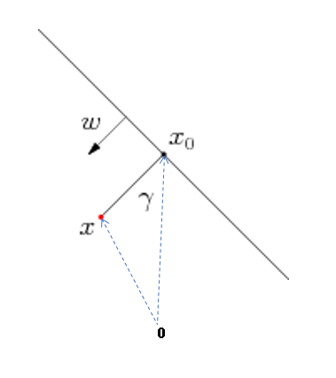
- 如果是二维空间，则表示是一个直线方程。比如：

  直线$2x+3y+5=0$，即$\begin{bmatrix} 2 \\ 3 \end{bmatrix} \cdot \begin{bmatrix} x \\ y  \end{bmatrix} + 5 = 0$

- 如果是三维空间, 是一个平面. 如果大于3维空间，则是一个超平面。

空间任意一点$x$到平面的距离是:  

$$
\gamma = \frac 1 {\|\mathbf w\|} (\mathbf w \cdot \mathbf x + b)
$$

- $ \gamma >0 $，表示$\mathbf x$在平面上方
- $\gamma<0$，表示$\mathbf x$在平面下方

### 证明

假设点$\mathbf {x_0} $是指点$ \mathbf x  $在超平面上的投影点，即$\vec {x_0x}$ 平行于$ \mathbf w$。

$$
\mathbf x - \mathbf{x_0} = \gamma  \frac {\mathbf w} {\|\mathbf w\|}
 \\
 \mathbf w \cdot (\mathbf  x- \mathbf{x_0}) = \mathbf w \cdot \gamma  \frac {\mathbf w} {\|\mathbf  w\|}
$$

 由于$ \mathbf w \cdot \mathbf  {x_0} + b = 0  $, 即 $ \mathbf w  \cdot \mathbf {x_0}  = -b  $, 上面的公式可以变成

$$
\gamma = \frac 1 {\|\mathbf  w\|}(\mathbf  w \cdot \mathbf  x + b)
$$

### 意义

机器学习的二分类问题，从几何角度来看，可以看成是找到一个平面（甚至曲面）把两个类别分开的事情。如果样本到平面的距离越大，则认为分类的效果越好，而这也是学习点到平面距离的意义。在后面学习`支持向量机`（support vector machine）时，尤其会用到这个概念。

 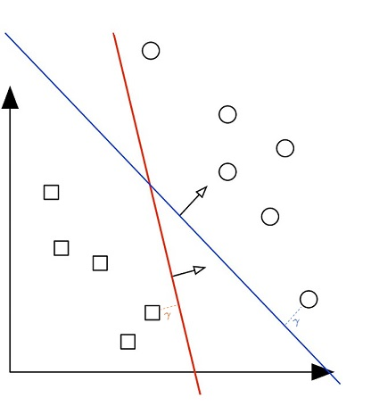 

 上图中，虽然都很能正确分类，由于蓝线距离样本距离明更大，所以蓝线比红线分类效果要好。

## 线性映射和线性变换

在线性代数中，线性映射（linear mapping）和线性变换（linear transformation）经常被提到。线性映射指从一个向量空间$\mathbf V$到另一个向量空间$\mathbf W$的映射且保持加法运算和数量乘法运算，而线性变换是线性空间$\mathbf V$到其自身的线性映射，是一种特殊的线性映射。

通俗来说，线性映射把一个坐标系中的点，映射到另外一个坐标系中的点，比如：阳光下物体的影子，就是把三维的物体映射到二维的平面上。而线性变换是在同一个坐标系中完成的。比如：二维平面中，对一个图形，进行旋转，缩放。

  

### 定义

设 $\mathbf V，\mathbf W $为两个向量空间， 如果$f:\mathbf V \rightarrow \mathbf W$满足

- 任意$ \mathbf{\alpha} \in \mathbf V，$则$ f(\mathbf{\alpha}) \in \mathbf W $ 
- 加法：任意向量$ \mathbf{\alpha_1},\mathbf{\alpha_2} \in \mathbf V $，则 $f(\mathbf{\alpha_1}+\mathbf{\alpha_2}) = f(\mathbf{\alpha_1}) + f(\mathbf{\alpha_2})$ 
- 数乘：任意向量 $\mathbf{\alpha} \in \mathbf V $，则$ f(k\mathbf{\alpha}) = kf(\mathbf{\alpha})$ 

则称$f$为从线性空间$\mathbf V$到线性空间$\mathbf W $的**线性映射**。如果$\mathbf V$和$\mathbf W$是同一个线性空间，则称$f$为**线性变换**，线性映射和线性变换很类似，本质相同。

线性映射可以用矩阵表示，这也是矩阵最重要的意义之一。方式如下：

$$
\mathbf A \cdot \mathbf{\alpha} = \mathbf{\beta}
$$

其中$f = \mathbf A， \mathbf{\alpha} \in \mathbf V， \mathbf {\beta} \in \mathbf W  $。为了加深理解，下面看最简单的线性变换：旋转，缩放以及正交化。

### 旋转

在同一向量空间，最基本的线性变换之一是旋转。在二维空间，如下矩阵$\mathbf A$将会把向量进行逆时针旋转$\theta $。

$$
\mathbf A = 
\begin{bmatrix} 
\cos {(\theta)} & -\sin {(\theta)} \\
\sin {(\theta)} & \cos {(\theta)} 
\end{bmatrix} = \begin{bmatrix} \mathbf {a_1}   &  \mathbf {a_2} \end{bmatrix}
$$

其中$\mathbf {a_1} = \begin{bmatrix} 
\cos {(\theta)}  \\
\sin {(\theta)} 
\end{bmatrix} ，
\mathbf {a_2} = 
\begin{bmatrix} 
-\sin{(\theta)}  \\
\cos{(\theta)} 
\end{bmatrix} 
$

如下图所见，向量$\mathbf {a_1}$是一个单位向量，和$\mathbf X$轴的角度是$\theta $，向量$\mathbf {a_2}$也是一个单位向量，和$\mathbf {a_1}$刚好垂直。

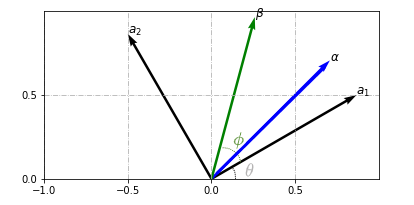

上图中$\theta = 30^{\circ}$，$\alpha$和$\mathbf X$ 轴的角度$\phi=45^{\circ}$，经过线性变换后，$\beta $和$\mathbf X $轴的角度是$75^{\circ}$，也就是说，矩阵正好把向量逆时针旋转了$ 30^{\circ}$。

上面的解释或许还是有些抽象，用坐标轴变换来解释旋转会形象的多。

$$
\mathbf{\beta} = \mathbf A \cdot \mathbf{\alpha} = \mathbf {a_1} \alpha_1 + \mathbf {a_2} \alpha_2
$$

   - 把$\mathbf {a_1}$和$\mathbf {a_2}$看成是新的坐标轴，和标准坐标轴相比，这个坐标轴逆时针旋转了$\theta $。
   - 向量$\mathbf {\beta}$在新坐标轴下的坐标是$\begin{bmatrix} 
     \alpha_1 \\
     \alpha_2 
     \end{bmatrix} $
   - $\alpha$和$X$轴的角度是$\phi$，可以得出向量$\mathbf {\beta}$和$\mathbf {a_1}$(新$X$轴)的角度必然也是$\phi$，则向量$\mathbf {\beta}$和$X$轴的角度是 $\phi + \theta $ 。就这样看上去，矩阵$ \mathbf{A} $正好把向量$\mathbf{\alpha}$逆时针旋转了$ \theta$。

同理，很容易把上述方法推广到$n$维: 

$$
\mathbf{\beta} = \mathbf A \cdot \mathbf{\alpha} = \mathbf {a_1} \alpha_1 + \mathbf {a_2} \alpha_2 + \cdots \mathbf {a_n} \alpha_n
$$

- 把$\mathbf {a_1}, \mathbf {a_2}, \cdots, \mathbf {a_n}$看成是新的坐标轴。
 - 向量$\mathbf {\beta}$在新坐标轴下的坐标是$\begin{bmatrix} 
 \alpha_1 \\
 \alpha_2 \\
 \vdots    \\
 \alpha_n
 \end{bmatrix} $
- 即使是高维空间，不难得出，**向量$\mathbf {\beta}$和$\mathbf {\alpha}$之间旋转的角度，等于新旧坐标轴之间的旋转角度**。

本小节中$\mathbf A$是一个方阵，其各个列向量是单位向量，且各个列向量之间相互垂直（内积为$0$），线性代数中称这样的矩阵为[正交矩阵](https://zh.wikipedia.org/wiki/%E6%AD%A3%E4%BA%A4%E7%9F%A9%E9%98%B5)，而正交矩阵中的向量构成的`基`，称之为`正交基`。正交矩阵最有趣的特性就是旋转，但不改变向量的长度和向量之间的关系。比如：两个向量在原向量空间中，夹角是$30^{\circ}$，经过正交矩阵变换后，在新的向量空间，它们的夹角还是$30^{\circ}$。

附[代码](https://nbviewer.jupyter.org/github/xuxiangwen/xuxiangwen.github.io/blob/master/_notes/05-ai/50-my-course/machine_learning/c0002.ipynb#旋转)。

### 缩放

在二维空间，下面的矩阵会对向量各个分量进行拉伸和缩放。

$$
\mathbf A = 
\begin{bmatrix} 
s_1 & 0 \\
0 & s_2
\end{bmatrix}
$$

$$
\mathbf{\beta} = 
\mathbf A \cdot \mathbf{\alpha} = 
\begin{bmatrix} 
s_1 & 0 \\
0 & s_2
\end{bmatrix} \cdot \begin{bmatrix} \alpha_1 \\ \alpha_2 \end{bmatrix} = 
\begin{bmatrix} s_1\alpha_1 \\ s_2\alpha_2 \end{bmatrix}
$$

下图中$\mathbf A = 
\begin{bmatrix} 
2 & 0 \\
0 & 0.5
\end{bmatrix}$，对圆进行了缩放：$\mathbf x $轴$2$倍，$\mathbf y$轴$0.5$倍。

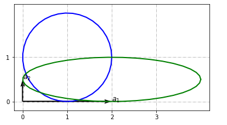

同样推广到$n$维空间。

$$
\mathbf A = 
\begin{bmatrix} 
s_1 & 0 & \cdots & 0 \\
0 & s_2 & \cdots & 0  \\
0 & 0 & \ddots & 0  \\
0 & 0 & 0 & s_n  \\
\end{bmatrix}
$$

上面矩阵的对角线不为0，其他都为0，这样的矩阵称之为**对角矩阵（ diagonal matrix ）**，它的对象线的数对向量的各个分量进行拉伸和缩放。对角矩阵的另外一种更加简化的表达是：

$$
\mathbf A = diag(s_1, s_2, \cdots, s_n)
$$

或者

$$
\mathbf A = diag(\mathbf s)  
$$

其中$\mathbf s = \begin{bmatrix} s_1 \\ s_2 \\ \vdots \\ s_n \end{bmatrix}$

附[代码](https://nbviewer.jupyter.org/github/xuxiangwen/xuxiangwen.github.io/blob/master/_notes/05-ai/50-my-course/machine_learning/c0002.ipynb#缩放)。

### 旋转+缩放

正交矩阵带来了旋转，对角矩阵进行了缩放，而旋转，缩放都是一种简单运动，复杂一点的运动可以组合多个旋转，缩放，由此可以把线性映射（变换）理解成一种组合运动。

下图中，对圆先进行缩放：$\mathbf x $轴$2$倍，$\mathbf y$轴$0.5$倍，然后再进行旋转$30^{\circ} $。

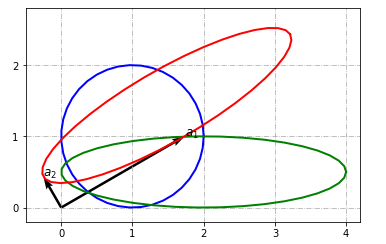

蓝色的圆是原图，绿色的椭圆是缩放后的，红色的椭圆是绿色椭圆旋转后的样子。$\mathbf {a_1}, \mathbf {a_2}$是两种变换叠加后矩阵的列向量。可以这么理解，如果以它们为坐标轴，红色的椭圆就是圆。

所用的两个矩阵分别是：

$$
\mathbf {A_1} = 
\begin{bmatrix} 
2 & 0 \\
0 & 0.5
\end{bmatrix}，\mathbf {A_2} = 
\begin{bmatrix} 
\frac {\sqrt 3} 2 & -\frac 1 2 \\
\frac 1 2 & \frac {\sqrt 3} 2
\end{bmatrix} \\
\mathbf A = \mathbf {A_2} \cdot \mathbf {A_1} = \begin{bmatrix} 
1.732 & -0.25 \\
1 & 0.433 
\end{bmatrix}
$$

附[代码](https://nbviewer.jupyter.org/github/xuxiangwen/xuxiangwen.github.io/blob/master/_notes/05-ai/50-my-course/machine_learning/c0002.ipynb#缩放+旋转)。

### 正交化

一个平行四边形，通过改变角度，可以很容易变成一个长方形。与此类似，[正交化](https://zh.wikipedia.org/wiki/%E6%AD%A3%E4%BA%A4%E5%8C%96)是指把一组（线性无关）的向量经过线性变换后，使得各个向量之间相互垂直（内积为0），然后再对向量进行缩放，使得每个向量成为单位向量。容易想象，在一个二维平面，任意两个向量（不共线），首先通过变换使得两个向量垂直，然后进行缩放，可以把它们变成正交矩阵。

下图中，$\mathbf {v_2^{'}}$是$
\mathbf {v_2}$在$\mathbf {v_1}$上的投影，$\mathbf {v_2} - \mathbf {v_2^{'}}$就可以得到垂直于$\mathbf {v_1}$的向量$\mathbf {\beta_2}$。

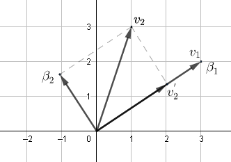

公式表达如下：
$$
\begin{align}
\mathbf {\beta_1} &= \mathbf {v_1}       \\
\mathbf {\beta_2} &= \mathbf {v_2} - (\mathbf {v_2} \cdot \frac {\mathbf {\beta_1}}  {\| \mathbf {\beta_1}\|} ) \frac {\mathbf {\beta_1}}  {\| \mathbf {\beta_1}\|} 
\end{align} \\
$$
然后进行缩放：
$$
\mathbf {\eta_1} =  \frac {\mathbf {\beta_1}}  {\| \mathbf {\beta_1}\|}  \\
\mathbf {\eta_2} =  \frac {\mathbf {\beta_2}}  {\| \mathbf {\beta_2}\|}
$$
以上方法，可以推广到$n$维，称之为[格拉姆-施密特正交化](https://zh.wikipedia.org/wiki/%E6%A0%BC%E6%8B%89%E5%A7%86-%E6%96%BD%E5%AF%86%E7%89%B9%E6%AD%A3%E4%BA%A4%E5%8C%96)。

 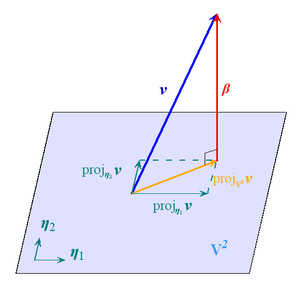 
$$
\begin{align}
\mathbf {V} &= \begin{bmatrix} \mathbf {v_1} & \mathbf {v_2} & \cdots & \mathbf {v_n} \end{bmatrix} \\
\mathbf {\beta_1} &= \mathbf {v_1}     & \mathbf {\eta_1} =  \frac {\mathbf {\beta_1}}  {\| \mathbf {\beta_1}\|}  \\
\mathbf {\beta_2} &= \mathbf {v_2} - (\mathbf {v_2} \cdot \mathbf {\eta_1}) \mathbf {\eta_1} & \mathbf {\eta_2} =  \frac {\mathbf {\beta_2}}  {\| \mathbf {\beta_2}\|}  \\
\mathbf {\beta_3} &= \mathbf {v_3} - (\mathbf {v_3} \cdot \mathbf {\eta_1}) \mathbf {\eta_1} - (\mathbf {v_3} \cdot \mathbf {\eta_2}) \mathbf {\eta_2}   & \mathbf {\eta_2} =  \frac {\mathbf {\beta_3}}  {\| \mathbf {\beta_3}\|}  \\
\vdots \\
\mathbf {\beta_n} &= \mathbf {v_n} - \sum_{i=1}^{n-1} (\mathbf {v_n} \cdot \mathbf {\eta_i}) \mathbf {\eta_i} & \mathbf {\eta_n} =  \frac {\mathbf {\beta_n}}  {\| \mathbf {\beta_n}\|}  
\end{align}
$$

其中$\begin{bmatrix} \mathbf {\eta_1} & \mathbf {\eta_2} & \cdots & \mathbf {\eta_n} \end{bmatrix}$就是经过变换后的正交矩阵。

通过上面的分析，可以得出：一组（线性无关）的向量总可以通过线性变换变成正交矩阵。

> 线性无关是指一组向量中，任意向量无法通过其他向量线性组合所表示，反之称之为线性相关。比如：三角形的任意一边所表示向量可由其他两边向量加法或减法而得，这说明这三个向量是线性相关的。而单位矩阵中，各个向量都无法由其他的向量线性组合而成，所以是线性无关的。

附[代码](https://nbviewer.jupyter.org/github/xuxiangwen/xuxiangwen.github.io/blob/master/_notes/05-ai/50-my-course/machine_learning/c0002.ipynb#正交化)。

### 内积和投影

还可以从内积角度来理解线性映射。    

$$
\begin{align} 
\mathbf{\beta} &= \mathbf A \cdot \mathbf{\alpha}  \\
\mathbf{\beta} &= 
\begin{bmatrix} 
\mathbf {a_1^T} \\ 
\mathbf {a_2^T} \\
\vdots \\
\mathbf {a_m^T} 
\end{bmatrix} \cdot  \mathbf{\alpha} \\
\mathbf{\beta} &= 
\begin{bmatrix} 
\mathbf {a_1^T}\cdot  \mathbf{\alpha} \\ 
\mathbf {a_2^T}\cdot  \mathbf{\alpha} \\
\vdots \\
\mathbf {a_m^T}\cdot  \mathbf{\alpha} 
\end{bmatrix} 
\end{align}
$$

通过上面的推导可以看出，$\mathbf \beta$可以理解为向量$\mathbf \alpha$和$\mathbf  A$各个行向量的内积。线性映射的过程，就是把$\mathbf \alpha$从$n$维空间映射到$m$维空间的过程。

当$\mathbf {a_1}, \mathbf {a_2}, \cdots, \mathbf {a_m}$是单位向量时，**$\mathbf \beta$是向量$\mathbf \alpha$ 在$\mathbf  A$各个行向量上的投影**，即以行向量为基的坐标系上的坐标。

## 线性方程组

从初中开始，大家就学过方程组，这种方程组也称之为线性方程组。定义如下：
$$
\left\{\begin{matrix}
a_{11}x_1+ a_{12}x_2 +  \dots +a_{1n}x_n = y_1
\\
a_{21}x_1+ a_{22}x_2 +  \dots +a_{2n}x_n = y_2
\\
\vdots
\\
a_{m1}x_1+ a_{m2}x_2 + \dots +a_{mn}x_n = y_m
\\
\end{matrix}\right.
$$
### 线性映射

线性方程组就是一种线性映射。首先做如下变化：
$$
(\mathbf {a_1},\mathbf {a_2},\cdots,\mathbf {a_n}) \cdot 
\begin{bmatrix}
x_1\\
x_2\\
\vdots\\
x_n
\end{bmatrix}
= \mathbf y
$$
其中$
\mathbf {a_i} = \begin{bmatrix} a_{1i}\\ a_{2i}\\ \vdots\\ a_{mi} \end{bmatrix} ，\mathbf y= \begin{bmatrix} y_1\\ y_2\\ \vdots\\ y_m \end{bmatrix}
$ ，进一步，可以简化成y：
$$
\mathbf A \cdot \mathbf x = \mathbf y
$$
其中$\mathbf A = (\mathbf {a_1},\mathbf {a_2},\cdots,\mathbf {a_n}) ，\mathbf x= \begin{bmatrix} x_1\\ x_2\\ \vdots\\ x_n \end{bmatrix} $

显然，矩阵$\mathbf A$ 就是一种线性映射，向量$\mathbf x$经过这个线性变化变成向量$\mathbf y $。求解线性方程组是已知线性映射和目标向量，求解原向量的过程。

### 方程求解

下面采用几何的方法来求解线性方程式的解。

根据上文的分析，可以认为是$\mathbf x$是以$\mathbf A $的列向量为坐标轴的坐标，换句话说，$\mathbf A \cdot \mathbf x$属于$\mathbf A $的向量空间中。而$\mathbf y$可能属于这个向量空间，也可能不是，下面详细分析。

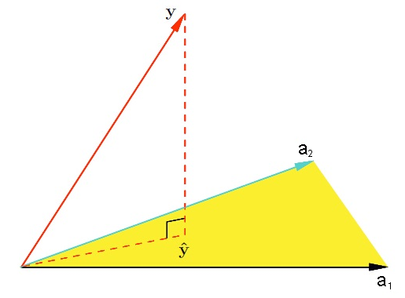

- $\mathbf y \in \mathbf A$，则$\mathbf x$和$\mathbf y$维度必然相同，也就是说$\mathbf A$是一个方阵。可以得出：
  
$$
  \mathbf {x= {A^{-1}} \cdot y}
$$
其中$\mathbf {A^{-1}}$是称之为[逆矩阵](https://zh.wikipedia.org/wiki/%E9%80%86%E7%9F%A9%E9%98%B5)（inverse matrix），逆矩阵又称**反矩阵**。给定一个$n$ 阶方阵$\mathbf A$，若存在$n$阶方阵$\mathbf B$，使得 $\mathbf A \cdot \mathbf B = \mathbf B \cdot \mathbf A = \mathbf {I_n}$，其中$\mathbf {I_n}$是$n$阶矩阵，则称$\mathbf A$是可逆的，且$\mathbf B$是$\mathbf A$的逆矩阵，记为$\mathbf  {A^{-1}}$。

  假设

$$
  \mathbf A = \begin{bmatrix} \mathbf {a_1^T} \\ \mathbf {a_2^T} \\  \vdots \\ a_n^T\end{bmatrix}，

  \mathbf B = \begin{bmatrix} \mathbf {b_1} & \mathbf {b_2} &  \cdots & b_n\end{bmatrix}，
$$
  则

$$
  \mathbf A \cdot \mathbf B =
  \begin{bmatrix} 
  \mathbf {a_1^Tb_1} & \mathbf {a_1^Tb_2} & \cdots &  \mathbf {a_1^Tb_n} \\ 
  \mathbf {a_2^Tb_1} & \mathbf {a_2^Tb_2} & \cdots &  \mathbf {a_2^Tb_n} \\ 
  \vdots &  \vdots  & \ddots & \vdots \\
  \mathbf {a_n^Tb_1} & \mathbf {a_n^Tb_2} & \cdots &  \mathbf {a_n^Tb_n} \\ 
  \end{bmatrix} = \begin{bmatrix}
  1 & 0 &  \cdots & 0 \\
  0 & 1 &  \cdots & 0 \\

  \vdots & \vdots & \ddots & \vdots \\
  0 & 0 &  \cdots & 1 \\
  \end{bmatrix}
$$
  可以看出，$\mathbf A$的行向量和的其逆矩阵的列向量，对角线方向内积为$1$，其它内积为$0$（相互垂直）。

- $\mathbf y \not\in \mathbf A$，则方程的最优解，应该是向量$\mathbf y$在$\mathbf A$上的最大分量，而这个最大分量就是投影。假设$\hat {\mathbf y}$ 是${\mathbf y}$ 在$\mathbf A$向量空间的投影, $\mathbf x$看成$\hat {\mathbf y}$在$\mathbf A$的坐标.  所以$ \hat {\mathbf y}  - \mathbf y $得到的向量应该和$\mathbf A$中所有的列向量垂直. 也就是满足如下公式.
$$
\begin{align}
\mathbf {A^T}  (\hat {\mathbf y} - \mathbf y) &= 0  \\
\mathbf {A^T}   (\mathbf {A} \mathbf x - \mathbf y) &= 0  \\ 
\mathbf x &= \mathbf {(A^{T}A)^{-1}A^{T}y}
\end{align}
$$
现在再回头来看，第一种情况下的公式，根据逆矩阵定义：
$$
\mathbf {(A^{T}A)^{-1}A^{T}A} = 1 
$$
两边乘以$\mathbf {A^{-1}}$，可得
$$
\mathbf {(A^{T}A)^{-1}A^{T}A  A^{-1} = A^{-1}}
$$
由于$\mathbf {AA^{-1}}=1$，可得
$$
\mathbf {(A^{T}A)^{-1}A^{T} = A^{-1}}
$$
这样，两种情况都可以得到同样的公式
$$
\mathbf x = \mathbf {(A^{T}A)^{-1}A^{T}y}
$$
附[代码](https://nbviewer.jupyter.org/github/xuxiangwen/xuxiangwen.github.io/blob/master/_notes/05-ai/50-my-course/machine_learning/c0002.ipynb#求解线性方程组)。

## 特征值和特征向量

对于一个给定的$n \times n $方阵$\mathbf A$，对特征向量（eigenvector） $\mathbf v$进行线性变换之后，得到的新向量仍然与原来的$\mathbf v$保持在同一条直线上，但其长度或方向（即特征值eigenvalue）也许会改变。即 
$$
\underbrace{\mathbf{A}}_{n\times n}{\mathbf{v}} = \underbrace{\lambda}_{eigenvalue} \overbrace{\mathbf{v}}^{eigenvector}
$$
如果$\mathbf A$的列向量是线性无关的，则可以找到$n$个特征值，和对应的$n$个特征向量，这时公式变成：
$$
\mathbf{A} \mathbf{V} =  \mathbf{V} \mathbf {\Lambda}
$$
其中

- $\mathbf V = \begin{bmatrix} \mathbf {v_1} & \mathbf {v_2} & \cdots & \mathbf {v_n} \end{bmatrix} $，其中列向量分别代表$n$个特征向量，它们都是单位向量，$\mathbf V $称为特征向量矩阵。
- $\mathbf {\Lambda} = diag(\mathbf {\lambda_1}, \mathbf {\lambda_2}, \cdots,  \mathbf {\lambda_n})$，它是对角矩阵，对角线的值代表$n$个特征值。

光看上面的定义，不免觉得有些抽象。为了更好理解，首先来看相似矩阵。

### 相似矩阵

对于两个$n\times n$矩阵$\mathbf A$与$\mathbf B$，当且仅当存在一个$n\times n$的[可逆矩阵](https://zh.wikipedia.org/wiki/逆矩阵)$\mathbf P$，使得： 
$$
\mathbf {P^{-1}} \mathbf{A} \mathbf {P} = \mathbf{B}
$$
$\mathbf P$被称为矩阵$\mathbf A$和$\mathbf B$之间的**相似变换矩阵**，$\mathbf A$和$\mathbf B$之间互为**相似矩阵**。 可以这样来理解相似矩阵。

假设，在标准坐标系下，一个线性变换公式为$\mathbf {\beta} = \mathbf A \mathbf \alpha $，

而在坐标系$\mathbf P $下，同样这个线性变换的公式为$\mathbf {\beta^{'}} = \mathbf B \mathbf {\alpha^{'}} $，其中$\mathbf {\beta^{'}}， \mathbf {\alpha^{'}} $都是基于$\mathbf  P$坐标系上的坐标。

由于$\mathbf {\beta^{'}}， \mathbf {\alpha^{'}} $在标准坐标系中对应的坐标为$\mathbf {\beta}， \mathbf {\alpha} $，所以满足：
$$
\mathbf {\beta} =  \mathbf {P}  \mathbf {\beta^{'}}  \\
\mathbf {\alpha} =  \mathbf {P}  \mathbf {\alpha^{'}}
$$
然后可以进行如下推导。
$$
\begin{align}
\mathbf {P}  \mathbf {\beta^{'}} &= \mathbf A \mathbf \alpha  \\
\mathbf {P} (\mathbf B  \mathbf {\alpha^{'}}) &= \mathbf A (\mathbf P \mathbf {\alpha^{'}}) \\
\mathbf {P} \mathbf B &= \mathbf A \mathbf P \\
 \mathbf{B} &= \mathbf {P^{-1}} \mathbf{A} \mathbf {P}
 \end{align}
$$
所以**相似矩阵是同一个线性变换在不同坐标系（向量空间）下的表现形式**。存在这种情况，一个线性变换，在标准坐标系中，看起来非常复杂，而在某个坐标系（向量空间）中，却非常简单，而最简单的形式或许就是当$\mathbf B$是一个对角矩阵。

### 最简单的变换

接上文，当$\mathbf B$是对角矩阵， 记为$\mathbf \Lambda$。$\mathbf {P} $ 的各个列向量都是单位向量，记为$\mathbf V$。公式变为：
$$
\begin{align}
 \mathbf{\Lambda} &= \mathbf {V^{-1}} \mathbf{A} \mathbf {V} \\
\mathbf{A} \mathbf{V}  &=  \mathbf{V} \mathbf {\Lambda} 
 \end{align}
$$
刚好是特征向量和特征值的公式。也就是说，线性变换$\mathbf A$相当于向量空间$\mathbf V$中的一个缩放（对角矩阵$\mathbf B$），这样的变换最简单了。而且：
$$
\begin{align}
\mathbf {\beta} &= \mathbf A \mathbf \alpha \\
\mathbf {\beta} &= \mathbf {V} \mathbf{\Lambda} \mathbf {{V}^{-1}}\mathbf \alpha
\end{align}
$$
可以分为三步来解释：

- $\mathbf {{V}^{-1}}\mathbf \alpha$可以看成$ \mathbf \alpha$ 在坐标系$\mathbf V$中的坐标
- $\mathbf{\Lambda} (\mathbf {{V}^{-1}}\mathbf \alpha)$相当于对这个坐标进行了缩放
- $\mathbf {V} (\mathbf{\Lambda} \mathbf {{V}^{-1}}\mathbf \alpha)$相当于把缩放后的坐标，再映射回标准坐标系

这种空间变换的方式，不禁让人想起科幻小说[文明](https://book.douban.com/subject/25723455/ )里面提到的一种空战技术——`空闪`，大概意思是指战斗机在格斗的时候，跳跃到第四空间（超光速空间），然后再从第四空间跳跃回三维空间。在三维空间来看，这个战斗机瞬间消失了，然后瞬间出现在另外一个有利的攻击位置。

> 特征值，有可能是复数，对应的特征向量也是复数向量。

附[代码](https://nbviewer.jupyter.org/github/xuxiangwen/xuxiangwen.github.io/blob/master/_notes/05-ai/50-my-course/machine_learning/c0002.ipynb#特征值和特征向量)。

### 正交矩阵

当特征向量矩阵$\mathbf V$是正交矩阵，看看会发生什么。根据正交矩阵特性，$\mathbf {V^{-1}} = \mathbf {V^T}$，公式可以变为：
$$
\mathbf{A} =  \mathbf{V} \mathbf {\Lambda} \mathbf{V^T}
$$
而且，由于$\mathbf V$是正交矩阵，所以，$\mathbf V$和$\mathbf {V^{T}}$也可以理解为旋转，则

- $\mathbf {{V}^{T}}\mathbf \alpha$可以看成对$ \mathbf \alpha$进行旋转。
- $\mathbf{\Lambda} (\mathbf {{V}^{T}}\mathbf \alpha) $相当于对这个坐标进行了缩放
- $\mathbf {V} (\mathbf{\Lambda} \mathbf {{V}^{T}}\mathbf \alpha) $相当于把缩放后的坐标，再进行反向旋转

下面进一步看看$\mathbf A$有什么特性。
$$
\begin{align}
\mathbf{A} &=  \mathbf{V} \mathbf {\Lambda} \mathbf{V^T}  \\
\mathbf{A} &=  
\begin{bmatrix}
\lambda_1\mathbf {v_1} & \lambda_2 \mathbf {v_2} & \cdots & \lambda_n \mathbf {v_n} \\
\end{bmatrix} 
\begin{bmatrix}
\mathbf {v_1^T} \\ \mathbf {v_2^T} \\ \vdots \\ \mathbf {v_n^T} \\
\end{bmatrix} \\
\mathbf{A} &=  \lambda_1\mathbf {v_1} \mathbf {v_1^T} + \lambda_1\mathbf {v_2} \mathbf {v_2^T} + \cdots \lambda_n\mathbf {v_n} \mathbf {v_n^T}  \\ 
\mathbf{A} &=  \sum_{i}^n \lambda_i\mathbf {v_i} \mathbf {v_i^T}
\end{align}
$$
由于${(\mathbf {v_i} \mathbf {v_i^T})}^T = \mathbf {v_i} \mathbf {v_i^T} $，所以$\lambda_i\mathbf {v_i} \mathbf {v_i^T}$是对称矩阵，因此当$\mathbf A$必然也是对称矩阵。那么反过来是否成立呢，即对称矩阵的特征向量矩阵是正交矩阵吗？

假设$\mathbf{v_i}, \mathbf{v_j}$是两个特征向量，对应的特征值为$\mathbf {\lambda_i} , \mathbf {\lambda_j} $，则
$$
\mathbf{A} \mathbf{v_i} = \mathbf {\lambda_i}   \mathbf{v_i}
$$
两边乘以$\mathbf {v_{j}^T} $
$$
\mathbf {v_{j}^T} \mathbf{A} \mathbf{v_i} = \mathbf {v_{j}^T}  \mathbf {\lambda_i}   \mathbf{v_i}
$$
由于$\mathbf A$是对称矩阵, 即$\mathbf {A^T} = \mathbf A$，则
$$
\mathbf {v_{j}^T} \mathbf{A^T} \mathbf{v_i} = \mathbf {\lambda_i} \mathbf {v_{j}^T}    \mathbf{v_i}  \\
(\mathbf{A} \mathbf {v_{j}} )^{\mathbf T} \mathbf{v_i} = \mathbf {\lambda_i}  \mathbf {v_{j}^T}   \mathbf{v_i}
$$
由于$\mathbf{A} \mathbf{v_j} = \mathbf {\lambda_j}   \mathbf{v_j}$，则
$$
(\mathbf {\lambda_j}   \mathbf{v_j}  )^{\mathbf T} \mathbf{v_i} =  \mathbf {\lambda_i}  \mathbf {v_{j}^T}   \mathbf{v_i} \\
  \mathbf {\lambda_j}   \mathbf{v_j}^{\mathbf T} \mathbf{v_i} =  \mathbf {\lambda_i}  \mathbf {v_{j}^T}   \mathbf{v_i} \\
    (\mathbf {\lambda_i}-\mathbf {\lambda_j})  \mathbf{v_j}^{\mathbf T} \mathbf{v_i} =  0
$$
下面分两种情况：

- 当$\mathbf {\lambda_i} \not = \mathbf {\lambda_j}$，可以得出两个向量必定是正交的。
$$
\mathbf{v_j}^{\mathbf T} \mathbf{v_i} =  0
$$
- 当$\mathbf {\lambda_i}  = \mathbf {\lambda_j}$

  两边乘以一个不为0的实数
  
$$
  \mathbf{A} \mathbf{v_i} = \mathbf {\lambda_i}   \mathbf{v_i} 
$$

$$
  \mathbf{A} p \mathbf{v_i} = \mathbf {\lambda_i}  p \mathbf{v_i} \tag{1}
$$
  同理，可以得到

$$
  \mathbf{A} \mathbf{v_j} = \mathbf {\lambda_i}   \mathbf{v_j}
$$

$$
  \mathbf{A} q \mathbf{v_j} = \mathbf {\lambda_i}  q \mathbf{v_j} \tag{2}
$$
  公式$(1)$，$(2)$合并，可以得到

$$
  \mathbf{A} (p \mathbf{v_i} + q \mathbf{v_j} )= \mathbf {\lambda_i}   (p \mathbf{v_i} + q \mathbf{v_j} )
$$
  显见$p \mathbf{v_i} + q \mathbf{v_j} $也是特征向量，它是$\mathbf {v_i}$和$\mathbf {v_j}$线性组合而来，也就是说$\mathbf {v_i}$和$\mathbf {v_j}$所在平面的任何一个向量都是特征向量，这个平面上和其它（特征值不同）的特征向量垂直。取平面上任意两个垂直的单位向量，把它们加入特征向量矩阵，则这个矩阵就是正交矩阵。

总结以上两种情况，可以得到：**对称矩阵，总可以找到一个正交矩阵作为其特征向量矩阵。**

> 正交矩阵和对角矩阵非常简单，易于理解，计算起来尤其方便。对于对称矩阵，特征向量和特征值分别代表了正交化，对角化。

附[代码](https://nbviewer.jupyter.org/github/xuxiangwen/xuxiangwen.github.io/blob/master/_notes/05-ai/50-my-course/machine_learning/c0002.ipynb#对称矩阵的特征向量)。

## 主成分分析

主成分分析全称 Principal Components Analysis，简称PCA。主成分分析是利用特征值和特征向量的最经典的例子。在机器学习中，经常使用PCA对数据进行降维，这样可以大大降低模型训练的时间。

### 原理

PCA的工作原理是就是寻找一个正交坐标系（也就是正交矩阵），原始数据投影到这个坐标系中，其中第一个坐标轴，投影的方差最大，第二个坐标轴，投影的方差其次，然后依次类推。

实际情况下，往往会发现大部分方差(90%以上)都只包含在前面几个坐标轴中，后面的坐标轴所含的方差几乎为0。于是，可以忽略余下的坐标轴，只保留前面几个坐标轴，使用这种方法来进行对原始数据进行降维。

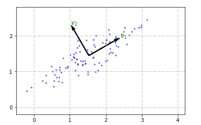

上图中，很明显，把数据投影在在$\mathbf v_1$方向，方差最大。

附[代码](https://nbviewer.jupyter.org/github/xuxiangwen/xuxiangwen.github.io/blob/master/_notes/05-ai/50-my-course/machine_learning/c0002.ipynb#PCA原理)。

### 协方差矩阵

`协方差矩阵的特征向量矩阵`就是PCA所寻找的坐标系。

首先来看，如何来获取第一个坐标轴，也就是方差最大的方向。方差定义如下。
$$
S^2 =  \frac 1 n \sum_{i=1}^n (x_i - \bar x )^2
$$
其中$\bar x = \frac 1 n \sum_{i=1}^n  x_i$，表示均值。设$x = \begin{bmatrix} x_1 \\ x_2 \\ \vdots \\ x_n  \end{bmatrix} $，则方差可以用向量来表示。
$$
S^2 =  \frac 1 n (\mathbf x- \bar x)^{\mathbf T}(\mathbf x- \bar x)
$$
设$n \times m $阶矩阵$\mathbf X $是原始的数据，其中每个行向量代表一个样本，每个样本包含$m$个变量。向量$\mathbf u$是一个单位向量，同时也是所寻找的第一个（使得方差最大） 坐标轴，则$\mathbf {X} \cdot \mathbf {u}$表示各个行向量（样本）在$\mathbf u$上的投影。则方差变成：
$$
S^2 =  \frac 1 n (\mathbf {X} \cdot \mathbf {u}- \overline {\mathbf {X} \cdot \mathbf {u}})^{\mathbf T}(\mathbf {X} \cdot \mathbf {u}- \overline {\mathbf {X} \cdot \mathbf {u}}) \tag 1
$$
设$\mathbf X = \begin{bmatrix} \mathbf {x_1} & \mathbf {x_2} & \cdots &  \mathbf {x_m} \end{bmatrix} $，$\mathbf u = \begin{bmatrix} u_1 \\ u_2 \\ \vdots \\ u_m \end{bmatrix}$，$ \overline {\mathbf {X}} =\begin{bmatrix} \overline{\mathbf {x_1}} & \overline{\mathbf {x_2}} & \cdots &  \overline{\mathbf {x_m}} \end{bmatrix}$，表示$m$个变量各自的平均值，则
$$
\begin{align}
\overline {\mathbf {X} \cdot \mathbf {u}} &= \overline {u_1\mathbf {x_1} + u_2\mathbf {x_2} +\cdots + u_m \mathbf {x_m} } \\
\overline {\mathbf {X} \cdot \mathbf {u}} &= u_1 \overline {\mathbf {x_1}} + u_2 \overline {\mathbf {x_2}} + \cdots + u_m \overline {\mathbf {x_m}}  \\
\overline {\mathbf {X} \cdot \mathbf {u}} &=  
\begin{bmatrix} \overline{\mathbf {x_1}} & \overline{\mathbf {x_2}} & \cdots &  \overline{\mathbf {x_m}} \end{bmatrix} \cdot \mathbf {u} \\
\overline {\mathbf {X} \cdot \mathbf {u}} &=  \overline {\mathbf {X}} \cdot \mathbf {u} 
\end{align}
$$
上面结果代入公式$(1)$
$$
\begin{align}
S^2 &=  \frac 1 n (\mathbf {X} \cdot \mathbf {u}- \overline {\mathbf {X}} \cdot \mathbf {u} )^{\mathbf T}(\mathbf {X} \cdot \mathbf {u}- \overline {\mathbf {X}} \cdot \mathbf {u} ) \\
S^2 &=  \frac 1 n ((\mathbf {X} - \overline {\mathbf {X}}) \cdot \mathbf {u} )^{\mathbf T}((\mathbf {X} - \overline {\mathbf {X}}) \cdot \mathbf {u} ) \\
S^2 &= \frac 1 n \mathbf {u^T}(\mathbf {X}  - \overline {\mathbf {X}})^{\mathbf T}(\mathbf {X}  - \overline {\mathbf {X}}) \mathbf {u}
\end{align}
$$
设$\mathbf A = \frac 1 n  (\mathbf {X}  - \overline {\mathbf {X}})^{\mathbf T}(\mathbf {X}  - \overline {\mathbf {X}})$，刚好是[协方差矩阵](https://zh.wikipedia.org/wiki/%E5%8D%8F%E6%96%B9%E5%B7%AE%E7%9F%A9%E9%98%B5)。公式变成
$$
S^2 = \mathbf {u^T} \mathbf A \mathbf {u}
$$
很明显，由于$\mathbf A $是对称矩阵，根据特征值和特征向量定义，必然可以表示为$\mathbf{A} =  \mathbf{V} \mathbf {\Lambda} \mathbf{V^T}$，则
$$
S^2 = \mathbf {u^T} \mathbf{V} \mathbf {\Lambda} \mathbf{V^T}\mathbf {u} \\
S^2 = (\mathbf{V^T}\mathbf {u})^{\mathbf T} \mathbf {\Lambda} \mathbf{V^T}\mathbf {u}
$$
设

- $\mathbf {\Lambda} = diag(\lambda_1, \lambda_2, \cdots, \lambda_m )$，而且满足$\lambda_1 >= \lambda_2 >= \cdots >= \lambda_m$

- $\mathbf {u^{'}} = \mathbf{V^T}\mathbf {u} = \begin{bmatrix} u_1^{'} \\ u_2^{'} \\ \vdots \\ u_m^{'}\end{bmatrix} $，它可以看成$\mathbf u$在空间$\mathbf V$上的坐标，由于$\mathbf V$是正交矩阵，$\mathbf {u^{'}}$也是一个单元向量。

公式变成
$$
\begin{align}
S^2 &= (\mathbf {u^{'}})^{\mathbf T} \mathbf {\Lambda} \mathbf {u^{'}} \\
S^2 &= \begin{bmatrix} u_1^{'} & u_2^{'} & \cdots & u_m^{'}\end{bmatrix}  diag(\lambda_1, \lambda_2, \cdots, \lambda_m )  \begin{bmatrix} u_1^{'} \\ u_2^{'} \\ \vdots \\ u_m^{'}\end{bmatrix} \\
S^2 &=   \lambda_1(u_1^{'})^2 + \lambda_2(u_2^{'})^2 + \cdots + \lambda_n(u_m^{'})^2
\end{align}
$$
由于$\mathbf {u^{'}}$是一个单元向量，即$(u_1^{'})^2 + (u_2^{'})^2 + \cdots + (u_m^{'})^2=1$，则
$$
S^2 <=  \lambda_1
$$
当且仅当$\mathbf {u^{'}} = \begin{bmatrix} 1 \\ 0 \\ \vdots \\ 0\end{bmatrix} $时，方差取最大值，根据定义$ \mathbf {u^{'}} = \mathbf{V^T}\mathbf {u}  $，可以得到
$$
\mathbf {u^{'}} = \mathbf{V^T}\mathbf {u} = \begin{bmatrix} 1 \\ 0 \\ \vdots \\ 0\end{bmatrix}
$$
设$\mathbf V = \begin{bmatrix} \mathbf {v_1} & \mathbf {v_2} & \cdots &  \mathbf {v_m} \end{bmatrix}$，则

当且仅当$\mathbf {u} =  \mathbf {v_1}$时，投影后的方差取最大值。同理，可以依次推出第二，第三，以及其它的坐标轴刚好对应$\mathbf {v_2} , \mathbf {v_3} ,  \cdots ,  \mathbf {v_m} $。也就是说`协方差矩阵的特征向量矩阵`就是我们所寻找的坐标系。

### 手写数字识别

[MNIST](http://yann.lecun.com/exdb/mnist/)数据集是著名的手写数字数据集，被誉为数据科学领域的`果蝇`。

 

首先使用SVM算法进行分类，用准确率来评估模型。

#### 

 https://blog.csdn.net/cicilover/article/details/77506894  【**PCA－手写字体图片识别** 】：有网上数据集链接， 里面显示pca压缩到二维的图片还不错。

 https://blog.csdn.net/weixin_38748717/article/details/78847452  【手写数字识别】：里面图片预览的代码好像不错

 https://www.jianshu.com/p/6dda00f382ad 【PCA降噪与人脸识别】：降噪的例子还不错。

google的高维数据可视化工具：  http://projector.tensorflow.org/  可以显示手写识别的效果。和自己的效果做比较。作为介绍 可视化效果，的确非常牛。

## 因子分析

## 奇异值分解

## 向量导数

向量导数非常重要，是机器学习中进行梯度下降计算的基本方式。

### 基本运算

向量导数有些抽象，很多人觉得有些难懂。但这就像小孩子学习乘法一样，开始也觉得难懂，可一旦小孩子背熟99乘法表后，便能快速掌握乘法。向量导数也是如此，只要能理解基本远算公式，并熟练推导它们，一定可以快速掌握向量导数，甚至矩阵导数。

设
$$
\mathbf u = \begin{bmatrix} u_1 \\ u_2 \\ \vdots \\ u_n \end{bmatrix},\ 
\mathbf v = \begin{bmatrix} u_1 \\ u_2 \\ \vdots \\ u_n \end{bmatrix},\ 
\mathbf w = \begin{bmatrix} w_1 \\ w_2 \\ \vdots \\ w_n \end{bmatrix}
$$
则，行向量对于列向量得导数定义如下：
$$
\frac{\partial \mathbf {u}^\mathbf{T}}{\partial \mathbf {w}} = 
\begin{bmatrix}
\frac{\partial  {u_1}}{\partial {w_1}} & 
\frac{\partial {u_2}}{\partial {w_1}} &
\cdots & 
\frac{\partial {u_n}}{\partial {w_1}} \\
\frac{\partial  {u_1}}{\partial {w_2}} & 
\frac{\partial {u_2}}{\partial {w_2}} &
\cdots & 
\frac{\partial {u_n}}{\partial {w_2}} \\
\vdots & \vdots & \ddots & \vdots \\
\frac{\partial  {u_1}}{\partial {w_n}} & 
\frac{\partial {u_2}}{\partial {w_n}} &
\cdots & 
\frac{\partial {u_n}}{\partial {w_n}} 
\end{bmatrix}
$$
上面公式中，行向量$\mathbf {u}^\mathbf{T}$的每一个成员和列向量$\mathbf {w}$的每一个成员分别进行求导，这样其结果刚好是一个矩阵。进一步推导，可以得到下面的公式：

$\frac{\partial \mathbf {u}^\mathbf{T}}{\partial \mathbf {u}} = \frac{\partial \mathbf {v}^\mathbf{T}}{\partial \mathbf {v}} = \frac{\partial \mathbf {w}^\mathbf{T}}{\partial \mathbf {w}} = \mathbf{I_n} $

$\frac{\partial \mathbf {u}^\mathbf{T}\mathbf {v}}{\partial \mathbf {w}} = 
\frac{\partial \mathbf {u}^\mathbf{T}}{\partial \mathbf {w}} \cdot \mathbf {v} + \frac{\partial \mathbf {v}^\mathbf{T}}{\partial \mathbf {w}} \cdot \mathbf {u} $

$\frac{\partial \mathbf {w}^\mathbf{T}\mathbf {w}}{\partial \mathbf {w}} = 2\mathbf {w}$

再设，$\mathbf A$是$m \times n$阶矩阵，$\mathbf B$是$n \times n $阶矩阵，而且它们的每个元素不包含对于$\mathbf w $的表达式，可以推得：

$\frac{\partial (\mathbf{A}\mathbf {w})^\mathbf{T}}{\partial \mathbf {w}} = 
\frac{\partial \mathbf {w}^\mathbf{T}\mathbf{A}^\mathbf{T}}{\partial \mathbf {w}} = 
\mathbf{A}^\mathbf{T}  $

$\frac{\partial \mathbf{A}\mathbf {w}}{\partial \mathbf {w}^\mathbf{T}} = \mathbf{A}  $

$\frac{\partial \mathbf {w}^\mathbf{T} \mathbf{B} \mathbf {w}} {\partial \mathbf {w}} = 
\frac {\partial \mathbf {w}^\mathbf{T}} {\partial \mathbf {w}} \cdot \mathbf{B} \mathbf {w} +
\frac {\partial (\mathbf{B} \mathbf {w})^\mathbf{T}} {\partial \mathbf {w}} \cdot \mathbf {w}=
(\mathbf{B} + \mathbf{B}^\mathbf{T})\cdot \mathbf {w}
$ 

###  复合函数

首先定义一下列向量对于列向量的导数：
$$
\frac{\partial \mathbf {u}}{\partial \mathbf {w}} = 
\begin{bmatrix}
\frac{\partial  {u_1}}{\partial {w_1}} \\
\frac{\partial  {u_2}}{\partial {w_2}} \\
\vdots \\
\frac{\partial  {u_n}}{\partial {w_n}}
\end{bmatrix}
$$

上面公式中，向量$\mathbf {u}$的每一个成员和向量$\mathbf {w}$的每一个成员一一进行求导，其结果是一个同阶的向量。

然后来看函数。

设$f, g$是函数，其输入是向量或矩阵，输出也是同阶的向量或矩阵。

则

- 被导的是列向量，从右到左展开复合求导

  $ \frac{\partial f(g(\mathbf {w}^\mathbf{T}))}{\partial \mathbf {w}} = 
  \frac{\partial g(\mathbf {w}^\mathbf{T})}{\partial \mathbf {w}} \cdot  \frac{\partial f(g(\mathbf {w}^\mathbf{T}))}{\partial g(\mathbf {w})}  $ 

- 被导的是行向量，从左到右展开复合求导

  $ \frac{\partial f(g(\mathbf {w}))}{\partial \mathbf {w}^\mathbf{T}} = 
   \frac{\partial f(g(\mathbf {w}))}{\partial g(\mathbf {w}^\mathbf{T})}  \cdot  \frac{\partial g(\mathbf {w})}{\partial \mathbf {w}^\mathbf{T}} $

设

$
A =  
\begin{bmatrix} 
a_1^\mathrm{T}\\
a_2^\mathrm{T}\\
...\\
...\\
a_m^\mathrm{T}
\end{bmatrix}
, 
v = Au = 
\begin{bmatrix} 
a_1^\mathrm{T} \cdot u\\
a_2^\mathrm{T} \cdot u\\
...\\
...\\
a_m^\mathrm{T} \cdot u
\end{bmatrix}
,
w = f(u) 
,
x = f(Au)= f(v) 
$

则

$
\frac {\partial f(\mathbf {u}^{\mathbf {T}})} {\partial \mathbf {u} } =
\begin{bmatrix} 
\frac {\partial f(\mathbf {u} _1)} {\partial \mathbf {u} _1} & 0 & 0 & 0 & 0 \\
0 & ... & 0 & 0 & 0 \\
0 & 0 & \frac {\partial f(\mathbf {u} _i)} {\partial \mathbf {u} _i} & 0 & 0 \\
0 & 0 & 0 & ... & 0 \\
0 & 0 & 0 & 0 & \frac {\partial f(\mathbf {u} _d)} {\partial \mathbf {u} _d}
\end{bmatrix} =
diag(\frac {\partial f(\mathbf {u} _1)} {\partial \mathbf {u} _1}_, ... \frac {\partial f(\mathbf {u} _i)} {\partial \mathbf {u} _i}_, ... \frac {\partial f(\mathbf {u} _d)} {\partial \mathbf {u} _d})
$

## 习题

1. 

   

2. 

## 参考

- [机器学习的数学基础：向量篇](https://www.hahack.com/math/math-vector/ )
- [什么是矩阵](https://www.jianshu.com/p/f9826690133c)
- [矩阵乘法](https://zh.wikipedia.org/wiki/%E7%9F%A9%E9%99%A3%E4%B9%98%E6%B3%95)
- [矩阵乘法的本质是什么？](https://www.zhihu.com/question/21351965/answer/176777987 )
- [支持向量机通俗导论（理解SVM的三层境界）](https://blog.csdn.net/v_JULY_v/article/details/7624837)
- [百度百科：线性变换](https://baike.baidu.com/item/%E7%BA%BF%E6%80%A7%E5%8F%98%E6%8D%A2)
- [回顾线性空间](https://scientificrat.com/2017/10/11/%E5%9B%9E%E9%A1%BE%E7%BA%BF%E6%80%A7%E7%A9%BA%E9%97%B4/)
- [线性代数中，特征值与特征向量在代数和几何层面的实际意义是什么](https://www.zhihu.com/question/20507061)
-  [The Matrix Cookbook](https://www.math.uwaterloo.ca/~hwolkowi/matrixcookbook.pdf)
-  [机器学习中的线性代数之矩阵求导](http://blog.csdn.net/u010976453/article/details/54381248)

