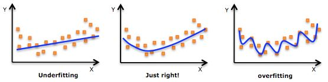
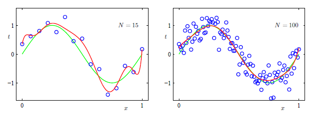

##  1. What's Machine Learning

[Arthur Samuel](https://en.wikipedia.org/wiki/Arthur_Samuel) (1959): The field of study that gives computers the ability to learn without being explicitly programmed.

[Tom M. Mitchell](https://en.wikipedia.org/wiki/Tom_M._Mitchell) (1998) : A computer program is said to learn from experience *E* with respect to some class of tasks *T* and performance measure *P* if its performance at tasks in *T*, as measured by *P*,  improves with experience *E*.  

Tom M. Mitchell的定义，更加的正式，被大多数人接受。

**例子**

垃圾邮件分类器

E = 查看已经大量已标记为垃圾和非垃圾邮件

T = 判定一封邮件是否垃圾邮件

P = 预测的准确率

**类型**

所有的机器学习问题，可以分成：

- 监督学习（Supervised learning）：训练数据的样本包含输⼊向量以及对应的⽬标向量的应⽤。
  - 回归（regression）
  - 分类（classification）
- 无监督学习（Unsupervised learning）：训练数据由⼀组输⼊向量x组成，没有任何对应的⽬标值。
  - 比如：
    - Organize computing clusters
    - Social network analysis
    - Market segmentation
    - Astronomical Market segmentation data analysis
  
  在实际项目中，由于数据标记的工作量和难度较大，很多的时候还是需要采用无监督的方法来进行学习。

- 强化学习（reinforcement learning）：关注的问题是在给定的条件下，找到合适的动作，使得奖励达到最⼤值。

**概念**

- 泛化（generalization）：模型正对（和训练集不同的）未知样本正确分类的能⼒。

- 过拟合（over-fitting）： 指过于精确地匹配特定数据集的结果，以致于无法拟合其他数据或预测未来的观察结果。  训练集上表现很好，但是在测试集上表现很差，泛化性能差。 

    

  对于同一模型，增加训练的数据量，会减少过拟合的情况。

  

- 正则化（regularization）：一种控制过拟合的技术，到给误差（Cost）函数增加⼀个惩罚项，使得系数不会达到很⼤的值。

- 

  

**习题**

参见 [question.md](..\..\question.md) 7,8,9

## 2. Linear Regression

线性回归虽然简单，但麻雀虽小，五脏俱全。而且线性回归的扩展很强，很多高大上的算法和线性回归都有渊源。

- 模型
- 实验
- 扩展

## ch