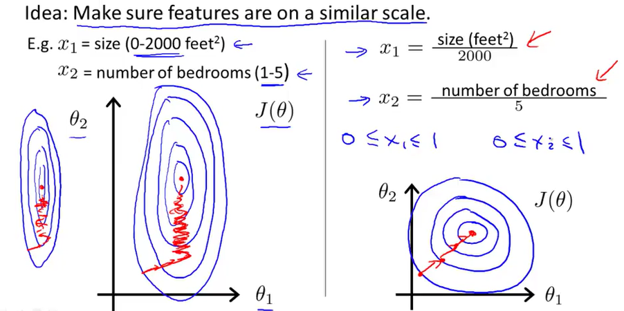

# Week 2

## MATLAB Online 

<https://matlab.mathworks.com/> 

microsheen@gmail.com/QAZ...

[MATLAB Drive](https://drive.matlab.com/) 

## 多元线性回归（Multivariate Linear Regression）

### Feature归一化（Normalization）

如果feature的数值差异非常大，在梯度下降时将会 出现抖动情况，使得梯度下降的速度变慢。

常用的归一化方法有: 

- Min-Max Normalization

  $x^{'}= \frac  {x - x_{min}}  {x_{max} - x_{min}}$

- mean normalization

  $x^{'} = \frac  {x - u}  {x_{max} - x_{min}}$  

  和此类似的方式是标准化（Standardization）

   $x^{'} = \frac  {x - u}  {\sigma}$

  $u$是均值，$\sigma$是标准方差。

