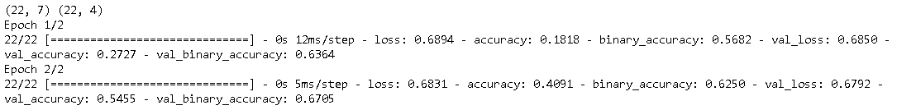
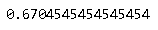
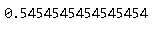

## Accuracy vs. BinaryAccuracy

Multi-Label的分类任务中，一个样本可以属于一个或多个Label。这种情况下，BinaryAccuracy和Accuracy其计算逻辑是不同的。

~~~python
from tensorflow.keras.models import Sequential
from tensorflow.keras.layers import Dense
from tensorflow.keras.layers import Embedding
from tensorflow.keras.layers import GlobalAveragePooling1D
from tensorflow.keras import metrics
from sklearn.metrics import accuracy_score
import numpy as np

X = [[1,0,0,0,0,0,0],
      [1,2,0,0,0,0,0],
      [3,0,0,0,0,0,0],
      [3,4,0,0,0,0,0],
      [2,0,0,0,0,0,0],
      [3,0,0,0,0,0,0],
      [4,0,0,0,0,0,0],
      [2,3,0,0,0,0,0],
      [1,2,3,0,0,0,0],
      [1,2,3,4,0,0,0],
      [0,0,0,0,0,0,0],
      [1,1,2,3,0,0,0],
      [2,3,3,4,0,0,0],
      [4,4,1,1,2,0,0],
      [1,2,3,3,3,3,3],
      [2,4,2,4,2,0,0],
      [1,3,3,3,0,0,0],
      [4,4,0,0,0,0,0],
      [3,3,0,0,0,0,0],
      [1,1,4,0,0,0,0],
      [3,3,0,1,0,0,0],
      [1,1,4,0,2,0,0]
    ]

Y = [[1,0,0,0],
    [1,1,0,0],
    [0,0,1,0],
    [0,0,1,1],
    [0,1,0,0],
    [0,0,1,0],
    [0,0,0,1],
    [0,1,1,0],
    [1,1,1,0],
    [1,1,1,1],
    [0,0,0,0],
    [1,1,1,0],
    [0,1,1,1],
    [1,1,0,1],
    [1,1,1,0],
    [0,1,0,0],
    [1,0,1,0],
    [0,0,0,1],
    [0,0,1,0],
    [1,0,0,1],
    [0,0,1,0],
    [1,0,0,1]
    ]

X = np.array(X)
Y = np.array(Y)
print(X.shape, Y.shape)

MAXLEN = 7
MAXFEATURES = 4
NUM_CLASSES = 4
model = Sequential()
model.add(Embedding(MAXFEATURES+1,
                    50,
                    input_length=MAXLEN))
model.add(GlobalAveragePooling1D())
model.add(Dense(NUM_CLASSES, activation='sigmoid'))
model.compile(loss='binary_crossentropy',
              optimizer='adam',
              metrics=['accuracy', 'binary_accuracy'])
model.fit(X, Y,
          batch_size=4,
          epochs=2,
          validation_data=(X, Y))
~~~

从上面的结果，可以看到val_accuarcy和val_binary_accuarcy是不同的。下面来手工计算，看看它们怎么的出来的。首先是val_binary_accuarcy。

~~~python
y_pred = model.predict(X) 
y_true = Y

accuracy_score(y_true.ravel(), y_pred.ravel()>=0.5) 
~~~

也可以`metrics.BinaryAccuracy`和`metrics.Accuracy`来计算。

~~~python
m = metrics.BinaryAccuracy()
m.update_state(y_true, y_pred>0.5)
print(m.result().numpy())

m = metrics.Accuracy()
m.update_state(y_true, y_pred>0.5)
print(m.result().numpy())
~~~

下面再看val_accuarcy。

~~~python
y_true1 = y_true.argmax(axis=-1) 
y_pred1 = y_pred.argmax(axis=-1)
print(accuracy_score(y_true1, y_pred1))
~~~

上面的代码中，对于每一个样本，获取其最有可能属于的Label，这显然是不对的。当指定accuracy作为metrics时，tensorflow会自动根据情况，使用相应的metric，而这有时会产生一些错误（尤其设置不对的情况下）。因此，对于Multi-Label的分类任务，建议明确指定使用binary_accuracy或BinaryAccuracy。

