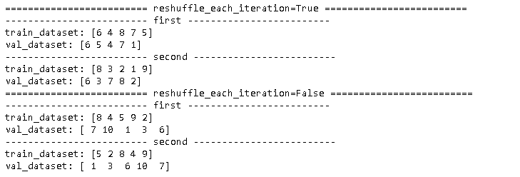
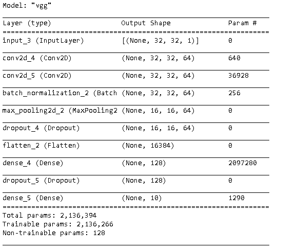
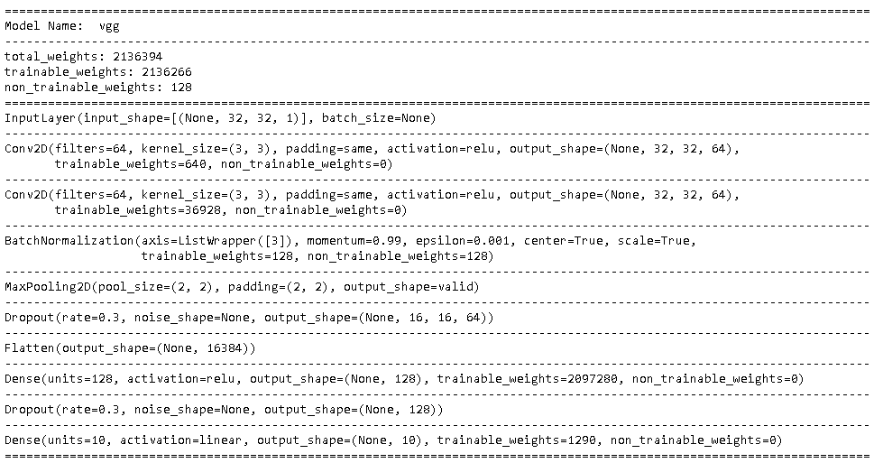
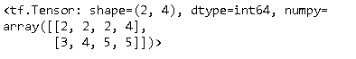
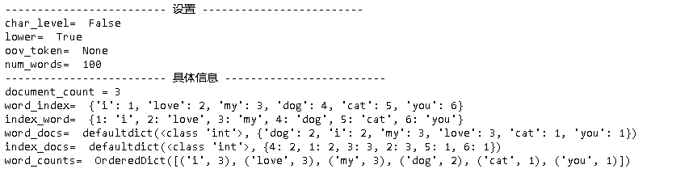

## Scratch

### reshuffle_each_iteration在shuffle中的作用

 如果拆分数据集，记得reshuffle_each_iteration必须设置为False，否则两个拆分后的数据集会有重复数据。

~~~python
import tensorflow as tf
import numpy as np

train_data=np.array([1, 2, 3, 4, 5, 6, 7, 8, 9, 10])

def test_reshuffle_each_iteration(reshuffle_each_iteration):
    print('='*25, 'reshuffle_each_iteration={}'.format(reshuffle_each_iteration), '='*25)   
    train_val_dataset = tf.data.Dataset.from_tensor_slices(train_data) 
    train_val_dataset = train_val_dataset.shuffle(100, reshuffle_each_iteration = reshuffle_each_iteration)

    train_size = int(0.5*train_data.shape[0])
    train_dataset = train_val_dataset.take(train_size).shuffle(100, reshuffle_each_iteration = True).batch(5) 
    val_dataset = train_val_dataset.skip(train_size).shuffle(100, reshuffle_each_iteration = True).batch(5) 

    print('-'*25, 'first', '-'*25) 
    for data in train_dataset:
        print('train_dataset:', data.numpy())
       
    for data in val_dataset:
        print('val_dataset:', data.numpy())    

    print('-'*25, 'second', '-'*25)     
    for data in train_dataset:
        print('train_dataset:', data.numpy())

    for data in val_dataset:
        print('val_dataset:', data.numpy())      

test_reshuffle_each_iteration(True)

test_reshuffle_each_iteration(False)
~~~

下面顺便也贴一下sklearn里的train_test_split的使用。

~~~python
import numpy as np
from sklearn.model_selection import train_test_split

X, y = np.arange(10).reshape((5, 2)), range(5)
print('-'*25, 'origin', '-'*25)
print(X)
print(y)

X_train, X_test, y_train, y_test = train_test_split(X, y, test_size=0.33, random_state=42)

print('-'*25, 'train', '-'*25)
print(X_train)
print(y_train)

print('-'*25, 'test', '-'*25)
print(X_test)
print(y_test)
~~~

### 显示模型详细信息

~~~python
import numpy as np
import tensorflow as tf
from tensorflow.keras import Model, layers, optimizers, losses

gpus = tf.config.experimental.list_physical_devices(device_type='GPU')
tf.config.experimental.set_virtual_device_configuration(
    gpus[0],
    [tf.config.experimental.VirtualDeviceConfiguration(memory_limit=1024)]
)

def get_block(x, filters, conv_count, kernel_size=(3, 3), padding='same', use_bn=True, 
              use_dropout=True, drop_out_rate=0.3):
    for i in range(conv_count):
        x = layers.Conv2D(filters, kernel_size, padding=padding, activation='relu')(x)
    if use_bn: x = layers.BatchNormalization()(x)
    x = layers.MaxPooling2D((2, 2))(x)
    if use_dropout: x = layers.Dropout(drop_out_rate)(x)
    return x    

def get_model(input_shape, learning_rate=0.001, use_bn=True, use_dropout=True, drop_out_rate=0.3):   
    input = layers.Input(shape=input_shape)
    
    x = get_block(input, 64, conv_count=2, use_bn=use_bn, use_dropout=use_dropout, drop_out_rate=drop_out_rate)
        
    x = layers.Flatten()(x)
    x = layers.Dense(128, activation='relu')(x)
    if use_dropout: x = layers.Dropout(drop_out_rate)(x)  
 
    x = layers.Dense(10)(x)
    
    model = Model(inputs=input, outputs=x, name='vgg') 
    model.compile(optimizer=optimizers.Adam(learning_rate=learning_rate),
                  loss=losses.SparseCategoricalCrossentropy(from_logits=True),
                  metrics=['accuracy'])      
    model.checkpoint_path = './checkpoints/{}/checkpoint'.format(model.name)
    return model   

# 创建模型
use_bn = True
use_dropout = True
drop_out_rate = 0.3
model = get_model((32, 32, 1), use_bn=use_bn, use_dropout=use_dropout, drop_out_rate=drop_out_rate)
model.summary()
~~~

更加完整的信息显示如下：

~~~python
def get_weight_num(obj, trainable=True):
    '''得到模型可训练参数的个数'''
    if trainable:
        return int(np.sum([np.prod(p.shape) for p in obj.trainable_weights]))
    else:
        return int(np.sum([np.prod(p.shape) for p in obj.non_trainable_weights]))

def show_model(model):
    print('='*120)
    if model.name is not None:
        print('Model Name: ', model.name)       
        print('-'*120)
    trainable_weights =  get_weight_num(model)   
    non_trainable_weights =  get_weight_num(model, False)  
    total_weights = trainable_weights + non_trainable_weights
    print('total_weights: {}'.format(total_weights))
    print('trainable_weights: {}'.format(trainable_weights))
    print('non_trainable_weights: {}'.format(non_trainable_weights))  
    print('='*120)
    for i, layer in enumerate(model.layers):
        if i>0: print('-'*120) 
        if isinstance(layer, tf.python.keras.layers.convolutional.Conv2D):
            print("Conv2D(filters={}, kernel_size={}, padding={}, activation={}, output_shape={},\n       trainable_weights={}, non_trainable_weights={})".format(
                layer.filters, layer.kernel_size, layer.padding, layer.activation.__name__, layer.output.shape, get_weight_num(layer), get_weight_num(layer, False)))
        elif isinstance(layer, tf.python.keras.engine.input_layer.InputLayer):
            print("InputLayer(input_shape={}, batch_size={})".format(
                layer.input_shape, layer.batch_size))  
        elif isinstance(layer, tf.python.keras.layers.pooling.MaxPooling2D):
            print("MaxPooling2D(pool_size={}, padding={}, output_shape={})".format(
                layer.pool_size, layer.strides, layer.padding, layer.output.shape)) 
        elif isinstance(layer, tf.python.keras.layers.core.Dense):
            print("Dense(units={}, activation={}, output_shape={}, trainable_weights={}, non_trainable_weights={})".format(
                layer.units, layer.activation.__name__, layer.output.shape, get_weight_num(layer), get_weight_num(layer, False)))  
        elif isinstance(layer, tf.python.keras.layers.core.Flatten):
            print("Flatten(output_shape={})".format(layer.output.shape))        
        elif isinstance(layer, tf.python.keras.layers.core.Dropout ):
            print("Dropout(rate={}, noise_shape={}, output_shape={})".format(layer.rate, layer.noise_shape, layer.output.shape))     
        elif isinstance(layer, tf.python.keras.layers.normalization_v2.BatchNormalization ):
            print("BatchNormalization(axis={}, momentum={}, epsilon={}, center={}, scale={},\n                   trainable_weights={}, non_trainable_weights={})".format(
                layer.axis, layer.momentum, layer.epsilon, layer.center, layer.scale, get_weight_num(layer), get_weight_num(layer, False)))            
        else:
            print(layer)           
    print('='*120)   
show_model(model)
~~~

### tf.clip_by_value

输入一个张量，把其中的每一个元素的值都压缩在min和max之间。小于min的让它等于min，大于max的元素的值等于max。

~~~python
import tensorflow as tf;
import numpy as np;
 
A = np.array([[1,1,2,4], [3,4,8,5]])
tf.clip_by_value(A, 2, 5)
~~~

### Tokenizer

- https://keras-cn.readthedocs.io/en/latest/preprocessing/text/
- http://codewithzhangyi.com/2019/04/23/keras-tokenizer/

#### 构造器参数

- **num_words**: 默认是`None`处理所有字词，但是如果设置成一个整数，那么最后返回的是最常见的、出现频率最高的`num_words`个字词。一共保留 `num_words-1` 个词。
- **filters**: 过滤一些特殊字符，默认上文的写法就可以了。
- **lower**: 是否全部转为小写。
- **split**: 分词的分隔符字符串，默认为空格。因为英文分词分隔符就是空格。
- **char_level**: 分字。
- **oov_token**: if given, it will be added to word_index and used to replace out-of-vocabulary words during text_to_sequence calls

#### 方法

| 方法                                | 参数                                                         | 返回值                                                       |
| :---------------------------------- | :----------------------------------------------------------- | :----------------------------------------------------------- |
| fit_on_texts(texts)                 | texts：要用以训练的文本列表                                  | -                                                            |
| texts_to_sequences(texts)           | texts：待转为序列的文本列表                                  | 序列的列表，列表中每个序列对应于一段输入文本                 |
| texts_to_sequences_generator(texts) | texts：待转为序列的文本列表                                  | 本函数是texts_to_sequences的生成器函数版，返回每次调用返回对应于一段输入文本的序列 |
| texts_to_matrix(texts, mode)        | texts：待向量化的文本列表；mode：‘binary’，‘count’，‘tfidf’， ‘freq’之一，默认为‘binary’ | 形如(len(texts), nb_words)的numpy array                      |
| fit_on_sequences(sequences)         | sequences：要用以训练的序列列表                              | -                                                            |
| sequences_to_matrix(sequences)      | sequences：待向量化的序列列表； mode：同上                   | 返回值：形如(len(sequences), nb_words)的numpy array          |

代码示例：

~~~python
from tensorflow.keras.preprocessing.text import Tokenizer

sentences = [
    'i love my dog, i',
    'I, love my cat',
    'You love my dog!'
]

tokenizer = Tokenizer(num_words = 100)
tokenizer.fit_on_texts(sentences)

print('-'*25, '设置', '-'*25)
print('char_level= ', tokenizer.char_level)         # 是否是字符级别
print('lower= ', tokenizer.lower)                   # 大小写
print('oov_token= ', tokenizer.oov_token)           # out of vocabulary的token			
print('num_words= ', tokenizer.num_words)           # 最大word个数

print('-'*25, '具体信息', '-'*25)
print('document_count =', tokenizer.document_count) # 文档数量
print('word_index= ', tokenizer.word_index)         # word:index字典
print('index_word= ', tokenizer.index_word)         # index:word字典
print('word_docs= ', tokenizer.word_docs)           # word在文档出现的次数（同一文档出现多次算一次）
print('index_docs= ', tokenizer.index_docs)         # 同上，只是key是index
print('word_counts= ', tokenizer.word_counts)       # word出现的次数

~~~

## 资源

### [Keras中文文档](https://keras.io/zh/)

由于tensorflow2.0采用了keras的API，看这里更加的清晰。

### [Colab](https://colab.research.google.com/)

Colaboratory（简称Colab）是一个免费的 Jupyter 笔记本环境，不需要进行任何设置就可以使用，并且完全在云端运行。借助 Colab，您可以编写和执行代码、保存和共享分析结果，以及利用强大的计算资源，所有这些都可通过浏览器免费使用。

在Colab中，可以code和text之间切换。

- code to text： Ctrl + m + m
- text to code: Ctrl + m + y

### [AI Hub](https://aihub.cloud.google.com/)

Google正在推出两种新工具，一种是专有工具，另一种是开放源代码：AI Hub和Kubeflow管道。两者均旨在协助数据科学家设计，启动和跟踪其机器学习算法。

借助AI Hub和Kubeflow管道，Google 将于 1月份发布其较早版本的Cloud AutoML，并继续其简化和加快客户适应Google AI技术和服务的能力的战略。Cloud ML Platform的工程总监Hussein Mehanna在博客中写道：

我们的目标是使AI覆盖所有业务。但这意味着降低准入门槛。这就是为什么我们在构建所有AI产品时会牢记三个想法的原因：简化它们，使更多的企业可以采用它们，使它们对最广泛的组织有用，并使其快速发展，以便企业可以迭代并更快地获得成功。

Google引入了AI Hub，使AI可以更广泛地接触企业，使他们更容易发现，共享和重用现有工具和工作。此外，AI Hub是ML内容的一站式目的地，例如管道，Jupyter笔记本和TensorFlow模块。根据Mehanna所说的好处是：

由Google Cloud AI，Google Research和其他Google团队开发的高质量ML资源对所有企业都是公开可用的。

> 好像就是之前说的seedbank。

### TensorFlow API Document

https://www.tensorflow.org/api_docs/python/tf

### [Keras Applictions](https://keras.io/api/applications/)

Kera的应用模块Application提供了带有预训练权重的Keras模型，这些模型可以用来进行预测、特征提取和finetune

### [Tensorflow Hub](https://www.tensorflow.org/hub)

TensorFlow Hub 是一个包含经过训练的机器学习模型的代码库，这些模型稍作调整便可部署到任何设备上。您只需几行代码即可重复使用经过训练的模型，例如 BERT 和 Faster R-CNN。

### Books

-  [Advanced Deep Learning with TensorFlow 2 and Keras Apply DL, GANs, VAEs, deep RL, unsupervised learning, object detection and segmentation, and more, 2nd Edition by Rowel Atienza (z-lib.org).pdf](..\..\..\..\ai\book\deep-learning\Advanced Deep Learning with TensorFlow 2 and Keras Apply DL, GANs, VAEs, deep RL, unsupervised learning, object detection and segmentation, and more, 2nd Edition by Rowel Atienza (z-lib.org).pdf) 
  - 代码：https://github.com/PacktPublishing/Advanced-Deep-Learning-with-Keras
-  [Deep Learning with TensorFlow 2.0 and Keras Regression, ConvNets, GANs, RNNs, NLP  more with TF 2.0 and the Keras API by Antonio Gulli, Amita Kapoor, Sujit Pal (z-lib.org).pdf](..\..\..\..\ai\book\deep-learning\Deep Learning with TensorFlow 2.0 and Keras Regression, ConvNets, GANs, RNNs, NLP  more with TF 2.0 and the Keras API by Antonio Gulli, Amita Kapoor, Sujit Pal (z-lib.org).pdf) 
-  [Hands-On Machine Learning with Scikit-Learn, Keras, and Tensorflow Concepts, Tools, and Techniques to Build Intelligent Systems by Aurélien Géron (z-lib.org) (1).pdf](..\..\..\..\ai\book\deep-learning\Hands-On Machine Learning with Scikit-Learn, Keras, and Tensorflow Concepts, Tools, and Techniques to Build Intelligent Systems by Aurélien Géron (z-lib.org) (1).pdf) 
-  [Python Machine Learning Machine Learning and Deep Learning with Python, scikit-learn, and TensorFlow 2 by Sebastian Raschka, Vahid Mirjalili (z-lib.org).pdf](..\..\..\..\ai\book\deep-learning\Python Machine Learning Machine Learning and Deep Learning with Python, scikit-learn, and TensorFlow 2 by Sebastian Raschka, Vahid Mirjalili (z-lib.org).pdf) 

