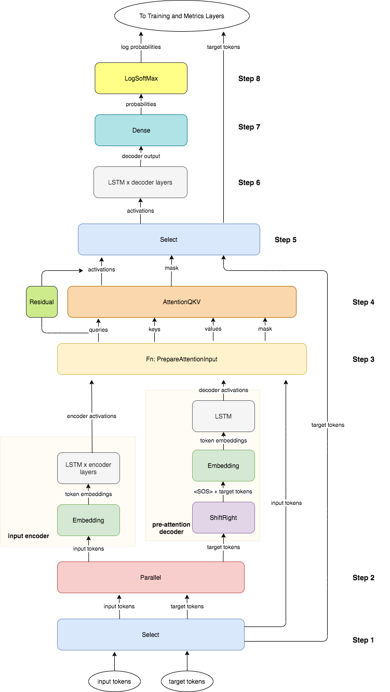
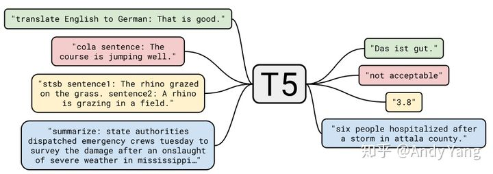
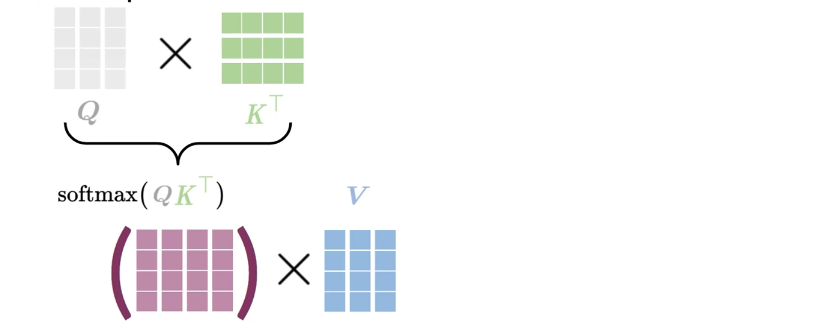
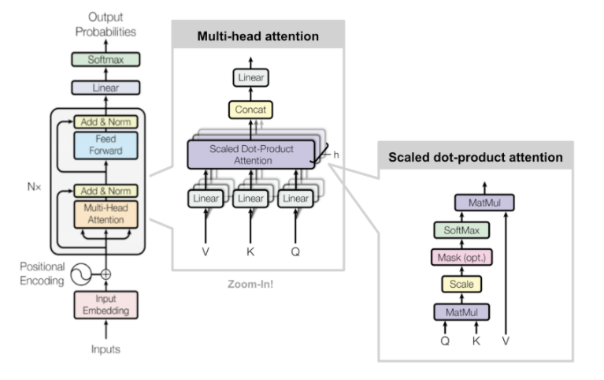
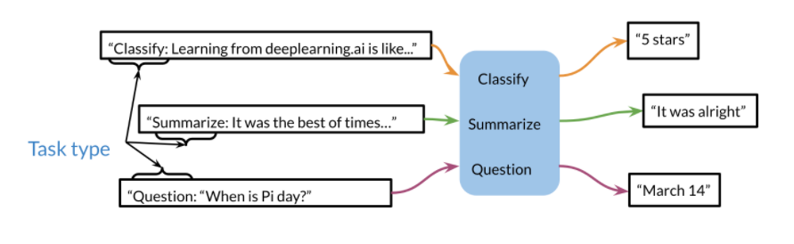

# [Natural Language Processing with Attention Models](https://www.coursera.org/learn/attention-models-in-nlp/home/welcome)

## Week 1: Neural Machine Translation

### Seq2seq to Attention 

Attention模型原理参见 [attention.md](..\..\20-ml\attention.md) 

Attention中的Key， Value来自Encoder的Hidden States，而Query来自Decoder的Hidden States

基本公式如下：
$$
Attention = Softmax(\mathbf {QK^T})\mathbf V
$$
从下图中，可以看出各个词语之间的权重。

### NMT（Neural Machine Translation）

- input表示为0， target表示为1。

  input和target都被复制了一份（Select([0, 1, 0, 1])）。input的第一份传给input encoder，另外一份传给input encoder。target的一份传给pre-attention decoder，另外一份传给了Select([0, 2])

- input encoder: 输入input，输出K，V

- pre-attention decoder：输入target，输出Q

  采用了[teacher forcing](https://blog.csdn.net/qq_30219017/article/details/89090690)

### Sampling and Decoding

在encoder完成hidden state的计算后，decoder开始来预测下一个token。decoder使用一定策略来生成这个token。常用的方法有：

- Greedy decoding

  每次选择概率最大的词。

- Random Sampling

  - Temperature 

- Beam Search

  首先需要确定一个`Beam Size`，这里设置为2，意思是每个`word`后面的分支考虑概率最大的那两个`words`。比如下面的例子，从下往上首先分成A、B两个words，然后继续往上传播，句子变成是AA/AB/BA/BB这四种情况（绿色虚线）。考虑到`Beam Size=2`，选择概率最大的两个，假设是AB/BA（橙色大箭头）。然后以选择的AB/BA继续向上传播，又出现了四种情况ABA/ABB/BBA/BBB，依然是选择综合概率最大的两个ABB/BBB。以此类推，直至句子结束。只要可以调整好`Beam Size`，就能够使用最小的计算量，得到最优的结果。

  

- 最小贝叶斯风险（Minimum Bayes Risk）

  还未完全理解。

  

### [C4_W1_Ungraded_Lab_Stack_Semantics.ipynb](http://15.15.166.35:18888/notebooks/eipi10/xuxiangwen.github.io/_notes/05-ai/54-tensorflow/attention-models-in-nlp/Week_1/C4_W1_Ungraded_Lab_Stack_Semantics.ipynb)

主要介绍 [Trax](../trax/README.md) 的Stack（栈）的特性。

对应代码如下：

~~~python
serial = tl.Serial(
    tl.Select([0, 1, 0, 1]), Addition(), Multiplication(), Addition(), tl.Residual()
)

# Initialization
x = (np.array([3]), np.array([4]))  # input

serial.init(shapes.signature(x))  # initializing serial instance

print("-- Serial Model --")
print(serial, "\n")
print("-- Properties --")
print("name :", serial.name)
print("sublayers :", serial.sublayers)
print("expected inputs :", serial.n_in)
print("promised outputs :", serial.n_out, "\n")

# Inputs
print("-- Inputs --")
print("x :", x, "\n")

# Outputs
y = serial(x)
print("-- Outputs --")
print("y :", y)
~~~

> 栈的好处在于，能够使得在构建Serial模型的时候，处理多Input和多Output的情况。只是采用这种方式，模型理解起来有些费劲。

### [C4_W1_Ungraded_Lab_Bleu_Score.ipynb](http://15.15.166.35:18888/notebooks/eipi10/xuxiangwen.github.io/_notes/05-ai/54-tensorflow/attention-models-in-nlp/Week_1/C4_W1_Ungraded_Lab_Bleu_Score.ipynb)

BLEU的介绍参见 [bleu.md](..\..\20-ml\bleu.md) 

在本例中，对于不同n-gram，采用了相同的系数$1/4$。
$$
BLEU = BP\Bigl(\prod_{i=1}^{4}p_i\Bigr)^{(1/4)}
$$

$$
BP = min\Bigl(1, e^{(1-( {r}/{c}))}\Bigr)
$$

$$
p_i = \frac {\sum_{snt \in{cand}}\sum_{i\in{snt}}min\Bigl(m^{i}_{cand}, m^{i}_{ref}\Bigr)}{w^{i}_{t}}
$$

where:

* $m^{i}_{cand}$, is the count of i-gram in candidate matching the reference translation.
* $m^{i}_{ref}$, is the count of i-gram in the reference translation.
* $w^{i}_{t}$, is the total number of i-grams in candidate translation.

在示例中，手工实现了句子层面的BLEU，**只是其中Candidate和Reference好像搞反了**。另外程序调用了`sacrebleu.corpus_bleu`来比较手工实现的结果。

### [C4_W1_Assignment.ipynb](http://15.15.166.35:18888/notebooks/eipi10/xuxiangwen.github.io/_notes/05-ai/54-tensorflow/attention-models-in-nlp/Week_1/C4_W1_Assignment.ipynb)

完整的NMT示例。基本内容如下：

#### Part 1：数据准备

##### 数据导入

数据来自[Opus](http://opus.nlpl.eu/)， Opus是一个包含多个特定领域的开源平行语料库，比如书籍、新闻、字幕、TED演讲、维基、技术手册等。本文中引入了opus/medical的数据。

##### Tokenization和格式化

- Tokenizing。调用trax.data.Tokenize()方法，词库选用ende_32k.subword。生成tokenized_train_stream和tokenized_eval_stream。
- 添加EOS。给输入和输出文本都添加EOS结束标志。

- tokenize和detokenize

  - tokenize：把一个字符串变成整数数组
  - detokenize：把整数数组变成一个字符串

  会在训练，评估和预测的时候用到。

##### Bucketing

提高模型训练速度的一种方式。根据句子的长度，把句子分到不同的bucket。每个bucket根据最长句子进行补齐，训练时，每个batch的随机选择一个bucket，然后从中加载数据。

对于不同的bucket，还可以指定不同的batch_size。比如：

~~~python
boundaries =  [8,   16,  32, 64, 128, 256, 512]
batch_sizes = [256, 128, 64, 32, 16,    8,   4,  2]
~~~

- 如果$sentence\_length\leq8$， 则$batch\_size=256$
- 如果$8< sentence\_length\leq 16$， 则$batch\_size=256$
- 如果$512 < sentence\_length$， 则$batch\_size=2$

#### Part 2：构建NMT Attention模型

$$
Attention(Q, K, V) = softmax(\frac{QK^T}{\sqrt{d_k}})V
$$

完整的实现图如下:

完整代码如下：

~~~python
# UNQ_C4
# GRADED FUNCTION
def NMTAttn(input_vocab_size=33300,
            target_vocab_size=33300,
            d_model=1024,
            n_encoder_layers=2,
            n_decoder_layers=2,
            n_attention_heads=4,
            attention_dropout=0.0,
            mode='train'):
    """Returns an LSTM sequence-to-sequence model with attention.

    The input to the model is a pair (input tokens, target tokens), e.g.,
    an English sentence (tokenized) and its translation into German (tokenized).

    Args:
    input_vocab_size: int: vocab size of the input
    target_vocab_size: int: vocab size of the target
    d_model: int:  depth of embedding (n_units in the LSTM cell)
    n_encoder_layers: int: number of LSTM layers in the encoder
    n_decoder_layers: int: number of LSTM layers in the decoder after attention
    n_attention_heads: int: number of attention heads
    attention_dropout: float, dropout for the attention layer
    mode: str: 'train', 'eval' or 'predict', predict mode is for fast inference

    Returns:
    A LSTM sequence-to-sequence model with attention.
    """

    ### START CODE HERE (REPLACE INSTANCES OF `None` WITH YOUR CODE) ###
    
    # Step 0: call the helper function to create layers for the input encoder
    input_encoder = input_encoder_fn(input_vocab_size, d_model, n_encoder_layers)

    # Step 0: call the helper function to create layers for the pre-attention decoder
    pre_attention_decoder = pre_attention_decoder_fn(mode, target_vocab_size, d_model)

    # Step 1: create a serial network
    model = tl.Serial( 
        
      # Step 2: copy input tokens and target tokens as they will be needed later.
      tl.Select([0,1,0,1]),
        
      # Step 3: run input encoder on the input and pre-attention decoder the target.
      tl.Parallel(input_encoder, pre_attention_decoder),
        
      # Step 4: prepare queries, keys, values and mask for attention.
      tl.Fn('PrepareAttentionInput', prepare_attention_input, n_out=4),
        
      # Step 5: run the AttentionQKV layer
      # nest it inside a Residual layer to add to the pre-attention decoder activations(i.e. queries)
      tl.Residual(tl.AttentionQKV(d_model, n_heads=n_attention_heads, dropout=attention_dropout, mode=mode)),
      
      # Step 6: drop attention mask (i.e. index = None
      tl.Select([0,2]),
        
      # Step 7: run the rest of the RNN decoder
      [tl.LSTM(n_units=d_model) for _ in range(n_decoder_layers)],
        
      # Step 8: prepare output by making it the right size
      tl.Dense(target_vocab_size),
        
      # Step 9: Log-softmax for output
       tl.LogSoftmax()
    )
    
    ### END CODE HERE
    
    return model
~~~

下面一次介绍模型张的Layers。

##### 对input和target进行复制

~~~python
tl.Select([0,1,0,1])
~~~

接下来，采用栈的方式，对数据进行消费。

##### Input encoder

- 一个Embedding层
- 若干个LSTM层

##### Pre-attention decoder

- Shift Right： 为了用方便用上个word来预测下一个，使用ShiftRight是的所有token往右边移动一位。
- 一个Embedding层
- 一个LSTM层

##### Attention输入准备层（PrepareAttentionInput）

有三个输入：

- encoder_activations： Input Encoder的输出

- decoder_activations： Pre-attention Decoder的输出

-  inputs：一份Input Token。主要使用inputs生成Padding Mask. 

  因为每个批次输入序列长度是不一样的。也就是说，要对输入序列进行对齐。具体来说，就是给在较短的序列后面填充 0。但是如果输入的序列太长，则是截取左边的内容，把多余的直接舍弃。因为这些填充的位置，其实是没什么意义的，所以attention机制不应该把注意力放在这些位置上，所以我们需要进行一些处理。

  具体的做法是，把这些位置的值加上一个非常大的负数(负无穷)，这样的话，经过 softmax，这些位置的概率就会接近0！

有四个输出：

- Query

- Key

- Value

- Mask

  

##### Residual层 + Attention层  

- Attention层：把PrepareAttentionInput的四个输出作为输入。
- Residual层：把PrepareAttentionInput的四个输出加上Attention层的输出

下面是Attention层的实现示意：

~~~python
def AttentionQKV(d_feature, n_heads=1, dropout=0.0, mode='train'):
  """Returns a layer that maps (q, k, v, mask) to (activations, mask).

  See `Attention` above for further context/details.

  Args:
    d_feature: Depth/dimensionality of feature embedding.
    n_heads: Number of attention heads.
    dropout: Probababilistic rate for internal dropout applied to attention
        activations (based on query-key pairs) before dotting them with values.
    mode: Either 'train' or 'eval'.
  """
  return cb.Serial(
      cb.Parallel(
          core.Dense(d_feature),
          core.Dense(d_feature),
          core.Dense(d_feature),
      ),
      PureAttention(  # pylint: disable=no-value-for-parameter
          n_heads=n_heads, dropout=dropout, mode=mode),
      core.Dense(d_feature),
  )
~~~

> 目前不清除Padding Mask在AttentionQKV是如何被使用的。

##### 移除mask

~~~python
 tl.Select([0,2])
~~~

##### RNN Decoder

包括如下几层：

- 若干个LSTM 层

- 一个Dense层

- 一个LogSoftmax

  > LogSoftmax是在Softmax的基础上，对结果取Log。它可以方面后面的损失函数进行交叉熵的计算。

#### Part 3：训练

- Train Task

  ~~~python
  # UNQ_C5
  # GRADED 
  train_task = training.TrainTask(
      
      ### START CODE HERE (REPLACE INSTANCES OF `None` WITH YOUR CODE) ###
      
      # use the train batch stream as labeled data
      labeled_data= train_batch_stream,
      
      # use the cross entropy loss
      loss_layer= tl.CrossEntropyLoss(),
      
      # use the Adam optimizer with learning rate of 0.01
      optimizer= trax.optimizers.Adam(0.01),
      
      # use the `trax.lr.warmup_and_rsqrt_decay` as the learning rate schedule
      # have 1000 warmup steps with a max value of 0.01
      lr_schedule= trax.lr.warmup_and_rsqrt_decay(1000, 0.01),
      
      # have a checkpoint every 10 steps
      n_steps_per_checkpoint= 10,
      
      ### END CODE HERE ###
  )Eval Task 
  ~~~

  由于模型中选用了LogSoftmax，损失函数选用了[tl.CrossEntropyLoss()](https://trax-ml.readthedocs.io/en/latest/trax.layers.html#trax.layers.metrics.CrossEntropyLoss)，这个交叉熵函数对于模型预测输出，不需要进行log。值得注意的是，目前已经废弃了。

- Eval  Task

  ~~~python
  eval_task = training.EvalTask(
      
      ## use the eval batch stream as labeled data
      labeled_data=eval_batch_stream,
      
      ## use the cross entropy loss and accuracy as metrics
      metrics=[tl.CrossEntropyLoss(), tl.Accuracy()],
  )
  ~~~

- Loop

  ~~~python
  training_loop = training.Loop(NMTAttn(mode='train'),
                                train_task,
                                eval_tasks=[eval_task],
                                output_dir=output_dir)
  ~~~

  进行训练。

  

  目前看训练结果非常一般，是哪里的问题？

#### Part 4：Testing

训练完成了，用模型来进行翻译。翻译的过程是decoding的过程，decoding有几个不同的策略。本文中尝试了两种方法。

##### Greedy_Decoding + Temperature

使用tl.logsoftmax_sample生成数据。主要使用Temperature来控制生成的随机力度。

~~~python
def logsoftmax_sample(log_probs, temperature=1.0):  # pylint: disable=invalid-name
  """Returns a sample from a log-softmax output, with temperature.

  Args:
    log_probs: Logarithms of probabilities (often coming from LogSofmax)
    temperature: For scaling before sampling (1.0 = default, 0.0 = pick argmax)
  """
  # This is equivalent to sampling from a softmax with temperature.
  u = np.random.uniform(low=1e-6, high=1.0 - 1e-6, size=log_probs.shape)
  g = -np.log(-np.log(u))
  return np.argmax(log_probs + g * temperature, axis=-1)
~~~

##### Minimum Bayes-Risk Decoding 

- 根据Temperature随机生成多个翻译。
- 使用rouge1_similarity，计算一个翻译和其它所有翻译之间的相似程度（Jaccard_similarity），然后计算平均分（或者根据NMT模型输出的概率进行加权平均）。这样每个翻译都可以得到一个分数。
- 选取综合得分最高的那个翻译。这个翻译是所有翻译之间相似度最高的。也就是这个翻译是所有翻译的核心。

## Week 2: Text Summarization

### Transformers vs RNNs

RNN的问题主要有：

- RNN之只能顺序处理文本，无法并行处理。
- 信息丢失（Loss of information）：对于长文本，前面的信息将会丢失。
- 梯度消失（Vanishing Gradient）。随着文本长度的增加，反向转播（back-propagate）时梯度越来越小。

而Transformer完美了解决了上述三个问题。

### T5

T5是**Transfer Text-to-Text Transformer** 的简写。Transfer 来自 Transfer Learning，预训练模型大体在这范畴，Transformer 也不必多说，那么 Text-to-Text 是什么呢。那就是作者在这提出的一个统一框架，靠着大力出奇迹，**将所有 NLP 任务都转化成 Text-to-Text （文本到文本）任务**。

举几个例子就明白了，比如英德翻译，只需将训练数据集的输入部分前加上“translate English to German（给我从英语翻译成德语）” 就行。假设需要翻译"That is good"，那么先转换成 "translate English to German：That is good." 输入模型，之后就可以直接输出德语翻译 “Das ist gut.”

再比如情感分类任务，输入"sentiment：This movie is terrible!"，前面直接加上 “sentiment：”，然后就能输出结果“negative（负面）”。

最神奇的是，对于需要输出连续值的 STS-B（文本语义相似度任务），居然也是直接输出文本，而不是加个连续值输出头。以每 0.2 为间隔，从 1 到 5 分之间分成 21 个值作为输出分类任务。比如上图中，输出 3.8 其实不是数值，而是一串文本，之所以能进行这样的操作，应该完全赖于 T5 模型强大的容量。

通过这样的方式就能将 NLP 任务都转换成 Text-to-Text 形式，也就可以**用同样的模型，同样的损失函数，同样的训练过程，同样的解码过程来完成所有 NLP 任务**。

演示网站是：https://t5-trivia.glitch.me/ 

###  Dot-Product Attention

1. 一个input，通过3个线性变换，分别生成Q，K，V。

   

2. 通过Softmax生成相似度（attention），然后计算下一个输出。

   

其中维度变化，参见[Transformer的矩阵维度分析和Mask详解](https://blog.csdn.net/qq_35169059/article/details/101678207)。里面描述了Transformer中的维度分析，以及mask计算过程，非常清晰。

### Casual Attention

有三种Attention。可以把三种Attention在一个模型中搭配使用。

- Encoder-decoder attention

  Query和Key来自不同的sequence。比如：英语翻译到德语的机器翻译中，Query来自德语，而Key来自英语。

  

- Bi-directional self-attention

  类似Encoder-decoder attention，只是Query和Key来自同一个Sequence

- Causal attention 

  Query和Key来自同一个Sequence，也是一种self-attention。在语句生成中，不希望能该位置之后的内容。

### Transformer  Decoder

上图执行的步骤如下：

1. 把Input转变为Word Embedding。
2. 加上Positional Encoding
3. Multi-attention的计算。
4. Residual + Layer Normalization。
5. feed-forward的计算。
6. Residual + Layer Normalization。
7. 上述过程重复n次
8. dense layer + softmax

上图中黑色框框的内容，放大后，结构如下：

在feedforward block中，我们还可以添加一层self attention。

### Transformer Summarizer

Transformer 生成摘要。

- Input中，把文章和摘要内容通过EOS连接成一个完整的sequence。
- 在计算Loss Weights，仅仅计算第一个EOS后面文本的Loss。

### [C4_W2_lecture_notebook_Attention.ipynb](http://15.15.166.35:18888/notebooks/eipi10/xuxiangwen.github.io/_notes/05-ai/54-tensorflow/attention-models-in-nlp/Week_2/C4_W2_lecture_notebook_Attention.ipynb)

实现了Dot-Product Attention。基本公式如下
$$
\textrm{softmax} \left(\frac{Q K^T}{\sqrt{d}} + M \right) V
$$
其中$d$指embedding的维度。

### [C4_W2_lecture_notebook_Transformer....ipynb](http://15.15.166.35:18888/notebooks/eipi10/xuxiangwen.github.io/_notes/05-ai/54-tensorflow/attention-models-in-nlp/Week_2/C4_W2_lecture_notebook_Transformer_Decoder.ipynb)

实现了Transformer Decoder

- Embedding + positional encoding

  ~~~python
  def PositionalEncoder(vocab_size, d_model, dropout, max_len, mode):
      """Returns a list of layers that: 
      1. takes a block of text as input, 
      2. embeds the words in that text, and 
      3. adds positional encoding, 
         i.e. associates a number in range(max_len) with 
         each word in each sentence of embedded input text 
      
      The input is a list of tokenized blocks of text
      
      Args:
          vocab_size (int): vocab size.
          d_model (int):  depth of embedding.
          dropout (float): dropout rate (how much to drop out).
          max_len (int): maximum symbol length for positional encoding.
          mode (str): 'train' or 'eval'.
      """
      # Embedding inputs and positional encoder
      return [ 
          # Add embedding layer of dimension (vocab_size, d_model)
          tl.Embedding(vocab_size, d_model),  
          # Use dropout with rate and mode specified
          tl.Dropout(rate=dropout, mode=mode), 
          # Add positional encoding layer with maximum input length and mode specified
          tl.PositionalEncoding(max_len=max_len, mode=mode)] 
  ~~~

- Decoder block

  ~~~python
  def DecoderBlock(d_model, d_ff, n_heads,
                   dropout, mode, ff_activation):
      """Returns a list of layers that implements a Transformer decoder block.
  
      The input is an activation tensor.
  
      Args:
          d_model (int):  depth of embedding.
          d_ff (int): depth of feed-forward layer.
          n_heads (int): number of attention heads.
          dropout (float): dropout rate (how much to drop out).
          mode (str): 'train' or 'eval'.
          ff_activation (function): the non-linearity in feed-forward layer.
  
      Returns:
          list: list of trax.layers.combinators.Serial that maps an activation tensor to an activation tensor.
      """
          
      # Add list of two Residual blocks: the attention with normalization and dropout and feed-forward blocks
      return [
        tl.Residual(
            # Normalize layer input
            tl.LayerNorm(), 
            # Add causal attention 
            tl.CausalAttention(d_feature, n_heads=n_heads, dropout=dropout, mode=mode) 
          ),
        tl.Residual(
            # Add feed-forward block
            # We don't need to normalize the layer inputs here. The feed-forward block takes care of that for us.
            FeedForward(d_model, d_ff, dropout, mode, ff_activation)
          ),
        ]
  ~~~

  其中FeedForward代码如下：

  ~~~python
  def FeedForward(d_model, d_ff, dropout, mode, ff_activation):
      """Returns a list of layers that implements a feed-forward block.
  
      The input is an activation tensor.
  
      Args:
          d_model (int):  depth of embedding.
          d_ff (int): depth of feed-forward layer.
          dropout (float): dropout rate (how much to drop out).
          mode (str): 'train' or 'eval'.
          ff_activation (function): the non-linearity in feed-forward layer.
  
      Returns:
          list: list of trax.layers.combinators.Serial that maps an activation tensor to an activation tensor.
      """
      
      # Create feed-forward block (list) with two dense layers with dropout and input normalized
      return [ 
          # Normalize layer inputs
          tl.LayerNorm(), 
          # Add first feed forward (dense) layer (don't forget to set the correct value for n_units)
          tl.Dense(d_ff), 
          # Add activation function passed in as a parameter (you need to call it!)
          ff_activation(),  # Generally ReLU
          # Add dropout with rate and mode specified (i.e., don't use dropout during evaluation)
          tl.Dropout(rate=dropout, mode=mode), 
          # Add second feed forward layer (don't forget to set the correct value for n_units)
          tl.Dense(d_model), 
          # Add dropout with rate and mode specified (i.e., don't use dropout during evaluation)
          tl.Dropout(rate=dropout, mode=mode) 
      ]
  ~~~

完整的模型如下：

~~~python
def TransformerLM(vocab_size=33300,
                  d_model=512,
                  d_ff=2048,
                  n_layers=6,
                  n_heads=8,
                  dropout=0.1,
                  max_len=4096,
                  mode='train',
                  ff_activation=tl.Relu):
    """Returns a Transformer language model.

    The input to the model is a tensor of tokens. (This model uses only the
    decoder part of the overall Transformer.)

    Args:
        vocab_size (int): vocab size.
        d_model (int):  depth of embedding.
        d_ff (int): depth of feed-forward layer.
        n_layers (int): number of decoder layers.
        n_heads (int): number of attention heads.
        dropout (float): dropout rate (how much to drop out).
        max_len (int): maximum symbol length for positional encoding.
        mode (str): 'train', 'eval' or 'predict', predict mode is for fast inference.
        ff_activation (function): the non-linearity in feed-forward layer.

    Returns:
        trax.layers.combinators.Serial: A Transformer language model as a layer that maps from a tensor of tokens
        to activations over a vocab set.
    """
    
    # Create stack (list) of decoder blocks with n_layers with necessary parameters
    decoder_blocks = [ 
        DecoderBlock(d_model, d_ff, n_heads, dropout, mode, ff_activation) for _ in range(n_layers)] 

    # Create the complete model as written in the figure
    return tl.Serial(
        # Use teacher forcing (feed output of previous step to current step)
        tl.ShiftRight(mode=mode), 
        # Add embedding inputs and positional encoder
        PositionalEncoder(vocab_size, d_model, dropout, max_len, mode),
        # Add decoder blocks
        decoder_blocks, 
        # Normalize layer
        tl.LayerNorm(), 

        # Add dense layer of vocab_size (since need to select a word to translate to)
        # (a.k.a., logits layer. Note: activation already set by ff_activation)
        tl.Dense(vocab_size), 
        # Get probabilities with Logsoftmax
        tl.LogSoftmax() 
    )
~~~

### [C4_W2_Assignment.ipynb](http://15.15.166.35:18888/notebooks/eipi10/xuxiangwen.github.io/_notes/05-ai/54-tensorflow/attention-models-in-nlp/Week_2/C4_W2_Assignment.ipynb)

数据来自cnn_dailymail。对新闻进行摘要。

#### Dot product attention

计算公式如下：
$$
\text { Attention }(Q, K, V)=\operatorname{softmax}\left(\frac{Q K^{T}}{\sqrt{d_{k}}}+{M}\right) V\tag{1}\
$$
其中$d_k$指Query和Key的维度。

- $\operatorname{softmax}\left(\frac{Q K^{T}}{\sqrt{d_{k}}}+{M}\right) $的输出维度为: (batch_size, query_seqlen, key_seqlen)
- attention的输出维度为: (batch_size, query_seqlen, $d_v$)

#### Causal Attention

其中有三个关键步骤:

- compute_attention_heads

  把input从 (batch_size, seqlen, n_heads × d_head) 的维度变换到 (batch_size × n_heads, seqlen, d_head)。

- dot_product_self_attention

  产生一个如下mask矩阵，维度为(1, mask_size, mask_size)，mask的上三角值为False。

  

- compute_attention_output

  由于Causal Attention可能会调用多次，所以最后要还原到输入的状态，即执行compute_attention_heads的反向操作，把输出矩阵从(batch_size × n_heads, seqlen, d_head)还原为(batch_size, seqlen, n_heads × d_head) 。

可以参见[Transformer的矩阵维度分析和Mask详解](https://blog.csdn.net/qq_35169059/article/details/101678207)

#### Transformer decoder block

## Week 3: Question Answering

### Transfer Learning

迁移学习的有三个好处。

- 减少培训时间
- 改善预测效果
- 能够在小的数据集上工作

有两种迁移学习。

- Feature-based 
- Fine-Turning
  - 模型参数固定，仅仅增加额外的layer
  - 模型参数不固定。

实际任务中，unlabeled data数据往往比labeled data数量大得多，可以采用遮去部分words，进行self-supervised tasks来获取模型.

### ELMo, GPT, BERT,  T5

比较起来感觉还是T5最全面。

#### ELMo

ELMo全称是Embedding from Language Models。word2vec中每一个单词都有唯一的一个 embedding 表示，然而它不能很好的处理多义词，这说明单词的意思又和上下文相关。ELMO 的做法是只预训练 language model ，而 word embedding 是通过输入的句子实时输出的, 这样单词的意思就是上下文相关的了, 这样就很大程度上缓解了歧义的发生。

上图展示的是其预训练过程，它的网络结构采用了双层双向 LSTM，目前语言模型训练的任务目标是根据单词的上下文去正确预测单词，之前的单词序列 Context-before 称为上文，之后的单词序列 Context-after 称为下文。图中左端的前向双层LSTM代表正方向编码器，输入的是从左到右顺序的除了预测单词外的上文 Context-before；右端的逆向双层 LSTM 代表反方向编码器，输入的是从右到左的逆序的句子下文 Context-after；每个编码器的深度都是两层 LSTM 叠加。这个网络结构其实在 NLP 中是很常用的。

使用这个网络结构利用大量语料做语言模型任务就能预先训练好这个网络，如果训练好这个网络后，输入一个新句子，句子中每个单词都能得到对应的三个Embedding:最底层是单词的 Word Embedding，往上走是第一层双向 LSTM中对应单词位置的 Embedding，这层编码单词的句法信息更多一些；再往上走是第二层 LSTM 中对应单词位置的 Embedding，这层编码单词的语义信息更多一些。也就是说，ELMO 的预训练过程不仅仅学会单词的 Word Embedding，还学会了一个双层双向的 LSTM 网络结构，而这两者后面都有用。 

上面介绍的是 ELMO 的第一阶段：预训练阶段。那么预训练好网络结构后，如何给下游任务使用呢？上图展示了下游任务的使用过程，比如我们的下游任务仍然是 QA 问题，此时对于问句 X，我们可以先将句子 X 作为预训练好的 ELMO 网络的输入，这样句子 X 中每个单词在 ELMO 网络中都能获得对应的三个 Embedding，之后给予这三个 Embedding 中的每一个 Embedding 一个权重 a，这个权重可以学习得来，根据各自权重累加求和，将三个 Embedding 整合成一个。

然后将整合后的这个 Embedding 作为 X 句在自己任务的那个网络结构中对应单词的输入，以此作为补充的新特征给下游任务使用。对于上图所示下游任务 QA 中的回答句子 Y 来说也是如此处理。

#### GPT

GPT （Generative Pre-Training）模型是由单向 Transformer 的解码器构建的模型。GPT 采用两阶段过程，第一个阶段是利用语言模型进行预训练（无监督形式），第二阶段通过 Fine-tuning 的模式解决下游任务（监督模式下）。

##### 模型架构

- 第一阶段

  

  GPT 使用 Transformer 的 Decoder 结构，并对 Transformer Decoder 进行了一些改动，原本的 Decoder 包含了两个 Multi-Head Attention 结构，GPT 只保留了 Mask Multi-Head Attention，如下图所示。

  

- 第二阶段

  

##### 模型规模

不同规模GPT2模型

如图所示，小规模的 GPT-2 模型堆叠了 12 层，中等规模的是24 层，大规模的是36 层，还有一个特大规模的堆叠了48 层。

#### BERT

BERT全称是Bidirectional Encoder Representations from Transformers。BERT 这篇论文的题目很直白，《BERT: Pre-training of Deep Bidirectional Transformers for Language Understanding》。

论文中，作者认为确实存在通用的语言模型，先用文章预训练通用模型，然后再根据具体应用，用 supervised 训练数据，精加工（fine tuning）模型，使之适用于具体应用。作者给通用的语言模型，取了一个名字，叫语言表征模型 Language Representation Model。在众多模型中，作者建议使用Deep Bidirectional Transformers 模型。

BERT总体上可以分为pre-training和fine-tuning两个步骤。

pre-training

- MLM（Masked Language Model）

  通过随机掩盖一些词（替换为统一标记符 [MASK]），然后预测这些被遮盖的词来 训练双向语言模型，并且使每个词的表征参考上下文信息。 这样做会产生两个缺点：

  1. 会造成预训练和微调时的不一致，因为在微调时 [MASK] 总是不可见的；
  2. 由于每个 Batch 中只有 15% 的词会被预测，因此模型 的收敛速度比起单向的语言模型会慢，训练花费的时间会更长。

  可以用如下几个方法解决第一个问题。（还没有完全理解）

  1. 80％的时间：用[MASK]标记替换单词，例如，my dog is hairy → my dog is [MASK]
  2. 10％的时间：用一个随机的单词替换该单词，例如，my dog is hairy → my dog is apple
  3. 10％的时间：保持单词不变，例如，my dog is hairy → my dog is hairy. 这样做的目的是将表示偏向于实际观察到的单词。

  对于第二个缺点 目前没有有效的解决办法，但是从提升收益的角度来看，付出的代价是值得的。

- Next sentence prediction 

  譬如从上述 1 万篇文章中，挑选 20 万对语句，总共 40 万条语句。挑选语句对的时候，其中 2\*10 万对语句，是连续的两条上下文语句，另外 2\*10 万对语句，不是连续的语句。然后让 Transformer 模型来识别这 20 万对语句，哪些是连续的，哪些不连续。
  
  > Google 的论文结果表明，这个简单的任务对问答和自然语言推理任务十分有 益，但是后续一些新的研究 [15] 发现，去掉 NSP 任务之后模型效果没有下降甚至还有 提升。我们在预训练过程中也发现 NSP 任务的准确率经过 1-2 个 Epoch 训练后就 能达到 98%-99%，去掉 NSP 任务之后对模型效果并不会有太大的影响。

参考[美团2019年的文章](https://s3plus.meituan.net/v1/mss_e63d09aec75b41879dcb3069234793ac/file/%E7%AE%97%E6%B3%95%E7%AF%87.pdf)。

#### T5

### GLUE

自然语言处理（NLP）主要自然语言理解（NLU）和自然语言生成（NLG）。为了让NLU任务发挥最大的作用，来自纽约大学、华盛顿大学等机构创建了一个多任务的自然语言理解基准和分析平台，也就是GLUE（General Language Understanding Evaluation）。GLUE的官网为：[https://gluebenchmark.com/](https://link.zhihu.com/?target=https%3A//gluebenchmark.com/)。

- [CoLA](https://links.jianshu.com/go?to=https%3A%2F%2Fnyu-mll.github.io%2FCoLA%2F)(The Corpus of Linguistic Acceptability):纽约大学发布的有关语法的数据集，该任务主要是对一个给定句子，判定其是否语法正确，因此CoLA属于单个句子的文本二分类任务；样本个数：训练集8, 551个，开发集1, 043个，测试集1, 063个。

- [SST](https://links.jianshu.com/go?to=https%3A%2F%2Fnlp.stanford.edu%2Fsentiment%2Findex.html)(The Stanford Sentiment Treebank)，是斯坦福大学发布的一个情感分析数据集，主要针对电影评论来做情感分类，因此SST属于单个句子的文本分类任务（其中SST-2是二分类，SST-5是五分类，SST-5的情感极性区分的更细致）；样本个数：训练集67, 350个，开发集873个，测试集1, 821个。

- [MRPC](https://links.jianshu.com/go?to=https%3A%2F%2Fwww.microsoft.com%2Fen-us%2Fdownload%2Fdetails.aspx%3Fid%3D52398)(Microsoft Research Paraphrase Corpus)，由微软发布，判断两个给定句子，是否具有相同的语义，属于句子对的文本二分类任务；样本个数：训练集3, 668个，开发集408个，测试集1, 725个。

- [STS-B](https://links.jianshu.com/go?to=http%3A%2F%2Fixa2.si.ehu.es%2Fstswiki%2Findex.php%2FSTSbenchmark)(Semantic Textual Similarity Benchmark)，主要是来自于历年[SemEval](https://links.jianshu.com/go?to=https%3A%2F%2Fen.wikipedia.org%2Fwiki%2FSemEval)中的一个任务（同时该数据集也包含在了[SentEval](https://links.jianshu.com/go?to=https%3A%2F%2Fgithub.com%2Ffacebookresearch%2FSentEval)），具体来说是用1到5的分数来表征两个句子的语义相似性，本质上是一个回归问题，但依然可以用分类的方法做，因此可以归类为句子对的文本五分类任务；样本个数：训练集5, 749个，开发集1, 379个，测试集1, 377个。

- [QQP](https://links.jianshu.com/go?to=https%3A%2F%2Fdata.quora.com%2FFirst-Quora-Dataset-Release-Question-Pairs)(Quora Question Pairs)，是由Quora发布的两个句子是否语义一致的数据集，属于句子对的文本二分类任务；样本个数：训练集363, 870个，开发集40, 431个，测试集390, 965个。

- [MNLI](https://links.jianshu.com/go?to=http%3A%2F%2Fwww.nyu.edu%2Fprojects%2Fbowman%2Fmultinli%2F)(Multi-Genre Natural Language Inference)，同样由纽约大学发布，是一个文本蕴含的任务，在给定前提（Premise）下，需要判断假设（Hypothesis）是否成立，其中因为MNLI主打卖点是集合了许多不同领域风格的文本，因此又分为matched和mismatched两个版本的MNLI数据集，前者指训练集和测试集的数据来源一致，而后者指来源不一致。该任务属于句子对的文本三分类问题。

  样本个数：训练集392, 702个，开发集dev-matched 9, 815个，开发集dev-mismatched9, 832个，测试集test-matched 9, 796个，测试集test-dismatched9, 847个。

- [QNLI](https://links.jianshu.com/go?to=https%3A%2F%2Farxiv.org%2Fabs%2F1606.05250)（Question Natural Language Inference)，其前身是SQuAD 1.0数据集，给定一个问句，需要判断给定文本中是否包含该问句的正确答案。属于句子对的文本二分类任务；样本个数：训练集104, 743个，开发集5, 463个，测试集5, 461个。

- [RTE](https://links.jianshu.com/go?to=https%3A%2F%2Faclweb.org%2Faclwiki%2FRecognizing_Textual_Entailment)(Recognizing Textual Entailment)，和MNLI类似，也是一个文本蕴含任务，不同的是MNLI是三分类，RTE只需要判断两个句子是否能够推断或对齐，属于句子对的文本二分类任务；样本个数：训练集2, 491个，开发集277个，测试集3, 000个。

- [WNLI](https://links.jianshu.com/go?to=https%3A%2F%2Fcs.nyu.edu%2Ffaculty%2Fdavise%2Fpapers%2FWinogradSchemas%2FWS.html)(Winograd Natural Language Inference)，也是一个文本蕴含任务，该竞赛是一项阅读理解任务，其中系统必须读一个带有代词的句子，并从列表中找到代词的指代对象。样本个数：训练集635个，开发集71个，测试集146个。

截至到2020-06-30，GLUE上的[排行榜](https://gluebenchmark.com/leaderboard)如下：

### [C4_W3_SentencePiece_and_BPE.ipynb](http://15.15.166.35:18888/notebooks/eipi10/xuxiangwen.github.io/_notes/05-ai/54-tensorflow/attention-models-in-nlp/Week_3/C4_W3_SentencePiece_and_BPE.ipynb)

- 

### [C4_W3_Assignment.ipynb](http://15.15.166.35:18888/notebooks/eipi10/xuxiangwen.github.io/_notes/05-ai/54-tensorflow/attention-models-in-nlp/Week_3/C4_W3_Assignment.ipynb)

### [C4_W3_Assignment_Ungraded_BERT_Loss.ipynb](http://15.15.166.35:18888/notebooks/eipi10/xuxiangwen.github.io/_notes/05-ai/54-tensorflow/attention-models-in-nlp/Week_3/C4_W3_Assignment_Ungraded_BERT_Loss.ipynb)

### [C4_W3_Assignment_Ungraded_T5.ipynb](http://15.15.166.35:18888/notebooks/eipi10/xuxiangwen.github.io/_notes/05-ai/54-tensorflow/attention-models-in-nlp/Week_3/C4_W3_Assignment_Ungraded_T5.ipynb)

## 课程资源

可以逐步阅读一下，以下的论文。

- [Exploring the Limits of Transfer Learning with a Unified Text-to-Text Transformer](https://arxiv.org/abs/1910.10683) (Raffel et al, 2019)

 - [Reformer: The Efficient Transformer](https://arxiv.org/abs/2001.04451) (Kitaev et al, 2020)

 - [Attention Is All You Need](https://arxiv.org/abs/1706.03762) (Vaswani et al, 2017)

 - [Deep contextualized word representations](https://arxiv.org/pdf/1802.05365.pdf) (Peters et al, 2018)

 - [The Illustrated Transformer](http://jalammar.github.io/illustrated-transformer/) (Alammar, 2018)

 - [The Illustrated GPT-2 (Visualizing Transformer Language Models)](http://jalammar.github.io/illustrated-gpt2/) (Alammar, 2019)

 - [BERT: Pre-training of Deep Bidirectional Transformers for Language Understanding](https://arxiv.org/abs/1810.04805) (Devlin et al, 2018)

 - [How GPT3 Works - Visualizations and Animations](http://jalammar.github.io/how-gpt3-works-visualizations-animations/) (Alammar, 2020)

