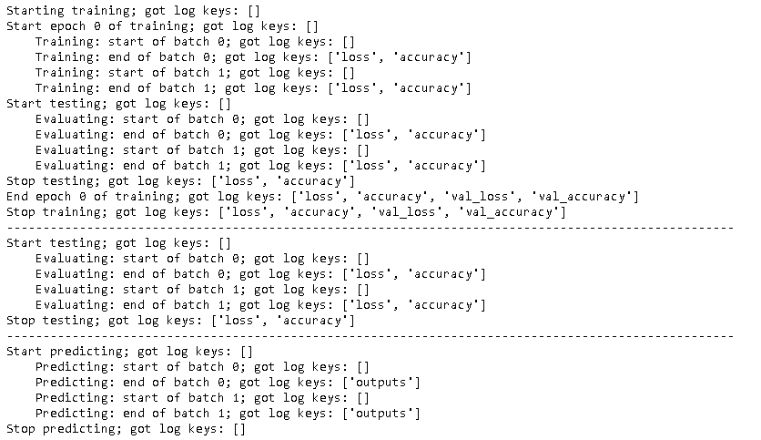
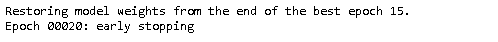
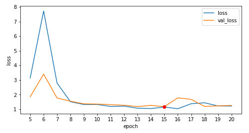
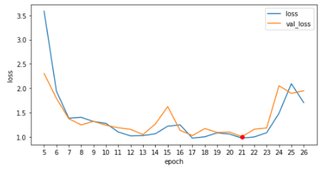
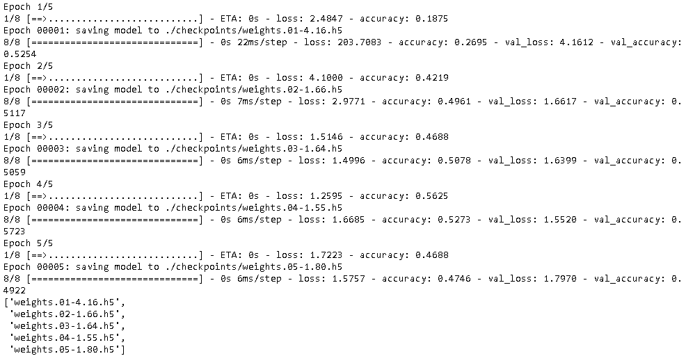
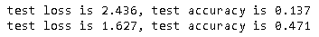
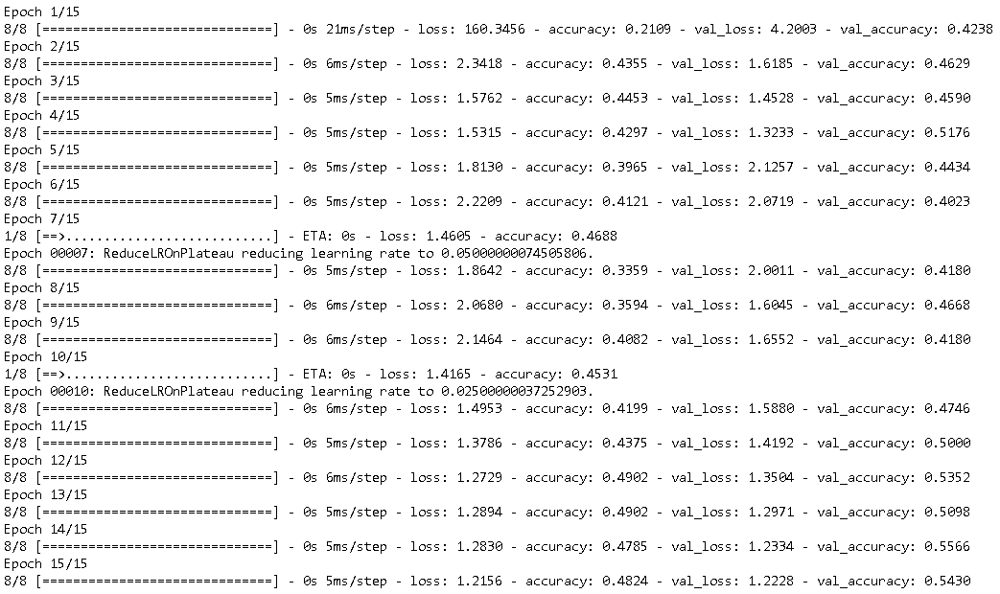
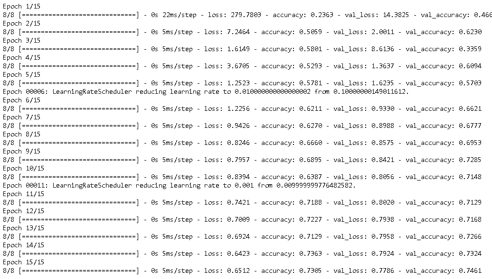
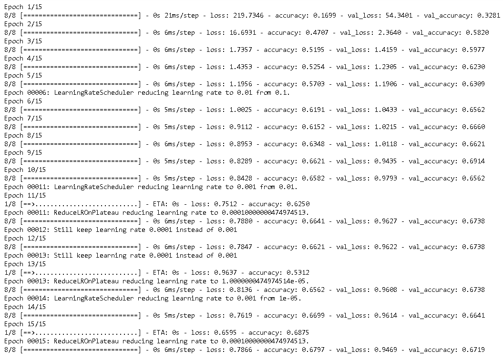

本文将介绍Tensorflow中的Callback。它是一个非常有用的工具，用于自定义train，evaluate和predict中的行为。

## Callback的方法

实现Callback很简单，主要有两步：

- 创建一个新的类，这个类继承`tf.keras.callbacks.Callback`。

- 根据需求，重载`tf.keras.callbacks.Callback`中的如下方法。
  - `on_(train|test|predict)_begin(self, logs=None)`
  - `on_(train|test|predict)_end(self, logs=None)`
  - `on_(train|test|predict)_batch_begin(self, batch, logs=None)`
  - `on_(train|test|predict)_batch_end(self, batch, logs=None)`
  - `on_epoch_begin(self, epoch, logs=None)`
  - `on_epoch_end(self, epoch, logs=None)`

  以上所有`begin`结尾方法，其logs是一个空的list。而end结尾的方法，其logs大多是有内容的，详见后文。

完成了前两步准备后，在模型训练，评估或预测时，把Callback类传入，则上面的那些方法将会被调用。其调用的具体的规则如下。

- `tf.keras.Model.fit()`

  Callback中方法调用顺序的伪代码如下。

  ~~~python
  on_train_begin(self, logs=None)
  for epoch in epoches:
      on_epoch_begin(self, epoch, logs=None)
      for batch in train_batches:
          on_train_batch_begin(self, batch, logs=None)
          on_train_batch_end(self, batch, logs=None)     # logs.keys = [loss, ...]        
      on_test_begin(self, logs=None)
      for batch in test_batches:
          on_test_batch_begin(self, batch, logs=None)
          on_test_batch_end(self, batch, logs=None)     # logs.keys = [loss, ...]
      on_test_end(self, logs=None)    # logs.keys = [loss, ...]    
      on_epoch_end(self, epoch, logs=None)    # logs.keys = [loss, val_loss, ...]
  on_train_end(self, logs=None)    # logs.keys = [loss, val_loss, ...]
  ~~~

- `tf.keras.Model.evaluate()`

  Callback中方法调用顺序的伪代码如下。

  ~~~python
  on_test_begin(self, logs=None)
  for batch in test_batches:
      on_test_batch_begin(self, batch, logs=None)            
      on_test_batch_end(self, batch, logs=None)       # logs.keys = [loss, ...] 
  on_test_end(self, logs=None)    # logs.keys = [loss, val_loss, ...]
  ~~~

- `tf.keras.Model.predict()`

  Callback中方法调用顺序的伪代码如下。

  ~~~python
  on_predict_begin(self, logs=None)
  for batch in test_batches:
      on_predict_batch_begin(self, batch, logs=None)    
      on_predict_batch_end(self, batch, logs=None)    # logs = [outputs, ...] 
  on_predict_end(self, logs=None)
  ~~~

## Callback实践

### 调用顺序

下面的代码展示了Callback中方法的调用顺序。首先创建模型和加载数据。

~~~python
import matplotlib.pyplot as plt
import numpy as np
import os
import tensorflow as tf
from pprint import pprint
from tensorflow import keras

gpus = tf.config.experimental.list_physical_devices(device_type='GPU')
tf.config.experimental.set_virtual_device_configuration(
    gpus[0],
    [tf.config.experimental.VirtualDeviceConfiguration(memory_limit=1024)]
)

def get_model():
    model = keras.models.Sequential()
    model.add(keras.layers.Flatten(input_shape=(28, 28)))
    model.add(keras.layers.Dense(128, activation='relu'))
    model.add(keras.layers.Dropout(0.2))
    model.add(keras.layers.Dense(10))    
    model.compile(
        optimizer=keras.optimizers.RMSprop(learning_rate=0.1),
        loss=keras.losses.SparseCategoricalCrossentropy(from_logits=True),
        metrics=["accuracy"],
    )
    return model

def get_mnist():
    (x_train, y_train), (x_test, y_test) = tf.keras.datasets.fashion_mnist.load_data()
    x_train = x_train.astype("float32") / 255.0
    x_test = x_test.astype("float32") / 255.0
    return x_train, y_train, x_test, y_test

~~~

然后自定义Callback类。

~~~python
class CustomCallback(keras.callbacks.Callback):
    def on_train_begin(self, logs=None):
        keys = list(logs.keys())
        print("Starting training; got log keys: {}".format(keys))        

    def on_train_end(self, logs=None):
        keys = list(logs.keys())
        print("Stop training; got log keys: {}".format(keys))

    def on_epoch_begin(self, epoch, logs=None):
        keys = list(logs.keys())
        print("Start epoch {} of training; got log keys: {}".format(epoch, keys))

    def on_epoch_end(self, epoch, logs=None):
        keys = list(logs.keys())
        print("End epoch {} of training; got log keys: {}".format(epoch, keys))

    def on_test_begin(self, logs=None):
        keys = list(logs.keys())
        print("Start testing; got log keys: {}".format(keys))

    def on_test_end(self, logs=None):
        keys = list(logs.keys())
        print("Stop testing; got log keys: {}".format(keys))

    def on_predict_begin(self, logs=None):
        keys = list(logs.keys())
        print("Start predicting; got log keys: {}".format(keys))

    def on_predict_end(self, logs=None):
        keys = list(logs.keys())
        print("Stop predicting; got log keys: {}".format(keys))

    def on_train_batch_begin(self, batch, logs=None):
        keys = list(logs.keys())
        print("    Training: start of batch {}; got log keys: {}".format(batch, keys))

    def on_train_batch_end(self, batch, logs=None):
        keys = list(logs.keys())
        print("    Training: end of batch {}; got log keys: {}".format(batch, keys))

    def on_test_batch_begin(self, batch, logs=None):
        keys = list(logs.keys())
        print("    Evaluating: start of batch {}; got log keys: {}".format(batch, keys))

    def on_test_batch_end(self, batch, logs=None):
        keys = list(logs.keys())
        print("    Evaluating: end of batch {}; got log keys: {}".format(batch, keys))

    def on_predict_batch_begin(self, batch, logs=None):
        keys = list(logs.keys())
        print("    Predicting: start of batch {}; got log keys: {}".format(batch, keys))

    def on_predict_batch_end(self, batch, logs=None):
        keys = list(logs.keys())
        print("    Predicting: end of batch {}; got log keys: {}".format(batch, keys))

~~~

下面来进行模型训练，评估和预测。

~~~python
x_train, y_train, x_test, y_test = get_mnist()
x_train = x_train[:1024]
y_train = y_train[:1024]
x_test = x_test[:512]
y_test = y_test[:512]

model = get_model()
model.fit(
    x_train,
    y_train,
    batch_size=256,
    epochs=1,
    verbose=0,
    validation_split=0.5,
    callbacks=[CustomCallback()],
)

print('-'*100)
res = model.evaluate(
    x_test, y_test, batch_size=256, verbose=0, callbacks=[CustomCallback()]
)

print('-'*100)
res = model.predict(x_test, batch_size=256, callbacks=[CustomCallback()])
~~~



### Early Stopping

在模型训练时，为了减少过拟合，往往会采用Early Stopping的技术。它会比较某一个metrics（最常用的是`val_loss`）是否在持续在降低，如果连续几个epochs都没有降低，将会中止训练，而且往往会把参数恢复到之前metrics最低时候的参数。

下面自定义的类实现了Early Stopping的逻辑。下面代码中，当设置`self.model.stop_training = True`后，训练将会退出。

~~~python
class MyEarlyStopping(keras.callbacks.Callback):
    """Stop training when the loss is at its min, i.e. the loss stops decreasing.

  Arguments:
      patience: Number of epochs to wait after min has been hit. After this
      number of no improvement, training stops.
  """

    def __init__(self, patience=0):
        super(MyEarlyStopping, self).__init__()
        self.patience = patience
        self.best_weights = None
        self.best_epoch = -1

    def on_train_begin(self, logs=None):
        self.wait = 0
        self.stopped_epoch = 0
        self.best = np.Inf

    def on_epoch_end(self, epoch, logs=None):
        current = logs.get("val_loss")
        if np.less(current, self.best):
            self.best = current
            self.best_epoch = epoch
            self.wait = 0
            self.best_weights = self.model.get_weights()
        else:
            self.wait += 1
            if self.wait >= self.patience:
                self.stopped_epoch = epoch
                self.model.stop_training = True
                print("Restoring model weights from the end of the best epoch {}.".format(self.best_epoch+1))
                self.model.set_weights(self.best_weights)

    def on_train_end(self, logs=None):
        if self.stopped_epoch > 0:
            print("Epoch %05d: early stopping" % (self.stopped_epoch + 1))
            
model = get_model()
history = model.fit(
    x_train,
    y_train,
    batch_size=256,
    epochs=30,
    verbose=0,
    validation_split=0.5,
    callbacks=[MyEarlyStopping(patience=5)],    
)
~~~



下面来显示训练过程中的val_loss趋势。

~~~python
def plot_history(history, metrics_name='accuracy'):
    plt.figure(figsize=(8, 4))
    # 忽略前面几个epoch
    start_epoch = 5    
    metrics = history.history[metrics_name][start_epoch-1:]
    val_metrics = history.history['val_' + metrics_name][start_epoch-1:]
    epochs = [start_epoch + i for i in range(len(metrics))]
    lowest = np.argmin(val_metrics)
    
    plt.plot(epochs, metrics, label=metrics_name)
    plt.plot(epochs, val_metrics, label = 'val_' + metrics_name)
    plt.plot(lowest+start_epoch, val_metrics[lowest], 'ro')
    plt.xlabel('epoch')
    plt.ylabel(metrics_name)
    plt.xticks(epochs)
    plt.legend(loc='upper right')
    plt.show()

plot_history(history, metrics_name='loss')
~~~



上图中第15 epoch，val_loss获得最低的值，接下来五轮epoch，val_loss无法获得更低的值，所以训练退出。

TensorFlow在tf.keras.callbacks.EarlyStopping类中也实现的Early Stopping功能，其逻辑和上面的实现基本相同。

```py
tf.keras.callbacks.EarlyStopping(
    monitor='val_loss', 
    min_delta=0, 
    patience=0, 
    verbose=0, 
    mode='auto',
    baseline=None, 
    restore_best_weights=False
)
```

如果调用`keras.callbacks.EarlyStopping`，效果完全一样。

~~~python
model = get_model()
history = model.fit(
    x_train,
    y_train,
    batch_size=256,
    epochs=30,
    verbose=0,
    validation_split=0.5,
    callbacks=[keras.callbacks.EarlyStopping(monitor='val_loss', patience=5)],    
)
plot_history(history, metrics_name='loss')
~~~



### Save Checkpoints

在训练模型的时候，有时候需要要保存中间的一些结果，采用tf.keras.callbacks.ModelCheckpoint可以很容易做到这一点。下面是创建ModelCheckpoint的一些参数。

| Arguments         | 描述                                                         |
| :---------------- | ------------------------------------------------------------ |
| filepath          | 模型保存的文件路径。可以添加一些变量，比如：`weights.{epoch:02d}-{val_loss:.2f}.hdf5` |
| monitor           | 监控的metrics，仅当`save_best_only=True`时发挥作用。默认是val_loss。 |
| verbose           | verbosity mode, 0 or 1.                                      |
| save_best_only    | 如果`save_best_only=True`, 仅仅当monitor的metrics获得最佳性能后才会保存模型 |
| mode              | 根据monitor的metrics的最优来决定是否保存模型。仅当`save_best_only=True`时发挥作用，有三个值：auto, min, max。默认为auto。 |
| save_weights_only | 是否仅仅保存模型weights，默认False                           |
| save_freq         | 保存的频次，可以设置`'epoch'`或者 integer. 当设置 `'epoch'`,则每个epoch都会保存模型。当设置为整数，表示每训练`save_freq`个batch，模型会保存一次。 默认是`'epoch'`。 |

需要注意的有两点：

- 当`save_best_only=True`时，避免设置`save_freq`的值，这是因为monitor监控的一般是val_loss, val_accuaracy等，它们是validation数据集上的metrics，`save_freq`会在on_train_batch_end实现触发模型保存的动作，但这个事件里，logs参数并没有validation数据集上的metrics。

- 在版本Tensor Flow 2.3.1中，在ModelCheckpoint的filepath参数中，不支持batch作为参数，这应该是个bug，因为这样的需求很常见。在早期的2.0.0版本中，反而支持，让人困惑。

下面来看具体代码实现，首先安装所需要的包。

~~~python
!pip install -q pyyaml h5py  # Required to save models in HDF5 format
~~~

然后创建callback，它将在每个epoch保存一次模型参数，代码如下。

~~~python
import shutil

checkpoint_dir = "./checkpoints"
if os.path.exists(checkpoint_dir):
    shutil.rmtree(checkpoint_dir)
os.makedirs(checkpoint_dir)

checkpoint_path = os.path.join(checkpoint_dir, "weights.{epoch:02d}-{val_loss:.2f}.h5")
cp_callback = tf.keras.callbacks.ModelCheckpoint(filepath=checkpoint_path,
                                                 save_weights_only=True,
                                                 verbose=1)
model = get_model()
model.fit(
    x_train,
    y_train,
    batch_size=64,
    epochs=5,
    validation_split=0.5,
    callbacks=[cp_callback])

pprint(os.listdir(checkpoint_dir))
~~~



上面生成了5个[HDF5](https://zhuanlan.zhihu.com/p/104145585)格式的参数文件。下面是加载模型参数的代码。

~~~python
model = get_model()
loss, accuracy = model.evaluate(x_test, y_test, batch_size=256, verbose=0)
print('test loss is {:.3f}, test accuracy is {:.3f}'.format(loss, accuracy))

model.load_weights(os.path.join(checkpoint_dir, os.listdir(checkpoint_dir)[-1]))
loss, accuracy = model.evaluate(x_test, y_test, batch_size=256, verbose=0)
print('test loss is {:.3f}, test accuracy is {:.3f}'.format(loss, accuracy))
~~~



### ReduceLROnPlateau

在模型训练的时候，经过一段时间迭代后，会发现Loss会处于上下震荡徘徊的状态（没有下行趋势），这种情况有的时候和Learning Rate过大有关系， 这时，如果能把Learning Rate变小，会发现Loss又开始呈现减少的趋势了。而ReduceLROnPlateau这个Callback刚好能实现上述功能。它的重要参数如下：

| Arguments | 描述                                                         |
| :-------- | ------------------------------------------------------------ |
| monitor   | 监控的metrics。默认是val_loss。                              |
| factor    | Learning Rate被降低的倍数。Learning Rate = Learning Rate * 倍数 |
| patience  | 没有进步的训练轮数，在这之后训练速率会被降低。               |
| verbose   | verbosity mode, 0 or 1.                                      |
| mode      | 指定是根据monitor的metrics的的减少或者增加来减少学习率。有三个值：auto, min, max。默认为auto。 |
| min_delta | 监控的metrics值的变化只有大于min_delta，才算又变化，这样能过滤一些小的数据波动 |
| cooldown  | 在学习速率被降低之后，会经过cooldown个epoch才重新进行正常操作。这样可以避免Learning Rate过于快速的下降。默认为0. |
| min_lr    | Learning Rate的下边界。                                      |

~~~python
reduce_lr = tf.keras.callbacks.ReduceLROnPlateau(monitor='val_loss', factor=0.5, min_lr=1e-5, 
                                                 patience=3, verbose=True) 
    
model = get_model()
model.fit(
    x_train,
    y_train,
    batch_size=64,
    epochs=15,
    validation_split=0.5,
    callbacks=[reduce_lr])
~~~



上面训练中，如果连续3个epoch，val_loss没有降低，Learning Rate就会降低一半。在实际的模型，使用ReduceLROnPlateau后，一般都可以提高模型的最优结果。

### LearningRateScheduler

和ReduceLROnPlateau非常相似，LearningRateScheduler也是用来减少Learning Rate的。在创建LearningRateScheduler之前，我们需要自定义一个Schedule函数，这个函数有两个参数：

- epoch： 当前的epoch 
- learning_rate: 当前的学习率

然后在这个函数中自定义学习率降低的逻辑，最后返回新的Learning Rate。完成定义后，把这个函数传给LearningRateScheduler，这样每次on_epoch_begin事件发生时，会调用这个自定义函数。

~~~python
def lr_schedule(epoch, lr):
    lr_times = [(0, 1.0), (5, 1e-1), (10, 1e-2)]
    
    base_lr = 1e-1
    new_lr = base_lr
    for border_epoch, times in lr_times:
        if epoch>=border_epoch: 
            new_lr = base_lr*times
    if abs(lr - new_lr)>1e-7:
        print('Epoch %05d: LearningRateScheduler reducing learning rate to %s from %s.' % (epoch + 1, new_lr, lr))
    return new_lr

learning_rate_scheduler = tf.keras.callbacks.LearningRateScheduler(lr_schedule, verbose=False)

model = get_model()
model.fit(
    x_train,
    y_train,
    batch_size=64,
    epochs=15,
    validation_split=0.5,
    callbacks=[learning_rate_scheduler])
~~~



可以看到每隔5个epoch，learning_rate都会降为原来的$\frac 1 {10}$。

需要注意的是，如果同时定义了LearningRateScheduler和ReduceLROnPlateau，LearningRateScheduler的逻辑将会胜出，这是因为ReduceLROnPlateau是在on_epoch_end事件修改Learning Rate，而LearningRateScheduler是在on_epoch_start被调用，所以新的Learning Rate会覆盖老的Learning Rate。

由此，在定义Schedule函数的时候，充分利用Schedule函数的第二参数lr（当前学习率），这样可以不会完全忽略ReduceLROnPlateau的逻辑。如下例中，当lr比new_lr小，但大于$\frac 1 {10}$new_lr的时候，仍然使用lr，只有当lr太小的时候，才使用new_lr，这样的好处是避免学习率过于小了，从而陷入过于局部的震荡中。

~~~python
def lr_schedule(epoch, lr):
    lr_times = [(0, 1.0), (5, 1e-1), (10, 1e-2)]
    
    base_lr = 1e-1
    new_lr = base_lr
    for border_epoch, times in lr_times:
        if epoch>=border_epoch: 
            new_lr = base_lr*times
    if abs(lr - new_lr)>1e-7:
        # 如果lr比new_lr小，但是又大于0.1倍的new_lr，继续使用lr
        if lr < new_lr and lr > 0.1*new_lr-(1e-7):
            print('Epoch %05d: Still keep learning rate %s instead of %s' % 
                  (epoch + 1, round(lr, 7), round(new_lr, 7))) 
            return lr   
        print('Epoch %05d: LearningRateScheduler reducing learning rate to %s from %s.' % 
              (epoch + 1, round(new_lr, 7), round(lr, 7)))
    return new_lr

learning_rate_scheduler = tf.keras.callbacks.LearningRateScheduler(lr_schedule, verbose=False)
reduce_lr = tf.keras.callbacks.ReduceLROnPlateau(monitor='val_loss', factor=0.1, min_lr=1e-7, 
                                                 patience=2, verbose=True) 
    
model = get_model()
model.fit(
    x_train,
    y_train,
    batch_size=64,
    epochs=15,
    validation_split=0.5,
    callbacks=[reduce_lr, learning_rate_scheduler])
~~~



可以看到，epoch  12，13，学习率仍然使用0.0001，而不是LearningRateScheduler所定义的0.001，只有当第epoch   13步后，学习率被ReduceLROnPlateau设置成了1e-05，这太小了，所以在epoch 14， 学习率又重新恢复到LearningRateScheduler的0.001。

## 参考

- [Writing your own callbacks](https://www.tensorflow.org/guide/keras/custom_callback)
- [Additional callbacks](https://nbviewer.jupyter.org/github/xuxiangwen/xuxiangwen.github.io/blob/master/_notes/05-ai/54-tensorflow/tutorial/additional_callbacks.ipynb)
- [Save and load models](https://www.tensorflow.org/tutorials/keras/save_and_load)

## 历史

- 2020-11-09：初始 版本
- 2020-11-10：增加Save Checkpoints
- 2020-12-30：添加LearningRateScheduler和ReduceLROnPlateau