本课程来自Coursera上的课程[Getting started with TensorFlow 2](https://www.coursera.org/learn/getting-started-with-tensor-flow2/home/welcome)，是系列课程[TensorFlow 2 for Deep Learning Specialization](https://www.coursera.org/specializations/tensorflow2-deeplearning)的第一个课程。

### Week 1：Sentiment Analysis with Logistic Regression

#### [NLP_C1_W1_lecture_nb_01.ipynb](http://15.15.166.35:18888/notebooks/eipi10/xuxiangwen.github.io/_notes/05-ai/54-tensorflow/classification-vector-spaces-in-nlp/NLP_C1_W1_lecture_nb_01.ipynb)

对nltk.corpus.twitter_samples中的twitter数据集进行情感分类（正面positive和负面negative）。在构建模型之前，首先要对文本数据进行预处理。

- 使用正则表达式去除一些字符

  比如：hyperlinks，#，RT

- 使用nltk.tokenize.TweetTokenizer把字符串分成words

- 使用nltk.corpus.stopwords去除stopwords

- 使用string.punctuation移除标点符号（punctuation）

- 使用nltk.stem.PorterStemmer进行词根替换

上述代码参见[utils.py](http://15.15.166.35:18888/edit/eipi10/xuxiangwen.github.io/_notes/05-ai/54-tensorflow/classification-vector-spaces-in-nlp/week1/utils.py)。

#### [NLP_C1_W1_lecture_nb_02.ipynb](http://15.15.166.35:18888/notebooks/eipi10/xuxiangwen.github.io/_notes/05-ai/54-tensorflow/classification-vector-spaces-in-nlp/NLP_C1_W1_lecture_nb_02.ipynb)

面对情感分类问题，我们往往会统计文本中正面词汇和负面词汇的个数，那么如何获取正面词汇和负面词汇呢？最简单的方法是，**分别统计一个词汇在正面文本和负面文本中出现的次数。**根据这两个指标，可以可视化words，得到如下图形。

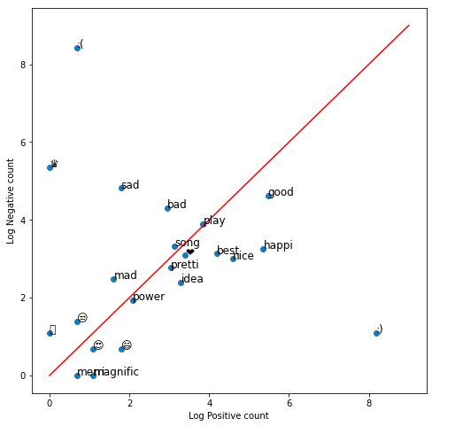

可以很明显看出， `:)` 代表强烈的正面情感，而 `:(`代表强烈的负面情感。在文本处理中，要避免把这样类似的word移除。

> 上面这种获得词向量的方式，虽然简单，但也是有效的方法之一。

#### [NLP_C1_W1_lecture_nb_03.ipynb](http://15.15.166.35:18888/notebooks/eipi10/xuxiangwen.github.io/_notes/05-ai/54-tensorflow/classification-vector-spaces-in-nlp/NLP_C1_W1_lecture_nb_03.ipynb)

根据前两个notebook所说的处理方式，处理twitter模型，然后可视化Logistic Regression的边界。其中theta调用了C1_W1_Assignment中训练后的结果

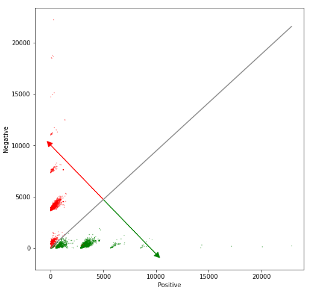

#### [C1_W1_Assignment.ipynb](http://15.15.166.35:18888/notebooks/eipi10/xuxiangwen.github.io/_notes/05-ai/54-tensorflow/classification-vector-spaces-in-nlp/C1_W1_Assignment.ipynb)

数据生成的步骤如下：

1. 加载文本数据。

2. 文本预处理：process_tweet(tweet)

   - Lowercase
   - Remove punctuation, urls, names
   - Remove stop words
   - Stemming
   - Tokenize sentences

3. 对于每一条tweet，计算positive, negative两个数值。逻辑如下：
   $$
   positive = \sum_{i=0}^{n}{freq(w, pos) }  \\
   negative = \sum_{i=0}^{n}{freq(w, neg) }
   $$
   其中$freq(w, class)$：表示每个词汇在各个分类中出现的次数。

   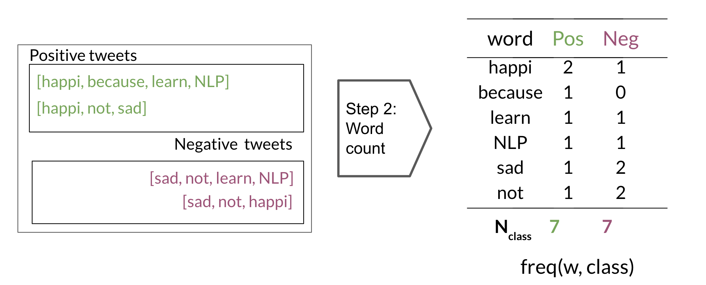

下面完整展示了Logistic Regression的实现过程。

* $\mathbf{\theta}$ has dimensions (n+1, 1), where 'n' is the number of features, and there is one more element for the bias term $\theta_0$ (note that the corresponding feature value $\mathbf{x_0}$ is 1).
$$\mathbf{\theta} = \begin{pmatrix}
\theta_0
\\
\theta_1
\\ 
\theta_2 
\\ 
\vdots
\\ 
\theta_n
\end{pmatrix}$$
* The 'logits', 'z', are calculated by multiplying the feature matrix 'x' with the weight vector 'theta'.  $z = \mathbf{x}\mathbf{\theta}$
    * $\mathbf{x}$ has dimensions (m, n+1) 
    * $\mathbf{\theta}$: has dimensions (n+1, 1)
    * $\mathbf{z}$: has dimensions (m, 1)
* The prediction 'h', is calculated by applying the sigmoid to each element in 'z': $h(z) = sigmoid(z)$, and has dimensions (m,1).
* The cost function $J$ is calculated by taking the dot product of the vectors 'y' and 'log(h)'.  Since both 'y' and 'h' are column vectors (m,1), transpose the vector to the left, so that matrix multiplication of a row vector with column vector performs the dot product.
$$
J = -\frac{1}{m} \times \left(\mathbf{y}^T \cdot log(\mathbf{h}) + \mathbf{(1-y)}^T \cdot log(\mathbf{1-h}) \right)
$$
* The update of theta is also vectorized.  Because the dimensions of $\mathbf{x}$ are (m, n+1), and both $\mathbf{h}$ and $\mathbf{y}$ are (m, 1), we need to transpose the $\mathbf{x}$ and place it on the left in order to perform matrix multiplication, which then yields the (n+1, 1) answer we need:
$$
\mathbf{\theta} = \mathbf{\theta} - \frac{\alpha}{m} \times \left( \mathbf{x}^T \cdot \left( \mathbf{h-y} \right) \right)
$$

### Week2: Sentiment Analysis with Naïve Bayes

#### [NLP_C1_W2_lecture_nb_01.ipynb](http://15.15.166.35:18888/notebooks/eipi10/xuxiangwen.github.io/_notes/05-ai/54-tensorflow/classification-vector-spaces-in-nlp/NLP_C1_W2_lecture_nb_01.ipynb)

使用置信椭圆（ [confidence ellipse](https://matplotlib.org/3.1.1/gallery/statistics/confidence_ellipse.html#sphx-glr-gallery-statistics-confidence-ellipse-py)）可视化二维数据。

1. 使用如下公式，计算每一个tweet的positive和negative。

$$
   positive = log(P(tweet|pos)) = \sum_{i=0}^{n}{log P(W_i|pos)}
$$

$$
negative = log(P(tweet|neg)) = \sum_{i=0}^{n}{log P(W_i|neg)}
$$

2. 使用置信椭圆可视化tweet，可以看到两个类别的数据基本分开了，属于不同的高斯分布。

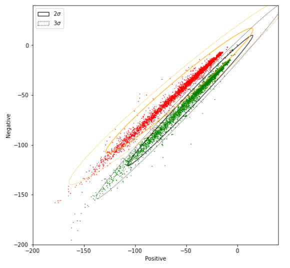

#### [C1_W2_Assignment.ipynb](http://15.15.166.35:18888/notebooks/eipi10/xuxiangwen.github.io/_notes/05-ai/54-tensorflow/classification-vector-spaces-in-nlp/C1_W2_Assignment.ipynb)

朴素贝叶斯模型步骤：

1. 加载文本数据。

2. 文本预处理：process_tweet(tweet)

   - Lowercase
   - Remove punctuation, urls, names
   - Remove stop words
   - Stemming
   - Tokenize sentences

3. 计算每个tweet的得分。推导过程如下：
   $$
   \begin{align}
   Score &= log \frac {P(pos|tweet)} {P(neg|tweet)}  \\
    &= log \frac {P(pos)P(tweet|pos)} {P(neg)P(tweet|neg)} \\
    &= log \frac {P(pos)}  {P(neg)} + log \frac {P(tweet|pos)}  {P(tweet|neg)}  \\
   \end{align}
   $$
   - $ \frac {P(pos)}  {P(neg)} $：表示先验概率的比值。
     $$
     \frac {P(pos)}  {P(neg)} = log \left( \frac{D_{pos}}{D_{neg}} \right)
     $$
     其中$$D_{pos}$$，$$D_{neg}$$分别代表正面文档和负面文档的数量。 

   - $$log \frac {P(tweet|pos)}  {P(tweet|neg)}$$：表示似然函数比值。朴素贝叶斯假设各个特征（word）之间是相互独立的，可以进行如下推导。
     $$
     \begin{align}
     log \frac{P(tweet|pos)}{P(tweet|neg)} &= log(P(tweet|pos)) - log(P(tweet|neg))  \\
       &= \sum_{i=0}^{n}{log P(w_i|pos)} - \sum_{i=0}^{n}{log P(w_i|neg)}
     \end{align}
     $$

   - $$P\left(\mathrm{w} \mid \mathrm{class}\right)$$：计算每个类别中word出现的概率。

     采用拉普拉斯平滑（Laplacian Smoothing）。

     $$
     P\left(\mathrm{w} \mid \mathrm{class}\right)=\frac{\operatorname{freq}\left(\mathrm{w}, \text { class}\right)+1}{\mathrm{N}_{\text {class }}+\mathrm{V}}
     $$

     其中：$$\mathrm N_{class}$$表示某个类别所有单词出现的频次，$$\mathrm V $$表示不同词汇的个数。

   - $freq(w, class)$：计算每个词汇在各个分类中出现的次数

     

总结起来，Score表示如下：
$$
\begin{align}
Score &= log \left( \frac{D_{pos}}{D_{neg}} \right) + \sum_{i=0}^{n}{log P(w_i|pos)} - \sum_{i=0}^{n}{log P(w_i|neg)}
\end{align}
$$

- $$D_{pos}$$，$$D_{neg}$$分别代表正面文档和负面文档的数量。 
- $$P\left(\mathrm{w} \mid \mathrm{class}\right)=\frac{\operatorname{freq}\left(\mathrm{w}, \text { class}\right)+1}{\mathrm{N}_{\text {class }}+\mathrm{V}}$$：计算每个类别中word出现的概率。
  - $$\mathrm N_{class}$$：表示某个类别所有单词出现的频次，
  - $$\mathrm V $$：表示不同词汇的个数。
  - $freq(w, class)$：计算每个词汇在各个分类中出现的次数

> 由于是二分类，Score采用了比值的形式，如果是多分类，可以不用采用比值的形式，而分别计算各个类的得分。比值的形式，有点像逻辑回归里面的定义。

可以看到，朴素贝叶斯非常简单，它不需要多轮的迭代训练， 它只需要根据训练数据得到**各个类别的先验概率**和$P\left(\mathrm{w} \mid \mathrm{class}\right)$，然后在预测时，根据这些值直接计算Score就可以了。

### Week3: Vector Space Models

总体上这一周的内容比较初级

#### [NLP_C1_W3_lecture_nb_01.ipynb](http://15.15.166.35:18888/notebooks/eipi10/xuxiangwen.github.io/_notes/05-ai/54-tensorflow/classification-vector-spaces-in-nlp/NLP_C1_W3_lecture_nb_01.ipynb)

介绍了一些基本的向量和矩阵操作，非常基础。

#### [NLP_C1_W3_lecture_nb_02.ipynb](http://15.15.166.35:18888/notebooks/eipi10/xuxiangwen.github.io/_notes/05-ai/54-tensorflow/classification-vector-spaces-in-nlp/NLP_C1_W3_lecture_nb_02.ipynb)

介绍了词向量的使用场景。

- Word  Distance

- Find Closest Word

  比如： find_closest_word(vec('Italy') - vec('Rome') + vec('Madrid'))

#### [NLP_C1_W3_lecture_nb_03.ipynb](http://15.15.166.35:18888/notebooks/eipi10/xuxiangwen.github.io/_notes/05-ai/54-tensorflow/classification-vector-spaces-in-nlp/NLP_C1_W3_lecture_nb_03.ipynb)

介绍了PCA的使用和效果。

#### [C1_W3_Assignment.ipynb](http://15.15.166.35:18888/notebooks/eipi10/xuxiangwen.github.io/_notes/05-ai/54-tensorflow/classification-vector-spaces-in-nlp/C1_W3_Assignment.ipynb)

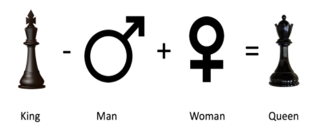

- 采用如下公式，来得到一个向量，然后用夹角余弦来查找最相近的国家。

  Country2 = Country1 - City1  + City2

- 使用pca对词向量进行降维。

  只有前10个维度，特征值大于0。从图形上看，相近的词汇距离更近。

  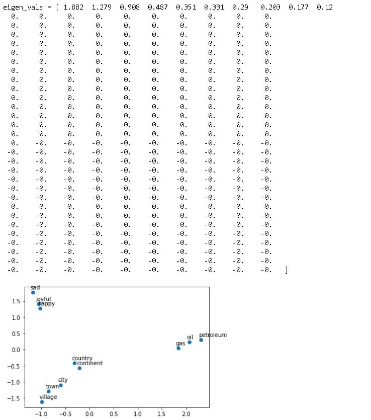

### Week 4: Machine Translation and Document Search

#### [NLP_C1_W4_lecture_nb_01.ipynb](http://15.15.166.35:18888/notebooks/eipi10/xuxiangwen.github.io/_notes/05-ai/54-tensorflow/classification-vector-spaces-in-nlp/NLP_C1_W4_lecture_nb_01.ipynb)

演示了向量的线性变换。

- 拉伸
- 旋转

#### [NLP_C1_W4_lecture_nb_02.ipynb](http://15.15.166.35:18888/notebooks/eipi10/xuxiangwen.github.io/_notes/05-ai/54-tensorflow/classification-vector-spaces-in-nlp/NLP_C1_W4_lecture_nb_02.ipynb)

介绍了基于局部敏感哈希（Locality Sensitive Hashing）的文档相似度搜索技术。生成k个随机平面，计算样本到随机平面的距离，距离大于0，表示在平面上方，反之在平面下方。通过这个获得多个hashvalue。

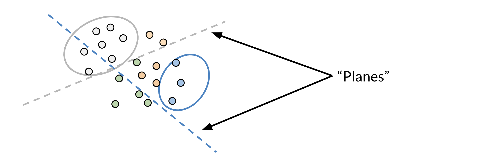

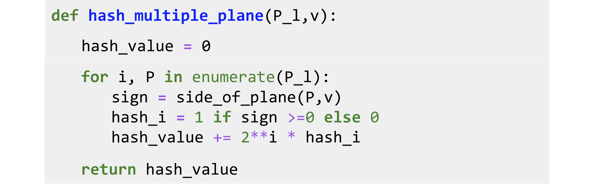

#### [C1_W4_Assignment.ipynb](http://15.15.166.35:18888/notebooks/eipi10/xuxiangwen.github.io/_notes/05-ai/54-tensorflow/classification-vector-spaces-in-nlp/C1_W4_Assignment.ipynb)

包含了两个例子。

##### 词汇翻译

使用线性模型来进行英语和法语词汇之间的翻译。

- 数据准备

  - 加载英文和法语词向量

  - 加载训练和测试词语对，并根据词向量，把词语对，变成词向量矩阵。

    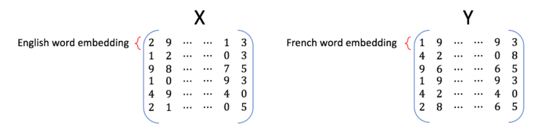

- 训练

  用线性回归模型进行训练矩阵$\mathbf{ R}$。损失函数如下：
  $$
  \arg \min _{\mathbf{R}}\| \mathbf{X R} - \mathbf{Y}\|_{F}
  $$

- 用KNN算法，计算离预测向量最近的词汇。KNN使用夹角余弦作为距离公式。
  $$
  \cos(u,v)=\frac{u\cdot v}{\left\|u\right\|\left\|v\right\|} \\
  d_{\text{cos}}(u,v)=1-\cos(u,v)
  $$

##### LSH和文档搜索

步骤如下：

- 加载tweet情感数据

- 根据上节加载的英文词向量，计算文档向量。
  $$
  文档向量 = \sum 词向量
  $$

- 采用LSH来计算相似文档

  文档数据不大时，可以直接通过夹角余弦计算最近的文档。但当文档数量达到亿万级别，非常的慢。

LSH的基本思路：

1. 生成hash table列表。列表中每一个hash table的生成逻辑如下。

    - 随机生成$n$个超平面。

    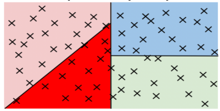

    - 采用投影，计算各个文档距离各个超平面的距离。

    - 根据距离，生成hash向量。设文档距离第$i$个文档的距离是$d_i$，则向量第$i$个成员$h_t$可以表示为：
    $$
    h_i =  \begin{equation}  
    \left\{  
    \begin{array}{lcl}  
    1        &  & d_i\ \ge 0 \\  
    0&  & d_i\ < 0  
    \end{array}  
    \right.
    \end{equation}
    $$

    - 根据hash向量，生成hash_value
    $$
    hash_value = \sum_{i=0}^{N-1} \left( 2^{i} \times h_{i} \right)
    $$

    - 遍历所有文档，把相同hash_value的文档放到同一个bucket中去。bucket的数量为$2^n$
    
    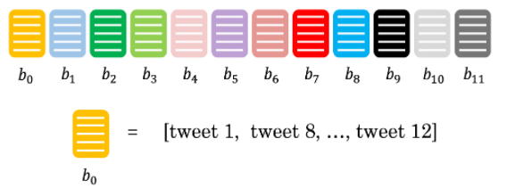

2.  使用Approximate K-NN算法，来搜索相似的文档。步骤如下。
   - 获取要搜索文档的hash_value
   - 根据hash_value，把同一个bucket中文档，添加到一个列表中，称之为候选列表
   - 使用KNN，在候选列表中查找最相近的文档。

  

