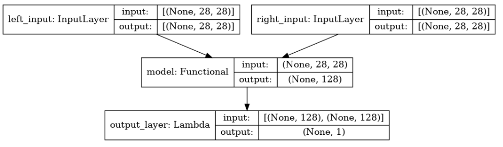
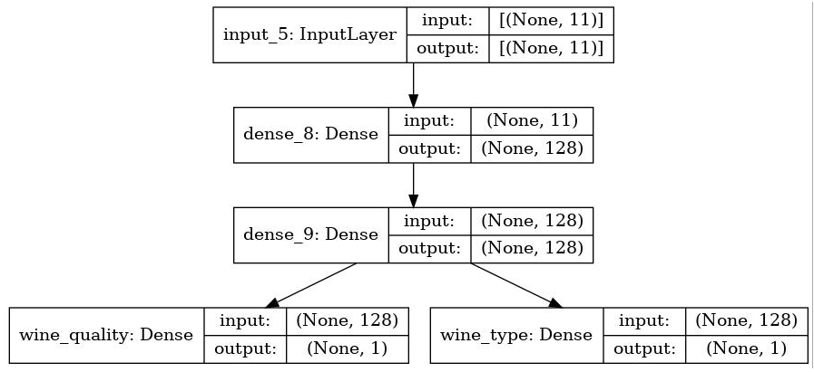

# Custom Models, Layers, and Loss Functions with TensorFlow

## Week 1:  Functional APIs

加入[Slack | Get Started | DeepLearning.AI TF AT](https://app.slack.com/client/T01ECMWNSRK/learning-slack)。这是[TensorFlow: Advanced Techniques Specialization](https://www.coursera.org/specializations/tensorflow-advanced-techniques)这个系列课程的论坛。就、

### [C1_W1_Lab_1_functional-practice.ipynb](http://15.15.166.35:18888/notebooks/eipi10/xuxiangwen.github.io/_notes/05-ai/54-tensorflow/custom-models-layers-loss-functions/Week_1/C1_W1_Lab_1_functional-practice.ipynb)

介绍了一个基本的Functional模型的实现。

### [C1_W1_Lab_2_multi-output.ipynb](http://15.15.166.35:18888/notebooks/eipi10/xuxiangwen.github.io/_notes/05-ai/54-tensorflow/custom-models-layers-loss-functions/Week_1/C1_W1_Lab_2_multi-output.ipynb)

介绍了一个多output的Functional模型的实现。

### [C1_W1_Lab_3_siamese-network.ipynb](http://15.15.166.35:18888/notebooks/eipi10/xuxiangwen.github.io/_notes/05-ai/54-tensorflow/custom-models-layers-loss-functions/Week_1/C1_W1_Lab_3_siamese-network.ipynb)

介绍了一个简单的Siamese Network模型。模型结果如下。

- 模型输出采用自定义的Lambda哈函数。

  ~~~python
  from tensorflow.keras.layers import Lambda
  
  # create the left input and point to the base network
  input_a = Input(shape=(28,28,), name="left_input")
  vect_output_a = base_network(input_a)
  
  # create the right input and point to the base network
  input_b = Input(shape=(28,28,), name="right_input")
  vect_output_b = base_network(input_b)
  
  # measure the similarity of the two vector outputs
  output = Lambda(euclidean_distance, name="output_layer", output_shape=eucl_dist_output_shape)([vect_output_a, vect_output_b])
  
  # specify the inputs and output of the model
  model = Model([input_a, input_b], output)
  
  # plot model graph
  plot_model(model, show_shapes=True, show_layer_names=True, to_file='outer-model.png')
  ~~~

  > 模型输出的欧几里得距离，用来做pair之间的相似度（其值的范围再0和1之间），为何会这样呢，可能时margin设置成1的缘故。

- 其中，loss函数采用了自定义的contrastive_loss，它公式如下：
  $$
  L=\frac{1}{2N}\sum_\limits{n=1}^Nyd^2+(1-y) max(margin-d,0) ^2
  $$

  - y=1：表示pair中的对象属于同一个类别；y=0：表示pair中的对象属于不一个类别
  - d表示pair对象之间的距离。

  ~~~python
  def contrastive_loss_with_margin(margin):
      def contrastive_loss(y_true, y_pred):
          '''Contrastive loss from Hadsell-et-al.'06
          http://yann.lecun.com/exdb/publis/pdf/hadsell-chopra-lecun-06.pdf
          '''
          square_pred = K.square(y_pred)
          margin_square = K.square(K.maximum(margin - y_pred, 0))
          return K.mean(y_true * square_pred + (1 - y_true) * margin_square)
      return contrastive_loss
  ~~~

  > tensorflow中的tensorflow-addons包也有实现[tfa.losses.contrastive_loss](https://www.tensorflow.org/addons/api_docs/python/tfa/losses/contrastive_loss)

### [C1W1_Assignment.ipynb](http://15.15.166.35:18888/notebooks/eipi10/xuxiangwen.github.io/_notes/05-ai/54-tensorflow/custom-models-layers-loss-functions/Week_1/C1W1_Assignment.ipynb)

实现了一个模型，对 **[Wine Quality Dataset](https://archive.ics.uci.edu/ml/datasets/Wine+Quality)**预测葡萄酒的质量和类型。一个输入，两个输出。

## Week 2: Custom Loss Functions

### [C1_W2_Lab_1_huber-loss.ipynb](http://15.15.166.35:18888/notebooks/eipi10/xuxiangwen.github.io/_notes/05-ai/54-tensorflow/custom-models-layers-loss-functions/Week_2/C1_W2_Lab_1_huber-loss.ipynb)

Huber Loss 是一个用于回归问题的带参损失函数, 优点是能增强平方误差损失函数(MSE, mean square error)对离群点的鲁棒性。

相比于最小二乘的线性回归，HuberLoss降低了对离群点的惩罚程度，所以 HuberLoss 是一种常用的鲁棒的回归损失函数。
$$
L_{\sigma}(a)  = \begin{equation}  
\left\{  
\begin{array}{lcl}  
  \frac{1}{2}a^2        &  & \text{  for  } |a| \le \sigma   \\  
\sigma (|a| - \frac{1}{2} \sigma ) &  &  \text{   otherwise} 
\end{array}  
\right.
\end{equation}
$$
其中：

- 当预测偏差小于 $\sigma $时，它采用平方误差
- 当预测偏差大于 $\sigma $时，采用的线性误差

### [C1_W2_Lab_2_huber-object-loss.ipynb](http://15.15.166.35:18888/notebooks/eipi10/xuxiangwen.github.io/_notes/05-ai/54-tensorflow/custom-models-layers-loss-functions/Week_2/C1_W2_Lab_2_huber-object-loss.ipynb)

上一个notebook中，huber-loss中硬编码了一个参数threshold，这样并不是一个好的实现。为此，可以有两种实现。

- wrapper function

  ~~~python
  # wrapper function that accepts the hyperparameter
  def my_huber_loss_with_threshold(threshold):
    
      # function that accepts the ground truth and predictions
      def my_huber_loss(y_true, y_pred):
          error = y_true - y_pred
          is_small_error = tf.abs(error) <= threshold
          small_error_loss = tf.square(error) / 2
          big_error_loss = threshold * (tf.abs(error) - (0.5 * threshold))
          
          return tf.where(is_small_error, small_error_loss, big_error_loss) 
  
      # return the inner function tuned by the hyperparameter
      return my_huber_loss
  ~~~

- loss class

  ~~~python
  from tensorflow.keras.losses import Loss
  
  class MyHuberLoss(Loss):
    
      # class attribute
      threshold = 1
    
      # initialize instance attributes
      def __init__(self, threshold):
          super().__init__()
          self.threshold = threshold
  
      # compute loss
      def call(self, y_true, y_pred):
          error = y_true - y_pred
          is_small_error = tf.abs(error) <= self.threshold
          small_error_loss = tf.square(error) / 2
          big_error_loss = self.threshold * (tf.abs(error) - (0.5 * self.threshold))
          return tf.where(is_small_error, small_error_loss, big_error_loss)
  ~~~

### [C1W2_Assignment.ipynb](http://15.15.166.35:18888/notebooks/eipi10/xuxiangwen.github.io/_notes/05-ai/54-tensorflow/custom-models-layers-loss-functions/Week_2/C1W2_Assignment.ipynb)

实现了一个非常简单的自定义loss函数。

## Week 3: Custom Layers

### [C1_W3_Lab_1_lambda-layer.ipynb](http://15.15.166.35:18888/notebooks/eipi10/xuxiangwen.github.io/_notes/05-ai/54-tensorflow/custom-models-layers-loss-functions/Week_3/C1_W3_Lab_1_lambda-layer.ipynb)

介绍了tensorflow.keras.layers.Lambda。

### [C1_W3_Lab_2_custom-dense-layer.ipynb](http://15.15.166.35:18888/notebooks/eipi10/xuxiangwen.github.io/_notes/05-ai/54-tensorflow/custom-models-layers-loss-functions/Week_3/C1_W3_Lab_2_custom-dense-layer.ipynb)

继承tensorflow.keras.layers.layer实现了一个简单的Dense Layer。

~~~python
# inherit from this base class
from tensorflow.keras.layers import Layer

class SimpleDense(Layer):

    def __init__(self, units=32):
        '''Initializes the instance attributes'''
        super(SimpleDense, self).__init__()
        self.units = units

    def build(self, input_shape):
        '''Create the state of the layer (weights)'''
        # initialize the weights
        w_init = tf.random_normal_initializer()
        self.w = tf.Variable(name="kernel",
            initial_value=w_init(shape=(input_shape[-1], self.units),
                                 dtype='float32'),
            trainable=True)

        # initialize the biases
        b_init = tf.zeros_initializer()
        self.b = tf.Variable(name="bias",
            initial_value=b_init(shape=(self.units,), dtype='float32'),
            trainable=True)

    def call(self, inputs):
        '''Defines the computation from inputs to outputs'''
        return tf.matmul(inputs, self.w) + self.b
~~~

1. `__init__`：初始化layer
2. `build`：根据input的input_shape，进一步初始化layer
3. `call`：前向传播（forward computation）

### [C1_W3_Lab_3_custom-layer-activation.ipynb](http://15.15.166.35:18888/notebooks/eipi10/xuxiangwen.github.io/_notes/05-ai/54-tensorflow/custom-models-layers-loss-functions/Week_3/C1_W3_Lab_3_custom-layer-activation.ipynb)

在上一节的基础上，增加了一个参数activation。

~~~python
class SimpleDense(Layer):

    # add an activation parameter
    def __init__(self, units=32, activation=None):
        super(SimpleDense, self).__init__()
        self.units = units
        
        # define the activation to get from the built-in activation layers in Keras
        self.activation = tf.keras.activations.get(activation)

    def build(self, input_shape):
        w_init = tf.random_normal_initializer()
        self.w = tf.Variable(name="kernel",
            initial_value=w_init(shape=(input_shape[-1], self.units),
                                 dtype='float32'),
            trainable=True)
        b_init = tf.zeros_initializer()
        self.b = tf.Variable(name="bias",
            initial_value=b_init(shape=(self.units,), dtype='float32'),
            trainable=True)
        #super().build(input_shape)

    def call(self, inputs):
        
        # pass the computation to the activation layer
        return self.activation(tf.matmul(inputs, self.w) + self.b)
~~~

### [C1W3_Assignment.ipynb](http://15.15.166.35:18888/notebooks/eipi10/xuxiangwen.github.io/_notes/05-ai/54-tensorflow/custom-models-layers-loss-functions/Week_3/C1W3_Assignment.ipynb)

用二次方程$$ax^2 + bx + c$$一个自定义Layer。

