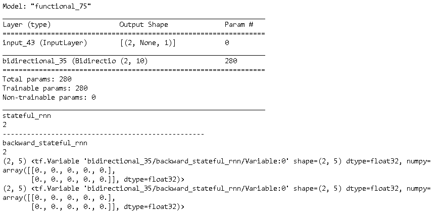

本课程来自Coursera上的课程[Customising your models with TensorFlow 2](https://www.coursera.org/learn/customising-models-tensorflow2/home/welcome)。是系列课程[TensorFlow 2 for Deep Learning Specialization](https://www.coursera.org/specializations/tensorflow2-deeplearning)的第二个课程。

### Week 1： The Keras functional API

#### [Week_1_device_placement.ipynb](http://15.15.166.35:18888/notebooks/eipi10/xuxiangwen.github.io/_notes/05-ai/54-tensorflow/customising-models-tensorflow2/Week_1_device_placement.ipynb)

TF运行的设备，可以GPU或CPU。比较了CPU和GPU在矩阵加法，矩阵乘法，模型训练上的性能差异。。

#### [Week_1_functional_api.ipynb](http://15.15.166.35:18888/notebooks/eipi10/xuxiangwen.github.io/_notes/05-ai/54-tensorflow/customising-models-tensorflow2/Week_1_functional_api.ipynb)

详细描述了TF Functional API，具体内容如下：

- 多个input和output的模型
- Tensors and Variables
- 访问模型中的layer：主要用transfer learning的例子来说明。
- Freezing layers：设置模型的某些layer，训练时不会更新参数。

#### [Week_1_Layer_nodes.ipynb](http://15.15.166.35:18888/notebooks/eipi10/xuxiangwen.github.io/_notes/05-ai/54-tensorflow/customising-models-tensorflow2/Week_1_Layer_nodes.ipynb)

介绍了多个input和output的模型需要注意的东西。

> 目前看起来好像没啥用，但或许要用到，才能体会。

#### [Week_1_Programming_Assignment.ipynb](http://15.15.166.35:18888/notebooks/eipi10/xuxiangwen.github.io/_notes/05-ai/54-tensorflow/customising-models-tensorflow2/Week_1_Programming_Assignment.ipynb)

第一周的大作业。主要使用Transfer learning来训练[Dogs vs Cats dataset](https://www.kaggle.com/c/dogs-vs-cats/data)。

- 首先构建一个cnn模型作为benchmark
- 然后引入一个已经训练好的模型（MobileNetV2.h5），抽取其模型的部分layers，构建新的模型。

下面是这两个模型的结果比较。

| Metric              | Benchmark CNN | Transfer learning CNN |
| ------------------- | ------------- | --------------------- |
| Training loss       | 0.350221      | 0.157769              |
| Training accuracy   | 0.856667      | **0.933333**          |
| Validation loss     | 0.645643      | 0.159805              |
| Validation accuracy | 0.683333      | **0.953333**          |
| Test loss           | 0.728206      | 0.131498              |
| Test accuracy       | 0.656667      | **0.943333**          |

### Week 2：Data Pipeline

#### [Week_2_Creating_Datasets.ipynb](http://15.15.166.35:18888/notebooks/eipi10/xuxiangwen.github.io/_notes/05-ai/54-tensorflow/customising-models-tensorflow2/Week_2_Creating_Datasets.ipynb)

从不同数据源创建Dataset。

- 介绍了`from_tensor_slices` and `from_tensors`之前的区别。看起来from_tensors好像很少会用到。
  - 从numpy的narray中创建Dataset
  - 从pandas的DataFrame中创建Dataset
- 导入csv文件创建Dataset

#### [Week_2_Data_Pipeline.ipynb](http://15.15.166.35:18888/notebooks/eipi10/xuxiangwen.github.io/_notes/05-ai/54-tensorflow/customising-models-tensorflow2/Week_2_Data_Pipeline.ipynb)

-  介绍keras的dataset。也就是大多教程例子在用的方式。
  - 加载CIFAR-100数据集。介绍了一些不同参数的作用
  - 加载IMDB数据集。介绍了一些不同参数的作用，尤其对于文本处理比较有用。
- 介绍Dataset Generator。这种方式主要使用yield来实现数据的加载。
  和keras的dataset相比，可以自定义数据的获取方式，同时可以不用一次把所有数据加到内存中去。
- 介绍了keras的data augmentation
- 介绍了Dataset Class：这个实际时TF的亲生儿子。
- 使用Dataset  Class，进行数据预处理，和模型训练。总体感觉有些功能很啰嗦复杂，实际中未必会用到那么多。

#### [Week_2_Keras_TimeseriesGenerator.ipynb](http://15.15.166.35:18888/notebooks/eipi10/xuxiangwen.github.io/_notes/05-ai/54-tensorflow/customising-models-tensorflow2/Week_2_Keras_TimeseriesGenerator.ipynb)

使用时间序列处理TimeseriesGenerator处理音频的例子，挺不错。

#### [Week_2_TensorFlow_Datasets.ipynb](http://15.15.166.35:18888/notebooks/eipi10/xuxiangwen.github.io/_notes/05-ai/54-tensorflow/customising-models-tensorflow2/Week_2_TensorFlow_Datasets.ipynb)

使用tensorflow-datasets来加载数据集，和keras的dataset，总计感觉要麻烦一些。但这时TF的亲儿子，从设计上应该能够满足更多的需求。

#### [Week_2_Programming_Assignment.ipynb](http://15.15.166.35:18888/notebooks/eipi10/xuxiangwen.github.io/_notes/05-ai/54-tensorflow/customising-models-tensorflow2/Week_2_Programming_Assignment.ipynb)

第二周的大作业。主要两部分：

- 对于 [LSUN dataset](https://www.yf.io/p/lsun)中很小的子集进行分类，采用data augmentation减少数据过拟合
- 对于[CIFAR-100 dataset](https://www.cs.toronto.edu/~kriz/cifar.html)数据集，创建Dataset，添加filter，使用map对数据进行一些修改。

### Week 3： Sequence Modelling

#### [Week_3_Sequence_modelling.ipynb](http://15.15.166.35:18888/notebooks/eipi10/xuxiangwen.github.io/_notes/05-ai/54-tensorflow/customising-models-tensorflow2/Week_3_Sequence_modelling.ipynb)

介绍了Sequence模型中的多个处理技术和多个层次

- Padding
- Embedding Layer
- Embedding Projector：可以把Embedding Layer生成的词向量导入到网站[projector.tensorflow.org](https://projector.tensorflow.org/)，可视化展现其关系。
- RNN
  - SimpleRNN, LSTM, GRU
  - Stacked RNNs and the Bidirectional wrapper

#### [Week_3_Stateful_RNNs.ipynb](http://15.15.166.35:18888/notebooks/eipi10/xuxiangwen.github.io/_notes/05-ai/54-tensorflow/customising-models-tensorflow2/Week_3_Stateful_RNNs.ipynb)

介绍了Stateful RNN的使用。

- Bidirectional里面只有backward_layer的States有内容，而layer得States是None，原因何在？

  ~~~python
  inputs = Input(batch_shape=(2, None, 1))
  outputs = Bidirectional(layer=LSTM(5, stateful=True, name='stateful_rnn'))(inputs)
  # outputs = Bidirectional(layer=LSTM(5, stateful=True, name='stateful_rnn'),
  #                         backward_layer = GRU(5, stateful=True, name='backward_stateful_rnn', go_backwards=True)
  #                        )(inputs)
  
  stateful_gru = Model(inputs=inputs, outputs=outputs)
  stateful_gru.summary()
  ~~~

  

#### [Week_3_Tokenising_Text_Data.ipynb](http://15.15.166.35:18888/notebooks/eipi10/xuxiangwen.github.io/_notes/05-ai/54-tensorflow/customising-models-tensorflow2/Week_3_Tokenising_Text_Data.ipynb)

使用Tokenizer来处理文本。里面添加了很多相关的属性和方法的描述，

#### [Week_3_Programming_Assignment.ipynb](http://15.15.166.35:18888/notebooks/eipi10/xuxiangwen.github.io/_notes/05-ai/54-tensorflow/customising-models-tensorflow2/Week_3_Programming_Assignment.ipynb)

使用Shakespeare dataset训练character-level 语言模型，能够自动的生成文本。主要使用了Tokenizer来进行文本预处理，然后创建模型，使用Stateful方式在batch之间来保持Hide State。模型训练的速度真的很慢，看来必须要使用Attention等技术，一般可以并行处理，提高速度。

为了batch之间共享State福利，准备数据的处理技巧如下：

~~~python
num_processed_examples = 50
steps = 5
inx = np.empty((0,), dtype=np.int32)
for i in range(steps):
    inx = np.concatenate((inx, i + np.arange(0, num_processed_examples, steps)))

print(inx)
print(len(inx), inx.shape)
~~~

上面这样处理的目的是，当一个batch训练完成后，下一个batch也能共享上次得隐藏状态。这样如下文所示，连续五个句子（比如：0，1，2，3，4）可以共享隐藏状态。

~~~
0  5 10 15 20 25 30 35 40 45  
1  6 11 16 21 26 31 36 41 46  
2  7 12 17 22 27 32 37 42 47  
3  8 13 18 23 28 33 38 43 48  
4  9 14 19 24 29 34 39 44 49  
~~~

#### Week 4： Model subclassing and custom training loops

### [Week_4_The_build_method](http://15.15.166.35:18888/notebooks/eipi10/xuxiangwen.github.io/_notes/05-ai/54-tensorflow/customising-models-tensorflow2/Week_4_The_build_method.ipynb)

描述了通过build方法，使得Layer能根据数据的不同创建相应参数。

~~~python
class MyLayer(Layer):

    def __init__(self, units, **kwargs):
        super(MyLayer, self).__init__(**kwargs)
        self.units = units
    
    def build(self, input_shape):
        self.w = self.add_weight(shape=(input_shape[-1], self.units),
                                 initializer='random_normal')
        self.b = self.add_weight(shape=(self.units,),
                                 initializer='zeros')
    def call(self, inputs):
        return tf.matmul(inputs, self.w)+self.b
~~~

#### [Week_4_Tracking_metrics_in_custom_training_loops](http://15.15.166.35:18888/notebooks/eipi10/xuxiangwen.github.io/_notes/05-ai/54-tensorflow/customising-models-tensorflow2/Week_4_Tracking_metrics_in_custom_training_loops.ipynb)

描述了如何自定义模型的（Forward， Backward）训练过程。

#### [Week 4 Model subclassing and custom training loops](http://15.15.166.35:18888/notebooks/eipi10/xuxiangwen.github.io/_notes/05-ai/54-tensorflow/customising-models-tensorflow2/Week_4_Model_subclassing.ipynb)

系统介绍了

- Model subclassing：自定义模型

- Custom layers：自定义Layer

  - 使用tf.Variable

- Automatic  differentiation：使用tf.GradientTape()和tape.gradient来自动求导

  ~~~shell
  learning_rate = 0.05
  steps =25
  
  for i in range(steps):
      with tf.GradientTape() as tape:
          precisions = linear_regression(x_train)
          loss = SquaredError(precisions, y_train)
          
      gradients = tape.gradient(loss, linear_regression.trainable_variables)
      linear_regression.w.assign_sub(learning_rate * gradients[0])
      linear_regression.b.assign_sub(learning_rate * gradients[1])
      
      print('step {}, loss {:0.5f}, w {}, b {}'.format(i+1, loss, 
                                                       linear_regression.w.numpy()[0][0], 
                                                       linear_regression.b.numpy()[0]))
  ~~~

- Customer Training Loops： 自定义训练过程。
  
  - 尝试了`@tf.function`： 如果不加 `@tf.function` 需要70秒左右，增加后，只要51秒左右，性能提升30%左右。

#### [Week_4_Programming_Assignment](http://15.15.166.35:18888/notebooks/eipi10/xuxiangwen.github.io/_notes/05-ai/54-tensorflow/customising-models-tensorflow2/Week_4_Programming_Assignment.ipynb)

使用model subclassing API和custom layer创建residual神经网络。残差网络怎么挺有意思的。

### [Week 5: Capstone Project](http://15.15.166.35:18888/notebooks/eipi10/xuxiangwen.github.io/_notes/05-ai/54-tensorflow/customising-models-tensorflow2/Capstone_Project.ipynb)

构建了一个（从英语到德语）翻译系统，这是一个非常好的练手作业，把课程里用到的技术整个的运用了一遍，有一定难度。如果能很好的完成这个例子，则说明该课程掌握的不错。

在review的时候，看了好几个其它人的提交，都有不少错误。看来这个结业作业的确有一定挑战。

Below is my submit. 

https://www.coursera.org/learn/customising-models-tensorflow2/peer/4fLDZ/capstone-project/submit

下面是论坛里的求大家review的帖子：

https://www.coursera.org/learn/customising-models-tensorflow2/discussions/weeks/5/threads/RX9snYfTEeudRwr4jvLA4w

