由于[MNIST](http://yann.lecun.com/exdb/mnist/)数据集比较简单，出现了很多替代者， [Fashion MNIST](https://eipi10.cn/others/2020/10/22/dataset#fashion-mnist)就是其中之一。 它是由Zalando（一家德国的时尚科技公司）旗下的研究部门提供，它其涵盖了来自10种类别的共7万个不同商品的正面图。本文使用Tensorflow对这个数据集进行分类，将会尝试多个模型，从简单的到复杂的，直至接近甚至达到State-of-the-Art。

目前Fashion MNIST数据集State-of-the-Art的排名如下，详见[Image Classification on Fashion-MNIST](https://paperswithcode.com/sota/image-classification-on-fashion-mnist)。

从时间轴上看，2017年取得了96.35%的准确率。

## 初始化

首先引入所用的包。

~~~python
import logging
import matplotlib.pyplot as plt
import numpy as np
import os
import pandas as pd
import seaborn as sns
import tensorflow as tf
import time

from IPython.display import display, Image
from sklearn.metrics import confusion_matrix
from pprint import pprint
from tensorflow.keras import datasets, models, Model, layers, callbacks, losses, optimizers, preprocessing

# 设置日志
logging.basicConfig(format='%(asctime)s: %(levelname)s: %(message)s')
logging.root.setLevel(level=logging.INFO)

# 设置GPU内存使用上限
gpus = tf.config.experimental.list_physical_devices(device_type='GPU')
print(gpus)
tf.config.experimental.set_virtual_device_configuration(
    gpus[0],
    [tf.config.experimental.VirtualDeviceConfiguration(memory_limit=2048)]
)

# 保存模型的loss, accuracy等指标
models = {}
~~~

然后是一些公共函数。下面代码比较长，可以先把函数的中文解释看过就好，细节忽略，后面用到再回来看。

~~~python
class TaskTime:
    '''用于显示执行时间'''
    
    def __init__(self, task_name, show_start=False):
        self.show_start = show_start
        self.task_name = task_name
        self.start_time = time.time()

    def elapsed_time(self):
        return time.time()-self.start_time

    def __enter__(self):
        if self.show_start:
            logging.info('start {}'.format(self.task_name))
        return self;

    def __exit__(self, exc_type, exc_value, exc_tb):
        time.sleep(0.5)
        logging.info('finish {} [elapsed time: {:.2f} seconds]'.format(self.task_name, self.elapsed_time()))
        
def get_weight_num(model):
    '''得到模型可训练参数的个数'''
    return np.sum([np.prod(p.shape) for p in model.trainable_weights])

def show_images(images, labels, x_num=6, y_num=6, figsize=(8,8)):
    '''显示图片'''
    plt.figure(figsize=figsize)
    channel_count = images.shape[-1]
    for i in range(x_num*y_num):
        plt.subplot(x_num, y_num, i+1)
        if channel_count==1:
            plt.imshow(images[i], cmap='gray')
        else:
            plt.imshow(images[i])
        plt.title("{}".format(labels[i]))
        plt.xticks([])
        plt.yticks([])    

    plt.tight_layout()
    plt.subplots_adjust(wspace=0.3, hspace=0.3)      
    plt.show()
    
def plot_distribution(train_labels, test_labels):
    '''打印类的分布'''
    def plot_dist(labels, title, color='blue', width = 0.7):
        bin_count = np.bincount(labels)
        bin_percentage = bin_count/len(labels)
        rects = plt.bar(np.arange(10), bin_count, width, color=color)
        plt.title(title)
        plt.xticks(range(10))  
        
        for i, r in enumerate(rects):
            plt.annotate('{:0.1f}%'.format(int(bin_percentage[i]*100)),
                        xy=(r.get_x() + r.get_width() / 2, r.get_height()),
                        xytext=(0, 3),  # 3 points vertical offset
                        textcoords="offset points",
                        ha='center', va='bottom')        
            
    plt.figure(figsize=(12, 4))
    plt.subplot(121)
    plot_dist(train_labels, 'Train', color='teal')
    plt.subplot(122)
    plot_dist(test_labels, 'Test', color='coral')

    plt.show()    
    
def train(model, epochs, verbose=True):    
    '''要求模型设置name属性，用于保存模型。'''
    checkpoint_best_only = callbacks.ModelCheckpoint(filepath=model.checkpoint_path,
                                                     monitor='val_accuracy',
                                                     save_weights_only=True, 
                                                     save_best_only=True,
                                                     verbose=False)
    reduce_lr = callbacks.ReduceLROnPlateau(monitor='val_loss', factor=0.5, min_lr=0.0001, patience=4, verbose=verbose) 
    early_stopping = callbacks.EarlyStopping(monitor='val_accuracy', patience=6)  
    
    with TaskTime('training', True) as t: 
        history = model.fit(train_dataset, validation_data=val_dataset, epochs=epochs, verbose=verbose, 
                            callbacks=[checkpoint_best_only, reduce_lr, early_stopping])
        history.train_time = t.elapsed_time()
    return history  

def plot_history(history):
    '''显示训练的loss和accuracy的走势图'''
    plt.figure(figsize=(12, 5))
    epochs = range(1, len(history.history['accuracy'])+1)
    plt.subplot(121)
    plt.plot(epochs, history.history['accuracy'])
    plt.plot(epochs, history.history['val_accuracy'])
    plt.title('Accuracy vs. epochs')
    plt.ylabel('Accuracy')
    plt.xlabel('Epoch')
    plt.xticks(epochs)
    plt.legend(['Training', 'Validation'], loc='lower right')

    plt.subplot(122)
    plt.plot(epochs, history.history['loss'])
    plt.plot(epochs, history.history['val_loss'])
    plt.title('Loss vs. epochs')
    plt.ylabel('Loss')
    plt.xlabel('Epoch')
    plt.xticks(epochs)
    plt.legend(['Training', 'Validation'], loc='upper right')
    plt.show()    
    
def show_models(models):     
    '''按照test_accuracy倒序显示所有模型的信息'''
    models_remove1 = {key:{key1:value1 for key1, value1 in value.items() if key1 != 'model'}  for key, value in models.items()}
    df_models = pd.DataFrame.from_dict(models_remove1, orient='index')
    df_models = df_models.sort_values('test_accuracy', ascending=False) 
    display(df_models)
       
def evaluate_show(model, train_time, 
                  train_dataset, 
                  val_dataset, 
                  test_dataset, 
                  models):
    '''评估当前模型，并且显示所有模型的信息'''
    train_loss, train_accuracy = model.evaluate(train_dataset, verbose=False)
    val_loss, val_accuracy = model.evaluate(val_dataset, verbose=False)
    test_loss, test_accuracy = model.evaluate(test_dataset, verbose=False)
    if  model.name not in models or models[model.name]['test_accuracy']<test_accuracy:
        models[model.name] = {'train_loss':round(train_loss, 6), 
                              'train_accuracy':round(train_accuracy, 4), 
                              'val_loss':round(val_loss, 6), 
                              'val_accuracy':round(val_accuracy, 4),    
                              'test_loss':round(test_loss, 6), 
                              'test_accuracy':round(test_accuracy, 4),                               
                              'weight_number':get_weight_num(model), 
                              'model':model,
                              'train_time':round(train_time,0)
                             }    
    show_models(models)    
    
def plot_confusion_matrix(model1, images, labels, model2=None):
    '''打印混淆矩阵'''
    def plot_cm(model):
        predictions = model.predict(images).argmax(axis=-1)               
        cm = confusion_matrix(labels, predictions)
        df_cm = pd.DataFrame(cm, index=range(0, 10), columns=range(0, 10))
        
        plt.title("{} - Confusion matrix".format(model.name))
        sns.heatmap(df_cm, annot=True, fmt='g',cmap='coolwarm')
        plt.xlabel("Predicted")
        plt.ylabel("Actual")
    
    if model2 is not None:
        plt.figure(figsize=(15, 6))
        plt.subplot(1, 2, 1)
        plot_cm(model1)
        plt.subplot(1, 2, 2)
        plot_cm(model2)         
    else:  
        plt.figure(figsize=(7.5, 6))
        plot_cm(model1)
    
    plt.show()    
    
def plot_predicted_sample(models, images, labels, sample_count=5, show_error=True):
    '''查看一些样本的分类情况'''
    def plot_var(model, image, label):
        predict = np.squeeze(model.predict(image))
        max_like = np.argmax(predict)
        plt.bar(range(10), predict, width=0.9, color='steelblue', alpha=0.8) 
        plt.ylim(0,1)
        plt.xticks(range(10))
        plt.title('{}: {} ({:0.0f}%)'.format(model.name, max_like, predict[max_like]*100), fontsize=10)        
        
    if show_error:
        base_predictions = models[0].predict(images).argmax(axis=-1)  
        error_indexes = base_predictions != labels
        error_images = images[error_indexes]
        error_labels = labels[error_indexes]
        sample_indexes = np.random.randint(len(error_images), size=sample_count)  
        sample_images = error_images[sample_indexes]
        sample_labels = error_labels[sample_indexes]
    else:
        sample_indexes = np.random.randint(len(labels), size=sample_count)  
        sample_images = images[sample_indexes]
        sample_labels = labels[sample_indexes]
    
    column_count = len(models)+1 
    plt.figure(figsize=(2*column_count, 10))
    for i in range(sample_count):
        plt.subplot(sample_count, column_count, column_count*i+1)
        plt.imshow(np.squeeze(sample_images[i]), cmap='gray', interpolation='none')
        plt.title('actual: {}'.format(sample_labels[i]), fontsize=10)
        plt.xticks([])
        plt.yticks([])

        for j, model in enumerate(models):
            plt.subplot(sample_count, column_count, column_count*i+j+2)
            plot_var(model, sample_images[i:i+1], sample_labels[i])

    plt.subplots_adjust(wspace=0.5, hspace=0.5)         
    plt.show()    
    
def plot_model_structure(model):    
    '''打印模型的结构'''
    img = tf.keras.utils.plot_model(model, '{}.png'.format(model.name), show_shapes=True) 
    display(img)
    
def load_best_checkpoint(model):
    '''加载最佳的checkpoint'''
    model.load_weights(model.checkpoint_path)
    return model    
~~~

## 数据

MNIST数据集包含60,000张training图片和10,000张test图片，每张图片由$28\times28$ 个像素点构成，每个像素点用一个灰度值(0−255)表示。下面开始加载数据。

~~~python
(train_images, train_labels), (test_images, test_labels) = datasets.mnist.load_data()

train_images = np.expand_dims(train_images, axis=-1) 
test_images = np.expand_dims(test_images, axis=-1)
train_images = train_images/255.0
test_images = test_images/255.0

print(train_images.shape, train_labels.shape)
print(test_images.shape, test_labels.shape)
~~~

然后创建train，validatiaon和test数据集。

~~~python
train_val_dataset = tf.data.Dataset.from_tensor_slices((train_images, train_labels)) 
train_val_dataset = train_val_dataset.shuffle(train_images.shape[0])

test_dataset = tf.data.Dataset.from_tensor_slices((test_images, test_labels))

train_size = int(0.85*train_images.shape[0])
train_dataset = train_val_dataset.take(train_size) 
val_dataset = train_val_dataset.skip(train_size)

batch_size = 32
train_dataset = train_dataset.batch(batch_size, drop_remainder=True)
val_dataset = val_dataset.batch(batch_size*10)
test_dataset = test_dataset.batch(batch_size*10)

input_shape = train_dataset.element_spec[0].shape[1:]
~~~

示例图片如下：

~~~python
images, labels = iter(train_dataset).next()
show_images(images, labels, x_num=4, y_num=8, figsize=(12, 6))
~~~

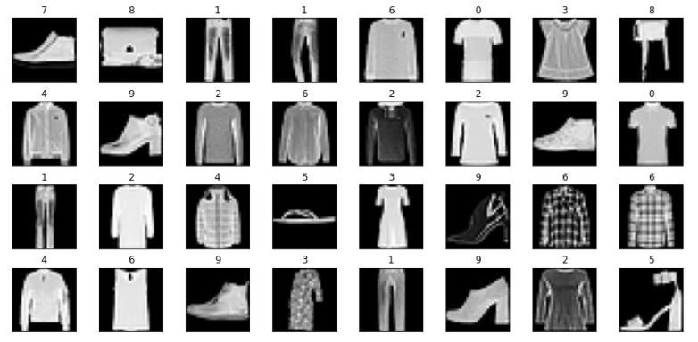

接下来再看看数据分布。

~~~python
plot_distribution(train_labels, test_labels)
~~~

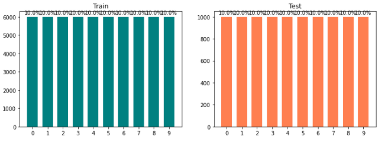

上图中，可以看到，数据的分布是绝对均匀。

## MLP

首先，尝试用经典的多层感知器（Muti-Layer Perception）来进行分类。下面模型是典型的三层结构，有101,770个参数。

~~~python
def get_mlp(input_shape, learning_rate=0.001):
    input = layers.Input(shape=input_shape)
    x = layers.Flatten()(input)
    x = layers.Dense(128, activation='relu')(x)
    x = layers.Dense(10, activation='softmax')(x)  
    
    model = Model(inputs=input, outputs=x, name='mlp') 
    model.compile(optimizer=optimizers.Adam(learning_rate=learning_rate),
                  loss=losses.SparseCategoricalCrossentropy(),
                  metrics=['accuracy'])  

    model.checkpoint_path = './checkpoints/{}/checkpoint'.format(model.name)
    return model

mlp_model = get_mlp(input_shape)
mlp_model.summary()
~~~

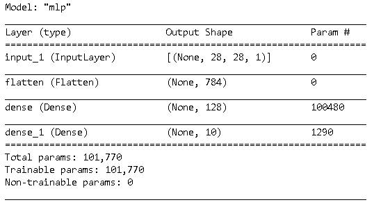

下面来训练模型。

~~~python
history = train(mlp_model, epochs=20)
plot_history(history)
~~~

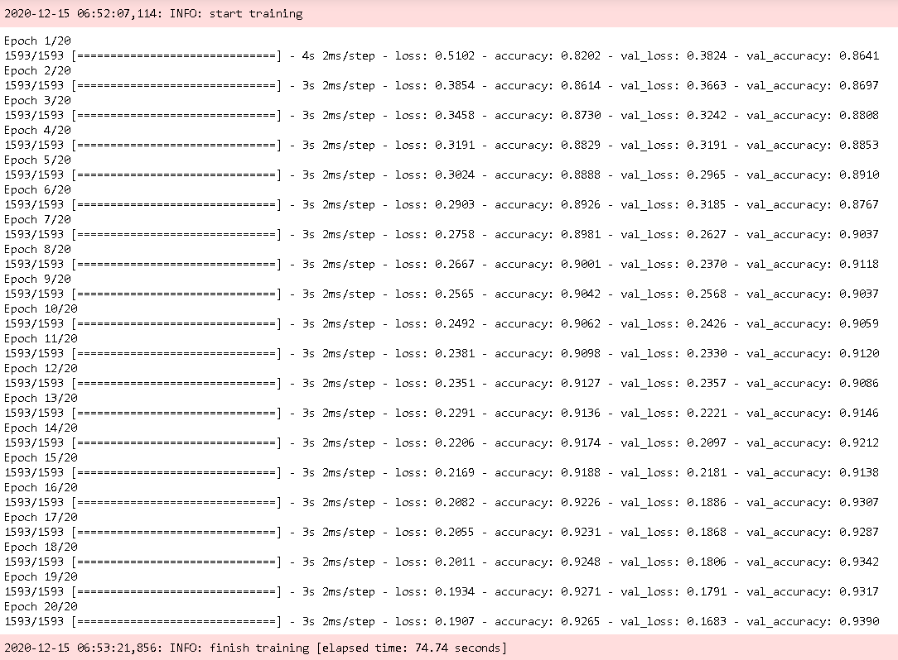

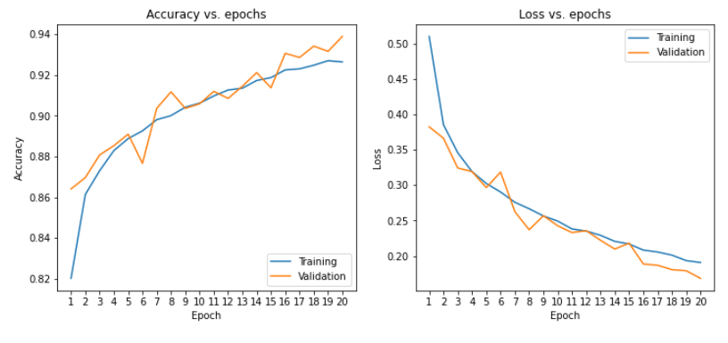

下面评估一下模型。

~~~python
# 评估
mlp_model = load_best_checkpoint(get_mlp(input_shape))
evaluate_show(mlp_model, 
              train_time=history.train_time,
              train_dataset=train_dataset, 
              val_dataset=val_dataset, 
              test_dataset=test_dataset, 
              models=models
             )

# 混淆矩阵
print('-'*120)
plot_confusion_matrix(mlp_model, 
                      images=test_images, 
                      labels=test_labels)   

# 模型对比
print('-'*120)
plot_predicted_sample([mlp_model], 
                      images=test_images, 
                      labels=test_labels,
                      sample_count=5) 
~~~

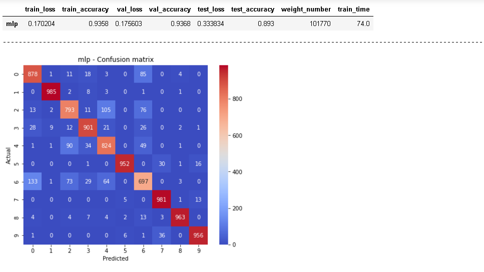

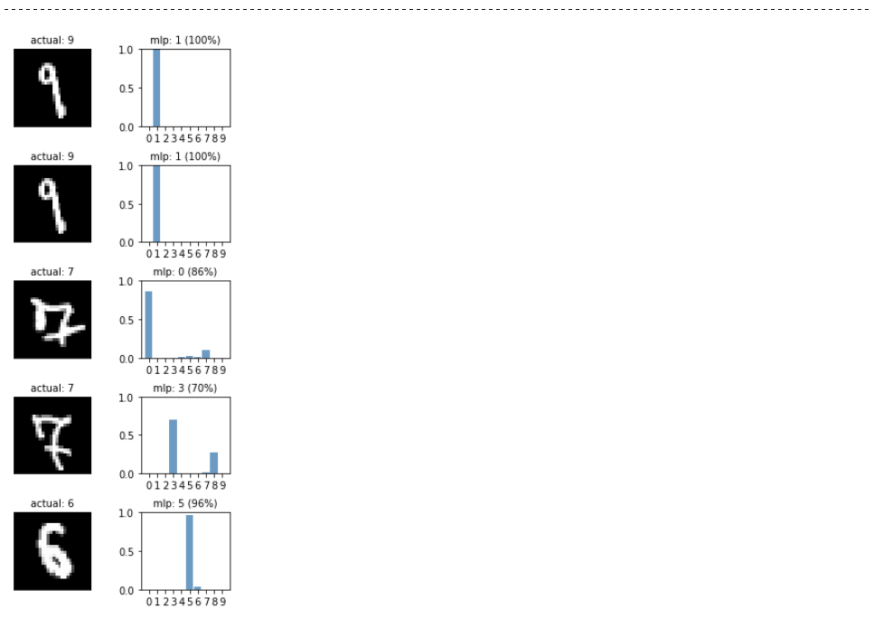

从上面的错误来看，模型对一些细节的判断不是很准。下面来尝试一下LeNet。

## LeNet

LeNet诞生于1994年，是Yann LeCun等人提出的，是最早的卷积神经网络之一。在LeNet中，输入层是32×32的图片，而MNIST是28×28的图片，为了保持模型的结构不变，在第一个Conv2D设置参数padding=’same’。首先创建模型，并训练。

~~~python
def get_lenet(input_shape, learning_rate=0.001):
    input = layers.Input(shape=input_shape)
    x = layers.Conv2D(6, (5, 5), activation='relu', padding='same')(input)
    x = layers.MaxPooling2D((2, 2))(x)
    x = layers.Conv2D(16, (5, 5), activation='relu')(x)
    x = layers.MaxPooling2D((2, 2))(x)   
    x = layers.Flatten()(x)
    x = layers.Dense(120, activation='relu')(x)
    x = layers.Dense(84, activation='relu')(x)                        
    x = layers.Dense(10, activation='softmax')(x)  
    
    model = Model(inputs=input, outputs=x, name='lenet') 
    model.compile(optimizer=optimizers.Adam(learning_rate=learning_rate),
                  loss=losses.SparseCategoricalCrossentropy(),
                  metrics=['accuracy'])  

    model.checkpoint_path = './checkpoints/{}/checkpoint'.format(model.name)
    return model    

# 创建模型b
lenet_model = get_lenet(input_shape)
lenet_model.summary()
~~~

下面来训练模型。

~~~python
# 训练
history = train(lenet_model, epochs=20)
plot_history(history)
~~~

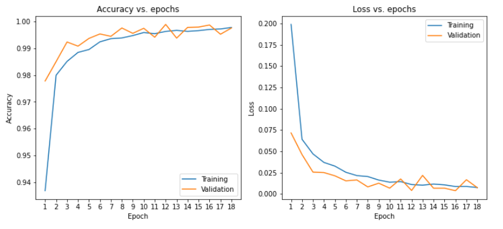

下面来评估模型并和mlp模型进行对比。

~~~python
# 评估
lenet_model = load_best_checkpoint(get_lenet(input_shape))
evaluate_show(lenet_model, 
              train_time=history.train_time,
              train_dataset=train_dataset, 
              val_dataset=val_dataset, 
              test_dataset=test_dataset, 
              models=models
             )

# 混淆矩阵
print('-'*120)
plot_confusion_matrix(mlp_model, 
                      model2=letnet_model,
                      images=test_images, 
                      labels=test_labels)  

# 模型对比
print('-'*120)
plot_predicted_sample([mlp_model, lenet_model], 
                      images=test_images, 
                      labels=test_labels,
                      sample_count=5)  
~~~

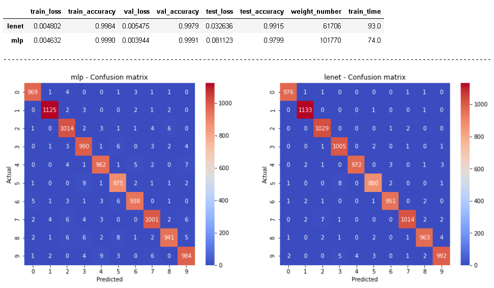

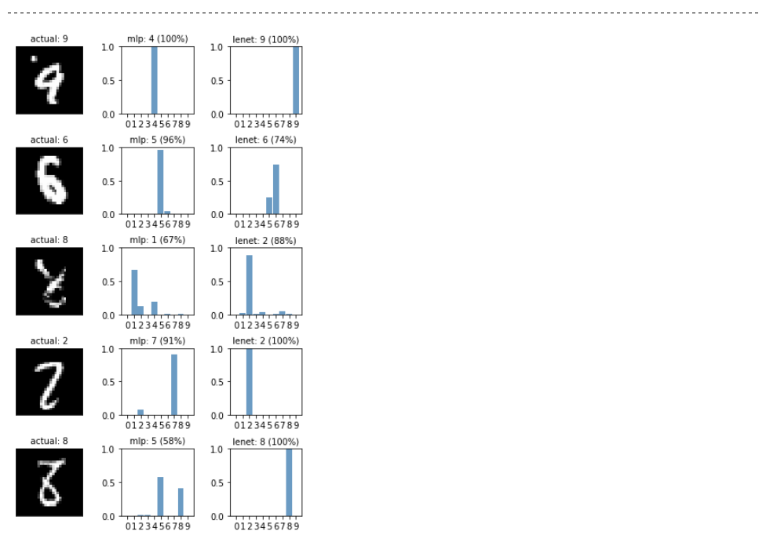

从上面的图中，可以看到，Lenet的参数只有mlp的60%，但其的准确率比mlp提升了差不多1%。上面最后一张图中，有三列，第一列是数字图片，它们是mlp中分错的数字，第二列是mlp中的分类，第三列是lenet中的分类，可以看到lenet的确学到了一些mlp中没有的模式。下面再来看看哪些数字在lenet也分错了。

~~~python
# 错误分析
plot_predicted_sample([lenet_model, mlp_model], sample_count=5)   
~~~

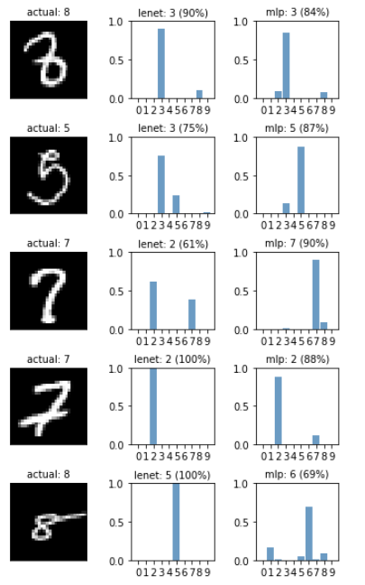

上图中，可以看到对于部分数字的识别，mlp甚至要更好一点啊，还有一些数字，则是一起都错了。

## Custom 1

下面自己定义一个模型，这个模型和lenet的主要区别是，增加了卷积的深度。

~~~python
def get_custom1(input_shape, learning_rate=0.001):
    input = layers.Input(shape=input_shape)
    x = layers.Conv2D(32, (3, 3), activation='relu', padding='same')(input)
    x = layers.MaxPooling2D((2, 2))(x)
    x = layers.Conv2D(64, (3, 3), activation='relu')(x)
    x = layers.MaxPooling2D((2, 2))(x)   
    x = layers.Conv2D(64, (3, 3), activation='relu')(x)   
    x = layers.Flatten()(x)
    x = layers.Dense(64, activation='relu')(x)                        
    x = layers.Dense(10, activation='softmax')(x)  
    
    model = Model(inputs=input, outputs=x, name='custom1') 
    model.compile(optimizer=optimizers.Adam(learning_rate=learning_rate),
                  loss=losses.SparseCategoricalCrossentropy(),
                  metrics=['accuracy'])  
    model.checkpoint_path = './checkpoints/{}/checkpoint'.format(model.name)
    return model   

# 创建模型
custom1_model = get_custom1(input_shape)
custom1_model.summary()
~~~

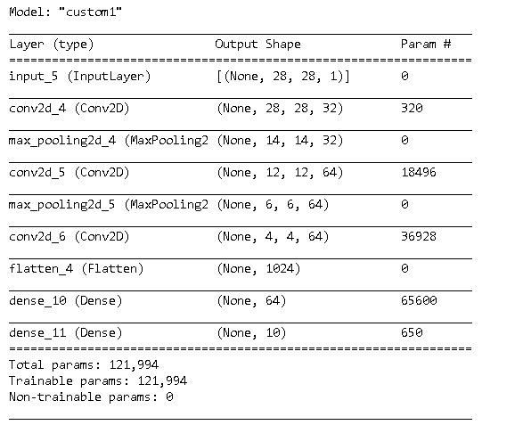

可以发现参数的个数已经和mlp差不多了，下面来训练模型。

~~~python
# 训练
history = train(custom1_model, epochs=20)
plot_history(history)
~~~

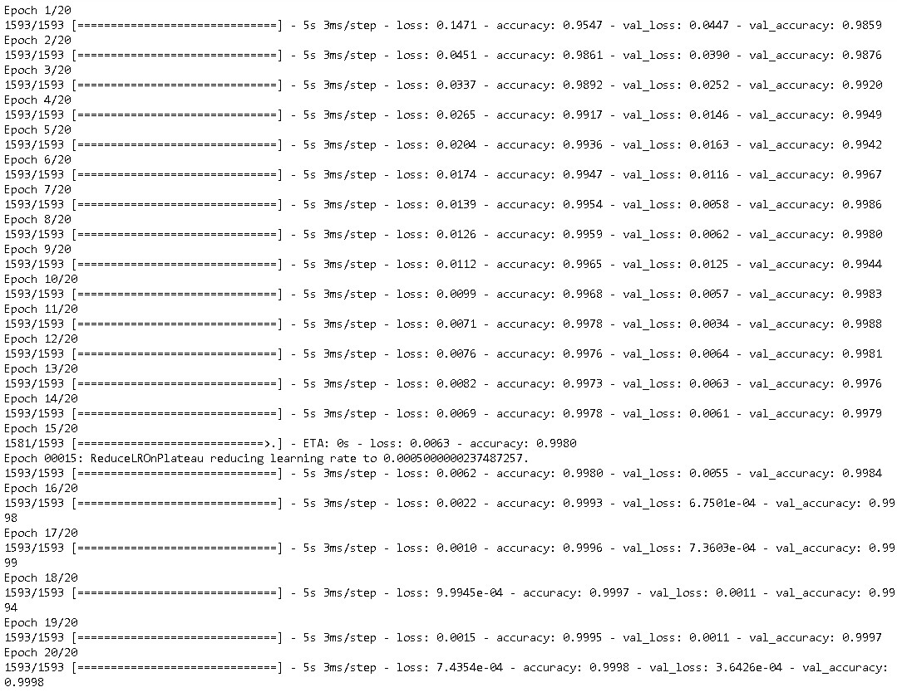

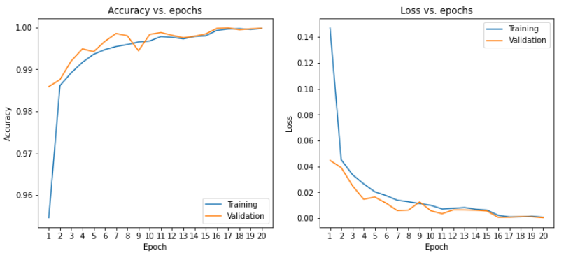

下面来评估模型并和lenet模型进行对比。

~~~python
# 评估
custom1_model = load_best_checkpoint(get_custom1(input_shape))
evaluate_show(custom1_model, 
              train_time=history.train_time,
              train_dataset=train_dataset, 
              val_dataset=val_dataset, 
              test_dataset=test_dataset, 
              models=models
             )

# 混淆矩阵
print('-'*120)
plot_confusion_matrix(lenet_model, 
                      model2=custom1_model, 
                      images=test_images, 
                      labels=test_labels)      

# 模型对比
print('-'*120)
plot_predicted_sample([lenet_model, custom1_model], 
                      images=test_images, 
                      labels=test_labels,
                      sample_count=5)   
~~~

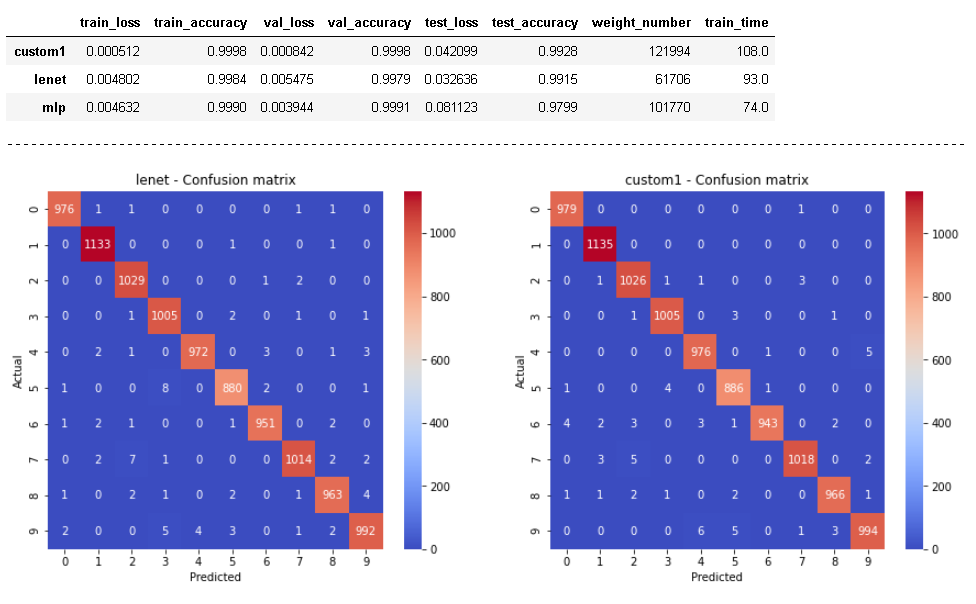

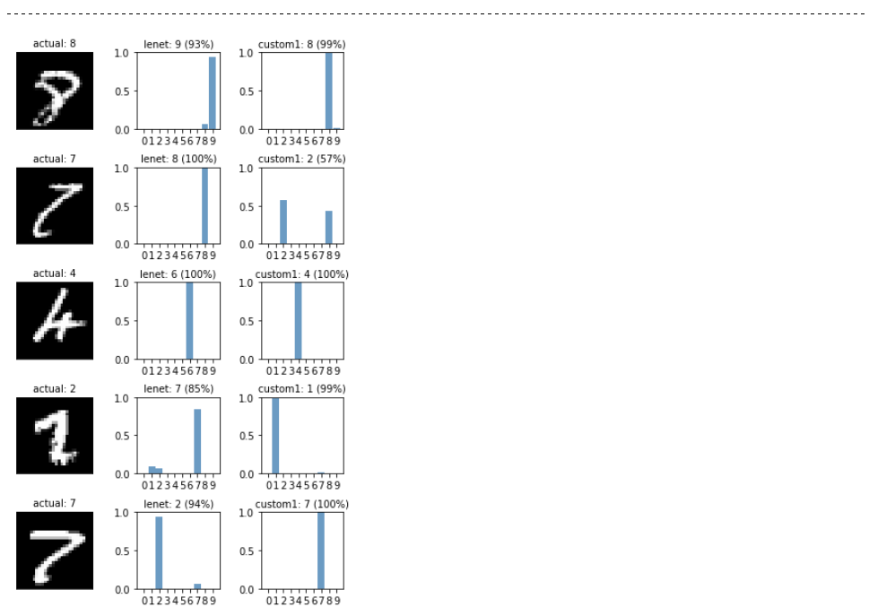

可以看到custom1模型的效果比lenet有些许提升（经过多次测试，平均好0.1-0.3个百分点）。上面最后一幅图，也能看到custom1模型学习到了不少新的模式。下面来看错误分析。

~~~python
# 错误分析
plot_predicted_sample([custom1_model, mlp_model, lenet_model], 
                      images=test_images, 
                      labels=test_labels,
                      sample_count=5)    
~~~

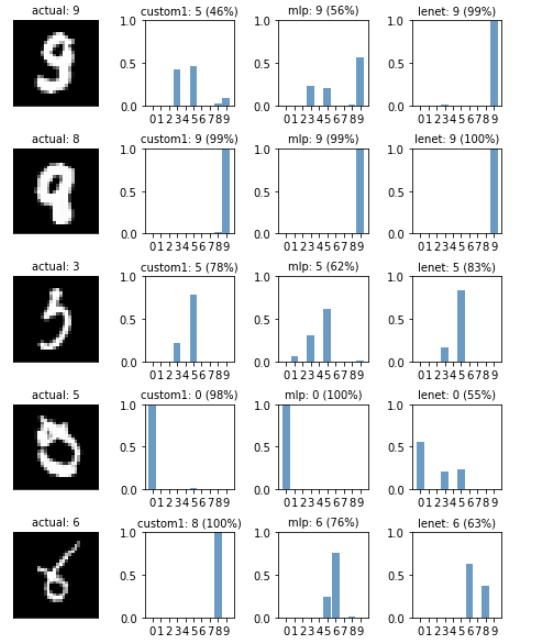

上图中，对于有些明显的数字，custom1识别错误，看来还不尽如人意啊。

## Custom 2

下面自己定义一个模型，这个模型和custom 1比起来，进一步增加了卷积的层数，同时增加了BatchNormalization，Dropout等减少过拟合的处理。

~~~python
def get_custom2(input_shape, learning_rate=0.001):   
    input = layers.Input(shape=input_shape)
    x = layers.Conv2D(32, (3, 3), padding='same', activation='relu')(input)
    x = layers.BatchNormalization()(x)
    x = layers.Conv2D(32, (3, 3), padding='same', activation='relu')(x)
    x = layers.MaxPooling2D((2, 2))(x)
    x = layers.Dropout(0.3)(x)
    
    x = layers.Conv2D(64, (3, 3), padding='same', activation='relu')(x)
    x = layers.BatchNormalization()(x)
    x = layers.Conv2D(64, (3, 3), padding='same', activation='relu')(x)
    x = layers.MaxPooling2D((2, 2))(x)
    x = layers.Dropout(0.3)(x)
    
    x = layers.Conv2D(128, (3, 3), padding='same', activation='relu')(x)
    x = layers.BatchNormalization()(x)
    x = layers.Conv2D(128, (3, 3), padding='same', activation='relu')(x)
    x = layers.MaxPooling2D((2, 2))(x)
    x = layers.Dropout(0.3)(x)
        
    x = layers.Flatten()(x)
    x = layers.Dense(128, activation='relu')(x)
    x = layers.Dropout(0.4)(x)    
    x = layers.Dense(10,  activation='softmax')(x)
    
    model = Model(inputs=input, outputs=x, name='custom2') 
    model.compile(optimizer=optimizers.Adam(learning_rate=learning_rate),
                  loss=losses.SparseCategoricalCrossentropy(),
                  metrics=['accuracy'])      
    model.checkpoint_path = './checkpoints/{}/checkpoint'.format(model.name)
    return model   

# 创建模型
custom2_model = get_custom2(input_shape)
custom2_model.summary()
~~~

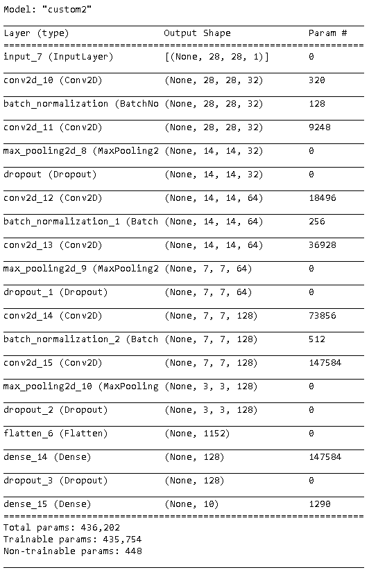

下面来训练模型。

~~~python
# 训练
history = train(custom2_model, epochs=20)
plot_history(history)
~~~

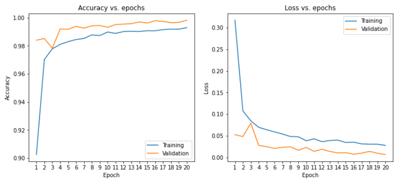

从上面的图可以看出，Validation数据集的准确率始终超过Train数据集，这证明BatchNormalization，Dropout的确减少了过拟合。

~~~python
# 评估
custom2_model = load_best_checkpoint(get_custom2(input_shape))
evaluate_show(custom2_model, 
              train_time=history.train_time,
              train_dataset=train_dataset, 
              val_dataset=val_dataset, 
              test_dataset=test_dataset, 
              models=models
             )

# 混淆矩阵
print('-'*120)
plot_confusion_matrix(custom1_model, 
                      model2=custom2_model, 
                      images=test_images, 
                      labels=test_labels)   

# 模型对比
print('-'*120)
plot_predicted_sample([custom1_model, custom2_model], 
                      images=test_images, 
                      labels=test_labels,
                      sample_count=5)   
~~~

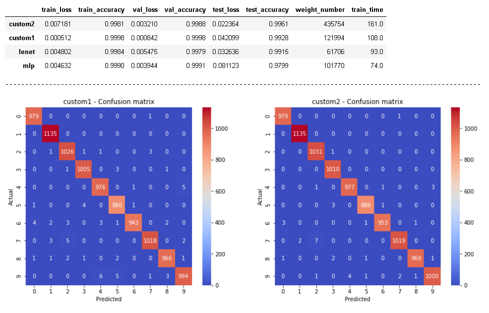

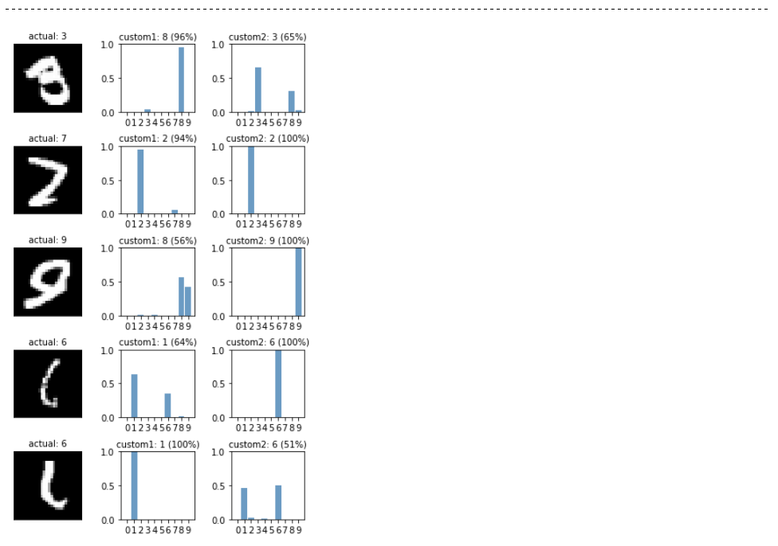

可以看到，custom 2的模型性能有明显提高（平均比custom 1好0.2-0.4个百分点），很明显修正custom 1的一些问题。对7和2，9和4之前的区分还是难点。最后我们来看错误分析。

~~~python
# 错误分析
plot_predicted_sample([custom2_model, mlp_model, lenet_model, custom1_model], 
                      images=test_images, 
                      labels=test_labels,
                      sample_count=5)     
~~~

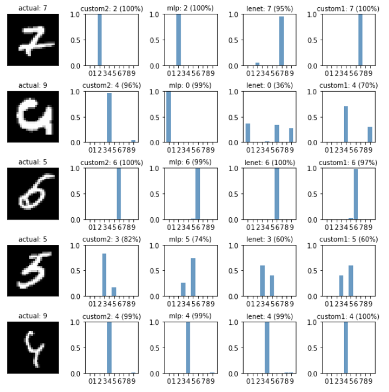

## 总结

归纳上面的模型训练结果，可以得出以下几个结论。

- MNIST数据集比较简单了，很简单的算法也能轻易取得99%的准确率。

- LeNet比经典的神经网络参数要少，模型收敛更快，准确率明显提升。

- 增加卷积的深度和层数，对于准确率的提升是有明显作用的。

- 增加BatchNormalization，Dropout可以有效减少过拟合。针对custom2模型，又尝试了几种情况。

  - custom3: 在custom2基础上，移除所有BatchNormalization，Dropout
  - custom4: 在custom2基础上，移除所有BatchNormalization，留下Dropout
  - custom5: 在custom2基础上，移除所有Dropout，留下BatchNormalization

  可以得到如下统计结果，可以看到Dropout和BatchNormalization提升效果都还不错，似乎Dropout更好一点（因为train_loss相对更高，过拟合程度低一些）。由此也可以推断，如果mlp，custom1和lenet添加Dropout和BatchNormalization层，也可以提升模型的效果。

  

上面最好的模型custom 2可以取得99.61%的准确率，距离State-of-the-Art的99.84%的准确率还有不小差距。未来还会尝试data augmentation等方法，以及其它模型，以便接近甚至达到State-of-the-Art。

## 参考

- [TensorFlow 2 quickstart for beginners](https://www.tensorflow.org/tutorials/quickstart/beginner)
- [image-classification-on-mnist](https://paperswithcode.com/sota/image-classification-on-mnist)

## 历史

- 2020-10-26：初始版本。
- 2020-10-28：采用相同算法，对Fashion Mnist数据集进行分类。
- 2020-11-01：pytorch训练时，增加了validation accuaracy。
- 2020-12-12：移除了pytorch的内容，集中tensorflow本身，尝试多个模型，同时增加了分析方法。