# Image Classification 12-25

## mnist_1225

### test2

~~~python
params = {
    'dataset_name': 'mnist',
    'validation_percent': 0,    
    'use_data_augmentation': False,
    'augmentation_generator': image_data_generator(),   
    'batch_size': 32,    
    'epochs': 120,    
    'learning_rate':0.001,
    'dropout':0.1,
    'metrics':['accuracy'], 
    'use_lr_schedule': False,
    'lr_schedule': lr_schedule,
    'model_params':{
        'mlp':{'dropout':0.4},
        'lenet':{'dropout':0.2},
        'custom':{'dropout':0.3},
        'vgg':{'dropout':0.4},
        'resnet':{}
    }
}
~~~

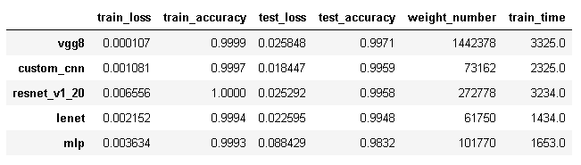

调整了几个model的dropout，accuracy基本没有提高。

### test1

~~~python
params = {
    'dataset_name': 'mnist-aug',
    'validation_percent': 0,    
    'use_data_augmentation': False,
    'augmentation_generator': image_data_generator(),   
    'batch_size': 32,    
    'epochs': 120,    
    'learning_rate':0.001,
    'dropout':0.1,
    'metrics':['accuracy'], 
    'use_lr_schedule': False,
    'lr_schedule': lr_schedule,
    'model_params':{
        'mlp':{'dropout':0.3},
        'lenet':{'dropout':0.3},
        'custom':{'dropout':0.3},
        'vgg':{'dropout':0.3},
        'resnet':{}
    }
}
~~~

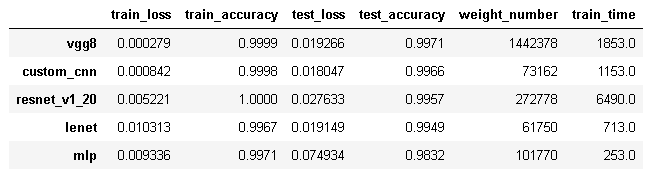

## mnist-aug_1225

### test2

~~~python
def image_data_generator():
    datagen = preprocessing.image.ImageDataGenerator(
        # set input mean to 0 over the dataset
        featurewise_center=False,
        # set each sample mean to 0
        samplewise_center=False,
        # divide inputs by std of dataset
        featurewise_std_normalization=False,
        # divide each input by its std
        samplewise_std_normalization=False,
        # apply ZCA whitening
        zca_whitening=False,
        # randomly rotate images in the range (deg 0 to 180)
        rotation_range=30,
        # randomly shift images horizontally
        width_shift_range=0.1,
        # randomly shift images vertically
        height_shift_range=0.1,
        # randomly flip images
        horizontal_flip=False,
        # randomly flip images
        vertical_flip=False
    )    
    return datagen    

params = {
    'dataset_name': 'mnist-aug',
    'validation_percent': 0,    
    'use_data_augmentation': True,
    'augmentation_generator': image_data_generator(),   
    'batch_size': 32,    
    'epochs': 120,    
    'learning_rate':0.001,
    'dropout':0.1,
    'metrics':['accuracy'], 
    'use_lr_schedule': False,
    'lr_schedule': lr_schedule,
    'model_params':{
        'mlp':{'dropout':0.1},
        'lenet':{'dropout':0.2},
        'custom':{'dropout':0.2},
        'vgg':{'dropout':0.3},
        'resnet':{}
    }
}
~~~

另外从test1结果上看，data augmentation提高了泛化能力，过拟合明显减少。所以上面普遍减少了dropout的值。而且增大了data augmentation的力度，从Accuracy来看，mlp回到了之前的准确率，看来是力度偏大了。

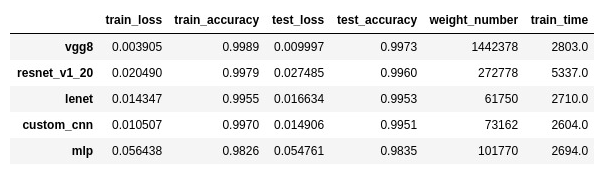

### test1

~~~python
def image_data_generator():
    datagen = preprocessing.image.ImageDataGenerator(
        # set input mean to 0 over the dataset
        featurewise_center=False,
        # set each sample mean to 0
        samplewise_center=False,
        # divide inputs by std of dataset
        featurewise_std_normalization=False,
        # divide each input by its std
        samplewise_std_normalization=False,
        # apply ZCA whitening
        zca_whitening=False,
        # randomly rotate images in the range (deg 0 to 180)
        rotation_range=15,
        # randomly shift images horizontally
        width_shift_range=0.05,
        # randomly shift images vertically
        height_shift_range=0.05,
        # randomly flip images
        horizontal_flip=False,
        # randomly flip images
        vertical_flip=False
    )    
    return datagen    

params = {
    'dataset_name': 'mnist-aug',
    'validation_percent': 0,    
    'use_data_augmentation': True,
    'augmentation_generator': image_data_generator(),   
    'batch_size': 32,    
    'epochs': 120,    
    'learning_rate':0.001,
    'dropout':0.1,
    'metrics':['accuracy'], 
    'use_lr_schedule': False,
    'lr_schedule': lr_schedule,
    'model_params':{
        'mlp':{'dropout':0.3},
        'lenet':{'dropout':0.3},
        'custom':{'dropout':0.3},
        'vgg':{'dropout':0.3},
        'resnet':{}
    }
}
~~~

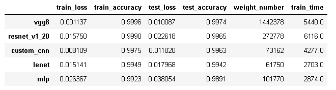

很明显，对于mlp算法，data augmentation性能提升明显。

## fashion-mnist_1225

### test2

~~~python
params = {
    'dataset_name': 'fashion-mnist',
    'validation_percent': 0,    
    'use_data_augmentation': False,
    'augmentation_generator': image_data_generator(),   
    'batch_size': 32,    
    'epochs': 120,    
    'learning_rate':0.001,
    'dropout':0.1,
    'metrics':['accuracy'], 
    'use_lr_schedule': False,
    'lr_schedule': lr_schedule,
    'model_params':{
        'mlp':{'dropout':0.4},
        'lenet':{'dropout':0.2},
        'custom':{'dropout':0.3},
        'vgg':{'dropout':0.4},
        'resnet':{}
    }
}
~~~

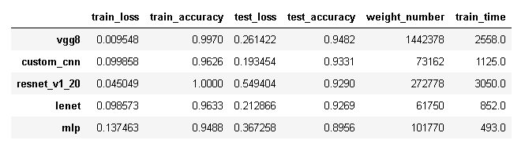

vgg8性能好一点点，看上去有点儿作用。

### test1

~~~python
params = {
    'dataset_name': 'fashion-mnist-aug',
    'validation_percent': 0,    
    'use_data_augmentation': False,
    'augmentation_generator': image_data_generator(),   
    'batch_size': 32,    
    'epochs': 120,    
    'learning_rate':0.001,
    'dropout':0.1,
    'metrics':['accuracy'], 
    'use_lr_schedule': False,
    'lr_schedule': lr_schedule,
    'model_params':{
        'mlp':{'dropout':0.3},
        'lenet':{'dropout':0.3},
        'custom':{'dropout':0.3},
        'vgg':{'dropout':0.3},
        'resnet':{}
    }
}
~~~

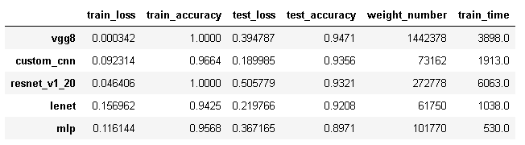

## fashion-mnist-aug_1225

### test2

~~~python
def image_data_generator():
    datagen = preprocessing.image.ImageDataGenerator(
        # set input mean to 0 over the dataset
        featurewise_center=False,
        # set each sample mean to 0
        samplewise_center=False,
        # divide inputs by std of dataset
        featurewise_std_normalization=False,
        # divide each input by its std
        samplewise_std_normalization=False,
        # apply ZCA whitening
        zca_whitening=False,
        # randomly rotate images in the range (deg 0 to 180)
        rotation_range=0,
        # randomly shift images horizontally
        width_shift_range=0.1,
        # randomly shift images vertically
        height_shift_range=0.1,
        # randomly flip images
        horizontal_flip=False,
        # randomly flip images
        vertical_flip=False
    )    
    return datagen  

params = {
    'dataset_name': 'fashion-mnist-aug',
    'validation_percent': 0,    
    'use_data_augmentation': True,
    'augmentation_generator': image_data_generator(),   
    'batch_size': 32,    
    'epochs': 120,    
    'learning_rate':0.001,
    'dropout':0.1,
    'metrics':['accuracy'], 
    'use_lr_schedule': False,
    'lr_schedule': lr_schedule,
    'model_params':{
        'mlp':{'dropout':0.1},
        'lenet':{'dropout':0.1},
        'custom':{'dropout':0.2},
        'vgg':{'dropout':0.3},
        'resnet':{}
    }
}
~~~

上面增加width_shift_range和height_shift_range到了0.1。从结果来看，性能全面有所提高，vgg8提高不少。

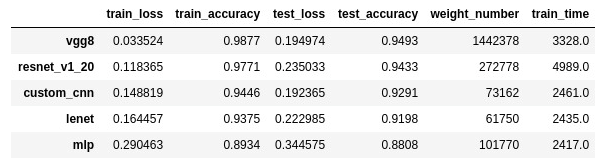

### test1

~~~python
def image_data_generator():
    datagen = preprocessing.image.ImageDataGenerator(
        # set input mean to 0 over the dataset
        featurewise_center=False,
        # set each sample mean to 0
        samplewise_center=False,
        # divide inputs by std of dataset
        featurewise_std_normalization=False,
        # divide each input by its std
        samplewise_std_normalization=False,
        # apply ZCA whitening
        zca_whitening=False,
        # randomly rotate images in the range (deg 0 to 180)
        rotation_range=15,
        # randomly shift images horizontally
        width_shift_range=0.05,
        # randomly shift images vertically
        height_shift_range=0.05,
        # randomly flip images
        horizontal_flip=False,
        # randomly flip images
        vertical_flip=False
    )    
    return datagen  

params = {
    'dataset_name': 'fashion-mnist-aug',
    'validation_percent': 0,    
    'use_data_augmentation': True,
    'augmentation_generator': image_data_generator(),   
    'batch_size': 32,    
    'epochs': 120,    
    'learning_rate':0.001,
    'dropout':0.1,
    'metrics':['accuracy'], 
    'use_lr_schedule': False,
    'lr_schedule': lr_schedule,
    'model_params':{
        'mlp':{'dropout':0.3},
        'lenet':{'dropout':0.3},
        'custom':{'dropout':0.3},
        'vgg':{'dropout':0.3},
        'resnet':{}
    }
}
~~~

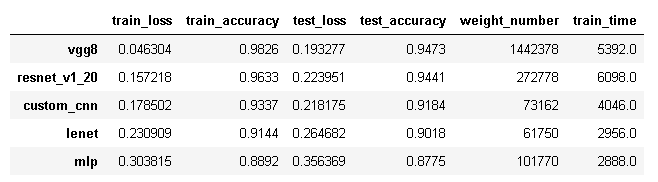

从fashion-minst的图片来看，resnet的效果提升明显，而其它模型的data augmentation效果不佳。

## cifar10_1225

### test2

~~~python
params = {
    'dataset_name': 'cifar10',
    'validation_percent': 0,    
    'use_data_augmentation': False,
    'augmentation_generator': image_data_generator(),   
    'batch_size': 32,    
    'epochs': 120,    
    'learning_rate':0.001,
    'dropout':0.1,
    'metrics':['accuracy'], 
    'use_lr_schedule': False,
    'lr_schedule': lr_schedule,
    'model_params':{
        'mlp':{'dropout':0.1},
        'lenet':{'dropout':0.2},
        'custom':{'dropout':0.2},
        'vgg':{'dropout':0.4},
        'resnet':{}
    }
}
~~~

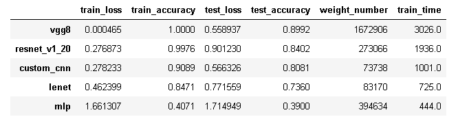

性能都有一些提升，不错！

### test1

~~~python
 params = {
    'dataset_name': 'cifar10',
    'validation_percent': 0,    
    'use_data_augmentation': False,
    'augmentation_generator': image_data_generator(),   
    'batch_size': 32,    
    'epochs': 120,    
    'learning_rate':0.001,
    'dropout':0.1,
    'metrics':['accuracy'], 
    'use_lr_schedule': False,
    'lr_schedule': lr_schedule,
    'model_params':{
        'mlp':{'dropout':0.3},
        'lenet':{'dropout':0.3},
        'custom':{'dropout':0.3},
        'vgg':{'dropout':0.3},
        'resnet':{}
    }
}
~~~

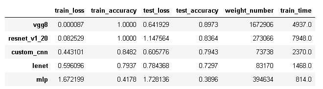

## cifar10-aug_1225

### test2

~~~python
def image_data_generator():
    datagen = preprocessing.image.ImageDataGenerator(
        # set input mean to 0 over the dataset
        featurewise_center=False,
        # set each sample mean to 0
        samplewise_center=False,
        # divide inputs by std of dataset
        featurewise_std_normalization=False,
        # divide each input by its std
        samplewise_std_normalization=False,
        # apply ZCA whitening
        zca_whitening=False,
        # randomly rotate images in the range (deg 0 to 180)
        rotation_range=0,
        # randomly shift images horizontally
        width_shift_range=0.1,
        # randomly shift images vertically
        height_shift_range=0.1,
        # randomly flip images
        horizontal_flip=True,
        # randomly flip images
        vertical_flip=False) 
    return datagen 

params = {
    'dataset_name': 'cifar10-aug',
    'validation_percent': 0,    
    'use_data_augmentation': True,
    'augmentation_generator': image_data_generator(),   
    'batch_size': 32,    
    'epochs': 120,    
    'learning_rate':0.001,
    'dropout':0.1,
    'metrics':['accuracy'], 
    'use_lr_schedule': False,
    'lr_schedule': lr_schedule,
    'model_params':{
        'mlp':{'dropout':0.0},
        'lenet':{'dropout':0.1},
        'custom':{'dropout':0.1},
        'vgg':{'dropout':0.3},
        'resnet':{}
    }
}
~~~

大幅度降低mlp，lenet，custom的dropout，对于vgg和resnet没有调整，主要为再次验证。

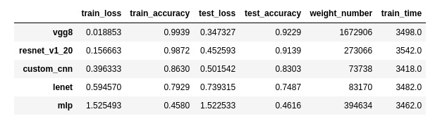

可以看到经过dropout的调整，mlp，lenet，custom的accuracy大大提高了。vgg和resnet再次取得了不错的成绩。

### test1

~~~python
def image_data_generator():
    datagen = preprocessing.image.ImageDataGenerator(
        # set input mean to 0 over the dataset
        featurewise_center=False,
        # set each sample mean to 0
        samplewise_center=False,
        # divide inputs by std of dataset
        featurewise_std_normalization=False,
        # divide each input by its std
        samplewise_std_normalization=False,
        # apply ZCA whitening
        zca_whitening=False,
        # randomly rotate images in the range (deg 0 to 180)
        rotation_range=0,
        # randomly shift images horizontally
        width_shift_range=0.1,
        # randomly shift images vertically
        height_shift_range=0.1,
        # randomly flip images
        horizontal_flip=True,
        # randomly flip images
        vertical_flip=False) 
    return datagen 

params = {
    'dataset_name': 'cifar10-aug',
    'validation_percent': 0,    
    'use_data_augmentation': True,
    'augmentation_generator': image_data_generator(),   
    'batch_size': 32,    
    'epochs': 120,    
    'learning_rate':0.001,
    'dropout':0.1,
    'metrics':['accuracy'], 
    'use_lr_schedule': False,
    'lr_schedule': lr_schedule,
    'model_params':{
        'mlp':{'dropout':0.3},
        'lenet':{'dropout':0.3},
        'custom':{'dropout':0.3},
        'vgg':{'dropout':0.3},
        'resnet':{}
    }
}
~~~

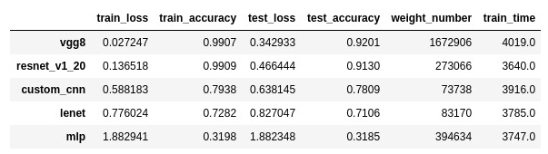

对于resnet提升非常巨大，从83.6%到91.3%，vgg8也提升明显，而简单一点的模型，则变化不大。