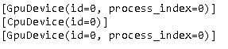
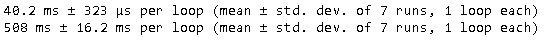
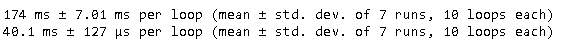
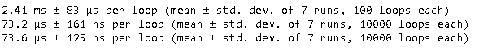
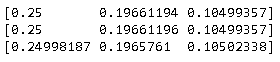
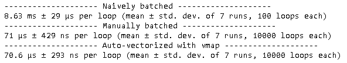

Jax 是 Autograd 和 XLA 的结合用以提供高性能机器学习研究。作为 Autograd 的更新版本，JAX 可以自动微分原生 Python 和 Numpy 函数。可通过 loops、branches、recursion 和 closures，进行微分，并且能够对导数的导数求导。支持反向模式微分（即反向传播）通过 `grad`。而且这两个可以被按照任意顺序复合。

JAX 独特之处在于它使用 [XLA](https://www.tensorflow.org/xla) (Accelerated Linear Algebra) 进行编译，可以在 GPU 和 TPU 上运行你的 Numpy 程序。编译默认按照系统调用被 JIT 编译和执行。但是 JAX 也可以使用一个单一函数的 API `jit`允许你 JIT 编译自己的 Python 函数入 XLA优化的内核。编译和自动微分可以任意复合，这样你可以表达足够复杂的算法并只需要 Python 的情况下获得最大程度的性能。你甚至可以使用 `pmap`对多个 GPU 或者 TPU 核进行编程，并整个地进行微分。

本质上，JAX 是一种对可复合的函数变换的扩展系统。`grad`和`jit` 是这样的变换的实例。另外有 `vmap`用来做自动向量化和 `pmap` 做单一程序多数据的多加速器的并行编程 。

## [Installation](https://github.com/google/jax#installation)

~~~
pip install --upgrade pip
pip install --upgrade jax jaxlib  # CPU-only version
pip install --upgrade jax jaxlib==0.1.67+cuda111 -f https://storage.googleapis.com/jax-releases/jax_releases.html   # GPU-support
~~~

## [Quickstart](https://jax.readthedocs.io/en/latest/notebooks/quickstart.html)

## 矩阵相乘

jax numpy的性能比numpy有很大提升。

~~~python
import jax
import jax.numpy as jnp
import numpy as np
from jax import grad, jit, vmap
from jax import random
from jax import device_put

print(jax.devices())
print(jax.devices('cpu'))
print(jax.devices('gpu'))
~~~

~~~python
size = 5000
key = random.PRNGKey(0)

x = random.normal(key, (size, size), dtype=jnp.float32)
# 由于JAX默认是异步执行，所以需要添加block_until_ready
%timeit jnp.dot(x, x.T).block_until_ready()  # runs on the GPU

x = np.random.normal(size=(size, size)).astype(np.float32)
%timeit np.dot(x, x.T)
~~~

可以看到jax numpy对性能提升巨大，比起原生的numpy有10倍以上的提高。

JAX也可以操作numpy的narray。

~~~python
%timeit jnp.dot(x, x.T).block_until_ready()

# 使用device_put把x放到默认的device（GPU）中，避免多次把数据传递到GPU
x = device_put(x)
%timeit jnp.dot(x, x.T).block_until_ready()
~~~

### 使用jit()加速

上节例子中，是单步的GPU计算，如果有多个操作，可以是使用`@jit`来调用XLA编译。

~~~python
def selu(x, alpha=1.67, lmbda=1.05):
    return lmbda * jnp.where(x > 0, x, alpha * jnp.exp(x) - alpha)

x = random.normal(key, (1000000,))
%timeit selu(x).block_until_ready()

selu_jit = jit(selu)
%timeit selu_jit(x).block_until_ready()

@jit
def selu(x, alpha=1.67, lmbda=1.05):
    return lmbda * jnp.where(x > 0, x, alpha * jnp.exp(x) - alpha)

%timeit selu(x).block_until_ready()
~~~

可以看到性能提升超过30倍。

### 使用grad()求导

~~~python
def sigmoid(x):
    return 1.0 / (1.0 + jnp.exp(-x))
    
def sum_logistic(x):
    return jnp.sum(sigmoid(x))

def derivative_sum_logistic(x):
    '''手工公式计算结果'''
    y = sigmoid(x)
    return y*(1 - y)

def first_finite_differences(f, x):
    '''手工计算结果'''
    eps = 1e-3
    return jnp.array([(f(x + eps * v) - f(x - eps * v)) / (2 * eps)
                      for v in jnp.eye(len(x))])

x_small = jnp.arange(3.)
derivative_fn = grad(sum_logistic)
print(derivative_fn(x_small))
print(derivative_sum_logistic(x_small))
print(first_finite_differences(sum_logistic, x_small))
~~~

### 使用vmap() Auto-vectorization

~~~python
def apply_matrix(v):
    return jnp.dot(mat, v)

def naively_batched_apply_matrix(v_batched):
    return jnp.stack([apply_matrix(v) for v in v_batched])

mat = random.normal(key, (150, 100))
batched_x = random.normal(key, (10, 100))

print('-'*20, 'Naively batched', '-'*20)
%timeit naively_batched_apply_matrix(batched_x).block_until_ready()

@jit
def batched_apply_matrix(v_batched):
    return jnp.dot(v_batched, mat.T)

print('-'*20, 'Manually batched', '-'*20)
%timeit batched_apply_matrix(batched_x).block_until_ready()

@jit
def vmap_batched_apply_matrix(v_batched):
    return vmap(apply_matrix)(v_batched)

print('-'*20,'Auto-vectorized with vmap', '-'*20)
%timeit vmap_batched_apply_matrix(batched_x).block_until_ready()
~~~

分析如下：

- 使用原生的集合遍历操作，简单，但性能不好。
- 使用内置的并行函数（矩阵操作），性能非常好，但扩展性不强。
- 使用vmap()，性能好，扩展性好。

