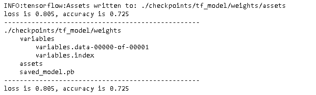
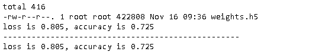
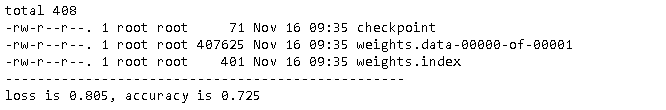
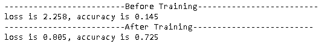
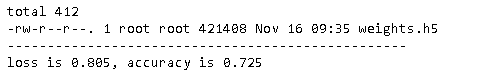
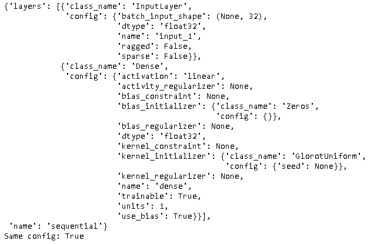
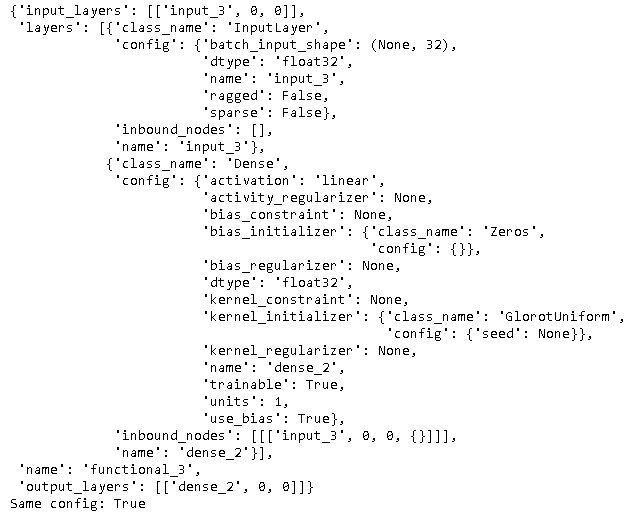
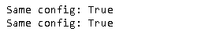

本文将详细描述在TensorFlow如何保存模型。本文主要描述模型的手工保存，关于在训练时保存模型，参见[Save Checkpoints](https://eipi10.cn/deep-learning/2020/11/09/callback/#save-checkpoints)。

## 模型结构

一个模型由以下四部分组成：

- 模型结构（architecture）

- 模型参数（weights）

- 优化器（optimizer ）

- losses and metrics

  在`model.compile`时定义，或者调用`add_loss()`和`add_metric()`时添加的。

  ~~~python
  model.compile(optimizer='adam',
                loss=tf.losses.SparseCategoricalCrossentropy(from_logits=True),
                metrics=[tf.metrics.SparseCategoricalAccuracy()])
  ~~~

根据模型的组成，模型的保存可以有如下方式。

- 保存整个模型：有两种格式：
  - TensorFlow的SavedModel格式
  - [HDF5](https://zhuanlan.zhihu.com/p/104145585)格式：保存成一个文件
- 保存参数：也有两种格式：
  - TensorFlow的Checkpoint格式
  - HDF5格式：保存成一个文件
- 保存模型结构：最常见的格式是JSON文件。

## 保存整个模型

### SavedModel格式

同样，保存整个模型，然后加载回来。

~~~python
def tree(path, intent=""):  
    if len(intent)>0:
        print(intent + os.path.basename(path))
    else:
        print(intent + path)
    if os.path.isdir(path):
        for child in os.listdir(path):  
            child_path = os.path.join(path, child) 
            tree(child_path, intent + "    ")
            

# 保存参数
checkpoint_dir = "./checkpoints/tf_model"
checkpoint_path = os.path.join(checkpoint_dir, "weights")
if not os.path.exists(checkpoint_dir):  os.makedirs(checkpoint_dir)
model.save(checkpoint_path)
evaulate(model, x_test, y_test)
print('-'*50)
tree(checkpoint_path)

# 加载参数
print('-'*50)
model = get_model()  # 创建模型
model = tf.keras.models.load_model(checkpoint_path)
evaulate(model, x_test, y_test)
~~~

可以发现在模型目录下生成了一些目录和文件：

- variables：该目录下有模型参数文件。
  - variables.index：参数的索引文件。如果在分布式情况下，参数可能会从不同的分区（shards）得到。
  - variables.data-00000-of-00001：参数文件。如果有多个分区，将会有多个文件。
- assets：保存TF计算图 (graph) 所用到的内容。
- saved_model.pb：模型的结构。包含 protobuf 对象序列化后的数据，包含了计算图，可以从中得到所有运算符（operators）的细节，也包含张量（tensors）和 Variables 定义，但不包含 Variable 的值，因此只能从中恢复计算图，但一些训练的权值仍需要从 checkpoint 中恢复。

### HDF5格式

保存整个模型，然后加载回来。

~~~python
# 保存参数
checkpoint_dir = "./checkpoints/h5_model"
checkpoint_path = os.path.join(checkpoint_dir, "weights.h5")
if not os.path.exists(checkpoint_dir):  os.makedirs(checkpoint_dir)
model.save(checkpoint_path)
! ls -l {checkpoint_dir}
evaulate(model, x_test, y_test)

# 加载参数
print('-'*50) 
model = tf.keras.models.load_model(checkpoint_path)
evaulate(model, x_test, y_test)
~~~

## 保存参数

### Checkpoint格式

同样也是保存模型参数，然后加载回来。

~~~python
# 保存参数
checkpoint_dir = "./checkpoints/tf_weights"
checkpoint_path = os.path.join(checkpoint_dir, "weights")
if not os.path.exists(checkpoint_dir):  os.makedirs(checkpoint_dir)
model.save_weights(checkpoint_path)
! ls -l {checkpoint_dir}

# 加载参数
print('-'*50)
model = get_model()  # 创建模型
model.load_weights(checkpoint_path)
evaulate(model, x_test, y_test)
~~~

上面的代码生成了三个文件：

- checkpoint：模型保存的路径。其内容如下。

  ~~~~shell
  model_checkpoint_path: "weights"
  all_model_checkpoint_paths: "weights"
  ~~~~

- weights.index：参数的索引文件。如果在分布式情况下，参数可能会从不同的分区（shards）得到。

- weights.data-00000-of-00001：参数文件。如果有多个分区，将会有多个文件。

### HDF5格式

 首先训练模型。

~~~python
import os
import tensorflow as tf
from tensorflow import keras

gpus = tf.config.experimental.list_physical_devices(device_type='GPU')
tf.config.experimental.set_memory_growth(device=gpus[0], enable=True)
tf.config.experimental.set_virtual_device_configuration(
  gpus[0],
  [tf.config.experimental.VirtualDeviceConfiguration(memory_limit=1024)]
)

def get_model():
    model = keras.models.Sequential()
    model.add(keras.layers.Flatten(input_shape=(28, 28)))
    model.add(keras.layers.Dense(128, activation='relu'))
    model.add(keras.layers.Dropout(0.2))
    model.add(keras.layers.Dense(10))    
    model.compile(
      optimizer='adam',
      loss=keras.losses.SparseCategoricalCrossentropy(from_logits=True),
      metrics=[tf.metrics.SparseCategoricalAccuracy()],
      # metrics=['accuracy'], 当采用这种方式时，使用load_model加载整个模型时，accuracy计算错误，目前原因不得而知
    )
    return model

def get_mnist():
    (x_train, y_train), (x_test, y_test) = tf.keras.datasets.fashion_mnist.load_data()
    x_train = x_train.astype("float32") / 255.0
    x_test = x_test.astype("float32") / 255.0
    x_train = x_train[:1024]
    y_train = y_train[:1024]
    x_test = x_test[:512]
    y_test = y_test[:512]    
    return x_train, y_train, x_test, y_test

def evaulate(model, x, y):
    loss, accuracy = model.evaluate(x, y, batch_size=256, verbose=0)
    print('loss is {:.3f}, accuracy is {:.3f}'.format(loss, accuracy))

x_train, y_train, x_test, y_test = get_mnist()

model = get_model()
print('-'*25 + 'Before Training' + '-'*25)
evaulate(model, x_test, y_test)

model.fit(
    x_train,
    y_train,
    batch_size=256,
    epochs=10,
    verbose=False,
    validation_split=0.5,
)

print('-'*25 + 'After Training' + '-'*25)
evaulate(model, x_test, y_test)
~~~

然后保存模型参数，然后加载回来。

~~~python
# 保存参数
checkpoint_dir = "./checkpoints/h5_weights"
checkpoint_path = os.path.join(checkpoint_dir, "weights.h5")
if not os.path.exists(checkpoint_dir):  os.makedirs(checkpoint_dir)
model.save_weights(checkpoint_path)
! ls -l {checkpoint_dir}

# 加载参数
print('-'*50)
model = get_model() 
model.load_weights(checkpoint_path)
evaulate(model, x_test, y_test)
~~~

## 保存模型结构

也可以单独保存模型结构。通过`model.get_config()`获取模型结构，通过 `keras.Sequential.from_config()`加载模型结构。当然，最常见的还是把模型结构保存为JSON文件。

### Sequential Model

~~~python
import json
from tensorflow import keras
from pprint import pprint

seq_model = keras.Sequential([keras.Input((32,)), keras.layers.Dense(1)])
config = seq_model.get_config()
pprint(config)

new_model = keras.Sequential.from_config(config)
print('Same config:', seq_model.get_config() == new_model.get_config())
~~~

###  Functional Model 

~~~python
inputs = keras.Input((32,))
outputs = keras.layers.Dense(1)(inputs)
fun_model = keras.Model(inputs, outputs)
config = fun_model.get_config()
pprint(config)

model_same_config = keras.Model.from_config(config)
print('Same config:', fun_model.get_config() == model_same_config.get_config())
~~~

### 保存JSON文件

也可以保存到json格式，然后根据json文件创建一个新的模型。

~~~python
import json

def save_load_checking(json_file, model):
    json_string = model.to_json()
    with open(json_file, 'w') as f:
        json.dump(json_string, f)

    with open(json_file, 'r') as f:
        json_string = json.load(f)

    new_model = keras.models.model_from_json(json_string)
    print('Same config:', model.get_config() == new_model.get_config())
    
    
save_load_checking('seq_config.json', seq_model)
save_load_checking('fun_config.json', fun_model)
~~~

## HDF5 vs. SavedModel

最后简单来比较一下HDF5和Saved Model。

|                     | SavedModel | HDF5          |
| ------------------- | ---------- | ------------- |
| architecture        | yes        | yes           |
| weights             | yes        | yes           |
| execution graph     | no         | yes           |
| save custom objects | manually   | automatically |

在TF官网中明确推荐SavedModel格式。

## 参考

- [Save and load models](https://www.tensorflow.org/tutorials/keras/save_and_load#what_are_these_files)
- [Using the SavedModel format](https://www.tensorflow.org/guide/saved_model)
- [Making new Layers and Models via subclassing](https://www.tensorflow.org/guide/keras/custom_layers_and_models)
- [tf.keras.callbacks.ModelCheckpoint](https://www.tensorflow.org/api_docs/python/tf/keras/callbacks/ModelCheckpoint)

