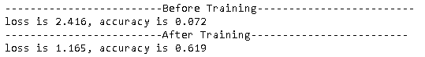
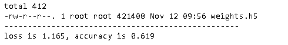
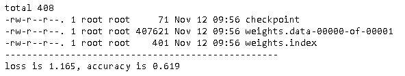

本文将详细描述模型保存过程的使用。

## 保存参数
有两种格式：

- [HDF5](https://zhuanlan.zhihu.com/p/104145585)格式：保存成一个文件
- TensorFlow格式

### HDF5格式

 首先训练模型。

  ~~~python
import os
import tensorflow as tf
from tensorflow import keras

gpus = tf.config.experimental.list_physical_devices(device_type='GPU')
tf.config.experimental.set_virtual_device_configuration(
  gpus[0],
  [tf.config.experimental.VirtualDeviceConfiguration(memory_limit=1024)]
)

def get_model():
    model = keras.models.Sequential()
    model.add(keras.layers.Flatten(input_shape=(28, 28)))
    model.add(keras.layers.Dense(128, activation='relu'))
    model.add(keras.layers.Dropout(0.2))
    model.add(keras.layers.Dense(10))    
    model.compile(
      optimizer=keras.optimizers.RMSprop(learning_rate=0.1),
      loss=keras.losses.SparseCategoricalCrossentropy(from_logits=True),
      metrics=["accuracy"],
    )
    return model

def get_mnist():
    (x_train, y_train), (x_test, y_test) = tf.keras.datasets.fashion_mnist.load_data()
    x_train = x_train.astype("float32") / 255.0
    x_test = x_test.astype("float32") / 255.0
    x_train = x_train[:1024]
    y_train = y_train[:1024]
    x_test = x_test[:512]
    y_test = y_test[:512]    
    return x_train, y_train, x_test, y_test

def evaulate(model, x, y):
    loss, accuracy = model.evaluate(x, y, batch_size=256, verbose=0)
    print('loss is {:.3f}, accuracy is {:.3f}'.format(loss, accuracy))

x_train, y_train, x_test, y_test = get_mnist()

model = get_model()
print('-'*25 + 'Before Training' + '-'*25)
evaulate(model, x_test, y_test)

model.fit(
    x_train,
    y_train,
    batch_size=256,
    epochs=10,
    verbose=False,
    validation_split=0.5,
)

print('-'*25 + 'After Training' + '-'*25)
evaulate(model, x_test, y_test)
  ~~~

然后保存模型参数，然后加载回来。

~~~python
# 保存参数
checkpoint_dir = "./checkpoints/h5_weights"
checkpoint_path = os.path.join(checkpoint_dir, "weights.h5")
if not os.path.exists(checkpoint_dir):  os.makedirs(checkpoint_dir)
model.save_weights(checkpoint_path)
! ls -l {checkpoint_dir}

# 加载参数
print('-'*50)
model = get_model() 
model.load_weights(checkpoint_path)
evaulate(model, x_test, y_test)
~~~

### SavedModel格式

同样也是保存模型参数，然后加载回来。

~~~python
# 保存参数
checkpoint_dir = "./checkpoints/tf_weights"
checkpoint_path = os.path.join(checkpoint_dir, "weights")
if not os.path.exists(checkpoint_dir):  os.makedirs(checkpoint_dir)
model.save_weights(checkpoint_path)
! ls -l {checkpoint_dir}

# 加载参数
print('-'*50)
model = get_model()  # 创建模型
model.load_weights(checkpoint_path)
evaulate(model, x_test, y_test)
~~~

上面的代码生成了三个文件：

- checkpoint：模型保存的路径。其内容如下。

  ~~~~shell
  model_checkpoint_path: "weights"
  all_model_checkpoint_paths: "weights"
  ~~~~

- weights.index：参数的索引文件。如果在分布式情况下，参数可能会从不同的分区（shards）得到。

- weights.data-00000-of-00001：参数文件。如果有多个分区，将会有多个文件。

## 保存整个模型

总体思路保存参数基本相同。也有两种格式：

- [HDF5](https://zhuanlan.zhihu.com/p/104145585)格式：保存成一个文件
- TensorFlow格式

### HDF5格式

~~~python
# 保存参数
checkpoint_dir = "./checkpoints/h5_model"
checkpoint_path = os.path.join(checkpoint_dir, "weights.h5")
if not os.path.exists(checkpoint_dir):  os.makedirs(checkpoint_dir)
model.save(checkpoint_path)
! ls -l {checkpoint_dir}
evaulate(model, x_test, y_test)

# 加载参数
print('-'*50) 
model = tf.keras.models.load_model(checkpoint_path)
evaulate(model, x_test, y_test)
~~~

### SavedModel格式

~~~python
# 保存参数
checkpoint_dir = "./checkpoints/tf_model"
checkpoint_path = os.path.join(checkpoint_dir, "weights")
if not os.path.exists(checkpoint_dir):  os.makedirs(checkpoint_dir)
model.save(checkpoint_path)
evaulate(model, x_test, y_test)
! ls -l {checkpoint_dir}

# 加载参数
print('-'*50)
model = get_model()  # 创建模型
model = tf.keras.models.load_model(checkpoint_path)
evaulate(model, x_test, y_test)
~~~

## Save Checkpoints

## 保存自定义对象

## 参考

- [Save and load models](https://www.tensorflow.org/tutorials/keras/save_and_load#what_are_these_files)
- [Using the SavedModel format](https://www.tensorflow.org/guide/saved_model)
- [Making new Layers and Models via subclassing](https://www.tensorflow.org/guide/keras/custom_layers_and_models)

