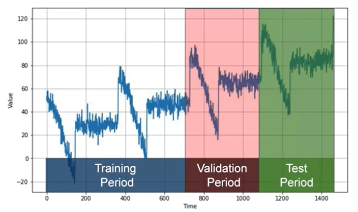
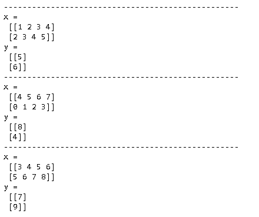
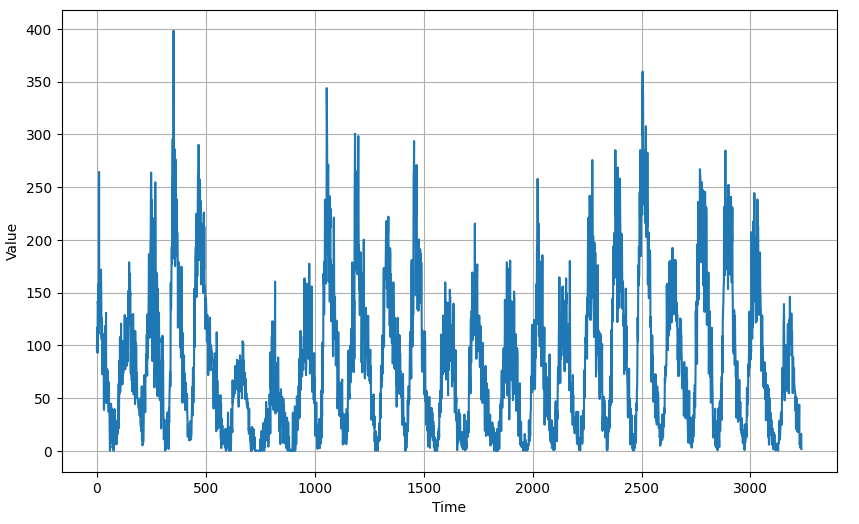
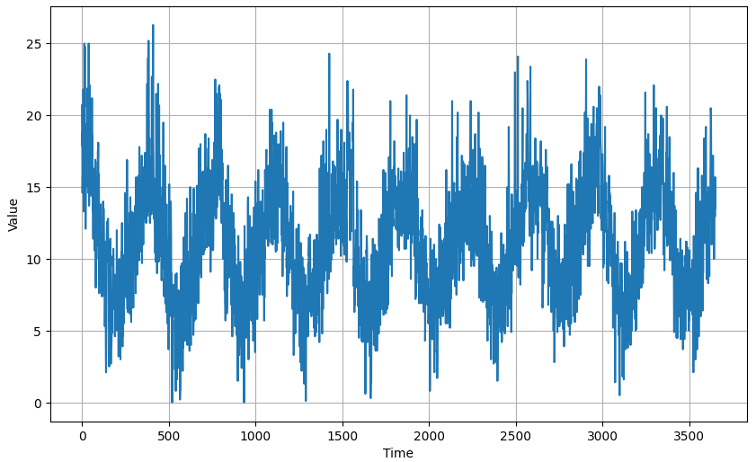

# [Sequences, Time Series and Prediction](https://www.coursera.org/learn/tensorflow-sequences-time-series-and-prediction/home/welcome)

## Week 1: Sequences and Prediction

### Train, validation and test sets

- 每一个数据集至少包含完整的一个season。
- roll-forward partitioning
- 在训练完成，选定模型后，往往还会针对测试数据进行重新的训练，因为测试数据距离现在最近，最能反应数据的即时特征。

### Metrics for evaluating performance

- errors = forecasts - actual
- mse = np.square(errors).mean()
- rmse = np.sqrt(mse)
- mae = np.abs(errors).mean()
- mape = np.abs(errors/x_valid).mean()

### [C4_W1_Lab_1_time_series](http://15.15.175.163:18888/notebooks/eipi10/xuxiangwen.github.io/_notes/05-ai/54-tensorflow/sequences-time-series-and-prediction/C4_W1_Lab_1_time_series.ipynb)

用非常简单的方式，模拟了时间序列中的趋势（Trend）， 季节性（Seasonality），噪音（Noise），自相关（Autocorrelation）， 脉冲（impulse）。同时进行了一些简单的分析，使用ARIMA部分视频中没有，而且由于版本问题，无法执行。

### [C4_W1_Lab_2_forecasting](http://15.15.175.163:18888/notebooks/eipi10/xuxiangwen.github.io/_notes/05-ai/54-tensorflow/sequences-time-series-and-prediction/C4_W1_Lab_2_forecasting.ipynb)

对trend+seasonality的数据进行预测，采用的方法有：

1. 朴素预测 Naive Forecast：采用前一天的值来预测
2. 移动平均（moving average）预测
3. 季节性 + 差分移动平均 
4. 季节性移动平均 + 差分移动平均

采用MSE和MAE进行评估，模型的效果排名如下：

模型4 > 模型3 > 模型1 > 模型2

### [C4_W1_Assignment](http://15.15.175.163:18888/notebooks/eipi10/xuxiangwen.github.io/_notes/05-ai/54-tensorflow/sequences-time-series-and-prediction/C4_W1_Assignment.ipynb#)

和上面的notebook几乎相同。

## Week 2: Deep Neural Networks for Time Series

### [C4_W2_Lab_1_features_and_labels](http://15.15.175.163:18888/notebooks/eipi10/xuxiangwen.github.io/_notes/05-ai/54-tensorflow/sequences-time-series-and-prediction/C4_W2_Lab_1_features_and_labels.ipynb)

介绍了如何使用`dataset.window`把数据分成窗口数据。

~~~python
dataset = tf.data.Dataset.range(10)
dataset = dataset.window(5, shift=1, drop_remainder=True)
dataset = dataset.flat_map(lambda window: window.batch(5))
dataset = dataset.map(lambda window: (window[:-1], window[-1:]))
dataset = dataset.shuffle(buffer_size=10)
dataset = dataset.batch(2).prefetch(1)
for x,y in dataset:
    print('-'*50) 
    print("x = \n", x.numpy())
    print("y = \n", y.numpy())
~~~

### [C4_W2_Lab_2_single_layer_NN](http://15.15.175.163:18888/notebooks/eipi10/xuxiangwen.github.io/_notes/05-ai/54-tensorflow/sequences-time-series-and-prediction/C4_W2_Lab_2_single_layer_NN.ipynb)

采用线性回归，预测sequence。核心代码如下：

~~~python
def windowed_dataset(series, window_size, batch_size, shuffle_buffer):
    dataset = tf.data.Dataset.from_tensor_slices(series)
    dataset = dataset.window(window_size + 1, shift=1, drop_remainder=True)
    dataset = dataset.flat_map(lambda window: window.batch(window_size + 1))
    dataset = dataset.shuffle(shuffle_buffer).map(lambda window: (window[:-1], window[-1]))
    dataset = dataset.batch(batch_size).prefetch(1)
    return dataset

dataset = windowed_dataset(x_train, window_size, batch_size, shuffle_buffer_size)
val_dataset = windowed_dataset(x_valid, window_size, batch_size, shuffle_buffer_size)
print(dataset)

l0 = tf.keras.layers.Dense(1, input_shape=[window_size])
model = tf.keras.models.Sequential([l0])
model.compile(loss="mse", optimizer=tf.keras.optimizers.SGD(learning_rate=1e-6, momentum=0.9))
model.fit(dataset,epochs=100, validation_data=val_dataset)

print("Layer weights {}".format(l0.get_weights()))
~~~

### [C4_W2_Lab_3_deep_NN](http://15.15.175.163:18888/notebooks/eipi10/xuxiangwen.github.io/_notes/05-ai/54-tensorflow/sequences-time-series-and-prediction/C4_W2_Lab_3_deep_NN.ipynb#%E4%B8%89%E5%B1%82%E7%BB%8F%E5%85%B8%E7%A5%9E%E7%BB%8F%E7%BD%91%E7%BB%9C)

上面代码集大成者。集成了从移动平均，single layer到三层layer的预测。

### [C4_W2_Assignment](http://15.15.175.163:18888/notebooks/eipi10/xuxiangwen.github.io/_notes/05-ai/54-tensorflow/sequences-time-series-and-prediction/C4_W2_Assignment.ipynb)

和上面的notebook几乎相同。

## Week 3: Recurrent Neural Networks for Time Series

这一周的课程，引入了RNN，LSTM总体结构和上一周的结构，相同。

### [C4_W3_Lab_1_RNN.ipynb](http://15.15.175.163:18888/notebooks/eipi10/xuxiangwen.github.io/_notes/05-ai/54-tensorflow/sequences-time-series-and-prediction/C4_W3_Lab_1_RNN.ipynb)

### [C4_W3_Lab_2_LSTM.ipynb](http://15.15.175.163:18888/notebooks/eipi10/xuxiangwen.github.io/_notes/05-ai/54-tensorflow/sequences-time-series-and-prediction/C4_W3_Lab_2_LSTM.ipynb)

### [C4_W3_Assignment.ipynb](http://15.15.175.163:18888/notebooks/eipi10/xuxiangwen.github.io/_notes/05-ai/54-tensorflow/sequences-time-series-and-prediction/C4_W3_Assignment.ipynb)

和上面的notebook几乎相同。

## Week 4: Real-world time series data

这一周的课程，引入了实际的数据集，总体结构和上一周的结构，相同。

### [C4_W4_Lab_1_LSTM.ipynb](http://15.15.175.163:18888/notebooks/eipi10/xuxiangwen.github.io/_notes/05-ai/54-tensorflow/sequences-time-series-and-prediction/C4_W4_Lab_1_LSTM.ipynb)

还是使用之前人造的数据，但是引入了Conv1D。

### [C4_W4_Lab_2_Sunspots.ipynb](http://15.15.175.163:18888/notebooks/eipi10/xuxiangwen.github.io/_notes/05-ai/54-tensorflow/sequences-time-series-and-prediction/C4_W4_Lab_2_Sunspots.ipynb)

引入了实际数据集Sunspots.csv。其它和上面结构几乎相同。

### [C4_W4_Lab_3_DNN_only.ipynb](http://15.15.175.163:18888/notebooks/eipi10/xuxiangwen.github.io/_notes/05-ai/54-tensorflow/sequences-time-series-and-prediction/C4_W4_Lab_3_DNN_only.ipynb)

不适用卷积神经网络，也不适用RNN，只使用经典神经网络。

~~~
model = tf.keras.models.Sequential([
    tf.keras.layers.Dense(20, input_shape=[window_size], activation="relu"), 
    tf.keras.layers.Dense(10, activation="relu"),
    tf.keras.layers.Dense(1)
])
~~~

### [C4_W4_Assignment.ipynb](http://15.15.175.163:18888/notebooks/eipi10/xuxiangwen.github.io/_notes/05-ai/54-tensorflow/sequences-time-series-and-prediction/C4_W4_Assignment.ipynb)

引入了实际数据集daily-min-temperatures.csv， 和上面结构几乎相同。

[time_series

## [time_series_introduce.ipynb](http://15.15.175.163:18888/notebooks/eipi10/xuxiangwen.github.io/_notes/05-ai/54-tensorflow/sequences-time-series-and-prediction/time_series_introduce.ipynb)

这个课程是time series的入门课程，本文把本课程的内容进行梳理，之后只要看这篇文章便可。
