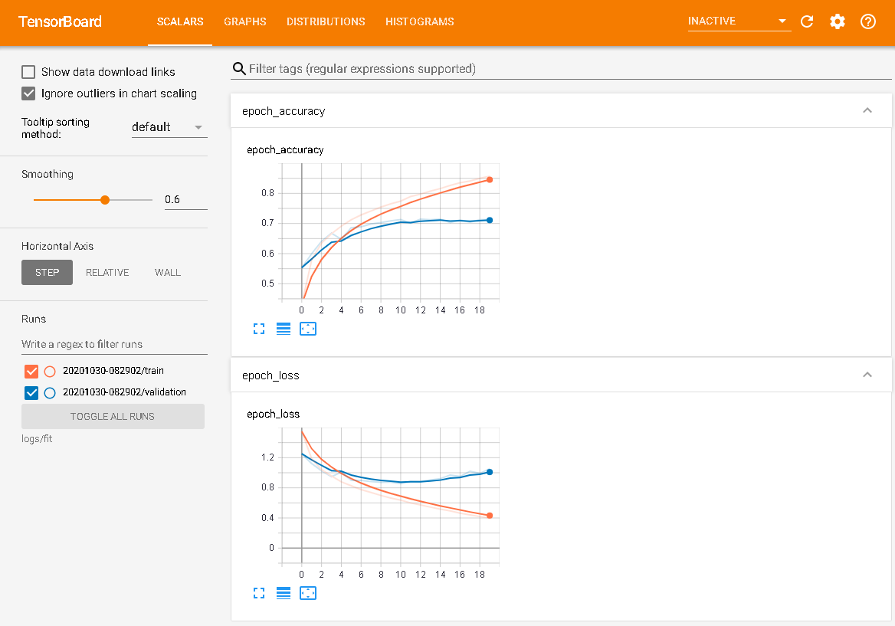
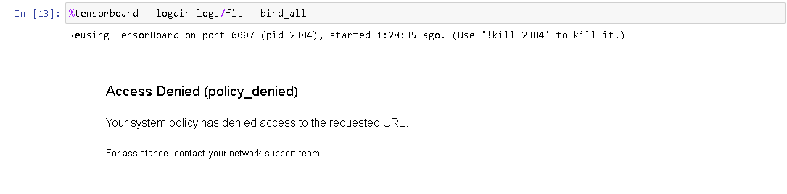

## TensorBoard


~~~python
import datetime
import logging
import os
import tensorflow as tf
import time
from tensorflow.keras import datasets, layers, models
import matplotlib.pyplot as plt

logging.basicConfig(format='%(asctime)s: %(levelname)s: %(message)s')
logging.root.setLevel(level=logging.INFO)

# 设置GPU内存使用上限
gpus = tf.config.experimental.list_physical_devices(device_type='GPU')
print(gpus)
tf.config.experimental.set_virtual_device_configuration(
    gpus[0],
    [tf.config.experimental.VirtualDeviceConfiguration(memory_limit=1024)]
)

class TaskTime:
    def __init__(self, task_name, show_start=False):
        self.show_start = show_start
        self.task_name = task_name
        self.start_time = time.time()

    def elapsed_time(self):
        return time.time()-self.start_time

    def __enter__(self):
        if self.show_start:
            logging.info('start {}'.format(self.task_name))
        return self;

    def __exit__(self, exc_type, exc_value, exc_tb):
        time.sleep(0.5)
        logging.info('finish {} [elapsed time: {:.2f} seconds]'.format(self.task_name, self.elapsed_time()))
~~~

然后加载数据。

~~~python
def tf_cifar10_extract_data():
    with TaskTime('获取数据', True):
        # 默认的保存路径是~/.keras/datasets/
        (train_images, train_labels), (test_images, test_labels) = datasets.cifar10.load_data()

        # Normalize pixel values to be between 0 and 1
        train_images, test_images = train_images / 255.0, test_images / 255.0

        print(train_images.shape, train_labels.shape, train_images.shape, test_labels.shape)
        print(type(train_images), type(train_labels.shape))

    with TaskTime('显示图片示例', True):
        class_names = ['airplane', 'automobile', 'bird', 'cat', 'deer',
                       'dog', 'frog', 'horse', 'ship', 'truck']

        plt.figure(figsize=(10,2))
        for i in range(5):
            plt.subplot(1,5,i+1)
            plt.xticks([])
            plt.yticks([])
            plt.grid(False)
            plt.imshow(train_images[i])
            # The CIFAR labels happen to be arrays, 
            # which is why you need the extra index
            plt.xlabel(class_names[train_labels[i][0]])
        plt.show()
    
    return train_images, train_labels, test_images, test_labels

train_images, train_labels, test_images, test_labels = tf_cifar10_extract_data()
~~~


接下来是模型创建，模型训练，保存加载，以及模型评估的代码。

~~~python
def tf_train_evaluate(model, epochs=10, save_model=False, callbacks=None):   
    with TaskTime('显示参数', True):
        model.summary()

    with TaskTime('模型训练', True):    
        model.compile(optimizer='adam',
                      loss=tf.keras.losses.SparseCategoricalCrossentropy(from_logits=True),
                      metrics=['accuracy'])
        history = model.fit(train_images, train_labels, epochs=epochs, batch_size=32,
                            callbacks=callbacks, validation_data=(test_images, test_labels))

    if save_model:
        with TaskTime('保存，加载模型', True): 
            model_root_path = os.path.join(os.path.expanduser('~'), '.keras/model') 
            if not os.path.exists(model_root_path): os.makedirs(model_root_path)
            model_path = os.path.join(model_root_path, 'tf_lenet.h5')
            model.save(model_path) 
            model = tf.keras.models.load_model(model_path)  

    with TaskTime('评估模型', True): 
        plt.plot(history.history['accuracy'], label='accuracy')
        plt.plot(history.history['val_accuracy'], label = 'val_accuracy')
        plt.xlabel('Epoch')
        plt.ylabel('Accuracy')
        plt.ylim([0.5, 1])
        plt.legend(loc='lower right')

        train_loss, train_acc = model.evaluate(train_images,  train_labels, verbose=2)
        test_loss, test_acc = model.evaluate(test_images,  test_labels, verbose=2)
        print('Train Accuracy: {:0.1f}%, Test Accuracy: {:0.1f}%'.format(100 * train_acc, 100*test_acc)) 
    

~~~


~~~python
def lenet1(in_dim=1, n_class=10):
    model = models.Sequential()
    model.add(layers.Conv2D(32, (3, 3), activation='relu', input_shape=(32, 32, in_dim)))
    model.add(layers.MaxPooling2D((2, 2)))
    model.add(layers.Conv2D(64, (3, 3), activation='relu'))
    model.add(layers.MaxPooling2D((2, 2)))
    model.add(layers.Conv2D(64, (3, 3), activation='relu'))    
    model.add(layers.Flatten())
    model.add(layers.Dense(64, activation='relu'))
    model.add(layers.Dense(n_class))    
    return model
~~~


~~~python
# !rm -rf logs/fit/
log_dir="logs/fit/" + datetime.datetime.now().strftime("%Y%m%d-%H%M%S")
tensorboard_callback = tf.keras.callbacks.TensorBoard(log_dir=log_dir, histogram_freq=1)

with TaskTime('创建模型', True): 
    model = lenet1(in_dim=3, n_class=10)

tf_train_evaluate(model, epochs=20, callbacks=[tensorboard_callback])
~~~


~~~python
%load_ext tensorboard
~~~

~~~python
%tensorboard --help
~~~

```shell
TensorBoard is a suite of web applications for inspecting and understanding
your TensorFlow runs and graphs. https://github.com/tensorflow/tensorboard

positional arguments:
  {serve,dev}           TensorBoard subcommand (defaults to 'serve')
    serve               start local TensorBoard server (default subcommand)
    dev                 upload data to TensorBoard.dev

optional arguments:
  -h, --help            show this help message and exit
  --helpfull            show full help message and exit
  --logdir PATH         Directory where TensorBoard will look to find
                        TensorFlow event files that it can display.
                        TensorBoard will recursively walk the directory
                        structure rooted at logdir, looking for .*tfevents.*
                        files. A leading tilde will be expanded with the
                        semantics of Python's os.expanduser function.
  --logdir_spec PATH_SPEC
                        Like `--logdir`, but with special interpretation for
                        commas and colons: commas separate multiple runs,
                        where a colon specifies a new name for a run. For
                        example: `tensorboard --logdir_spec=name1:/path/to/log
                        s/1,name2:/path/to/logs/2`. This flag is discouraged
                        and can usually be avoided. TensorBoard walks log
                        directories recursively; for finer-grained control,
                        prefer using a symlink tree. Some features may not
                        work when using `--logdir_spec` instead of `--logdir`.
  --host ADDR           What host to listen to (default: localhost). To serve
                        to the entire local network on both IPv4 and IPv6, see
                        `--bind_all`, with which this option is mutually
                        exclusive.
  --bind_all            Serve on all public interfaces. This will expose your
                        TensorBoard instance to the network on both IPv4 and
                        IPv6 (where available). Mutually exclusive with
                        `--host`.
  --port PORT           Port to serve TensorBoard on. Pass 0 to request an
                        unused port selected by the operating system, or pass
                        "default" to try to bind to the default port (6006)
                        but search for a nearby free port if the default port
                        is unavailable. (default: "default").
  --purge_orphaned_data BOOL
                        Whether to purge data that may have been orphaned due
                        to TensorBoard restarts. Setting
                        --purge_orphaned_data=False can be used to debug data
                        disappearance. (default: True)
  --db URI              [experimental] sets SQL database URI and enables DB
                        backend mode, which is read-only unless --db_import is
                        also passed.
  --db_import           [experimental] enables DB read-and-import mode, which
                        in combination with --logdir imports event files into
                        a DB backend on the fly. The backing DB is temporary
                        unless --db is also passed to specify a DB path to
                        use.
  --inspect             Prints digests of event files to command line. This is
                        useful when no data is shown on TensorBoard, or the
                        data shown looks weird. Must specify one of `logdir`
                        or `event_file` flag. Example usage: `tensorboard
                        --inspect --logdir mylogdir --tag loss` See tensorboar
                        d/backend/event_processing/event_file_inspector.py for
                        more info.
  --version_tb          Prints the version of Tensorboard
  --tag TAG             tag to query for; used with --inspect
  --event_file PATH     The particular event file to query for. Only used if
                        --inspect is present and --logdir is not specified.
  --path_prefix PATH    An optional, relative prefix to the path, e.g.
                        "/path/to/tensorboard". resulting in the new base url
                        being located at localhost:6006/path/to/tensorboard
                        under default settings. A leading slash is required
                        when specifying the path_prefix. A trailing slash is
                        optional and has no effect. The path_prefix can be
                        leveraged for path based routing of an ELB when the
                        website base_url is not available e.g.
                        "example.site.com/path/to/tensorboard/".
  --window_title TEXT   changes title of browser window
  --max_reload_threads COUNT
                        The max number of threads that TensorBoard can use to
                        reload runs. Not relevant for db read-only mode. Each
                        thread reloads one run at a time. (default: 1)
  --reload_interval SECONDS
                        How often the backend should load more data, in
                        seconds. Set to 0 to load just once at startup and a
                        negative number to never reload at all. Not relevant
                        for DB read-only mode. (default: 5.0)
  --reload_task TYPE    [experimental] The mechanism to use for the background
                        data reload task. The default "auto" option will
                        conditionally use threads for legacy reloading and a
                        child process for DB import reloading. The "process"
                        option is only useful with DB import mode. The
                        "blocking" option will block startup until reload
                        finishes, and requires --load_interval=0. (default:
                        auto)
  --reload_multifile BOOL
                        [experimental] If true, this enables experimental
                        support for continuously polling multiple event files
                        in each run directory for newly appended data (rather
                        than only polling the last event file). Event files
                        will only be polled as long as their most recently
                        read data is newer than the threshold defined by
                        --reload_multifile_inactive_secs, to limit resource
                        usage. Beware of running out of memory if the logdir
                        contains many active event files. (default: false)
  --reload_multifile_inactive_secs SECONDS
                        [experimental] Configures the age threshold in seconds
                        at which an event file that has no event wall time
                        more recent than that will be considered an inactive
                        file and no longer polled (to limit resource usage).
                        If set to -1, no maximum age will be enforced, but
                        beware of running out of memory and heavier filesystem
                        read traffic. If set to 0, this reverts to the older
                        last-file-only polling strategy (akin to
                        --reload_multifile=false). (default: 86400 - intended
                        to ensure an event file remains active if it receives
                        new data at least once per 24 hour period)
  --generic_data TYPE   [experimental] Hints whether plugins should read from
                        generic data provider infrastructure. For plugins that
                        support only the legacy multiplexer APIs or only the
                        generic data APIs, this option has no effect. The
                        "auto" option enables this only for plugins that are
                        considered to have stable support for generic data
                        providers. (default: auto)
  --samples_per_plugin SAMPLES_PER_PLUGIN
                        An optional comma separated list of
                        plugin_name=num_samples pairs to explicitly specify
                        how many samples to keep per tag for that plugin. For
                        unspecified plugins, TensorBoard randomly downsamples
                        logged summaries to reasonable values to prevent out-
                        of-memory errors for long running jobs. This flag
                        allows fine control over that downsampling. Note that
                        0 means keep all samples of that type. For instance
                        "scalars=500,images=0" keeps 500 scalars and all
                        images. Most users should not need to set this flag.

debugger plugin:
  --debugger_data_server_grpc_port PORT
                        The port at which the non-interactive debugger data
                        server should receive debugging data via gRPC from one
                        or more debugger-enabled TensorFlow runtimes. No
                        debugger plugin or debugger data server will be
                        started if this flag is not provided. This flag
                        differs from the `--debugger_port` flag in that it
                        starts a non-interactive mode. It is for use with the
                        "health pills" feature of the Graph Dashboard. This
                        flag is mutually exclusive with `--debugger_port`.
  --debugger_port PORT  The port at which the interactive debugger data server
                        (to be started by the debugger plugin) should receive
                        debugging data via gRPC from one or more debugger-
                        enabled TensorFlow runtimes. No debugger plugin or
                        debugger data server will be started if this flag is
                        not provided. This flag differs from the
                        `--debugger_data_server_grpc_port` flag in that it
                        starts an interactive mode that allows user to pause
                        at selected nodes inside a TensorFlow Graph or between
                        Session.runs. It is for use with the interactive
                        Debugger Dashboard. This flag is mutually exclusive
                        with `--debugger_data_server_grpc_port`.

what-if-tool:
  --whatif-use-unsafe-custom-prediction YOUR_CUSTOM_PREDICT_FUNCTION.py
                        The file location of your custom prediction function.
                        Note that the flag executes arbitrary code, so make
                        sure you passed the correct file location. See how to
                        define the function in https://github.com/PAIR-
                        code/what-if-tool/blob/master/README.md
```

在模型训练的那台机器上，运行如下脚本

~~~python
tensorboard --logdir logs/fit --bind_all
~~~

然后在浏览器中查看模型训练的情况。有这么几种情况。

- 在本地机器训练

  打开http://localhost:6006。

- 在本地docker container上训练，container端口映射到本地6006

  打开http://localhost:6006/

- 在远程机器上训练。假设15.15.166.35是远程机器的IP。

  打开http://15.15.166.35:6006/

- 在远程机器上的docker container训练。有两种方式

  - 打开http://15.15.166.35:16006/

    这个container端口映射到远程机器的16006端口，然后本地通过代理登录到远程机器。

  - 打开http://localhost:6006/

    ~~~python
    ssh -L 6006:127.0.0.1:16006 grid@15.15.166.35
    ~~~

打开后界面如下，可以看到很多训练的细节，非常的不错。



> *tensorboard --logdir logs/fit --bind_all*也可以在jupyter notebook中执行，当jupyter notebook不是部署在本地，会得到以下错误*Access Denied (policy_denied)*。
>
> 
>
> 目前还没发现方法解决。

## 参考

- [TF Implementing LeNet-5 in TensorFlow 2.0](http://datahacker.rs/lenet-5-implementation-tensorflow-2-0/)
- https://onezero.blog/start-your-cnn-journey-with-pytorch-in-python/： pytorch增加曲线图。

## 历史

- 