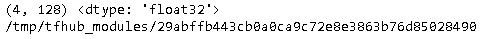

## Overview

TensorFlow Hub 是一个包含经过训练的机器学习模型的代码库，这些模型稍作调整便可部署到任何设备上。您只需几行代码即可重复使用经过训练的模型，例如 BERT 和 Faster R-CNN。

## Guide

### Installation

~~~shell
pip install --upgrade tensorflow-hub
~~~

### Overview

在看一看TensorFlow Hub之前，首先引入所需要的包。

~~~shell
import tensorflow as tf 
import tensorflow_hub as hub
from tensorflow.keras import models, layers

def set_gpu_memory(gpu_memory_limit=None):
    gpus = tf.config.experimental.list_physical_devices(device_type='GPU')
    print('set max gpu memory to {}'.format(gpu_memory_limit))
    tf.config.experimental.set_virtual_device_configuration(
        gpus[0],
        [tf.config.experimental.VirtualDeviceConfiguration(memory_limit=gpu_memory_limit)]
    )
    
set_gpu_memory(2048)    
~~~

下载nnlm-en-dim128，它是一个预训练好的text embedding模型，它能够把文本数据转化为向量。

~~~python
handler = "https://tfhub.dev/google/nnlm-en-dim128/2"
hub_layer = hub.KerasLayer(handler)
embeddings = hub_layer(["The rain in Spain.", "falls",
                        "mainly", "In the plain!"])

print(embeddings.shape, embeddings.dtype) 
# 默认情况下handler所指向的模型，将会下载到/tmp/tfhub_modules目录下。
print(hub.resolve(handler))
~~~

### Examples

~~~python
handler = "https://tfhub.dev/google/nnlm-en-dim128/2"
embeddings = hub.KerasLayer(handler, input_shape=[], dtype=tf.string, trainable=False)

model = models.Sequential()
model.add(embeddings)
model.add(tf.keras.layers.Dense(16, activation='relu'))
model.add(tf.keras.layers.Dense(1))

model.summary()
~~~

下面是两个例子：

- [basic_text_classification.ipynb](http://15.15.166.35:18888/notebooks/eipi10/xuxiangwen.github.io/_notes/05-ai/54-tensorflow/tensorflow_hub/basic_text_classification.ipynb)：使用tf hub来进行分类的。

- [tf2_image_retraining](http://15.15.166.35:18888/notebooks/eipi10/xuxiangwen.github.io/_notes/05-ai/54-tensorflow/tensorflow_hub/tf2_image_retraining.ipynb)：使用tf hub来对[flowers](https://www.tensorflow.org/datasets/catalog/tf_flowers)数据集进行分类。

## Tutorials

