本文将详细介绍Conv2d，并比较torch和tensorflow中的定义，然后通过它们实现经典的[LeNet](https://www.jiqizhixin.com/graph/technologies/6c9baf12-1a32-4c53-8217-8c9f69bd011b)。

## [torch.nn.Conv2d](https://pytorch.org/docs/stable/nn.html?highlight=conv2d#torch.nn.Conv2d)

~~~python
class torch.nn.Conv2d(
  in_channels,  # int，输入通道数
  out_channels, # int，输出通道数
  kernel_size,  # int或Tuple[int, int]，卷积核大小
  stride=1,     # int或Tuple[int, int]，滑动窗口，指每次卷积对原数据滑动stride个单元格
  padding=0,    # int或Tuple[int, int]，两边的空白填充（一般补0）
  dilation=1,   # int或Tuple[int, int]，膨胀系数，一个卷积核内部之间的间隔
  groups=1,     # int，Number of blocked connections from input channels to output channels. 
  bias=True,    # bool，是否启用bias
  padding_mode='zeros'  # str，选择有'zeros', 'reflect', 'replicate' or 'circular'
)
~~~

- input shape: $(N,C_{in}, H_{in},W_{in})$

  - $N$：batch size。也就是每次训练所使用的样本个数
  - $C_{in}$： 输入channel数量
  - $H_{in}$：输入图片的(像素)高度
  - $W_{in}$： 输入图性的(像素)宽度
  
- output shape: $(N,C_{out}, H_{out},W_{out})$

  - $N$：batch size。也就是每次训练所使用的样本个数
  - $C_{out}$： 输出channel数量
  - $H_{out}$：输出图片的(像素)高度
  - $W_{out}$：输出图片的(像素)宽度
  
  设$$\mathbf {S_{in}} = \begin{bmatrix} H_{in} & W_{in} \end{bmatrix}  $$，$$ \mathbf {S_{out} }= \begin{bmatrix} H_{out} & W_{out} \end{bmatrix}  $$，则
  $$
  \mathbf {S_{out}} = \lfloor \frac {\mathbf { S_{in}} + 2 \times \mathbf {padding}  - \mathbf {dilation} \circ (\mathbf {kernal\_size} -1 ) - 1} { \mathbf {stride}}  + 1 \rfloor
  $$
  上面的公式中，可以这样逐步理解。
  
  - $\mathbf {dilation} \circ (\mathbf {kernal\_size} -1 ) + 1 $： 表示一个卷积核所占的空间
  - ${\mathbf { S_{in}} + 2 \times \mathbf {padding}  - \mathbf {dilation} \circ (\mathbf {kernal\_size} -1 ) - 1}$：表示减去一个卷积核所占空间
  - $\frac {\mathbf { S_{in}} + 2 \times \mathbf {padding}  - \mathbf {dilation} \circ (\mathbf {kernal\_size} -1 ) - 1} { \mathbf {stride}}$ ：表示剩下空间可以容纳几个卷积核
  - $+ 1$：表示把第2步减去的卷积核，再加回来。
  - $\lfloor \cdots \rfloor$：表示向下取整。
  
  > 上面的逻辑同样适用于Conv1d，Conv3d
  
- dilation：膨胀系数，一个卷积核内部之间的间隔，默认为1，其卷积核如下图所示：

​		如果dilation=2，则卷积核如下图所示，计算时忽略白色各自，只有灰色的格子参与。

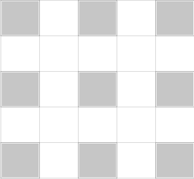

- 参数个数
    $$
    (H_{kernel\_size} \times W_{kernel\_size} \times C_{in} + 1) *C_{out}
    $$

    ~~~python
import torch 
    import torch.nn as nn
    
    conv2d = torch.nn.Conv2d(
        in_channels=3,
        out_channels=16,
        kernel_size=5
    )
    
    for parameters in conv2d.parameters():
        print(parameters.size())
    
    # 上面两行代码等价于下面代码    
    #print(conv2d.weights.size())
    #print(conv2d.bias.size())
    ~~~
    
    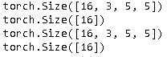

##  [tensorflow.keras.layers.Conv2D](https://www.tensorflow.org/api_docs/python/tf/keras/layers/Conv2D)

tensorflow.keras.layers.Conv2D和torch.nn.Conv2d非常相似，但它集成了更多的功能，比如kernel_initializer，bias_initializer，kernel_regularizer和bias_regularizer等。

~~~python
class tf.keras.layers.Conv2D(
    filters, 				# int，输出通道数
    kernel_size, 			# int或Tuple[int, int]，卷积核大小
    strides=(1, 1), 		# int或Tuple[int, int]，滑动窗口，每次卷积对原数据滑动stride个单元格
    padding='valid', 		# "valid"或"same"
    data_format=None,		# channels_last或channels_first。不指定表示是channels_last。
    dilation_rate=(1, 1), 	# int或Tuple[int, int]，膨胀系数，一个卷积核内部之间的间隔
    groups=1, 				# the number of groups in which the input is split along the channel axis
    activation=None, 		# 使用激活函数，默认不使用
    use_bias=True,			# bool，是否使用bias
    kernel_initializer='glorot_uniform', # 卷积核初始化方法
    bias_initializer='zeros',	# 偏差值初始化方法				
    kernel_regularizer=None, 	# 卷积核正则化
    bias_regularizer=None, 		# 偏差正则化
    activity_regularizer=None,	# activation函数的正则化，不太理解      
    kernel_constraint=None, 	# 卷积核的Constraint function，不太理解  
    bias_constraint=None, 		# bias的Constraint function，不太理解   
    **kwargs
)
~~~

- input shape

  - 当data_format=channels_last，则shape为$(N, H_{in},W_{in},C_{in})$
  - 当data_format=channels_first，则shape为$(N,C_{in}, H_{in},W_{in})$，和pytorch相同

- output shape

    - 当data_format=channels_last，则格式为 $(N, H_{out},W_{out},C_{out})$
    - 当data_format=channels_first，则格式为$(N,C_{out}，H_{out},W_{out})$，和pytorch相同

    设$$\mathbf {S_{in}} = \begin{bmatrix} H_{in} & W_{in} \end{bmatrix}  $$，$$ \mathbf {S_{out} }= \begin{bmatrix} H_{out} & W_{out} \end{bmatrix}  $$，则
    $$
    \mathbf {S_{out}} = 
    \begin{equation}  
    \left\{  
    \begin{array}{lcl}  
    \lfloor \frac {\mathbf { S_{in}}  - \mathbf {dilation} \circ (\mathbf {kernal\_size} -1 ) - 1} { \mathbf {stride}}  + 1 \rfloor  &  &  valid \\  
    \lfloor \frac {\mathbf { S_{in}} } { \mathbf {stride}}   \rfloor &  &  same  
    \end{array}  
    \right.
    \end{equation}
    $$

    > 上面的逻辑同样适用于Conv1d，Conv3d

- 参数个数

  $$
  (H_{kernel\_size} \times W_{kernel\_size} \times C_{in} + 1) *C_{out}
  $$

  ~~~python
  import tensorflow as tf
  
  conv2d = tf.keras.layers.Conv2D(
      filters=16, 
      kernel_size=5, 
      input_shape=[28,28,3])
  
  x = tf.ones([10, 28, 28, 3])
  y = conv2d(x)
  print(conv2d.kernel.shape)
  print(conv2d.bias.shape)
  ~~~

  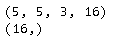

  从结果上看，参数的个数和pytorch完全相同，但维度的设置不同。

## padding逻辑

前文介绍了pytorch和tensorflow中关于padding逻辑，下面以Conv1D为例（Conv2D逻辑是相同的），展示了其中的细节，首先看tensorflow的padding。

- valid：边缘不填充

- same：边缘用0填充

  和pytorch中不同，tersoflow中边缘的填充更加的自动化。下面以$W_{kernel\_size}$为例。

  - 左边：填充$\lfloor  \frac 1 2 (W_{kernel\_size}-1) \rfloor $个数据
  - 右边：填充$\lfloor  \frac 1 2 W_{kernel\_size} \rfloor $个数据

  总体原则是两边补0，然后实际的数据尽量位于中心位置。当$\mathbf {stride}=1$，如下图所示。

  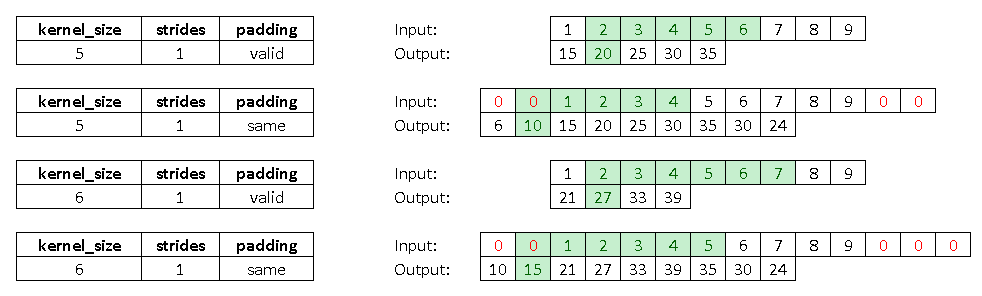

  当$\mathbf {stride}=2$，和上面不同在于，扣掉了一些数据。

  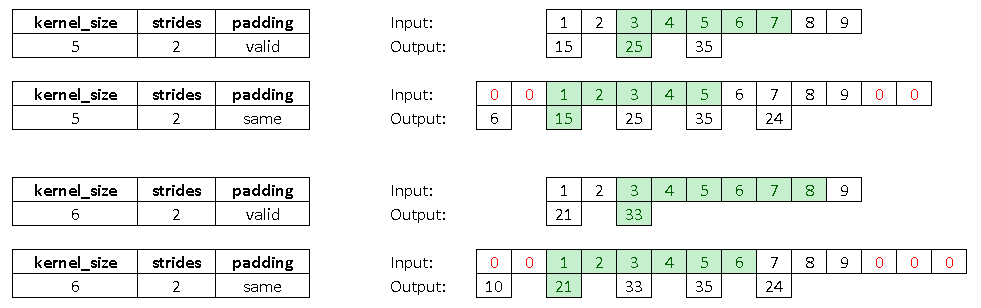

验证代码如下。

~~~python
import tensorflow as tf

def conv1d(x, kernel_size=4, strides=2, padding='same'):    
    print('-'*10 + 'kernel_size={}, strides={}, padding={}'.format(kernel_size, strides, padding) + '-'*10)
    y = tf.keras.layers.Conv1D(
        filters=1, 
        kernel_size=kernel_size, 
        strides=strides, 
        padding=padding,
        input_shape=x.shape[1:], 
        kernel_initializer='ones',
        bias_constraint='zeros'
    )(x)
    print(y)
    
input_shape = (1, 9, 1)
x = tf.constant([1, 2, 3, 4, 5, 6, 7, 8, 9], shape=input_shape, dtype=tf.float32)

print('='*25 + "strides=1" + '='*25)
conv1d(x, kernel_size=5, strides=1, padding='valid')
conv1d(x, kernel_size=5, strides=1, padding='same')
conv1d(x, kernel_size=6, strides=1, padding='valid')
conv1d(x, kernel_size=6, strides=1, padding='same')

print('='*25 + "strides=2" + '='*25)
conv1d(x, kernel_size=5, strides=2, padding='valid')
conv1d(x, kernel_size=5, strides=2, padding='same')
conv1d(x, kernel_size=6, strides=2, padding='valid')
conv1d(x, kernel_size=6, strides=2, padding='same')
~~~

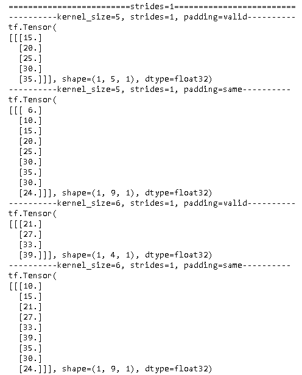

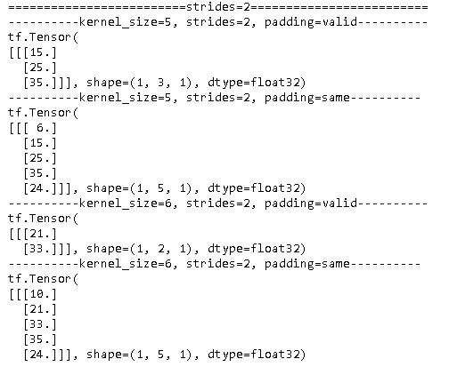

对于padding的添加，tensorflow更加的智能，而pytorch交给用户自己来决定。下面是pytorch的逻辑，非常相似。

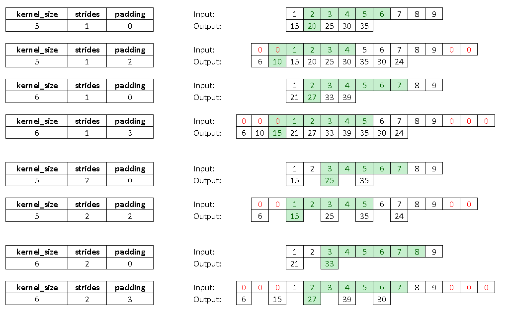

~~~pytorch
import torch 

def conv1d(x, kernel_size=4, stride=2, padding=0):   
    print('-'*10 + 'kernel_size={}, stride={}, padding={}'.format(kernel_size, stride, padding) + '-'*10)
    output = torch.nn.Conv1d(
        in_channels=1,
        out_channels=1,
        kernel_size=kernel_size,
        stride=stride, 
        padding=padding
    )
    output.weight = torch.nn.Parameter(torch.ones(1, 1, kernel_size))
    output.bias = torch.nn.Parameter(torch.zeros(1))
    y = output(x)
    print(y)
    

input_shape = (1, 1, 9)
x = torch.tensor([1, 2, 3, 4, 5, 6, 7, 8, 9], dtype=torch.float)
x = x.view(input_shape)
print('='*25 + "stride=1" + '='*25)
conv1d(x, kernel_size=5, stride=1, padding=0)
conv1d(x, kernel_size=5, stride=1, padding=2)
conv1d(x, kernel_size=6, stride=1, padding=0)
conv1d(x, kernel_size=6, stride=1, padding=3)

print('='*25 + "stride=2" + '='*25)
conv1d(x, kernel_size=5, stride=2, padding=0)
conv1d(x, kernel_size=5, stride=2, padding=2)
conv1d(x, kernel_size=6, stride=2, padding=0)
conv1d(x, kernel_size=6, stride=2, padding=3)
~~~

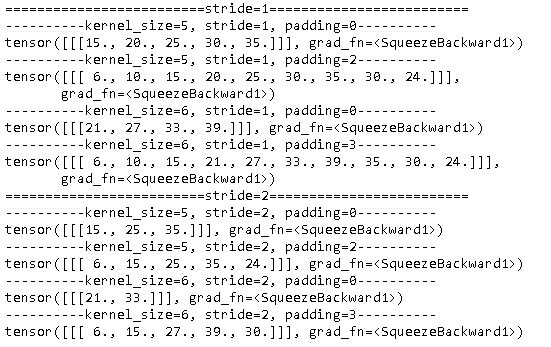

## 实现LeNet

LeNet是Yann LeCun等人提出的卷积神经网络结构，有多个版本，一般LeNet即指LeNet-5。其结果图如下：

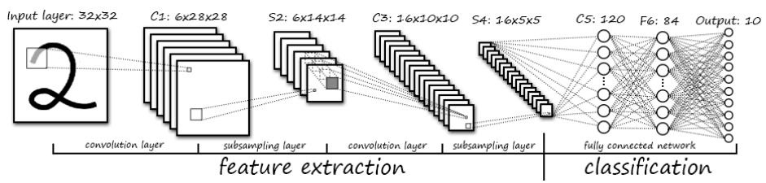

### pytorch实现

从上面结构图来看，不算输入层，LeNet共有7层，但有参数的只有5层，所以在pytorch中使用torch.nn定了这5层，而其它两层使用torch.nn.functional来定义。下面是模型代码。

~~~python
import logging
import matplotlib.pyplot as plt
import numpy as np
import time
import torch
import torchvision
import torch.nn.functional as F
from torch import nn, optim
from torch.utils.data import DataLoader
from torchvision import transforms
from torchvision import datasets

logging.basicConfig(format='%(asctime)s: %(levelname)s: %(message)s')
logging.root.setLevel(level=logging.INFO)

class TaskTime:
    def __init__(self, task_name, show_start=False):
        self.show_start = show_start
        self.task_name = task_name
        self.start_time = time.time()

    def elapsed_time(self):
        return time.time()-self.start_time

    def __enter__(self):
        if self.show_start:
            logging.info('start {}'.format(self.task_name))
        return self;

    def __exit__(self, exc_type, exc_value, exc_tb):
        logging.info('finish {} [elapsed time: {:.2f} seconds]'.format(self.task_name, self.elapsed_time()))

        
class LeNet(nn.Module):
    def __init__(self, in_dim=1, n_class=10):
        super(LeNet, self).__init__()    

        self.conv1 = nn.Conv2d(in_dim, 6, 5)
        self.conv2 = nn.Conv2d(6, 16, 5)
        self.fc1 = nn.Linear(16 * 5 * 5, 120)  
        self.fc2 = nn.Linear(120, 84)
        self.fc3 = nn.Linear(84, n_class)        
        
    def forward(self, x):
        x = F.max_pool2d(F.relu(self.conv1(x)), 2)
        x = F.max_pool2d(F.relu(self.conv2(x)), 2)
        x = x.view(x.size()[0], -1)
        x = F.relu(self.fc1(x))
        x = F.relu(self.fc2(x))
        x = self.fc3(x)
        return x
    
    @classmethod
    def compute_accuarcy(cls, net, loader, criterion, use_cuda=False):
        num_correct = 0
        total = 0
        with torch.no_grad():
            for data in loader:
                inputs, labels = data
                _, _, _, _, correct, _ = cls.forward_(net, inputs, labels, criterion, use_cuda) 
                total += labels.size(0)
                num_correct += correct
        return num_correct/total

    @classmethod
    def forward_(cls, net, inputs, labels, criterion, use_cuda=False):   
        if use_cuda and  torch.cuda.is_available(): 
            net = net.cuda()
            criterion = criterion.cuda()
            inputs = inputs.cuda()
            labels = labels.cuda()
        outputs = net(inputs)
        loss = criterion(outputs, labels)    
        _, predicted = torch.max(outputs.data, 1)
        correct = (predicted == labels).sum().item()
        accuracy = correct/labels.size(0) 
        return inputs, labels, outputs, loss, correct, accuracy     
    
    @classmethod
    def train(cls, net, criterion, trainloader, optimizer, testloader=None, epoches=2, use_cuda=False):        
        for epoch in range(epoches):  # loop over the dataset multiple times
            running_loss = 0.0
            num_correct = 0
            for i, data in enumerate(trainloader, 0):
                inputs, labels = data   
                # 正向传播
                _, _, _, loss, correct, _ = cls.forward_(net, inputs, labels, criterion, use_cuda)   
                running_loss += loss
                num_correct += correct

                # 反向传播
                optimizer.zero_grad()
                loss.backward()
                optimizer.step()

                # print statistics
                running_loss += loss.item()
                if i % 500 == 499:    # print every 2000 mini-batches
                    print('[%d, %5d] loss: %.3f, accuracy: %.1f' %
                          (epoch + 1, i + 1, running_loss / 500, 100*num_correct/labels.size(0)/500))
                    running_loss = 0.0
                    num_correct = 0
~~~

下面是数据加载的代码。

~~~python
print("-"*50 + "\n创建模型")    
net = LeNet(in_dim=3, n_class=10)
print(net)

print("-"*50 + "\n显示参数")
# 由于存在bias，所以每一层都有两个参数张量，共有10个参数张量。
params = list(net.parameters())
print(len(params))
for param in params:
    print(param.size())                
                
print("-"*50 + "\n获取数据")
transform = transforms.Compose(
    [transforms.ToTensor(),
     transforms.Normalize((0.5, 0.5, 0.5), (0.5, 0.5, 0.5))])

trainset = torchvision.datasets.CIFAR10(root='./data/cifar10', train=True,
                                        download=True, transform=transform)
trainloader = torch.utils.data.DataLoader(trainset, batch_size=32,
                                          shuffle=True, num_workers=2)

testset = torchvision.datasets.CIFAR10(root='./data/cifar10', train=False,
                                       download=True, transform=transform)
testloader = torch.utils.data.DataLoader(testset, batch_size=32,
                                         shuffle=False, num_workers=2)

classes = ('plane', 'car', 'bird', 'cat', 'deer', 
           'dog', 'frog', 'horse', 'ship', 'truck')

print("-"*50 + "\n显示图片示例")
plt.rcParams['figure.figsize'] = (12.0, 1.5) 
def imshow(img):
    img = img / 2 + 0.5     # unnormalize
    npimg = img.numpy()
    plt.imshow(np.transpose(npimg, (1, 2, 0)))
    plt.show()

# get some random training images
dataiter = iter(trainloader)
images, labels = dataiter.next()
print(images.size())

# show images
imshow(torchvision.utils.make_grid(images[0:8]))
print(' '.join('%5s' % classes[labels[j]] for j in range(8)))
~~~

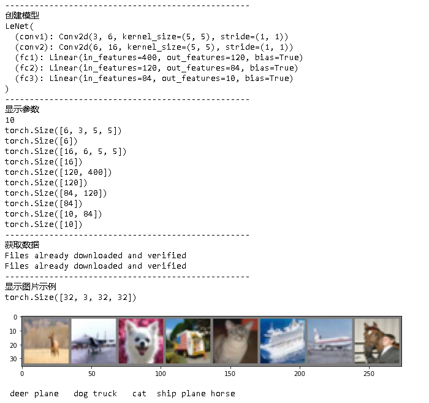

下面是模型训练，保存加载，以及模型评估的代码。

~~~python
print("-"*50 + "\n训练模型")
criterion = nn.CrossEntropyLoss()
optimizer = optim.SGD(net.parameters(), lr=0.001, momentum=0.9)

with TaskTime('training', True):
    LeNet.train(net, criterion, trainloader, optimizer=optimizer, epoches=10, use_cuda=True)
    
print("-"*50 + "\n保存，加载模型") 
model_path = './lenet.pth'
torch.save(net.state_dict(), model_path) 
net = LeNet(in_dim=3, n_class=10)
net.load_state_dict(torch.load(model_path))     
    
print("-"*50 + "\n评估模型")    
train_accuracy = LeNet.compute_accuarcy(net, trainloader, criterion, use_cuda=True)   
test_accuracy = LeNet.compute_accuarcy(net, testloader, criterion, use_cuda=True)
print('Train Accuracy: {}%, Test Accuracy: {}%'.format(100 * train_accuracy, 100*test_accuracy)) 
~~~

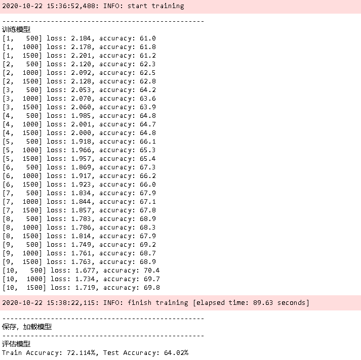

准确率只有64%，模型的表现还不够好，留待以后提升。

### tensorflow实现

## 参考

