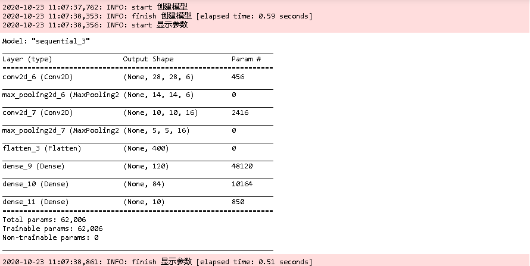
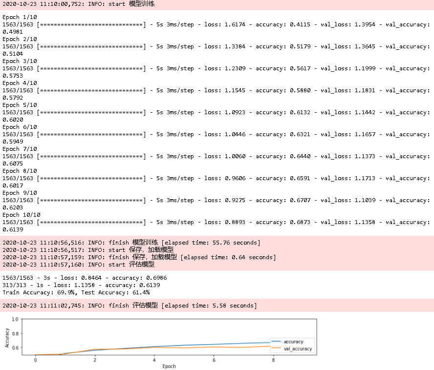
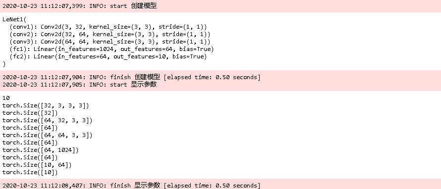
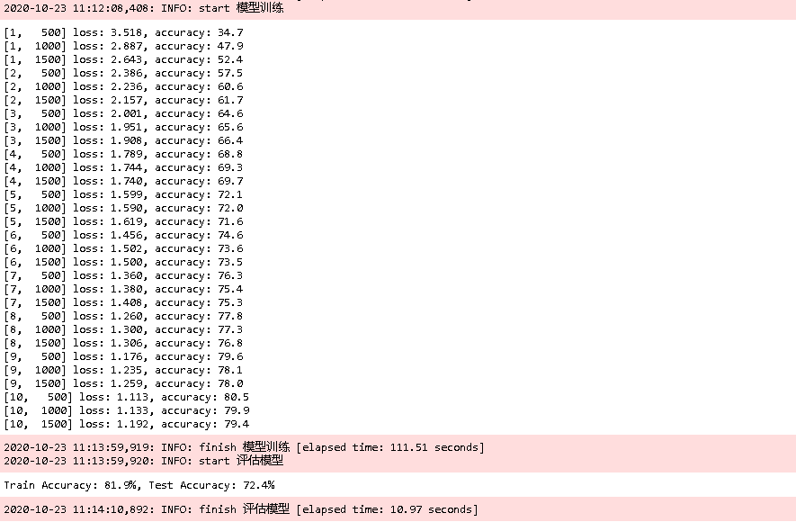
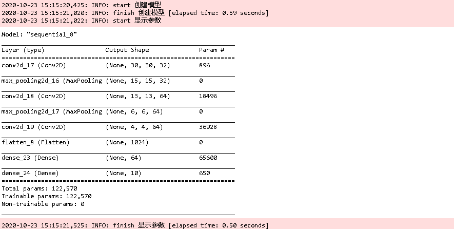
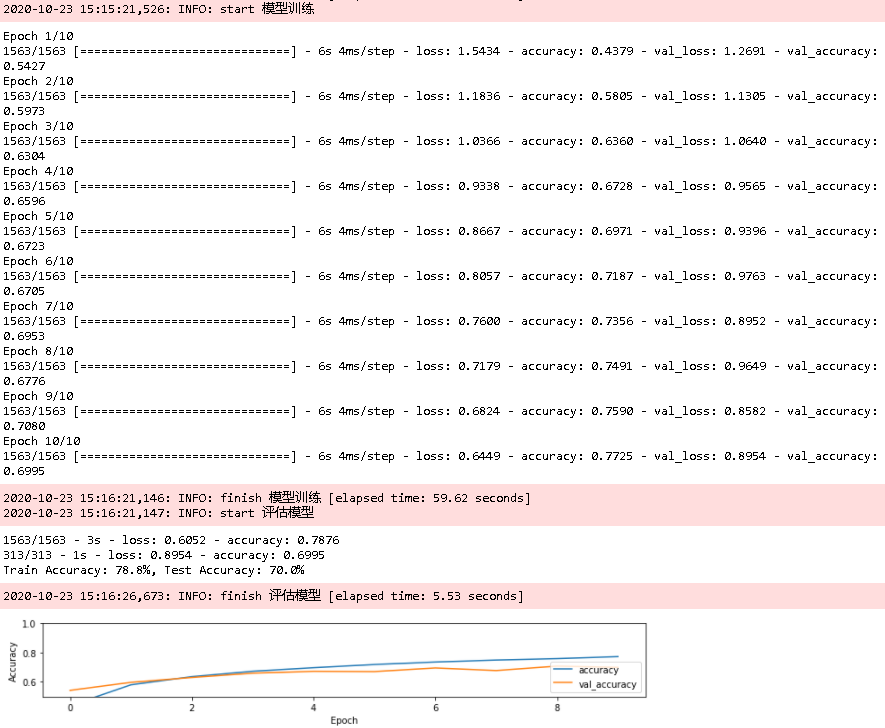

本文将介绍[LeNet](https://www.jiqizhixin.com/graph/technologies/6c9baf12-1a32-4c53-8217-8c9f69bd011b)，并用pytorch和tensorflow同时实现，然后对模型做一些优化。

## LeNet介绍

LeNet5诞生于1994年，是Yann LeCun等人提出的，是最早的卷积神经网络之一。LeNet5通过巧妙的设计，利用卷积、参数共享、池化等操作提取特征，避免了大量的计算成本，最后再使用全连接神经网络进行分类识别，这个网络也是最近大量神经网络架构的起点。其结果图如下：

## 模型实现

### pytorch实现

从上面结构图来看，不算输入层，LeNet共有7层，但有参数的只有5层，所以在pytorch中使用torch.nn定了这5层，而其它两层使用torch.nn.functional来定义。下面是模型代码。

~~~python
import logging
import matplotlib.pyplot as plt
import numpy as np
import os
import sys
import time
import torch
import torchvision
import torch.nn.functional as F
from torch import nn, optim
from torch.utils.data import DataLoader
from torchvision import transforms
from torchvision import datasets

logging.basicConfig(format='%(asctime)s: %(levelname)s: %(message)s')
logging.root.setLevel(level=logging.INFO)

class TaskTime:
    def __init__(self, task_name, show_start=False):
        self.show_start = show_start
        self.task_name = task_name
        self.start_time = time.time()

    def elapsed_time(self):
        return time.time()-self.start_time

    def __enter__(self):
        if self.show_start:
            logging.info('start {}'.format(self.task_name))
        return self;

    def __exit__(self, exc_type, exc_value, exc_tb):
        time.sleep(0.5)
        logging.info('finish {} [elapsed time: {:.2f} seconds]'.format(self.task_name, self.elapsed_time()))

    
def compute_loss_accuarcy(net, loader, criterion, use_cuda=False, max_load_times=0):
    num_correct = 0
    total = 0
    total_loss = 0
    with torch.no_grad():
        for i, data in enumerate(loader):
            if max_load_times>0 and i>=max_load_times: break
            inputs, labels = data
            _, loss, correct = forward(net, inputs, labels, criterion, use_cuda) 
            total += labels.size(0)
            total_loss += loss*labels.size(0)
            num_correct += correct    

    return total_loss/total, num_correct/total

def forward(net, inputs, labels, criterion, use_cuda=False):   
    if use_cuda and  torch.cuda.is_available(): 
        net = net.cuda()
        criterion = criterion.cuda()
        inputs = inputs.cuda()
        labels = labels.cuda()
    outputs = net(inputs)
    loss = criterion(outputs, labels)   
    _, predicted = torch.max(outputs.data, 1)
    num_correct = (predicted == labels).sum().item()
    num_total = labels.size(0)     
    return outputs, loss, num_correct        
    
def train(net, criterion, optimizer, trainloader, validationloader, epochs=2, use_cuda=False):  
        
    train_loss_list = []
    train_accuracy_list = []
    val_loss_list = []
    val_accuracy_list = []      
    
    for epoch in range(epochs):         
        train_loss = 0.0
        train_num_correct = 0
        train_total = 0                   
        
        for i, data in enumerate(trainloader, 0):
            inputs, labels = data   
            # 正向传播
            _, loss, correct = forward(net, inputs, labels, criterion, use_cuda)  
            
            train_loss += loss.item()*labels.size(0)
            train_num_correct += correct
            train_total += labels.size(0)     
            
            # 反向传播
            optimizer.zero_grad()
            loss.backward()
            optimizer.step()
                        
            if i % 50 == 49:        
                sys.stdout.write('\r[epoch %2d/%2d %5d] loss: %.3f, accuracy: %.3f' % 
                                  (epoch + 1, epochs, i+1, train_loss/train_total, train_num_correct/train_total))                
                train_loss = 0.0
                train_num_correct = 0
                train_total = 0                   
                                                                                
        train_loss, train_accuracy = compute_loss_accuarcy(net, trainloader, criterion, 
                                                           use_cuda=True, max_load_times=50)   
        val_loss, val_accuracy = compute_loss_accuarcy(net, validationloader, criterion, 
                                                       use_cuda=True, max_load_times=50)
        
        train_loss_list.append(train_loss)
        train_accuracy_list.append(train_accuracy)
        val_loss_list.append(val_loss)
        val_accuracy_list.append(val_accuracy)         
        
        sys.stdout.write('\r[epoch %2d/%2d] loss: %.3f, accuracy: %.3f, val_loss: %.3f, val_accuracy: %.3f \n' %
                          (epoch + 1, epochs, train_loss, train_accuracy, val_loss, val_accuracy))
         

    return train_loss_list, train_accuracy_list, val_loss_list, val_accuracy_list

class LeNet(nn.Module):
    def __init__(self, in_dim=1, n_class=10):
        super(LeNet, self).__init__()    

        self.conv1 = nn.Conv2d(in_dim, 6, 5)
        self.conv2 = nn.Conv2d(6, 16, 5)
        self.fc1 = nn.Linear(16 * 5 * 5, 120)  
        self.fc2 = nn.Linear(120, 84)
        self.fc3 = nn.Linear(84, n_class)        
        
    def forward(self, x):
        x = F.max_pool2d(F.relu(self.conv1(x)), 2)
        x = F.max_pool2d(F.relu(self.conv2(x)), 2)
        x = x.view(x.size()[0], -1)
        x = F.relu(self.fc1(x))
        x = F.relu(self.fc2(x))
        x = self.fc3(x)
        return x
~~~

下面是数据加载的代码。采用的数据集是[CIFAR10](https://eipi10.cn/others/2020/10/22/dataset/#CIFAR10)。

~~~python
def torch_cifar10_extract_data():
    with TaskTime('获取数据', True):
        transform = transforms.Compose(
            [transforms.ToTensor(),
             transforms.Normalize(mean=(0.5, 0.5, 0.5), std=(0.5, 0.5, 0.5))])
        data_path = os.path.join(os.path.expanduser('~'), '.pytorch/datasets') 
        if not os.path.exists(data_path): os.makedirs(data_path)
        trainset = torchvision.datasets.CIFAR10(root=os.path.join(data_path, 'cifar10'), train=True,
                                                download=True, transform=transform)
        trainloader = torch.utils.data.DataLoader(trainset, batch_size=32,
                                                  shuffle=True, num_workers=2)

        testset = torchvision.datasets.CIFAR10(root=os.path.join(data_path, 'cifar10'), train=False,
                                               download=True, transform=transform)
        testloader = torch.utils.data.DataLoader(testset, batch_size=32,
                                                 shuffle=False, num_workers=2)

    classes = ('plane', 'car', 'bird', 'cat', 'deer', 
               'dog', 'frog', 'horse', 'ship', 'truck')

    with TaskTime('显示图片示例', True):
        plt.rcParams['figure.figsize'] = (12.0, 1.5) 
        def imshow(img):
            img = img / 2 + 0.5     # unnormalize
            npimg = img.numpy()
            plt.imshow(np.transpose(npimg, (1, 2, 0)))
            plt.show()

        # get some random training images
        dataiter = iter(trainloader)
        images, labels = dataiter.next()
        print(images.size())

        # show images
        print(' '.join('%5s' % classes[labels[j]] for j in range(8)))
        imshow(torchvision.utils.make_grid(images[0:8]))

    return trainset, trainloader, testset, testloader

trainset, trainloader, testset, testloader = torch_cifar10_extract_data()
~~~

接下来是模型创建，模型训练，保存加载，以及模型评估的代码。

~~~python
def torch_train_evaluate(net, epochs=10, save_model=False):                   
    with TaskTime('显示参数', True):
         # 由于存在bias，所以每一层都有两个参数张量，共有10个参数张量。
        params = list(net.parameters())
        print(len(params))
        for param in params:
            print(param.size())  

    with TaskTime('模型训练', True):
        criterion = nn.CrossEntropyLoss()
        # optimizer = optim.SGD(net.parameters(), lr=0.001, momentum=0.9)      # Adam优化的速度比SGD明显要快
        optimizer = optim.Adam(net.parameters(), lr=0.001, betas=(0.9, 0.999), eps=1e-08, weight_decay=0, amsgrad=False)
        _, train_accuracy_list, _, val_accuracy_list = train(
            net, criterion, optimizer, trainloader, testloader, epochs=epochs, use_cuda=True)

    if save_model:  
        with TaskTime('保存，加载模型', True):
            model_root_path = os.path.join(os.path.expanduser('~'), '.pytorch/model') 
            if not os.path.exists(model_root_path): os.makedirs(model_root_path)
            model_path = os.path.join(model_root_path, 'torch_lenet.pth')
            torch.save(net.state_dict(), model_path) 
            net = LeNet(in_dim=3, n_class=10)
            net.load_state_dict(torch.load(model_path))     

    with TaskTime('评估模型', True):
        plt.figure(figsize=(8, 3))
        plt.plot(train_accuracy_list, label='accuracy')
        plt.plot(val_accuracy_list, label = 'val_accuracy')
        plt.xlabel('Epoch')
        plt.ylabel('Accuracy')
        plt.ylim([0, 1])
        plt.legend(loc='lower right')          
        
        _, train_accuracy = compute_loss_accuarcy(net, trainloader, criterion, use_cuda=True)   
        _, test_accuracy = compute_loss_accuarcy(net, testloader, criterion, use_cuda=True)
        print('Train Accuracy: {:0.3f}%, Test Accuracy: {:0.3f}%'.format(train_accuracy, test_accuracy)) 
        
with TaskTime('创建模型', True):      
    net = LeNet(in_dim=3, n_class=10)
    print(net)

torch_train_evaluate(net, save_model=True, epochs=10)
~~~

准确率似乎不太好，只有60%多，且存在一定过拟合。

### tensorflow实现

首先是模型代码。

~~~python
import logging
import os
import tensorflow as tf
import time
from tensorflow.keras import datasets, layers, models
import matplotlib.pyplot as plt

logging.basicConfig(format='%(asctime)s: %(levelname)s: %(message)s')
logging.root.setLevel(level=logging.INFO)

# 设置GPU内存使用上限
gpus = tf.config.experimental.list_physical_devices(device_type='GPU')
print(gpus)
tf.config.experimental.set_virtual_device_configuration(
    gpus[0],
    [tf.config.experimental.VirtualDeviceConfiguration(memory_limit=1024)]
)

def lenet(in_dim=1, n_class=10):
    model = models.Sequential()
    model.add(layers.Conv2D(6, (5, 5), activation='relu', input_shape=(32, 32, in_dim)))
    model.add(layers.MaxPooling2D((2, 2)))
    model.add(layers.Conv2D(16, (5, 5), activation='relu'))
    model.add(layers.MaxPooling2D((2, 2)))
    model.add(layers.Flatten())
    model.add(layers.Dense(120, activation='relu'))
    model.add(layers.Dense(84, activation='relu'))
    model.add(layers.Dense(n_class))    
    return model
~~~

然后加载数据。

~~~python
def tf_cifar10_extract_data():
    with TaskTime('获取数据', True):
        # 默认的保存路径是~/.keras/datasets/
        (train_images, train_labels), (test_images, test_labels) = datasets.cifar10.load_data()

        # Normalize pixel values to be between 0 and 1
        train_images, test_images = train_images / 255.0, test_images / 255.0

        print(train_images.shape, train_labels.shape, train_images.shape, test_labels.shape)
        print(type(train_images), type(train_labels.shape))

    with TaskTime('显示图片示例', True):
        class_names = ['airplane', 'automobile', 'bird', 'cat', 'deer',
                       'dog', 'frog', 'horse', 'ship', 'truck']

        plt.figure(figsize=(10,2))
        for i in range(5):
            plt.subplot(1,5,i+1)
            plt.xticks([])
            plt.yticks([])
            plt.grid(False)
            plt.imshow(train_images[i])
            # The CIFAR labels happen to be arrays, 
            # which is why you need the extra index
            plt.xlabel(class_names[train_labels[i][0]])
        plt.show()
    
    return train_images, train_labels, test_images, test_labels

train_images, train_labels, test_images, test_labels = tf_cifar10_extract_data()
~~~

接下来是模型创建，模型训练，保存加载，以及模型评估的代码。

~~~python
def tf_train_evaluate(model, epochs=10, save_model=False, callbacks=None):   
    with TaskTime('显示参数', True):
        model.summary()

    with TaskTime('模型训练', True):    
        model.compile(optimizer='adam',
                      loss=tf.keras.losses.SparseCategoricalCrossentropy(from_logits=True),
                      metrics=['accuracy'])
        history = model.fit(train_images, train_labels, epochs=epochs, batch_size=32,
                            callbacks=callbacks, validation_data=(test_images, test_labels))

    if save_model:
        with TaskTime('保存，加载模型', True): 
            model_root_path = os.path.join(os.path.expanduser('~'), '.keras/model') 
            if not os.path.exists(model_root_path): os.makedirs(model_root_path)
            model_path = os.path.join(model_root_path, 'tf_lenet.h5')
            model.save(model_path) 
            model = tf.keras.models.load_model(model_path)  

    with TaskTime('评估模型', True): 
        plt.figure(figsize=(8, 3))
        plt.plot(history.history['accuracy'], label='accuracy')
        plt.plot(history.history['val_accuracy'], label = 'val_accuracy')
        plt.xlabel('Epoch')
        plt.ylabel('Accuracy')
        plt.ylim([0, 1])
        plt.legend(loc='lower right')

        train_loss, train_acc = model.evaluate(train_images,  train_labels, verbose=2)
        test_loss, test_acc = model.evaluate(test_images,  test_labels, verbose=2)
        print('Train Accuracy: {:0.3f}, Test Accuracy: {:0.3f}'.format(train_acc, test_acc)) 
    
with TaskTime('创建模型', True): 
    model = lenet(in_dim=3, n_class=10)

tf_train_evaluate(model, save_model=True)
~~~

accuracy，和pytorch非常接近，也是60%多，但同样10次迭代，只需要一半的时间（55秒多），可能原因是上面pytorch中training的代码是自己写的，而tensorflow中都是调用tf原生的函数。

## 模型优化

上节中，采用pytorch和tensoflow实现了LeNet，但accuracy不是很高，只有60%多，下面对模型做一些修改，看看性能如何。

### pytorch优化

增加了一层卷积，并大大增加了卷积的深度，同时减少了一层全连接层（或许可以减少一些过拟合）。

~~~python
class LeNet1(nn.Module):
    def __init__(self, in_dim=1, n_class=10):
        super(LeNet1, self).__init__()    

        self.conv1 = nn.Conv2d(in_dim, 32, 3)
        self.conv2 = nn.Conv2d(32, 64, 3)
        self.conv3 = nn.Conv2d(64, 64, 3)
        self.fc1 = nn.Linear(64 * 4 * 4, 64)  
        self.fc2 = nn.Linear(64, n_class)        
        
    def forward(self, x):
        x = F.max_pool2d(F.relu(self.conv1(x)), 2)
        x = F.max_pool2d(F.relu(self.conv2(x)), 2)
        x = F.relu(self.conv3(x))
        x = x.view(x.size()[0], -1)
        x = F.relu(self.fc1(x))
        x = self.fc2(x)
        return x
~~~

看看模型的效果。

~~~python
with TaskTime('创建模型', True): 
    net = LeNet1(in_dim=3, n_class=10)
    print(net)

torch_train_evaluate(net)
~~~

test accuracy提高到了72%，效果提升明显。

### tensorflow优化

采用相同的方式，同样更新模型。

~~~python
def lenet1(in_dim=1, n_class=10):
    model = models.Sequential()
    model.add(layers.Conv2D(32, (3, 3), activation='relu', input_shape=(32, 32, in_dim)))
    model.add(layers.MaxPooling2D((2, 2)))
    model.add(layers.Conv2D(64, (3, 3), activation='relu'))
    model.add(layers.MaxPooling2D((2, 2)))
    model.add(layers.Conv2D(64, (3, 3), activation='relu'))    
    model.add(layers.Flatten())
    model.add(layers.Dense(64, activation='relu'))
    model.add(layers.Dense(n_class))    
    return model
~~~

同样看看模型的效果。

~~~python
with TaskTime('创建模型', True): 
    model = lenet1(in_dim=3, n_class=10)

tf_train_evaluate(model)
~~~

test accuracy提高到了70%，效果提升也很明显。

## 参考

- [TF Tutorial - Convolutional Neural Network (CNN)](https://www.tensorflow.org/tutorials/images/cnn)
- [Torch Tutorial - TRAINING A CLASSIFIER](https://pytorch.org/tutorials/beginner/blitz/cifar10_tutorial.html)

## 历史

- 2020-10-23：初始版本
- 2020-10-30：tensorflow增加了tensorboard可视化显示， pytorch增加了曲线图。

