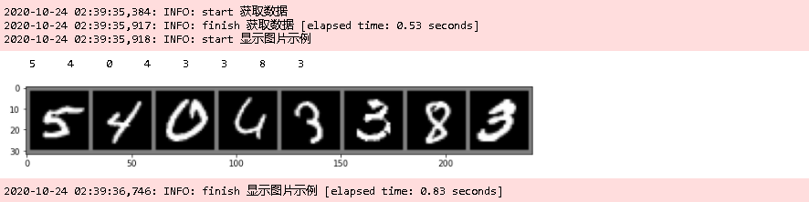
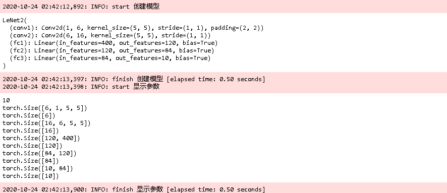
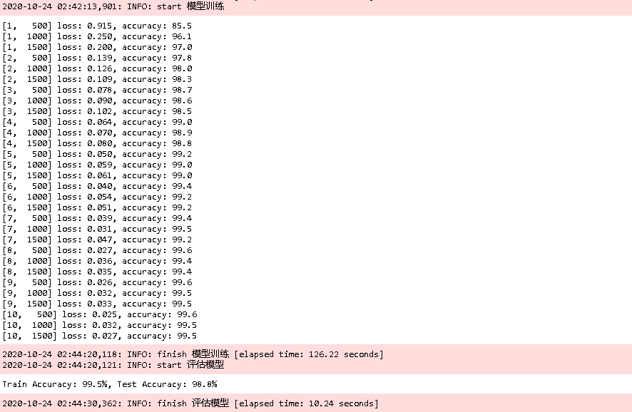
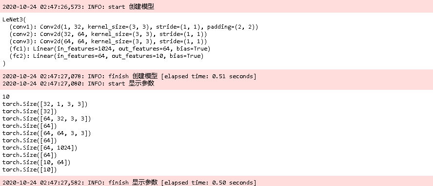
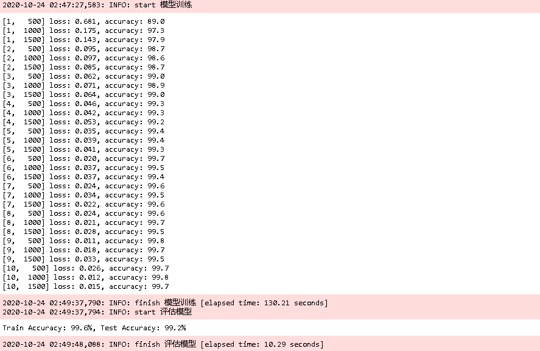
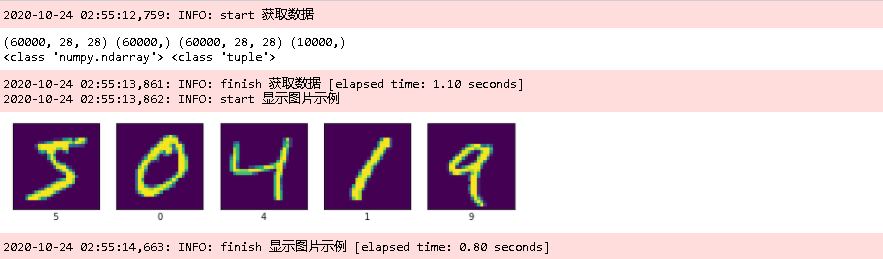

## MNIST

下面用上面的模型，尝试一下[MNIST](https://eipi10.cn/others/2020/10/22/dataset/#MNIST)数据集。由于MNIST数据集的每张图片由28×2828×28 个像素点构成，每个像素点用一个灰度值(0−2550−255)表示，需要对之前的模型做一些修改。

### pytorch再实现

为了保持模型的参数维持一致，在第一个卷积积增加一个参数padding=2。

~~~python
class LeNet2(nn.Module):
    def __init__(self, in_dim=1, n_class=10):
        super(LeNet2, self).__init__()    

        self.conv1 = nn.Conv2d(in_dim, 6, 5, padding=2)
        self.conv2 = nn.Conv2d(6, 16, 5)
        self.fc1 = nn.Linear(16 * 5 * 5, 120)  
        self.fc2 = nn.Linear(120, 84)
        self.fc3 = nn.Linear(84, n_class)        
        
    def forward(self, x):
        x = F.max_pool2d(F.relu(self.conv1(x)), 2)
        x = F.max_pool2d(F.relu(self.conv2(x)), 2)
        x = x.view(x.size()[0], -1)
        x = F.relu(self.fc1(x))
        x = F.relu(self.fc2(x))
        x = self.fc3(x)
        return x

class LeNet3(nn.Module):
    def __init__(self, in_dim=1, n_class=10, padding=2):
        super(LeNet3, self).__init__()    

        self.conv1 = nn.Conv2d(in_dim, 32, 3)
        self.conv2 = nn.Conv2d(32, 64, 3)
        self.conv3 = nn.Conv2d(64, 64, 3)
        self.fc1 = nn.Linear(64 * 4 * 4, 64)  
        self.fc2 = nn.Linear(64, n_class)        
        
    def forward(self, x):
        x = F.max_pool2d(F.relu(self.conv1(x)), 2)
        x = F.max_pool2d(F.relu(self.conv2(x)), 2)
        x = F.relu(self.conv3(x))
        x = x.view(x.size()[0], -1)
        x = F.relu(self.fc1(x))
        x = self.fc2(x)
        return x
~~~

接下来加载数据。

~~~python
def torch_mnist_extract_data():
    with TaskTime('获取数据', True):
        transform = transforms.Compose(
            [transforms.ToTensor(),
             transforms.Normalize(mean=(0.5), std=(0.5))])
        data_path = os.path.join(os.path.expanduser('~'), '.pytorch/datasets') 
        if not os.path.exists(data_path): os.makedirs(data_path)
        trainset = torchvision.datasets.MNIST(root=os.path.join(data_path, 'mnist'), train=True,
                                              download=True, transform=transform)
        trainloader = torch.utils.data.DataLoader(trainset, batch_size=32,
                                                  shuffle=True, num_workers=2)

        testset = torchvision.datasets.MNIST(root=os.path.join(data_path, 'mnist'), train=False,
                                             download=True, transform=transform)
        testloader = torch.utils.data.DataLoader(testset, batch_size=32,
                                                 shuffle=False, num_workers=2)

    with TaskTime('显示图片示例', True):
        plt.rcParams['figure.figsize'] = (12.0, 1.5) 
        def imshow(img):
            img = img / 2 + 0.5     # unnormalize
            npimg = img.numpy()
            plt.imshow(np.transpose(npimg, (1, 2, 0)))
            plt.show()

        # get some random training images
        dataiter = iter(trainloader)
        images, labels = dataiter.next()

        # show images
        print(' '.join('%5s' % labels[j].item() for j in range(8)))
        imshow(torchvision.utils.make_grid(images[0:8]))

    return trainset, trainloader, testset, testloader

trainset, trainloader, testset, testloader = torch_mnist_extract_data()    
~~~

下面来训练LeNet2。

~~~python
print("-"*50 + "\n创建模型")    
net = LeNet2(in_dim=1, n_class=10)
print(net)

print("-"*50 + "\n显示参数")
# 由于存在bias，所以每一层都有两个参数张量，共有10个参数张量。
params = list(net.parameters())
print(len(params))
for param in params:
    print(param.size())    

print("-"*50 + "\n训练模型")
criterion = nn.CrossEntropyLoss()
# optimizer = optim.SGD(net.parameters(), lr=0.001, momentum=0.9)
# Adam优化的速度比SGD明显要快
optimizer = optim.Adam(net.parameters(), lr=0.001, betas=(0.9, 0.999), eps=1e-08, weight_decay=0, amsgrad=False)

with TaskTime('training', True):
    train(net, criterion, trainloader, optimizer=optimizer, epoches=10, use_cuda=True) 
    
print("-"*50 + "\n评估模型")    
train_accuracy = compute_accuarcy(net, trainloader, criterion, use_cuda=True)   
test_accuracy = compute_accuarcy(net, testloader, criterion, use_cuda=True)
print('Train Accuracy: {:0.1f}%, Test Accuracy: {:0.1f}%'.format(100 * train_accuracy, 100*test_accuracy)) 
~~~

accuracy能达到将近99%，非常理想。然后来训练LeNet3。

~~~python
with TaskTime('创建模型', True): 
    net = LeNet3(in_dim=1, n_class=10)
    print(net)

torch_train_evaluate(net)
~~~

accuracy能超过99%，非常好。

### tensorflow再实现

同样，增加了一个参数padding='same'，另外input_shape改成了(28, 28, in_dim)。

~~~python
def lenet2(in_dim=1, n_class=10):
    model = models.Sequential()
    model.add(layers.Conv2D(6, (5, 5), activation='relu', padding='same', input_shape=(28, 28, in_dim)))
    model.add(layers.MaxPooling2D((2, 2)))
    model.add(layers.Conv2D(16, (5, 5), activation='relu'))
    model.add(layers.MaxPooling2D((2, 2)))
    model.add(layers.Flatten())
    model.add(layers.Dense(120, activation='relu'))
    model.add(layers.Dense(84, activation='relu'))
    model.add(layers.Dense(n_class))    
    return model

def lenet3(in_dim=1, n_class=10):
    model = models.Sequential()
    model.add(layers.Conv2D(32, (3, 3), activation='relu', padding='same', input_shape=(28, 28, in_dim)))
    model.add(layers.MaxPooling2D((2, 2)))
    model.add(layers.Conv2D(64, (3, 3), activation='relu'))
    model.add(layers.MaxPooling2D((2, 2)))
    model.add(layers.Conv2D(64, (3, 3), activation='relu'))    
    model.add(layers.Flatten())
    model.add(layers.Dense(64, activation='relu'))
    model.add(layers.Dense(n_class))    
    return model
~~~

接下来加载数据。

~~~python
def tf_mnist_extract_data():
    with TaskTime('获取数据', True):
        # 默认的保存路径是~/.keras/datasets/
        (train_images, train_labels), (test_images, test_labels) = datasets.mnist.load_data()

        # Normalize pixel values to be between 0 and 1
        train_images, test_images = train_images / 255.0, test_images / 255.0

        print(train_images.shape, train_labels.shape, train_images.shape, test_labels.shape)
        print(type(train_images), type(train_labels.shape))

    with TaskTime('显示图片示例', True):

        plt.figure(figsize=(10,2))
        for i in range(5):
            plt.subplot(1,5,i+1)
            plt.xticks([])
            plt.yticks([])
            plt.grid(False)
            plt.imshow(train_images[i])
            # The CIFAR labels happen to be arrays, 
            # which is why you need the extra index
            plt.xlabel(train_labels[i])
        plt.show()
    
    return train_images, train_labels, test_images, test_labels

train_images, train_labels, test_images, test_labels = tf_mnist_extract_data()
~~~

下面来训练lenet2。

~~~python
with TaskTime('创建模型', True): 
    model = lenet2(in_dim=1, n_class=10)

tf_train_evaluate(model)
~~~

下面来训练lenet3。

~~~python
print("-"*50 + "\n创建模型") 
model = lenet3(in_dim=3, n_class=10)

print("-"*50 + "\n显示参数")
model.summary()

print("-"*50 + "\n训练模型")
model.compile(optimizer='adam',
              loss=tf.keras.losses.SparseCategoricalCrossentropy(from_logits=True),
              metrics=['accuracy'])
with TaskTime('training', True):
    history = model.fit(train_images, train_labels, epochs=10, batch_size=32,
                        validation_data=(test_images, test_labels))

print("-"*50 + "\n保存，加载模型") 
model_root_path = os.path.join(os.path.expanduser('~'), '.keras/model') 
if not os.path.exists(model_root_path): os.makedirs(model_root_path)
model_path = os.path.join(model_root_path, 'tf_lenet.h5')
model.save(model_path) 
model = tf.keras.models.load_model(model_path)  
    
print("-"*50 + "\n评估模型")    
plt.plot(history.history['accuracy'], label='accuracy')
plt.plot(history.history['val_accuracy'], label = 'val_accuracy')
plt.xlabel('Epoch')
plt.ylabel('Accuracy')
plt.ylim([0.5, 1])
plt.legend(loc='lower right')

train_loss, train_acc = model.evaluate(train_images,  train_labels, verbose=2)
test_loss, test_acc = model.evaluate(test_images,  test_labels, verbose=2)
print('Train Accuracy: {:0.1f}%, Test Accuracy: {:0.1f}%'.format(100 * train_acc, 100*test_acc))
~~~

## 