[MNIST](https://eipi10.cn/others/2020/10/22/dataset)（Mixed National Institute of Standards and Technology）数据集是著名的手写数字数据集，被誉为数据科学领域的`果蝇`。本文使用Tensorflow对这个数据集进行分类，将会尝试多个模型，从简单的到复杂的，直至接近State-of-the-Art。

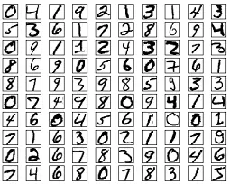

目前MNIST数据集State-of-the-Art的排名如下，详见[Image Classification on MNIST](https://paperswithcode.com/sota/image-classification-on-mnist)。

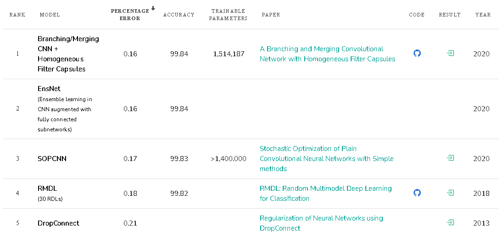

从时间轴上看，MCDNN在2013年就取得了99.77%的准确率，应该说由于MNIST数据集比较简单，各家算法取得的结果都非常接近，几乎已经接近极限了。

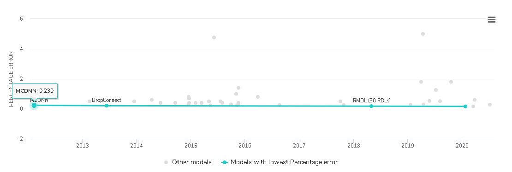

## 数据

MNIST数据集包含60,000张training图片和10,000张test图片，每张图片由$28\times28$ 个像素点构成，每个像素点用一个灰度值(0−2550−255)表示。首先引入所用的包。

~~~python
import logging
import matplotlib.pyplot as plt
import numpy as np
import os
import pandas as pd
import seaborn as sns
import tensorflow as tf
import time

from sklearn.metrics import confusion_matrix
from pprint import pprint
from tensorflow.keras import datasets, models, Model, layers, callbacks, losses, optimizers, preprocessing
~~~

然后是一些基础设置和公共函数，

~~~python
logging.basicConfig(format='%(asctime)s: %(levelname)s: %(message)s')
logging.root.setLevel(level=logging.INFO)

# 设置GPU内存使用上限
gpus = tf.config.experimental.list_physical_devices(device_type='GPU')
print(gpus)
tf.config.experimental.set_virtual_device_configuration(
    gpus[0],
    [tf.config.experimental.VirtualDeviceConfiguration(memory_limit=2048)]
)

class TaskTime:
    '''用于显示执行时间'''
    
    def __init__(self, task_name, show_start=False):
        self.show_start = show_start
        self.task_name = task_name
        self.start_time = time.time()

    def elapsed_time(self):
        return time.time()-self.start_time

    def __enter__(self):
        if self.show_start:
            logging.info('start {}'.format(self.task_name))
        return self;

    def __exit__(self, exc_type, exc_value, exc_tb):
        time.sleep(0.5)
        logging.info('finish {} [elapsed time: {:.2f} seconds]'.format(self.task_name, self.elapsed_time()))
        
def get_weight_num(model):
    '''得到模型可训练参数的个数'''
    return np.sum([np.prod(p.shape) for p in model.trainable_weights])

# 保存模型的loss, accuracy等指标
models = {}
~~~

下面开始加载数据。

~~~python
(train_images, train_labels), (test_images, test_labels) = datasets.mnist.load_data()

train_images = np.expand_dims(train_images, axis=-1) 
test_images = np.expand_dims(test_images, axis=-1)
train_images = train_images/255.0
test_images = test_images/255.0

print(train_images.shape, train_labels.shape)
print(test_images.shape, test_labels.shape)
~~~

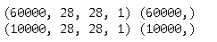

然后创建train，validatiaon和test数据集。

~~~python
train_val_dataset = tf.data.Dataset.from_tensor_slices((train_images, train_labels)) 
train_val_dataset = train_val_dataset.shuffle(train_images.shape[0])

test_dataset = tf.data.Dataset.from_tensor_slices((test_images, test_labels))

train_size = int(0.85*train_images.shape[0])
train_dataset = train_val_dataset.take(train_size) 
val_dataset = train_val_dataset.skip(train_size)

batch_size = 32
train_dataset = train_dataset.batch(batch_size, drop_remainder=True)
val_dataset = val_dataset.batch(batch_size*10)
test_dataset = test_dataset.batch(batch_size*10)

input_shape = train_dataset.element_spec[0].shape[1:]
~~~

示例图片如下：

~~~python
def show_images(images, labels, x_num=6, y_num=6, figsize=(8,8)):
    plt.figure(figsize=figsize)
    for i in range(x_num*y_num):
        plt.subplot(x_num, y_num, i+1)
        plt.imshow(images[i], cmap='gray')
        plt.title("{}".format(labels[i]))
        plt.xticks([])
        plt.yticks([])    

    plt.tight_layout()
    plt.subplots_adjust(wspace=0.3, hspace=0.3)      
    plt.show()

images, labels = iter(train_dataset).next()
show_images(images, labels, x_num=4, y_num=8, figsize=(12, 6))
~~~

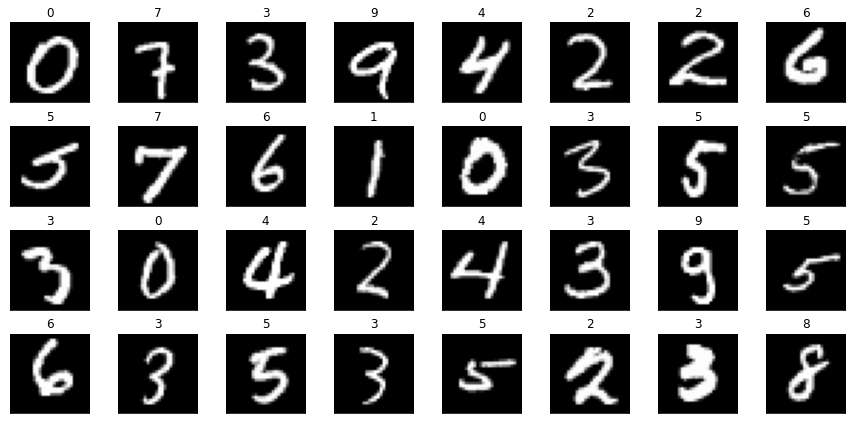

## MLP

首先，尝试用经典的多层感知器（Muti-Layer Perception）来进行分类。下面模型是典型的三层结构，有101,770个参数。

~~~python
def get_mlp(input_shape=input_shape, learning_rate=0.001):
    input = layers.Input(shape=input_shape)
    x = layers.Flatten()(input)
    x = layers.Dense(128, activation='relu')(x)
    x = layers.Dense(10, activation='softmax')(x)  
    
    model = Model(inputs=input, outputs=x, name='mlp') 
    model.compile(optimizer=optimizers.Adam(learning_rate=learning_rate),
                  loss=losses.SparseCategoricalCrossentropy(),
                  metrics=['accuracy'])  

    model.checkpoint_path = './checkpoints/{}/checkpoint'.format(model.name)
    return model

mlp_model = get_mlp()
mlp_model.summary()
~~~

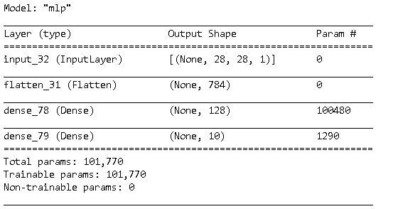

下面是模型训练的代码。

~~~python
def train(model, epochs, verbose=True):    
    checkpoint_best_only = callbacks.ModelCheckpoint(filepath=model.checkpoint_path,
                                                     monitor='val_accuracy',
                                                     save_weights_only=True, 
                                                     save_best_only=True,
                                                     verbose=False)
    reduce_lr = callbacks.ReduceLROnPlateau(monitor='val_loss', factor=0.5, min_lr=0.0001, patience=4, verbose=verbose) 
    early_stopping = callbacks.EarlyStopping(monitor='val_accuracy', patience=6)  
    
    with TaskTime('training', True) as t: 
        history = model.fit(train_dataset, validation_data=val_dataset, epochs=epochs, verbose=verbose, 
                            callbacks=[checkpoint_best_only, reduce_lr, early_stopping])
        history.train_time = t.elapsed_time()
    return history

history = train(mlp_model, epochs=20)
~~~

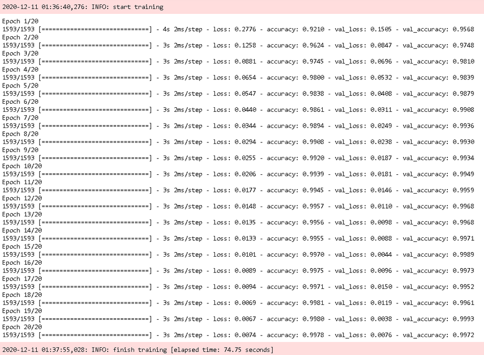

可以看到对于训练数据的准确率基本趋近于100%了。下面看看Loss和Accuracy的走势。

~~~python
def plot_history(history):
    plt.figure(figsize=(12, 5))
    epochs = range(1, len(history.history['accuracy'])+1)
    plt.subplot(121)
    plt.plot(epochs, history.history['accuracy'])
    plt.plot(epochs, history.history['val_accuracy'])
    plt.title('Accuracy vs. epochs')
    plt.ylabel('Accuracy')
    plt.xlabel('Epoch')
    plt.xticks(epochs)
    plt.legend(['Training', 'Validation'], loc='lower right')

    plt.subplot(122)
    plt.plot(epochs, history.history['loss'])
    plt.plot(epochs, history.history['val_loss'])
    plt.title('Loss vs. epochs')
    plt.ylabel('Loss')
    plt.xlabel('Epoch')
    plt.xticks(epochs)
    plt.legend(['Training', 'Validation'], loc='upper right')
    plt.show()    

plot_history(history)
~~~

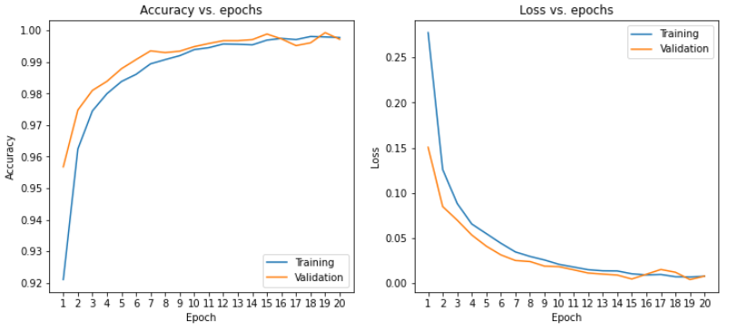

下面评估一下模型。可以看到测试数据的准确率是98%左右，其实已经不错了。由于训练数据的准确率已经高达99.9%，这意味着模型几乎已经获得（它所能学到的）所有的模式了，再增加训练时间，也没有用了。

~~~python
def show_models(models=models):     
    models_remove1 = {key:{key1:value1 for key1, value1 in value.items() if key1 != 'model'}  for key, value in models.items()}
    df_models = pd.DataFrame.from_dict(models_remove1, orient='index')
    df_models = df_models.sort_values('test_accuracy', ascending=False) 
    display(df_models)
       
def evaluate_show(model, train_time, 
                  train_dataset=train_dataset, 
                  val_dataset=val_dataset, 
                  test_dataset=test_dataset, models=models):
    train_loss, train_accuracy = model.evaluate(train_dataset, verbose=False)
    val_loss, val_accuracy = model.evaluate(val_dataset, verbose=False)
    test_loss, test_accuracy = model.evaluate(test_dataset, verbose=False)
    if  model.name not in models or models[model.name]['test_accuracy']<test_accuracy:
        models[model.name] = {'train_loss':round(train_loss, 6), 
                              'train_accuracy':round(train_accuracy, 4), 
                              'val_loss':round(val_loss, 6), 
                              'val_accuracy':round(val_accuracy, 4),    
                              'test_loss':round(test_loss, 6), 
                              'test_accuracy':round(test_accuracy, 4),                               
                              'weight_number':get_weight_num(model), 
                              'model':model,
                              'train_time':round(train_time,0)
                             }    
    show_models(models)
    
    
def load_best_checkpoint(model):
    model.load_weights(model.checkpoint_path)
    return model
     
mlp_model = load_best_checkpoint(get_mlp())
evaluate_show(mlp_model, train_time=history.train_time)
~~~

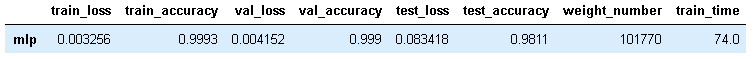

下面来看一下混淆矩阵。

~~~python
def plot_confusion_matrix(model1, model2=None, images=test_images, labels=test_labels):
    def plot_cm(model):
        predictions = model.predict(images).argmax(axis=-1)               
        cm = confusion_matrix(labels, predictions)
        df_cm = pd.DataFrame(cm, index=range(0, 10), columns=range(0, 10))
        
        plt.title("{} - Confusion matrix".format(model.name))
        sns.heatmap(df_cm, annot=True, fmt="d", cmap="YlGnBu")
        plt.xlabel("Predicted")
        plt.ylabel("Actual")
    
    if model2 is not None:
        plt.figure(figsize=(15, 6))
        plt.subplot(1, 2, 1)
        plot_cm(model1)
        plt.subplot(1, 2, 2)
        plot_cm(model2)         
    else:  
        plt.figure(figsize=(7.5, 6))
        plot_cm(model1)
    
    plt.show()

plot_confusion_matrix(mlp_model)   
~~~

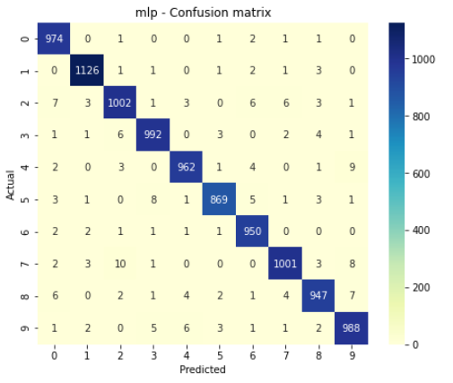

上图中可以看到对4，5，7的分类相对错误较多。下面来看几个分错的数字。

~~~python
def plot_predicted_sample(models, sample_count=5, show_error=True, images=test_images, labels=test_labels):
    def plot_var(model, image, label):
        predict = np.squeeze(model.predict(image))
        max_like = np.argmax(predict)
        plt.bar(range(10), predict, width=0.9, color='steelblue', alpha=0.8) 
        plt.ylim(0,1)
        plt.xticks(range(10))
        plt.title('{}: {}'.format(model.name, max_like))        
        
    if show_error:
        base_predictions = models[0].predict(images).argmax(axis=-1)  
        error_indexes = base_predictions != labels
        error_images = images[error_indexes]
        error_labels = labels[error_indexes]
        sample_indexes = np.random.randint(len(error_images), size=sample_count)  
        sample_images = error_images[sample_indexes]
        sample_labels = error_labels[sample_indexes]
    else:
        sample_indexes = np.random.randint(len(labels), size=sample_count)  
        sample_images = images[sample_indexes]
        sample_labels = labels[sample_indexes]
    
    column_count = len(models)+1 
    plt.figure(figsize=(2*column_count, 10))
    for i in range(sample_count):
        plt.subplot(sample_count, column_count, column_count*i+1)
        plt.imshow(np.squeeze(sample_images[i]), cmap='gray', interpolation='none')
        plt.title('actual: {}'.format(sample_labels[i]))
        plt.xticks([])
        plt.yticks([])

        for j, model in enumerate(models):
            plt.subplot(sample_count, column_count, column_count*i+j+2)
            plot_var(model, sample_images[i:i+1], sample_labels[i])

    plt.subplots_adjust(wspace=0.5, hspace=0.5)         
    plt.show()
    
plot_predicted_sample([mlp_model], sample_count=5)    
~~~

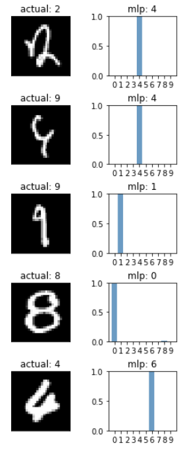

从上面的错误来看，模型对一些细节的判断不是很准。下面来尝试一下LeNet。

## LeNet

LeNet诞生于1994年，是Yann LeCun等人提出的，是最早的卷积神经网络之一。在LeNet中，输入层是32×32的图片，而MNIST是28×28的图片，为了保持模型的结构不变，在第一个Conv2D设置参数padding=’same’。首先创建模型，并训练。

~~~python
def get_lenet(input_shape=input_shape, learning_rate=0.001):
    input = layers.Input(shape=input_shape)
    x = layers.Conv2D(6, (5, 5), activation='relu', padding='same')(input)
    x = layers.MaxPooling2D((2, 2))(x)
    x = layers.Conv2D(16, (5, 5), activation='relu')(x)
    x = layers.MaxPooling2D((2, 2))(x)   
    x = layers.Flatten()(x)
    x = layers.Dense(120, activation='relu')(x)
    x = layers.Dense(84, activation='relu')(x)                        
    x = layers.Dense(10, activation='softmax')(x)  
    
    model = Model(inputs=input, outputs=x, name='lenet') 
    model.compile(optimizer=optimizers.Adam(learning_rate=learning_rate),
                  loss=losses.SparseCategoricalCrossentropy(),
                  metrics=['accuracy'])  

    model.checkpoint_path = './checkpoints/{}/checkpoint'.format(model.name)
    return model    

# 创建模型
lenet_model = get_lenet(input_shape)
lenet_model.summary()

# 训练
history = train(lenet_model, epochs=20)
plot_history(history)
~~~

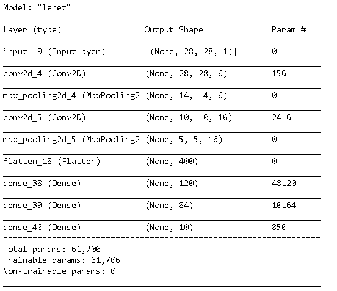

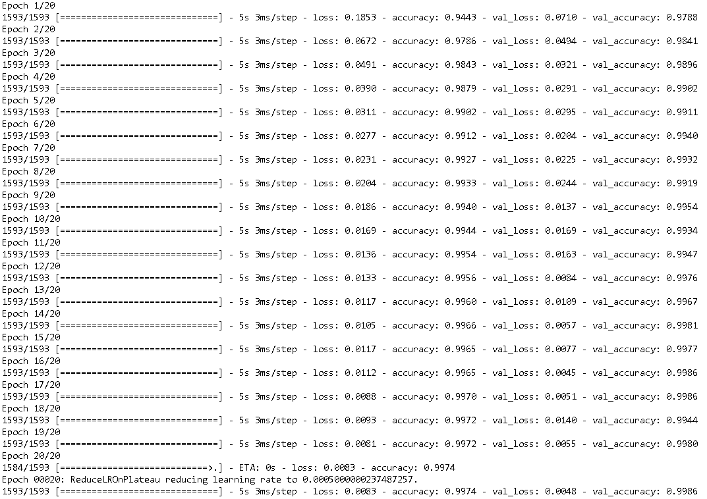

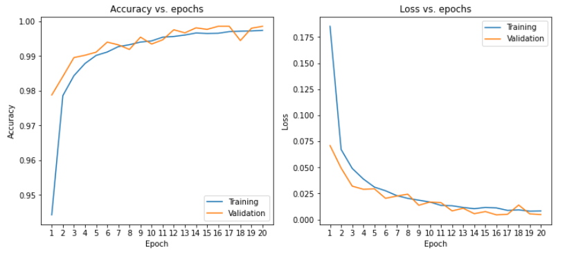

下面来评估模型，生成混淆矩阵，错误分析，以及模型对比。

~~~python
# 评估
lenet_model = load_best_checkpoint(get_lenet())
evaluate_show(lenet_model, train_time=history.train_time)

# 混淆矩阵
print('-'*120)
plot_confusion_matrix(mlp_model, lenet_model)   

# 模型对比
print('-'*120)
plot_predicted_sample([mlp_model, lenet_model], sample_count=5)
~~~

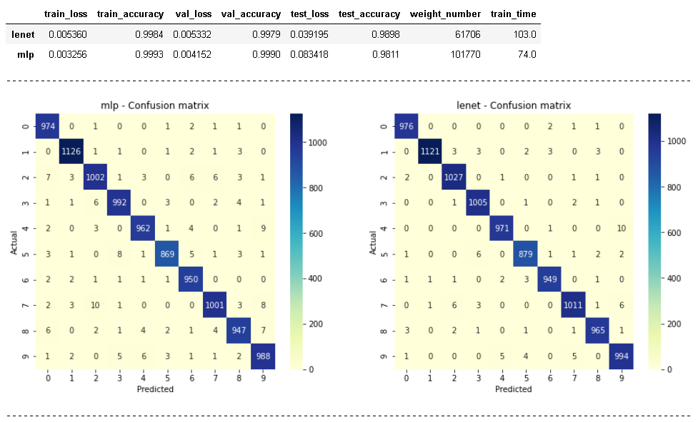

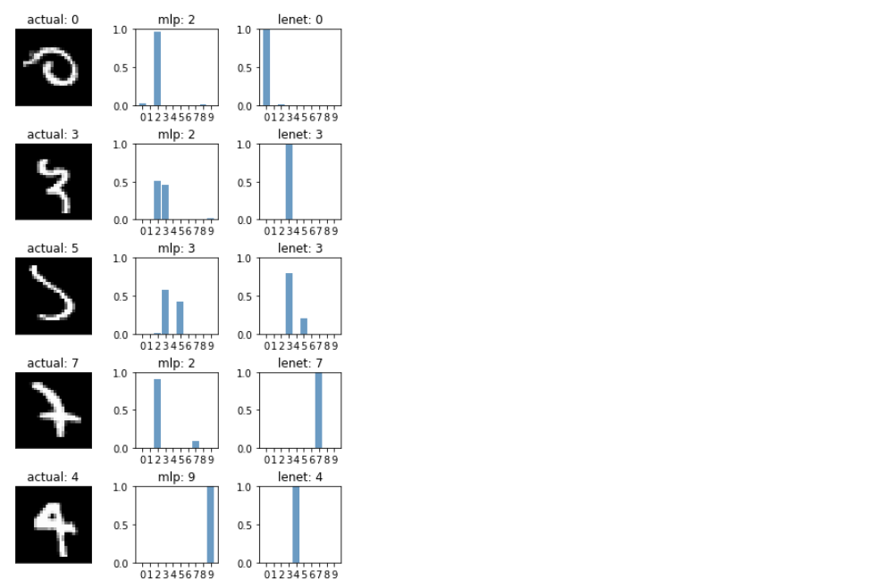

从上面的图中，可以看到，Lenet的参数只有mlp的60%，但其的准确率比mlp提升了差不多1%。上面最后一张图中，有三列，第一列是数字图片，它们是mlp中分错的数字，第二列是mlp中的分类，第三列是lenet中的分类，可以看到lenet的确学到了一些mlp中没有的模式。下面再来看看哪些数字在lenet也分错了。

~~~python
# 错误分析
plot_predicted_sample([lenet_model, mlp_model], sample_count=5)   
~~~

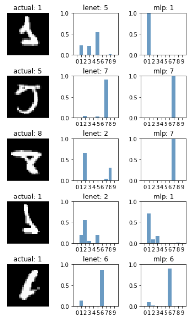

上图中，可以看到对于部分数字的识别，mlp甚至要更好一点啊，还有一些数字，则是一起都错了。

## Custom

下面自己定义一个模型，看看效果如何。

## 总结

归纳上面的模型训练结果，可以得出以下几个结论。

- LeNet比经典的神经网络参数要少，模型收敛更快，准确率明显提升。
- MNIST数据集过于简单了，很简单的算法也能轻易取得99%的准确率。建议采用Fashion MNIST作为替代。
- 增加卷积的深度，对于准确率的提升是有明显作用的。
- 本文中，对于Fashion MNIST最好只能取得91%的准确率，还需要采用新的模型结构才能继续提升。

## 参考

- [TensorFlow 2 quickstart for beginners](https://www.tensorflow.org/tutorials/quickstart/beginner)
- [image-classification-on-mnist](https://paperswithcode.com/sota/image-classification-on-mnist)

## 历史

- 2020-10-26：初始版本
- 2020-10-28：采用相同算法，对Fashion Mnist数据集进行分类
- 2020-11-01：pytorch训练时，增加了validation accuaracy。
- 2020-12-08：移除了pytorch的内容，集中tensorflow本身。