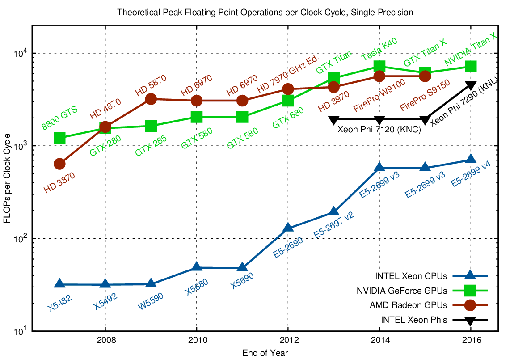
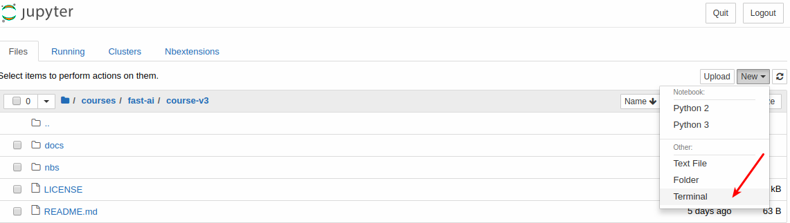
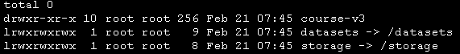
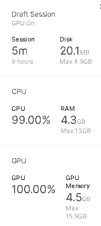

# Practical Deep Learning for Coders, v3

https://course.fast.ai/


## 1. GPU平台

采用GPU进行深度学习计算会比CPU快得多。下图中可以看出，一般来说GPU比同档次的CPU大概快10-15倍。



以下是一些平台：

- [Paperspace Gradient](https://course.fast.ai/start_gradient.html); (instant approval, no installation required, free and paid options)
- [Colab](https://course.fast.ai/start_colab.html); (instant approval, requires minimal installation, free)
- [Onepanel](https://course.fast.ai/start_onepanel.html); (no installation required, $0.29/hour + storage)
- [SageMaker](https://course.fast.ai/start_sagemaker.html); (requires wait for approval, not quite “one click”… but pretty close, $1.26 an hour + storage)
- [Kaggle Kernels](https://course.fast.ai/start_kaggle.html); (Instant Launch, No setup required, Free, not always up to date and not as well supported by fast.ai)
- [Floydhub](https://course.fast.ai/start_floydhub.html); (instant approval, no installation required, $1.20/hour + $9.00/month (100GB storage), 2 hours free credit)
- [易学智能](https://course.fast.ai/start_easyaiforum.html); (实时可用，无需安装，￥1/h(CPU)，￥2/h(1050ti)，￥5/h(1080ti)，内置大量数据集，专为AI开发设计

### 1.1 My Server

http://aa00:18888/tree/eipi10/fastai/course-v3

~~~
pip uninstall enum34  # 移除enum34，否者安装bottleneck会报错
pip install fastai --upgrade
~~~


### 1.2 Gradient

https://course.fast.ai/start_gradient.html

一家叫做**Paperspace**的云计算公司，他们提供了名叫**Gradient**的服务：大家都可以用云端GPU，直接跑Jupyter Notebook，不需要付费。系统预装了PyTorch、TensorFlow、Keras等等许多主流机器学习框架，用起来几乎不会有任何障碍。训练、推理、部署全部支持，还可以把自己的项目公开分享出来。

步骤如下：

- 打开 https://www.paperspace.com/console/notebooks，创建或选择一个notebook

  机器性能也不错，notebook每次可以运行六小时。

- 安装

  

  ~~~shell
  ls -l
  ~~~

  显示如下




其中/storage是永久存储的目录
```shell
pip install fastai --upgrade
cd course-v3
git pull
```

查看显卡

~~~
gpustat                  #是一个输出格式比较简单的查看nvidia工具，通过pip install gpustat  --proxy http://web-proxy.rose.hp.com:8080，安装
~~~

目前申请到的显卡是Quadro M4000

### 1.3 Colab

https://course.fast.ai/start_colab.html

Colaboratory 是一个 Google 研究项目，旨在帮助传播机器学习培训和研究成果。它是一个 Jupyter 笔记本环境，不需要进行任何设置就可以使用，并且完全在云端运行。

Colaboratory 笔记本存储在 Google 云端硬盘中，并且可以共享，就如同您使用 Google 文档或表格一样。Colaboratory 可免费使用。

#### 打开Colab

1. 打开https://colab.research.google.com/github/fastai/course-v3
2. 选择要打开的notebook。

#### 安装必要的包

~~~python
!curl -s https://course.fast.ai/setup/colab | bash
~~~

#### Google Drive映射

把Google Drive映射到本地磁盘。

~~~python
from google.colab import drive
drive.mount('/content/gdrive', force_remount=True)
root_dir = "/content/gdrive/My Drive/"
base_dir = root_dir + 'fastai-v3/'
~~~


### 1.4 Kaggle.com

  打开下面的连接，选择

- [Lesson-1 Pets](https://www.kaggle.com/hortonhearsafoo/fast-ai-v3-lesson-1)
- [Lesson 2 Download](https://www.kaggle.com/init27/fastai-v3-lesson-2)
- [Lesson 2 SGD](https://www.kaggle.com/init27/fastai-v3-lesson-2-sgd)
- [Lesson 3 Camvid-tiramisu](https://www.kaggle.com/hortonhearsafoo/fast-ai-v3-lesson-3-camvid-tiramisu)
- [Lesson 3 Camvid](https://www.kaggle.com/hortonhearsafoo/fast-ai-v3-lesson-3-camvid)
- [Lesson 3 Head-Pose](https://www.kaggle.com/hortonhearsafoo/fast-ai-v3-lesson-3-head-pose)
- [Lesson 3 Planet](https://www.kaggle.com/hortonhearsafoo/fast-ai-v3-lesson-3-planet)
- [Lesson 3 Tabular](https://www.kaggle.com/hortonhearsafoo/fast-ai-v3-lesson-3-imdb)
- [Lesson 4 Collab](https://www.kaggle.com/init27/fastai-v3-lesson4-collab)
- [Lesson 4 Tabular](https://www.kaggle.com/init27/fastai-v3-lesson-4-tabular)
- [Lesson 5 SGD-MNIST](https://www.kaggle.com/hortonhearsafoo/fast-ai-v3-lesson-5-sgd-mnist)
- [Lesson 6 Pets-more](https://www.kaggle.com/init27/fastai-v3-lesson-6-pets)
- [Rossmann data clean](https://www.kaggle.com/init27/fastai-v3-rossman-data-clean)
- [Lesson 6 Rossmann](https://www.kaggle.com/init27/fastai-v3-lesson-6-rossman)
- [Lesson 7 Human-numbers](https://www.kaggle.com/init27/fastai-v3-lesson-7-human-numbers)
- [Lesson 7 Resnet MNIST](https://www.kaggle.com/init27/fastai-v3-lesson-7-resnet-mnist)

#### Resources & Limitations

- Kaggle kernels are run free of cost.
- Notebook aren’t updated at same frequency as in the [fastai repository](https://github.com/fastai/course-v3)
- Not officially supported by the fastai team (These are being maintained by Sanyam Bhutani, relevant [discussion thread](https://forums.fast.ai/t/platform-kaggle-kernels/32569))
- GPU Time (K-80 instance) is limited to 6 hours (Per session).
- Disk usage is limited to 5 GB per kernel.
- RAM is limited to 14 GB per kernel.  

**机器情况**



### 1.5 易学智能

https://www.easyaiforum.cn/competition

挺不错的。

### 1.6 性能比较

cpu检查

~~~python
import torch
t_cpu = torch.rand(800,800,800)
%timeit t_cpu @ t_cpu
~~~

gpu检查

~~~python
import torch
t_gpu = torch.rand(800,800,800).cuda()
%timeit t_gpu @ t_gpu
~~~


|           | CPU    | GPU     |
| --------- | ------ | ------- |
| My Server | 3.54 s | 139 ms  |
| Gradient  | 2.16 s | 40.8 µs |
| Colab     | 7.38 s | 217 ms  |
| Kaggle    | 7.78 s |         |

总体上，看起来Gradient性能最为强悍，尤其是GPU。其次是My Server


