What is PyTorch?
----------------

It’s a Python-based scientific computing package targeted at two sets of audiences:

-  A replacement for NumPy to use the power of GPUs
-  a deep learning research platform that provides maximum flexibility and speed

Getting Started
---------------

### Tensors

#### 空矩阵


```python
%matplotlib inline
from __future__ import print_function
import torch
import numpy as np

x = torch.empty(5, 3)
print(x)
print(np.empty([5, 3]))
```

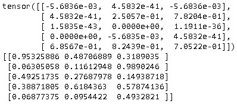

#### 随机矩阵


```{.python .input  n=41}
x = torch.rand(5, 3)
print(x)
print(np.random.rand(5, 3))
```

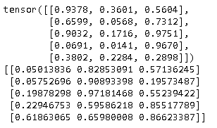

#### zero矩阵和one矩阵

创建zero矩阵，并指定数据类型。如果没有指定，默认的数据类型是float32，而在numpy中默认创建的类型是float64。


```python
x = torch.zeros(5, 3, dtype=torch.long)
x1 = torch.zeros(5, 3)
print(x, x.dtype)
print(x1, x1.dtype)
x2 = np.zeros([5, 3])
print(x2, (x2.dtype))

x = torch.ones(5, 3, dtype=torch.long)
x1 = torch.ones(5, 3)
print(x, x.dtype)
print(x1, x1.dtype)
x2 = np.ones([5, 3])
print(x2, (x2.dtype))
```


#### 从数据中直接创建


```{.python .input  n=43}
x = torch.tensor([[5.5, 3],[2.1, 1.4]])
print(x, x.dtype)

x = np.array([[5.5, 3],[2.1, 1.4]])
print(x, x.dtype)
```

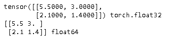

#### 重用创建的结构来创建


```{.python .input  n=45}
x = x.new_ones(5, 3, dtype=torch.double)      # new_* methods take in sizes
print(x, x.dtype)

x1 = torch.randn_like(x, dtype=torch.float)    # override dtype!
print(x1, x.dtype)                                      # result has the same size

x2 = np.ones([5, 3])
x2= np.random.randn(*x.shape)
print(x, x.dtype)
```

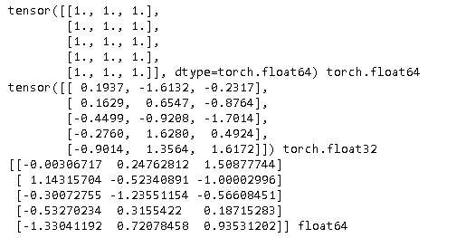

#### 得到矩阵的size


```{.python .input  n=46}
print(x.size())
print(x1.size())
print(x2.shape)
```

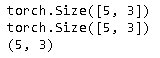

#### 矩阵加法


```{.python .input  n=19}
x = x.new_ones(5, 3, dtype=torch.double) 
y = torch.rand(5, 3)
print(x + y)
print(torch.add(x, y))

# 提供输出参数
result = torch.empty(5, 3)
torch.add(x, y, out=result)
print(result)

# 把y加到x里面
# 类似的操作有x.copy_(y), x.t_()`
x.add_(y)
print(x)
```

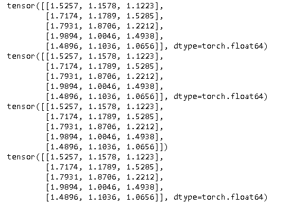

####  Resize矩阵


```{.python .input  n=24}
x = torch.randn(4, 4)
y = x.view(16)
z = x.view(-1, 8)  # the size -1 is inferred from other dimensions
print(x.size(), y.size(), z.size())

x2 =  np.random.randn(5, 3)
print(x2.shape, x2.reshape((-1, 5)).shape)
```

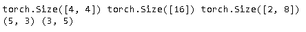

如果只有一个成员，适用 `.item()`获取值。


```{.python .input  n=25}
x = torch.randn(1)
print(x)
print(x.item())
```

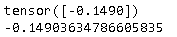

更多的函数参见https://pytorch.org/docs/stable/torch.html。


NumPy Bridge
------------

Torch Tensor和NumPy array之间的相互转换非常容易。


```{.python .input  n=26}
a = torch.ones(5)
print(a)
b = a.numpy()
print(b)
```

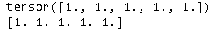

它们背后共享内存，所以修改一个另外一个也慧改变

```{.python .input  n=27}
a.add_(1)
a[2] = 3
print(a)
print(b)
#print(a.add(b))  # TypeError: add_(): argument 'other' (position 1) must be Tensor, not numpy.ndarray
```

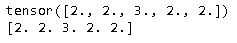


```{.python .input  n=35}
import numpy as np
a = np.ones(5)
b = torch.from_numpy(a)
np.add(a, 1, out=a)
a[2] = 3
print(a)
print(b)
```

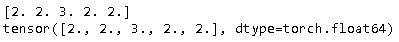

#### 转置

```{.python .input  n=36}
x = torch.tensor([[1, 2, 3, 4, 5], [6, 7, 8, 9, 10]])
print(x)
print(x.t())
print(x.numpy().T)
```

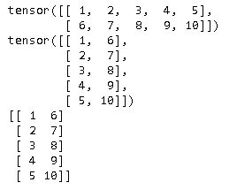


矩阵乘法
------------

```{.python .input  n=3}
import numpy as np
import torch
x = np.random.rand(5, 3)
y = np.random.rand(3, 2)
print(x.dot(y))
print(x @ y)

x = torch.from_numpy(x)
y = torch.from_numpy(y)
print(x.mm(y))
print(x.matmul(y))
print(x @ y)
```

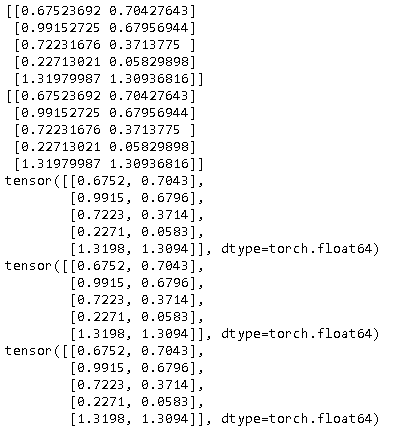

矩阵点乘
------------

```{.python .input  n=95}
                                                                                      
```

```{.json .output n=95}
[
 {
  "name": "stdout",
  "output_type": "stream",
  "text": "[[0.11351711 0.07132612 0.11332093]\n [0.04236096 0.0121558  0.07490655]\n [0.25871924 0.23204599 0.34242472]\n [0.49872754 0.07574644 0.58106411]\n [0.01086334 0.01054779 0.00343615]]\ntensor([[0.1135, 0.0713, 0.1133],\n        [0.0424, 0.0122, 0.0749],\n        [0.2587, 0.2320, 0.3424],\n        [0.4987, 0.0757, 0.5811],\n        [0.0109, 0.0105, 0.0034]], dtype=torch.float64)\ntensor([[0.1135, 0.0713, 0.1133],\n        [0.0424, 0.0122, 0.0749],\n        [0.2587, 0.2320, 0.3424],\n        [0.4987, 0.0757, 0.5811],\n        [0.0109, 0.0105, 0.0034]], dtype=torch.float64)\n"
 }
]
```

All the Tensors on the CPU except a CharTensor support converting to
NumPy and back.

CUDA Tensors
------------

Tensors can be moved onto any device using the ``.to`` method.


```{.python .input  n=69}
# let us run this cell only if CUDA is available
# We will use ``torch.device`` objects to move tensors in and out of GPU
if torch.cuda.is_available():
    device = torch.device("cuda")          # a CUDA device object
    x = torch.rand(5, 3)
    y = torch.ones_like(x, device=device)  # directly create a tensor on GPU
    x = x.to(device)                       # or just use strings ``.to("cuda")``
    z = x + y
    print(z)
    print(z.to("cpu", torch.double))       # ``.to`` can also change dtype together!
```

```{.json .output n=69}
[
 {
  "name": "stdout",
  "output_type": "stream",
  "text": "tensor([[1.0403, 1.1154, 1.6679],\n        [1.4616, 1.9931, 1.2849],\n        [1.0592, 1.1075, 1.4568],\n        [1.6452, 1.8758, 1.6133],\n        [1.5751, 1.4320, 1.6804]], device='cuda:0')\ntensor([[1.0403, 1.1154, 1.6679],\n        [1.4616, 1.9931, 1.2849],\n        [1.0592, 1.1075, 1.4568],\n        [1.6452, 1.8758, 1.6133],\n        [1.5751, 1.4320, 1.6804]], dtype=torch.float64)\n"
 }
]
```

```{.python .input}

```
