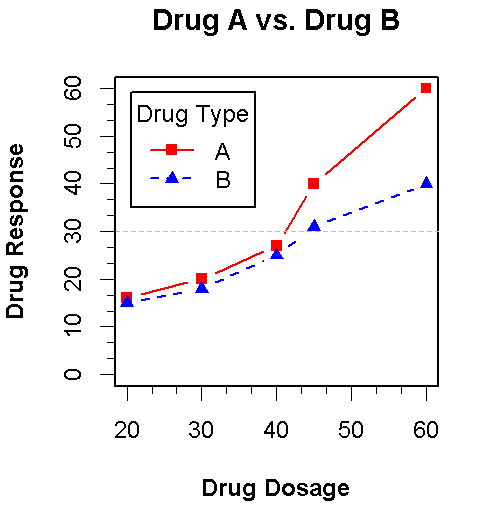

### 示例数据

~~~R
dose <- c(20, 30, 40, 45, 60)
drugA <- c(16, 20, 27, 40, 60)
drugB <- c(15, 18, 25, 31, 40)
plot(dose, drugA, type="b")		# type="b"表示同时绘制点和线
~~~

### 图形参数

#### 类型: type

- p : 显示为点
- l : 显示为线
- b : 显示为点和连接线
- o : 点覆盖在线上
- h : 显示为从点到x轴的垂直线
- s : 显示为阶梯图
- n : 不显示

#### 符号和线条

- pch: 指定绘制点时使用的符号

  

  对于符号21~25，你还可以指定边界颜色（col=）和填充色（bg=）。

- cex: 指定符号的大小。cex 是一个数值，表示绘图符号相对于默认大小的缩放倍数。

- lty: 指定线条类型

  

- lwd: 指定线条宽度。lwd 是以默认值的相对大小来表示的（默认值为1）。

~~~R
plot(dose, drugA, type="b", lty=3, lwd=3, pch=15, cex=2)
~~~

#### 颜色

- col: 默认的绘图颜色。某些函数（如lines 和pie）可以接受一个含有颜色值的向量并自动循环使用。例如，如果设定col=c("red", "blue")并需要绘制三条线，则第一条线将为红色，第二条线为蓝色，第三条线又将为红色
- col.axis: 坐标轴刻度文字的颜色
- col.lab: 坐标轴标签（名称）的颜色
- col.main: 标题颜色
- col.sub: 副标题颜色
- fg: 图形的前景色
- bg:  图形的背景色

~~~R
colors() 		# 返回所有可用颜色的名称

# 创建吸引人的颜色配对
# install.packages("RColorBrewer")
library(RColorBrewer)  
brewer.pal.info			# 得到所有可选调色板的
display.brewer.all()	# 输出每个调色板的颜色
~~~

~~~R
library(RColorBrewer)
n <- 7
mycolors <- brewer.pal(n, "Set1")	# 从Set1调色板中抽取了7种用十六进制表示的颜色
barplot(runif(n), col=mycolors)

dev.new()
n <- 10
mycolors <- rainbow(n)		# 七阶彩色
pie(runif(n), labels=mycolors, col=mycolors)

dev.new()
mygrays <- gray(0:n/n)		# 生成10阶灰度色
pie(runif(n), labels=mygrays, col=mygrays)
~~~

#### 文本属性

- 文本大小
  - cex: 表示相对于默认大小缩放倍数的数值
  - cex.axis: 坐标轴刻度文字的缩放倍数
  - cex.lab: 坐标轴标签（名称）的缩放倍数
  - cex.main: 标题的缩放倍数
  - cex.sub: 副标题的缩放倍数

- 字体族、字号和字样
  - font: 整数。用于指定绘图使用的字体样式。1=常规，2=粗体，3=斜体，4=粗斜体，5=符号字体（以Adobe符号编码表示）
  - font.axis: 坐标轴刻度文字的字体样式
  - font.lab: 坐标轴标签（名称）的字体样式
  - font.main: 标题的字体样式
  - font.sub: 副标题的字体样式
  - ps: 字体磅值（1 磅约为1/72 英寸）。文本的最终大小为ps*cex
  - family:  绘制文本时使用的字体族。标准的取值为serif（衬线）、sans（无衬线）和mono（等宽）

~~~R
opar <- par(no.readonly=TRUE)
par(font.lab=3, cex.lab=1.5, font.main=4, cex.main=2, lty=2, pch=17)
plot(dose, drugA, type="b")
par(opar)
~~~

#### 图形尺寸与边界尺寸

- pin: 以英寸表示的图形尺寸（宽和高）
- mai: 以数值向量表示的边界大小，顺序为“下、左、上、右”，单位为英寸
- mar: 以数值向量表示的边界大小，顺序为“下、左、上、右”，单位为英分①。默认值为c(5, 4, 4, 2) + 0.1

~~~R
opar <- par(no.readonly=TRUE)
par(pin=c(2, 3))
par(lwd=2, cex=1.5)
par(cex.axis=.75, font.axis=3)
plot(dose, drugA, type="b", pch=19, lty=2, col="red")
plot(dose, drugB, type="b", pch=23, lty=6, col="blue", bg="green")
par(opar)
~~~

### 添加文本、自定义坐标轴和图例

~~~R
x <- c(1:10)
y <- x
z <- 10/x
opar <- par(no.readonly=TRUE)
par(mar=c(5, 4, 4, 8) + 0.1)
plot(x, y, type="b", 
     pch=21, col="red",
     yaxt="n", lty=3, ann=FALSE)
lines(x, z, type="b", pch=22, col="blue", lty=2)

# 绘制你自己的坐标轴
axis(2, at=x, labels=x, col.axis="red", las=2)    
axis(4, at=z, labels=round(z, digits=2),
     col.axis="blue", las=2, cex.axis=0.7, tck=-.01)
mtext("y=1/x", side=4, line=3, cex.lab=1, las=2, col="blue")
abline(v=seq(0, 10, 2), lty=3, col="grey")  	# 添加参考线
abline(h=seq(0, 10, 1), lty=3, col="grey")  	# 添加参考线

title("An Example of Creative Axes", 
      xlab="X values",
      ylab="Y=X")

par(opar)
~~~

#### 坐标轴

- side: axis第一个参数：表示在图形的哪边绘制坐标轴（1=下，2=左，3=上，4=右）
- at: 一个数值型向量，表示需要绘制刻度线的位置
- labels: 一个字符型向量，表示置于刻度线旁边的文字标签（如果为NULL，则将直接使用at 中的值）
- pos: 坐标轴线绘制位置的坐标（即与另一条坐标轴相交位置的值）
- lty: 线条类型
- col: 线条和刻度线颜色
- las: 标签是否平行于（=0）或垂直于（=2）坐标轴
- tck: 刻度线的长度，以相对于绘图区域大小的分数表示（负值表示在图形外侧，正值表示在图形内侧，0表示禁用刻度，1 表示绘制网格线）；默认值为–0.01

#### 图例

~~~R
dose <- c(20, 30, 40, 45, 60)
drugA <- c(16, 20, 27, 40, 60)
drugB <- c(15, 18, 25, 31, 40)

opar <- par(no.readonly=TRUE)
par(lwd=2, cex=1.5, font.lab=2)
plot(dose, drugA, type="b",
     pch=15, lty=1, col="red", ylim=c(0, 60),
     main="Drug A vs. Drug B",
     xlab="Drug Dosage", ylab="Drug Response")
lines(dose, drugB, type="b",
      pch=17, lty=2, col="blue")
abline(h=c(30), lwd=1.5, lty=2, col="gray")

library(Hmisc)	# install.packages("Hmisc")
minor.tick(nx=3, ny=3, tick.ratio=0.5)		# 添加次要刻度线
legend("topleft", inset=.05, title="Drug Type", c("A","B"),
       lty=c(1, 2), pch=c(15, 17), col=c("red", "blue"))		# 添加图例
par(opar)
~~~

#### 文本标注

可以通过函数text()和mtext()将文本添加到图形上。text()可向绘图区域内部添加文本，而mtext()则向图形的四个边界之一添加文本。使用格式分别为：

~~~
text(location, "text to place", pos, ...)
mtext("text to place", side, line=n, ...)
~~~

- location: 文本的位置参数。可为一对x、y 坐标，也可通过指定location 为locator(1)使用鼠标交互式地确定摆放位置
- pos: 文本相对于位置参数的方位。1=下，2=左，3=上，4=右。如果指定了pos，就可以同时指定参数offset=作为偏移量，以相对于单个字符宽度的比例表示
- side: 指定用来放置文本的边。1=下，2=左，3=上，4=右。你可以指定参数line=来内移或外移文本，随着值的增加，文本将外移。也可使用adj=0 将文本向左下对齐，或使用adj=1 右上对齐

~~~R
attach(mtcars)
plot(wt, mpg,
     main="Mileage vs. Car Weight",
     xlab="Weight", ylab="Mileage",
     pch=18, col="blue")
text(wt, mpg,
     row.names(mtcars),
     cex=0.6, pos=4, col="red")
detach(mtcars)
~~~

###

#### 数学标记

类似于TeX 中的写法为图形添加数学符号和公式。请参阅help(plotmath)，demo(plotmath)。

~~~R
require(graphics)

plot(1:10, 1:10)
text(4, 9, expression(hat(beta) == (X^t * X)^{-1} * X^t * y))
text(4, 8.4, "expression(hat(beta) == (X^t * X)^{-1} * X^t * y)",
     cex = .8)
text(4, 7, expression(bar(x) == sum(frac(x[i], n), i==1, n)))
text(4, 6.4, "expression(bar(x) == sum(frac(x[i], n), i==1, n))",
     cex = .8)
text(8, 5, expression(paste(frac(1, sigma*sqrt(2*pi)), " ",
                            plain(e)^{frac(-(x-mu)^2, 2*sigma^2)})),
     cex = 1.2)
~~~

### 图形的组合

在R中使用函数par()或layout()可以容易地组合多幅图形为一幅总括图形。

#### 使用mfrow=c(nrows, ncols)

~~~R
attach(mtcars)
opar <- par(no.readonly=TRUE)
par(mfrow=c(2,2))
plot(wt,mpg, main="Scatterplot of wt vs. mpg")
plot(wt,disp, main="Scatterplot of wt vs. disp")
hist(wt, main="Histogram of wt")
boxplot(wt, main="Boxplot of wt")
par(opar)
detach(mtcars)
~~~

#### 使用layout()

~~~R
attach(mtcars)
layout(matrix(c(1,1,2,3), 2, 2, byrow = TRUE))
hist(wt)
hist(mpg)
hist(disp)
detach(mtcars)
~~~

#### 图形布局的精细控制

使用图形参数fig，在散点图上添加两幅箱线图，创建了单幅的增强型图形

~~~R
opar <- par(no.readonly=TRUE)
par(fig=c(0, 0.8, 0, 0.8))
plot(mtcars$wt, mtcars$mpg,
     xlab="Miles Per Gallon",
     ylab="Car Weight")

par(fig=c(0, 0.8, 0.55, 1), new=TRUE)
boxplot(mtcars$wt, horizontal=TRUE, axes=FALSE)

par(fig=c(0.65, 1, 0, 0.8), new=TRUE)
boxplot(mtcars$mpg, axes=FALSE)

mtext("Enhanced Scatterplot", side=3, outer=TRUE, line=-3)
par(opar)
~~~

要理解这幅图的绘制原理，请试想完整的绘图区域：左下角坐标为(0, 0)，而右上角坐标为(1, 1)。下面是一幅示意图。参数fig=的取值是一个形如c(x1, x2, y1, y2)的数值向量。

