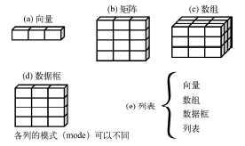
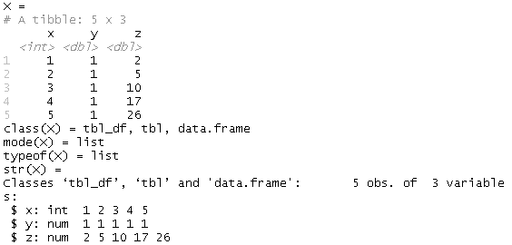
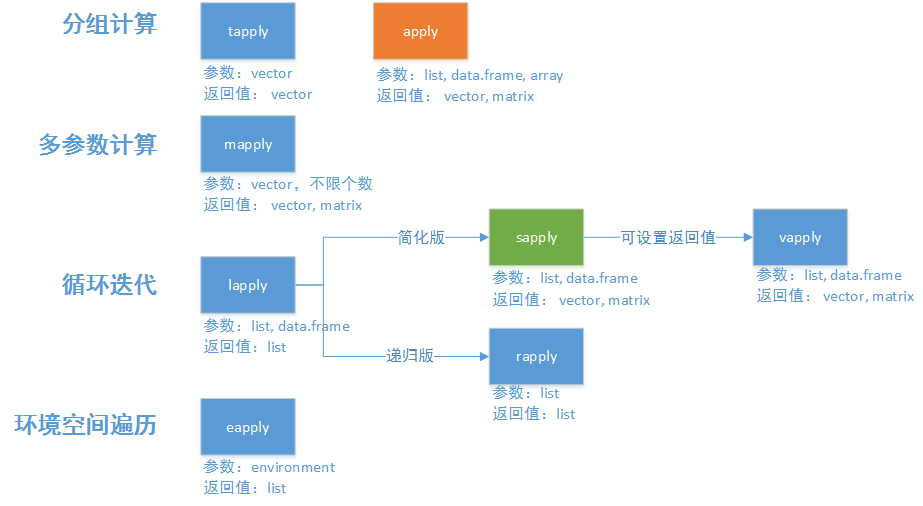
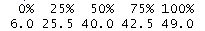
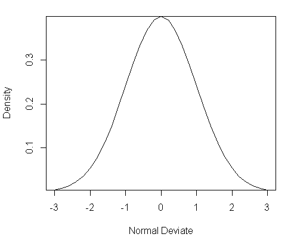
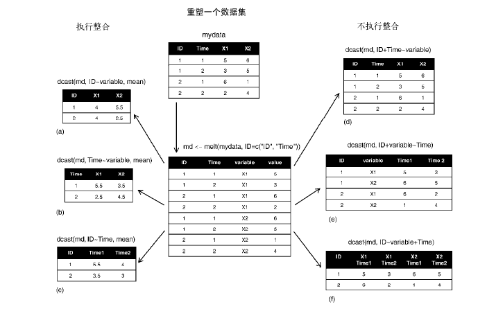

### 工作目录

~~~R
getwd()							# 得到当前工作目录
# 修改当前工作目录
setwd("c:/xujian/eipi10/xuxiangwen.github.io/_notes/05-ai/60-r")		
~~~

### 设置代理

~~~R
Sys.setenv("http_proxy"="http://web-proxy.rose.hp.com:8080") 
Sys.setenv("https_proxy"="http://web-proxy.rose.hp.com:8080") 
~~~

### 获得帮助（help）

~~~R
?mean 		#打开mean函数的帮助页面
?"if" 		#打开if的帮助页面，用于分支代码
??plotting 	#搜索所有包含"plotting" 的主题
~~~

### 查看示例（example）和演示（demo）

~~~R
example(plot)     
demo()            	#显示演示列表
demo(image)          
browseVignettes()	#查看程序片段（限已经安装的包）
RSiteSearch("Bayesian regression") 	#网上查找包
~~~

> 真的很不错:smiley:

### 安装包（package）

~~~R
version							#R的版本
install.packages("installr") 	#下载并安装installr包			
.libPaths()						#查看R包安装到了什么地方
colnames(installed.packages())	#查看已经安装了哪些包
library()						#同上
update.packages()				#可以更新已经安装的包    
~~~

### 工作空间（workspace）

~~~R
# 工作空间保存
an_object <- 1:5
ls()							# 列出当前工作空间中的对象
save.image("current.RData") 	# 保存工作空间到文件myfile中
rm(list=ls())					# 删除所有对象
ls()
load("current.RData")			# 读取一个工作空间到当前会话中
ls()		
unlink("current.RData")			# 删除文件		
list.files()					# 显示当前目录文件列表	

# 对象保存aa
a <- 1:5
b <- runif(5)					# 产生uniform(均匀分布)5个数
save(a, b, file="ab.RData") 	# 保存指定对象到一个文件中		
ls()					
rm(a, b)   			# 删除对象
ls()
load("ab.RData")	# 恢复对象	
ls()
unlink("ab.RData")							

options() 			# 显示或设置当前选项
a = 3.1415926		
a
options(digits=3)	# 显示三位数字，Uniform 
a
~~~

### 数据类型和对象类型

- 数据类型

  - 数值型（numeric）
  - 复数型（complex）
  - 逻辑型（logical）
  - 字符型（character）

- 对象类型

  - 标量（Scalar）
- 向量（Vector） ：一个向量只能有一种数据类型
  - 因子（Factor）：一个因子只能有一种数据类型
- 矩阵（Matrix） ：一个矩阵只能有一种数据类型
  - 数组（Array） ：一个数组里面的每个元素只能有一种数据类型，不同元素的类型可以不同
- 列表（List） ：允许不同的数据类型
- 数据框（Data frame）：不同的列的数据类型允许不同

查看对象类型：

- class： 返回对象的抽象类型（是从面向对象角来看的）
- mode：为了和S语言兼容，返回R的对象的模式。
- typeof：和mode类似，但是更新，更加准确。一般用typeof就好。
- str： 对象的内部结构

~~~R
show_object_type <- function(X){
    cat('X = \n')
    print(X)
    cat('class(X) =', paste(class(X), collapse=", "), '\n')
    cat('mode(X) =', mode(X), '\n')
    cat('typeof(X) =', typeof(X), '\n')
    cat('str(X) =\n')
    str(X)
}

v <- 1:10
show_object_type(v)

f <- gl(2, 5)
show_object_type(f)

m <- matrix(1:20, nrow=5, ncol=4)
show_object_type(m)

l <- list(a = c(1, 2, 3, 4), 
          b = c(89, 78, 69, 93))
show_object_type(l)

df <- data.frame(a = c(1, 2, 3, 4), 
                 b = c(89, 78, 69, 93))
show_object_type(df)
~~~

### 矩阵（matrix）和数组（array）

矩阵是二维，而数组是多维。

~~~
y <- matrix(1:20, nrow=5, ncol=4)
y

dim1 <- c("A1", "A2")
dim2 <- c("B1", "B2", "B3")
dim3 <- c("C1", "C2", "C3", "C4")
z <- array(1:24, c(2, 3, 4), dimnames=list(dim1, dim2, dim3))
z
~~~

### 因子（facor）

类别（名义型）变量和有序类别（有序型）变量在R中称为因子（factor）。函数factor()以一个整数向量的形式存储类别值，整数的取值范围是[1...k]（其中k是名义型变量中唯一值的个数），同时一个由字符串（原始值）组成的内部向量将映射到这些整数上。

~~~R
status <- c("Poor", "Improved", "Excellent", "Poor")
# 各水平的赋值将为1=Poor、2=Improved、3=Excellent。
status <- factor(status, order=TRUE,
                 levels=c("Poor", "Improved", "Excellent"))
status
as.character(status)
as.numeric(status)
~~~

### 数据框（data.frame）

~~~R
patientID <- c(1, 2, 3, 4)
age <- c(25, 34, 28, 52)
diabetes <- c("Type1", "Type2", "Type1", "Type1")
status <- c("Poor", "Improved", "Excellent", "Poor")
patientdata <- data.frame(patientID, age, diabetes, status)
patientdata

patientdata[1:2]   # 第一列的编号是1，这和很多语言不同.
patientdata[c("diabetes", "status")]
patientdata$age

patientdata <- data.frame(patientID, age, diabetes,
                          status, row.names=age)
str(patientdata)		# 显示对象的结构。默认，data.frame自动把character转化为factor 
summary(patientdata) 	# 显示对象的统计概要
~~~

采用factor，大多数情况下，能够减少内存消耗，提高读写性能，但如果变量不同值的数量很大，使用character更加合适。代码如下：

~~~R
patientdata1 <- data.frame(patientID, age, diabetes,
                          status, row.names=age, 
                          stringsAsFactors = FALSE)
str(patientdata1)
~~~

### 列表（list）

列表中可能是若干向量、矩阵、数据框，甚至其他列表的组合。

~~~R
g <- "My First List"
h <- c(25, 26, 18, 39)
j <- matrix(1:10, nrow=5)
k <- c("one", "two", "three")
mylist <- list(title=g, ages=h, j, k)
mylist
~~~

### 数据框（data.frame）

#### 直接编辑

~~~R
mydata <- data.frame(age=numeric(0), 
                     gender=character(0), 
                     weight=numeric(0))
mydata <- edit(mydata)		# 编辑data.frame
~~~

#### 文本读入

~~~
mydatatxt <- "
age gender weight
25 m 166
30 f 115
18 f 120
"
mydata <- read.table(header=TRUE, text=mydatatxt)
~~~

#### 读入一个文件

创建文本文件（shell）。当前工作目录为`c:/xujian/eipi10/xuxiangwen.github.io/_notes/05-ai/60-r`。

~~~shell
mkdir -p data
cat << EOF > data/studentgrades.csv
StudentID,First,Last,Math,Science,Social Studies
011,Bob,Smith,90,80,67
012,Jane,Weary,75,,80
010,Dan,"Thornton, III",65,75,70
040,Mary,"O'Leary",90,95,92
EOF

~~~

~~~R
grades <- read.table("data/studentgrades.csv", header=TRUE,
                     row.names="StudentID", sep=",")
str(row.names(grades))	# 返回: chr [1:4] "11" "12" "10" "40"
str(grades)			

# 避免所有字符变量转化为因子
grades <- read.table("studentgrades.csv", header=TRUE,
                     row.names="StudentID", sep=",",
                     stringsAsFactors=FALSE)
str(row.names(grades))  # 返回: chr [1:4] "011" "012" "010" "040"
str(grades)

# 指定字符变量不要转化为因子
grades <- read.table("studentgrades.csv", header=TRUE,
                     row.names="StudentID", sep=",",
                     colClasses=c("character", "factor", 
                                  "character", "numeric", 
                                  "numeric", "numeric"))
str(grades)

~~~

#### 导入Excel文件

xlsx默认是没有安装的，而且需要安装java。

~~~R
install.packages("xlsx")  
~~~

> 如果报错`JAVA_HOME cannot be determined from the Registry`，在shell中运行`java -d64 -version`，检查目前是否安装java和jdk的版
>
> 本是否支持64位。如果没有安装java，可以下载[jre 64 bit](https://www.oracle.com/java/technologies/javase-jre8-downloads.html)

~~~R
library(xlsx)
grades <- read.xlsx("studentgrades.xlsx", 1, header=TRUE,
                     row.names="StudentID", stringsAsFactors=FALSE)		# 读取第一个sheet
str(grades)
~~~

> `read.xlsx2()`添加了更加多的处理过程

#### 其它导入

Stat/Transfer（www.stattransfer.com）是一款可在34种数据格式之间作转换的独立应用程序。

> 有机会可以试试

#### 数据基本处理和列名重命名

~~~R
library(plyr)		# install.packages("plyr")

get_df <- function(){
    manager <- c(1, 2, 3, 4, 5)
    date <- c("10/24/08", "10/28/08", "10/1/08", "10/12/08", "5/1/09")
    country <- c("US", "US", "UK", "UK", "UK")
    gender <- c("M", "F", "F", "M", "F")
    age <- c(32, 45, 25, 39, 99)
    q1 <- c(5, 3, 3, 3, 2)
    q2 <- c(4, 5, 5, 3, 2)
    q3 <- c(5, 2, 5, 4, 1)
    q4 <- c(5, 5, 5, NA, 2)
    q5 <- c(5, 5, 2, NA, 1)
    leadership <- data.frame(manager, date, country, gender, age,
                             q1, q2, q3, q4, q5, stringsAsFactors=FALSE)
    return (leadership)
}

leadership <- get_df()
leadership

# 数据处理
leadership$age[leadership$age == 99] <- NA
leadership$agecat[leadership$age > 75] <- "Elder"
leadership$agecat[leadership$age >= 55 &
                  leadership$age <= 75] <- "Middle Aged"
leadership$agecat[leadership$age < 55] <- "Young"

# 列名重命名
names(leadership)
# 方法一
names(leadership)[2] <- "testDate"	
names(leadership)

# 方法二，rename来自plyr包
leadership <- rename(leadership,
                     c(manager="managerID", testDate="surveyDate"))
names(leadership)
~~~

#### 删除缺失值的行

~~~
leadership			# 5 rows
new_leadership <- na.omit(leadership)
new_leadership   	# 3 rows
~~~

#### 数据集的合并和连接

~~~R
scores1 <- data.frame(id = c(1, 2, 3, 4), 
                      x1 = c(89, 78, 69, 93))
scores2 <- data.frame(id = c(1, 2, 5), 
                      x2 = c(79, 68, 74))
scores3 <- data.frame(id = c(1, 2, 6), 
                      x1 = c(79, 68, 74))
merge(scores1, scores2, by=c("id"))
merge(scores1, scores2, by=c("id")， all=TRUE)
rbind(scores1, scores3)		# 行合并
cbind(scores2, scores3)		# 列合并
~~~

#### 去除一些列（变量）

~~~
myvars <- names(leadership) %in% c("q3", "q4")
newdata <- leadership[!myvars]
newdata
~~~

#### 过滤数据

~~~R
leadership[1:3]			# 返回1:3列
leadership[1:3,]		# 返回1:3行
leadership[leadership$gender=="M" &
           leadership$age > 30,]

subset(leadership, age >= 35 | age < 24,
       select=c(q1, q2, q3, q4))

leadership[sample(1:nrow(leadership), 3, replace=FALSE),]	# 随机选取3列
~~~

#### 使用SQL操作数据框

~~~R
library(sqldf)	# install.packages('sqldf')
newdf <- sqldf("select * from mtcars where carb=1 order by mpg", 
               row.names=TRUE)
newdf
~~~

#### 聚合数据aggregate

~~~
aggregate(x, by, FUN, ..., simplify = TRUE, drop = TRUE)
~~~

示例如下

~~~R
options(digits=3)
attach(mtcars)
aggdata <-aggregate(mtcars, by=list(cyl,gear), FUN=mean, na.rm=TRUE)
aggdata
detach(mtcars)
~~~

> 实际可能并不会使用这种方法，而是使用dplyr包里面的功能

### dplyr 

参见[dplyr 入门帮助文档](https://www.xiangyunhuang.com.cn/2019/10/intro-dplyr/)

**dplyr包**是Hadley Wickham的新作，主要用于数据清洗和整理，该包专注dataframe数据格式，从而大幅提高了数据处理速度，并且提供了与其它数据库的接口

~~~
library(nycflights13)  	# install.packages('nycflights13')
dim(flights)
flights
~~~

>  `nycflights13::flights` 是一个 tibble 类型的数据对象，是一种现代化的数据框重构。在操作大型数据集的时候特别有用，因为它只打印前几行。你可以在网站 [http://tibble.tidyverse.org](http://tibble.tidyverse.org/) 了解到更多关于 tibble 的介绍。特别地，你可以通过函数 `as_tibble()` 将数据框 data.frame 转化为 tibble。

- `filter()` 基于属性值筛选行

  ~~~R
  # flights 数据集记录了 2013 年从纽约市出发的所有航班记录，总共 336776 条。
  flights %>% filter(month == 1, day == 1)
  # 上面语句等级于
  flights[flights$month == 1 & flights$day == 1, ]   	
  ~~~

- `arrange()` 按某一（些）列对行排序

  ~~~R
  flights %>%  arrange(year, desc(month), day)
  ~~~

- `select()` 和 `rename()` 基于属性名称筛选列变量

  ~~~R
  flights %>% select(year, month, day)		# 按变量名筛选
  flights %>% select(-(year:day))				# 除了year和day之间的列
  flights %>% rename(tail_num = tailnum)		# 变量重命名
  ~~~

- `mutate()` 和 `transmute()` 基于已有的变量的操作添加新的变量

  ~~~
  flights %>%
  mutate(
    gain = arr_delay - dep_delay,
    gain_per_hour = gain / (air_time / 60),
    speed = distance / air_time * 60
  )
  ~~~

  

- `sample_n()` 和 `sample_frac()` 随机抽取样本

  ~~~R
  flights %>% sample_n(10)
  flights %>% sample_frac(0.01)
  ~~~

- `summarise()` 将多个值压缩为单个值

  ~~~R
  flights %>% 
  summarise(delay = mean(dep_delay, na.rm = TRUE))
  ~~~

- `group_by()`分组

  ~~~R
  flights %>%
    group_by(year, month, day) %>%
    select(arr_delay, dep_delay) %>%
    summarise(
      arr = mean(arr_delay, na.rm = TRUE),
      dep = mean(dep_delay, na.rm = TRUE)
    ) %>%
    filter(arr > 30 | dep > 30)
  ~~~

  

### tibble

tibble来自包tidyverse，它是data.frame的进化版，功能更强大，更易操作。

#### 创建tibble

默认情况下，tibble只会显示10行。

~~~R
library(tidyverse)

# 创建tibble
t1 <- tibble(
  x = 1:5, 
  y = 1, 
  z = x ^ 2 + y
)
t1

t2 <- tribble(
  ~x, ~y, ~z,
  "a", 2, 3.6,
  "b", 1, 8.5
)
t2

as_tibble(iris)					# 转化data.frame到tibble
as.data.frame(as_tibble(iris))	# 转化tibble到data.frame
~~~

#### 类型查看

~~~R
show_object_type <- function(X){
    cat('X = \n')
    print(X)
    cat('class(X) =', paste(class(X), collapse=", "), '\n')
    cat('mode(X) =', mode(X), '\n')
    cat('typeof(X) =', typeof(X), '\n')
    cat('str(X) =\n')
    str(X)
}

show_object_type(t1)
~~~

下面是执行结果，tibble属于三个类型tbl_df, tbl, data.frame，换句话说，它是data.frame的子类。

#### [tibble vs. data.frame](https://cran.r-project.org/web/packages/tibble/vignettes/tibble.html)

- Printing

  - tibble默认只显示10行或者不超过一屏幕。而data.frame会打印所有记录，数据量很大的情况下，会很慢
  - tibble显示每一个列（变量）的类型

  ~~~R
  t1 <- tibble(
    x = 1:5, 
    y = 1, 
    z = x ^ 2 + y
  )
  t1
  df1 <- as.data.frame(t1)
  ~~~

  > tibble美观的多。

- Subsetting: 选择部分集合。

  ~~~R
  # 选择多列, 结果相同1
  class(t1[, 1:2])
  class(df1[, 1:2])
  
  # 选择一列，tibble返回的还是tibble, 而data.frame返回的时vector
  class(t1[, 2])		# 返回 "tbl_df"     "tbl"        "data.frame"
  class(df1[, 2])		# 返回 "numeric"
  ~~~

- lazy loading:  和data.frame()不同的是，tibble()更加懒惰，不会将string类型的数据转换成factor。

  ~~~R
  library(tidyverse)
  t1 <- tribble(
  ~age, ~gender, ~weight,
  25, "m", 166,
  30, "f", 115,
  18, "f", 120
  )
  t1
  
  text <- "
  age gender weight
  25 m 166
  30 f 115
  18 f 120
  "
  df1 <- read.table(header=TRUE, text=text)
  
  show_object_type(t1)
  show_object_type(df1)
  ~~~

#### tibble的数据类型

- int，代表integer
- dbl，代表double
- chr，代表character向量或字符串。
- dttm，代表日期+时间(a date + a time)
- lgl，代表逻辑判断TRUE或者FALSE
- fctr，代表因子类型factor
- date，代表日期dates.

#### [读取csv，tsv](https://readr.tidyverse.org/reference/read_delim.html)

~~~R
read_csv(readr_example("mtcars.csv"))
read_csv(readr_example("mtcars.csv.zip"))
# cd表示前两列类型分别为character, double
read_csv("x,y\nb,2\na,4", col_types = "cd")	
read_csv("x,y
  b,2
  a,4", col_types = "cd")	
~~~

### 日期

| 符 号 | 含 义                  | 示 例   |
| ----- | ---------------------- | ------- |
| %d    | 数字表示的日期（0~31） | 01~31   |
| %a    | 缩写的星期名           | Mon     |
| %A    | 非缩写星期名           | Monday  |
| %m    | 月份（00~12）          | 00~12   |
| %b    | 缩写的月份             | Jan     |
| %B    | 非缩写月份             | January |
| %y    | 两位数的年份           | 7       |
| %Y    | 四位数的年份           | 2007    |

~~~~R
leadership <- get_df()
leadership$date
leadership$date <- as.Date(leadership$date, "%m/%d/%y")		# 字符串转日期
leadership$date

dates <- as.Date(c("01/05/1965", "08/16/1975"), "%m/%d/%Y")
dates
Sys.Date()		# 可以返回当天的日

format(Sys.Date(), format="%B %d %Y")	# 输出指定格式的日期值
as.Date("2020-03-22") - as.Date("2020-01-23") 	# 返回间隔天数
difftime(as.Date("2020-03-22"), as.Date("2020-01-23"), units="weeks")
as.character(Sys.Date())		# 日期转化为字符
~~~~

#### 日期类型

R语言的基础包中提供了三种基本类型用于处理日期和时间。

- Date: 用于处理日期，它不包括时间和时区信息。存储了从1970年1月1日以来开始计算的天数，更早的日期表示为负值，也就是说，Date类型是一个整数，以天为单位来计算日期，因此，Date适合用于计算日期。

  ~~~R
  today <- Sys.Date()
  class(today)		# 返回 "Date”
  typeof(today)		# 返回 "double"
  
  # 日期转化为字符串
  mydate <- strftime(today, format='%Y-%m-%d')
  class(mydate)		# 返回 "character"
  typeof(mydate)		# 返回 "character"
  
  ~~~

- POSIXct: 以时间标准时间（UTC）时区位准的，表示从1970-01-01到该时间点经过的秒数

  ~~~R
  nowtime <- Sys.time()
  class(nowtime)		# 返回 "POSIXct" "POSIXt"
  typeof(nowtime)		# 返回 "double"
  
  # 日期转化为字符串
  nowtime1 <- strftime(nowtime, format='%a %b %d %H:%M:%S %Y')
  class(nowtime1)		# 返回 "character"
  typeof(nowtime1)		# 返回 "character"
  
  # 字符串转化为POSIXlt
  nowtime2 <- strptime(date(),'%a %b %d %H:%M:%S %Y')	
  class(nowtime2)		# 返回 "POSIXlt" "POSIXt"
  typeof(nowtime2)	# 返回 "list"
  
  # as.POSIXct 等价于strptime
  as.POSIXct(date(), format = "%a %b %d %H:%M:%S %Y")
  as.POSIXct(Sys.Date())
  
  ~~~

  上面例子可以看出，character是POSIXct，Date和POSIXlt之间的转化的中间格式。

- POSIXlt：把日期和时间存储为一个列表，其中包括秒、分、时和月份等，POSIXlt是使用列表来表示日期和时间，因此，POSIXlt最适合用于提取日期中的特定部分。

  ~~~R
  # 字符串转化为POSIXlt
  nowtime <- strptime(date(),'%a %b %d %H:%M:%S %Y')	# date()返回日期字符串
  class(nowtime)		# 返回 "POSIXlt" "POSIXt"
  typeof(nowtime)		# 返回 "list"
  
  # as.POSIXlt 等价于strptime
  as.POSIXlt(date(), format = "%a %b %d %H:%M:%S %Y")
  as.POSIXlt(Sys.time())
  as.POSIXlt(Sys.Date())
  
  # 日期转化为字符串
  nowtime1 <- strftime(nowtime, format='%Y-%m-%d %H:%M:%S%z')
  class(nowtime1)			# 返回 "character"
  typeof(nowtime1)		# 返回 "character"
  
  ~~~

  

### 类型转换

| 判断            | 转换            |
| --------------- | --------------- |
| is.numeric()    | as.numeric()    |
| is.character()  | as.character()  |
| is.vector()     | as.vector()     |
| is.matrix()     | as.matrix()     |
| is.data.frame() | as.data.frame() |
| is.factor()     | as.factor()     |
| is.logical()    | as.logical()    |

### 数据处理

#### apply

在 X 上，沿 MARGIN方向，依次调用 FUN

~~~R
apply(X, MARGIN, FUN, ...)
~~~

- X：数组、矩阵、数据框
- MARGIN：按维度运算，1表示按行，2表示按列，c(1,3)表示第1、3维
- FUN：要使用的函数
- ...：想要传入的参数

~~~R
mydata <- matrix(rnorm(30), nrow=6)
mydata
apply(mydata, 2, mean)				# 计算每列的均值
apply(mydata, 2, mean, trim=0.2)	# 计算每列的均值（基于中间60%的数据，最高和最低20%的值均被忽略）
~~~

#### tapply

按 INDEX 值分组，相同值对应下标的 X 中的元素形成一个集合，应用到 FUN

~~~R
tapply(X, INDEX, FUN = NULL, ..., default = NA, simplify = TRUE)
~~~

- X：向量、数组
- INDEX：用于分组的索引
- FUN：要使用的函数
- simplify : 是否数组化，当值TRUE时，输出结果按数组进行分组输出

~~~R
x <- 1:6
INDEX <- c('a','a','b','c','c','c')
tapply(x, INDEX)
tapply(x, INDEX, sum)
# 和aggregate比较
aggdata <-aggregate(x, by=INDEX, FUN=sum, na.rm=TRUE)

mat <- matrix(1:10, 2)
mat
INDEX <- matrix(c(rep(1,5), rep(2,5)), nrow=2)
INDEX
tapply(mat, INDEX)
tapply(mat, INDEX, sum)
~~~

#### lapply

在 X 上逐个元素调用 FUN, 返回和 X 等长的 list 作为结果集

~~~
lapply(X, FUN, ...)
~~~

- X：列表、向量、数据框
- FUN：要使用的函数

~~~R
lst <- list(a=1:10, b=seq(0,7,2), c=c(2,5,8))
lst
lapply(lst, mean)

# 把数据框看出由各个列组成的list
data <- data.frame(x1=1:5, x2=6:10)
data
v <- lapply(data, sum)
v
unlist(v)
~~~

#### rapply

递归版lapply，对list遍历直至无list，最终非list元素若类型是classes参数指定的类型，则调用FUN。

~~~R
rapply(object, f, classes = "ANY", deflt = NULL,
       how = c("unlist", "replace", "list"), ...)
~~~

- list：列表
- f：要使用的函数
- classes： 匹配类型, ANY为所有类型
- deflt: 非匹配类型的默认值
- how: 3种操作方式，
  - replace：则用调用f后的结果替换原list中原来的元素；
  - list：新建一个list，类型匹配调用f函数，不匹配赋值为deflt；
  - unlist：执行一次unlist(recursive = TRUE)操作

~~~R
lst <- list(a=list(aa=c(1:5), ab=c(6:10)), b=list(ba=c(1:10)))
lst
rapply(lst, sum, how="replace") 
rapply(lst, sum, how="unlist") 
~~~

#### vapply

类似sapply，但提供参数FUN.VALUE用以设定返回值的行名

~~~R
vapply(X, FUN, FUN.VALUE, ..., USE.NAMES = TRUE)
~~~

- X：列表、数据框
- FUN：要使用的函数
- FUN.VALUE：定义返回值的行名row.names
- USE.NAMES: 如果X为字符串，TRUE设置字符串为数据名，FALSE不设置

~~~V
lst <- list(a=c(1:5), b=c(6:10))
res <- vapply(lst, function(x) c(min(x), max(x)), c(min.=0, max.=0))
res
~~~

#### sapply

简化版lapply，增加参数simplify和USE.NAMES，可设定输出类型

~~~R
sapply(X, FUN, ..., simplify = TRUE, USE.NAMES = TRUE)
~~~

- X：列表、向量、数据框
- FUN：要使用的函数
- simplify: 若FALSE，等价于lapply。否则，将lapply输出的list简化为vector或matrix
- USE.NAMES: 如果X为字符串，TRUE设置字符串为数据名，FALSE不设置

~~~R
lst <- list(a=c(1:5), b=c(6:10))
sapply(lst, sum, simplify = F) 
sapply(lst, sum)
sapply(lst, fivenum)

# 和vapply相比，没有设定返回值的行名
res <- sapply(lst, function(x) c(min(x), max(x)))
res

# USE.NAMES参数作用
val <- head(letters)
val
sapply(val, paste)
sapply(val, paste, USE.NAMES = F)
~~~

#### mapply

多变量版sapply，将FUN应用于多个同结构数据第一个元素组成的数组，然后是第二个元素组成的数组，依此类推

~~~R
mapply(FUN, ..., MoreArgs = NULL, SIMPLIFY = TRUE,
       USE.NAMES = TRUE)
~~~

- FUN：要使用的函数
- …:  接收多个数据(list、vector)
- MoreArgs: FUN的参数列表
- simplify: 若FALSE，输出list。否则，将输出的list简化为vector或matrix
- USE.NAMES: 如果X为字符串，TRUE设置字符串为数据名，FALSE不设置

~~~R
mapply(sum, list(a=1,b=2,c=3), list(a=10,b=20,d=30))

# 比较两个向量大小
a <- 1:10
a
b <- 5:-4
b
mapply(max, a, b)

# FUN返回多个值,则函数返回matrix
mapply(function(x,y) c(x+y, x^y, x-y), c(1:5), c(1:5))
~~~

#### eapply

对一个环境空间中的所有变量进行遍历

~~~
eapply(env, FUN, ..., all.names = FALSE, USE.NAMES = TRUE)
~~~

- env: 环境空间
- FUN：要使用的函数
- all.names: 匹配类型, ANY为所有类型
- USE.NAMES: 如果X为字符串，TRUE设置字符串为数据名，FALSE不设置

~~~R
env <- new.env()	# 定义一个环境空间
env$a <- 1:10 		
env$b <- exp(-3:3)
env$logic <- c(TRUE, FALSE, FALSE, TRUE)

ls(env)  		# 查看env空间中的变量
ls.str(env)  	# 查看env空间中的变量字符串结构
eapply(env, mean)
~~~

### Quantile百分位数

~~~R
X <- c(6, 7, 15, 36, 39, 40, 41, 42, 43, 47, 49)
quantile(X)
~~~

- $q$分位所在位置： $ \gamma = 1+(n-1)\times q  $，比如：
  - 25分位： $  \gamma = 1 + (11-1)\times0.25 = 3.5$ 
  - 中位数： $  \gamma = 1 + (11-1)\times0.5 = 6$
  - 75分位：$  \gamma = 1 + (11-1)\times0.75 = 8.5$

- 百分位$Q_q$值：

  - $ \gamma$为整数： $Q_q  = X_{\gamma}$

  - $ \gamma $不为整数：对$q$分位所在位置上下值进行加权平均。

    $$ Q_q = (\gamma - \lfloor \gamma \rfloor) \times X_{\lfloor \gamma \rfloor} + (\lceil \gamma \rceil - \gamma) \times X_{\lceil \gamma \rceil} $$

    其中$\lfloor \gamma \rfloor, \lceil \gamma \rceil $分别表示向下取整，向上取整。比如：

    - $$ Q_{25} =(3.5-3)*15 + (4-3.5)*36 = 25.5 $$

    - $$ Q_{50} =40 $$
    - $$ Q_{75} =(8.5-8)*42 + (9-8.5)*43 = 42.5 $$

  

### 测试两个数是否近似相同

~~~R
sqrt(2)^2 == 2 			# 返回FALSE
all.equal(sqrt(2)^2, 2) # 返回TRUE。all.equal：测试两个数是否近似相同，默认tolerance level=1.5e-8。
~~~

### 特殊数字

- Inf、-Inf ： 正负无穷
- NaN：“ 不是一个数”（not-a-number）的缩写，它意味着我们的计算或没有数学意义，或无法正确执行。
- NA：“ 不可用”（not available）的缩写。

~~~R
c(Inf + 1, Inf - 1, Inf - Inf)	# 返回 Inf Inf NaN
c(1 / Inf, Inf / 1, Inf / Inf) 	# 返回 0 Inf NaN
sqrt(Inf)		# 返回 Inf
sin(Inf)       	# 返回 NaN。并有警告信息 "In sin(Inf) : NaNs produced"
c(NA + 1, NA * 5, NA + Inf) 	# 返回 NA NA NA
c(NaN + 1, NaN * 5, NaN + Inf) 	# 返回 NaN NaN NaN

# 当算术中涉及NA和NaN时，得到的结果将为这两个值之一，取哪个值则取
决于所使用的系统：
c(NA + NA, NaN + NaN, NaN + NA, NA + NaN)
~~~

比较NA和NaN

- NaN和NA既非有限值亦非无限值。

- NA是NaN
- NaN不是NA。

~~~R
x <- c(0, Inf, -Inf, NaN, NA) 
is.infinite(x)	# 返回 FALSE TRUE TRUE FALSE FALSE
is.nan(x)		# 返回 FALSE FALSE FALSE TRUE FALSE
is.na(x)		# 返回 FALSE FALSE FALSE TRUE TRUE
~~~

### 概率分布

在R中，概率函数形如 ：

~~~
[dpqr]distribution_abbreviation()
~~~

其中第一个字母表示其所指分布的某一方面：

- d = 密度函数（density）
- p = 累积分布函数（distribution function）
- q = 分位数函数（quantile function）
- r = 生成随机数（随机偏差）

| 分布                | 缩写(distribution_abbreviation) |
| ------------------- | ------------------------------- |
| Beta 分布           | beta                            |
| 二项分布            | binom                           |
| 柯西分布            | cauchy                          |
| （非中心）卡方分布  | chisq                           |
| 指数分布            | exp                             |
| F 分布              | f                               |
| Gamma 分布          | gamma                           |
| 几何分布            | geom                            |
| 超几何分布          | hyper                           |
| 对数正态分布        | lnorm                           |
| Logistic 分布       | logis                           |
| 多项分布            | multinom                        |
| 负二项分布          | nbinom                          |
| 正态分布            | norm                            |
| 泊松分布            | pois                            |
| Wilcoxon 符号秩分布 | signrank                        |
| t 分布              | t                               |
| 均匀分布            | unif                            |
| Weibull 分布        | weibull                         |
| Wilcoxon 秩和分布   | wilcox                          |

~~~R
x <- pretty(c(-3,3), 30)
y <- dnorm(x)
plot(x, y,
     type = "l",
     xlab = "Normal Deviate",
     ylab = "Density",
     yaxs = "i"
)

# 位于z=1.96 左侧的标准正态曲线下方面积是多少(累积分布)？ 
pnorm(1.96)
# 均值为500，标准差为100 的正态分布的0.9 分位点值为多少？ 
qnorm(.9, mean=500, sd=100)
# 生成50 个均值为50，标准差为10 的正态随机数 
rnorm(50, mean=50, sd=10)
~~~

#### 多元正态分布

$$
\bf {density}(\bf x) = \left( {2 \pi} \right)^{-\frac p 2} 
|{\bf \Sigma}|^{-\frac 1 2}
\mbox{e}^{-\frac{1}{2} ({\bf x} - {\bf \mu})^{\bf T} {\bf \Sigma}^{-1} ({\bf x} - {\bf \mu}) }
$$

~~~R
library(MASS)

options(digits=3)
set.seed(1234)
mean <- c(230.7, 146.7, 3.6)
# 协方差矩阵
sigma <- matrix(c(15360.8, 6721.2, -47.1,
                  6721.2, 4700.9, -16.5,
                  -47.1, -16.5, 0.3), nrow=3, ncol=3)
mydata <- mvrnorm(500, mean, sigma)

mydata <- as.data.frame(mydata)
names(mydata) <- c("x","y","z")
dim(mydata)
head(mydata, n=10)

# 3d散点图
~~~

### 行转列，列转行

#### reshape2包

reshape2包是一套重构和整合数据集的绝妙的万能工具。

- melt： 列转行
- dcast： 行转列，返回data.frame
- acast：行转列，返回array

~~~R
library(reshape2)	# 避免reshape被引入
ID <- c(1, 1, 2, 2)
Time <- c(1, 2, 1, 2)
X1 <- c(5, 3, 6, 2)
X2 <- c(6, 5, 1, 4)
mydata <- data.frame(ID, Time, X1, X2)
# 列转行
md <- melt(mydata, id=c("ID", "Time"))
md

# 行转列a, b, c
dcast(md, ID~variable, mean)
dcast(md, Time~variable, mean)
dcast(md, ID~Time, mean)

acast(md, ID~Time, mean)	# 行会转化为行的名称

# 行转列d, e, f
dcast(md, ID+Time~variable)
dcast(md, ID+variable~Time)
dcast(md, ID~variable+Time)
~~~

####  tidyr包

~~~R
library(tidyr)	# 避免reshape被引入
ID <- c(1, 1, 2, 2)
Time <- c(1, 2, 1, 2)
X1 <- c(5, 3, 6, 2)
X2 <- c(6, 5, 1, 4)
mydata <- data.frame(ID, Time, X1, X2)

# 列转行
md <- gather(mydata, variable, value, X1，X2)
md

# 行转列
spread(md, variable, value)
~~~

### 其他

~~~R
82 %/% 10	# 整除
82 %% 10	# 求余
floor(8.9)		# 向下取整
ceiling(8.9)	# 向上取整
round(8.64)		# 四舍五入
round(8.64, 1)	# 四舍五入
~~~

