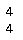
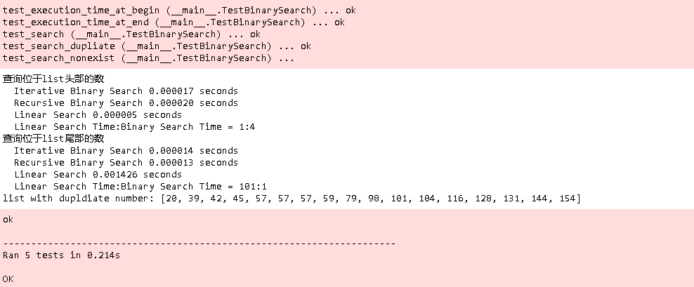
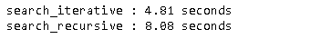
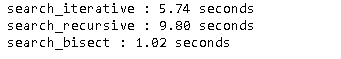
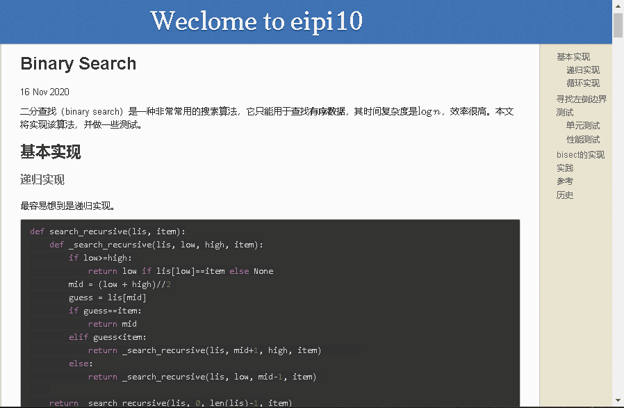

二分查找（binary search）是一种非常常用的搜索算法，它只能用于查找**有序数据**，其时间复杂度是$\log n$，效率很高。本文将实现该算法，并做一些测试。

## 基本实现

### 递归实现

最容易想到是递归实现。

~~~python
def search_recursive(lis, item):
    def _search_recursive(lis, low, high, item):
        if low>=high: 
            return low if lis[low]==item else None
        mid = (low + high)//2 
        guess = lis[mid]
        if guess==item:
            return mid
        elif guess<item:
            return _search_recursive(lis, mid+1, high, item)        
        else:
            return _search_recursive(lis, low, mid-1, item) 
    
    return _search_recursive(lis, 0, len(lis)-1, item)

list = [1, 3, 5, 7, 9, 11, 13, 15]
assert search_recursive(list, 5)==2
assert search_recursive(list, 16) is None
assert search_recursive(list, 0) is None
assert search_recursive(list, 8) is None
~~~

### 循环实现

~~~python
def search_iterative(lis, item):
    low = 0
    high = len(lis)-1
    
    while low<=high:        
        mid = low + (high - low)//2 
        guess = lis[mid]  
        if guess==item:
            return mid
        elif guess<item:
            low = mid + 1       
        else:
            high = mid - 1
    
    return None

list = [1, 3, 5, 7, 9, 11, 13, 15]
assert search_recursive(list, 5)==2
assert search_recursive(list, 16) is None
assert search_recursive(list, 0) is None
assert search_recursive(list, 8) is None
~~~

注意上面代码中第六行，其实也可以采用`mid = (high + low)//2`，但这种方式的隐患是，当low，high非常大的时候，可能产生溢出。

## 寻找左侧边界

上面两小节，用递归和循环实现了二分查找，但当list中有数据重复的时候，返回的值可能不是我们所希望的。比如：

~~~python
list = [1, 3, 5, 5, 5, 7, 9, 11, 13, 15]
print(search_iterative(list_with_dup, 5))
print(search_recursive(list_with_dup, 5))
~~~

上面的返回值是4，如果我们想要返回最左边的5的位置，算法修改如下。首先看递归查找。

~~~python
def search_recursive(lis, item):
    def _search_recursive(lis, low, high, item):
        if low>=high: 
            return low if lis[low]==item else None
        mid = (low + high)//2 
        guess = lis[mid]
        if guess==item:
            return _search_recursive(lis, low, mid, item)
        elif guess<item:
            return _search_recursive(lis, mid+1, high, item)        
        else:
            return _search_recursive(lis, low, mid-1, item) 
    
    return _search_recursive(lis, 0, len(lis)-1, item)

list = [1, 3, 5, 5, 5, 7, 9, 11, 13, 15]
assert search_recursive(list, 5)==2
assert search_recursive(list, 16) is None
assert search_recursive(list, 0) is None
assert search_recursive(list, 8) is None
~~~

然后是循环查找。

~~~python
def search_iterative(lis, item):
    low = 0
    high = len(lis)-1
    
    while low<high:
        mid = (low + high)//2 
        guess = lis[mid]  
        if guess==item:
            high = mid
        elif guess<item:
            low = mid + 1       
        else:
            high = mid - 1
    if lis[low] != item: return None
    return low;

list = [1, 3, 5, 5, 5, 7, 9, 11, 13, 15]
assert search_iterative(list, 5)==2
assert search_iterative(list, 16) is None
assert search_iterative(list, 0) is None
assert search_iterative(list, 8) is None
~~~

## 测试

### 单元测试

~~~python
import random
import time
import unittest

def generate_list(n, first=None, max_dis=20, min_dis=2, seed=1031):
    '''产生一个有序的list。其相邻数的间隔至少是2.'''
    random.seed(seed)
    if first is None:
        list = [random.randint(2, max_dis)]
    else:
        list = [first]
    for i in range(n-1):
        list.append(list[i]+random.randint(2, max_dis))
    return list
        
class TestBinarySearch(unittest.TestCase):
    
    def should_find(self, list, index, search):
        self.assertEqual(index, search(list, list[index]))     
        
    def should_no_find(self, list, item, search):
        self.assertEqual(None, search(list, item))         
        
    def get_search_time(self, list, index, search=None):
        start_time = time.time()
        if search is not None:
            search_index = search(list, list[index]) 
        else: 
            search_index = list.index(list[index])
        self.assertEqual(index, search_index)  
        execution_time = time.time() - start_time
        return execution_time

    def test_search(self):
        list = generate_list(10)
        
        self.should_find(list, 3, search_iterative)
        self.should_find(list, 3, search_recursive)
        
        self.should_find(list, 8, search_iterative)
        self.should_find(list, 8, search_recursive) 
        
        list = generate_list(100)

        self.should_find(list, 10, search_iterative)
        self.should_find(list, 10, search_recursive)        
        
        self.should_find(list, 90, search_iterative)
        self.should_find(list, 90, search_recursive)          
         
    def test_search_nonexist(self):
        list = generate_list(10)
        
        # 测试list构建时，数之间的间隔至少是2，所以下面这些数是找不到的
        self.should_no_find(list, list[3]+1, search_iterative)
        self.should_no_find(list, list[3]+1, search_recursive)
        
        self.should_no_find(list, list[8]+1, search_iterative)
        self.should_no_find(list, list[8]+1, search_recursive)   
        
        list = generate_list(100)

        self.should_no_find(list, list[10]+1, search_iterative)
        self.should_no_find(list, list[10]+1, search_recursive)        
        
        self.should_no_find(list, list[90]+1, search_iterative)
        self.should_no_find(list, list[90]+1, search_recursive)
        
    def test_search_dupliate(self):
        '''测试包含重复数据的list'''
        list = generate_list(5) 
        duplidate = list[-1]
        index = len(list)-1
        list = list + [duplidate]*2 + generate_list(10, first=duplidate+2)
        print('list with dupldiate number: {}'.format(list))
        
        self.should_find(list, index, search_iterative)
        self.should_find(list, index, search_recursive)        

        
    def test_execution_time_at_end(self):
        list = generate_list(100000)
        iterative_time = self.get_search_time(list, len(list)-100, search_iterative) 
        recursive_time = self.get_search_time(list, len(list)-100, search_recursive) 
        linear_time = self.get_search_time(list, len(list)-100)
               

        print("查询位于list尾部的数")
        print("  Iterative Binary Search %f seconds" % (iterative_time))
        print("  Recursive Binary Search %f seconds" % (recursive_time))  
        print("  Linear Search %f seconds" % (linear_time))  
        print("  Linear Search Time:Binary Search Time = %d:1" % (round(linear_time/iterative_time)))  
        
        self.assertTrue(linear_time > iterative_time)
        self.assertTrue(linear_time > recursive_time)
        

    def test_execution_time_at_begin(self):
        list = generate_list(100000)
        iterative_time = self.get_search_time(list, 100, search_iterative) 
        recursive_time = self.get_search_time(list, 100, search_recursive) 
        linear_time = self.get_search_time(list, 100)
       
        print("查询位于list头部的数")
        print("  Iterative Binary Search %f seconds" % (iterative_time))
        print("  Recursive Binary Search %f seconds" % (recursive_time))  
        print("  Linear Search %f seconds" % (linear_time))    
        print("  Linear Search Time:Binary Search Time = 1:%d" % (round(iterative_time/linear_time))) 
        
        self.assertTrue(linear_time < iterative_time)
        self.assertTrue(linear_time < recursive_time)

        
unittest.main(argv=[''], verbosity=2, exit=False)  
~~~

可以发现，当list长度是100000：

- 查询头部的数，binary search的时间比index函数时间要长。大概是3-4倍的样子
- 查询尾部的数，binary search需要的时间只是index函数的百分之一，而且list越长，binary search查询的优势更大。
- binary search性能稳定，而index函数性能不稳定。

### 性能测试

下面来比较以下循环实现和递归实现的性能。

~~~python
import timeit

lst_1000000 = generate_list(1000000)
item = lst_1000000[-228]

def run_iterative():
    return search_iterative(lst_1000000, item) 
    
def run_recursive():
    return search_recursive(lst_1000000, item)  

assert run_iterative()==run_recursive()

t1 = timeit.Timer("run_iterative()", setup="from __main__ import run_iterative")
t2 = timeit.Timer("run_recursive()", setup="from __main__ import run_recursive")

print("search_iterative : {:0.2f} seconds".format(t1.timeit(number=1000000)))  
print("search_recursive : {:0.2f} seconds".format(t2.timeit(number=1000000))) 
~~~

可以看出循环还是比递归性能要好不少啊。

## bisect的实现

python内置的包bisect实现上文中的二分查找。其对应代码如下。

~~~python
def bisect_left(a, x, lo=0, hi=None):
    """Return the index where to insert item x in list a, assuming a is sorted.

    The return value i is such that all e in a[:i] have e < x, and all e in
    a[i:] have e >= x.  So if x already appears in the list, a.insert(x) will
    insert just before the leftmost x already there.

    Optional args lo (default 0) and hi (default len(a)) bound the
    slice of a to be searched.
    """

    if lo < 0:
        raise ValueError('lo must be non-negative')
    if hi is None:
        hi = len(a)
    while lo < hi:
        mid = (lo+hi)//2
        if a[mid] < x: lo = mid+1
        else: hi = mid
    return lo
~~~

除了细微处不同外，基本逻辑是非常相似的。当然，毫无疑问也通过了基本的测试。

~~~python
from bisect import bisect

def search_bisect(lst, x):
    i = bisect_left(lst, x)
    if i != len(lst) and lst[i] == x:
        return i
    return None
    
list = [1, 3, 5, 5, 5, 7, 9, 11, 13, 15]
assert search_bisect(list, 5)==2
assert search_bisect(list, 16) is None
assert search_bisect(list, 0) is None
assert search_bisect(list, 8) is None
~~~

下面来看看性能比较。

~~~python
def run_bisect():
    search_bisect(lst_1000000, item)  
    
t3 = timeit.Timer("run_bisect()", setup="from __main__ import run_bisect")

print("search_iterative : {:0.2f} seconds".format(t1.timeit(number=1000000)))  
print("search_recursive : {:0.2f} seconds".format(t2.timeit(number=1000000))) 
print("search_bisect : {:0.2f} seconds".format(t3.timeit(number=1000000))) 
~~~

可以发现bisect的时间只要1秒左右，真的快的太多了。即使吧`search_interative`改成和bisect相同的实现，性能还是无法提高。其原因在于bisect模块已经预编译成了c代码，所以快得多。

## 实践

下面来实际例子中应用binary search。在浏览本文的时候，如果滚动鼠标的滚轮，会发现右边的目录栏中也会有变化，它会同步显示当前浏览内容所属的目录。这个效果简单好用，能够帮助读者定位所看的内容。它的实现也很简单，当滚动滚轮时，对于当前内容所在的目录，添加一个特别样式，同时把其它的目录恢复到初始样式。具体步骤下：

1. 当滚轮滚动时，获取滚动条当前的位置。假设是250。

2. 再获取内容区域所有目录的位置。假设这个队列是[100, 200, 300, 400, 500, 600]。

3. 把滚动条位置和目录的位置进行比较，判断出当前滚动条位置属于哪一个目录。

   很明显，250这个位置，属于200这个位置的目录。这相当于把250插入到队列中，然后获取它前一个item的位置。因此，需要对上面的binary_search做一些修改。

   - 无论是否找到，都需要返回能插入的位置。
   - 为了获取所属目录，插入的位置还需要再减去1，

4. 对于当前内容所在的目录，添加一个特别样式，同时把其它的目录恢复到初始样式。

下面是上面逻辑的JavaScript实现代码。

~~~javascript
var binary_search = function(x, item) {
    low = 0
    high = x.length-1
    while (low<high){
        mid = parseInt((low + high)/2)
        if (x[mid]==item) {
            high = mid        
        } else if (x[mid]>item) {
            high = mid-1                             
        } else {
            low = mid+1
        }
    }  
    
    if (x[low]>item) return low -1
    return low
}

var  locate_catalog = function(){
  // 获取内容区域所有目录  
  var headers = $('section h2, section h3');  
  // 获取右边区域的所有目录
  var catalog = $('nav ul li a');    
    
  // 获取当前滚动条所在位置。其中+120是为了添加header区域所占空间。
  var scroll_height = $(window).scrollTop()+120;
  var positions = [];
  // 获得内容区域的目录所在的位置
  for(let i =0;i<headers.length;i++){
    positions[i] =  $(headers[i]).offset().top
  }
    
  // 运用binary search查找当前滚动条所在位置，属于哪个目录。
  var index = binary_search(positions, scroll_height) 
  // 把右边区域的所有目录恢复默认样式
  catalog.removeClass('active'); 
  if (index >= 0) {
    // 在右边区域，对当前内容所在目录添加样式，highlight显示。  
    $(catalog[index]).addClass('active');      
  }    
}

$(function() {
  /*绑定滚动事件 */   
  $(window).bind('scroll', locate_catalog);   
});
~~~

## 参考

- [binary_search](https://github.com/egonSchiele/grokking_algorithms/tree/master/01_introduction_to_algorithms/python)

- [二分查找细节详解](https://leetcode-cn.com/problems/binary-search/solution/er-fen-cha-zhao-xiang-jie-by-labuladong/)

- [Python 二分查找与 bisect 模块](http://kuanghy.github.io/2016/06/14/python-bisect)

- [数组二分查找算法](https://docs.python.org/zh-cn/3.6/library/bisect.html)

## 历史

- 2020-11-16：初始版本。
- 2020-12-05：新增binary search的实践。