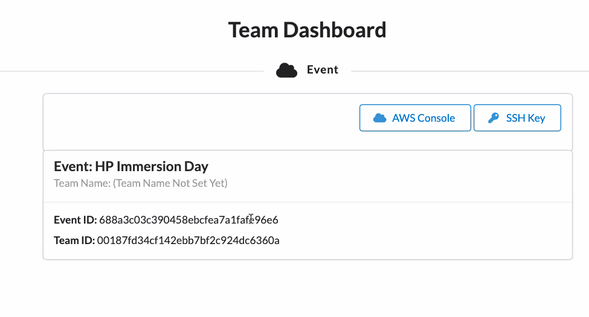
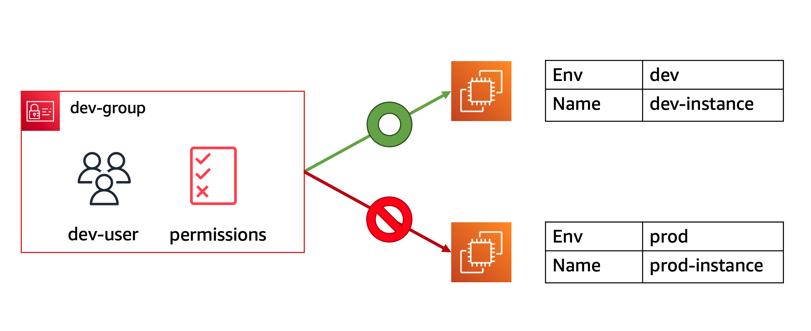
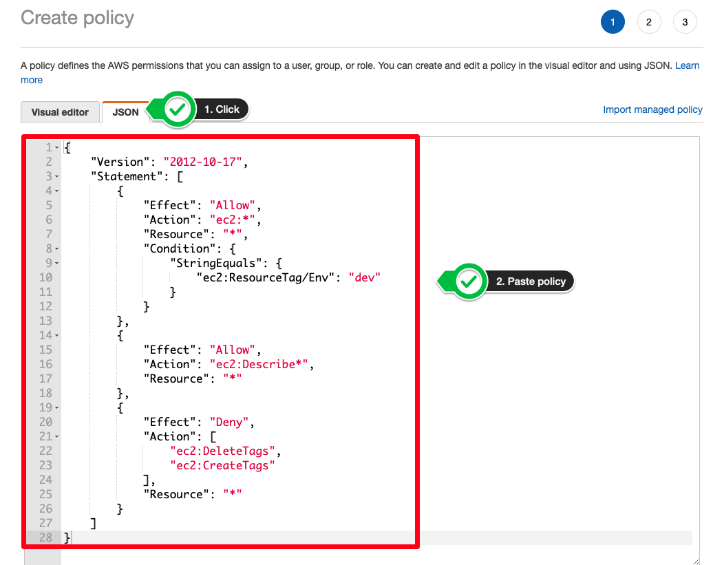
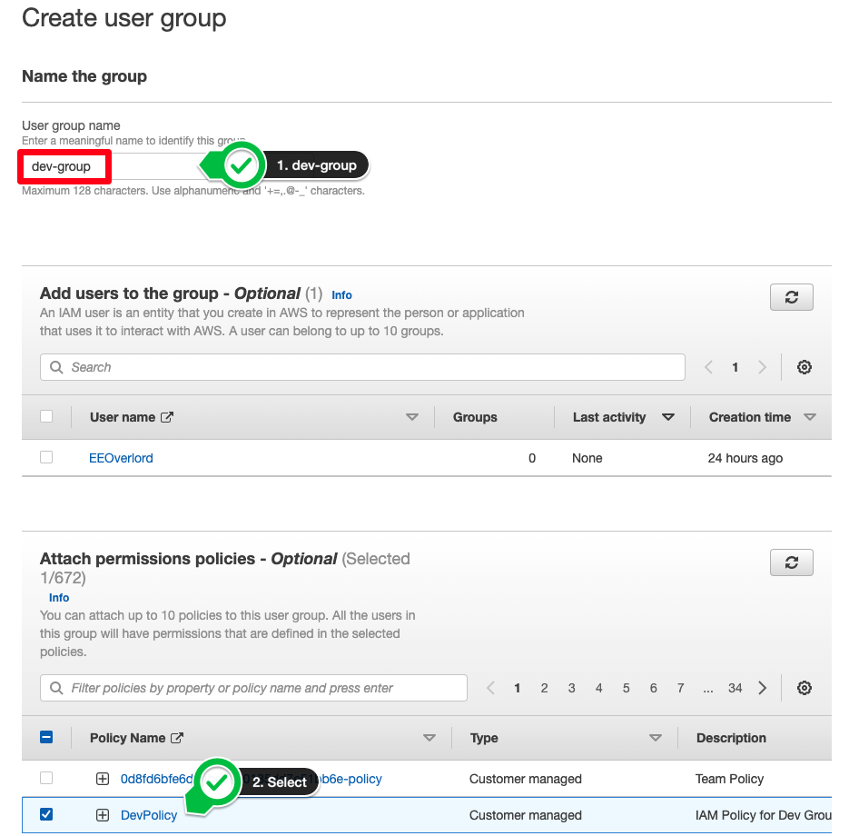
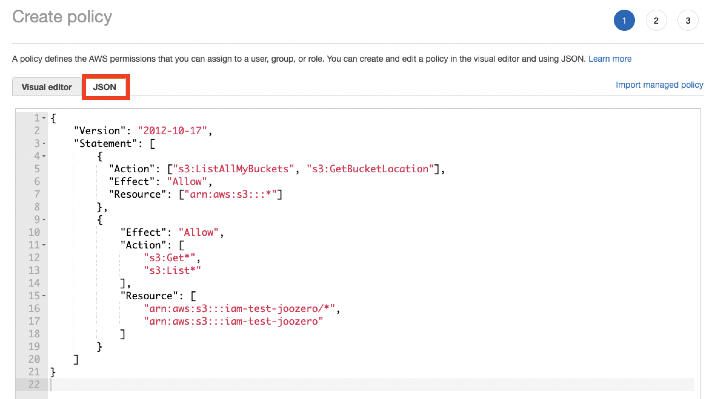
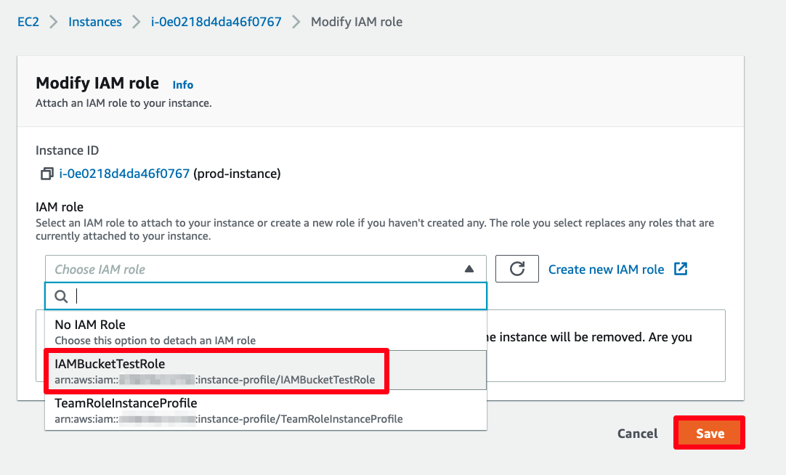

# AWS Immersion Day

## Login Training Environment

https://dashboard.eventengine.run/

Event Hash: 0787-1246d23924-e7

## [EC2 Linux Hands on Lab](https://catalog.us-east-1.prod.workshops.aws/workshops/f3a3e2bd-e1d5-49de-b8e6-dac361842e76/en-US/basic-modules/10-ec2/ec2-linux)

- 创建Linux实例
- 登录实例

## [EC2 Windows Hands on Lab](https://catalog.us-east-1.prod.workshops.aws/workshops/f3a3e2bd-e1d5-49de-b8e6-dac361842e76/en-US/basic-modules/10-ec2/ec2-windows)

- 创建Windows实例

- 登录实例

- 设置Elastic IPs

  Elastic IP地址是AWS提供的静态IPv4地址。它们与您的AWS账户关联,而不是与某个实例关联。您可以将Elastic IP地址快速地重新映射到另一个实例上。Elastic IP地址的主要特点有:

  • 它是IPv4地址。

  • 它是静态的 - 一旦分配给您的账户,它就不会变化。

  • 您可以根据需要将其映射到AWS上的实例上,映射和解除映射都只需要几分钟时间。

  • 您的Elastic IP地址与您的账户关联,而不与任何特定的实例关联。

  • 如果您关闭实例,Elastic IP地址仍然会与您的账户关联,以便您将来再次使用。

  • 您可以对Elastic IP地址设置反向DNS和DNS名称。

  • 您需要为使用Elastic IP地址付费 - 费用在未关联的时间开始计算。

  Elastic IP地址常见的使用场景有:

  • 使用Elastic IP地址来屏蔽实例故障和中断。当实例出现问题时,可以快速将Elastic IP remap到新实例上。

  • 在实例之间移动Elastic IP地址以实现实例切换。例如,将流量从旧实例切换到新实例。

  • 使用Elastic IP地址来隐藏实例故障和维护活动。可以在可用的实例之间快速移动IP地址。

  • 使用Elastic IP地址来提供静态IP,同时仍然保留重新映射到其他实例的灵活性。

  • 与处于VPC之外的实例进行通信。可以将Elastic IP地址与VPC外的实例关联,实现跨网络通信。

  总之,Elastic IP地址为AWS实例提供了静态的IPv4地址,同时又具有高度的灵活性,可以根据需要快速地重新映射到其他实例上。这使其成为屏蔽实例故障、实现实例切换和维护隐私的有力工具。

## [VPC Hands on Lab](https://catalog.us-east-1.prod.workshops.aws/workshops/f3a3e2bd-e1d5-49de-b8e6-dac361842e76/en-US/basic-modules/20-vpc/vpc)

- VPC
  - subnet
  - 路由表

## AWS Artifact

AWS Artifact 是 AWS 推出的官方工具,用于帮助客户下载和管理与 AWS 服务相关的合规性和凭证文档。使用 AWS Artifact,您可以更轻松地审计 AWS 服务的安全性和合规性。AWS Artifact 提供以下主要功能:

1. 下载 AWS 服务的第三方审计报告、认证和合规性报告。这些报告可以证明 AWS 服务符合诸如SOC、ISO 和PCI DSS 等安全标准。
2. 下载 AWS 服务的信任documents,如ISO认证、SOC 2报告和PCI评估报告等。
3. 快速搜索和过滤报告,找到您需要的证明文件。
4. 按 AWS 服务、报告类型或合规框架过滤报告。
5. 将下载的报告保存至docs文件夹进行管理和审计。
6. 订阅报告通知,当新的或已更新的报告可用时接收通知。
7. 通过AWS管理控制台使用AWS Artifact,无需额外付费。

总之,AWS Artifact 提供了一个管理和审计AWS服务相关合规性、审计和认证文件的统一平台。使用AWS Artifact,您可以更方便地获取证明AWS服务安全可靠和符合行业标准的第三方审核报告。如果您的公司需要审核公有云服务的安全性和合规性,AWS Artifact 无疑是一个很有价值的工具。 I希望这个概览能帮助您进一步了解AWS Artifact 的功能和价值。

- https://aws.amazon.com/artifact/

- Video https://www.youtube.com/watch?v=O307zdIOmWo

## [Security - AWS IAM](https://catalog.us-east-1.prod.workshops.aws/workshops/f3a3e2bd-e1d5-49de-b8e6-dac361842e76/en-US/basic-modules/30-iam/iam)

### User Group: for user

- Policy
- User

示例中演示了，通过policy，某个用户组下所有用户只能对dev标记（tag）的ec2实例拥有完整权限，不能对其他ec2实例进行操作，比如重启实例，操作实例。

### Role: for resource 

- Policy

例中演示了，通过policy，使得EC2实例能够查看Bucket列表，但只对其中的一个Bucket能够查看其中的内容。

Amazon Elastic File System

Amazon Elastic File System(Amazon EFS)是一种弹性的文件存储服务,适用于AWS云计算环境。它提供了一种简单的方式来设置和缩放文件系统,在多个实例之间共享文件数据。
Amazon EFS的主要特点如下:
• 它支持弹性存储 - 文件系统可以在需要时自动扩展到PB级的存储量。
• 它支持多并发性 - 文件系统可以同时由上千台Amazon EC2实例访问。
• 它支持多可用区 - 文件系统可以跨越多个可用区,提供可用性和故障转移能力。
• 它支持强一致性 - Amazon EFS文件系统提供POSIX一致性语义,例如文件锁和文件修改时间。
• 它非常低延迟和高吞吐量 - Amazon EFS针对许多并发读写情况进行了优化。
• 它具有生命周期管理功能 - 您可以使用生命周期管理策略来自动存档或删除不常访问的文件。
• 它自动备份文件 - 文件系统自动执行完整备份,允许您随时恢复文件系统。
• 它可以在EC2实例和AWS Lambda函数之间共享文件。
Amazon EFS适用于跨多个实例共享文件数据的许多用例,例如:
• 设计和工程应用(CAD/CAM)
• 代码仓库和版本控制
• 网页服务器日志和文件
• 媒体处理,图像和视频编辑
• 在大数据分析上共享 intermediates 数据和结果
• 使用AWS Lambda访问共享的配置或其他数据
总之,Amazon EFS为在AWS云上运行的应用程序提供轻松的文件存储服务。它允许在多个实例和服务之间共享PB级的文件数据,具有强大的扩展性、高度的并发性和强一致性。

## [Amazon S3 Hands-On Lab](https://catalog.us-east-1.prod.workshops.aws/workshops/f3a3e2bd-e1d5-49de-b8e6-dac361842e76/en-US/basic-modules/60-s3/s3)