## 技巧

### Data Frame 重新排序

~~~python
import pandas as pd
df = pd.DataFrame({'num_legs': [2, 4, 8, 0, 6],
                   'num_wings': [2, 0, 0, 0, 2],
                   'num_specimen_seen': [10, 2, 1, 8, 6]},
                  index=['falcon', 'dog', 'spider', 'fish', 'white ant'])
display(df)
display(df.sample(frac=1))          # 所有记录完全重新排序
display(df.sample(frac=0.6))        # 随机获取60%的记录
display(df.sample(n=2))             # 随机2条记录
~~~

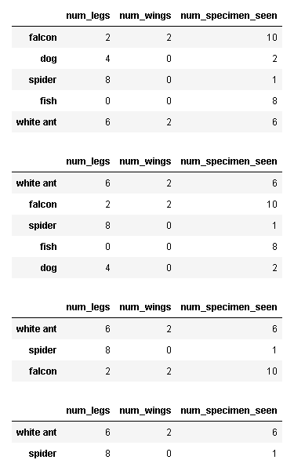

### \x与\u编码

- \x：只是 16 进制的意思，后边跟两位，则表示单字节编码；

- \d：十进制；

- \o：八进制；

- \u：unicode 码；

  一般其后跟 4 个 16 进制数，因此，一般为 unicode-16

### 将Unicode文本标准化 - unicodedata

参见https://python3-cookbook.readthedocs.io/zh_CN/latest/c02/p09_normalize_unicode_text_to_regexp.html

你正在处理Unicode字符串，需要确保所有字符串在底层有相同的表示。

在Unicode中，某些字符能够用多个合法的编码表示。下面的两个字符串打印出来相同，但采用不同的编码。

~~~python
s1 = 'Spicy Jalape\u00f1o'
s2 = 'Spicy Jalapen\u0303o'
print(s1)
print(s2)
print(s1 == s2)
print(len(s1))
print(len(s2))
~~~

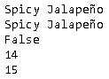

在需要比较字符串的程序中使用字符的多种表示会产生问题。 为了修正这个问题，你可以使用unicodedata模块先将文本标准化。

~~~python
import unicodedata
t1 = unicodedata.normalize('NFC', s1)
t2 = unicodedata.normalize('NFC', s2)
print(t1 == t2)
print(ascii(t1))

t3 = unicodedata.normalize('NFD', s1)
t4 = unicodedata.normalize('NFD', s2)
print(t3 == t4)
print(ascii(t3))
~~~

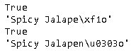

`normalize()` 第一个参数指定字符串标准化的方式。 NFC表示字符应该是整体组成(比如可能的话就使用单一编码)，而NFD表示字符应该分解为多个组合字符表示。

unicodedata.category() 返回一个字符在UNICODE里分类的类型。

~~~shell
print(unicodedata.category('\u0303'))
print(unicodedata.category('京'))
print(unicodedata.category('M'))
print(unicodedata.category('m'))
print(unicodedata.category('!'))
~~~

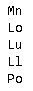

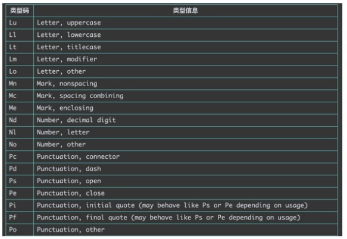

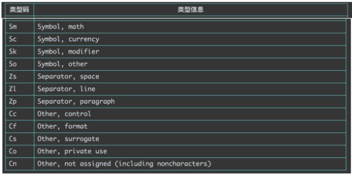

### sklearn 的 [classification_report](https://scikit-learn.org/stable/modules/generated/sklearn.metrics.classification_report.html)

- y_true 为样本真实标记，y_pred 为样本预测标记
- support：某类别在测试数据中的样本个数
- macro avg：每个类别评估指标未加权的平均值，比如准确率的 macro avg，`(0.50+0.00+1.00)/3=0.5`
- weighted avg：加权平均，比如第一个值的计算方法，`(0.50*2 + 0.0*1 + 1.0*3)/6 = 0.666...`

~~~python
from sklearn.metrics import classification_report
from pprint import pprint
y_true = [0, 0, 1, 2, 2, 2]
y_pred = [0, 1, 0, 2, 2, 1]
target_names = ['class 0', 'class 1', 'class 2']
print(classification_report(y_true, y_pred, target_names=target_names))
pprint(classification_report(y_true, y_pred, target_names=target_names, output_dict=True))
~~~

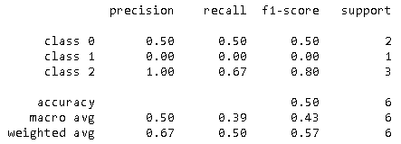

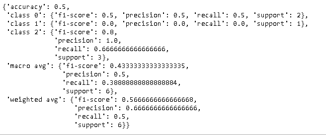

也可以这样来得到，麻烦一些。

~~~python
from sklearn.metrics import accuracy_score, f1_score, precision_recall_fscore_support
def score(predictions, labels):
    accuracy = accuracy_score(labels, predictions)
    f1_score_macro = f1_score(labels, predictions, average='macro')
    f1_score_micro = f1_score(labels, predictions, average='micro')
    score = precision_recall_fscore_support(labels, predictions)
    return accuracy, f1_score_macro, f1_score_micro, score

accuracy, f1_score_macro, f1_score_micro, score = score(y_pred, y_true)
print(accuracy, f1_score_macro, f1_score_micro)
print(np.array(score).T)
~~~

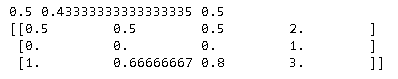

### dataframe.to_dict

格式`如`有：

- `dict` (default) : dict like {column -> {index -> value}}
- `list` : dict like {column -> [values]}
- `series` : dict like {column -> Series(values)}
- `split` : dict like {index -> [index], columns-> [columns], data -> [values]}
- `records` : list like [{column -> value}, … , {column -> value}]
- `index` : dict like {index -> {column -> value}}

~~~python
import pandas as pd

N = 1
df = pd.DataFrame({
    'category': (
        (['apples'] * 2 * N) +
        (['oranges'] * 1 * N) 
    )
})
df['x'] = np.random.randn(len(df['category']))

print('-'*50)
print(df)

for orient in ['dict', 'list', 'series', 'split', 'records', 'index']:    
    print('-'*30, orient, '-'*30)
    pprint(df.to_dict(orient))
~~~

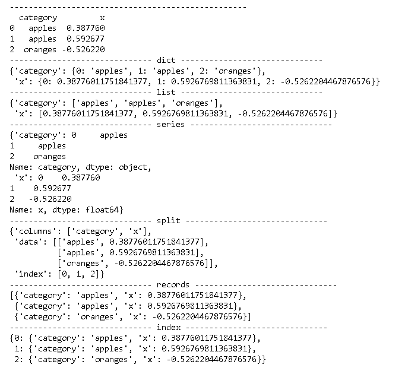

### 稀疏矩阵csr_matrix

Compressed Sparse Row Matrix 压缩稀疏行格式。稀疏矩阵csr_matrix有三种创建方式。其中最后一种有一点难理解，下面将解释。

~~~python
import numpy as np
from scipy.sparse import csr_matrix

m = csr_matrix((3, 4), dtype=np.int8)
print('-'*50)
print(m)
print(m.toarray())

row = np.array([0, 0, 1, 2, 2, 2])
col = np.array([0, 2, 2, 0, 1, 2])
data = np.array([6, 5, 4, 3, 2, 1])
m = csr_matrix((data, (row, col)), shape=(3, 3))
print('-'*50)
print(m)
print(m.toarray())

indptr = np.array([0, 2, 3, 7])
indices = np.array([0, 2, 2, 0, 1, 2, 3])
data = np.array([7, 6, 5, 4, 3, 2, 1])
m = csr_matrix((data, indices, indptr), shape=(3, 4))
print('-'*50)
print(m)
print(m.toarray())
~~~

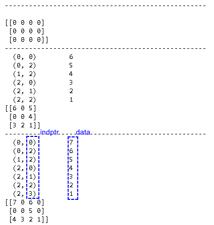

最后一种方式是：**csr_matrix((data, indices, indptr), [shape=(M, N)])**

- data：数据
- indptr：每个数据的列位置
- indices：指每一行数据，在data中开始的编号
  - 第一行：0
  - 第二行：2
  - 第三行：3
  - 结尾：7

### F分布密度图

~~~python
import numpy as np
import matplotlib.pyplot as plt
from scipy import stats

def plot_pdf(dfs):
    plt.figure(figsize=(10, 7))
    x = np.linspace(-1, 5, 100000)    
    for df1, df2  in dfs:
        y1 = stats.f.pdf(x, df1, df2)
        plt.plot(x, y1, label="m={}, n={}".format(df1, df2))   
    plt.ylim(0, 1.5)
    plt.xlim(0, 5)
    plt.legend()
    plt.show()

dfs = [(1, 1), (1, 20), (5, 20), (20, 1), (20, 20)]
plot_pdf(dfs)
~~~

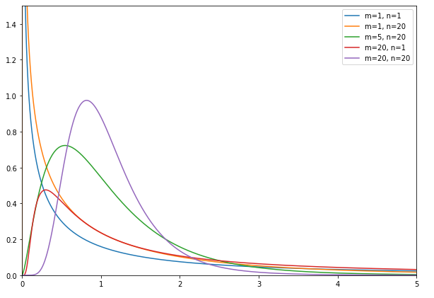

### 给dataframe添加行和列汇总

~~~python
import numpy as np
import pandas as pd
from IPython.display import display

index=['变态', '非变态']
columns=['不定装', '女装', '男装']
df_observed = pd.DataFrame([[150, 200, 400], [350, 500, 1500]], index=index, columns=columns)
display(df_observed)

def show_sum(df):
    s = df.reset_index().melt('index', var_name=' ')
    ct = pd.crosstab(index=s['index'], columns=s.iloc[:,1], values=s.value, 
                     aggfunc='sum', margins=True, margins_name='合计',
                     rownames=[''], 
               ) 
    display(ct)

show_sum(df_observed)
~~~

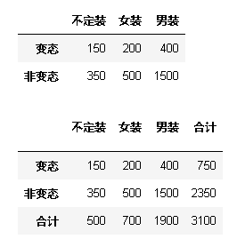

### 显示文件目录树+文件夹和文件删除

~~~python
import os
import shutil

def show_tree(path, max_depth=10, max_num=100):
    def _show_tree(path, depth, max_num, prefix):
        if max_num<=0 or depth>max_depth:
            return max_num
        if depth==1: 
            print(path)
            max_num=max_num-1
        items = os.listdir(path)
        for i, item in enumerate(items):
            if max_num<=0: return max_num
            newitem = path +'/'+ item
            if i==len(items)-1:
                print(prefix  + "└──" + item)            
                new_prefix = prefix+"    "                
            else:
                print(prefix  + "├──" + item)
                new_prefix = prefix+"│   "
            max_num=max_num-1
            if os.path.isdir(newitem):
                max_num = _show_tree(newitem, depth=depth+1, max_num=max_num, prefix=new_prefix)         
        return max_num
    _show_tree(path, depth=1, max_num=max_num, prefix="")
        
def create_file(file_path):
    file = open(file_path,'a')
    file.write(file_path)
    file.close()
                                
def prepare(base_path):
    
    if os.path.exists(base_path):
        shutil.rmtree(base_path)
    os.makedirs(base_path)
    create_file(os.path.join(base_path, "file01.txt"))
    create_file(os.path.join(base_path, "file02.txt"))
    
    folder1 = os.path.join(base_path, "folder1")
    folder2 = os.path.join(base_path, "folder2")
    folder3 = os.path.join(base_path, "folder3")
    
    os.makedirs(folder1)
    os.makedirs(folder2)
    os.makedirs(folder3)
    
    create_file(os.path.join(folder1, "file11.txt"))
    
    create_file(os.path.join(folder2, "file21.txt"))
    create_file(os.path.join(folder2, "file22.txt"))    
    
    folder30 = os.path.join(folder3, "folder30")
    os.makedirs(folder30)
    
    create_file(os.path.join(folder30, "file301.txt"))      
    create_file(os.path.join(folder30, "file302.txt"))     
    
    create_file(os.path.join(folder3, "file31.txt"))
    create_file(os.path.join(folder3, "file32.txt"))      
    create_file(os.path.join(folder3, "file33.txt")) 
    
    folder34 = os.path.join(folder3, "folder34")
    os.makedirs(folder34)
    
    create_file(os.path.join(folder34, "file341.txt"))      
    create_file(os.path.join(folder34, "file342.txt"))     

    
base_path = 'tmp'   
prepare(base_path)

print('-'*50)
print('显示目录树')
show_tree(base_path) 

print('-'*50)
print('显示最多11个文件或目录')
show_tree(base_path, max_num=11)

print('-'*50)
print('删除一个目录和一个文件')
shutil.rmtree(os.path.join(base_path, "folder2"))   # 删除非空目录
os.remove(os.path.join(base_path, "folder3/file32.txt"))	# # 删除文件
show_tree(base_path) 

print('-'*50)
print('显示两层目录树')
show_tree(base_path, max_depth=2)
~~~

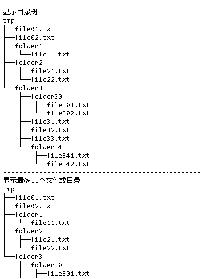

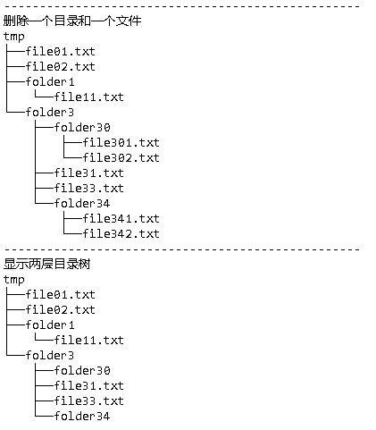

### 获得jupyter notebook的列表

~~~python
#!/usr/bin/env python3

import json
import os
import os.path
import posixpath
import subprocess
import pandas as pd
import psutil
import requests
from IPython.display import display

def show_notebooks_table(host, port):
    """Show table with info about running jupyter notebooks.

    Args:
        host: host of the jupyter server.
        port: port of the jupyter server.

    Returns:
        DataFrame with rows corresponding to running notebooks and following columns:
            * index: notebook kernel id.
            * path: path to notebook file.
            * pid: pid of the notebook process.
            * memory: notebook memory consumption in percentage.
    """
    pd.set_option('display.max_colwidth', 300)
    
    notebooks = get_running_notebooks(host, port)
    prefix = long_substr([notebook['path'] for notebook in notebooks])
    df = pd.DataFrame(notebooks)
    df = df.set_index('kernel_id')
    df.index.name = prefix
    df.path = df.path.apply(lambda x: x[len(prefix):])
    df['pid'] = df.apply(lambda row: get_process_id(row.name), axis=1)
    # same notebook can be run in multiple processes
    df = expand_column(df, 'pid')
    df['memory'] = df.pid.apply(memory_usage_psutil)
    df['cpu'] = df.pid.apply(cpu_usage_psutil)
    df['num_threads'] = df.pid.apply(num_threads_psutil)    
    df = df.sort_values('memory', ascending=False)
    df.index = range(1, len(df)+1)
    return df

def get_running_notebooks(host, port, password='xxw'):
    """
    Get kernel ids and paths of the running notebooks.

    Args:
        host: host at which the notebook server is listening. E.g. 'localhost'.
        port: port at which the notebook server is listening. E.g. 8888.
            
    Returns:
        list of dicts {kernel_id: notebook kernel id, path: path to notebook file}.
    """
        
    BASE_URL = 'http://{0}:{1}/'.format(host, port)
        
    # Get the cookie data
    s = requests.Session()
    url = BASE_URL + 'login?next=%2F'
    resp = s.get(url)
    xsrf_cookie = resp.cookies['_xsrf']

    # Login with the password
    params = {'_xsrf': xsrf_cookie, 'password': password}
    res = s.post(url, data=params)

    # Find which kernel corresponds to which notebook
    # by querying the notebook server api for sessions
    url = posixpath.join(BASE_URL, 'api', 'sessions')
    ret = s.get(url)
    #print('Status code:', ret.status_code)

    # Get the notebook list
    res = json.loads(ret.text)
    notebooks = [{'kernel_id': notebook['kernel']['id'],
                  'path': notebook['notebook']['path']} for notebook in res]
    return notebooks

def get_process_id(name):
    """Return process ids found by (partial) name or regex.

    Source: https://stackoverflow.com/a/44712205/304209.
    >>> get_process_id('kthreadd')
    [2]
    >>> get_process_id('watchdog')
    [10, 11, 16, 21, 26, 31, 36, 41, 46, 51, 56, 61]  # ymmv
    >>> get_process_id('non-existent process')
    []
    """
    child = subprocess.Popen(['pgrep', '-f', name], stdout=subprocess.PIPE, shell=False)
    response = child.communicate()[0]
    return [int(pid) for pid in response.split()]

def memory_usage_psutil(pid=None):
    """Get memory usage percentage by current process or by process specified by id, like in top.

    Source: https://stackoverflow.com/a/30014612/304209.

    Args:
        pid: pid of the process to analyze. If None, analyze the current process.

    Returns:
        memory usage of the process, in percentage like in top, values in [0, 100].
    """
    if pid is None:
        pid = os.getpid()
    process = psutil.Process(pid)
    return round(process.memory_percent(),3)

def cpu_usage_psutil(pid=None):
    """Get cpu usage percentage by current process or by process specified by id, like in top.

    Source: https://stackoverflow.com/a/30014612/304209.

    Args:
        pid: pid of the process to analyze. If None, analyze the current process.

    Returns:
        cpu usage of the process, in percentage like in top, values in [0, 100].
    """
    if pid is None:
        pid = os.getpid()
    process = psutil.Process(pid)
    return round(process.cpu_percent(),3)

def num_threads_psutil(pid=None):
    """Get num_threads by current process or by process specified by id, like in top.

    Source: https://stackoverflow.com/a/30014612/304209.

    Args:
        pid: pid of the process to analyze. If None, analyze the current process.

    Returns:
        num_threads of the process
    """
    if pid is None:
        pid = os.getpid()
    process = psutil.Process(pid)
    return process.num_threads()

def long_substr(strings):
    """Find longest common substring in a list of strings.

    Source: https://stackoverflow.com/a/2894073/304209.

    Args:
        strings: list of strings.

    Returns:
        longest substring which is found in all of the strings.
    """
    substr = ''
    if len(strings) > 1 and len(strings[0]) > 0:
        for i in range(len(strings[0])):
            for j in range(len(strings[0])-i+1):
                if j > len(substr) and all(strings[0][i:i+j] in x for x in strings):
                    substr = strings[0][i:i+j]
    return substr

def expand_column(dataframe, column):
    """Transform iterable column values into multiple rows.

    Source: https://stackoverflow.com/a/27266225/304209.

    Args:
        dataframe: DataFrame to process.
        column: name of the column to expand.

    Returns:
        copy of the DataFrame with the following updates:
            * for rows where column contains only 1 value, keep them as is.
            * for rows where column contains a list of values, transform them
                into multiple rows, each of which contains one value from the list in column.
    """
    tmp_df = dataframe.apply(
        lambda row: pd.Series(row[column]), axis=1).stack().reset_index(level=1, drop=True)
    tmp_df.name = column
    return dataframe.drop(column, axis=1).join(tmp_df)

df = show_notebooks_table('15.15.166.35', 18888)
display(df)
~~~

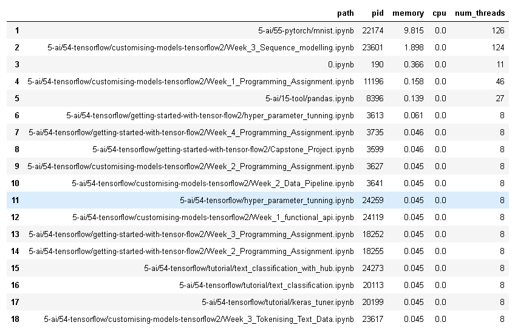

### 获取进程信息

~~~python
import psutil

pids = psutil.pids() 
p = psutil.Process(pids[0])

print('进程id:', p.pid)
print('进程名称:', p.name())   # 
print('exe路径:', p.exe())
print('工作目录:', p.cwd())
print('启动的命令行:', p.cmdline())
print('父进程ID:', p.ppid())
print('父进程:', p.parent())
print('状态:', p.status())
print('用户名:', p.username())
print('创建时间:', p.create_time())
print('使用的内存:', p.memory_info())
print('内存使用比例:', p.memory_percent())
print('CPU数量:', p.cpu_num())
print('CPU使用比例:', p.cpu_percent())
print('使用的CPU时间:', p.cpu_times())
print('打开的文件:', p.open_files())
print('线程数量:', p.num_threads())

print(dir(p))
~~~

内存：

- `rss`是驻留集大小，它是进程使用的实际物理内存
- `vms`是虚拟内存大小，它是进程使用的虚拟内存

### 几种数据结构

dict, list和tuple是python中非常常用的数据结构。

~~~ python
a = {'a1':3, 'a2':4}
b = (3, 4)
c = [3, 4]

print(type(a), a)
print(type(b), b)
print(type(c), c)
~~~

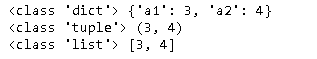

### 参数传递

参见[python函数的4种参数类型](https://blog.csdn.net/lijing742180/article/details/94169446)

有四种方式。

#### 位置实参

按照参数位置，依次传递参数，这是最普通的方式。

~~~python
def add(a, b):
    print(a + b)

add(3, 9)
~~~

#### 关键字实参

按关键字传递传递参数，顺序不需要按照函数定义的顺序。

~~~python
def add(a, b):
    print(a + b)

add(b=3, a=9)
~~~

#### 缺省参数

~~~python
def add(a, b=3):
    print(a + b)

add(9)
~~~

#### 多值参数

当参数个数不确定时，可以使用多值参数，它包括两种类型：

- 元组（tuple）参数： `*args`
- 字典（dict）参数：`**kwargs`

多个参数放置顺序是：**位置实参，缺省参数， 元组参数，字典参数。**一般来说在一个函数中 元组参数，字典参数不会同时出现。

##### 元组参数

~~~python
def add(a, b=3, *args):
    print('='*50)
    print('a', type(a), a)
    print('b', type(a), b)
    print('args', type(args), args)  
        

add(1, 11, 12, 13)

lst = [11, 12, 13]
add(1, *lst)        	# 注意11被分给了b，这种情况下缺省参数失去了意义
add(1, *lst, 14, 15)  	# 有些混乱，避免这样来调用

#add(1, b=4, *lst)  # 会报错： add() got multiple values for argument 'b'
~~~

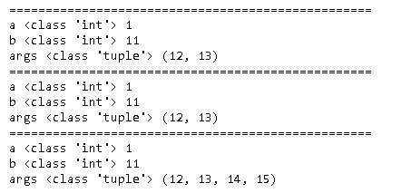

##### 字典参数

~~~python
def add(a, b=3, **kwargs):
    print('='*50)
    print('a', type(a), a)
    print('b', type(a), b)
    print('kwargs', type(kwargs), kwargs)  

add(1, c=21, d=22, e=23)
add(1, 4, **dct)
add(1, b=4, **dct)
add(1, **dct)

# 下面几种情况有些混乱，避免这样来调用
add(1, **dct, b=4)
add(1, **dct, f=4)
add(1, f=4, **dct)
add(1, f=4, **dct, b=4, g=4)
~~~

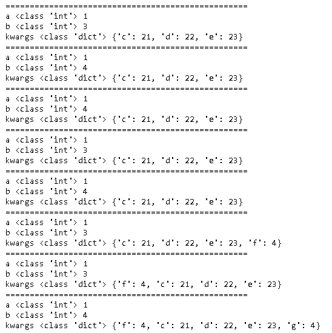

### 类和函数注释规范

参见：

- [Python类和方法注释规范](https://blog.csdn.net/lly1122334/article/details/80733908 )

- [Google 开源项目: Python 风格指南](http://zh-google-styleguide.readthedocs.io/en/latest/google-python-styleguide/python_style_rules/#comments)

 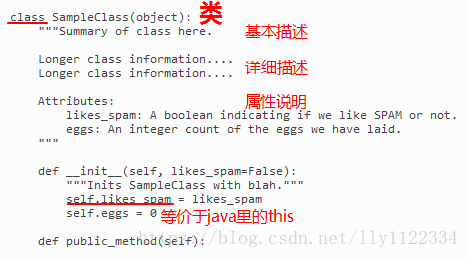 

 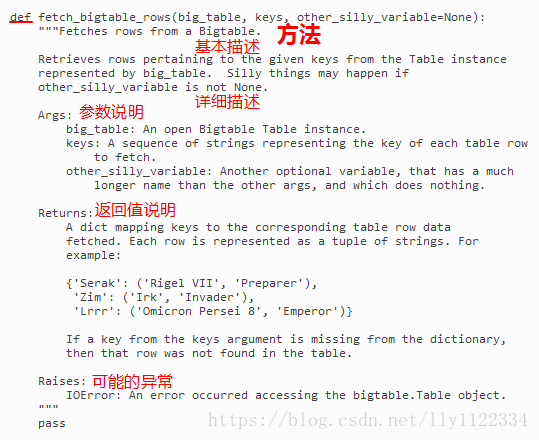 

### Python项目示范目录结构

参见

- [structuring-your-project](https://docs.python-guide.org/writing/structure/#structuring-your-project)
- [Python Application Layouts: A Reference](https://realpython.com/python-application-layouts/)

~~~
project
├── .gitignore
├── LICENSE
├── README.md
├── requirements.txt
├── setup.cfg
├── setup.py
│
├── data
│   └── input.csv
│   └── output.xlsx
│ 
├── docs
│   └── hello.md
│   └── index.md
│
├── package
│   └── __init__.py
│   └── core.py
│   └── helpers.py
│
└── tests
    ├── conftest.py
    ├── test_init.py
    └── test_something.py
~~~

### Flask

flask repository包括以下内容.

- quickstart
- tutorial
- restfu

### 安装pip

有的时候需要重新安装pip。

~~~shell
curl https://bootstrap.pypa.io/get-pip.py -o get-pip.py
sudo python get-pip.py --no-wheel
~~~

### 从源代码安装Python

首先从https://www.python.org/downloads/选择一个版本下载

~~~shell
wget https://www.python.org/ftp/python/3.6.12/Python-3.6.12.tgz
tar zvxf Python-3.6.12.tgz
cd Python-3.6.12
./configure
make
sudo make install
~~~

> 默认情况下，centos仅仅安装了python2，可以使用上面的方式安装python3，这样对于环境的影响更小。

在python中引入一些包是，有时会报类似下面的错误。这种错误需要安装相应的软件后，再重新编译安装python。

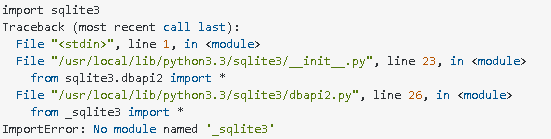

~~~shell
sudo yum install sqlite-devel
cd Python-3.6.12
./configure
make
sudo make install
~~~

### 安装lzma

~~~shell
sudo yum install -y xz-devel
~~~

然后从源代码重新安装python。

