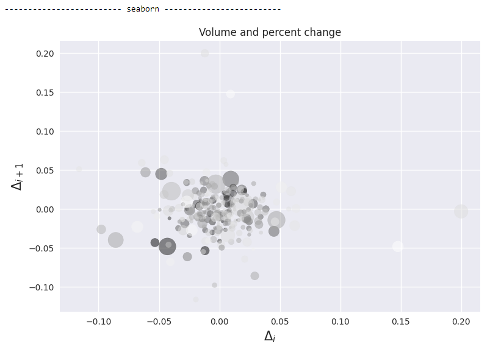

## DataFrame

### GroupBy 聚合（Agg）操作

~~~python
import pandas as pd
import numpy as np 
from IPython.core.display import display

df = pd.DataFrame([['a', 11, 12],
                   ['b', 2, 3],
                   ['a', 5, 6],
                   ['c', 8, 9],
                   ['c', np.nan, np.nan]],
                  columns=['A', 'B', 'C']) 

display(df)

df_group = df.groupby(['A']).agg(count=('A','count' ), avg_b=('B', 'mean'), sum_c=('C', 'mean'))
display(df_group)

display(df_group.reset_index()) # 把group dataframe变成普通dataframe
~~~

### Data Frame 重新排序

~~~python
import pandas as pd
df = pd.DataFrame({'num_legs': [2, 4, 8, 0, 6],
                   'num_wings': [2, 0, 0, 0, 2],
                   'num_specimen_seen': [10, 2, 1, 8, 6]},
                  index=['falcon', 'dog', 'spider', 'fish', 'white ant'])
display(df)
display(df.sample(frac=1))          # 所有记录完全重新排序
display(df.sample(frac=0.6))        # 随机获取60%的记录
display(df.sample(n=2))             # 随机2条记录
~~~

### dataframe.to_dict

格式`如`有：

- `dict` (default) : dict like {column -> {index -> value}}
- `list` : dict like {column -> [values]}
- `series` : dict like {column -> Series(values)}
- `split` : dict like {index -> [index], columns-> [columns], data -> [values]}
- `records` : list like [{column -> value}, … , {column -> value}]
- `index` : dict like {index -> {column -> value}}

~~~python
import pandas as pd

N = 1
df = pd.DataFrame({
    'category': (
        (['apples'] * 2 * N) +
        (['oranges'] * 1 * N) 
    )
})
df['x'] = np.random.randn(len(df['category']))

print('-'*50)
print(df)

for orient in ['dict', 'list', 'series', 'split', 'records', 'index']:    
    print('-'*30, orient, '-'*30)
    pprint(df.to_dict(orient))
~~~

### 给dataframe添加行和列汇总

~~~python
import numpy as np
import pandas as pd
from IPython.display import display

index=['变态', '非变态']
columns=['不定装', '女装', '男装']
df_observed = pd.DataFrame([[150, 200, 400], [350, 500, 1500]], index=index, columns=columns)
display(df_observed)

def show_sum(df):
    s = df.reset_index().melt('index', var_name=' ')
    ct = pd.crosstab(index=s['index'], columns=s.iloc[:,1], values=s.value, 
                     aggfunc='sum', margins=True, margins_name='合计',
                     rownames=[''], 
               ) 
    display(ct)

show_sum(df_observed)
~~~

## matplotlib

### matplotlib中文乱码

~~~python
import matplotlib
import matplotlib.pyplot as plt 

a = ["一月份","二月份","三月份","四月份","五月份","六月份"]
b=[56.01,26.94,17.53,16.49,15.45,12.96]
plt.figure(figsize=(20,8),dpi=80)
plt.bar(range(len(a)),b)
plt.xticks(range(len(a)),a)
plt.xlabel("月份")
plt.ylabel("数量")
plt.title("每月数量")

plt.show()
~~~

解决方法如下。

- 下载SimHei.ttf中文字体。

  https://www.fontpalace.com/font-download/simhei/

- 得到matplotlib配置目录

  ~~~python
  import matplotlib
  import os
  font_path = os.path.join(os.path.dirname(matplotlib.matplotlib_fname()), 'fonts/ttf')
  print(font_path)
  print('-'*50)
  print('\n'.join(os.listdir(font_path)[0:5]))
  !cp /tf/eipi10/SimHei.ttf  {font_path}
  ~~~

  

- 将SimHei.ttf拷贝到上面的目录。

- 更新cache

  ~~~
  rm -fr ~/.cache/matplotlib 
  ~~~

- 重启启动程序。

  ~~~python
  import matplotlib
  import matplotlib.pyplot as plt
  
  plt.rcParams["font.family"]=["SimHei"]
  plt.rcParams["axes.unicode_minus"]=False  #用来正常显示负号
  
  a = ["一月份","二月份","三月份","四月份","五月份","六月份"]
  b=[56.01,26.94,17.53,16.49,15.45,12.96]
  plt.figure(figsize=(20,8),dpi=80)
  plt.bar(range(len(a)),b)
  plt.xticks(range(len(a)),a)
  plt.xlabel("月份")
  plt.ylabel("数量")
  plt.title("每月数量")
  
  plt.show()
  ~~~

  

参考：

- [Add custom fonts to Matplotlib](https://scentellegher.github.io/visualization/2018/05/02/custom-fonts-matplotlib.html)
- [matplotlib图例中文乱码?](https://www.zhihu.com/question/25404709)

### 显示matplotlib支持的所有字体

~~~python
from matplotlib.font_manager import FontManager
mpl_fonts = set(f.name for f in FontManager().ttflist)

for f in sorted(mpl_fonts):
    print(f)
~~~

### 置信椭圆（Confidence Ellipse）展示

假设二维样本属于二元高斯分布，根据高斯分布画置信椭圆

~~~python
import numpy as np
import math
import matplotlib.pyplot as plt
import random
from matplotlib.patches import Ellipse
import matplotlib.transforms as transforms
from sklearn.datasets import make_moons, make_circles, make_swiss_roll

def transfer(m, data, center=True):
    if center==True:     
        center = np.mean(data, axis=1, keepdims=True)
        transfer_data = m.dot((data - center)) + center
    else:
        transfer_data = m.dot(data)
    return transfer_data, m    

def rotate(theta, data, center=True):
    m = np.array([[math.cos(theta), -math.sin(theta)],
                  [math.sin(theta), math.cos(theta)]])
    return transfer(m, data, center)

def scale(s, data, center=True):
    m = np.diag(s)
    return transfer(m, data, center)

def get_circles(n_samples=200, scale_rate=[2, 0.5], angle=15/180*math.pi):
    X, y = make_circles(n_samples, noise=.1, factor=.2, random_state=123)
    X = X + np.array([2, 2])
    # 对X做旋转
    X, _ = scale(scale_rate, X.T, center=False)
    X = X.T    
    X, _ = rotate(angle, X.T, center=False)
    X = X.T
    return X, y

def confidence_ellipse(x, y, ax, n_std=3.0, facecolor='none', **kwargs):
    """
    Create a plot of the covariance confidence ellipse of `x` and `y`

    Parameters
    ----------
    x, y : array_like, shape (n, )
        Input data.

    ax : matplotlib.axes.Axes
        The axes object to draw the ellipse into.

    n_std : float
        The number of standard deviations to determine the ellipse's radiuses.

    Returns
    -------
    matplotlib.patches.Ellipse

    Other parameters
    ----------------
    kwargs : `~matplotlib.patches.Patch` properties
    """
    if x.size != y.size:
        raise ValueError("x and y must be the same size")

    cov = np.cov(x, y)
    
    pearson = cov[0, 1]/np.sqrt(cov[0, 0] * cov[1, 1])
    # Using a special case to obtain the eigenvalues of this
    # two-dimensionl dataset.
    ell_radius_x = np.sqrt(1 + pearson)
    ell_radius_y = np.sqrt(1 - pearson)   
    
    ellipse = Ellipse((0, 0),
        width=ell_radius_x * 2,
        height=ell_radius_y * 2,
        facecolor=facecolor,
        **kwargs)

    # Calculating the stdandard deviation of x from
    # the squareroot of the variance and multiplying
    # with the given number of standard deviations.
    scale_x = np.sqrt(cov[0, 0]) * n_std
    mean_x = np.mean(x)
    

    # calculating the stdandard deviation of y ...
    scale_y = np.sqrt(cov[1, 1]) * n_std
    mean_y = np.mean(y)

    transf = transforms.Affine2D() \
        .rotate_deg(45)    \
        .scale(scale_x, scale_y) \
        .translate(mean_x, mean_y)
    
    ellipse.set_transform(transf + ax.transData)
    return ax.add_patch(ellipse) 
~~~

> 函数confidence_ellipse中，椭圆的生成，并没有去求解特征向量，这或许是二维协方差矩阵的特殊方法吧。下面代码使用特征值核特征向量生成椭圆，等价于上面的逻辑。
>
> ~~~python
> #     eigenvalue, eigenvector = np.linalg.eig(cov)      
> #     ellipse = Ellipse((0, 0),
> #         width=np.sqrt(eigenvalue[0])*2*n_std,
> #         height=np.sqrt(eigenvalue[1])*2*n_std,
> #         facecolor=facecolor,
> #         **kwargs)
> 
> #     degree = math.degrees(math.acos(eigenvector[0, 0]))
> #     transf = transforms.Affine2D() \
> #         .rotate_deg(degree)    \
> #         .translate(mean_x, mean_y)
> ~~~

下面的例子中，分别画出了两个类别数据，各自的2倍标准方差，3倍标准方差的置信椭圆。

~~~python
X, y = get_circles(n_samples=1000, angle=14/180*math.pi)

# Plot the samples using columns 1 and 2 of the matrix
fig, ax = plt.subplots(figsize = (8, 8))

colors = ['red', 'green'] # Define a color palete

ax.scatter(X[:,0], X[:,1], c=[colors[int(k)] for k in y], s = 0.1, marker='*')  # Plot a dot for tweet

X1 = X[y == 1] 
X0 = X[y == 0]

# # Print confidence ellipses of 2 std
confidence_ellipse(X1[:, 0], X1[:, 1], ax, n_std=2, edgecolor='black', label=r'$2\sigma$' )
confidence_ellipse(X0[:, 0], X0[:, 1], ax, n_std=2, edgecolor='orange')

# # Print confidence ellipses of 3 std
confidence_ellipse(X1[:, 0], X1[:, 1],  ax, n_std=3, edgecolor='black', linestyle=':', label=r'$3\sigma$')
confidence_ellipse(X0[:, 0], X0[:, 1], ax, n_std=3, edgecolor='orange', linestyle=':')
ax.legend()

plt.axis('scaled')
plt.show()
~~~

### Jupyter Notebook中3D交互图

~~~python
import matplotlib
# matplotlib.use('TKAgg') 如果报错，enableb
%matplotlib notebook 

from mpl_toolkits.mplot3d import Axes3D
import matplotlib.pyplot as plt
from matplotlib import cm
from matplotlib.ticker import LinearLocator, FormatStrFormatter
import numpy as np

fig = plt.figure()
ax = fig.gca(projection='3d')

scale = 8
# Make data.
X = np.arange(-scale, scale, 0.25)
Y = np.arange(-scale, scale, 0.25)
X, Y = np.meshgrid(X, Y)
Z = X**2 + Y**2

# Plot the surface.
surf = ax.plot_surface(X, Y, Z, cmap=cm.coolwarm,
                   linewidth=0, antialiased=False)

# Customize the z axis.
ax.set_zlim(0, 100)
ax.zaxis.set_major_locator(LinearLocator(10))
ax.zaxis.set_major_formatter(FormatStrFormatter('%.02f'))

# rotate the axes and update
for angle in range(0, 360):
   ax.view_init(30, 40)

# Add a color bar which maps values to colors.
fig.colorbar(surf, shrink=0.5, aspect=5)

plt.show()
~~~

另外一个例子。

~~~python
fig = plt.figure() 
ax = plt.axes(projection ="3d") 
z_line = np.linspace(0,15,1000) 
x_line = np.cos(z_line) 
y_line = np.sin(z_line) 
ax.plot3D(x_line, y_line, z_line, 'gray') 

z_points = 15 * np.random.random(100) 
x_points = np.cos(z_points)+ 0.1 * np.random.randn(100) 
y_points = np.sin(z_points)+ 0.1 * np.random.randn(100) 
ax.scatter3D(x_points, y_points, z_points, c = z_points, cmap ='hsv'); 

plt.show() 
~~~

### matplotlib不同的style

~~~
import matplotlib.pyplot as plt
import numpy as np 

def plot_styles(styles):
    for i, style in enumerate(styles):
        fig, ax = plt.subplots(figsize=(3, 3))  

        plt.style.use(style)
        # make the data
        np.random.seed(3)
        x = 4 + np.random.normal(0, 2, 24)
        y = 4 + np.random.normal(0, 2, len(x))
        # size and color:
        sizes = np.random.uniform(15, 80, len(x))
        colors = np.random.uniform(15, 80, len(x)) 

        ax.scatter(x, y, s=sizes, c=colors, vmin=0, vmax=100)

        ax.set(xlim=(0, 8), xticks=np.arange(1, 8),
               ylim=(0, 8), yticks=np.arange(1, 8))
        ax.set_title(style)
        
        fig.tight_layout()
    
plt.style.use('seaborn') 
plot_styles(plt.style.available)
plt.show()
~~~

## PDF

### pdfplumber

参考 https://zhuanlan.zhihu.com/p/344384506

~~~shell
pip install pdfplumber
~~~

~~~shell
!curl "https://arxiv.org/pdf/2304.12210.pdf" > a_cookbook_of_self-supervised_learning.pdf
!pdfplumber < a_cookbook_of_self-supervised_learning.pdf> a_cookbook_of_self-supervised_learning.csv
~~~

~~~python
import pdfplumber
import os 

def load_pdf(pdf_filepath):
    with pdfplumber.open(pdf_filepath) as pdf:
        for i, page in enumerate(pdf.pages):
            print('-'*25,  f'page {i+1}', '-'*25 )
            # 打印页面宽高
            print(f'page.width={page.width}')
            print(f'page.height={page.height}')            

            print('~'*20,  f'text', '~'*20 )
            # 打印页面文本
            print(page.extract_text()[0:1000])

            # 获取页面图像
            images = page.images
            print('~'*20,  f'find {len(images)} images', '~'*20 )   

#             # 打印图像 URLs 和矩形框， 目前没找到方法来输出
            for image in images:
                image_bbox = (image['x0'], page.height - image['y1'], image['x1'], page.height - image['y0'])
#                 cropped_page = page.crop(image_bbox)
#                 image_obj = page.to_image(resolution=400)
#                 print(type(image_obj))

            # 获取页面表格
            tables = page.extract_tables()
            print('~'*20,  f'find {len(tables)} tables', '~'*20 )

            # 打印表格内容
            for table in tables:
                print('- '*20)
                for row in table:
                    print(row)

#             # 获取页面图形(比如矩形,椭圆等)， 目前没找到方法来输出
#             figures = page.figures
#             print('~'*20,  f'find {len(figures)} figures', '~'*20 )

#             # 打印图形边界框
#             for figure in figures:    
#                 print(figure.bbox)
                
#             annotations = page.annotations 
#             print('~'*20,  f'find {len(annotations)} annotations', '~'*20 )
        
pdf_filepath = "./a_cookbook_of_self-supervised_learning.pdf"
load_pdf(pdf_filepath)
~~~

## 技巧

### 进度条

~~~
from tqdm import tqdm
from time import sleep

for i in tqdm(range(1000)):
     sleep(0.1)
~~~

### matplotlib的样式风格

~~~
import matplotlib.pyplot as plt
import numpy as np
import matplotlib.cbook as cbook

def plot():
    # Load a numpy record array from yahoo csv data with fields date, open, high,
    # low, close, volume, adj_close from the mpl-data/sample_data directory. The
    # record array stores the date as an np.datetime64 with a day unit ('D') in
    # the date column.
    price_data = (cbook.get_sample_data('goog.npz', np_load=True)['price_data']
                  .view(np.recarray))
    price_data = price_data[-250:]  # get the most recent 250 trading days

    delta1 = np.diff(price_data.adj_close) / price_data.adj_close[:-1]

    # Marker size in units of points^2
    volume = (15 * price_data.volume[:-2] / price_data.volume[0])**2
    close = 0.003 * price_data.close[:-2] / 0.003 * price_data.open[:-2]

    fig, ax = plt.subplots()
    ax.scatter(delta1[:-1], delta1[1:], c=close, s=volume, alpha=0.5)

    ax.set_xlabel(r'$\Delta_i$', fontsize=15)
    ax.set_ylabel(r'$\Delta_{i+1}$', fontsize=15)
    ax.set_title('Volume and percent change')

    #ax.grid(True)
    fig.tight_layout()
    plt.show() 

plt.figure(figsize=(8, 4))
styles = ['Solarize_Light2', 'fivethirtyeight', 'ggplot', 'grayscale', 'seaborn', 'seaborn-whitegrid']
for style in styles: #plt.style.available:
    if style.find('_mpl')>=0: continue
    print('-'*25, style, '-'*25) 
    plt.style.use(style)
    plot() 
~~~

### 并行计算 - joblib

~~~python
from joblib import Parallel, delayed
import numpy as np
import time

def single(a):
    wait_seconds = round(0.5 + 0.5 * abs(np.random.randn()), 2)
    time.sleep(wait_seconds) 
    return a, wait_seconds
    
def singles():
    nums = []
    for i in range(10):  
        nums.append(single(i))
    return nums
        
def parallels():
    nums = Parallel(n_jobs=5)(delayed(single)(i) for i in range(10)) 
    return nums
        
def run(fun):    
    print('-'*20, 'run', fun.__name__, '-'*20) 
    start = time.time()  
    print(fun())
    elapsed = time.time() - start  
    print(f'{elapsed:0.2f} seconds')       

run(singles)
run(parallels)
~~~

### abc（Abstract Base Classes）

abc代表Abstract Base Classes。`abc`模块提供了一个抽象基类元类（`ABCMeta`），用来定义抽象类。同时提供了一个工具类`ABC`，可以用它以继承的方式定义抽象基类。由下图的`abc`模块的组成结构图，可以看出`ABCMeta`类的数据类型为`type`类型，可以用来生成`ABC`类（其类型为`ABCMeta`类型）。

抽象基类通过metaclass，强制检查所有的abstractmethod是否在子类中重现（可惜看在pycharm中看不到具体的实现），应该说非常巧妙。由于python没有在编译器上是抽象类的方法，采用abc，可以在程序层面实现这个功能。下面例子中，可以看到：

- 无法实例化抽象类Dog。
- 子类必须重写抽象方法bark。

~~~python
from abc import ABCMeta, abstractmethod

class Dog(object, metaclass=ABCMeta):
    
    def __init__(self, nickname):
        self._nickname = nickname    
    
    @abstractmethod
    def bark(self):
        print('wang wang')

class AlaskaDog(Dog):

    def bark(self):
        print('{}:汪汪汪～～～'.format(self._nickname))
        
class SamoyedDog(Dog):
    pass 
    

dog1 = AlaskaDog('lala')
dog1.bark()

try: 
    dog1  = Dog('lala') 
except TypeError as e:
    print(e)

try: 
    dog2 = SamoyedDog('lala')
    dog2.bark()
except TypeError as e:
    print(e)

~~~

### [鸭子类型（duck typing）](https://zh.wikipedia.org/wiki/%E9%B8%AD%E5%AD%90%E7%B1%BB%E5%9E%8B#:~:text=%E9%B8%AD%E5%AD%90%E7%B1%BB%E5%9E%8B%EF%BC%88%E8%8B%B1%E8%AA%9E%EF%BC%9Aduck%20typing,%E5%92%8C%E5%B1%9E%E6%80%A7%E7%9A%84%E9%9B%86%E5%90%88%E3%80%8D%E5%86%B3%E5%AE%9A%E3%80%82)

鸭子类型就是动态类型语言（比如：python，javascript）的一种设计风格。在这种风格中，一个对象的特征不是由父类决定，而是通过对象的方法决定的。

> 鸭子测试：如果走起路来像鸭子，叫起来也像鸭子，那么它就是鸭子（If it walks like a duck and quacks like a duck, it must be a duck）。
>
> 怎么这么像图灵测试？:)

~~~python
class Duck:
    def quack(self):
        print("这鸭子正在嘎嘎叫")

    def feathers(self):
        print("这鸭子拥有白色和灰色的羽毛")

class Person:
    def quack(self):
        print("这人正在模仿鸭子")

    def feathers(self):
        print("这人在地上拿起1根羽毛然后给其他人看")

def in_the_forest(duck):
    duck.quack()
    duck.feathers()

def game():
    donald = Duck()
    john = Person()
    in_the_forest(donald)
    in_the_forest(john)

game()
~~~

### 元类（metaclass）

详见[使用元类](https://www.liaoxuefeng.com/wiki/1016959663602400/1017592449371072)。

一种用于创建类的类。

创建一个类的时候，当我们传入关键字参数`metaclass`时，魔术就生效了，它指示Python解释器在创建`MyList`时，要通过`ListMetaclass.__new__()`来创建，在此，我们可以修改类的定义，比如，加上新的方法，然后，返回修改后的定义。

`__new__()`方法接收到的参数依次是：

1. 当前准备创建的类的对象；
2. 类的名字；
3. 类继承的父类集合；
4. 类的方法集合。

~~~
# metaclass是类的模板，所以必须从`type`类型派生：
class ListMetaclass(type):
    def __new__(cls, name, bases, attrs):
        attrs['add'] = lambda self, value: self.append(value)
        return type.__new__(cls, name, bases, attrs)
        
class MyList(list, metaclass=ListMetaclass):
    pass

L = MyList()
L.add(1)
print(f'L={L}')

print(f'type(ListMetaclass)={type(ListMetaclass)}')
print(f'type(MyList)={type(MyList)}')
print(f'type(MySubList)={type(MySubList)}')
~~~

动态修改有什么意义？直接在`MyList`定义中写上`add()`方法不是更简单吗？正常情况下，确实应该直接写，通过metaclass修改纯属变态。

但是，总会遇到需要通过metaclass修改类定义的。ORM就是一个典型的例子。

- 采用metaclass的方法，可以控制class属性和方法集合。由于ORM中具体的Field类型和Field的实际值可以用metaclass技巧，巧妙处理，区分开来，但总体感觉还是比较复杂的。

~~~python
class Field(object):

    def __init__(self, name, column_type):
        self.name = name
        self.column_type = column_type

    def __str__(self):
        return '<%s:%s>' % (self.__class__.__name__, self.name)
    
class StringField(Field):

    def __init__(self, name):
        super(StringField, self).__init__(name, 'varchar(100)')

class IntegerField(Field):

    def __init__(self, name):
        super(IntegerField, self).__init__(name, 'bigint')   
        
class ModelMetaclass(type):

    def __new__(cls, name, bases, attrs):
        if name=='Model':
            return type.__new__(cls, name, bases, attrs)
        print('Found model: %s' % name)
        mappings = dict()
        for k, v in attrs.items():
            if isinstance(v, Field):
                print('Found mapping: %s ==> %s' % (k, v))
                mappings[k] = v
        for k in mappings.keys():
            attrs.pop(k)
        attrs['__mappings__'] = mappings # 保存属性和列的映射关系
        attrs['__table__'] = name # 假设表名和类名一致
        return type.__new__(cls, name, bases, attrs)    
    
class Model(dict, metaclass=ModelMetaclass):

    def __init__(self, **kw):
        super(Model, self).__init__(**kw)

    def __getattr__(self, key):
        try:
            return self[key]
        except KeyError:
            raise AttributeError(r"'Model' object has no attribute '%s'" % key)

    def __setattr__(self, key, value):
        self[key] = value

    def save(self):
        fields = []
        params = []
        args = []
        for k, v in self.__mappings__.items():
            fields.append(v.name)
            params.append('?')
            args.append(getattr(self, k, None))
        sql = 'insert into %s (%s) values (%s)' % (self.__table__, ','.join(fields), ','.join(params))
        print('SQL: %s' % sql)
        print('ARGS: %s' % str(args))    
    
class User(Model):
    # 定义类的属性到列的映射：
    id = IntegerField('id')
    name = StringField('username')
    email = StringField('email')
    password = StringField('password')

# 创建一个实例：
u = User(id=12345, name='Michael', email='test@orm.org', password='my-pwd')
# 保存到数据库：
u.save()    
~~~

### 正则表达式group匹配

~~~python
import re
matches = list(re.finditer(r'name:(?P<name>\w+)|age:(?P<age>\d+)', 'name:a age:12 name:b age:13'))

for match in matches:
    print('-'*50)
    print(match) 
    print(f'match.group()={match.group()}')
    print(f'match.span()={match.span()}') 
    print(f'match.groupdict()={match.groupdict()}') 
    print(f'match.groups()={match.groups()}') 
    print(f'match.lastgroup={match.lastgroup}')   
    print(f'match.lastindex={match.lastindex}')  
    
    group_name = match.lastgroup
    group_match_value = match.groupdict()[group_name]
    print(f'{group_name}:{group_match_value}')
    

~~~

### ast包

Abstract Syntax Trees即抽象语法树。Ast是python源码到字节码的一种中间产物，借助ast模块可以从语法树的角度分析源码结构。此外，我们不仅可以修改和执行语法树，还可以将Source生成的语法树unparse成python源码。因此ast给python源码检查、语法分析、修改代码以及代码调试等留下了足够的发挥空间。

Python官方提供的CPython解释器对python源码的处理过程如下：
~~~mermaid
    source(0. 源代码解析)-->pgen(1. 语法树);
    pgen-->ast(2. 抽象语法树 - AST);
    ast-->compile(3. 控制流程图);
    compile-->bytecode(4. 字节码);
~~~

1. Parse source code into a parse tree (Parser/pgen.c)
2. Transform parse tree into an Abstract Syntax Tree (Python/**ast.c**)
3. Transform AST into a Control Flow Graph (Python/compile.c)
4. Emit bytecode based on the Control Flow Graph (Python/compile.c)

#### 创建AST

1. compile(source, filename, mode[, flags[, dont_inherit]])

   - source -- 字符串或者AST（Abstract Syntax Trees）对象。一般可将整个py文件内容file.read()传入。
   - filename -- 代码文件名称，如果不是从文件读取代码则传递一些可辨认的值。
   - mode -- 指定编译代码的种类。可以指定为 exec, eval, single。
   - flags -- 变量作用域，局部命名空间，如果被提供，可以是任何映射对象。
   - flags和dont_inherit是用来控制编译源码时的标志。

   ~~~python
   import ast
   import types
   import astunparse
   
   func_def = \
   """
   def add(x, y):
       return x + y
   print(add(3, 5))
   """
   
   cm = compile(func_def, '<string>', 'exec')
   assert(isinstance(cm, types.CodeType))
   
   exec(cm)
   ~~~

   

   上面func_def经过compile编译得到字节码，cm即code对象（types.CodeType）。

2. 生成AST。

   ~~~python
   # 生成AST
   r_node = ast.parse(func_def)
   # 也可调用ast.dump(r_node)，但它不能进行缩进输出
   ast_output = astunparse.dump(r_node)  
   print(ast_output)
   ~~~

   

   除了ast.dump，有很多dump ast的第三方库，如astunparse, codegen, unparse等。这些第三方库不仅能够以更好的方式展示出ast结构，还能够将ast反向导出python source代码。

   ~~~python
   # 从AST得到源代码
   print('-'*50)
   print(astunparse.unparse(r_node))
   ~~~

   

### [numpy.nonzero](https://numpy.org/doc/stable/reference/generated/numpy.nonzero.html)

~~~python
x = np.array([[3, 0, 0], [0, 4, 0], [5, 6, 0]])
print(x)
# 根据数组维度返回一个list，list中每个成员代表了某一个维度上非0元素的坐标
print(np.nonzero(x))
# 每个非0元素的坐标
print(np.transpose(np.nonzero(x)))
print(x[np.nonzero(x)])
~~~

> [numpy.where](https://numpy.org/doc/stable/reference/generated/numpy.where.html)只传入一个参数时，相当于np.asarray(condition).nonzero()。

### 输出打印彩色字体

终端的字符颜色是用转义序列控制的，是文本模式下的系统显示功能，和具体的语言无关。转义序列是以ESC开头,即用\033来完成（ESC的ASCII码用十进制表示是27，用八进制表示就是033）。

#### 基本

- 开头部分：**\033**[显示方式;前景色;背景色m

- 结尾部分：\033[0m

完整格式： \033[显示方式;前景色;背景色m要打印的文字\033[0m

> 开头部分的三个参数：显示方式，前景色，背景色是可选参数，可以只写其中的某一个；另外由于表示三个参数不同含义的数值都是唯一的没有重复的，所以三个参数的书写先后顺序没有固定要求，系统都能识别；但是，建议按照默认的格式规范书写。
>
> 对于结尾部分，其实也可以省略，但是省略后，如果打印了背景色，则整行都会有背景色（包括没有字体的部分），故为了书写规范，建议\033[\**\*开头，\033[0m结尾

~~~python
print("\033[0;31m%s\033[0m" % "输出红色字符")     # 标准写法
print("\033[31m%s\033[0m" % "输出红色字符")       # 显示方式为0时，可以省略
print("\033[31m%s" % "输出红色字符")
print("输出红色字符")                             # 由于上面没有结尾，继续按照上面的输出
print("\033[31m%s\033[0m" % "输出红色字符")
print("恢复默认输出")                             # 恢复默认输出
~~~

#### 参数

- 显示方式
  -  0（默认值）
  - 1（高亮，即加粗）
  - 4（下划线）
  - 7（反显）
-  前景色:  30（黑色）、31（红色）、32（绿色）、 33（黄色）、34（蓝色）、35（梅色）、36（青色）、37（白色）
-  背景色:  40（黑色）、41（红色）、42（绿色）、 43（黄色）、44（蓝色）、45（梅色）、46（青色）、47（白色）

示例：

~~~python
print("\033[0m你好麽，\033[1m我很好。")
print("\033[30;1m你好麽，\033[31;1m我很好。")
print("\033[32;1m你好麽，\033[1m我很好。")
print("\033[33;1m你好麽，\033[34;1m我很好。")
print("\033[35;1m你好麽，\033[36;1m我很好。")
print("\033[37;1m你好麽，\033[38;1m我很好。")

print("\033[41;1m你好麽，\033[0m我很好。")
print("\033[42;1m你好麽，\033[0m我很好。")
print("\033[43;1m你好麽，\033[0m我很好。")
print("\033[44;1m你好麽，\033[0m我很好。")
print("\033[45;1m你好麽，\033[0m我很好。")
print("\033[46;1m你好麽，\033[0m我很好。")
print("\033[47;1m你好麽，\033[0m我很好。")
~~~

### \x与\u编码

- \x：只是 16 进制的意思，后边跟两位，则表示单字节编码；

- \d：十进制；

- \o：八进制；

- \u：unicode 码；

  一般其后跟 4 个 16 进制数，因此，一般为 unicode-16

### 将Unicode文本标准化 - unicodedata

参见https://python3-cookbook.readthedocs.io/zh_CN/latest/c02/p09_normalize_unicode_text_to_regexp.html

你正在处理Unicode字符串，需要确保所有字符串在底层有相同的表示。

在Unicode中，某些字符能够用多个合法的编码表示。下面的两个字符串打印出来相同，但采用不同的编码。

~~~python
s1 = 'Spicy Jalape\u00f1o'
s2 = 'Spicy Jalapen\u0303o'
print(s1)
print(s2)
print(s1 == s2)
print(len(s1))
print(len(s2))
~~~

在需要比较字符串的程序中使用字符的多种表示会产生问题。 为了修正这个问题，你可以使用unicodedata模块先将文本标准化。

~~~python
import unicodedata
t1 = unicodedata.normalize('NFC', s1)
t2 = unicodedata.normalize('NFC', s2)
print(t1 == t2)
print(ascii(t1))

t3 = unicodedata.normalize('NFD', s1)
t4 = unicodedata.normalize('NFD', s2)
print(t3 == t4)
print(ascii(t3))
~~~

`normalize()` 第一个参数指定字符串标准化的方式。 NFC表示字符应该是整体组成(比如可能的话就使用单一编码)，而NFD表示字符应该分解为多个组合字符表示。

unicodedata.category() 返回一个字符在UNICODE里分类的类型。

~~~shell
print(unicodedata.category('\u0303'))
print(unicodedata.category('京'))
print(unicodedata.category('M'))
print(unicodedata.category('m'))
print(unicodedata.category('!'))
~~~

### sklearn 的 [classification_report](https://scikit-learn.org/stable/modules/generated/sklearn.metrics.classification_report.html)

- y_true 为样本真实标记，y_pred 为样本预测标记
- support：某类别在测试数据中的样本个数
- macro avg：每个类别评估指标未加权的平均值，比如准确率的 macro avg，`(0.50+0.00+1.00)/3=0.5`
- weighted avg：加权平均，比如第一个值的计算方法，`(0.50*2 + 0.0*1 + 1.0*3)/6 = 0.666...`

~~~python
from sklearn.metrics import classification_report
from pprint import pprint
y_true = [0, 0, 1, 2, 2, 2]
y_pred = [0, 1, 0, 2, 2, 1]
target_names = ['class 0', 'class 1', 'class 2']
print(classification_report(y_true, y_pred, target_names=target_names))
pprint(classification_report(y_true, y_pred, target_names=target_names, output_dict=True))
~~~

也可以这样来得到，麻烦一些。

~~~python
from sklearn.metrics import accuracy_score, f1_score, precision_recall_fscore_support
def score(predictions, labels):
    accuracy = accuracy_score(labels, predictions)
    f1_score_macro = f1_score(labels, predictions, average='macro')
    f1_score_micro = f1_score(labels, predictions, average='micro')
    score = precision_recall_fscore_support(labels, predictions)
    return accuracy, f1_score_macro, f1_score_micro, score

accuracy, f1_score_macro, f1_score_micro, score = score(y_pred, y_true)
print(accuracy, f1_score_macro, f1_score_micro)
print(np.array(score).T)
~~~

### 稀疏矩阵csr_matrix

Compressed Sparse Row Matrix 压缩稀疏行格式。稀疏矩阵csr_matrix有三种创建方式。其中最后一种有一点难理解，下面将解释。

~~~python
import numpy as np
from scipy.sparse import csr_matrix

m = csr_matrix((3, 4), dtype=np.int8)
print('-'*50)
print(m)
print(m.toarray())

row = np.array([0, 0, 1, 2, 2, 2])
col = np.array([0, 2, 2, 0, 1, 2])
data = np.array([6, 5, 4, 3, 2, 1])
m = csr_matrix((data, (row, col)), shape=(3, 3))
print('-'*50)
print(m)
print(m.toarray())

indptr = np.array([0, 2, 3, 7])
indices = np.array([0, 2, 2, 0, 1, 2, 3])
data = np.array([7, 6, 5, 4, 3, 2, 1])
m = csr_matrix((data, indices, indptr), shape=(3, 4))
print('-'*50)
print(m)
print(m.toarray())
~~~

最后一种方式是：**csr_matrix((data, indices, indptr), [shape=(M, N)])**

- data：数据
- indptr：每个数据的列位置
- indices：指每一行数据，在data中开始的编号
  - 第一行：0
  - 第二行：2
  - 第三行：3
  - 结尾：7

### F分布密度图

~~~python
import numpy as np
import matplotlib.pyplot as plt
from scipy import stats

def plot_pdf(dfs):
    plt.figure(figsize=(10, 7))
    x = np.linspace(-1, 5, 100000)    
    for df1, df2  in dfs:
        y1 = stats.f.pdf(x, df1, df2)
        plt.plot(x, y1, label="m={}, n={}".format(df1, df2))   
    plt.ylim(0, 1.5)
    plt.xlim(0, 5)
    plt.legend()
    plt.show()

dfs = [(1, 1), (1, 20), (5, 20), (20, 1), (20, 20)]
plot_pdf(dfs)
~~~

### 显示文件目录树+文件夹和文件删除

~~~python
import os
import shutil

def show_tree(path, max_depth=10, max_num=100):
    def _show_tree(path, depth, max_num, prefix):
        if max_num<=0 or depth>max_depth:
            return max_num
        if depth==1: 
            print(path)
            max_num=max_num-1
        items = os.listdir(path)
        for i, item in enumerate(items):
            if max_num<=0: return max_num
            newitem = path +'/'+ item
            if i==len(items)-1:
                print(prefix  + "└──" + item)            
                new_prefix = prefix+"    "                
            else:
                print(prefix  + "├──" + item)
                new_prefix = prefix+"│   "
            max_num=max_num-1
            if os.path.isdir(newitem):
                max_num = _show_tree(newitem, depth=depth+1, max_num=max_num, prefix=new_prefix)         
        return max_num
    _show_tree(path, depth=1, max_num=max_num, prefix="")
        
def create_file(file_path):
    file = open(file_path,'a')
    file.write(file_path)
    file.close()
                                
def prepare(base_path):
    
    if os.path.exists(base_path):
        shutil.rmtree(base_path)
    os.makedirs(base_path)
    create_file(os.path.join(base_path, "file01.txt"))
    create_file(os.path.join(base_path, "file02.txt"))
    
    folder1 = os.path.join(base_path, "folder1")
    folder2 = os.path.join(base_path, "folder2")
    folder3 = os.path.join(base_path, "folder3")
    
    os.makedirs(folder1)
    os.makedirs(folder2)
    os.makedirs(folder3)
    
    create_file(os.path.join(folder1, "file11.txt"))
    
    create_file(os.path.join(folder2, "file21.txt"))
    create_file(os.path.join(folder2, "file22.txt"))    
    
    folder30 = os.path.join(folder3, "folder30")
    os.makedirs(folder30)
    
    create_file(os.path.join(folder30, "file301.txt"))      
    create_file(os.path.join(folder30, "file302.txt"))     
    
    create_file(os.path.join(folder3, "file31.txt"))
    create_file(os.path.join(folder3, "file32.txt"))      
    create_file(os.path.join(folder3, "file33.txt")) 
    
    folder34 = os.path.join(folder3, "folder34")
    os.makedirs(folder34)
    
    create_file(os.path.join(folder34, "file341.txt"))      
    create_file(os.path.join(folder34, "file342.txt"))     

    
base_path = 'tmp'   
prepare(base_path)

print('-'*50)
print('显示目录树')
show_tree(base_path) 

print('-'*50)
print('显示最多11个文件或目录')
show_tree(base_path, max_num=11)

print('-'*50)
print('删除一个目录和一个文件')
shutil.rmtree(os.path.join(base_path, "folder2"))   # 删除非空目录
os.remove(os.path.join(base_path, "folder3/file32.txt"))	# # 删除文件
show_tree(base_path) 

print('-'*50)
print('显示两层目录树')
show_tree(base_path, max_depth=2)
~~~

### 获得jupyter notebook的列表

~~~python
#!/usr/bin/env python3

import json
import os
import os.path
import posixpath
import subprocess
import pandas as pd
import psutil
import requests
from IPython.display import display

def show_notebooks_table(host, port):
    """Show table with info about running jupyter notebooks.

    Args:
        host: host of the jupyter server.
        port: port of the jupyter server.

    Returns:
        DataFrame with rows corresponding to running notebooks and following columns:
            * index: notebook kernel id.
            * path: path to notebook file.
            * pid: pid of the notebook process.
            * memory: notebook memory consumption in percentage.
    """
    pd.set_option('display.max_colwidth', 300)
    
    notebooks = get_running_notebooks(host, port)
    prefix = long_substr([notebook['path'] for notebook in notebooks])
    df = pd.DataFrame(notebooks)
    df = df.set_index('kernel_id')
    df.index.name = prefix
    df.path = df.path.apply(lambda x: x[len(prefix):])
    df['pid'] = df.apply(lambda row: get_process_id(row.name), axis=1)
    # same notebook can be run in multiple processes
    df = expand_column(df, 'pid')
    df['memory'] = df.pid.apply(memory_usage_psutil)
    df['cpu'] = df.pid.apply(cpu_usage_psutil)
    df['num_threads'] = df.pid.apply(num_threads_psutil)    
    df = df.sort_values('memory', ascending=False)
    df.index = range(1, len(df)+1)
    return df

def get_running_notebooks(host, port, password='xxw'):
    """
    Get kernel ids and paths of the running notebooks.

    Args:
        host: host at which the notebook server is listening. E.g. 'localhost'.
        port: port at which the notebook server is listening. E.g. 8888.
            
    Returns:
        list of dicts {kernel_id: notebook kernel id, path: path to notebook file}.
    """
        
    BASE_URL = 'http://{0}:{1}/'.format(host, port)
        
    # Get the cookie data
    s = requests.Session()
    url = BASE_URL + 'login?next=%2F'
    resp = s.get(url)
    xsrf_cookie = resp.cookies['_xsrf']

    # Login with the password
    params = {'_xsrf': xsrf_cookie, 'password': password}
    res = s.post(url, data=params)

    # Find which kernel corresponds to which notebook
    # by querying the notebook server api for sessions
    url = posixpath.join(BASE_URL, 'api', 'sessions')
    ret = s.get(url)
    #print('Status code:', ret.status_code)

    # Get the notebook list
    res = json.loads(ret.text)
    notebooks = [{'kernel_id': notebook['kernel']['id'],
                  'path': notebook['notebook']['path']} for notebook in res]
    return notebooks

def get_process_id(name):
    """Return process ids found by (partial) name or regex.

    Source: https://stackoverflow.com/a/44712205/304209.
    >>> get_process_id('kthreadd')
    [2]
    >>> get_process_id('watchdog')
    [10, 11, 16, 21, 26, 31, 36, 41, 46, 51, 56, 61]  # ymmv
    >>> get_process_id('non-existent process')
    []
    """
    child = subprocess.Popen(['pgrep', '-f', name], stdout=subprocess.PIPE, shell=False)
    response = child.communicate()[0]
    return [int(pid) for pid in response.split()]

def memory_usage_psutil(pid=None):
    """Get memory usage percentage by current process or by process specified by id, like in top.

    Source: https://stackoverflow.com/a/30014612/304209.

    Args:
        pid: pid of the process to analyze. If None, analyze the current process.

    Returns:
        memory usage of the process, in percentage like in top, values in [0, 100].
    """
    if pid is None:
        pid = os.getpid()
    process = psutil.Process(pid)
    return round(process.memory_percent(),3)

def cpu_usage_psutil(pid=None):
    """Get cpu usage percentage by current process or by process specified by id, like in top.

    Source: https://stackoverflow.com/a/30014612/304209.

    Args:
        pid: pid of the process to analyze. If None, analyze the current process.

    Returns:
        cpu usage of the process, in percentage like in top, values in [0, 100].
    """
    if pid is None:
        pid = os.getpid()
    process = psutil.Process(pid)
    return round(process.cpu_percent(),3)

def num_threads_psutil(pid=None):
    """Get num_threads by current process or by process specified by id, like in top.

    Source: https://stackoverflow.com/a/30014612/304209.

    Args:
        pid: pid of the process to analyze. If None, analyze the current process.

    Returns:
        num_threads of the process
    """
    if pid is None:
        pid = os.getpid()
    process = psutil.Process(pid)
    return process.num_threads()

def long_substr(strings):
    """Find longest common substring in a list of strings.

    Source: https://stackoverflow.com/a/2894073/304209.

    Args:
        strings: list of strings.

    Returns:
        longest substring which is found in all of the strings.
    """
    substr = ''
    if len(strings) > 1 and len(strings[0]) > 0:
        for i in range(len(strings[0])):
            for j in range(len(strings[0])-i+1):
                if j > len(substr) and all(strings[0][i:i+j] in x for x in strings):
                    substr = strings[0][i:i+j]
    return substr

def expand_column(dataframe, column):
    """Transform iterable column values into multiple rows.

    Source: https://stackoverflow.com/a/27266225/304209.

    Args:
        dataframe: DataFrame to process.
        column: name of the column to expand.

    Returns:
        copy of the DataFrame with the following updates:
            * for rows where column contains only 1 value, keep them as is.
            * for rows where column contains a list of values, transform them
                into multiple rows, each of which contains one value from the list in column.
    """
    tmp_df = dataframe.apply(
        lambda row: pd.Series(row[column]), axis=1).stack().reset_index(level=1, drop=True)
    tmp_df.name = column
    return dataframe.drop(column, axis=1).join(tmp_df)

df = show_notebooks_table('15.15.166.35', 18888)
display(df)
~~~

### 获取进程信息

~~~python
import psutil

pids = psutil.pids() 
p = psutil.Process(pids[0])

print('进程id:', p.pid)
print('进程名称:', p.name())   # 
print('exe路径:', p.exe())
print('工作目录:', p.cwd())
print('启动的命令行:', p.cmdline())
print('父进程ID:', p.ppid())
print('父进程:', p.parent())
print('状态:', p.status())
print('用户名:', p.username())
print('创建时间:', p.create_time())
print('使用的内存:', p.memory_info())
print('内存使用比例:', p.memory_percent())
print('CPU数量:', p.cpu_num())
print('CPU使用比例:', p.cpu_percent())
print('使用的CPU时间:', p.cpu_times())
print('打开的文件:', p.open_files())
print('线程数量:', p.num_threads())

print(dir(p))
~~~

内存：

- `rss`是驻留集大小，它是进程使用的实际物理内存
- `vms`是虚拟内存大小，它是进程使用的虚拟内存

### 几种数据结构

dict, list和tuple是python中非常常用的数据结构。

~~~ python
a = {'a1':3, 'a2':4}
b = (3, 4)
c = [3, 4]

print(type(a), a)
print(type(b), b)
print(type(c), c)
~~~

### 参数传递

参见[python函数的4种参数类型](https://blog.csdn.net/lijing742180/article/details/94169446)

有四种方式。

#### 位置实参

按照参数位置，依次传递参数，这是最普通的方式。

~~~python
def add(a, b):
    print(a + b)

add(3, 9)
~~~

#### 关键字实参

按关键字传递传递参数，顺序不需要按照函数定义的顺序。

~~~python
def add(a, b):
    print(a + b)

add(b=3, a=9)
~~~

#### 缺省参数

~~~python
def add(a, b=3):
    print(a + b)

add(9)
~~~

#### 多值参数

当参数个数不确定时，可以使用多值参数，它包括两种类型：

- 元组（tuple）参数： `*args`
- 字典（dict）参数：`**kwargs`

多个参数放置顺序是：**位置实参，缺省参数， 元组参数，字典参数。**一般来说在一个函数中 元组参数，字典参数不会同时出现。

##### 元组参数

~~~python
def add(a, b=3, *args):
    print('='*50)
    print('a', type(a), a)
    print('b', type(a), b)
    print('args', type(args), args)  
        

add(1, 11, 12, 13)

lst = [11, 12, 13]
add(1, *lst)        	# 注意11被分给了b，这种情况下缺省参数失去了意义
add(1, *lst, 14, 15)  	# 有些混乱，避免这样来调用

#add(1, b=4, *lst)  # 会报错： add() got multiple values for argument 'b'
~~~

##### 字典参数

~~~python
def add(a, b=3, **kwargs):
    print('='*50)
    print('a', type(a), a)
    print('b', type(a), b)
    print('kwargs', type(kwargs), kwargs)  

dct = {'c':21, 'd':22, 'e':}
add(1, c=21, d=22, e=23)
add(1, 4, **dct)
add(1, b=4, **dct)
add(1, **dct)

# 下面几种情况有些混乱，避免这样来调用
add(1, **dct, b=4)
add(1, **dct, f=4)
add(1, f=4, **dct)
add(1, f=4, **dct, b=4, g=4)
~~~

##### 混合

~~~python
def add(a, b=2, *args, **kwargs):
    print('='*50)
    print('a', type(a), a)  
    print('b', type(b), b)  
    print('args', type(args), args)  
    print('kwargs', type(kwargs), kwargs) 
    return 
    
add(1, 2, 3, 4) 
add(1, 2, 3, c=4, d=5)  
~~~

### 类和函数注释规范

参见：

- [Python类和方法注释规范](https://blog.csdn.net/lly1122334/article/details/80733908 )

- [Google 开源项目: Python 风格指南](http://zh-google-styleguide.readthedocs.io/en/latest/google-python-styleguide/python_style_rules/#comments)

  

  

此外gensim如下的格式，也非常好。

详细见https://github.com/RaRe-Technologies/gensim/blob/develop/gensim/similarities/docsim.py

### Python项目示范目录结构

参见

- [structuring-your-project](https://docs.python-guide.org/writing/structure/#structuring-your-project)
- [Python Application Layouts: A Reference](https://realpython.com/python-application-layouts/)

~~~
project
├── .gitignore
├── LICENSE
├── README.md
├── requirements.txt
├── setup.cfg
├── setup.py
│
├── data
│   └── input.csv
│   └── output.xlsx
│ 
├── docs
│   └── hello.md
│   └── index.md
│
├── package
│   └── __init__.py
│   └── core.py
│   └── helpers.py
│
└── tests
    ├── conftest.py
    ├── test_init.py
    └── test_something.py
~~~

### Flask

flask repository包括以下内容.

- quickstart
- tutorial
- restfu

### 安装pip

有的时候需要重新安装pip。

~~~shell
curl https://bootstrap.pypa.io/get-pip.py -o get-pip.py
sudo python3 get-pip.py --no-wheel
~~~

### 从源代码安装Python

首先从https://www.python.org/downloads/选择一个版本下载

~~~shell
wget https://www.python.org/ftp/python/3.8.10/Python-3.8.10.tgz
tar zvxf Python-3.8.10.tgz
cd Python-3.8.10
./configure
make
sudo make install
~~~

> 默认情况下，centos仅仅安装了python2，可以使用上面的方式安装python3，这样对于环境的影响更小。

在python中引入一些包是，有时会报类似下面的错误。这种错误需要安装相应的软件后，再重新编译安装python。

~~~shell
sudo yum install sqlite-devel
cd Python-3.8.10
./configure
make
sudo make install

~~~

### 安装lzma

~~~shell
sudo yum install -y xz-devel
~~~

然后从源代码重新安装python。

