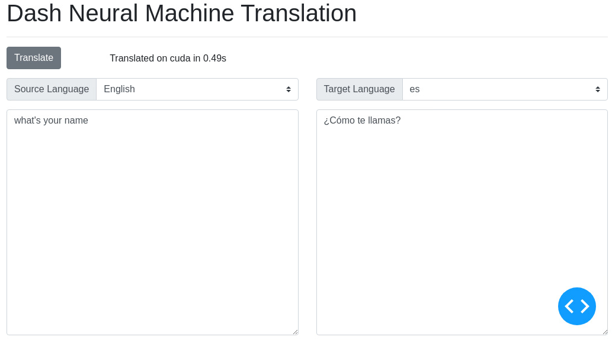
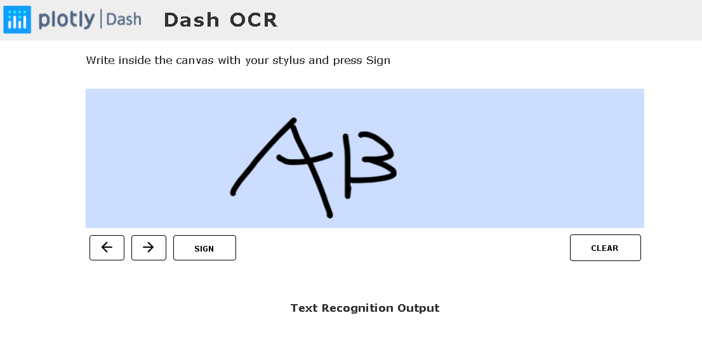
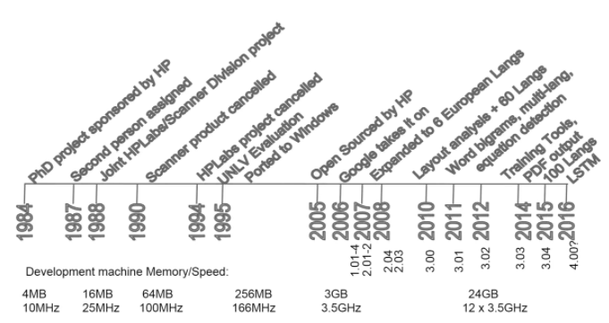

本目录下，有大量dash的例子，这些例子来自https://github.com/plotly/dash-sample-apps。

这些例子的展示来自https://dash-gallery.plotly.host/Portal/

以下示例启动的命令是：

~~~python
cd [sample folder]
source venv/bin/activate
python app.py
deactivate
~~~

然后打开http://15.15.166.35:8050/

### [dash-translate](dash-translate)  : 语言翻译

调用了MarianMTModel中的[`Helsinki-NLP/opus-mt-en-ROMANC`](https://huggingface.co/Helsinki-NLP/opus-mt-en-ROMANCE)模型，遗憾是，只支持英文到其它语言（不包括中文）。模型调用代码如下：

~~~python
import time

import dash
import dash_html_components as html
import dash_core_components as dcc
import dash_bootstrap_components as dbc
from dash.dependencies import Input, Output, State
import torch
from transformers import MarianMTModel, MarianTokenizer
import nltk

nltk.download("punkt")
from nltk.tokenize import sent_tokenize

...

model_name = "Helsinki-NLP/opus-mt-en-ROMANCE"
tokenizer = MarianTokenizer.from_pretrained(model_name)
model = MarianMTModel.from_pretrained(model_name).to(device)
~~~

###  [dash-canvas-ocr](dash-canvas-ocr) : 手写英文字母识别

通过pytesseract调用了Tesseract。

Tesseract从1984年开始至今，中间1995年至2005年基本处于停滞状态（The dark ages），自从2005年HP开源，2006年被Google接手之后，又进入了新的发展阶段，也不知道这么有意思的OCR库经过了怎样的40年~~

通过pytesseract包调用Tesseract。

~~~python
from PIL import Image
import base64
from io import BytesIO

import dash
import numpy as np
import dash_html_components as html
import dash_core_components as dcc
from dash_canvas import DashCanvas
from dash_canvas.utils import array_to_data_url, parse_jsonstring
from dash.dependencies import Input, Output, State
from dash.exceptions import PreventUpdate

import pytesseract

...
pytesseract.image_to_string(img, lang="eng", config="--psm 6")
~~~

**程序可以正常运行，但是输出的结果为空，不知道是不是安装的问题。**

### [dash-interest-rate](dash-interest-rate) : Regression models

### dash-chatbot: 聊天机器人

## Others

引入一个新的例子。

~~~shell
sample_app=dash-chatbot
source_path=~/eipi10/dash/dash-sample-apps/apps
target_path=~/eipi10/xuxiangwen.github.io/_notes/20-python/dash/dash-sample-apps
cp -r $source_path/$sample_app $target_path
cd $target_path/$sample_app
ll 

git stat
~~~

