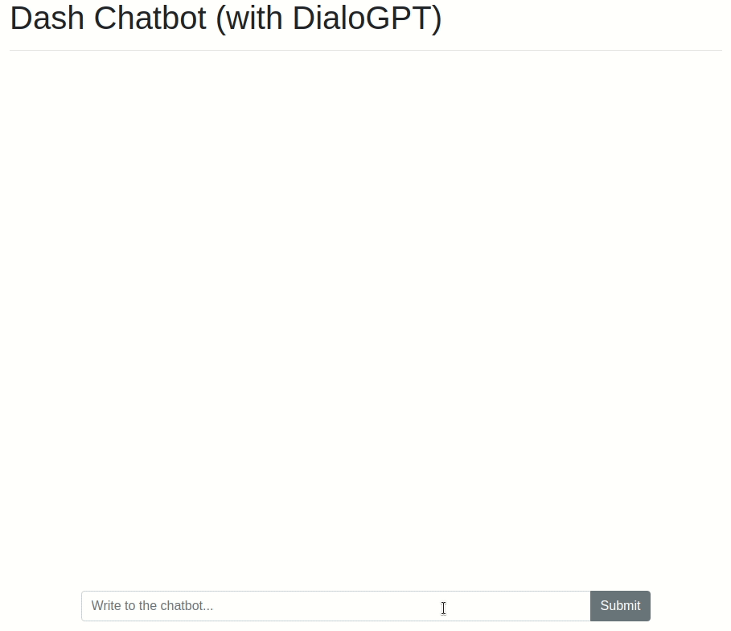

This app lets you chat with [DialoGPT](https://huggingface.co/transformers/model_doc/dialogpt.html), a chatbot based on GPT that was trained on 147M comments+replies from Reddit. The model was developed by [Microsoft Research](https://github.com/microsoft/DialoGPT), and it is hosted on [Huggingface's model repository](https://huggingface.co/microsoft/DialoGPT-large).

## UI

## 安装

生成python虚拟环境，安装必须软件

~~~shell
virtualenv venv 
source venv/bin/activate
echo venv/ > .gitignore
pip install -r requirements.txt
# deactivate 
# rm -rf venv
~~~

启动

~~~python
source venv/bin/activate
python app.py
~~~

