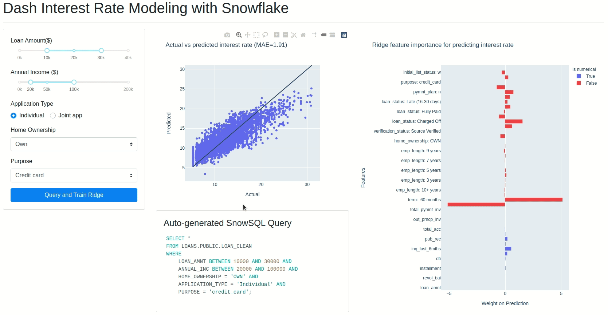
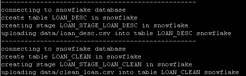

## UI



## 安装

生成python虚拟环境，安装必须软件

~~~shell
cd dash-interest-rate
virtualenv venv 
source venv/bin/activate
echo venv > .gitignore
pip install -r requirements.txt
# deactivate 
# rm -rf venv
~~~

## 配置Snowflake 数据库

### 申请snowflake账号

参见[Signing Up for a Trial Account](https://docs.snowflake.com/en/user-guide/admin-trial-account.html)。

https://zwa09388.snowflakecomputing.com/console#/internal/worksheet

### 数据导入

首先创建数据库，在snowflake的Worksheets中执行如下脚本。

~~~sql
create database loans;
CREATE WAREHOUSE snowflake_demos WITH WAREHOUSE_SIZE = 'SMALL' WAREHOUSE_TYPE = 'STANDARD' AUTO_SUSPEND = 600 AUTO_RESUME = TRUE;
~~~

把如下两个文件下载到data目录下。

~~~python
mkdir -p data
cd data
wget https://plotly-tutorials.s3-us-west-1.amazonaws.com/dash-sample-apps/snowflake-demos/loan_desc.csv
wget wget https://plotly-tutorials.s3-us-west-1.amazonaws.com/dash-sample-apps/snowflake-demos/clean_loan.csv
    
cd ..
~~~

然后在当前目录执行如下脚本。

~~~shell
source venv/bin/activate

export FLAKE_ACCOUNT=zwa09388
export FLAKE_USER=microsheen
export FLAKE_PW=QAZ...02
python3 upload_csv_to_snowflake.py
~~~



### 启动

~~~python
export FLAKE_ACCOUNT=zwa09388
export FLAKE_USER=microsheen
export FLAKE_PW=QAZ...02
python app.py
~~~


# Dash Interest Rate Modeling (with Snowflake)

This app shows how to query loan data from a Snowflake Data Warehouse, and train and analyze a Ridge regression model using Dash.


## Setting up Snowflake DB

This app uses a Snowflake database for querying the data used to train the model. If you are not familiar, check out the [Snowflake Docs](https://docs.snowflake.com/en/).

### Datasets

The data used was retrieved and modified from the [Lending Club Loan Data](https://www.kaggle.com/wendykan/lending-club-loan-data) from Kaggle. By using this dataset, you are agreeing to Kaggle's terms of use, as well as the original data license. You can download the modified files here:
* `clean_loan.csv`: [Link](https://plotly-tutorials.s3-us-west-1.amazonaws.com/dash-sample-apps/snowflake-demos/clean_loan.csv)
* `loan_desc.csv`: [Link](https://plotly-tutorials.s3-us-west-1.amazonaws.com/dash-sample-apps/snowflake-demos/loan_desc.csv)

### Initialization and Env Variable

You will need to create a warehouse, a database, and a stage. We recommend using the Web Interface (please refer to the docs).

For our app, we named our warehouse "snowflake_demos", our stage "LOAN_STAGE" and our database "LOANS". If you use any other name, please update the snowflake variables in `app.py`.

Then, you will need to export the following environment variables (you can write it in your `.bashrc`):
```
export FLAKE_ACCOUNT = microsheen@gmail.com
export FLAKE_USER = 
export FLAKE_PW = <your_password>
```

### Upload CSV files
For uploading the CSV files, please read `upload_csv_to_snowflake.py` carefully. It automatically:
* Create or replace a table by using the columns of the CSV file
* Remove all content from the specified stage
* Put your CSV file into the stage
* Copy the CSV file from your stage to the newly created table

It's recommended not to use the name of an existing stage or table, since it will be overwritten. In our case, we used the following table names:
* `loan_desc.csv`: "LOAN_DESC"
* `loan_clean.csv`: "LOAN_CLEAN"

To learn more about loading bulk data, please read the official Snowflake documentation.


## Setting up the app

First clone this repo:
```
git clone https://github.com/plotly/dash-sample-apps.git
cd dash-sample-apps/apps/dash-interest-rate
```

Create a conda env (or venv) and install the requirements:
```
conda create -n dash-interest-rate python=3.6.7
conda activate dash-interest-rate
pip install -r requirements.txt
```


## Start the app

Start a redis server:
```
redis-server --port 7777
```

In a separate terminal window, you can now run the app:
```
python app.py
```

and visit http://127.0.0.1:8050/.