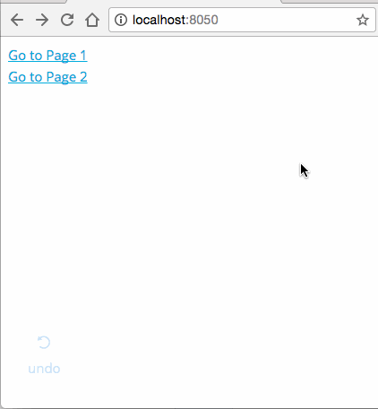
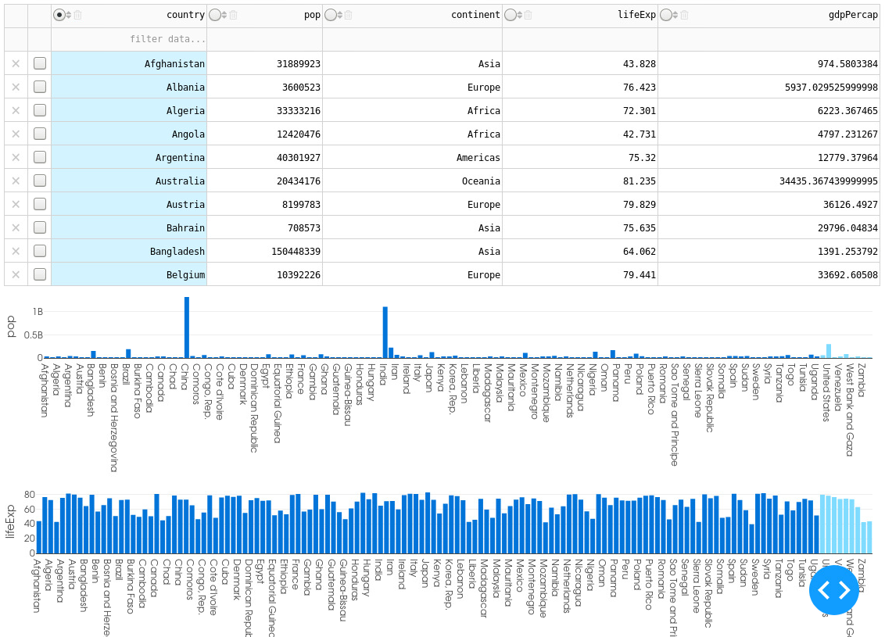

~~~shell
mkdir -p skills
cd skills
~~~

## 技巧

### 文件下载

~~~python
python_file=download_file.py

cat << EOF > $python_file
import dash
import dash_core_components as dcc
import dash_html_components as html
import pandas as pd
import urllib

df = pd.DataFrame({
    'a': [1, 2, 3, 4],
    'b': [2, 1, 5, 6],
    'c': ['x', 'x', 'y', 'y']
})


def generate_table(dataframe, max_rows=10):
    return html.Table(
        # Header
        [html.Tr([html.Th(col) for col in dataframe.columns])] +

        # Body
        [html.Tr([
            html.Td(dataframe.iloc[i][col]) for col in dataframe.columns
        ]) for i in range(min(len(dataframe), max_rows))]
    )


app = dash.Dash(__name__)
app.css.append_css({"external_url": "https://codepen.io/chriddyp/pen/bWLwgP.css"})
app.layout = html.Div([
    html.Label('Filter'),

    dcc.Dropdown(
        id='field-dropdown',
        options=[
            {'label': i, 'value': i} for i in
            (['all'] + list(df['c'].unique()))],
        value='all'
    ),
    html.Div(id='table'),
    html.A(
        'Download Data',
        id='download-link',
        download="rawdata.csv",
        href="",
        target="_blank"
    )
])


def filter_data(value):
    if value == 'all':
        return df
    else:
        return df[df['c'] == value]


@app.callback(
    dash.dependencies.Output('table', 'children'),
    [dash.dependencies.Input('field-dropdown', 'value')])
def update_table(filter_value):
    dff = filter_data(filter_value)
    return generate_table(dff)


@app.callback(
    dash.dependencies.Output('download-link', 'href'),
    [dash.dependencies.Input('field-dropdown', 'value')])
def update_download_link(filter_value):
    dff = filter_data(filter_value)
    csv_string = dff.to_csv(index=False, encoding='utf-8')
    csv_string = "data:text/csv;charset=utf-8,%EF%BB%BF" + urllib.parse.quote(csv_string)
    return csv_string


if __name__ == '__main__':
    app.run_server(debug=False, port='8051', host='0.0.0.0')
    
EOF

python3 $python_file 
~~~


## Loading States

### 使用 [Loading component](https://dash.plotly.com/dash-core-components/loading) 

~~~python
python_file=loading_states.py

cat << EOF > $python_file
# -*- coding: utf-8 -*-
import dash
import dash_html_components as html
import dash_core_components as dcc
import time

from dash.dependencies import Input, Output, State

app = dash.Dash(__name__)

app.layout = html.Div(
    children=[
        html.H3("Edit text input to see loading state"),
        dcc.Input(id="input-1", value='Input triggers local spinner'),
        dcc.Loading(id="loading-1", children=[html.Div(id="loading-output-1")], type="default"),
        html.Div(
            [
                dcc.Input(id="input-2", value='Input triggers nested spinner'),
                dcc.Loading(
                    id="loading-2",
                    children=[html.Div([html.Div(id="loading-output-2")])],
                    type="circle",
                )
            ]
        ),
    ],
)

@app.callback(Output("loading-output-1", "children"), Input("input-1", "value"))
def input_triggers_spinner(value):
    time.sleep(5)
    return value


@app.callback(Output("loading-output-2", "children"), Input("input-2", "value"))
def input_triggers_nested(value):
    time.sleep(5)
    return value


if __name__ == "__main__":
    app.run_server(debug=False, port='8051', host='0.0.0.0')
EOF

python3 $python_file 
~~~


## [Multi-Page Apps and URL Support](https://dash.plotly.com/urls)

### Simple Sample

~~~python
python_file=multi_page_simple.py

cat << EOF > $python_file
import dash
import dash_core_components as dcc
import dash_html_components as html

print(dcc.__version__) # 0.6.0 or above is required

external_stylesheets = ['https://codepen.io/chriddyp/pen/bWLwgP.css']

app = dash.Dash(__name__, external_stylesheets=external_stylesheets)

app.layout = html.Div([
    # represents the URL bar, doesn't render anything
    dcc.Location(id='url', refresh=False),

    dcc.Link('Navigate to "/"', href='/'),
    html.Br(),
    dcc.Link('Navigate to "/page-2"', href='/page-2'),

    # content will be rendered in this element
    html.Div(id='page-content')
])


@app.callback(dash.dependencies.Output('page-content', 'children'),
              [dash.dependencies.Input('url', 'pathname')])
def display_page(pathname):
    return html.Div([
        html.H3('You are on page {}'.format(pathname))
    ])


if __name__ == '__main__':
    app.run_server(debug=True)


EOF

python3 $python_file  
~~~


下面的例子中，增加了真正不同的页面。

~~~python
python_file=multi_page_simple1.py.py

cat << EOF > $python_file
import dash
import dash_core_components as dcc
import dash_html_components as html

# Since we're adding callbacks to elements that don't exist in the app.layout,
# Dash will raise an exception to warn us that we might be
# doing something wrong.
# In this case, we're adding the elements through a callback, so we can ignore
# the exception.
app = dash.Dash(__name__, suppress_callback_exceptions=True)

app.layout = html.Div([
    dcc.Location(id='url', refresh=False),
    html.Div(id='page-content')
])


index_page = html.Div([
    dcc.Link('Go to Page 1', href='/page-1'),
    html.Br(),
    dcc.Link('Go to Page 2', href='/page-2'),
])

page_1_layout = html.Div([
    html.H1('Page 1'),
    dcc.Dropdown(
        id='page-1-dropdown',
        options=[{'label': i, 'value': i} for i in ['LA', 'NYC', 'MTL']],
        value='LA'
    ),
    html.Div(id='page-1-content'),
    html.Br(),
    dcc.Link('Go to Page 2', href='/page-2'),
    html.Br(),
    dcc.Link('Go back to home', href='/'),
])

@app.callback(dash.dependencies.Output('page-1-content', 'children'),
              [dash.dependencies.Input('page-1-dropdown', 'value')])
def page_1_dropdown(value):
    return 'You have selected "{}"'.format(value)


page_2_layout = html.Div([
    html.H1('Page 2'),
    dcc.RadioItems(
        id='page-2-radios',
        options=[{'label': i, 'value': i} for i in ['Orange', 'Blue', 'Red']],
        value='Orange'
    ),
    html.Div(id='page-2-content'),
    html.Br(),
    dcc.Link('Go to Page 1', href='/page-1'),
    html.Br(),
    dcc.Link('Go back to home', href='/')
])

@app.callback(dash.dependencies.Output('page-2-content', 'children'),
              [dash.dependencies.Input('page-2-radios', 'value')])
def page_2_radios(value):
    return 'You have selected "{}"'.format(value)


# Update the index
@app.callback(dash.dependencies.Output('page-content', 'children'),
              [dash.dependencies.Input('url', 'pathname')])
def display_page(pathname):
    if pathname == '/page-1':
        return page_1_layout
    elif pathname == '/page-2':
        return page_2_layout
    else:
        return index_page
    # You could also return a 404 "URL not found" page here


if __name__ == '__main__':
    app.run_server(debug=True)


EOF

python3 $python_file 
~~~




### Dynamically Create a Layout for Multi-Page App Validation

Dash会验证callback的Input和Output设置是否正确。由于Multi-Page，所以在初始layout并不包含所有的组件，这时需要设置app.validation_layout来设置所有的component。

~~~python
python_file=multi_page_validaton.py

cat << EOF > $python_file
import dash
import dash_core_components as dcc
import dash_html_components as html
from dash.dependencies import Input, Output, State

import flask

app = dash.Dash(__name__)

url_bar_and_content_div = html.Div([
    dcc.Location(id='url', refresh=False),
    html.Div(id='page-content')
])

layout_index = html.Div([
    dcc.Link('Navigate to "/page-1"', href='/page-1'),
    html.Br(),
    dcc.Link('Navigate to "/page-2"', href='/page-2'),
])

layout_page_1 = html.Div([
    html.H2('Page 1'),
    dcc.Input(id='input-1-state', type='text', value='Montreal'),
    dcc.Input(id='input-2-state', type='text', value='Canada'),
    html.Button(id='submit-button', n_clicks=0, children='Submit'),
    html.Div(id='output-state'),
    html.Br(),
    dcc.Link('Navigate to "/"', href='/'),
    html.Br(),
    dcc.Link('Navigate to "/page-2"', href='/page-2'),
])

layout_page_2 = html.Div([
    html.H2('Page 2'),
    dcc.Dropdown(
        id='page-2-dropdown',
        options=[{'label': i, 'value': i} for i in ['LA', 'NYC', 'MTL']],
        value='LA'
    ),
    html.Div(id='page-2-display-value'),
    html.Br(),
    dcc.Link('Navigate to "/"', href='/'),
    html.Br(),
    dcc.Link('Navigate to "/page-1"', href='/page-1'),
])

# index layout
app.layout = url_bar_and_content_div

# "complete" layout
app.validation_layout = html.Div([
    url_bar_and_content_div,
    layout_index,
    layout_page_1,
    layout_page_2,
])


# Index callbacks
@app.callback(Output('page-content', 'children'),
              Input('url', 'pathname'))
def display_page(pathname):
    if pathname == "/page-1":
        return layout_page_1
    elif pathname == "/page-2":
        return layout_page_2
    else:
        return layout_index


# Page 1 callbacks
@app.callback(Output('output-state', 'children'),
              Input('submit-button', 'n_clicks'),
              State('input-1-state', 'value'),
              State('input-2-state', 'value'))
def update_output(n_clicks, input1, input2):
    return ('The Button has been pressed {} times,'
            'Input 1 is "{}",'
            'and Input 2 is "{}"').format(n_clicks, input1, input2)


# Page 2 callbacks
@app.callback(Output('page-2-display-value', 'children'),
              Input('page-2-dropdown', 'value'))
def display_value(value):
    print('display_value')
    return 'You have selected "{}"'.format(value)


if __name__ == '__main__':
    app.run_server(debug=True, host='0.0.0.0')


EOF

python3 $python_file  
~~~

### Structuring a Multi-Page App

实际的网站，可能结构如下。

```
- app.py
- index.py
- apps
   |-- __init__.py
   |-- app1.py
   |-- app2.py
```

下面来实现这一结构。首先创建目录。

~~~shell
mkdir -p structure/apps
cd structure
~~~

然后生成所有的代码文件。

~~~python

cat << EOF > app.py
import dash

app = dash.Dash(__name__, suppress_callback_exceptions=True)
server = app.server
EOF

# ------------------------------------------------------------------------
cat << EOF > apps/app1.py
import dash_core_components as dcc
import dash_html_components as html
from dash.dependencies import Input, Output

from app import app

layout = html.Div([
    html.H3('App 1'),
    dcc.Dropdown(
        id='app-1-dropdown',
        options=[
            {'label': 'App 1 - {}'.format(i), 'value': i} for i in [
                'NYC', 'MTL', 'LA'
            ]
        ]
    ),
    html.Div(id='app-1-display-value'),
    dcc.Link('Go to App 2', href='/apps/app2')
])


@app.callback(
    Output('app-1-display-value', 'children'),
    Input('app-1-dropdown', 'value'))
def display_value(value):
    return 'You have selected "{}"'.format(value)

EOF

# ------------------------------------------------------------------------
cat << EOF > apps/app2.py
import dash_core_components as dcc
import dash_html_components as html
from dash.dependencies import Input, Output

from app import app

layout = html.Div([
    html.H3('App 2'),
    dcc.Dropdown(
        id='app-2-dropdown',
        options=[
            {'label': 'App 2 - {}'.format(i), 'value': i} for i in [
                'NYC', 'MTL', 'LA'
            ]
        ]
    ),
    html.Div(id='app-2-display-value'),
    dcc.Link('Go to App 1', href='/apps/app1')
])


@app.callback(
    Output('app-2-display-value', 'children'),
    Input('app-2-dropdown', 'value'))
def display_value(value):
    return 'You have selected "{}"'.format(value)

EOF

# ------------------------------------------------------------------------
cat << EOF > index.py
import dash_core_components as dcc
import dash_html_components as html
from dash.dependencies import Input, Output

from app import app
from apps import app1, app2


app.layout = html.Div([
    dcc.Location(id='url', refresh=False),
    html.Div(id='page-content')
])


@app.callback(Output('page-content', 'children'),
              Input('url', 'pathname'))
def display_page(pathname):
    if pathname == '/apps/app1':
        return app1.layout
    elif pathname == '/apps/app2':
        return app2.layout
    else:
        return '404'

if __name__ == '__main__':
    app.run_server(debug=True, host='0.0.0.0')
    
EOF

# ------------------------------------------------------------------------

python3 index.py
~~~


python_file=multi_page.py

cat << EOF > $python_file


EOF

python3 $python_file  

## [DataTable Interactivity](https://dash.plotly.com/datatable/interactivity)

`DataTable` 有如下几个属性。

- Sorting by column (`sort_action='native'`)
- Filtering by column (`filter_action='native'`)
- Editing the cells (`editable=True`)
- Deleting rows (`row_deletable=True`)
- Deleting columns (`columns[i].deletable=True`)
- Selecting rows (`row_selectable='single' | 'multi'`)
- Selecting columns (`column_selectable='single' | 'multi'` and `columns[i].selectable=True`)
- Paging front-end (`page_action='native'`)
- Hiding columns (`hidden_columns=[]`)

### 基本

~~~python
python_file=datatable.py

cat << EOF > $python_file
import dash
from dash.dependencies import Input, Output
import dash_table
import dash_core_components as dcc
import dash_html_components as html
import pandas as pd

df = pd.read_csv('https://raw.githubusercontent.com/plotly/datasets/master/gapminder2007.csv')

app = dash.Dash(__name__)

app.layout = html.Div([
    dash_table.DataTable(
        id='datatable-interactivity',
        columns=[
            {"name": i, "id": i, "deletable": True, "selectable": True} for i in df.columns
        ],
        data=df.to_dict('records'),
        editable=True,
        filter_action="native",
        sort_action="native",
        sort_mode="multi",
        column_selectable="single",
        row_selectable="multi",
        row_deletable=True,
        selected_columns=[],
        selected_rows=[],
        page_action="native",
        page_current= 0,
        page_size= 10,
    ),
    html.Div(id='datatable-interactivity-container')
])

@app.callback(
    Output('datatable-interactivity', 'style_data_conditional'),
    Input('datatable-interactivity', 'selected_columns')
)
def update_styles(selected_columns):
    return [{
        'if': { 'column_id': i },
        'background_color': '#D2F3FF'
    } for i in selected_columns]

@app.callback(
    Output('datatable-interactivity-container', "children"),
    Input('datatable-interactivity', "derived_virtual_data"),
    Input('datatable-interactivity', "derived_virtual_selected_rows"))
def update_graphs(rows, derived_virtual_selected_rows):
    # When the table is first rendered, 'derived_virtual_data' and
    # 'derived_virtual_selected_rows' will be 'None'. This is due to an
    # idiosyncrasy in Dash (unsupplied properties are always None and Dash
    # calls the dependent callbacks when the component is first rendered).
    # So, if 'rows' is 'None', then the component was just rendered
    # and its value will be the same as the component's dataframe.
    # Instead of setting 'None' in here, you could also set
    # 'derived_virtual_data=df.to_rows('dict')' when you initialize
    # the component.
    if derived_virtual_selected_rows is None:
        derived_virtual_selected_rows = []

    dff = df if rows is None else pd.DataFrame(rows)

    colors = ['#7FDBFF' if i in derived_virtual_selected_rows else '#0074D9'
              for i in range(len(dff))]

    return [
        dcc.Graph(
            id=column,
            figure={
                'data': [
                    {
                        'x': dff['country'],
                        'y': dff[column],
                        'type': 'bar',
                        'marker': {'color': colors},
                    }
                ],
                'layout': {
                    'xaxis': {'automargin': True},
                    'yaxis': {
                        'automargin': True,
                        'title': {'text': column}
                    },
                    'height': 250,
                    'margin': {'t': 10, 'l': 10, 'r': 10},
                },
            },
        )
        # check if column exists - user may have deleted it
        # If column.deletable=False, then you don't
        # need to do this check.
        for column in ['pop', 'lifeExp', 'gdpPercap'] if column in dff
    ]


if __name__ == '__main__':
    app.run_server(debug=True, host='0.0.0.0')

EOF

python3 $python_file  
~~~



#### Row IDs

Dash支持Row IDs，每一行都有一个id，id可以是string或者number。

- `derived_virtual_indices` / `derived_virtual_row_ids`: 所有页面的行
- `derived_viewport_indices` / `derived_viewport_row_ids`: 当前页面行。
- `derived_virtual_selected_rows` / `derived_virtual_selected_row_ids`: 在filter或者sorting后，所有页面中被勾选的行
- `derived_viewport_selected_rows` / `derived_viewport_selected_row_ids`: 当前页面中被勾选的行
- `selected_rows` / `selected_row_ids`: 当`row_selectabl=True` ，表示已勾选的行。即使有filter，依然会保留。

对于cell，也有一些属性。

- `active_cell`: 当前光标所在行。它是一个dictionary，有下面这些成员：
  - row：行号
  - column：列号
  - row_id：行id
  - column_id：列id
- `start_cell`:  如果（通过shift click或者shift-arrow-keys）选择了多个cell时，表示第一个cell。cell的成员内容同`active_cell`。
- `end_cell`:  如果（通过shift click或者shift-arrow-keys）选择了多个cell时，表示最后一个cell。cell的成员内容同`active_cell`。
- `selected_cells`: 所选择的若干cell列表。可以按 `<tab>` or `<enter>`切换当前的ative_cell。每个cell的成员内容同`active_cell`。

~~~python
python_file=datatable-rowid.py

cat << EOF > $python_file
import dash
from dash.dependencies import Input, Output
import dash_table
import dash_core_components as dcc
import dash_html_components as html
import pandas as pd

df = pd.read_csv('https://raw.githubusercontent.com/plotly/datasets/master/gapminder2007.csv')
# add an id column and set it as the index
# in this case the unique ID is just the country name, so we could have just
# renamed 'country' to 'id' (but given it the display name 'country'), but
# here it's duplicated just to show the more general pattern.
df['id'] = df['country']
df.set_index('id', inplace=True, drop=False)

app = dash.Dash(__name__)

app.layout = html.Div([
    dash_table.DataTable(
        id='datatable-row-ids',
        columns=[
            {'name': i, 'id': i, 'deletable': True} for i in df.columns
            # omit the id column
            if i != 'id'
        ],
        data=df.to_dict('records'),
        editable=True,
        filter_action='native',
        sort_action='native',
        sort_mode='multi',
        row_selectable='multi',
        row_deletable=True,
        selected_rows=[],
        page_action='native',
        page_current= 0,
        page_size= 10,
    ),
    html.Div(id='datatable-row-ids-container')
])


@app.callback(
    Output('datatable-row-ids-container', 'children'),
    Input('datatable-row-ids', 'derived_virtual_row_ids'),
    Input('datatable-row-ids', 'selected_row_ids'),
    Input('datatable-row-ids', 'active_cell'))
def update_graphs(row_ids, selected_row_ids, active_cell):
    # When the table is first rendered, 'derived_virtual_data' and
    # 'derived_virtual_selected_rows' will be 'None'. This is due to an
    # idiosyncrasy in Dash (unsupplied properties are always None and Dash
    # calls the dependent callbacks when the component is first rendered).
    # So, if 'rows' is 'None', then the component was just rendered
    # and its value will be the same as the component's dataframe.
    # Instead of setting 'None' in here, you could also set
    # 'derived_virtual_data=df.to_rows('dict')' when you initialize
    # the component.
    selected_id_set = set(selected_row_ids or [])

    if row_ids is None:
        dff = df
        # pandas Series works enough like a list for this to be OK
        row_ids = df['id']
    else:
        dff = df.loc[row_ids]

    active_row_id = active_cell['row_id'] if active_cell else None

    colors = ['#FF69B4' if id == active_row_id
              else '#7FDBFF' if id in selected_id_set
              else '#0074D9'
              for id in row_ids]

    return [
        dcc.Graph(
            id=column + '--row-ids',
            figure={
                'data': [
                    {
                        'x': dff['country'],
                        'y': dff[column],
                        'type': 'bar',
                        'marker': {'color': colors},
                    }
                ],
                'layout': {
                    'xaxis': {'automargin': True},
                    'yaxis': {
                        'automargin': True,
                        'title': {'text': column}
                    },
                    'height': 250,
                    'margin': {'t': 10, 'l': 10, 'r': 10},
                },
            },
        )
        # check if column exists - user may have deleted it
        # If 'column.deletable=False', then you don't
        # need to do this check.
        for column in ['pop', 'lifeExp', 'gdpPercap'] if column in dff
    ]


if __name__ == '__main__':
    app.run_server(debug=True)

EOF

python3 $python_file  
~~~


### dash_table_experiments

~~~python
python_file=dash_table_experiments.py

cat << EOF > $python_file
# -*- coding: UTF-8 -*-

import dash
from dash.dependencies import Input, Output, State
import dash_core_components as dcc
import dash_html_components as html
import dash_table_experiments as dt
import json
import pandas as pd
import plotly

app = dash.Dash()

app.scripts.config.serve_locally = True

DF_GAPMINDER = pd.read_csv( 'https://raw.githubusercontent.com/plotly/datasets/master/gapminderDataFiveYear.csv'
)
sparklines = {
    c: html.Div(style={'height': 100, 'width': '100%'}, children=dcc.Graph(
        id=c,
        figure={
            'data': [{
                'x': DF_GAPMINDER[c],
                'type': 'histogram'
            }],
            'layout': {
                'height': 100,
                'width': 150,
                'margin': {
                    'l': 0, 'r': 0, 't': 0, 'b': 0
                },
                'xaxis': {
                    'showticklabels': False,
                    'showline': False,
                    'showgrid': False,
                },
                'yaxis': {
                    'showticklabels': False,
                    'showline': False,
                    'showgrid': False,
                }
            }
        },
        config={'displayModeBar': False}
    ))
    for c in DF_GAPMINDER.columns
}

app.layout = html.Div([
    html.H1('💖 Dash Sparklines 💖', style={'textAlign': 'center'}),
    html.H2(html.I('Coming Soon'), style={'textAlign': 'center'}),
    dt.DataTable(
        rows=[sparklines] + DF_GAPMINDER.to_dict('records'),
        id='table',
        min_height=1500,
    ),
    html.Div(dcc.Dropdown(), style={'display': 'none'})
], className="container")


app.css.append_css({
    "external_url": "https://codepen.io/chriddyp/pen/bWLwgP.css"
})

if __name__ == '__main__':
    app.run_server(debug=True, port=8060)


EOF

python3 $python_file 
~~~

