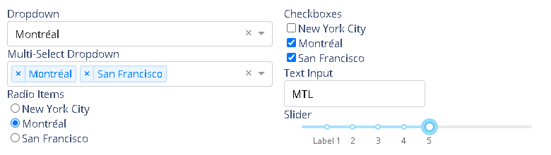

## What's Dash

Dash is a productive Python framework for building web analytic applications.

Written on top of 

- Flask
- Plotly.js
- React.js

## [Installation](https://dash.plotly.com/installation)

~~~shell
pip install dash
~~~

## [Layout](https://dash.plotly.com/layout)

介绍基本的前端展现。首先创建目录。

~~~python
mkdir -p layout
cd layout
~~~

### Hello Dash

~~~shell
python_file=app.py

cat << EOF > $python_file
# -*- coding: utf-8 -*-

# Run this app with python app.py and
# visit http://127.0.0.1:8050/ in your web browser.

import dash
import dash_core_components as dcc
import dash_html_components as html
import plotly.express as px
import pandas as pd

external_stylesheets = ['https://codepen.io/chriddyp/pen/bWLwgP.css']

app = dash.Dash(__name__, external_stylesheets=external_stylesheets)

# assume you have a "long-form" data frame
# see https://plotly.com/python/px-arguments/ for more options
df = pd.DataFrame({
    "Fruit": ["Apples", "Oranges", "Bananas", "Apples", "Oranges", "Bananas"],
    "Amount": [4, 1, 2, 2, 4, 5],
    "City": ["SF", "SF", "SF", "Montreal", "Montreal", "Montreal"]
})

fig = px.bar(df, x="Fruit", y="Amount", color="City", barmode="group")

app.layout = html.Div(children=[
    html.H1(children='Hello Dash'),

    html.Div(children='''
        Dash: A web application framework for Python.
    '''),

    dcc.Graph(
        id='example-graph',
        figure=fig
    )
])

if __name__ == '__main__':
    app.run_server(debug=True, host='0.0.0.0', port=5050)
EOF
              
python3 $python_file
~~~

> 如果如下错误，需要安装lzma。
>
> 
>
> ~~~shell
> sudo yum install -y xz-devel
> 
> # 重新编译python
> wget https://www.python.org/ftp/python/3.6.12/Python-3.6.12.tgz
> tar zvxf Python-3.6.12.tgz
> cd Python-3.6.12
> ./configure
> make
> sudo make install
> ~~~

### Making your first change

添加了colors和居中的设置。

~~~shell
python_file=app1.py

cat << EOF > $python_file
# -*- coding: utf-8 -*-

# Run this app with python app.py and
# visit http://127.0.0.1:8050/ in your web browser.

import dash
import dash_core_components as dcc
import dash_html_components as html
import plotly.express as px
import pandas as pd

external_stylesheets = ['https://codepen.io/chriddyp/pen/bWLwgP.css']

app = dash.Dash(__name__, external_stylesheets=external_stylesheets)

colors = {
    'background': '#111111',
    'text': '#7FDBFF'
}

# assume you have a 'long-form' data frame
# see https://plotly.com/python/px-arguments/ for more options
df = pd.DataFrame({
    'Fruit': ['Apples', 'Oranges', 'Bananas', 'Apples', 'Oranges', 'Bananas'],
    'Amount': [4, 1, 2, 2, 4, 5],
    'City': ['SF', 'SF', 'SF', 'Montreal', 'Montreal', 'Montreal']
})

fig = px.bar(df, x='Fruit', y='Amount', color='City', barmode='group')

fig.update_layout(
    plot_bgcolor=colors['background'],
    paper_bgcolor=colors['background'],
    font_color=colors['text']
)

app.layout = html.Div(style={'backgroundColor': colors['background']}, children=[
    html.H1(
        children='Hello Dash',
        style={
            'textAlign': 'center',
            'color': colors['text']
        }
    ),

    html.Div(children='Dash: A web application framework for Python.', style={
        'textAlign': 'center',
        'color': colors['text']
    }),

    dcc.Graph(
        id='example-graph-2',
        figure=fig
    )
])

if __name__ == '__main__':
    app.run_server(debug=True, host='0.0.0.0', port=5050)
EOF

python3 $python_file
~~~

### Reusable Components

~~~shell
python_file=app2.py

cat << EOF > $python_file
# Run this app with python app.py and
# visit http://127.0.0.1:8050/ in your web browser.

import dash
import dash_core_components as dcc
import dash_html_components as html
import pandas as pd

df = pd.read_csv('https://gist.githubusercontent.com/chriddyp/c78bf172206ce24f77d6363a2d754b59/raw/c353e8ef842413cae56ae3920b8fd78468aa4cb2/usa-agricultural-exports-2011.csv')

def generate_table(dataframe, max_rows=10):
    return html.Table([
        html.Thead(
            html.Tr([html.Th(col) for col in dataframe.columns])
        ),
        html.Tbody([
            html.Tr([
                html.Td(dataframe.iloc[i][col]) for col in dataframe.columns
            ]) for i in range(min(len(dataframe), max_rows))
        ])
    ])

external_stylesheets = ['https://codepen.io/chriddyp/pen/bWLwgP.css']

app = dash.Dash(__name__, external_stylesheets=external_stylesheets)

app.layout = html.Div(children=[
    html.H4(children='US Agriculture Exports (2011)'),
    generate_table(df)
])

if __name__ == '__main__':
    app.run_server(debug=True, host='0.0.0.0', port=5050)
EOF

python3 $python_file
~~~

### More about Visualization

经典的GDP和期望寿命的散点图。

~~~shell
python_file=app3.py

cat << EOF > $python_file
# Run this app with `python app.py` and
# visit http://127.0.0.1:8050/ in your web browser.

import dash
import dash_core_components as dcc
import dash_html_components as html
import plotly.express as px
import pandas as pd

external_stylesheets = ['https://codepen.io/chriddyp/pen/bWLwgP.css']

app = dash.Dash(__name__, external_stylesheets=external_stylesheets)

df = pd.read_csv('https://gist.githubusercontent.com/chriddyp/5d1ea79569ed194d432e56108a04d188/raw/a9f9e8076b837d541398e999dcbac2b2826a81f8/gdp-life-exp-2007.csv')

fig = px.scatter(df, x='gdp per capita', y='life expectancy',
                 size='population', color='continent', hover_name='country',
                 log_x=True, size_max=60)

app.layout = html.Div([
    dcc.Graph(
        id='life-exp-vs-gdp',
        figure=fig
    )
])

if __name__ == '__main__':
    app.run_server(debug=True, host='0.0.0.0', port=5050)
    
EOF

python3 $python_file    
~~~

### Markdown

~~~shell
python_file=app4.py

cat << EOF > $python_file
# Run this app with python app.py and
# visit http://127.0.0.1:8050/ in your web browser.

import dash
import dash_core_components as dcc
import dash_html_components as html

external_stylesheets = ['https://codepen.io/chriddyp/pen/bWLwgP.css']

app = dash.Dash(__name__, external_stylesheets=external_stylesheets)

markdown_text = '''
### Dash and Markdown

Dash apps can be written in Markdown.
Dash uses the [CommonMark](http://commonmark.org/)
specification of Markdown.
Check out their [60 Second Markdown Tutorial](http://commonmark.org/help/)
if this is your first introduction to Markdown!
'''

app.layout = html.Div([
    dcc.Markdown(children=markdown_text)
])

if __name__ == '__main__':
    app.run_server(debug=True, host='0.0.0.0', port=5050)
EOF

python3 $python_file  
~~~

### Core Components

更多组件参见[Dash Core Components Gallery](https://dash.plotly.com/dash-core-components)

~~~shell
python_file=app5.py

cat << EOF > $python_file
# -*- coding: utf-8 -*-

# Run this app with `python app.py` and
# visit http://127.0.0.1:8050/ in your web browser.

import dash
import dash_core_components as dcc
import dash_html_components as html

external_stylesheets = ['https://codepen.io/chriddyp/pen/bWLwgP.css']

app = dash.Dash(__name__, external_stylesheets=external_stylesheets)

app.layout = html.Div([
    html.Label('Dropdown'),
    dcc.Dropdown(
        options=[
            {'label': 'New York City', 'value': 'NYC'},
            {'label': u'Montréal', 'value': 'MTL'},
            {'label': 'San Francisco', 'value': 'SF'}
        ],
        value='MTL'
    ),

    html.Label('Multi-Select Dropdown'),
    dcc.Dropdown(
        options=[
            {'label': 'New York City', 'value': 'NYC'},
            {'label': u'Montréal', 'value': 'MTL'},
            {'label': 'San Francisco', 'value': 'SF'}
        ],
        value=['MTL', 'SF'],
        multi=True
    ),

    html.Label('Radio Items'),
    dcc.RadioItems(
        options=[
            {'label': 'New York City', 'value': 'NYC'},
            {'label': u'Montréal', 'value': 'MTL'},
            {'label': 'San Francisco', 'value': 'SF'}
        ],
        value='MTL'
    ),

    html.Label('Checkboxes'),
    dcc.Checklist(
        options=[
            {'label': 'New York City', 'value': 'NYC'},
            {'label': u'Montréal', 'value': 'MTL'},
            {'label': 'San Francisco', 'value': 'SF'}
        ],
        value=['MTL', 'SF']
    ),

    html.Label('Text Input'),
    dcc.Input(value='MTL', type='text'),

    html.Label('Slider'),
    dcc.Slider(
        min=0,
        max=9,
        marks={i: 'Label {}'.format(i) if i == 1 else str(i) for i in range(1, 6)},
        value=5,
    ),
], style={'columnCount': 2})

if __name__ == '__main__':
    app.run_server(debug=True, host='0.0.0.0', port=5050)

EOF

python3 $python_file  
~~~

## [Basic Callbacks](https://dash.plotly.com/basic-callbacks)

本节介绍通过callback实现页面交互。在callback中可以实现交互。有几个原则需要遵守。

- 数据的初始加载不要放在callback里面，这样避免数据的频繁加载。
- callback里不要去修改其外的（**outside of their scope**，比如global data）数据。总是对原始数据进行过滤或者复制。

首先创建目录。

~~~shell
mkdir -p callback
cd callback
~~~

### Simple Interactive Dash App

下面定义了@app.callback这个装饰器（decorator）。

~~~shell
python_file=app.py

cat << EOF > $python_file
import dash
import dash_core_components as dcc
import dash_html_components as html
from dash.dependencies import Input, Output

external_stylesheets = ['https://codepen.io/chriddyp/pen/bWLwgP.css']

app = dash.Dash(__name__, external_stylesheets=external_stylesheets)

app.layout = html.Div([
    html.H6("Change the value in the text box to see callbacks in action!"),
    html.Div(["Input: ",
              dcc.Input(id='my-input', value='initial value', type='text')]),
    html.Br(),
    html.Div(id='my-output', children='Hello world'),
])

@app.callback(
    Output(component_id='my-output', component_property='children'),
    Input(component_id='my-input', component_property='value')
)
def update_output_div(input_value):
    return 'Output: {}'.format(input_value)

if __name__ == '__main__':
    app.run_server(debug=True, host='0.0.0.0', port=5050)

EOF

python3 $python_file
~~~

### Dash App Layout With Figure and Slider

~~~shell
python_file=app1.py

cat << EOF > $python_file
import dash
import dash_core_components as dcc
import dash_html_components as html
from dash.dependencies import Input, Output
import plotly.express as px

import pandas as pd

df = pd.read_csv('https://raw.githubusercontent.com/plotly/datasets/master/gapminderDataFiveYear.csv')

external_stylesheets = ['https://codepen.io/chriddyp/pen/bWLwgP.css']

app = dash.Dash(__name__, external_stylesheets=external_stylesheets)

app.layout = html.Div([
    dcc.Graph(id='graph-with-slider'),
    dcc.Slider(
        id='year-slider',
        min=df['year'].min(),
        max=df['year'].max(),
        value=df['year'].min(),
        marks={str(year): str(year) for year in df['year'].unique()},
        step=None
    )
])

@app.callback(
    Output('graph-with-slider', 'figure'),
    Input('year-slider', 'value'))
def update_figure(selected_year):
    filtered_df = df[df.year == selected_year]

    fig = px.scatter(filtered_df, x="gdpPercap", y="lifeExp",
                     size="pop", color="continent", hover_name="country",
                     log_x=True, size_max=55)

    fig.update_layout(transition_duration=500)

    return fig

if __name__ == '__main__':
    app.run_server(debug=True, host='0.0.0.0', port=5050)

EOF

python3 $python_file  
~~~

### Dash App With Multiple Inputs

显示world indicators。

~~~shell
python_file=app2.py

cat << EOF > $python_file
import dash
import dash_core_components as dcc
import dash_html_components as html
from dash.dependencies import Input, Output
import plotly.express as px

import pandas as pd

external_stylesheets = ['https://codepen.io/chriddyp/pen/bWLwgP.css']

app = dash.Dash(__name__, external_stylesheets=external_stylesheets)

df = pd.read_csv('https://plotly.github.io/datasets/country_indicators.csv')

available_indicators = df['Indicator Name'].unique()

app.layout = html.Div([
    html.Div([

        html.Div([
            dcc.Dropdown(
                id='xaxis-column',
                options=[{'label': i, 'value': i} for i in available_indicators],
                value='Fertility rate, total (births per woman)'
            ),
            dcc.RadioItems(
                id='xaxis-type',
                options=[{'label': i, 'value': i} for i in ['Linear', 'Log']],
                value='Linear',
                labelStyle={'display': 'inline-block'}
            )
        ],
        style={'width': '48%', 'display': 'inline-block'}),

        html.Div([
            dcc.Dropdown(
                id='yaxis-column',
                options=[{'label': i, 'value': i} for i in available_indicators],
                value='Life expectancy at birth, total (years)'
            ),
            dcc.RadioItems(
                id='yaxis-type',
                options=[{'label': i, 'value': i} for i in ['Linear', 'Log']],
                value='Linear',
                labelStyle={'display': 'inline-block'}
            )
        ],style={'width': '48%', 'float': 'right', 'display': 'inline-block'})
    ]),

    dcc.Graph(id='indicator-graphic'),

    dcc.Slider(
        id='year--slider',
        min=df['Year'].min(),
        max=df['Year'].max(),
        value=df['Year'].max(),
        marks={str(year): str(year) for year in df['Year'].unique()},
        step=None
    )
])

@app.callback(
    Output('indicator-graphic', 'figure'),
    Input('xaxis-column', 'value'),
    Input('yaxis-column', 'value'),
    Input('xaxis-type', 'value'),
    Input('yaxis-type', 'value'),
    Input('year--slider', 'value'))
def update_graph(xaxis_column_name, yaxis_column_name,
                 xaxis_type, yaxis_type,
                 year_value):
    dff = df[df['Year'] == year_value]

    fig = px.scatter(x=dff[dff['Indicator Name'] == xaxis_column_name]['Value'],
                     y=dff[dff['Indicator Name'] == yaxis_column_name]['Value'],
                     hover_name=dff[dff['Indicator Name'] == yaxis_column_name]['Country Name'])

    fig.update_layout(margin={'l': 40, 'b': 40, 't': 10, 'r': 0}, hovermode='closest')

    fig.update_xaxes(title=xaxis_column_name,
                     type='linear' if xaxis_type == 'Linear' else 'log')

    fig.update_yaxes(title=yaxis_column_name,
                     type='linear' if yaxis_type == 'Linear' else 'log')

    return fig

if __name__ == '__main__':
    app.run_server(debug=True, host='0.0.0.0', port=5050)

EOF

python3 $python_file  
~~~

### Dash App With Multiple Outputs

~~~shell
python_file=app3.py

cat << EOF > $python_file
import dash
import dash_core_components as dcc
import dash_html_components as html
from dash.dependencies import Input, Output

external_stylesheets = ['https://codepen.io/chriddyp/pen/bWLwgP.css']

app = dash.Dash(__name__, external_stylesheets=external_stylesheets)

app.layout = html.Div([
    dcc.Input(
        id='num-multi',
        type='number',
        value=5
    ),
    html.Table([
        html.Tr([html.Td(['x', html.Sup(2)]), html.Td(id='square')]),
        html.Tr([html.Td(['x', html.Sup(3)]), html.Td(id='cube')]),
        html.Tr([html.Td([2, html.Sup('x')]), html.Td(id='twos')]),
        html.Tr([html.Td([3, html.Sup('x')]), html.Td(id='threes')]),
        html.Tr([html.Td(['x', html.Sup('x')]), html.Td(id='x^x')]),
    ]),
])

@app.callback(
    Output('square', 'children'),
    Output('cube', 'children'),
    Output('twos', 'children'),
    Output('threes', 'children'),
    Output('x^x', 'children'),
    Input('num-multi', 'value'))
def callback_a(x):
    return x**2, x**3, 2**x, 3**x, x**x

if __name__ == '__main__':
    app.run_server(debug=True, host='0.0.0.0', port=5050)

EOF

python3 $python_file  
~~~

### Dash App With Chained Callbacks

~~~shell
python_file=app4.py

cat << EOF > $python_file
# -*- coding: utf-8 -*-
import dash
import dash_core_components as dcc
import dash_html_components as html
from dash.dependencies import Input, Output

external_stylesheets = ['https://codepen.io/chriddyp/pen/bWLwgP.css']

app = dash.Dash(__name__, external_stylesheets=external_stylesheets)

all_options = {
    'America': ['New York City', 'San Francisco', 'Cincinnati'],
    'Canada': [u'Montréal', 'Toronto', 'Ottawa']
}
app.layout = html.Div([
    dcc.RadioItems(
        id='countries-radio',
        options=[{'label': k, 'value': k} for k in all_options.keys()],
        value='America'
    ),

    html.Hr(),

    dcc.RadioItems(id='cities-radio'),

    html.Hr(),

    html.Div(id='display-selected-values')
])

@app.callback(
    Output('cities-radio', 'options'),
    Input('countries-radio', 'value'))
def set_cities_options(selected_country):
    return [{'label': i, 'value': i} for i in all_options[selected_country]]

@app.callback(
    Output('cities-radio', 'value'),
    Input('cities-radio', 'options'))
def set_cities_value(available_options):
    return available_options[0]['value']

@app.callback(
    Output('display-selected-values', 'children'),
    Input('countries-radio', 'value'),
    Input('cities-radio', 'value'))
def set_display_children(selected_country, selected_city):
    return u'{} is a city in {}'.format(
        selected_city, selected_country,
    )

if __name__ == '__main__':
    app.run_server(debug=True, host='0.0.0.0', port=5050)

EOF

python3 $python_file  
~~~

### Dash App With State

~~~python
python_file=app5.py

cat << EOF > $python_file
# -*- coding: utf-8 -*-
import dash
import dash_core_components as dcc
import dash_html_components as html
from dash.dependencies import Input, Output

external_stylesheets = ["https://codepen.io/chriddyp/pen/bWLwgP.css"]

app = dash.Dash(__name__, external_stylesheets=external_stylesheets)

app.layout = html.Div(
    [
        dcc.Input(id="input-1", type="text", value="Montréal"),
        dcc.Input(id="input-2", type="text", value="Canada"),
        html.Div(id="number-output"),
    ]
)

@app.callback(
    Output("number-output", "children"),
    Input("input-1", "value"),
    Input("input-2", "value"),
)
def update_output(input1, input2):
    return u'Input 1 is "{}" and Input 2 is "{}"'.format(input1, input2)

if __name__ == "__main__":
    app.run_server(debug=True, host='0.0.0.0', port=5050)

EOF

python3 $python_file  
~~~

上面例子中，任何一个输入框修改，下面的文本都会更新。而接下来的例子中，只有点击按钮才会更新。

~~~shell
python_file=app6.py

cat << EOF > $python_file
# -*- coding: utf-8 -*-
import dash
import dash_core_components as dcc
import dash_html_components as html
from dash.dependencies import Input, Output, State

external_stylesheets = ['https://codepen.io/chriddyp/pen/bWLwgP.css']

app = dash.Dash(__name__, external_stylesheets=external_stylesheets)

app.layout = html.Div([
    dcc.Input(id='input-1-state', type='text', value='Montréal'),
    dcc.Input(id='input-2-state', type='text', value='Canada'),
    html.Button(id='submit-button-state', n_clicks=0, children='Submit'),
    html.Div(id='output-state')
])

@app.callback(Output('output-state', 'children'),
              Input('submit-button-state', 'n_clicks'),
              State('input-1-state', 'value'),
              State('input-2-state', 'value'))
def update_output(n_clicks, input1, input2):
    return u'''
        The Button has been pressed {} times,
        Input 1 is "{}",
        and Input 2 is "{}"
    '''.format(n_clicks, input1, input2)

if __name__ == '__main__':
    app.run_server(debug=True, host='0.0.0.0', port=5050)

EOF

python3 $python_file  
~~~

## [Interactive Visualizations](https://dash.plotly.com/interactive-graphing)

首先创建目录。

~~~shell
mkdir -p interactive 
cd interactive
~~~

### Simple Sample

 `dcc.Graph` 有四个交互属性：

- `hoverData`：当鼠标移动到某点上=，显示values时触发

- `clickData`：点击图形中的点

- `selectedData`：选择Box Select或者Lasso Select后，在图形内画选取框时触发，返回区域内的点。注意按住shift，可以有多个选取框。

  

- `relayoutData`：当图形放大缩小，拖动，或者改变尺寸时

~~~python
python_file=app.py

cat << EOF > $python_file
import json

import dash
import dash_core_components as dcc
import dash_html_components as html
from dash.dependencies import Input, Output
import plotly.express as px
import pandas as pd

external_stylesheets = ['https://codepen.io/chriddyp/pen/bWLwgP.css']

app = dash.Dash(__name__, external_stylesheets=external_stylesheets)

styles = {
    'pre': {
        'border': 'thin lightgrey solid',
        'overflowX': 'scroll'
    }
}

df = pd.DataFrame({
    "x": [1,2,1,2],
    "y": [1,2,3,4],
    "customdata": [1,2,3,4],
    "fruit": ["apple", "apple", "orange", "orange"]
})

fig = px.scatter(df, x="x", y="y", color="fruit", custom_data=["customdata"])

fig.update_layout(clickmode='event+select')

fig.update_traces(marker_size=20)

app.layout = html.Div([
    dcc.Graph(
        id='basic-interactions',
        figure=fig
    ),

    html.Div(className='row', children=[
        html.Div([
            dcc.Markdown("""
                **Hover Data**

                Mouse over values in the graph.
            """),
            html.Pre(id='hover-data', style=styles['pre'])
        ], className='three columns'),

        html.Div([
            dcc.Markdown("""
                **Click Data**

                Click on points in the graph.
            """),
            html.Pre(id='click-data', style=styles['pre']),
        ], className='three columns'),

        html.Div([
            dcc.Markdown("""
                **Selection Data**

                Choose the lasso or rectangle tool in the graph's menu
                bar and then select points in the graph.

                Note that if `layout.clickmode = 'event+select'`, selection data also
                accumulates (or un-accumulates) selected data if you hold down the shift
                button while clicking.
            """),
            html.Pre(id='selected-data', style=styles['pre']),
        ], className='three columns'),

        html.Div([
            dcc.Markdown("""
                **Zoom and Relayout Data**

                Click and drag on the graph to zoom or click on the zoom
                buttons in the graph's menu bar.
                Clicking on legend items will also fire
                this event.
            """),
            html.Pre(id='relayout-data', style=styles['pre']),
        ], className='three columns')
    ])
])

@app.callback(
    Output('hover-data', 'children'),
    Input('basic-interactions', 'hoverData'))
def display_hover_data(hoverData):
    return json.dumps(hoverData, indent=2)

@app.callback(
    Output('click-data', 'children'),
    Input('basic-interactions', 'clickData'))
def display_click_data(clickData):
    return json.dumps(clickData, indent=2)

@app.callback(
    Output('selected-data', 'children'),
    Input('basic-interactions', 'selectedData'))
def display_selected_data(selectedData):
    return json.dumps(selectedData, indent=2)

@app.callback(
    Output('relayout-data', 'children'),
    Input('basic-interactions', 'relayoutData'))
def display_relayout_data(relayoutData):
    return json.dumps(relayoutData, indent=2)

if __name__ == '__main__':
    app.run_server(debug=True, host='0.0.0.0', port=5050)

EOF

python3 $python_file  
~~~

### Update Graphs on Hover

更新前一章的world indicators。当鼠标在左边的图移动到某一个国家的时候，后边将会动态显示该国家的指标。

~~~shell
python_file=app2.py

cat << EOF > $python_file
from dash import Dash, html, dcc, Input, Output
import pandas as pd
import plotly.express as px

external_stylesheets = ['https://codepen.io/chriddyp/pen/bWLwgP.css']

app = Dash(__name__, external_stylesheets=external_stylesheets)

df = pd.read_csv('https://plotly.github.io/datasets/country_indicators.csv')

app.layout = html.Div([
    html.Div([

        html.Div([
            dcc.Dropdown(
                df['Indicator Name'].unique(),
                'Fertility rate, total (births per woman)',
                id='crossfilter-xaxis-column',
            ),
            dcc.RadioItems(
                ['Linear', 'Log'],
                'Linear',
                id='crossfilter-xaxis-type',
                labelStyle={'display': 'inline-block', 'marginTop': '5px'}
            )
        ],
        style={'width': '49%', 'display': 'inline-block'}),

        html.Div([
            dcc.Dropdown(
                df['Indicator Name'].unique(),
                'Life expectancy at birth, total (years)',
                id='crossfilter-yaxis-column'
            ),
            dcc.RadioItems(
                ['Linear', 'Log'],
                'Linear',
                id='crossfilter-yaxis-type',
                labelStyle={'display': 'inline-block', 'marginTop': '5px'}
            )
        ], style={'width': '49%', 'float': 'right', 'display': 'inline-block'})
    ], style={
        'padding': '10px 5px'
    }),

    html.Div([
        dcc.Graph(
            id='crossfilter-indicator-scatter',
            hoverData={'points': [{'customdata': 'Japan'}]}
        )
    ], style={'width': '49%', 'display': 'inline-block', 'padding': '0 20'}),
    html.Div([
        dcc.Graph(id='x-time-series'),
        dcc.Graph(id='y-time-series'),
    ], style={'display': 'inline-block', 'width': '49%'}),

    html.Div(dcc.Slider(
        df['Year'].min(),
        df['Year'].max(),
        step=None,
        id='crossfilter-year--slider',
        value=df['Year'].max(),
        marks={str(year): str(year) for year in df['Year'].unique()}
    ), style={'width': '49%', 'padding': '0px 20px 20px 20px'})
])

@app.callback(
    Output('crossfilter-indicator-scatter', 'figure'),
    Input('crossfilter-xaxis-column', 'value'),
    Input('crossfilter-yaxis-column', 'value'),
    Input('crossfilter-xaxis-type', 'value'),
    Input('crossfilter-yaxis-type', 'value'),
    Input('crossfilter-year--slider', 'value'))
def update_graph(xaxis_column_name, yaxis_column_name,
                 xaxis_type, yaxis_type,
                 year_value):
    dff = df[df['Year'] == year_value]

    fig = px.scatter(x=dff[dff['Indicator Name'] == xaxis_column_name]['Value'],
            y=dff[dff['Indicator Name'] == yaxis_column_name]['Value'],
            hover_name=dff[dff['Indicator Name'] == yaxis_column_name]['Country Name']
            )

    fig.update_traces(customdata=dff[dff['Indicator Name'] == yaxis_column_name]['Country Name'])

    fig.update_xaxes(title=xaxis_column_name, type='linear' if xaxis_type == 'Linear' else 'log')

    fig.update_yaxes(title=yaxis_column_name, type='linear' if yaxis_type == 'Linear' else 'log')

    fig.update_layout(margin={'l': 40, 'b': 40, 't': 10, 'r': 0}, hovermode='closest')

    return fig

def create_time_series(dff, axis_type, title):

    fig = px.scatter(dff, x='Year', y='Value')

    fig.update_traces(mode='lines+markers')

    fig.update_xaxes(showgrid=False)

    fig.update_yaxes(type='linear' if axis_type == 'Linear' else 'log')

    fig.add_annotation(x=0, y=0.85, xanchor='left', yanchor='bottom',
                       xref='paper', yref='paper', showarrow=False, align='left',
                       text=title)

    fig.update_layout(height=225, margin={'l': 20, 'b': 30, 'r': 10, 't': 10})

    return fig

@app.callback(
    Output('x-time-series', 'figure'),
    Input('crossfilter-indicator-scatter', 'hoverData'),
    Input('crossfilter-xaxis-column', 'value'),
    Input('crossfilter-xaxis-type', 'value'))
def update_y_timeseries(hoverData, xaxis_column_name, axis_type):
    country_name = hoverData['points'][0]['customdata']
    dff = df[df['Country Name'] == country_name]
    dff = dff[dff['Indicator Name'] == xaxis_column_name]
    title = '<b>{}</b> {}'.format(country_name, xaxis_column_name)
    return create_time_series(dff, axis_type, title)

@app.callback(
    Output('y-time-series', 'figure'),
    Input('crossfilter-indicator-scatter', 'hoverData'),
    Input('crossfilter-yaxis-column', 'value'),
    Input('crossfilter-yaxis-type', 'value'))
def update_x_timeseries(hoverData, yaxis_column_name, axis_type):
    dff = df[df['Country Name'] == hoverData['points'][0]['customdata']]
    dff = dff[dff['Indicator Name'] == yaxis_column_name]
    return create_time_series(dff, axis_type, yaxis_column_name)

if __name__ == '__main__':
    app.run_server(debug=True, host='0.0.0.0', port=5050)

EOF

python3 $python_file
~~~

### Generic Crossfilter Recipe

三个图形里面，可以相互叠加过滤，非常不错。

~~~shell
python_file=app.py

cat << EOF > $python_file
import dash
import dash_core_components as dcc
import dash_html_components as html
import numpy as np
import pandas as pd
from dash.dependencies import Input, Output
import plotly.express as px

external_stylesheets = ['https://codepen.io/chriddyp/pen/bWLwgP.css']

app = dash.Dash(__name__, external_stylesheets=external_stylesheets)

# make a sample data frame with 6 columns
df = pd.DataFrame({"Col " + str(i+1): np.random.rand(30) for i in range(6)})

app.layout = html.Div([
    html.Div(
        dcc.Graph(id='g1', config={'displayModeBar': False}),
        className='four columns'
    ),
    html.Div(
        dcc.Graph(id='g2', config={'displayModeBar': False}),
        className='four columns'
        ),
    html.Div(
        dcc.Graph(id='g3', config={'displayModeBar': False}),
        className='four columns'
    )
], className='row')

def get_figure(df, x_col, y_col, selectedpoints, selectedpoints_local):

    if selectedpoints_local and selectedpoints_local['range']:
        ranges = selectedpoints_local['range']
        selection_bounds = {'x0': ranges['x'][0], 'x1': ranges['x'][1],
                            'y0': ranges['y'][0], 'y1': ranges['y'][1]}
    else:
        selection_bounds = {'x0': np.min(df[x_col]), 'x1': np.max(df[x_col]),
                            'y0': np.min(df[y_col]), 'y1': np.max(df[y_col])}

    # set which points are selected with the `selectedpoints` property
    # and style those points with the `selected` and `unselected`
    # attribute. see
    # https://medium.com/@plotlygraphs/notes-from-the-latest-plotly-js-release-b035a5b43e21
    # for an explanation
    fig = px.scatter(df, x=df[x_col], y=df[y_col], text=df.index)

    fig.update_traces(selectedpoints=selectedpoints,
                      customdata=df.index,
                      mode='markers+text', marker={ 'color': 'rgba(0, 116, 217, 0.7)', 'size': 20 }, unselected={'marker': { 'opacity': 0.3 }, 'textfont': { 'color': 'rgba(0, 0, 0, 0)' }})

    fig.update_layout(margin={'l': 20, 'r': 0, 'b': 15, 't': 5}, dragmode='select', hovermode=False)

    fig.add_shape(dict({'type': 'rect',
                        'line': { 'width': 1, 'dash': 'dot', 'color': 'darkgrey' }},
                       **selection_bounds))
    return fig

# this callback defines 3 figures
# as a function of the intersection of their 3 selections
@app.callback(
    Output('g1', 'figure'),
    Output('g2', 'figure'),
    Output('g3', 'figure'),
    Input('g1', 'selectedData'),
    Input('g2', 'selectedData'),
    Input('g3', 'selectedData')
)
def callback(selection1, selection2, selection3):
    selectedpoints = df.index
    for selected_data in [selection1, selection2, selection3]:
        if selected_data and selected_data['points']:
            selectedpoints = np.intersect1d(selectedpoints,
                [p['customdata'] for p in selected_data['points']])

    return [get_figure(df, "Col 1", "Col 2", selectedpoints, selection1),
            get_figure(df, "Col 3", "Col 4", selectedpoints, selection2),
            get_figure(df, "Col 5", "Col 6", selectedpoints, selection3)]

if __name__ == '__main__':
    app.run_server(debug=True, host='0.0.0.0', port=5050)

EOF

python3 $python_file  
~~~

### Current Limitations

目前的图形交互，还有一些限制。

- It is not currently possible to customize the style of the hover interactions or the select box. This issue is being worked on in https://github.com/plotly/plotly.js/issues/1847.

## [Sharing Data Between Callbacks](https://dash.plotly.com/sharing-data-between-callbacks)

首先创建目录。

~~~shell
mkdir -p sharing 
cd sharing
~~~

本章将介绍如何在多个callback之间共享数据。一些非常花费时间的数据处理任务有：

- 下载数据
- SQL查询
- 运行模拟仿真（running simulations）

前文，提到callback的使用原则之一是不要去修改其外的（**outside of their scope**，比如global data）数据。所以主要的策略是：一个callback处理数据，其它callback分享数据。

这时，要避免使用全局变量（global variables）

- 在多用户环境下，使用全局变量，可能会影响到（同一woker）的其它用户

- Dash可以运行多个**multiple python workers** ，这意味着不同的worker内的callback是并行运行的。具体命令如下：

  ~~~shell
  gunicorn --workers 4 app:server
  ~~~

  - `app` 指文件 `app.py` 
  - `server` 文件中的变量名 `server`: `server = app.server`).

  由于它们之间的内存并是独立的，非共享的（*not shared*），这意味着在一个worker的callback中修改全局变量，对其它worker没有影响。

有三那个地方可以来保存数据。

- 用户浏览器的 session
- 服务器磁盘：文件或数据库。
- 其它的共享内存的空间。 比如：Redis

### Example 1 - Storing Data in the Browser with a Hidden Div

在浏览器的 session 中保存的数据一般是字符串，比如json，这些数据仅仅在当前session是共享，可访问的。需要小心缓存的数据的大小，如果数据太大，可能需要很长的网络传输时间。

下面[例子](https://community.plotly.com/t/sharing-a-dataframe-between-plots/6173)中，第一个callback把数据保存到一个div中，然后触发其它两个图形将会从div中加载数据。

~~~python
global_df = pd.read_csv('...')
app.layout = html.Div([
    dcc.Graph(id='graph'),
    html.Table(id='table'),
    dcc.Dropdown(id='dropdown'),

    # Hidden div inside the app that stores the intermediate value
    html.Div(id='intermediate-value', style={'display': 'none'})
])

@app.callback(Output('intermediate-value', 'children'), Input('dropdown', 'value'))
def clean_data(value):
     # some expensive clean data step
     cleaned_df = your_expensive_clean_or_compute_step(value)

     # more generally, this line would be
     # json.dumps(cleaned_df)
     return cleaned_df.to_json(date_format='iso', orient='split')

@app.callback(Output('graph', 'figure'), Input('intermediate-value', 'children'))
def update_graph(jsonified_cleaned_data):

    # more generally, this line would be
    # json.loads(jsonified_cleaned_data)
    dff = pd.read_json(jsonified_cleaned_data, orient='split')

    figure = create_figure(dff)
    return figure

@app.callback(Output('table', 'children'), Input('intermediate-value', 'children'))
def update_table(jsonified_cleaned_data):
    dff = pd.read_json(jsonified_cleaned_data, orient='split')
    table = create_table(dff)
    return table
~~~

采用这种方法，数据将在客户端和服务器之前，传递多次，如果数据很大，网络传输开销很大，而且json的dumps和loads也很耗时。

### Example 2 - Computing Aggregations Upfront

本例对上例进行了一定的优化，主要的思路是在第一个callback中，把数据过滤，处理好，这个时候数据集变得很小了，这样性能就不是问题。

~~~python
@app.callback(
    Output('intermediate-value', 'children'),
    Input('dropdown', 'value'))
def clean_data(value):
     # an expensive query step
     cleaned_df = your_expensive_clean_or_compute_step(value)

     # a few filter steps that compute the data
     # as it's needed in the future callbacks
     df_1 = cleaned_df[cleaned_df['fruit'] == 'apples']
     df_2 = cleaned_df[cleaned_df['fruit'] == 'oranges']
     df_3 = cleaned_df[cleaned_df['fruit'] == 'figs']

     datasets = {
         'df_1': df_1.to_json(orient='split', date_format='iso'),
         'df_2': df_2.to_json(orient='split', date_format='iso'),
         'df_3': df_3.to_json(orient='split', date_format='iso'),
     }

     return json.dumps(datasets)

@app.callback(
    Output('graph', 'figure'),
    Input('intermediate-value', 'children'))
def update_graph_1(jsonified_cleaned_data):
    datasets = json.loads(jsonified_cleaned_data)
    dff = pd.read_json(datasets['df_1'], orient='split')
    figure = create_figure_1(dff)
    return figure

@app.callback(
    Output('graph', 'figure'),
    Input('intermediate-value', 'children'))
def update_graph_2(jsonified_cleaned_data):
    datasets = json.loads(jsonified_cleaned_data)
    dff = pd.read_json(datasets['df_2'], orient='split')
    figure = create_figure_2(dff)
    return figure

@app.callback(
    Output('graph', 'figure'),
    Input('intermediate-value', 'children'))
def update_graph_3(jsonified_cleaned_data):
    datasets = json.loads(jsonified_cleaned_data)
    dff = pd.read_json(datasets['df_3'], orient='split')
    figure = create_figure_3(dff)
    return figure
~~~

### Example 3 - Caching and Signaling

本例子中，我们将尝试：

- 使用Redis via Flask-Cache保存global variables

  除了Redis，可以把数据保存到文件系统中。参见https://flask-caching.readthedocs.io/en/latest/

- 当耗时的处理完成时，使用隐藏的div发送信号给其它的callbacks

  使用time.sleep(5)来模拟耗时的处理

~~~shell
python_file=app3.py

cat << EOF > $python_file
import os
import copy
import time
import datetime

import dash
import dash_core_components as dcc
import dash_html_components as html
import numpy as np
import pandas as pd

from dash.dependencies import Input, Output
from flask_caching import Cache
from flask import Flask
from IPython.display import display

external_stylesheets = [
    # Dash CSS
    'https://codepen.io/chriddyp/pen/bWLwgP.css',
    # Loading screen CSS
    'https://codepen.io/chriddyp/pen/brPBPO.css']

app = dash.Dash(__name__, external_stylesheets=external_stylesheets)
# redus cache
# CACHE_CONFIG = {
#    # try 'filesystem' if you don't want to setup redis
#    'CACHE_TYPE': 'redis',
#    'CACHE_REDIS_URL': os.environ.get('REDIS_URL', 'redis://localhost:6379')
# }

CACHE_CONFIG = {
    'DEBUG': True,          # some Flask specific configs
    'CACHE_TYPE': 'simple', # Flask-Caching related configs
    'CACHE_DEFAULT_TIMEOUT': 300
}

cache = Cache()
cache.init_app(app.server, config=CACHE_CONFIG)

N = 100

df = pd.DataFrame({
    'category': (
        (['apples'] * 5 * N) +
        (['oranges'] * 10 * N) +
        (['figs'] * 20 * N) +
        (['pineapples'] * 15 * N)
    )
})
df['x'] = np.random.randn(len(df['category']))
df['y'] = np.random.randn(len(df['category']))
display(df.sample(10))

app.layout = html.Div([
    dcc.Dropdown(
        id='dropdown',
        options=[{'label': i, 'value': i} for i in df['category'].unique()],
        value='apples'
    ),
    html.Div([
        html.Div(dcc.Graph(id='graph-1'), className="six columns"),
        html.Div(dcc.Graph(id='graph-2'), className="six columns"),
    ], className="row"),
    html.Div([
        html.Div(dcc.Graph(id='graph-3'), className="six columns"),
        html.Div(dcc.Graph(id='graph-4'), className="six columns"),
    ], className="row"),

    # hidden signal value
    html.Div(id='signal', style={'display': 'none'})
])

# perform expensive computations in this global store
# these computations are cached in a globally available
# redis memory store which is available across processes
# and for all time.
@cache.memoize()
def global_store(value):
    # simulate expensive query
    print('Computing value with {}'.format(value))
    time.sleep(5)
    return df[df['category'] == value]

def generate_figure(value, figure):
    fig = copy.deepcopy(figure)
    filtered_dataframe = global_store(value)
    fig['data'][0]['x'] = filtered_dataframe['x']
    fig['data'][0]['y'] = filtered_dataframe['y']
    fig['layout'] = {'margin': {'l': 20, 'r': 10, 'b': 20, 't': 10}}
    return fig

@app.callback(Output('signal', 'children'), Input('dropdown', 'value'))
def compute_value(value):
    # compute value and send a signal when done
    global_store(value)
    return value

@app.callback(Output('graph-1', 'figure'), Input('signal', 'children'))
def update_graph_1(value):
    # generate_figure gets data from global_store.
    # the data in global_store has already been computed
    # by the compute_value callback and the result is stored
    # in the global redis cached
    return generate_figure(value, {
        'data': [{
            'type': 'scatter',
            'mode': 'markers',
            'marker': {
                'opacity': 0.5,
                'size': 14,
                'line': {'border': 'thin darkgrey solid'}
            }
        }]
    })

@app.callback(Output('graph-2', 'figure'), Input('signal', 'children'))
def update_graph_2(value):
    return generate_figure(value, {
        'data': [{
            'type': 'scatter',
            'mode': 'lines',
            'line': {'shape': 'spline', 'width': 0.5},
        }]
    })

@app.callback(Output('graph-3', 'figure'), Input('signal', 'children'))
def update_graph_3(value):
    return generate_figure(value, {
        'data': [{
            'type': 'histogram2d',
        }]
    })

@app.callback(Output('graph-4', 'figure'), Input('signal', 'children'))
def update_graph_4(value):
    return generate_figure(value, {
        'data': [{
            'type': 'histogram2dcontour',
        }]
    })

if __name__ == '__main__':
    app.run_server(debug=True, processes=1, threaded=True)

EOF

python3 $python_file  
~~~

### Example 4 - User-Based Session Data on the Server

本例中，将尝试：

- 使用 `flask_caching` 文件系统cache。上一个例子其实就已经用了。
- 序列化数据为JSON格式
- 创建唯一的session id，并保存sessson data

~~~shell
python_file=app1.py

cat << EOF > $python_file
import dash
from dash.dependencies import Input, Output
import dash_core_components as dcc
import dash_html_components as html
import datetime
from flask_caching import Cache
import os
import pandas as pd
import time
import uuid

external_stylesheets = [
    # Dash CSS
    'https://codepen.io/chriddyp/pen/bWLwgP.css',
    # Loading screen CSS
    'https://codepen.io/chriddyp/pen/brPBPO.css']

app = dash.Dash(__name__, external_stylesheets=external_stylesheets)
cache = Cache(app.server, config={
    'CACHE_TYPE': 'redis',
    # Note that filesystem cache doesn't work on systems with ephemeral
    # filesystems like Heroku.
    'CACHE_TYPE': 'filesystem',
    'CACHE_DIR': 'cache-directory',

    # should be equal to maximum number of users on the app at a single time
    # higher numbers will store more data in the filesystem / redis cache
    'CACHE_THRESHOLD': 200
})

def get_dataframe(session_id):
    @cache.memoize()
    def query_and_serialize_data(session_id):
        # expensive or user/session-unique data processing step goes here

        # simulate a user/session-unique data processing step by generating
        # data that is dependent on time
        now = datetime.datetime.now()

        # simulate an expensive data processing task by sleeping
        time.sleep(5)

        df = pd.DataFrame({
            'time': [
                str(now - datetime.timedelta(seconds=15)),
                str(now - datetime.timedelta(seconds=10)),
                str(now - datetime.timedelta(seconds=5)),
                str(now)
            ],
            'values': ['a', 'b', 'a', 'c']
        })
        return df.to_json()

    return pd.read_json(query_and_serialize_data(session_id))

def serve_layout():
    session_id = str(uuid.uuid4())

    return html.Div([
        html.Div(session_id, id='session-id', style={'display': 'none'}),
        html.Button('Get data', id='get-data-button'),
        html.Div(id='output-1'),
        html.Div(id='output-2')
    ])

app.layout = serve_layout

@app.callback(Output('output-1', 'children'),
              Input('get-data-button', 'n_clicks'),
              Input('session-id', 'children'))
def display_value_1(value, session_id):
    df = get_dataframe(session_id)
    return html.Div([
        'Output 1 - Button has been clicked {} times'.format(value),
        html.Pre(df.to_csv())
    ])

@app.callback(Output('output-2', 'children'),
              Input('get-data-button', 'n_clicks'),
              Input('session-id', 'children'))
def display_value_2(value, session_id):
    df = get_dataframe(session_id)
    return html.Div([
        'Output 2 - Button has been clicked {} times'.format(value),
        html.Pre(df.to_csv())
    ])

if __name__ == '__main__':
    app.run_server(debug=True, host='0.0.0.0', port=5050)

EOF

python3 $python_file  
~~~

