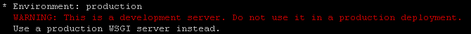

# Quickstart

本文摘自[Quickstart](https://flask.palletsprojects.com/en/1.1.x/quickstart/)

## 1. A Minimal Application

最简单的Flask应用如下：

~~~python
cat << EOF > hello.py
from flask import Flask
app = Flask(__name__)

@app.route('/')
def hello_world():
    return 'Hello, Michael!'

EOF
~~~

启动应用。

~~~shell
export FLASK_APP=hello.py
flask run --port 5001 --host 0.0.0.0
~~~

默认端口是5000.  默认情况下 ，只有本地才能访问网站，设定--host后，外部才能访问网站。

启动后会发现如下的警告。

WSGI（Web Server Gateway Interface）是Python应用程序（或者框架、套件）与服务器之间的一种接口，其定义了两者进行通信的接口规范。详见 [WSGI](..\wsgi.md) 

## 2. Debug Mode

在Debug模式下，当代码有变化，服务器会自动重新加载。

~~~
export FLASK_APP=hello.py
export FLASK_ENV=development
flask run --port 5001 --host 0.0.0.0
~~~

这种模式不能使用在production环境。

> 实际测试中，发现修改代码后，并没有重载。奇怪
>
> - 找到原因了，是版本问题，在新版1.1.1，有这个功能，而在老版0.12.2不支持
> - 这个功能还真的好用啊。
>
> 

## 3. Routing

~~~python
cat << EOF > hello.py
from flask import Flask
app = Flask(__name__)

# Routing
@app.route('/')
def index():
    return 'Index Page'

@app.route('/hello')
def hello():
    return 'Hello, World'

EOF

export FLASK_APP=hello.py
export FLASK_ENV=development
flask run --port 5001 --host 0.0.0.0
~~~

###  3.1 Variable Rules

可以获取变量。

~~~
cat << EOF > hello.py
from flask import Flask, escape 

app = Flask(__name__)

# Routing
@app.route('/')
def index():
    return 'Index Page'

@app.route('/hello')
def hello():
    return 'Hello, World'

@app.route('/user/<username>')
def show_user_profile(username):
    # show the user profile for that user
    return 'User %s' % escape(username)

# Variable Rules
@app.route('/post/<int:post_id>')
def show_post(post_id):
    # show the post with the given id, the id is an integer
    return 'Post %d' % post_id

@app.route('/path/<path:subpath>')
def show_subpath(subpath):
    # show the subpath after /path/
    return 'Subpath %s' % escape(subpath)

EOF

export FLASK_APP=hello.py
export FLASK_ENV=development
flask run --port 5001 --host 0.0.0.0
~~~

Converter types:

| Type     | Description                                |
| -------- | ------------------------------------------ |
| `string` | (default) accepts any text without a slash |
| `int`    | accepts positive integers                  |
| `float`  | accepts positive floating point values     |
| `path`   | like `string` but also accepts slashes     |
| `uuid`   | accepts UUID strings                       |

### 3.2 Unique URLs / Redirection Behavior

Routing末尾

- 有`/`， 表示该路由类似文件夹。如果访问时，没有带`/`，也会自动加上。
- 没有`/`，表示该路由类似文件。如果访问时，加`/`,  会报错。

~~~
cat << EOF > hello.py
from flask import Flask, escape 

app = Flask(__name__)

# Routing
@app.route('/')
def index():
    return 'Index Page'

@app.route('/hello')
def hello():
    return 'Hello, World'

@app.route('/projects/')
def projects():
    return 'The project page'

@app.route('/about')
def about():
    return 'The about page'

EOF

export FLASK_APP=hello.py
export FLASK_ENV=development
flask run --port 5001 --host 0.0.0.0
~~~

区分末尾`/`的好处时，便于搜索引擎能精确判断，避免同样的页面索引两次。

### 3.3 URL Building

高级版的重定向redirect。

~~~
cat << EOF > hello.py
from flask import Flask, escape, url_for

app = Flask(__name__)

@app.route('/')
def index():
    return 'index'

@app.route('/login')
def login():
    return 'login'

@app.route('/user/<username>')
def profile(username):
    return '{}\'s profile'.format(escape(username))

with app.test_request_context():
    print(url_for('index'))
    print(url_for('login'))
    print(url_for('login', next='/'))
    print(url_for('profile', username='John Doe'))

EOF

export FLASK_APP=hello.py
export FLASK_ENV=development
flask run --port 5001 --host 0.0.0.0
~~~

### 3.4 HTTP Methods

~~~
cat << EOF > hello.py
from flask import request, Flask

app = Flask(__name__)

@app.route('/login', methods=['GET', 'POST'])
def login():
    if request.method == 'POST':
        return 'post'
    else:
        return 'get'

EOF

export FLASK_APP=hello.py
export FLASK_ENV=development
flask run --port 5001 --host 0.0.0.0
~~~

## 4. Static Files

~~~
url_for('static', filename='style.css')
~~~

The file has to be stored on the filesystem as `static/style.css`.

## 5. Rendering Templates

准备模板文件

~~~
rm -rf template
mkdir templates

cat << EOF > templates/hello.html
<!doctype html>
<title>Hello from Flask</title>

  <h1>Hello {{ name }}!</h1>

  <h1>Hello, World!</h1>


EOF

cat templates/hello.html
~~~

运行应用

~~~
cat << EOF > hello.py
from flask import render_template, Flask

app = Flask(__name__)

@app.route('/hello/')
@app.route('/hello/<name>')
def hello(name=None):
    return render_template('hello.html', name=name)
    
EOF
    
export FLASK_APP=hello.py
export FLASK_ENV=development
flask run --port 5001 --host 0.0.0.0
~~~

## 6. Accessing Request Data

### 6.1 [Context Locals](https://flask.palletsprojects.com/en/1.1.x/quickstart/#context-locals)

unit test最简单方法是：test_request_context(). 

~~~python
from flask import request

with app.test_request_context('/hello', method='POST'):
    # now you can do something with the request until the
    # end of the with block, such as basic assertions:
    assert request.path == '/hello'
    assert request.method == 'POST'
~~~

### 6.2 [The Request Object](https://flask.palletsprojects.com/en/1.1.x/quickstart/#the-request-object)

The request object used by default in Flask. . Remembers the matched endpoint and view arguments.

### 6.3 [File Uploads](https://flask.palletsprojects.com/en/1.1.x/quickstart/#file-uploads)

~~~
from flask import request

@app.route('/upload', methods=['GET', 'POST'])
def upload_file():
    if request.method == 'POST':
        f = request.files['the_file']
        f.save('/var/www/uploads/uploaded_file.txt')
    ...
~~~

### 6.4 [Cookies](https://flask.palletsprojects.com/en/1.1.x/quickstart/#cookies)

读取cookies

~~~
from flask import request

@app.route('/')
def index():
    username = request.cookies.get('username')
    # use cookies.get(key) instead of cookies[key] to not get a
    # KeyError if the cookie is missing.
~~~

存储cookies

~~~
from flask import make_response

@app.route('/')
def index():
    resp = make_response(render_template(...))
    resp.set_cookie('username', 'the username')
    return resp
~~~

## 7. [Redirects and Errors](https://flask.palletsprojects.com/en/1.1.x/quickstart/#redirects-and-errors)

~~~
cat << EOF > hello.py
from flask import render_template, Flask, redirect, url_for, abort

app = Flask(__name__)

@app.route('/')
def index():
    return redirect(url_for('login'))

@app.route('/login')
def login():
    abort(401)
    this_is_never_executed()
    
    
EOF
    
export FLASK_APP=hello.py
export FLASK_ENV=development
flask run --port 5001 --host 0.0.0.0
~~~

## 8. About Responses

The return value from a view function is automatically converted into a response object for you.

~~~
@app.errorhandler(404)
def not_found(error):
    resp = make_response(render_template('error.html'), 404)
    resp.headers['X-Something'] = 'A value'
    return resp
~~~

### 8.1 [APIs with JSON](https://flask.palletsprojects.com/en/1.1.x/quickstart/#apis-with-json)

最常用response的格式是JSON。如果返回一个dict，将会自动转化为JSON Response.

~~~
@app.route("/me")
def me_api():
    user = get_current_user()
    return {
        "username": user.username,
        "theme": user.theme,
        "image": url_for("user_image", filename=user.image),
    }
~~~

## 9. [Sessions](https://flask.palletsprojects.com/en/1.1.x/quickstart/#sessions)

在一个request到下一个request之间，使用session可以存储一些用户相关信息。Flask会把Session对象中的内容保存在cookie中，所以用户可以在cookie中看到这些内容，但必须知道secret key，才能修改它。

~~~python
cat << EOF > hello.py
from flask import Flask, session, redirect, url_for, escape, request

app = Flask(__name__)

# Set the secret key to some random bytes. Keep this really secret!
app.secret_key = b'_5#y2L"F4Q8z\n\xec]/'

@app.route('/')
def index():
    if 'username' in session:
        return 'Logged in as %s' % escape(session['username'])
    return 'You are not logged in'

@app.route('/login', methods=['GET', 'POST'])
def login():
    if request.method == 'POST':
        session['username'] = request.form['username']
        return redirect(url_for('index'))
    return '''
        <form method="post">
            
<input type=text name=username>
            
<input type=submit value=Login>
        </form>
    '''

@app.route('/logout')
def logout():
    # remove the username from the session if it's there
    session.pop('username', None)
    return redirect(url_for('index'))

EOF

export FLASK_APP=hello.py
export FLASK_ENV=development
flask run --port 5001 --host 0.0.0.0
~~~

## 10. [Message Flashing](https://flask.palletsprojects.com/en/1.1.x/quickstart/#message-flashing)

 Flask provides a really simple way to give feedback to a user with the flashing system. 

## 11. [Logging](https://flask.palletsprojects.com/en/1.1.x/quickstart/#logging)

~~~
app.logger.debug('A value for debugging')
app.logger.warning('A warning occurred (%d apples)', 42)
app.logger.error('An error occurred')
~~~

## 12. [Hooking in WSGI Middlewares](https://flask.palletsprojects.com/en/1.1.x/quickstart/#hooking-in-wsgi-middlewares)

~~~
from werkzeug.contrib.fixers import LighttpdCGIRootFix
app.wsgi_app = LighttpdCGIRootFix(app.wsgi_app)
~~~

## 13. [Using Flask Extensions](https://flask.palletsprojects.com/en/1.1.x/quickstart/#using-flask-extensions)

Extensions are packages that help you accomplish common tasks. For example, Flask-SQLAlchemy provides SQLAlchemy support that makes it simple and easy to use with Flask.

## 14. [Deploying to a Web Server](https://flask.palletsprojects.com/en/1.1.x/quickstart/#deploying-to-a-web-server)

Ready to deploy your new Flask app? Go to [Deployment Options](https://flask.palletsprojects.com/en/1.1.x/deploying/#deployment).