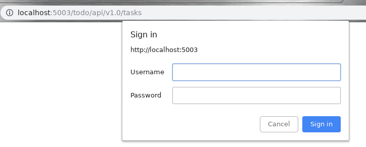

# 使用 Python 和 Flask 设计 RESTful API

本文摘自[Restful](http://www.pythondoc.com/flask-restful/first.html). 

##  什么是 REST？

近些年来 REST (REpresentational State Transfer) 已经变成了 web services 和 web APIs 的标配。

六条设计规范定义了一个 REST 系统的特点:

- **客户端-服务器**: 客户端和服务器之间隔离，服务器提供服务，客户端进行消费。
- **无状态**: 从客户端到服务器的每个请求都必须包含理解请求所必需的信息。换句话说， 服务器不会存储客户端上一次请求的信息用来给下一次使用。
- **可缓存**: 服务器必须明示客户端请求能否缓存。
- **分层系统**: 客户端和服务器之间的通信应该以一种标准的方式，就是中间层代替服务器做出响应的时候，客户端不需要做任何变动。
- **统一的接口**: 服务器和客户端的通信方法必须是统一的。
- **按需编码**: 服务器可以提供可执行代码或脚本，为客户端在它们的环境中执行。这个约束是唯一一个是可选的。

## 什么是一个 RESTful 的 web service？

REST 架构的最初目的是适应万维网的 HTTP 协议。

RESTful web services 概念的核心就是“资源”。 资源可以用 [URI](https://en.wikipedia.org/wiki/Uniform_resource_identifier) 来表示。客户端使用 HTTP 协议定义的方法来发送请求到这些 URIs，当然可能会导致这些被访问的”资源“状态的改变。

HTTP 标准的方法有如下:

```
==========  =====================  ==================================
HTTP 方法   行为                   示例
==========  =====================  ==================================
GET         获取资源的信息         http://example.com/api/orders
GET         获取某个特定资源的信息 http://example.com/api/orders/123
POST        创建新资源             http://example.com/api/orders
PUT         更新资源               http://example.com/api/orders/123
DELETE      删除资源               http://example.com/api/orders/123
==========  ====================== ==================================
```

REST 设计不需要特定的数据格式。在请求中数据可以以 [JSON](http://en.wikipedia.org/wiki/JSON) 形式, 或者有时候作为 url 中查询参数项。

## 设计一个简单的 web service

坚持 REST 的准则设计一个 web service 或者 API 的任务就变成一个标识资源被展示出来以及它们是怎样受不同的请求方法影响的练习。

比如说，我们要编写一个待办事项应用程序而且我们想要为它设计一个 web service。要做的第一件事情就是决定用什么样的根 URL 来访问该服务。例如，我们可以通过这个来访问:

http://[hostname]/todo/api/v1.0/

在这里我已经决定在 URL 中包含应用的名称以及 API 的版本号。在 URL 中包含应用名称有助于提供一个命名空间以便区分同一系统上的其它服务。在 URL 中包含版本号能够帮助以后的更新，如果新版本中存在新的和潜在不兼容的功能，可以不影响依赖于较旧的功能的应用程序。

下一步骤就是选择将由该服务暴露(展示)的资源。这是一个十分简单地应用，我们只有任务，因此在我们待办事项中唯一的资源就是任务。

我们的任务资源将要使用 HTTP 方法如下:

```
==========  ===============================================  =============================
HTTP 方法   URL                                              动作
==========  ===============================================  ==============================
GET         http://[hostname]/todo/api/v1.0/tasks            检索任务列表
GET         http://[hostname]/todo/api/v1.0/tasks/[task_id]  检索某个任务
POST        http://[hostname]/todo/api/v1.0/tasks            创建新任务
PUT         http://[hostname]/todo/api/v1.0/tasks/[task_id]  更新任务
DELETE      http://[hostname]/todo/api/v1.0/tasks/[task_id]  删除任务
==========  ================================================ =============================
```

我们定义的任务有如下一些属性:

- **id**: 任务的唯一标识符。数字类型。
- **title**: 简短的任务描述。字符串类型。
- **description**: 具体的任务描述。文本类型。
- **done**: 任务完成的状态。布尔值。

## 使用 Python 和 Flask 实现 RESTful services

在 Flask 中有许多扩展来帮助我们构建 RESTful services，但是在我看来这个任务十分简单，没有必要使用 Flask 扩展。

~~~python
cat << EOF > task.py
#!../venv/bin/python

import logging

from flask import Flask, jsonify
from flask import abort
from flask import make_response
from flask import request

app = Flask(__name__)

tasks = [
    {
        'id': 1,
        'title': u'Buy groceries',
        'description': u'Milk, Cheese, Pizza, Fruit, Tylenol',
        'done': False
    },
    {
        'id': 2,
        'title': u'Learn Python',
        'description': u'Need to find a good Python tutorial on the web',
        'done': False
    }
]


@app.route('/todo/api/v1.0/tasks', methods=['GET'])
def get_tasks():
    return jsonify({'tasks': tasks})


@app.route('/todo/api/v1.0/tasks/<int:task_id>', methods=['GET'])
def get_task(task_id):
    task = list(filter(lambda t: t['id'] == task_id, tasks))
    if len(task) == 0:
        abort(404)
    return jsonify({'task': task[0]})

@app.errorhandler(404)
def not_found(error):
    return make_response(jsonify({'error': 'Not found'}), 404)


@app.route('/todo/api/v1.0/tasks', methods=['POST'])
def create_task():
    if not request.json or not 'title' in request.json:
        abort(400)
    task = {
        'id': tasks[-1]['id'] + 1,
        'title': request.json['title'],
        'description': request.json.get('description', ""),
        'done': False
    }
    tasks.append(task)
    return jsonify({'task': task}), 201


@app.route('/todo/api/v1.0/tasks/<int:task_id>', methods=['PUT'])
def update_task(task_id):
    task = list(filter(lambda t: t['id'] == task_id, tasks))
    if len(task) == 0:
        abort(404)
    if not request.json:
        abort(400)
    if 'title' in request.json and type(request.json['title']) != unicode:
        abort(400)
    if 'description' in request.json and type(request.json['description']) is not unicode:
        abort(400)
    if 'done' in request.json and type(request.json['done']) is not bool:
        abort(400)
    task[0]['title'] = request.json.get('title', task[0]['title'])
    task[0]['description'] = request.json.get('description', task[0]['description'])
    task[0]['done'] = request.json.get('done', task[0]['done'])
    return jsonify({'task': task[0]})


@app.route('/todo/api/v1.0/tasks/<int:task_id>', methods=['DELETE'])
def delete_task(task_id):
    task = list(filter(lambda t: t['id'] == task_id, tasks))
    if len(task) == 0:
        abort(404)
    tasks.remove(task[0])
    return jsonify({'result': True})


if __name__ == '__main__':
    app.run(host='0.0.0.0', port=5003, debug=True)
    
EOF

ps -ef | grep -E "task.py"
ps -ef | grep -E "task.py" > process.txt
grep  -E 'python' process.txt | awk '{ print $2 }' | while read process_id
do
    kill -9 $process_id 
done
ps -ef | grep -E "task.py"

./task.py
~~~

测试

~~~
curl -i http://localhost:5003/todo/api/v1.0/tasks
curl -i http://localhost:5003/todo/api/v1.0/tasks/2
curl -i http://localhost:5003/todo/api/v1.0/tasks/3
curl -i -H "Content-Type: application/json" -X POST  http://localhost:5003/todo/api/v1.0/tasks -d '{"title":"Read a book"}'
curl -i -H "Content-Type: application/json" -X PUT http://localhost:5003/todo/api/v1.0/tasks/2 -d '{"done":true}' 

curl -i -H "Content-Type: application/json" -X DELETE http://localhost:5003/todo/api/v1.0/tasks/2 
~~~

## 优化 web service 接口

目前 API 的设计的问题就是迫使客户端在任务标识返回后去构造 URIs。这对于服务器是十分简单的，但是间接地迫使客户端知道这些 URIs 是如何构造的，这将会阻碍我们以后变更这些 URIs。

不直接返回任务的 ids，我们直接返回控制这些任务的完整的 URI，以便客户端可以随时使用这些 URIs。为此，我们可以写一个小的辅助函数生成一个 “公共” 版本任务发送到客户端:

~~~
from flask import url_for

def make_public_task(task):
    new_task = {}
    for field in task:
        if field == 'id':
            new_task['uri'] = url_for('get_task', task_id=task['id'], _external=True)
        else:
            new_task[field] = task[field]
    return new_task

@app.route('/todo/api/v1.0/tasks', methods=['GET'])
def get_tasks():
    return jsonify({'tasks': map(make_public_task, tasks)})
~~~

修改的文件如下：

~~~
cat << EOF > task.py
#!../venv/bin/python

import logging

from flask import Flask, jsonify
from flask import abort
from flask import make_response
from flask import request
from flask import url_for

app = Flask(__name__)

tasks = [
    {
        'id': 1,
        'title': u'Buy groceries',
        'description': u'Milk, Cheese, Pizza, Fruit, Tylenol',
        'done': False
    },
    {
        'id': 2,
        'title': u'Learn Python',
        'description': u'Need to find a good Python tutorial on the web',
        'done': False
    }
]

def make_public_task(task):
    new_task = {}
    for field in task:
        if field == 'id':
            new_task['uri'] = url_for('get_task', task_id=task['id'], _external=True)
        else:
            new_task[field] = task[field]
    return new_task


@app.route('/todo/api/v1.0/tasks', methods=['GET'])
def get_tasks():
    return jsonify({'tasks': list(map(make_public_task, tasks))})


@app.route('/todo/api/v1.0/tasks/<int:task_id>', methods=['GET'])
def get_task(task_id):
    task = list(filter(lambda t: t['id'] == task_id, tasks))
    if len(task) == 0:
        abort(404)
    return jsonify({'task': task[0]})

@app.errorhandler(404)
def not_found(error):
    return make_response(jsonify({'error': 'Not found'}), 404)


@app.route('/todo/api/v1.0/tasks', methods=['POST'])
def create_task():
    if not request.json or not 'title' in request.json:
        abort(400)
    task = {
        'id': tasks[-1]['id'] + 1,
        'title': request.json['title'],
        'description': request.json.get('description', ""),
        'done': False
    }
    tasks.append(task)
    return jsonify({'task': task}), 201


@app.route('/todo/api/v1.0/tasks/<int:task_id>', methods=['PUT'])
def update_task(task_id):
    task = list(filter(lambda t: t['id'] == task_id, tasks))
    if len(task) == 0:
        abort(404)
    if not request.json:
        abort(400)
    if 'title' in request.json and type(request.json['title']) != unicode:
        abort(400)
    if 'description' in request.json and type(request.json['description']) is not unicode:
        abort(400)
    if 'done' in request.json and type(request.json['done']) is not bool:
        abort(400)
    task[0]['title'] = request.json.get('title', task[0]['title'])
    task[0]['description'] = request.json.get('description', task[0]['description'])
    task[0]['done'] = request.json.get('done', task[0]['done'])
    return jsonify({'task': task[0]})


@app.route('/todo/api/v1.0/tasks/<int:task_id>', methods=['DELETE'])
def delete_task(task_id):
    task = list(filter(lambda t: t['id'] == task_id, tasks))
    if len(task) == 0:
        abort(404)
    tasks.remove(task[0])
    return jsonify({'result': True})


if __name__ == '__main__':
    app.run(host='0.0.0.0', port=5003, debug=True)
    
EOF

ps -ef | grep -E "task.py"
ps -ef | grep -E "task.py" > process.txt
grep  -E 'python' process.txt | awk '{ print $2 }' | while read process_id
do
    kill -9 $process_id 
done
ps -ef | grep -E "task.py"

./task.py
~~~

测试

~~~
curl -i http://localhost:5003/todo/api/v1.0/tasks
~~~

返回结果如下：

~~~
HTTP/1.0 200 OK
Content-Type: application/json
Content-Length: 407
Server: Werkzeug/0.15.6 Python/3.6.3
Date: Mon, 23 Sep 2019 05:13:47 GMT

{
  "tasks": [
    {
      "description": "Milk, Cheese, Pizza, Fruit, Tylenol",
      "done": false,
      "title": "Buy groceries",
      "uri": "http://localhost:5003/todo/api/v1.0/tasks/1"
    },
    {
      "description": "Need to find a good Python tutorial on the web",
      "done": false,
      "title": "Learn Python",
      "uri": "http://localhost:5003/todo/api/v1.0/tasks/2"
    }
  ]
}

~~~

## 加强 RESTful web service 的安全性

HTTP 协议提供了两种认证机制: [Basic 和 Digest](http://www.ietf.org/rfc/rfc2617.txt)。

安装扩展

~~~
pip install flask-httpauth
~~~

我们希望 web service 只让访问用户名 eipi10和密码 abcd的客户端访问。 我们可以设置一个基本的 HTTP 验证如下:

~~~
from flask_httpauth import HTTPBasicAuth
auth = HTTPBasicAuth()

@auth.get_password
def get_password(username):
    if username == 'miguel':
        return 'python'
    return None

@auth.error_handler
def unauthorized():
    return make_response(jsonify({'error': 'Unauthorized access'}), 401)
    
@app.route('/todo/api/v1.0/tasks', methods=['GET'])
@auth.login_required
def get_tasks():
    return jsonify({'tasks': tasks})
~~~

修改后代码如下:

~~~
cat << EOF > task.py
#!../venv/bin/python

import logging

from flask import Flask, jsonify
from flask import abort
from flask import make_response
from flask import request
from flask import url_for
from flask_httpauth import HTTPBasicAuth

app = Flask(__name__)
auth = HTTPBasicAuth()

tasks = [
    {
        'id': 1,
        'title': u'Buy groceries',
        'description': u'Milk, Cheese, Pizza, Fruit, Tylenol',
        'done': False
    },
    {
        'id': 2,
        'title': u'Learn Python',
        'description': u'Need to find a good Python tutorial on the web',
        'done': False
    }
]

def make_public_task(task):
    new_task = {}
    for field in task:
        if field == 'id':
            new_task['uri'] = url_for('get_task', task_id=task['id'], _external=True)
        else:
            new_task[field] = task[field]
    return new_task


@auth.get_password
def get_password(username):
    if username == 'eipi10':
        return 'abcd'
    return None

@auth.error_handler
def unauthorized():
    return make_response(jsonify({'error': 'Unauthorized access'}), 401)
    
@app.route('/todo/api/v1.0/tasks', methods=['GET'])
@auth.login_required
def get_tasks():
    return jsonify({'tasks': list(map(make_public_task, tasks))})


@app.route('/todo/api/v1.0/tasks/<int:task_id>', methods=['GET'])
def get_task(task_id):
    task = list(filter(lambda t: t['id'] == task_id, tasks))
    if len(task) == 0:
        abort(404)
    return jsonify({'task': task[0]})

@app.errorhandler(404)
def not_found(error):
    return make_response(jsonify({'error': 'Not found'}), 404)


@app.route('/todo/api/v1.0/tasks', methods=['POST'])
def create_task():
    if not request.json or not 'title' in request.json:
        abort(400)
    task = {
        'id': tasks[-1]['id'] + 1,
        'title': request.json['title'],
        'description': request.json.get('description', ""),
        'done': False
    }
    tasks.append(task)
    return jsonify({'task': task}), 201


@app.route('/todo/api/v1.0/tasks/<int:task_id>', methods=['PUT'])
def update_task(task_id):
    task = list(filter(lambda t: t['id'] == task_id, tasks))
    if len(task) == 0:
        abort(404)
    if not request.json:
        abort(400)
    if 'title' in request.json and type(request.json['title']) != unicode:
        abort(400)
    if 'description' in request.json and type(request.json['description']) is not unicode:
        abort(400)
    if 'done' in request.json and type(request.json['done']) is not bool:
        abort(400)
    task[0]['title'] = request.json.get('title', task[0]['title'])
    task[0]['description'] = request.json.get('description', task[0]['description'])
    task[0]['done'] = request.json.get('done', task[0]['done'])
    return jsonify({'task': task[0]})


@app.route('/todo/api/v1.0/tasks/<int:task_id>', methods=['DELETE'])
def delete_task(task_id):
    task = list(filter(lambda t: t['id'] == task_id, tasks))
    if len(task) == 0:
        abort(404)
    tasks.remove(task[0])
    return jsonify({'result': True})


if __name__ == '__main__':
    app.run(host='0.0.0.0', port=5003, debug=True)
    
EOF

ps -ef | grep -E "task.py"
ps -ef | grep -E "task.py" > process.txt
grep  -E 'python' process.txt | awk '{ print $2 }' | while read process_id
do
    kill -9 $process_id 
done
ps -ef | grep -E "task.py"

./task.py
~~~

测试。

~~~
curl -i http://localhost:5003/todo/api/v1.0/tasks   # 会报Unauthorized access
curl -u eipi10:abcd -i http://localhost:5003/todo/api/v1.0/tasks 
~~~

认证扩展给予我们很大的自由选择哪些函数需要保护，哪些函数需要公开。

为了确保登录信息的安全应该使用 HTTP 安全服务器(例如: [https://](https:)...)，这样客户端和服务器之间的通信都是加密的，以防止传输过程中第三方看到认证的凭据。

让人不舒服的是当请求收到一个 401 的错误，网页浏览（http://localhost:5003/todo/api/v1.0/tasks）都会跳出一个丑陋的登录框，即使请求是在后台发生的。因此如果我们要实现一个完美的 web 服务器的话，我们就需要禁止跳转到浏览器显示身份验证对话框，让我们的客户端应用程序自己处理登录。



一个简单的方式就是不返回 401 错误。403 错误是一个令人青睐的替代，403 错误表示 “禁止” 的错误:

~~~
@auth.error_handler
def unauthorized():
    return make_response(jsonify({'error': 'Unauthorized access'}), 403)
~~~

~~~
sed -i 's/401/403/g' task.py
~~~

在浏览其中测试：

~~~
http://localhost:5003/todo/api/v1.0/tasks
~~~

## 可能的改进

-  需要一个真实的数据库进行支撑
- 处理多用户
- GET 检索任务列表请求可以在几个方面进行扩展。
  - 可以携带一个可选的页的参数，以便客户端请求任务的一部分。
  - 允许按照一定的标准筛选。比如，用户只想要看到完成的任务，或者只想看到任务的标题以 A 字母开头。

