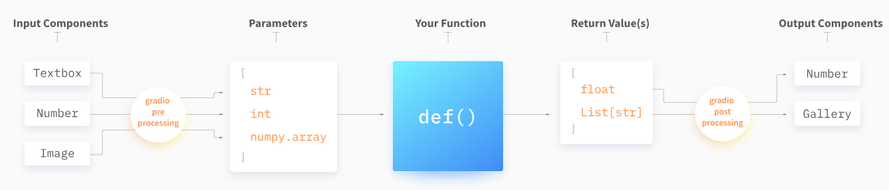
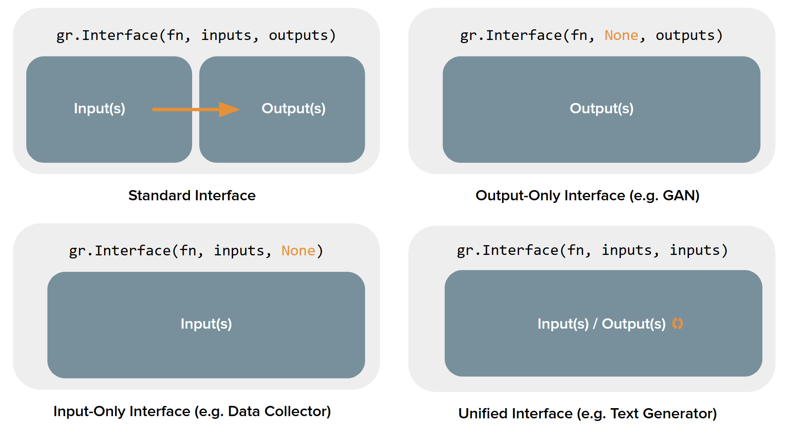
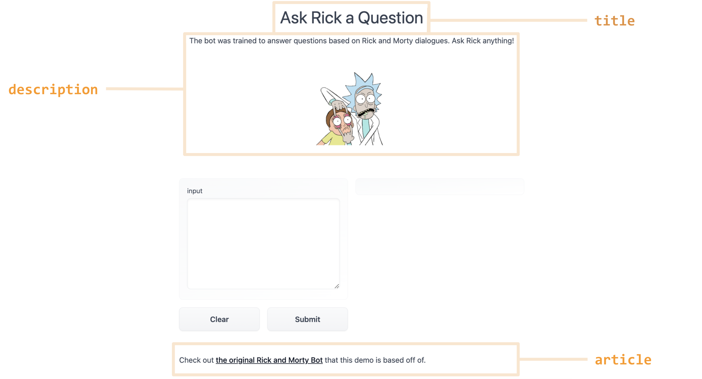

### [Documentation](https://www.gradio.app/docs)

[Quickstart](https://www.gradio.app/guides/quickstart)

## [awesome-demos: links and status of cool gradio demos](https://github.com/gradio-app/awesome-demos)

### [Playground](https://www.gradio.app/playground)

### Key Features



### [Theming](https://www.gradio.app/guides/theming-guide)

radio comes with a set of prebuilt themes which you can load from `gr.themes.*`. These are:

- `gr.themes.Base()`
- `gr.themes.Default()`
- `gr.themes.Glass()`
- `gr.themes.Monochrome()`
- `gr.themes.Soft()`

### [The 4 Kinds of Gradio Interfaces](https://www.gradio.app/guides/four-kinds-of-interfaces)



- Standard demos: 既有单独输入又有单独输出的演示（例如图像分类器或语音转文本模型）

- Output-only demos: 仅产生输出而不接受任何输入的演示（例如无条件图像生成模型）

- Input-only demos: 仅接受输入但不产生任何输出的演示（例如一个将您上传的图像保存到持久性外部数据库的演示）

- Unified demos: 既有输入组件又有输出组件，但输入和输出组件是相同的。这意味着产生的输出会覆盖输入（例如文本自动完成模型）

### Descriptive Content

There are three arguments in the `Interface` constructor to specify where this content should go:

- `title`: which accepts text and can display it at the very top of interface, and also becomes the page title.
- `description`: which accepts text, markdown or HTML and places it right under the title.
- `article`: which also accepts text, markdown or HTML and places it below the interface.



另一个有用的关键字参数是label=，它出现在每个组件中。这会修改每个组件顶部的标签文本。您还可以向Textbox或Radio等表单元素添加info=关键字参数，以提供有关其用法的进一步信息。

```python
gr.Number(label='Age', info='In years, must be greater than 0')
```

### Queuing

每个Gradio应用程序都有一个内置的排队系统，可以扩展到数千个并发用户。由于许多事件侦听器可能涉及繁重的处理，因此grado会自动创建一个队列来处理后端中的每个事件侦听器。应用程序中的每个事件监听器都自动有一个队列来处理传入的事件。

- concurrency_limit: 这将设置事件侦听器的最大并发执行数。默认情况下，该限制为1，除非在Blocks.queue（）中另行配置。您也可以将其设置为None，表示没有限制（即，无限数量的并发执行）
- concurrency_id: 这允许事件侦听器通过为它们分配相同的ID来共享队列。例如，如果您的设置只有2个GPU，但多个功能需要GPU访问，您可以为所有这些功能创建一个共享队列。

```
import gradio as gr

with gr.Blocks() as demo:
    prompt = gr.Textbox()
    image = gr.Image()
    generate_btn_1 = gr.Button("Generate Image via model 1")
    generate_btn_2 = gr.Button("Generate Image via model 2")
    generate_btn_3 = gr.Button("Generate Image via model 3")
    generate_btn_1.click(image_gen_1, prompt, image, concurrency_limit=2, concurrency_id="gpu_queue")
    generate_btn_2.click(image_gen_2, prompt, image, concurrency_id="gpu_queue")
    generate_btn_3.click(image_gen_3, prompt, image, concurrency_id="gpu_queue")
```
